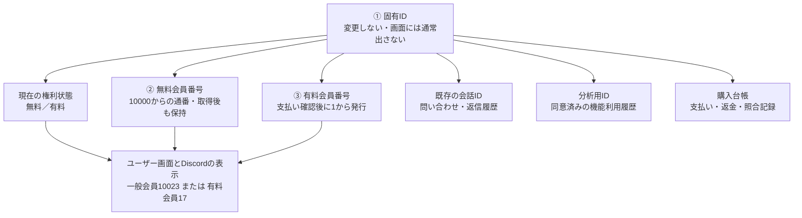
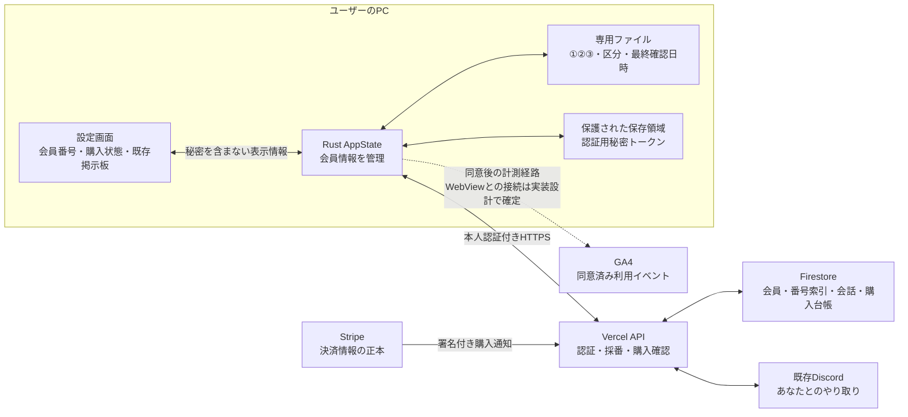
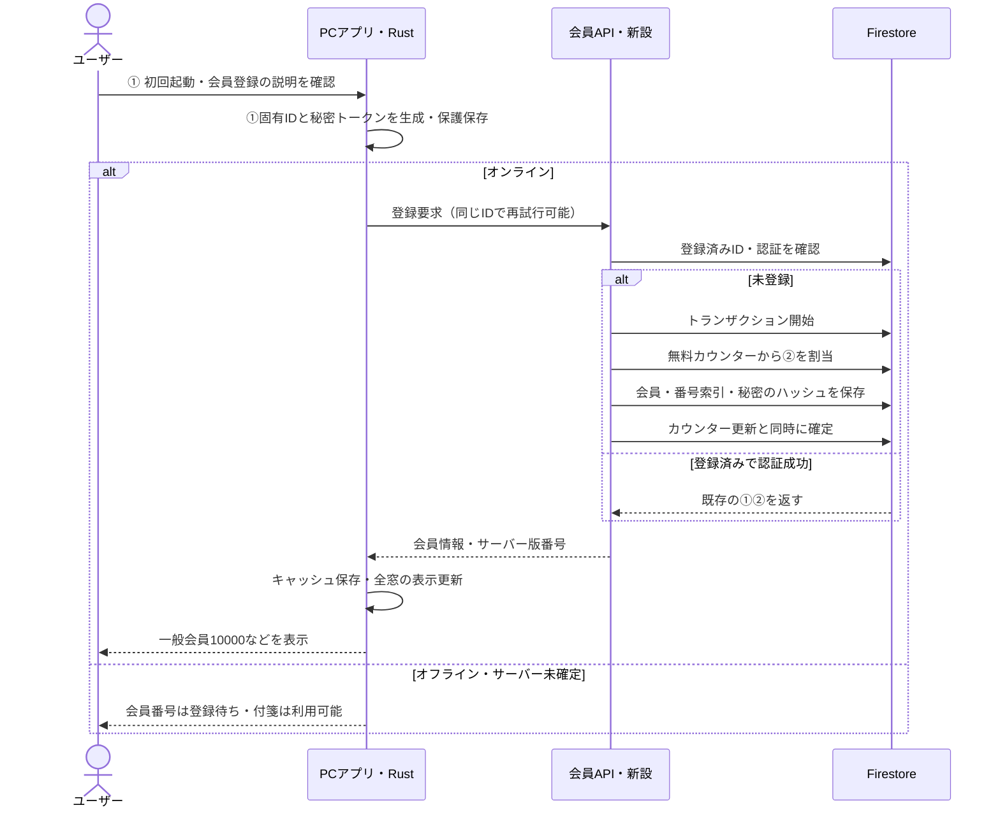
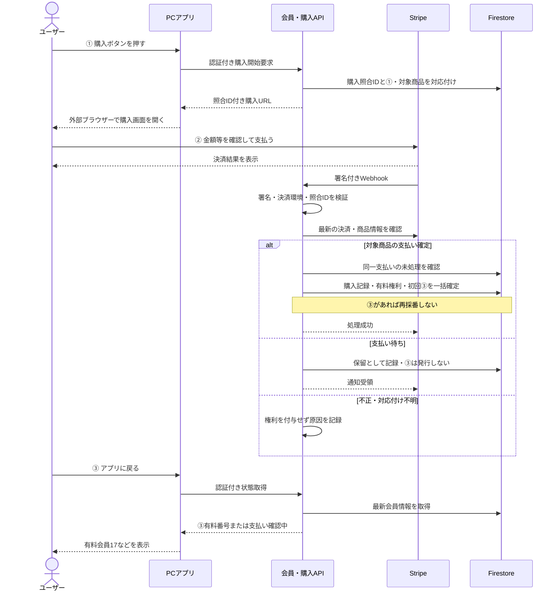
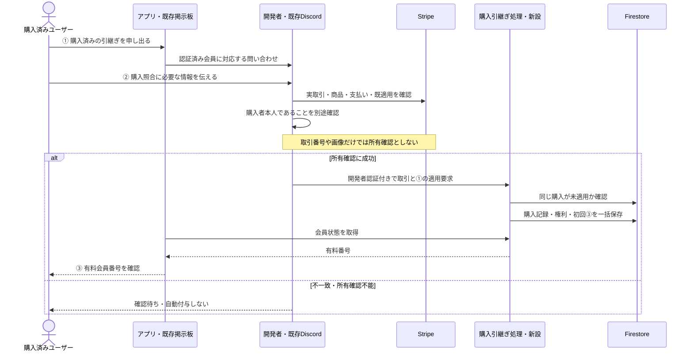
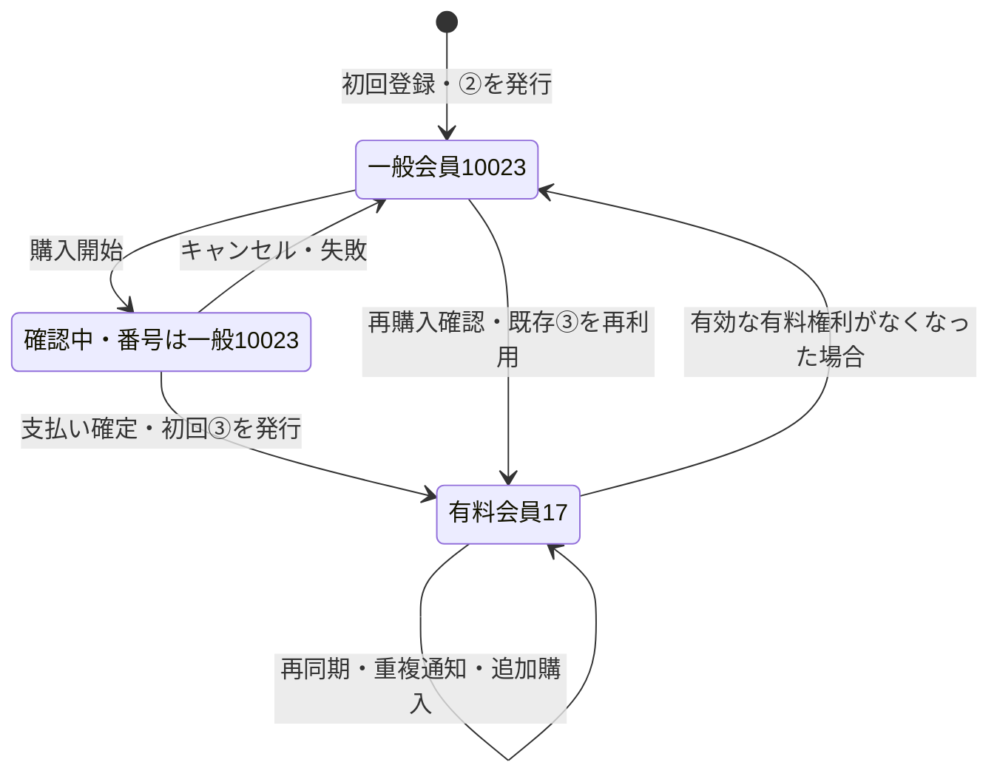

# 会員登録・購入確認・有料番号自動発行 設計書

版: 0.1 / 作成日: 2026-09-04 / 状態: レビュー用・未実装

本書はユーザー操作とシステム動作の提案である。既存の設定画面・掲示板・Discord・Stripe購入リンクを活用する。新しい会員管理画面は前提にしない。StripeとFirestoreの本番設定は未確認のため、外部連携の実装前確認を必要とする。

## 1. 全体像 — 番号が変わっても同じ会員

図 1-1　①を中心に番号・権利・履歴を管理する構造

ユーザーは会員番号だけを見ればよい。システムは①で相手を特定する。②から③へ表示が変わっても、会話IDと分析用IDを変えない。例の10023と17は架空の番号である。

固定IDは初版ではアプリ個体単位であり、人物の本人確認を意味しない。複数PCを同じ会員にする操作は別途定義する。番号だけでは認証できず、認証用の秘密トークンを別に持つ。

## 2. 保存場所 — 正本はサーバー、PCは自分の情報だけ

図 2-1　データの配置と既存サービスの役割

表 2-1　サーバーの保存構造案

| 保存先 | 内容 | 更新権限 |
|---|---|---|
| members/{固有ID} | ②③、現在区分、初回登録日時、初回有料確認日時、版番号 | 認証・購入確認を行うAPI |
| member_numbers/{区分}_{番号} | 番号から①への逆引き | 採番処理のみ |
| member_counters/general・paid | 次の番号。初期値10000・1 | 採番トランザクションのみ |
| member_credentials/{資格情報ID} | ①、秘密のハッシュ、失効状態 | 認証処理のみ |
| member_conversations/{会話ID} | 既存会話と①の対応 | 旧会話の所有確認後 |
| member_analytics/{分析ID} | ①と分析IDの対応、連結同意 | 必要なAPI・管理者のみ |
| member_purchases/{支払いID} | ①、商品、支払い状態、確認日時 | 検証済み購入処理のみ |
| payment_events/{イベントID} | 決済通知の処理済み状態 | Webhook処理のみ |
| 既存feedback_conversations配下 | 問い合わせ・返信 | 既存経路を認証修正して維持 |

会員番号・権利の正本はFirestoreとする。PCファイルを書き換えてもサーバーの権利は変わらない。Firestoreの設定不備をメモリ保存で代替しない。現在の問い合わせストアにはメモリ代替があるため、会員台帳へそのまま流用しない。

秘密は通常のsettings.json、全窓通知、GA4、Discord、ログへ出さない。既存のsettings.rsは設定全体を返して通知するため、秘密をSettingsに追加するだけの変更は行わない。Windowsでの具体的な保護方法は実装前に確認する。

## 3. 初回登録 — ユーザーは番号を入力しない

図 3-1　初回登録と無料番号の自動採番

ユーザーは番号を決めたり入力したりしない。会員番号用の登録と利用分析への同意を分け、分析を拒否しても番号と問い合わせを利用できるようにする。登録説明の表示位置・文言は既存初回UIへ合わせる。

登録応答が失われても、PCが保存した同じ①と資格情報で再要求する。サーバーは同じ番号を返し、別の秘密で既存①を上書きさせない。競合時はFirestoreのトランザクションを再試行する。[Firestore公式仕様](https://firebase.google.com/docs/firestore/manage-data/transactions)

## 4. アプリから購入 — 支払い後に有料番号を自動発行

図 4-1　ユーザーは購入するだけ、システムが確認・採番する

### ユーザーがすること

購入ボタンを押す、Stripeで支払う、アプリへ戻る。通常経路では領収書送付や番号入力を求めない。「有料登録が完了しました」と現在の番号を表示し、確認が遅い場合は「支払い確認中」「状態を更新」を表示する。再購入を促して解決しない。

### システムがすること

購入URLの照合IDは推測困難な参照値であり、認証トークンではない。会員番号を直接URLへ入れない。リンクのコピー・共有により誤った会員へ購入が対応するリスクがあるため、購入開始時に対象の会員番号をアプリで明示し、リンクを共有しない案内を付ける。誤適用は本人確認後の移管として扱う。

第一候補は既存Stripe Payment Linkの維持である。client_reference_idで購入照合IDを渡せる。[Stripe公式仕様](https://docs.stripe.com/payment-links/url-parameters?locale=en-GB)

購入ページを開いた事実、成功URLへのアクセス、クライアントからの「購入済み」申告では権利を付けない。署名を検証した通知とStripe側の支払い状態を使う。遅延決済は成功通知まで待ち、同じ支払いは複数回処理されても一度だけ適用する。[Stripe公式仕様](https://docs.stripe.com/checkout/fulfillment)

WebhookのDB更新失敗は成功扱いせず再配送可能にする。照合できない支払いは購入者の確認対象として保存し、捨てない。期限は購入開始の許可と支払い照合を分け、開始済みの遅延決済が後日成功しても照合できるよう対応を残す。アプリを閉じても、次の起動・状態確認で番号を取得できる。

## 5. すでに支払った人・アプリ外で支払った人

図 5-1　照合情報がない既存購入は、確認してから引き継ぐ

最初は既存の掲示板・Discordで受け付ける。開発者の適用処理は認証付きの限定操作として新設し、公開の番号入力フォームから有料化させない。購入内容をGAへ送らない。カード番号等は要求しない。

既存購入者の所有確認は未確定であり、この経路の実装前条件である。候補はStripe取引上の購入者連絡先を実際に利用できるか確認する方法。メール確認を採用する場合は送信基盤・期限付き確認コード・試行制限が追加で必要になる。会話を送れたことだけでは購入所有の証明にならない。

初版では既存購入分の自動照合を約束しない。確認後の採番とアプリ反映は自動化できる。すでに他会員へ適用済みの購入は二重適用せず、移管・複数端末の方針に沿って別扱いとする。

## 6. 番号変更と問い合わせ・分析の継続

図 6-1　①は固定したまま、表示番号と権利状態だけを変更する

返金・紛争時の権利取消条件は未決定。本図は「取消が決定した場合」の遷移を示す。返金通知が1件来ただけで、複数購入を持つ会員を一律無料化しない。購入台帳から権利を再評価する。

- ②③はいずれも保管し、他人に再割当しない。現在区分から表示番号を選ぶ。
- Discordの通知には区分と現在番号を付ける。既存のメッセージID→会話IDによる返信先解決を維持する。
- 分析用IDも番号変更で変えない。一般期間と有料期間を比較する際は、その時点の区分を用いる。
- 有料10000と一般10000は別の番号枠。区分＋番号で解決し、番号だけで宛先を自動決定しない。
- 会員番号は累計人数そのものではない。再インストール等で同一人物が複数登録になる可能性がある。

## 7. ユーザー画面の変更範囲

表 7-1　既存設定画面へ追加する表示・操作案

| 状態 | 表示 | ユーザー操作 |
|---|---|---|
| 登録待ち | 会員番号を登録中／接続時に登録 | 付箋をそのまま使える |
| 一般 | 一般会員10023 | 番号コピー・購入 |
| 購入確認中 | 支払い状況を確認しています | 状態を更新・既存掲示板で問い合わせ |
| 有料 | 有料会員17 | 番号コピー・既存掲示板で問い合わせ |
| 過去購入を引継ぎたい | 購入済みの方 | 掲示板で照合を依頼 |
| オフライン | 最終確認した区分・番号、未同期表示 | 接続後に更新 |

全体の登録数や他人の利用状況はユーザー画面に出さない。新しい開発者管理画面は本書の対象外。PC買替えや番号を失った場合は、番号入力のみでは復元しない。旧端末による承認または所有確認の別設計が必要。

## 8. 既存コードとの差分と実装順

表 8-1　主要ファイルと変更内容

| 順 | 対象 | 内容 |
|---|---|---|
| 1 | app/api/feedback/conversation/messages/route.ts、app/api/feedback/route.ts、app/api/feedback/lib/store.ts | 既存会話の認証前履歴参照と秘密上書き経路を修正。初回日時を保持 |
| 2 | 新規の会員API・会員ストア | ①②③、採番、番号索引、購入台帳、認証。Firestore必須 |
| 3 | src-tauri/src/state.rs、lib.rs、新規会員モジュール | PC内の状態・保護保存・会員通信・非秘密の画面通知 |
| 4 | app/utils/feedbackConversation.ts、components/ui/settings-page.tsx | 既存会話認証を確認して移行。会員番号表示と既存返信の継続 |
| 5 | 新規購入開始API・Stripe Webhook、既存購入リンク導線 | 認証済み購入照合・支払い確認・自動有料番号発行 |
| 6 | app/components/AnalyticsLoader.tsx、app/utils/analytics.ts、同意UI | 番号変更で分断しない分析識別。会話/決済と連結する同意の説明 |
| 7 | docs-v2/000_REQUIREMENTS.md、002_PC.md、007_COMMUNICATION.md、100_PRIVACY.md | 承認後に正式仕様へ反映 |

既存設計との対応: PC設計の図2-4の設定読込・初期化に図3-1を追加し、コミュニケーション設計の会話送信/返信先を維持する。正式仕様にない採番と購入確認は、本書の図3-1・4-1・5-1で追加定義する。アプリ保存や付箋データ形式は変更対象にしない。

## 9. 実装前条件と合格条件

表 9-1　未確認事項

| 確認事項 | 現状 |
|---|---|
| Firestore本番接続・権限・保持方針 | コードは対応。本番設定は未確認 |
| Stripe商品・自由金額・支払い方法・Webhook設定 | 購入リンクのみソース確認済み |
| 有料対象商品の範囲・0円決済の扱い | 要確定。リンククリックや任意の支払いで付与しない |
| 既存購入者の所有確認・採番順 | 確認順を基本案とするが未確定 |
| 返金・紛争・複数PC・復元 | 権利方針と本人確認手段を要確定 |
| 会員と利用分析の連結同意 | 既存説明の更新が必要 |

表 9-2　必須テスト

| テスト | 合格条件 |
|---|---|
| 同時無料登録・応答消失・再試行 | 同じ①は同じ②、別会員は重複しない |
| 通知重複・順序逆転・DB失敗 | 購入は一度だけ適用し、初回③を二重発行しない |
| 支払い保留・失敗・別商品・テスト決済 | 本番有料番号を発行しない |
| 一般→有料→取消→再購入 | ①、会話ID、分析用IDを保持する |
| 他人の番号・偽トークン・署名なし通知 | 会話取得・権利変更を拒否する |
| 一般10000と有料10000 | 番号枠を取り違えない |
| 旧会話の移行 | 過去メッセージと返信先を保持する |
| 同意拒否・撤回 | 番号・問い合わせは利用でき、分析送信/連結を停止する |
| アプリ終了中に支払い確定 | 次回の状態取得で有料番号が表示される |

実装済みの動作ではなく、上記を満たす実装と検証を今後行うための設計書である。
