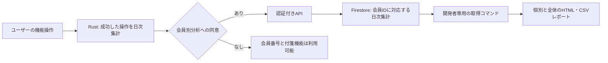

# 会員番号・機能使用状況の初回リリース案

2026-09-04。ユーザーは会員番号の土台に加えて「誰がどの機能を使ったか」が分かるところまでを今回のリリース範囲に指定し、収集・レポート方式をOKで承認した。実装中。正式仕様はdocs-v2/009_MEMBERSHIP.md、最新の進捗と残課題はCURRENT.mdを参照。

## 1. 完成条件

- 固定ID①、一般番号②10000〜を発行。有料番号③は将来1〜を対応付けられる。購入連携未実装を未購入とは扱わない。
- 既存設定画面に番号とコピーを追加。既存問い合わせとDiscordで同じ会員を追える。
- 開発者が会員番号を指定し、期間内の機能別利用日数・最後の利用日・計測状況を確認できる。
- 全体の機能別利用会員数/対象会員数、利用率、最新の付箋枚数範囲別人数を確認できる。
- 計測未同意、旧版、欠損、対象外を利用ゼロと表示しない。人の本人認証ではなくアプリ個体単位であることを明示。
- 新しい番号発行の順序は登録順。既存ユーザーの過去の利用開始順は復元できない。

## 2. 収集・閲覧の具体案

> 26-09-05 方針変更: 本書の日次Firestore集計案は撤回した。正しい仕様は `docs-v2/009_MEMBERSHIP.md` の低負荷ローカル月次集計・GA4送信である。本書の以下の記述は変更経緯としてのみ残し、実装根拠にしない。

GA4へのイベント送信だけに完成判定を依存させず、同意済みの会員について最小の日次集計をFirestoreに保存する新経路を提案する。現行仕様はGA4への匿名送信だけのため、既存同意を自動流用しない。この変更を確認後、正式仕様・同意説明を更新して実装する。

図 2-1　収集から確認までの提案。利用者向けの管理画面は新設しない。

閲覧は初版では開発者PCの取得コマンドで期間・任意の会員番号を指定し、ローカルHTMLとCSVを生成する。Web管理画面の新設は前提にしない。取得権限はサーバー側で検証し、開発者用資格情報をアプリへ同梱しない。レポートは公開・Git管理しない。実装時に保存先と操作手順を運用文書に定義する。

保存候補: member_usage_daily/{member_idと日付と計測版から作るキー}。項目は計測版、アプリ版、同意版、利用日、機能ごとの利用有無、直近利用日時、付箋枚数の固定範囲と取得日時、送信版。本文・タイトル・タグ名・検索語・ファイルパスは含めない。生の操作列は保存しない。日次集計は90日保持を提案し、期限切れ削除と同意撤回時の未送信分破棄・集計削除を検証する。

送信は日次データの置換と版管理で再送を重複加算しない。未送信は短期間の有界キューに保持する提案。これは現行の再送なし仕様からの変更であり、正式仕様に明記する。API障害・同意拒否でも付箋操作を待たせない。クライアント申告データであり課金や権利判定には使わない。

## 3. 計測対象

既存7機能（タグ追加、アラーム設定、iPhone送受信、検索画面を開く、複製、整理）に、新規作成・本文編集・本文階層折りたたみ・画像添付を追加する案。各操作の成功箇所を確認してから接続する。その他の機能は未計測として列挙し、0%としない。

個別の指標は「対象期間に使った日数」と「最後に利用した日」を基本とし、保存頻度の影響が大きい本文編集の操作回数を利用者比較に使わない。付箋枚数は会員ごとの最新の有効な範囲を一つだけ採用する。

表 3-1　個別レポートの表示例（架空）

| 会員番号 | 機能 | 期間内の利用日数 | 最後の利用日 | 判定 |
|---|---|---:|---|---|
| 10000 | タグ追加 | 3 | 9月4日 | 利用あり |
| 10000 | 検索画面 | 0 | — | 観測期間内の利用記録なし |
| 10001 | タグ追加 | — | — | データ不足 |

全体は機能ごとに計測可能な版・同意・期間の実利用を満たす会員を分母にする。対象人数と除外人数を併記する。送信されないユーザーも含めた全利用者の実態とは説明しない。

## 4. 場所・原因・影響・修正

場所: AnalyticsLoader.tsx/analytics.tsと各呼出元には会員への紐付けがなく、会員レポートの取得経路もない。saveNoteContentは保存をスキップして正常終了する経路があり、呼出側のawait完了のみでは実利用成功を確認できない。

原因: 現行は匿名イベント総数と起動時スナップショットを送る設計で、会員別の継続観測・取得・表示までの仕組みを持たない。

影響: Rust状態/保存、API/Firestore、既存問い合わせ、設定・同意画面、機能操作箇所、開発者レポート、プライバシー仕様。付箋本文・画像の保存先は変更しない。

最小修正案: 会員基盤に日次集計と限定的なレポート取得を追加する。新規Web管理画面、自動おすすめ配信、決済接続は今回に含めない。

主な追加候補: src-tauri/src/member_identity.rs、feature_usage.rs、app/api/members以下の登録/照会/会話接続/利用集計API、開発者専用レポート取得API、scripts/member-usage-report.mjs。

主な既存修正: src-tauri/src/state.rs/lib.rs、app/utils/analytics.ts、app/components/AnalyticsLoader.tsx、AnalyticsConsentDialog.tsx、StickyNote.tsx、app/hooks/useNoteFile.ts/useStickyNoteContextMenu.ts、app/page.tsx、components/ui/settings-page.tsx、app/api/feedbackの投稿/保存処理、docs-v2/006_ARCHITECTURE.md・100_PRIVACY.mdおよび対応機能仕様と公開説明。実装前に正式仕様のシーケンス番号へ対応付ける。

## 5. リリース判定

1. 隔離環境で2個体に異なる番号が発行され、更新・再起動・複数窓・再送で維持される。
2. A個体でタグ、B個体で検索を操作し、保存された集計と個別レポートが対応する。全体は各1/2と表示できる条件のテストデータで検証する。
3. 失敗/スキップ/復元で成功操作として数えず、再送で利用日数が増えない。
4. 同意拒否・撤回・旧版・未対応機能・通信欠損をゼロ利用と誤認しない。
5. 会員認証・開発者取得権限・本番検証分離・期限削除を検証する。
6. 本番の永続DB接続を確認し、実際の取得経路でレポートを開ける。GA4のイベント受信だけでは合格にしない。
7. docs/010_RELEASE.mdに従い対象テスト、実機確認、開発署名MSIX、Store提出物準備へ進む。認定提出直前の承認は同手順に従う。

未解決: 本番Firestore構成、開発者取得権限の配備、Windows秘密保護、既存同意から新同意への移行説明。本案の収集・閲覧方法を確認後に正式仕様へ反映する。
