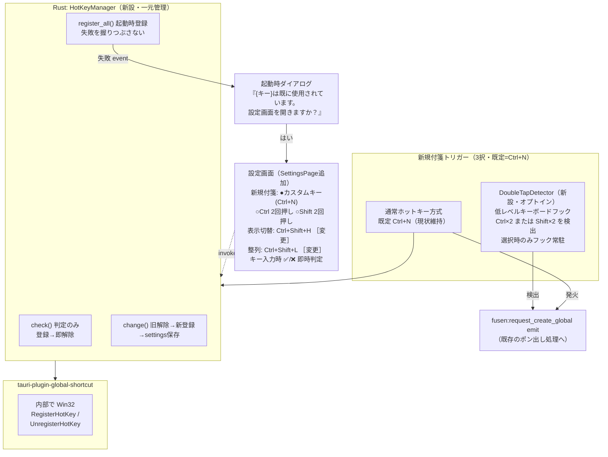

# ホットキー刷新計画 — 競合チェック＋2回押しトリガー対応

作成: 26-07-04 ／ 状態: **ユーザー承認待ち（改訂3版）**

---

## 1. 目的（なぜやるか）

1. **「設定時点で使える・使えないが分かる」** — ホットキー変更時にリアルタイム競合チェック（✅/❌）
2. **黙って壊れない** — 起動時の登録失敗をダイアログで通知し、その場で直せる
3. **キーを奪わない選択肢を用意** — 新規付箋のトリガーとして「Ctrl 2回押し」「Shift 2回押し」を選べる。選べば Ctrl+N が他アプリ（エクスプローラ等）に返る

「迷わせない」コンセプトの実装。**デフォルトは現状どおり Ctrl+N**（既存ユーザーに変化なし）。

**現状の問題**(コード確認済み):
- 登録失敗は `log_warn` のみ＝ユーザーには見えない（`src-tauri/src/lib.rs:4299-4311`）
- キー変更UIなし（settings.json 手編集のみ）。Ctrl+Shift+H / Ctrl+Shift+L はハードコード

## 2. 決定事項（ユーザー合意済み 26-07-04）

| # | 論点 | 決定 |
|---|------|------|
| Q1 | API方式 | 通常ホットキーは **tauri-plugin-global-shortcut 経由に統一**（内部で RegisterHotKey/UnregisterHotKey）。生API直呼びはしない。GetLastError 生値の代わりにプラグインのエラー文字列をログ |
| Q2 | 対象範囲 | **3アクション全部**変更可能: 新規付箋(Ctrl+N) / 表示切替(Ctrl+Shift+H) / 整列(Ctrl+Shift+L) |
| Q3 | 設定UI場所 | **既存設定画面**（`app/page.tsx` 内 SettingsPage）に「ホットキー」セクション追加 |
| Q4 | 新規付箋トリガー | **既定＝Ctrl+N（現状維持）**。設定画面で「カスタムキー / Ctrl 2回押し / Shift 2回押し」から選択可。2回押しはオプトイン |
| Q5 | 2回押し対応キー | **Ctrl と Shift のみ**。Alt（1回押しでメニュー操作）・Win（スタートメニュー）は OS 標準動作が発動するため除外 |

## 3. 全体設計

新規付箋のトリガーは**3択**（カスタムキー［既定 Ctrl+N］/ Ctrl×2 / Shift×2）。他2アクションは通常ホットキーのみ。

図 1: 全体構成。通常キーはプラグイン方式（競合チェックあり）、2回押しはフック方式（キーを奪わない・競合概念なし・選択時のみ稼働）。UIは Windows API を直接呼ばず、必ず Rust 側モジュール経由。

### 3.1 DoubleTapDetector（`src-tauri/src/double_tap.rs` 新設）

- `SetWindowsHookEx(WH_KEYBOARD_LL)` を専用スレッドで動かし、対象修飾キー（Ctrl または Shift、設定で選択）の押下パターンだけ監視
- **判定**: 対象キー down→up→down が約350ms以内、かつ**間に他のキー入力がないこと**（Ctrl+C 連打・Shift打鍵中の誤発動防止）。左右キーは区別しない
- **プライバシー**: 対象キー以外は「押された事実」だけ誤発動判定に使い、内容は一切記録・保持しない（コードコメントと設計書に明記。プライバシーが土台のプロダクトのため）
- フック callback は即 return（重い処理は channel で別スレッドへ）。遅いと Windows にフックを外される
- **トリガー方式が「カスタムキー」（既定）のときはフックを一切張らない**（オプトイン。既定動作では常駐監視なし）

**競合の考え方**: 2回押しは奪い合いではなく**共存**（例: Listary も Ctrl×2 を使う→両方反応し得る）。よって ✅/❌ 判定は原理的に不可。設定画面にその旨を1行注記する。

### 3.2 HotKeyManager（`src-tauri/src/hotkey_manager.rs` 新設）

| アクション ID | 既定 | 備考 |
|---|---|---|
| `new_note` | **Ctrl+N（現状維持）** | カスタムキー変更可＋Ctrl×2 / Shift×2 に切替可 |
| `toggle_visibility` | Ctrl+Shift+H | 通常ホットキーのみ |
| `arrange` | Ctrl+Shift+L | 通常ホットキーのみ |

Tauri コマンド（UIとの唯一の窓口）:

| コマンド | 役割 |
|---|---|
| `hotkey_get_bindings()` | 現在の割当（new_note のトリガー方式含む）を返す |
| `hotkey_check(action, shortcut)` | 登録を試し**成功なら即解除**して可否を返す。失敗理由はログへ |
| `hotkey_apply(action, config)` | new_note: 方式切替（shortcut / double_ctrl / double_shift）含む正式変更。旧解除→新登録→settings.json 保存の順 |

**自己競合の扱い**: 判定キーが自アクションの現在キー→✅ ／ 別アクションの現在キー→「❌『表示切替』に割当済み」と区別表示 ／ それ以外の失敗→「❌他のアプリまたはWindowsで使用中」

**将来拡張（要件7）**: `hotkey_check` は単一キー判定の純関数的コマンド。UIが候補リストをループで叩けば 🟢/🔴 一覧がそのまま実現できる。今回は構造準備のみ。

### 3.3 設定ファイル（settings.json）

- `new_note_trigger`: `"shortcut"`（既定）| `"double_ctrl"` | `"double_shift"` — 追加
- `shortcut_new_note`: 既存（既定 "ctrl+n"）。`shortcut` 方式時のみ使用
- `shortcut_toggle_visibility` / `shortcut_arrange`: 追加（既定 "ctrl+shift+h" / "ctrl+shift+l"）
- 既存ユーザー: `new_note_trigger` 未定義 → `"shortcut"` として扱う＝**挙動変化なし・移行処理不要**

### 3.4 起動時失敗ダイアログ

通常ホットキーの登録失敗時のみ。失敗キー名を event でフロントへ → ダイアログ「{キー} は既に使用されています。設定画面を開きますか？［はい］［いいえ］」→ はい＝ホットキーセクションを開く。2回押し方式には登録失敗が存在しないため対象外。

## 4. フェーズ分割（Codex 1依頼＝1部品）

各フェーズで build/test 緑 → Claude 差分レビュー → コミット（ユーザー指示後）。

| Phase | 内容 | 完了条件 |
|---|---|---|
| 1 | HotKeyManager 新設＋lib.rs setup の登録コード移行（**動作等価**・UIなし）。プラグインのランタイム register/unregister API 仕様調査を含む | cargo check 緑・3キー従来どおり動作 |
| 2 | `hotkey_check` / `hotkey_apply` / `hotkey_get_bindings` ＋ settings 3項目追加 | cargo check 緑・コマンド単体で判定動作 |
| 3 | **DoubleTapDetector 新設**（フック・誤発動対策・スレッド設計・Ctrl/Shift 対応）。設定値で有効化された場合のみ稼働し既存ポン出し発火 | 設定手書きで double_ctrl 有効化→Ctrl×2 でポン出し・Ctrl+C 連打で誤発動しない・カスタムキー方式ではフック非常駐 |
| 4 | 起動時失敗の event emit＋フロントダイアログ（はい→設定画面） | 意図的競合でダイアログ表示 |
| 5 | SettingsPage ホットキーUI（3択トリガー選択＋キーキャプチャ＋✅❌即時判定＋保存） | 3アクションの変更・判定・保存が動作 |
| 6 | ユニットテスト（特にダブルタップ判定ロジック）＋docs-v2 設計書更新 | npm test / cargo test 緑 |

### Codex 依頼時の必須ルール（毎回）

1. 依頼前に `C:\Users\uck\usage-widget\state\token_status.json` 確認。codex 5時間枠 20%未満なら依頼しない
2. 依頼文に「**rustfmt / cargo fmt 一切禁止**」明記
3. 大ファイル全面書き換え禁止。lib.rs は該当ブロックのみ変更
4. 完了ごとに Claude が差分検証

## 5. リスクと対策

| リスク | 対策 |
|---|---|
| 低レベルフックをセキュリティソフトが検知する可能性 | オプトイン（既定では張らない）＋対象キー以外を記録しない実装＋設計書に監視範囲を明記 |
| ダブルタップの誤発動（Ctrl+C→Ctrl+V 連打、Shift 打鍵等） | 「間に他キーが挟まったら無効」＋時間窓350ms。Phase 6 で判定ロジックを重点テスト |
| Shift×2 と Windows 固定キー機能（Shift 5回）の干渉 | 発動条件が異なる（2回/350ms vs 5回）ため実害なしと想定。Phase 3 で実機確認 |
| フック callback が遅いと Windows に外される | callback 即 return・処理は channel 経由で別スレッド |
| Listary 等 Ctrl×2 使用アプリと同時発火 | 原理的に検出不可。設定画面に注記＋いつでも方式変更可能で対処 |
| プラグインのランタイム register/unregister API 仕様未確認 | Phase 1 冒頭で Codex が調査。推測実装しない |
| 変なキーに変えて戻せない | settings.json 手編集で復旧可＋parse 失敗時は既定へフォールバック |
| キャプチャUIで修飾キーのみ確定 | 修飾キー＋通常キーが揃うまで確定不可 |

## 6. UI文言

- 判定OK: `✅ 使用できます`
- 判定NG(外部): `❌ このショートカットは既に他のアプリまたはWindowsで使用されています。別のショートカットを選択してください。`
- 判定NG(アプリ内): `❌ このショートカットは「〇〇」に割当済みです。`
- 2回押し注記: `※ 2回押しは他のアプリとキーを奪い合いません（同じ操作を使うアプリがあると両方反応します）`
- 起動時失敗: `グローバルホットキーを登録できませんでした。\n{キー名} は既に使用されています。\n設定画面を開きますか？ [はい][いいえ]`

## 7. 改版履歴

| No. | 日付 | 内容 |
|---|---|---|
| 1 | 26-07-04 | 初版作成（Q1=プラグイン統一/Q2=3キー/Q3=既存設定画面 合意反映） |
| 2 | 26-07-04 | Ctrl 2回押しを新規付箋の既定に変更（旧Q4/Q5）。DoubleCtrlDetector 追加・6フェーズ構成に |
| 3 | 26-07-04 | 既定を Ctrl+N に戻し、2回押し（Ctrl×2/Shift×2）は設定画面から選ぶオプトインに変更。Alt/Win の2回押しは OS 標準動作と干渉するため除外（Q4/Q5改訂）。移行通知を削除 |

