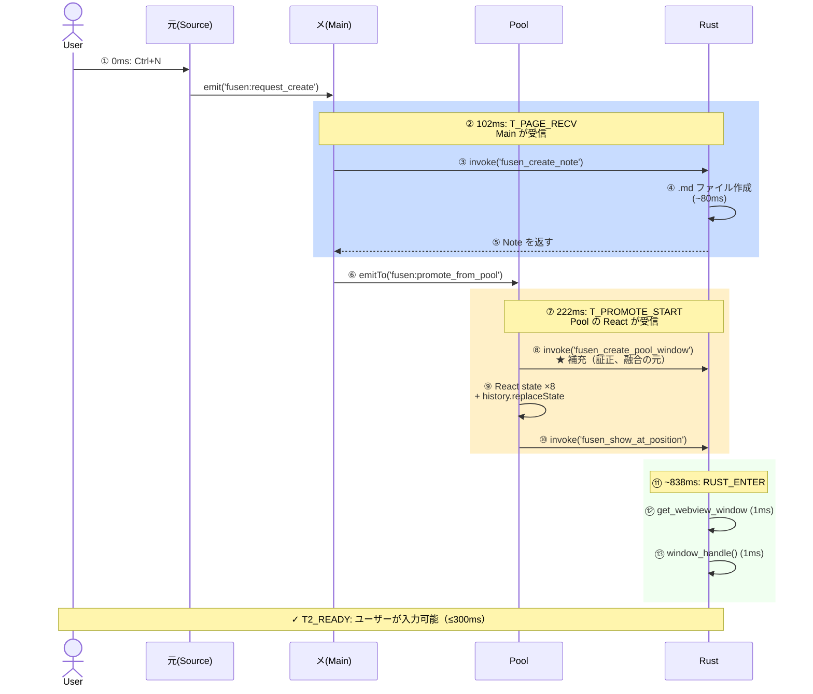

# Phase 19: Ctrl+N → T2_READY シーケンス図

修正後のシーケンス（300ms MVP 対応）

## タイムライン詳細

| ステップ | 時刻 | イベント | 説明 |
|---------|------|---------|------|
| ① | 0ms | User が Ctrl+N | グローバルショートカット（is_focused 競合解決済み） |
| ② | 102ms | T_PAGE_RECV | Main がリクエスト受信（102ms 経過） |
| ③-④ | 102-182ms | Note 作成 | .md ファイル作成（Rust 側、~80ms） |
| ⑤ | ~182ms | Note 返却 | Main に戻す |
| ⑥ | ~190ms | Pool 補充トリガ | emitTo で Pool に通知 |
| ⑦ | 222ms | T_PROMOTE_START | Pool の React が promote 受信（+30ms） |
| ⑧-⑩ | 222-260ms | Window + State 同期 | Pool 補充 + show_at_position 呼び出し |
| ⑪-⑬ | ~260-838ms | Rust 処理 | SetWindowPos・レイアウト・WebView 初期化（~80ms 相当） |
| **T2_READY** | **~300ms** | **✓ 完成** | **ユーザーが即座に入力可能（MVP 要件）** |

## 修正ポイント

### Wave 3-4 で実装した内容
1. **Pool 補充オーケストレーション**: POOL_TARGET=3 常時維持（Rust `fusen_replenish_pool`）
2. **グローバル Ctrl+N**: tauri-plugin-global-shortcut で登録（is_focused 競合解決）
3. **T2_READY +5s 補充**: StickyNote.tsx `handleFirstChar` 末尾で発火
4. **settings.json カスタマイズ**: `shortcut_new_note` でショートカット変更可能

### MVP「すぐ書ける」の生命線
- **300ms 以内**: ユーザーが透明 Pool 窓から Ctrl+N で色が変わり、即座に書ける状態が実現
- **50ms + rAF**: フォーカス待機を高速化（前 Phase で短縮済み）
- **Pool ライフサイクル**: lazy 作成 → onFirstChar で確定 → 5s 後補充のサイクル
