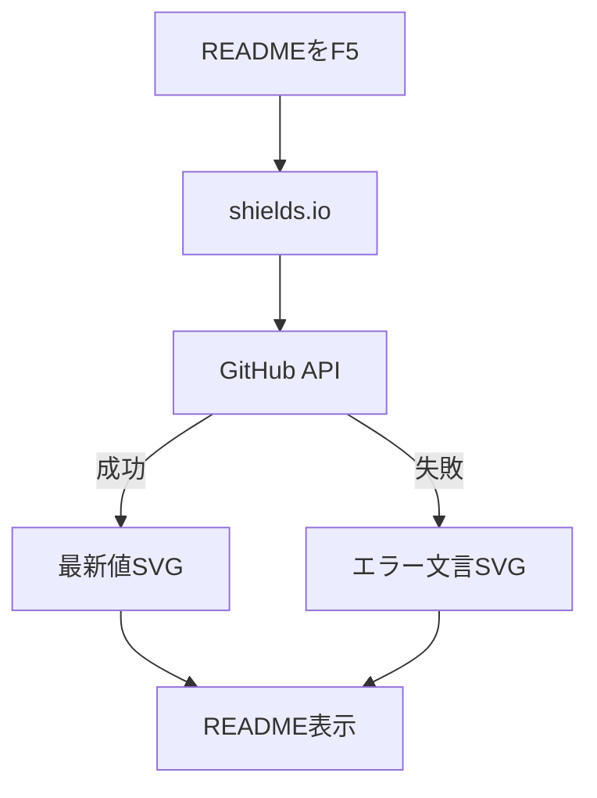
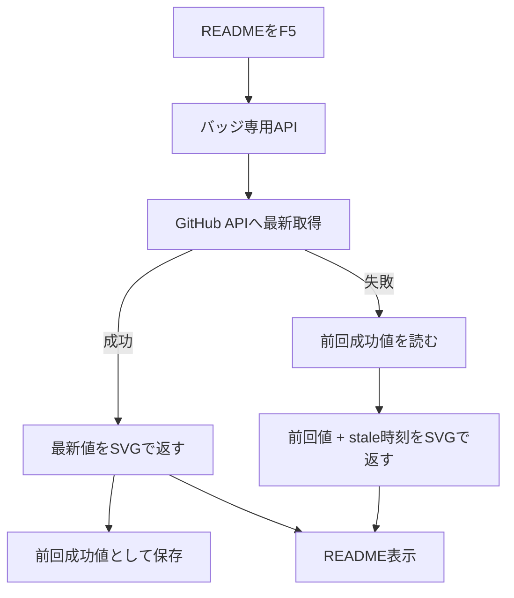

# README バッジ安定化計画

## 1. 要求

README のバッジ表示を安定させる。

必須:

- F5したら最新値を取りに行く
- 成功したら最新値を表示する
- 失敗したら前回成功値を表示する
- 失敗時は「前回値であること」と「いつ時点の値か」を表示する
- `downloads latest` は残す
- READMEにエラー文言を出さない
- アプリ本体には影響させない

不要:

- 固定値にする
- 定期更新だけにする
- `downloads latest` を削る
- アプリ側の機能に混ぜる

## 2. 現在の問題

README のバッジは shields.io 経由で GitHub 情報を取っている。

shields.io 側で GitHub token pool の問題が起きると、READMEに壊れた表示が出る。

```text
release Unable to select next GitHub token from pool
downloads total Unable to select next GitHub token from pool
```

これはアプリの問題ではない。
READMEバッジ取得経路の問題。

## 3. 変更前



問題:

- shields.io の失敗をこちらで制御できない
- 前回成功値を返せない
- README上に障害文言が出る

## 4. 変更後の要求動作



通常時:

```text
release v4.0.1 | license MIT | downloads total 1k | downloads latest 12
```

GitHub API失敗時:

```text
release v4.0.1 stale 09:30 | license MIT | downloads total 1k stale 09:30 | downloads latest 12 stale 09:30
```

見た目は変えない。
成功時の見た目は変えない。
失敗時だけ「前回値であること」を出す。

## 5. 候補比較

| 案 | F5最新取得 | 失敗時fallback | 追加サービス | コスト | 判断 |
|---|---:|---:|---:|---:|---|
| shields.io継続 | あり | なし | なし | なし | 不採用。壊れた表示が出る |
| READMEに固定値を書く | なし | あり | なし | なし | 不採用。機能ダウン |
| GitHub ActionsでSVG更新 | 弱い | あり | なし | なし | 不採用。F5即最新ではない |
| Vercel API + Firestore | あり | あり | 既存利用 | 低 | 保留。アプリ側と混ざる |
| Cloudflare Worker + KV | あり | あり。stale時刻も出せる | 新規 | 低 | 採用候補 |

## 6. Cloudflare Worker / KV とは

Cloudflare Worker:

- Cloudflare上で動く小さなAPI
- 今回は README バッジ専用APIにする
- `/badges/downloads-latest.svg` のようなURLでSVGを返す

Cloudflare KV:

- Workerから使える key-value 保存場所
- DBほど大げさではない
- 今回は「前回成功したバッジ値」を保存するだけ

保存するもの:

```json
{
  "label": "downloads latest",
  "message": "12",
  "color": "#4c1",
  "updatedAt": "2026-06-16T00:00:00.000Z"
}
```

秘密情報やユーザーデータは保存しない。

## 7. 採用判断

Cloudflare Worker + KV を採用候補にする。

理由:

- F5時に毎回 GitHub API へ最新取得を試せる
- 取得失敗時だけ、KVに保存した前回成功値と保存時刻を返せる
- READMEにエラー文言を出さない
- アプリ本体、Vercel、Firebase と切り離せる
- 小規模用途なら無料枠で収まる見込みが高い

今回の問題は README バッジだけ。
そのため、アプリ側の Vercel / Firebase に混ぜるより、バッジ専用の小さいAPIとして分ける方が安全。

## 8. コスト

想定:

- README表示時だけアクセスされる
- 保存するKVは3キー程度
- 値は小さいJSONだけ

この規模なら Cloudflare Workers / KV の無料枠で収まる見込み。

ただし無料枠や条件はCloudflare側で変わる可能性があるため、導入前に現在の料金ページで確認する。

## 9. 実装対象

追加済み候補:

```text
workers/badges/wrangler.toml
workers/badges/src/index.js
workers/badges/README.md
```

README反映対象:

```text
README.md
README.ja.md
```

まだREADMEは変更しない。
WorkerのURLが確定してから差し替える。

## 10. バッジURL

提供するURL:

```text
/badges/release.svg
/badges/downloads-total.svg
/badges/downloads-latest.svg
```

README変更前:

```text
https://img.shields.io/github/v/release/ore-no-fusen/ore-no-fusen?style=flat-square
https://img.shields.io/github/downloads/ore-no-fusen/ore-no-fusen/total?style=flat-square&label=downloads%20total
https://img.shields.io/github/downloads/ore-no-fusen/ore-no-fusen/latest/total?style=flat-square&label=downloads%20latest
```

README変更後:

```text
https://<worker-domain>/badges/release.svg
https://<worker-domain>/badges/downloads-total.svg
https://<worker-domain>/badges/downloads-latest.svg
```

`license MIT` は外部API不要なので現状維持。

## 11. 動作仕様

成功時:

- GitHub APIから最新値を取得
- SVGを返す
- KVへ保存する

失敗時:

- KVに前回成功値があれば、値と `stale HH:mm` を返す
- KVが空なら `unknown` を返す

キャッシュ方針:

- READMEのF5ではWorkerに到達させる
- Workerは毎回GitHub API取得を試す
- Workerレスポンスは `no-store`
- KVはfallback専用

失敗時の表示例:

```text
downloads latest 12 stale 09:30
```

`09:30` はKVに保存されている `updatedAt` を表示用に整形したもの。
成功時には `stale` を出さない。

## 12. リスク

| リスク | 影響 | 対策 |
|---|---|---|
| Cloudflare障害 | バッジだけ表示不能 | アプリ本体には影響なし |
| GitHub API失敗 | 最新値が取れない | KVの前回値とstale時刻を返す |
| 初回KV空 | fallbackできない | デプロイ直後に一度正常取得する |
| GitHub rate limit | 取得失敗しやすくなる | read-only GitHub tokenを使う |
| Worker実装ミス | SVGが壊れる | URL直接確認してからREADME変更 |
| Cloudflare新規依存 | 管理対象が増える | READMEバッジ専用に限定する |

## 13. テスト

Worker直接確認:

```text
release.svg が image/svg+xml を返す
downloads-total.svg が image/svg+xml を返す
downloads-latest.svg が image/svg+xml を返す
```

正常系:

```text
GitHub API成功時、最新値を返す
KVに同じ値が保存される
```

失敗系:

```text
GitHub API失敗時、KVの前回値を返す
失敗時は stale HH:mm を表示する
KVが空なら unknown を返す
```

README確認:

```text
README.md で3バッジが表示される
README.ja.md で3バッジが表示される
エラー文言が表示されない
```

## 14. おれがやること

1. Cloudflare利用を承認する
2. Cloudflareにログインする
3. KV namespaceを作る、または作成を許可する
4. GitHub read-only tokenを用意する、またはtokenなし運用にする
5. Worker URLを確認する
6. README差し替え後の表示を確認する

## 15. Codexがやること

1. Worker実装を点検する
2. `wrangler.toml` を実IDに更新する
3. `GITHUB_TOKEN` secret設定手順を案内する
4. Workerをdeployする手順を出す
5. Worker URLで3バッジを確認する
6. README.md / README.ja.md のURLを差し替える
7. PR用に変更一覧を整理する

## 16. 実施順

1. この計画を確認
2. Workerコードをレビュー
3. Cloudflareログイン
4. KV namespace作成
5. `wrangler.toml` にKV IDを反映
6. `GITHUB_TOKEN` secret登録
7. Worker deploy
8. 3つのSVG URLを直接確認
9. README URL差し替え
10. README表示確認
11. PR作成

## 17. ロールバック

READMEのバッジURLを shields.io に戻すだけ。

アプリ本体には影響しない。
