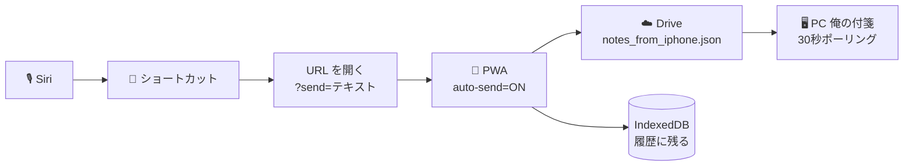
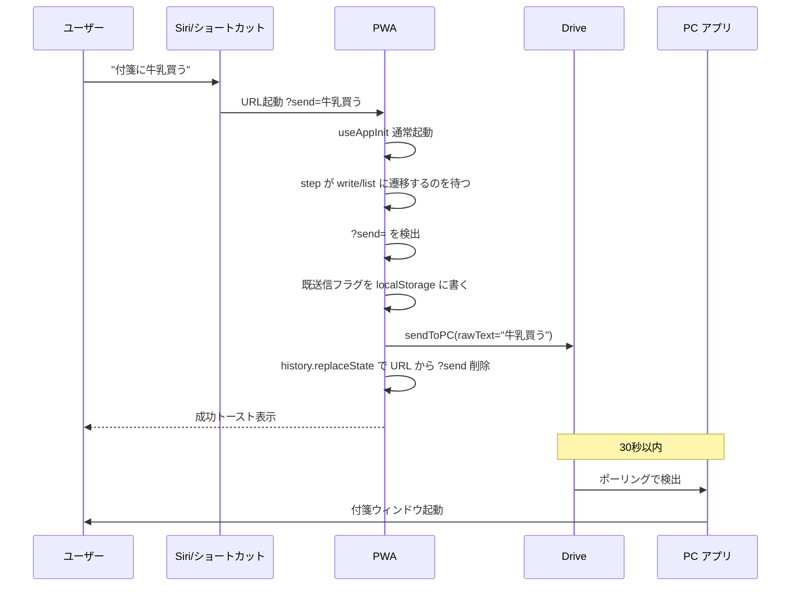

# 計画書：Siri → PWA URL 起動 → PC 送信（C 案）

作成日: 2026-05-19
対象バージョン: v3.3.14 ベース
ブランチ: develop

---

## 1 目的

iPhone の Siri に話しかけて、**PWA を URL 起動経由で自動送信させる**ことで、PC の「俺の付箋」に新しい付箋を立ち上げる。

A 案（ショートカットが Drive を直接書く）と違い、PWA を経由するため：

- PWA の IndexedDB に **送信履歴が残る**
- iPhone の PWA メモ一覧にも表示される
- PC 側の処理ロジックは無変更（既存の Drive ポーリングがそのまま使える）

トレードオフとして「Siri 起動時に Safari が一瞬前面に出る」体験を許容する（合意済み）。

---

## 2 全体像



---

## 3 実装範囲

PWA 側の改修のみ。PC 側コード（Rust / Tauri）には**手を入れない**。

### 3.1 変更対象ファイル

| No | ファイル | 変更内容 | 規模 |
|:---:|:---|:---|:---:|
| 1 | [app/viewer/page.tsx](app/viewer/page.tsx) | URL クエリ `?send=...` 検出 → 自動送信ロジック追加 | 約 40 行追加 |
| 2 | [worker/index.js](worker/index.js) | `SW_VERSION` を上げる（PWA 改修時の必須ルール） | 1 行 |

`sendToPC` 関数（[app/viewer/hooks/useBackgroundSend.ts:67](app/viewer/hooks/useBackgroundSend.ts#L67)）は既に `rawText: string` を引数で受け取る設計のため **改修不要**。そのまま再利用できる。

### 3.2 変更しない場所

- [src-tauri/src/](src-tauri/src/) 配下 すべて（PC 側）
- [app/viewer/hooks/useBackgroundSend.ts](app/viewer/hooks/useBackgroundSend.ts)（既存ロジックそのまま）
- [app/viewer/lib/drive.ts](app/viewer/lib/drive.ts)（Drive アクセス層そのまま）
- 認証フロー全般（既存トークンを再利用）

---

## 4 詳細設計

### 4.1 URL 仕様

```
https://<PWA URL>/viewer?siri_send=<送信したいテキスト>
```

- パラメータ名は `siri_send`（用途を限定して将来の衝突を避ける）
- 値は URL エンコードされたテキスト（ショートカット App の「URL エンコード」アクションを通す）
- 値が空または欠落していたら通常起動（後方互換）

### 4.2 起動シーケンス



### 4.3 自動送信の発火条件

すべて満たしたときのみ自動送信する：

| No | 条件 | 理由 |
|:---:|:---|:---|
| 1 | URL クエリに `?siri_send=<空でない文字列>` がある | 自動送信モードの判定 |
| 2 | `accessToken` が有効（Drive 接続済み） | 未接続なら通常の login ステップに進ませる |
| 3 | `step` が `write` または `list`（=送信可能な状態） | PWA 初期化完了待ち |
| 4 | この URL に対してまだ送信していない | 二重送信防止 |

### 4.3.1 自動付与タグ

Siri 経由で送信されたメモには **`siri`** タグを自動で付与する。

理由：
- 後から「Siri 経由のメモだけ絞り込み・一括削除・確認」したいときの目印
- 誤認識で変なメモが入っても、タグで識別できれば落ち着いて消せる

実装：`sendToPC` の `tags` 引数に `['siri']` を渡す。

### 4.3.2 音声フィードバック（ベスト・エフォート）

送信完了時・失敗時に、PWA から `speechSynthesis.speak()` で音声発話を試みる：

| タイミング | 発話内容 |
|:---|:---|
| 送信成功 | 「送りました」 |
| 送信失敗（ネットワーク・Drive エラー） | 「遅れました」（※失敗を意味する短い言葉として採用） |

**ベスト・エフォート方針**：
- iOS Safari の `speechSynthesis` は PWA / URL 起動経由で動くかどうか実機依存
- 動かなければ無音のまま終わる（害なし）
- ユーザーは無音だったら「届かなかった」と判断する運用

実装：
```typescript
function trySpeak(text: string) {
  if (typeof window === 'undefined') return;
  if (!('speechSynthesis' in window)) return;
  try {
    const u = new SpeechSynthesisUtterance(text);
    u.lang = 'ja-JP';
    window.speechSynthesis.speak(u);
  } catch {
    // 失敗しても無視（ベスト・エフォート）
  }
}
```

画面表示（既存の `backgroundSendSuccess` / `backgroundSendError` トースト）はそのまま生かす。音声が無音でも画面を見れば結果は分かる。

### 4.4 二重送信の防止

iOS Safari は「タブ復帰」「再読み込み」「PWA 再起動」などで URL が再評価される可能性がある。対策：

- 送信開始直前に `sessionStorage.setItem('auto_send_done', <send値のハッシュ>)` を立てる
- 送信成功後、`window.history.replaceState({}, '', '/viewer')` で URL クエリを除去
- 上記フラグがあれば再送信しない

`localStorage` ではなく `sessionStorage` を使う理由：タブを完全に閉じたら自然にリセットされ、次の Siri 起動には影響しない。

### 4.5 認証エラー時の挙動

`accessToken` が無いか期限切れの場合：

- 送信を**実行しない**
- URL クエリ `?send=` は保持したまま、PWA は通常の login → push → write 遷移を続ける
- ユーザーが手動でログイン完了した時点で、step が write/list になり、4.3 の条件 1-4 が揃って自動送信が走る

ただし「Siri で投げたのに失敗して気づかない」を防ぐため、送信失敗時はトースト的に画面に表示する（既存の `backgroundSendError` 表示メカニズムを流用）。

### 4.6 実装イメージ（疑似コード）

[app/viewer/page.tsx](app/viewer/page.tsx) の `ViewerPage` コンポーネント内に以下の `useEffect` を追加：

```typescript
// URL クエリ ?siri_send=... による自動送信（Siri ショートカット連携）
useEffect(() => {
  if (typeof window === 'undefined') return;
  if (!accessToken) return;
  if (step !== 'write' && step !== 'list') return;

  const params = new URLSearchParams(window.location.search);
  const sendText = params.get('siri_send');
  if (!sendText) return;

  const sentKey = `auto_send_done:${hashString(sendText)}`;
  if (sessionStorage.getItem(sentKey)) return;
  sessionStorage.setItem(sentKey, '1');

  (async () => {
    const ok = await sendToPC({
      rawText: sendText,
      tags: ['siri'],
      blobs: new Map(),
      draftId: null,
    });
    if (ok) {
      trySpeak('送りました');
      window.history.replaceState({}, '', '/viewer');
    } else {
      trySpeak('遅れました');
    }
  })();
}, [accessToken, step, sendToPC]);
```

`hashString` は単純な文字列ハッシュ関数（衝突確率は実用上問題ない範囲で十分）。
`trySpeak` は 4.3.2 のヘルパー関数。

---

## 5 ショートカット App 側の設計（参考）

実装後、iPhone 側のショートカットは A 案より大幅にシンプルになる：

| # | アクション | 設定 |
|:---:|:---|:---|
| 1 | テキスト（入力受け取り） | ショートカットの入力をテキストで受ける |
| 2 | URL エンコード | ステップ 1 を URL エンコード |
| 3 | URL | `https://<PWA URL>/viewer?siri_send=【ステップ2】` |
| 4 | URL を開く | ステップ 3 を開く（Safari/PWA が起動して自動送信） |

A 案にあった「Drive アクション」「If 分岐」「JSON 組み立て」が全部不要になる。

ショートカット名を「**付箋に送る**」にして Siri 呼び出し対応。

---

## 6 検証手順

### 6.1 PWA ローカル検証（iPhone 不要）

`npm run dev` で PWA を起動（port 3002）し、PC のブラウザで以下を開く：

```
http://localhost:3002/viewer?siri_send=テスト送信
```

期待動作：
- 既存のログイン状態なら自動で送信が走る
- 成功トーストが出る
- PWA から「送りました」と発話される（PC のスピーカーから音が出る・出ない場合は仕様内）
- URL から `?siri_send=` が消える（`/viewer` だけになる）
- 同じ URL を再読み込みしても二重送信されない
- PWA のメモ一覧に `siri` タグ付きで履歴が残る

### 6.2 develop デプロイ後の iPhone 検証

1. develop ブランチに push → Vercel プレビュー URL が更新される
2. iPhone のホーム画面の PWA（develop 版に追加してあるもの）を念のため再起動
3. Safari で `https://<develop プレビュー URL>/viewer?siri_send=ブラウザ確認` を開いて動作確認
4. ショートカット App でショートカットを組む
5. ショートカット App から手動実行 → PC に届くか確認
6. 「Hey Siri、付箋に〇〇」で音声起動確認
7. 音声フィードバック確認：「送りました」と返ってくるか（無音なら iOS の制約と判断し、画面表示で代用）

---

## 7 リスクと対策

| No | リスク | 影響 | 対策 |
|:---:|:---|:---|:---|
| 1 | iOS Safari が `?send=` 付き URL を別タブで開いて PWA に紐付かない | 自動送信が起動しない | ショートカット側で「URL を開く」アクションをデフォルトのブラウザではなく Safari 指定にする旨を手順書に明記 |
| 2 | PWA が起動するまで Safari の画面が長く出る | 体験が悪い | これは許容済み。仕様として明記する |
| 3 | 既存ユーザーの URL に万一 `?send=` が偶然付いている | 意図しない送信 | URL パラメータ名を一般的でない `send` ではなく `siri_send` などにする手もある（要検討） |
| 4 | 認証切れ時に再ログイン画面が出てしまう | Siri 経由なのに手動操作が要る | 既存挙動のまま。手順書で「24時間以内に PWA を開いて再認証を済ませておく」と注意喚起 |
| 5 | `step === 'write'` 中に空のエディタに割り込み | 既存編集が消える？ | `sendToPC` は引数の `rawText` を使うのでエディタ DOM には触らない。問題なし（要動作確認） |
| 6 | SW_VERSION を上げ忘れる | 古い SW がキャッシュされて新コードが反映されない | [worker/index.js](worker/index.js) の `SW_VERSION` を必ず更新（メモリのルール） |

---

## 8 作業ステップと検証

### Step 1：PWA 実装

- [app/viewer/page.tsx](app/viewer/page.tsx) に自動送信用 `useEffect` 追加
- [worker/index.js](worker/index.js) の `SW_VERSION` を上げる
- ローカル `npm run dev` で 6.1 の検証

### Step 2：develop へコミット・プッシュ

- ローカル検証が通ったらコミット（コミット指示はユーザーから受けてから）
- Vercel が自動デプロイ

### Step 3：iPhone でショートカット構築

- 5 章のとおりに最小ショートカット作成
- 名前は「付箋に送る」
- Siri に追加

### Step 4：実機検証

- ショートカット App から手動実行
- 「Hey Siri、付箋に〇〇」で音声起動
- PC に届くか・PWA に履歴が残るか・iPhone PWA で見えるか確認

### Step 5：ユーザーガイド整備

- 新規ガイドを `docs-v2/200_SIRI_SETUP.md` として作成
- C 案ベースで簡潔に（A 案より大幅に短くなるはず）

---

## 9 確認事項（ユーザー判断済み）

| No | 項目 | 確定値 |
|:---:|:---|:---|
| 1 | URL パラメータ名 | `siri_send` |
| 2 | 自動付与タグ | `siri`（あとから絞り込み・削除できる目印として） |
| 3 | 送信結果の音声フィードバック | PWA から `speechSynthesis` でベスト・エフォート発話。成功「送りました」、失敗「遅れました」、無音なら諦める |
| 4 | 自動再試行 | しない（失敗時は画面トースト＋音声で通知のみ） |
| 5 | `step === 'banner'` 初回起動時 | 自動送信は走らせず、通常のセットアップフローを優先 |

---

## 10 完了条件（Definition of Done）

- [ ] [app/viewer/page.tsx](app/viewer/page.tsx) に自動送信 `useEffect` を追加
- [ ] `trySpeak` ヘルパー関数を実装し、成功時「送りました」・失敗時「遅れました」を発話
- [ ] 自動送信メモには `['siri']` タグを付与
- [ ] `SW_VERSION` 更新
- [ ] ローカル `npm run dev` で URL 起動の自動送信が動く
- [ ] 二重送信が起きないことを `sessionStorage` フラグで確認
- [ ] develop デプロイ後、iPhone 実機で Siri → PC 付箋が成功
- [ ] PWA メモ一覧に `siri` タグ付きで履歴が残ることを確認
- [ ] iPhone 実機で「送りました」音声フィードバックを確認（無音なら iOS 制約として記録）
- [ ] `docs-v2/200_SIRI_SETUP.md` を C 案版として新規作成
