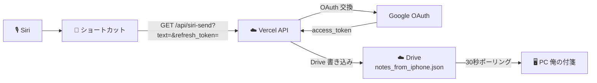

# 計画書：Siri → Vercel API → PC 送信（D 案・裏機能）

> ⚠️ **裏機能・実験的・先行開発**
> 本機能は一般ユーザー向けではない。READMEやユーザーガイドには載せない。
> 開発者が iPhone のショートカット App から手動で叩いて Siri 連携を実験する用途。

作成日: 2026-05-19
最終更新: 2026-05-21（裏機能版に再設計）
対象バージョン: v3.3.14 ベース
ブランチ: develop

---

## 1 目的

iPhone の Siri に話しかけて、PC の「俺の付箋」に新しい付箋を立ち上げる。完全ハンズフリーで動作させる。

ただし **iOS の制約により、PWA を URL クエリ付きで起動する手段がない**（C 案破棄）。
かつ **ショートカット App から直接 Drive を更新する正攻法は client_secret 漏洩や iOS 15+ の機能削除により困難**（A 案も困難）。

そのため Vercel に API Route を作って、Siri ショートカットがそれを叩く D 案で実現する。
**プライバシー方針との乖離**（Vercel ログにメモ本文が一時的に残る）があるため、一般ユーザー向けではなく裏機能として開発者のみが使う設計とする。

---

## 2 経緯（C 案・A 案破棄）

### C 案破棄
当初 C 案（PWA を `?siri_send=...` 付き URL で起動）を実装したが、iOS の制約により URL クエリを伴ってホーム画面追加 PWA を起動する手段が存在しない【確認済み】。ショートカットの「URL を開く」は Safari の通常タブに飛ばされ、PWA としては起動しなかった。

参考：[Launching PWAs from a Shortcut - Automators Talk](https://talk.automators.fm/t/launching-pwas-from-a-shortcut/4327)

### A 案困難
iPhone のショートカット App の「ファイルを保存」アクションは iOS 15 以降で Google Drive 保存ができなくなっている【確認済み】。
HTTP API 直叩きで access_token を更新するには client_secret が必要で、これをショートカットに置くと設計書の方針（client_secret は Vercel に隠す）に反する。

参考：[Move file to Google Drive Folder via iOS shortcut - Automators Talk](https://talk.automators.fm/t/move-file-to-google-drive-folder-via-ios-shortcut/16035)

---

## 3 全体像



PWA は **一切起動しない**。Vercel API が refresh_token を OAuth と交換して access_token を取り、Drive に書き込む。

---

## 4 制約と割り切り

| 項目 | 制約 |
|:---|:---|
| PWA 履歴に残るか | **残らない**（PWA を経由しないため。iOS の制約による物理的限界） |
| iPhone での編集・削除 | 不可（履歴がないため） |
| 用途 | 使い捨ての1行メモ専用（買い物・運転中・料理中の「忘れる前にPCに貼る」） |
| 認証情報 | refresh_token をショートカット App に貼り付けて使う |
| Vercel ログ | GET クエリのメモ本文・refresh_token が Vercel のアクセスログに短期間残る（Hobby プランで約 1 時間） |
| 公開範囲 | **一般ユーザー向けではない裏機能**。READMEに掲載しない |

---

## 5 実装内容

### 5.1 新規作成

**[app/api/siri-send/route.ts](app/api/siri-send/route.ts)**

POST リクエスト（プライバシー保護のため GET から POST に変更）：

```
POST /api/siri-send
Content-Type: application/json
Body: {"text": "<送信テキスト>", "refresh_token": "<許可証>"}
```

GET だと URL クエリパラメータが Vercel のアクセスログに記録されるが、
POST のリクエストボディは記録されないため、text と refresh_token がログに残らない。

処理：
1. `refresh_token` を Google OAuth と交換して `access_token` を取得
2. Drive の `ore-no-fusen` フォルダを取得（なければ作成）
3. `notes_from_iphone.json` を取得（なければ items 空配列で開始）
4. 新規アイテムを末尾追加：
   ```json
   { "id": "<UUID>", "title": "<text>", "body": "", "sent_at": "<JST ISO 8601>", "tags": ["siri"] }
   ```
5. Drive に書き戻す
6. レスポンス：`{ "ok": true, "id": "..." }` または `{ "ok": false, "error": "..." }`

ファイル冒頭のコメントに「裏機能・実験的・開発者向け」と明記。

### 5.2 PWA 変更

**[app/viewer/page.tsx](app/viewer/page.tsx)**：DebugLogView（`?debug=1` で表示される画面）に「Siri 用トークンをコピー」ボタンを追加。`localStorage.viewer_refresh_token` を `navigator.clipboard.writeText` でクリップボードへ送る。

**[app/viewer/NoteListStep.tsx](app/viewer/NoteListStep.tsx)** と **[app/viewer/types.ts](app/viewer/types.ts)**：前回追加した「Siri 用トークンをコピー」ボタンを削除（DebugLogView に移したため、メモ一覧画面からは消す）。

**[worker/index.js](worker/index.js)**：`SW_VERSION` を `3.3.15` → `3.3.16` に更新。

---

## 6 ユーザー手順（開発者自身が使う）

### 6.1 トークンをコピー（初回 1 回・refresh_token が無期限なので再設定はほぼ不要）

1. iPhone のホーム画面の develop 版 PWA を起動
2. Safari で `https://<develop URL>/viewer?debug=1` のように `?debug=1` を付けて開く（既にホーム画面 PWA からはアドレスバーが無いので、Safari で別途開く必要あり）
3. DebugLogView 画面の上部に「**Siri 用トークンをコピー**」ボタンが出る
4. それをタップ → 「コピーしました」と表示が出ればクリップボード成功

【確認済み】OAuth 同意画面の公開ステータスは「本番環境」。
Google 公式によると、本番環境の refresh_token は **無期限**（6 ヶ月以上未使用・25 個超え・ユーザー側で取り消し等の特殊条件以外は失効しない）。

### 6.2 ショートカットを作る

iPhone のショートカット App で新規ショートカットを作成し、以下のアクションを順に配置：

| # | アクション | 設定 |
|:---:|:---|:---|
| 1 | テキストを音声入力 | （実行時にマイクで音声入力） |
| 2 | URL エンコード | 入力：ステップ 1 の音声入力結果 |
| 3 | テキスト | JSON 本文：`{"text": "【URLエンコード結果】", "refresh_token": "【6.1でコピーしたトークン】"}` |
| 4 | URL | `https://<develop プレビュー URL>/api/siri-send` |
| 5 | URL の内容を取得 | URL：ステップ 4、**メソッド：POST**、**リクエストボディ：JSON**、ボディの内容：ステップ 3 のテキスト |

ショートカット名を Siri が認識しやすい造語にする（例：「はひふへほ」）。
Siri が「テキスト」「メモ」「送信」などの一般語をショートカット名と認識せず、検索や他アプリへの命令と誤解する事象が発生する。意味のない造語のほうが認識される【確認済み】。

**重要**：ステップ 5 は `URL を開く` ではなく `URL の内容を取得` を使う。前者は Safari を開いてしまう。
メソッドは必ず **POST** にする。GET だと URL クエリが Vercel のアクセスログに残る。

### 6.3 使う

「**Hey Siri、付箋に送って、牛乳買う**」のように話す。Siri が音声をテキスト化してショートカットの入力に渡し、API が裏で Drive を更新する。PWA も Safari も画面に出ない。30 秒以内に PC に付箋が立ち上がる。

---

## 7 環境変数の確認

API Route は以下の環境変数を必要とする。**既に Vercel に設定済み**（既存の `/api/auth/refresh` が同じ変数を使っているため）：

- `NEXT_PUBLIC_GDRIVE_CLIENT_ID`
- `GOOGLE_CLIENT_SECRET_PWA`

追加設定は不要。

---

## 8 完了条件

- [x] C 案コード削除（前回コミット 5573609 で削除済み）
- [x] [app/api/siri-send/route.ts](app/api/siri-send/route.ts) 作成（コメントに裏機能と明記）
- [x] DebugLogView に「Siri 用トークンをコピー」ボタン追加
- [x] NoteListStep からトークンコピーボタンを削除（DebugLogView へ移動）
- [x] `SW_VERSION` を 3.3.16 に更新
- [ ] develop に push → Vercel デプロイ
- [ ] iPhone PWA を `?debug=1` 付きで開いてトークンコピーボタンが動く
- [ ] iPhone ショートカット 4 アクションで API が叩ける
- [ ] 「Hey Siri、付箋に送って、〇〇」で PC に付箋が立ち上がる
