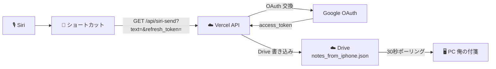

# 計画書：Siri → Vercel API → PC 送信（D 案）

作成日: 2026-05-19
最終更新: 2026-05-20（C 案破棄・D 案で再設計）
対象バージョン: v3.3.14 ベース
ブランチ: develop

---

## 1 目的

iPhone の Siri に話しかけて、PC の「俺の付箋」に新しい付箋を立ち上げる。

完全ハンズフリー（PWA 画面の起動も不要）で動作させる。

---

## 2 経緯（C 案破棄）

当初 C 案（PWA を `?siri_send=...` 付き URL で起動）で実装したが、iOS の制約により URL クエリを伴ってホーム画面追加 PWA を起動する手段が存在せず、ショートカットの「URL を開く」も Safari の通常タブに飛ばされて発火しなかった。

このため C 案は破棄し、Vercel の API Route を直接叩く D 案で再実装した。

---

## 3 全体像



PWA は **一切起動しない**。Vercel API が refresh_token を OAuth と交換して access_token を取り、Drive に書き込む。

---

## 4 制約と割り切り

| 項目 | 制約 |
|:---|:---|
| PWA 履歴に残るか | **残らない**（PWA を経由しないため。これは無料で実現する範囲の物理的限界） |
| iPhone での編集・削除 | 不可（履歴がないため） |
| 用途 | 使い捨ての1行メモ専用（買い物・運転中・料理中の「忘れる前にPCに貼る」） |
| 認証情報 | refresh_token をショートカット App に貼り付けて使う |

---

## 5 実装内容

### 5.1 新規作成

**[app/api/siri-send/route.ts](app/api/siri-send/route.ts)**

GET リクエスト：

```
GET /api/siri-send?text=<送信テキスト>&refresh_token=<許可証>
```

処理：
1. `refresh_token` を Google OAuth と交換して `access_token` を取得
2. Drive の `ore-no-fusen` フォルダを取得（なければ作成）
3. `notes_from_iphone.json` を取得（なければ items 空配列で開始）
4. 新規アイテムを末尾追加：
   ```json
   { "id": "<UUID>", "title": "<text>", "body": "", "sent_at": "<JST ISO 8601>", "tags": ["siri"] }
   ```
5. Drive に書き戻す
6. レスポンス：`{ "ok": true, "id": "..." }` または `{ "ok": false, "error": "..." }`

### 5.2 PWA 変更

**[app/viewer/NoteListStep.tsx](app/viewer/NoteListStep.tsx)**：フッターに「Siri 用トークンをコピー」ボタンを追加。

**[app/viewer/page.tsx](app/viewer/page.tsx)**：ボタンのハンドラとして `localStorage.viewer_refresh_token` を `navigator.clipboard.writeText` でクリップボードへ送る処理を実装。

**[app/viewer/types.ts](app/viewer/types.ts)**：`NoteListStepProps` に `onCopySiriToken: () => void` 追加。

**[worker/index.js](worker/index.js)**：`SW_VERSION` を `3.3.14` → `3.3.15` に更新。

### 5.3 削除

C 案で追加した [app/viewer/page.tsx](app/viewer/page.tsx) の自動送信 `useEffect`（45 行）を削除。

---

## 6 ユーザー手順（B-1 ～ B-3）

### B-1：PWA から refresh_token をコピー（初回 1 回だけ）

1. iPhone のホーム画面の develop 版 PWA を起動
2. メモ一覧画面を表示
3. 画面下部の「**Siri 用トークンをコピー**」をタップ
4. 「Siri 用トークンをコピーしました」と表示が出ればクリップボード成功

このトークンは **数ヶ月〜数年有効**。Google パスワード変更・Google からのアクセス取り消し・PWA で Drive 切断、などをしない限り使い続けられる。失効したら同じ手順で再取得。

### B-2：ショートカットを作る

iPhone のショートカット App で新規ショートカットを作成し、以下の 4 アクションを順に配置：

| # | アクション | 設定 |
|:---:|:---|:---|
| 1 | テキスト（ショートカットの入力受け取り） | 「i」ボタン →「ショートカットの入力を受け取る」を ON、種類は「テキスト」 |
| 2 | URL エンコード | 入力対象：ステップ 1 の「ショートカットの入力」 |
| 3 | URL | `https://<develop プレビュー URL>/api/siri-send?text=【ステップ2】&refresh_token=【B-1でコピーしたトークン】` |
| 4 | URL の内容を取得 | URL：ステップ 3、メソッド：GET |

ショートカット名を「**付箋に送る**」に変更し、「Siri に追加」で起動フレーズを登録。

**重要**：ステップ 3 の URL は `URL を開く` ではなく `URL の内容を取得` を使う。前者は Safari を開いてしまう。

### B-3：使う

「**Hey Siri、付箋に牛乳買う**」のように話す。Siri が音声をテキスト化してショートカットの入力に渡し、API が裏で Drive を更新する。PWA も Safari も画面に出ない。

30 秒以内に PC に付箋が立ち上がる。

---

## 7 失敗時の挙動

ショートカットの「URL の内容を取得」アクションは、API のレスポンス JSON を取得する。後続アクションとして「If」と「読み上げ」を追加すれば音声フィードバックも可能だが、最小構成では結果は確認できない（PC で付箋が立ち上がらなければ失敗、で割り切る）。

将来必要なら以下を追加：

| # | アクション |
|:---:|:---|
| 5 | If（ステップ 4 の `ok` フィールドが true） |
| 6 | テキスト読み上げ「送りました」 / 「失敗しました」 |

---

## 8 環境変数の確認

API Route は以下の環境変数を必要とする。**既に Vercel に設定済み**（既存の `/api/auth/refresh` が同じ変数を使っているため）：

- `NEXT_PUBLIC_GDRIVE_CLIENT_ID`
- `GOOGLE_CLIENT_SECRET_PWA`

追加設定は不要。

---

## 9 完了条件

- [ ] C 案コード削除（[page.tsx](app/viewer/page.tsx) の useEffect 削除）
- [ ] [app/api/siri-send/route.ts](app/api/siri-send/route.ts) 作成
- [ ] [NoteListStep.tsx](app/viewer/NoteListStep.tsx) に「Siri 用トークンをコピー」ボタン追加
- [ ] `SW_VERSION` を 3.3.15 に更新
- [ ] develop に push → Vercel デプロイ
- [ ] iPhone PWA でトークンコピーボタンが動く
- [ ] iPhone ショートカット 4 アクションで API が叩ける
- [ ] 「Hey Siri、付箋に〇〇」で PC に付箋が立ち上がる
