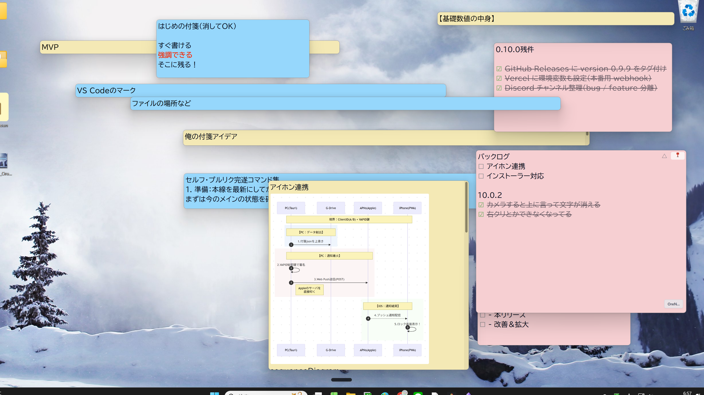
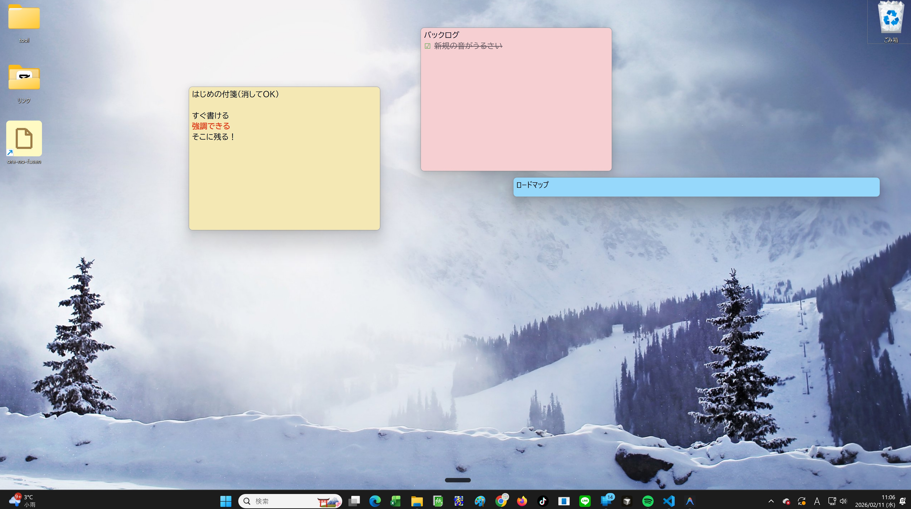

# FUSEN (My Sticky Notes)

<div align="center">

*Read this in other languages: **English** | [日本語](README.ja.md)*



**Pin your thoughts to your desktop.**

A beautiful sticky notes app with Markdown support.

[](https://github.com/ore-no-fusen/ore-no-fusen/releases)
[](LICENSE)
[](https://github.com/ore-no-fusen/ore-no-fusen/releases)
[](https://github.com/ore-no-fusen/ore-no-fusen/releases/latest)
[](https://ore-no-fusen.github.io/ore-no-fusen/)

[Download](#-installation) • [Documentation](https://ore-no-fusen.github.io/ore-no-fusen/) • [FAQ](docs/101_FAQ.md) • [Landing Page](https://ore-no-fusen.vercel.app)

</div>

---
# FUSEN

The fastest way to capture thoughts.

Markdown sticky notes for your desktop.

## Install (10 sec)
```bash
winget install ore-no-fusen
```

Or download from:

[Releases page](https://github.com/ore-no-fusen/ore-no-fusen/releases).


## Concept

Capture thoughts instantly without interrupting your thinking.

FUSEN is designed as a fast thinking canvas where ideas can appear the moment they come to mind.

---


## ✨ Features

### 🎯 Simple yet Powerful

- **Markdown Support** - Supports headings, lists, code blocks, tables, Mermaid diagrams, images, and more.
- **One-click Edit** - Click anywhere to start typing immediately. Auto-saves so you never lose your thoughts.
- **Floating Format Bar** - Appears automatically when text is selected. Click to format bold, headings, lists, and checkboxes.
- **Tags & Archives** - Organize your sticky notes. Folder structure for easy viewing.
- **Full-Text Search** - Find statements instantly with regular expression support. Auto-jumps and highlights the matching lines.
- **Pin to Top** - Always display in front of other windows using the 📌 button.
- **System Tray Integration** - Resides in the system tray for instant access anytime.
- **Auto-Start** - Starts automatically on system boot.
- **Sound Effects** - Comfortable feedback for a pleasant user experience.

### 🔒 Privacy Focused

- **100% Local** - All data is saved locally on your device. No cloud storage is required.
- **Offline Capable** - Works without an internet connection.
- **Open Source** - Code is fully available. Use it with peace of mind.

---

## 📸 Screenshots



---

## 📥 Installation

### For General Users (Recommended)

1. Go to the [Releases page](https://github.com/ore-no-fusen/ore-no-fusen/releases).
2. Download the latest **`ore-no-fusen_x.x.x_x64-setup.exe`**.
3. Double-click the downloaded file to install.
4. After installation, launch "俺の付箋" (FUSEN) from the Start menu.

**System Requirements:**
- OS: Windows 10/11 (64-bit)
- Disk Space: Approx. 100MB
- Memory: 4GB+ recommended

For detailed instructions, see the [User Guide](docs/USER_GUIDE.md#インストール) (Currently in Japanese).

### ⚠️ About "SmartScreen" Warning During Installation

During installation, you might see a screen saying "**Windows protected your PC**".

**What is this?**  
SmartScreen is a Windows security feature. It automatically displays a warning for apps with low download counts or apps that don't have a paid "code signing certificate." It does not mean a virus was detected.

**How to resolve:**

1. Click on "More info".
2. A "Run anyway" button will appear. Click it.

You can then proceed with the installation normally.

> 💡 **Rest assured** — FUSEN is open source. The entire source code is available on [GitHub](https://github.com/ore-no-fusen/ore-no-fusen) for anyone to review.

### For Developers

#### Prerequisites
- Node.js 18+
- Rust (Install via [rustup](https://rustup.rs/))

#### Setup Instructions

1. Clone the repository:
```bash
git clone https://github.com/ore-no-fusen/ore-no-fusen.git
cd ore-no-fusen
```

2. Install dependencies:
```bash
npm install
```

3. Run in development mode:
```bash
npm run tauri dev
```

4. Production build:
```bash
npm run tauri build
```

Build artifacts will be generated in `src-tauri\target\release\bundle\nsis\`.

---

## 🎯 Usage

### Basic Operations

1. **Create a Sticky Note** - Right-click the system tray icon → "New Note"
2. **Edit** - Double-click a note
3. **Search** - Press `Ctrl+F` to open the search window
4. **Tagging** - Write `#tagname` within a note to automatically tag it

For detailed usage, please see the [User Guide](docs/USER_GUIDE.md).

### Markdown Example

```markdown
# Today's Tasks

## Important
- [ ] Prepare presentation slides
- [x] Reply to emails

## Notes
**Deadline**: 2026/02/15
*Assignee*: Alex

| Item | Status |
|------|------|
| Slides | In Progress |
| Review | Pending |

#work #important
```

---

## 💡 Use Cases

### 📝 Task Management
Organize your daily tasks with checklists and tags. Move completed tasks to the archive.

### 💭 Idea Capture
Jot down ideas the moment you have them. Structure and organize them with Markdown.

### 📚 Study Notes
Categorize what you learn with tags. Easily review using the search feature.

### 🔖 Link Collection
Save frequently used links on sticky notes. Group them using tags.

---

## 🛠️ Technology Stack

### Frontend
- **Next.js 14** (App Router)
- **React 18**
- **TypeScript**
- **Tailwind CSS**
- **CodeMirror 6** (Markdown Editor)

### Backend
- **Tauri 2.x** (Desktop App Framework)
- **Rust** (Fast & Secure Backend)

### Architecture
- **DOD (Data-Oriented Design)** - Data-centric architecture
- **Effect Pattern** - Explicit management of side effects
- **AppState (SSOT)** - Single source of truth

---

## 📖 Documentation

- [Online Documentation](https://ore-no-fusen.github.io/ore-no-fusen/) - System specifications and architecture (JA)
- [User Guide](docs/USER_GUIDE.md) - Detailed instructions (JA)
- [FAQ](docs/FAQ.md) - Frequently asked questions (JA)
- [Development Rules](AG_RULES.md) - Guidelines for developers

---

## 🤝 Contributing

Issues and Pull Requests are welcome!

1. Fork this repository
2. Create a feature branch (`git checkout -b feature/amazing-feature`)
3. Commit your changes (`git commit -m 'Add some amazing feature'`)
4. Push to the branch (`git push origin feature/amazing-feature`)
5. Open a Pull Request

---

## 📝 License

MIT License - see the [LICENSE](LICENSE) file for details.

---

## 🙏 Acknowledgements

FUSEN uses the following open-source projects:

- [Tauri](https://tauri.app/)
- [Next.js](https://nextjs.org/)
- [React](https://react.dev/)
- [CodeMirror](https://codemirror.net/)
- [Tailwind CSS](https://tailwindcss.com/)

---

## 📞 Support

- **Bug Reports**: [GitHub Issues](https://github.com/ore-no-fusen/ore-no-fusen/issues)
- **Feature Requests**: [GitHub Discussions](https://github.com/ore-no-fusen/ore-no-fusen/discussions)
- **Questions**: [FAQ](docs/FAQ.md)

---

<div align="center">

**Make organizing thoughts more fun with FUSEN** 🎉

Made with ❤️ by ONF Studios

</div>
