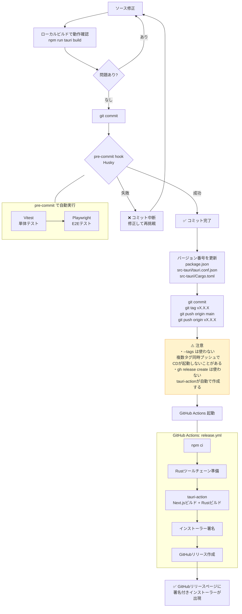

# リリース手順

## 開発からリリースまでの流れ



## バージョン更新ファイル

| ファイル | 場所 |
|------|------|
| `package.json` | `"version": "x.x.x"` |
| `src-tauri/tauri.conf.json` | `"version": "x.x.x"` |

## ローカルビルド（動作確認用・署名なし）

```bash
npm run tauri build
```

> Windowsが「発行元不明」と警告を出すが動作確認には使える。配布には使わない。

## 正式リリース（署名付き）

```bash
# バージョン更新後
git commit -m "chore: バージョンを vX.X.X に更新"
git tag vX.X.X
git push origin main
git push origin vX.X.X
```

GitHub Actionsが自動でビルド・署名・リリースを行う（所要時間：15〜25分）。

## ⚠️ 注意事項

### タグは必ず単体でプッシュする

```bash
# ❌ NG: --tags はローカルの未プッシュタグを全部送るため、複数タグ同時プッシュになり
#         GitHub Actions が正しくトリガーされないことがある
git push origin main --tags

# ✅ OK: タグは個別にプッシュする
git push origin main
git push origin vX.X.X
```

### リリースは手動で作らない

`gh release create` や GitHub Web UI でリリースを手動作成しないこと。
`tauri-action` がビルド完了後に自動でリリースとインストーラーを作成する。
手動作成すると競合して CD が失敗する。
