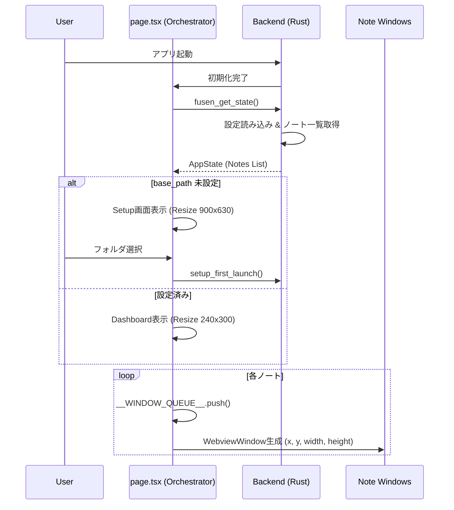
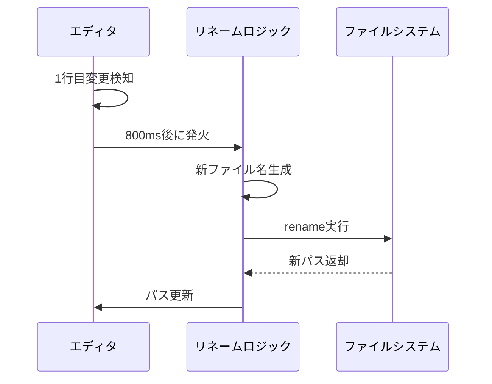
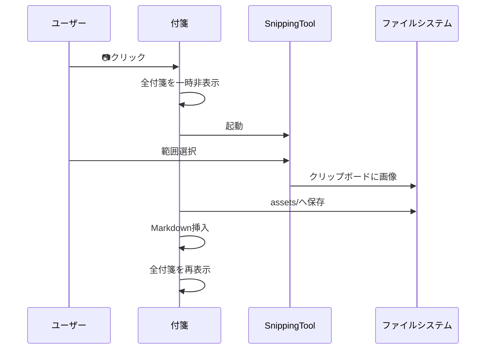
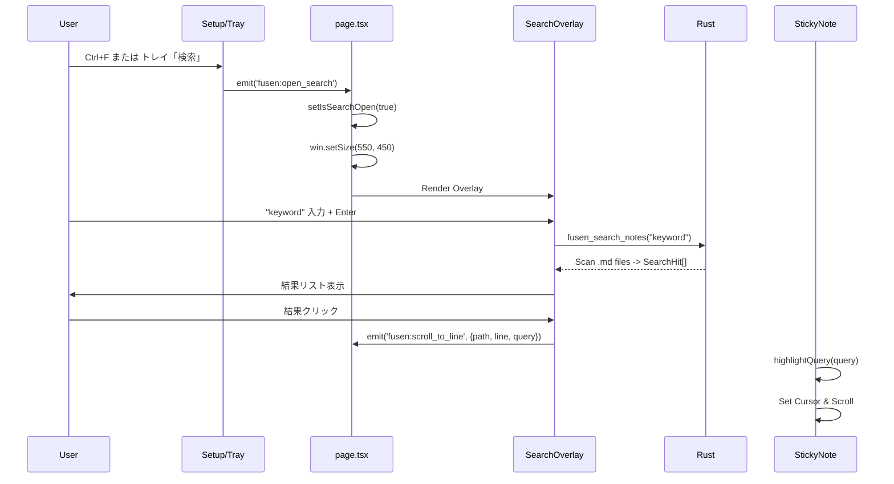

# 俺の付箋 - 要求仕様書 v1.7

**バージョン**: 1.7  
**日付**: 2026-01-28  
**形式**: USDM (Universal Specification Describing Manner)  
**ステータス**: ✅ 実装完全準拠 (Implementation Aligned)

---

# 1. 全体概要 (General Overview)

## 1.1 製品定義
- **要求**: ユーザーは、デスクトップ上で手軽にメモを取り、それらをファイルとして永続化・管理できるアプリケーションを求めている。
- **理由**: 既存の付箋アプリはデータのポータビリティが低く、テキストエディタは起動や管理が手軽でないため。
- **仕様**:
  - **[SPEC-SYS-01]**: アプリケーション名は「俺の付箋」とする。
  - **[SPEC-SYS-02]**: Windows デスクトップアプリケーションとして動作する。
  - **[SPEC-SYS-03]**: データの実体はプレーンテキスト（Markdown）とし、独自データベースを持たない。

---

# 2. ライフサイクル要件 (Lifecycle Requirements)

## [REQ_LF_01] アプリケーションの常駐と起動
- **要求**: ユーザーは、アプリを常に起動状態のまま維持し、必要な時に素早くメモを確認したい。
- **理由**: メモを取りたい瞬間に起動待ち時間が発生すると、思考が中断されるため。
- **仕様**:
  - **[SPEC-LF-01-01]**: アプリケーションはシステムトレイに常駐する。
  - **[SPEC-LF-01-02]**: 起動時、設定されたフォルダ（Vault）をスキャンし、以前の状態（位置・サイズ）で付箋ウィンドウを復元する。
  - **[SPEC-LF-01-03]**: ウィンドウの復元は、負荷分散のためキューシステムを用いて順次行う。

### 補足: 起動シーケンス

## [REQ_LF_02] 初回セットアップ
- **要求**: ユーザーは、最初にアプリを使用した際に、メモの保存場所を自分で決めたい。
- **理由**: デフォルトの場所に勝手に保存されると、ユーザーのファイル管理ポリシーに反する場合があるため。
- **仕様**:
  - **[SPEC-LF-02-01]**: 初回起動時（設定ファイルが存在しない場合）、セットアップ画面を表示する。
  - **[SPEC-LF-02-02]**: ユーザーにフォルダ選択ダイアログを提示し、選択されたパスを「ベースフォルダ」として保存する。
  - **[SPEC-LF-02-03]**: セットアップ完了後、メインウィンドウをダッシュボードモード（小型）に切り替える。

## [REQ_LF_03] 新規付箋の作成
- **要求**: ユーザーは、思いついたその瞬間に新しいメモを書き始めたい。
- **理由**: 操作の手数が多すぎると、メモを取る意欲が減退するため。
- **仕様**:
  - **[SPEC-LF-03-01]**: システムトレイメニュー、または既存付箋の右クリックメニューから「新規メモ」を実行できる。
  - **[SPEC-LF-03-02]**: 作成操作後、即座に新しいウィンドウが開き、入力可能な状態になる。
  - **[SPEC-LF-03-03]**: ファイル名は作成日時から自動生成 (`NNNN_YYYY-MM-DD_Context.md`) し、ユーザーに入力を求めない。

## [REQ_LF_04] アプリケーションの終了
- **要求**: ユーザーは、メンテナンスやPC終了時にアプリを完全に停止させたい。
- **理由**: 常駐アプリであっても、ユーザーの意思でプロセスを終了させる手段が必要不可欠であるため。
- **仕様**:
  - **[SPEC-LF-04-01]**: 付箋の「閉じる」操作は非表示（Minimize/Close Window）であり、プロセス終了ではない。
  - **[SPEC-LF-04-02]**: システムトレイメニューの「終了」を選択した場合のみ、全プロセスを終了する。

---

# 3. データ管理要件 (Data Requirements)

## [REQ_DT_01] Markdown形式での保存
- **要求**: ユーザーは、メモの内容を他のテキストエディタやツールでも閲覧・編集したい。
- **理由**: 独自フォーマットによるベンダーロックインを避け、長期的なデータの可読性を保証するため。
- **仕様**:
  - **[SPEC-DT-01-01]**: ファイル拡張子は `.md` とする。
  - **[SPEC-DT-01-02]**: 本文は標準的な Markdown 記法で保存する。

## [REQ_DT_02] メタデータの管理
- **要求**: ユーザーは、前回終了時のウィンドウ位置やサイズ、色を維持したい。
- **理由**: デスクトップ上の配置自体が情報の整理・優先度付けの意味を持つため。
- **仕様**:
  - **[SPEC-DT-02-01]**: `windowX`, `windowY`, `width`, `height`, `backgroundColor`, `tags` 等の情報を YAML Frontmatter 形式でファイル先頭に記録する。
  - **[SPEC-DT-02-02]**: アプリ以外のエディタで開いた際も、本文の可読性を損なわない形式とする。

## [REQ_DT_03] ファイル名の自動同期
- **要求**: ユーザーは、ファイル名を管理する手間から解放されたい。
- **理由**: ファイル名を考える時間はメモの本質的な価値とは無関係であり、認知負荷を下げるため。
- **仕様**:
  - **[SPEC-DT-03-01]**: 本文の1行目をファイル名の「コンテキスト」部分として使用する。
  - **[SPEC-DT-03-02]**: 1行目が変更された場合、0.8秒の待機時間（デバウンス）を経て自動的にリネームを実行する。
  - **[SPEC-DT-03-03]**: ファイルシステムで使用できない文字は `_` に自動置換する。

### 補足: 自動リネームフロー

## [REQ_DT_04] 変更の自動保存
- **要求**: ユーザーは、保存ボタンを押す操作を意識したくない。
- **理由**: 保存忘れによるデータ消失を防ぎ、紙の付箋のような「書けば残る」体験を提供するため。
- **仕様**:
  - **[SPEC-DT-04-01]**: テキスト変更後、自動的にファイルシステムへ書き込みを行う。
  - **[SPEC-DT-04-02]**: ウィンドウからフォーカスが外れた（Blur）時点で、未保存の変更があれば即座に保存する。

---

# 4. 編集・表示要件 (Editing Requirements)

## [REQ_ED_01] リッチテキスト編集
- **要求**: ユーザーは、強調やリストなどの構造を使ってメモを見やすくしたい。
- **理由**: プレーンテキストだけでは情報のメリハリが付けにくく、視認性が低いため。
- **仕様**:
  - **[SPEC-ED-01-01]**: `**太字**` は赤色・太字で表示する（重要事項の強調）。
  - **[SPEC-ED-01-02]**: `# 見出し` はフォントサイズを大きく表示する。
  - **[SPEC-ED-01-03]**: `[ ]` / `[x]` はクリック可能なチェックボックスとして表示する。
  - **[SPEC-ED-01-04]**: 編集モードと表示モードをダブルクリックで切り替える。

## [REQ_ED_02] 画像の取り込み
- **要求**: ユーザーは、画面上の情報をスクリーンショットとして素早くメモに貼りたい。
- **理由**: テキスト化しにくいビジュアル情報を、コンテキストを失わずに保存するため。
- **仕様**:
  - **[SPEC-ED-02-01]**: ツールバーのカメラボタン押下で、OSのスクリーンショットツールを起動する。
  - **[SPEC-ED-02-02]**: 取得した画像は `assets` フォルダに保存し、Markdown リンクを挿入する。
  - **[SPEC-ED-02-03]**: エディタ上の画像はドラッグ操作で表示サイズ（倍率）を変更できる。

### 補足: 画像キャプチャフロー

---

# 5. 検索・整理要件 (Organization Requirements)

## [REQ_OR_01] 全文検索
- **要求**: ユーザーは、大量のメモの中から特定のキーワードを含むものを即座に見つけたい。
- **理由**: メモが増えるにつれて、視覚的な探索だけでは目的の情報に到達するのが困難になるため。
- **仕様**:
  - **[SPEC-OR-01-01]**: `Ctrl+F` またはトレイメニューから検索画面を開く。
  - **[SPEC-OR-01-02]**: 入力されたキーワードで全 `.md` ファイルを Grep 検索する（Grepライク検索）。
  - **[SPEC-OR-01-03]**: 検索結果をクリックすると、該当する付箋ウィンドウを開き（最前面へ移動）、該当行へスクロールする。

### 補足: 全文検索フロー

## [REQ_OR_02] タグによるコンテキスト切り替え
- **要求**: ユーザーは、現在の作業（仕事、プライベートなど）に関連するメモだけを表示したい。
- **理由**: 無関係なメモがデスクトップにあると集中を阻害するため。
- **仕様**:
  - **[SPEC-OR-02-01]**: 付箋に任意のタグ（複数可）を設定できる。
  - **[SPEC-OR-02-02]**: 「タグで絞り込み」機能により、選択したタグを持つ付箋のみを表示し、それ以外を非表示にする。
  - **[SPEC-OR-02-03]**: フィルタリングはバックエンド（Rust）側でウィンドウ制御として実装し、高速に切り替える。

## [REQ_OR_03] 不要メモの整理（アーカイブ・削除）
- **要求**: ユーザーは、アクティブでないメモをデスクトップから退避させたい。
- **理由**: デスクトップ領域は有限であり、常に現在進行形の情報のみを配置したいため。
- **仕様**:
  - **[SPEC-OR-03-01]**: **アーカイブ**: 付箋を `Archive` フォルダへ移動する。タグ付きの場合は `Tags` フォルダ内へハードリンクを残す。
  - **[SPEC-OR-03-02]**: **削除**: 付箋を `Trash` フォルダへ移動する。論理削除ではなく物理移動とする。

---

# 6. UI/UX 仕様 (User Interface Specifications)

## [REQ_UI_01] ウィンドウデザイン
- **要求**: ユーザーは、OS標準のウィンドウ枠（タイトルバーなど）を消して、紙の付箋のように見せたい。
- **理由**: ウィンドウ枠は場所を取り、視覚的なノイズとなるため。
- **仕様**:
  - **[SPEC-UI-01-01]**: ウィンドウ枠（Decorations）を無効化し、背景を透過設定とする。
  - **[SPEC-UI-01-02]**: 背景色はユーザーが3色（Yellow, Pink, Blue）から選択できる。

## [REQ_UI_02] コンテキストメニュー
- **要求**: ユーザーは、付箋に対する操作を右クリックから直感的に行いたい。
- **理由**: 常に表示されるボタンを減らし、付箋の筆記面積を最大化するため。
- **仕様**:
  - **[SPEC-UI-02-01]**: 右クリック時に独自メニューを表示する。
  - **[SPEC-UI-02-02]**: メニューには「新規作成」「色変更」「タグ」「アーカイブ」「削除」を含める。

---

# 7. インターフェース仕様 (Technical Interface)

## [REQ_IF_01] フロントエンド-バックエンド間通信
- **要求**: UI操作は、安全かつ効率的にファイルシステムへ反映されなければならない。
- **理由**: Web技術ベースのUIと、ネイティブ機能（ファイル操作）を分離し、堅牢性を高めるため。
- **仕様**:
  - **[SPEC-IF-01-01]**: 非同期コマンド (`invoke`) を使用してファイル操作を要求する。
  - **[SPEC-IF-01-02]**: システムイベント（設定変更、外部リロード）は Tauri イベントシステム (`emit`/`listen`) で通知する。

## [REQ_IF_02] 設定の永続化
- **要求**: アプリの設定（ベースフォルダ等）は再起動しても維持されなければならない。
- **理由**: 毎回フォルダを選択し直すのはユーザー体験として許容できないため。
- **仕様**:
  - **[SPEC-IF-02-01]**: 設定は JSON 形式で AppData ディレクトリに保存する。

---
