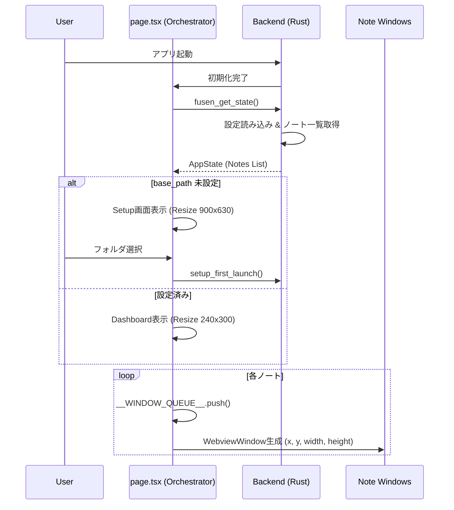
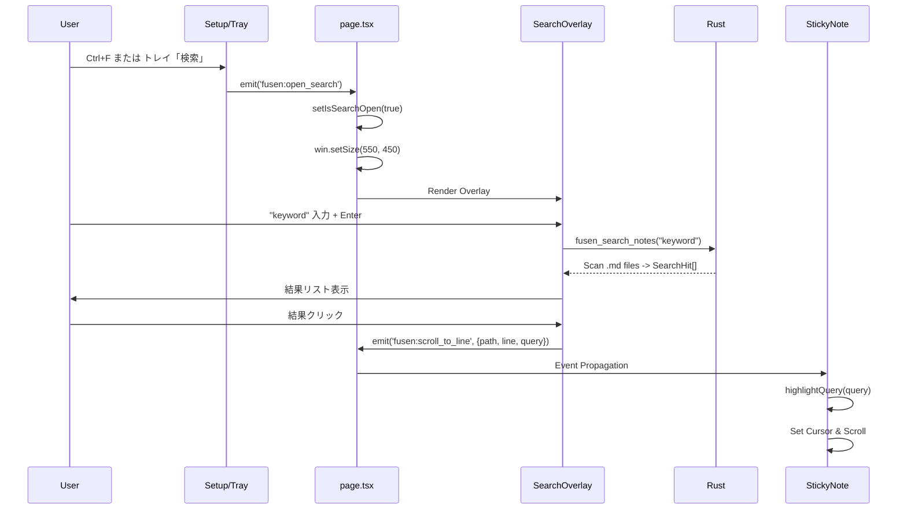

# 俺の付箋 - 要求仕様書 v1.6

**バージョン**: 1.6  
**日付**: 2026-01-28  
**形式**: USDM (Universal Specification Describing Manner)  
**ステータス**: ✅ 実装完全準拠 (Implementation Aligned)

---

# 1. システム概要 (System Overview)

## 1.1 製品定義
「俺の付箋」は、**Markdownテキストファイルをそのまま付箋としてデスクトップに貼れる**常駐型メモアプリケーションである。
ファイルシステム（Markdownファイル）を唯一の正本（Single Source of Truth）とし、独自ＤＢを持たない「ローカルファースト」アーキテクチャを採用する。

## 1.2 アーキテクチャ構成
| レイヤー | 技術スタック | 役割 |
| :--- | :--- | :--- |
| **Backend** | Rust (Tauri Core) | ファイルI/O、ウィンドウ制御、OS連携、全文検索、ビジネスロジック |
| **Frontend** | React / Next.js 15 | UIレンダリング、状態管理、ルーター |
| **Editor** | CodeMirror 6 | Markdown編集、シンタックスハイライト、キーバインド |
| **Runtime** | WebView2 (Windows) | レンダリングエンジン |

---

# 2. 機能要件 (Functional Requirements)

## 2.1 ライフサイクル管理

### REQ-LF-01: アプリケーション起動
- **Requirement**: アプリ起動時に、設定されたフォルダ内のメモを自動的に付箋として展開すること。
- **Specification**:
    - `page.tsx` (Orchestrator) が `fusen_get_state` を呼び出し、保存済みのノート一覧を取得する。
    - 各ノートに対して `WebviewWindow` を生成し、デスクトップ上の指定位置 (`x`, `y`) に復元する。
    - ウィンドウ生成はキュー (`__WINDOW_QUEUE__`) で順次処理し、負荷集中を防ぐ。

### REQ-LF-02: 初回セットアップ
- **Requirement**: 初回起動時、保存先フォルダ（Vault）をユーザーに指定させること。
- **Specification**:
    - `AppState.base_path` が未設定の場合、メインウィンドウを `900x630` にリサイズし、設定画面 (`setupRequired=true`) を表示する。
    - 設定完了後、メインウィンドウを `240x300` (ダッシュボード最小サイズ) に縮小する。

### REQ-LF-03: 新規付箋作成
- **Requirement**: 任意のコンテキスト（トレイ、右クリック）から即座に新規付箋を作成できること。
- **Specification**:
    - コマンド `fusen_create_note` を呼び出し、ファイル (`NNNN_YYYY-MM-DD_Context.md`) を生成する。
    - 生成後、直ちに該当ファイルのウィンドウを開く。
    - 連打防止のため 1000ms のグローバルスロットルを設ける。

### REQ-LF-04: アプリ終了
- **Requirement**: システムトレイからアプリ全体を終了できること。
- **Specification**: トレイメニュー「🚪 終了」により、Tauri プロセス全体を終了する。

## 2.2 データ管理 (File System Source of Truth)

### REQ-DT-01: Markdown形式
- **Requirement**: データはプレーンテキストの Markdown ファイルとして保存すること。
- **Specification**: 拡張子 `.md` を使用する。

### REQ-DT-02: メタデータ管理 (Frontmatter)
- **Requirement**: ウィンドウ位置や設定は YAML Frontmatter に保存すること。
- **Specification**:
```yaml
---
windowX: 100
windowY: 100
windowWidth: 400
windowHeight: 300
backgroundColor: "#fffacd"
visible: true
tags: ["仕事", "重要"]
---
```

### REQ-DT-03: ファイル名自動同期
- **Requirement**: 本文の1行目をファイル名として自動的に同期すること。
- **Specification**:
    - 編集検知から `800ms` のデバウンス後、リネームロジックを実行。
    - フォーマット: `NNNN_YYYY-MM-DD_{1行目}.md`
    - 禁則文字 (`\/:*?"<>|`) は `_` に置換する。

### REQ-DT-04: 自動保存
- **Requirement**: ユーザーの明示的な保存操作なしに内容を永続化すること。
- **Specification**:
    - `RichTextEditor` の `onChange` イベントで `800ms` デバウンス保存。
    - ウィンドウの `blur` イベントで即時保存（コミット）。

## 2.3 編集機能 (Rich Text Editor)

### REQ-ED-01: Markdown編集
- **Requirement**: Markdown 記法をサポートし、リアルタイムで装飾表示すること。
- **Specification**: CodeMirror 6 を使用。
    - **見出し**: `# Title` (大きく表示)
    - **太字**: `**Bold**` (赤色・太字)
    - **リスト**: `- Item`
    - **チェックボックス**: `[ ]` (クリックでトグル可能)
    - **画像**: `` (プレビュー表示、リサイズ可能)

### REQ-ED-02: 画像キャプチャ
- **Requirement**: 画面の任意領域をキャプチャして挿入できること。
- **Specification**:
    - ツールバーのカメラボタンで Snipping Tool (またはOS標準キャプチャ) を起動。
    - クリップボードの画像を `assets/` フォルダに保存し、Markdown リンクを挿入する。

### REQ-ED-03: リンク機能
- **Requirement**: URLおよびローカルファイルパスをクリックで開けること。
- **Specification**:
    - `http(s)://` → ブラウザで開く。
    - `Use:/path` または絶対パス → `fusen_open_file` / `open_containing_folder` で開く。

## 2.4 検索機能

### REQ-SR-01: 全文検索
- **Requirement**: 全ての付箋から文字列を検索し、該当箇所へジャンプできること。
- **Specification**:
    - `Grep` 方式で全 `.md` ファイルをスキャン (`fusen_search_notes`)。
    - 結果リストをクリックすると、`fusen:scroll_to_line` イベントを発行し、該当付箋を開いてスクロールする。
    - 検索ウィンドウはメインウィンドウ (`main`) を拡張 (`550x450`以上) してオーバーレイ表示する。

## 2.5 整理機能

### REQ-OR-01: タグ管理
- **Requirement**: 付箋にタグを付与し、分類できること。
- **Specification**:
    - Frontmatter の `tags` 配列で管理。
    - コンテキストメニューから追加・削除が可能。
    - 複数タグに対応。

### REQ-OR-02: タグフィルタリング (World Switching)
- **Requirement**: 特定のタグを持つ付箋のみを表示できること。
- **Specification**:
    - バックエンド (`lib.rs`) の `apply_tag_filter_windows` で制御。
    - 選択されたタグにマッチしないウィンドウは `hide()` され、マッチするものは `show()` される。
    - これにより「仕事モード」「プライベートモード」のようなコンテキスト切り替えを実現する。

### REQ-OR-03: アーカイブ
- **Requirement**: 不要になったが付箋として残したいものをアーカイブできること。
- **Specification**:
    - `Archive/` フォルダへ移動。
    - タグ付きの場合は `Tags/{Tag}/` へハードリンクを作成し、多重分類を維持する。

### REQ-OR-04: ゴミ箱 (物理削除)
- **Requirement**: 付箋を削除できること。
- **Specification**:
    - `Trash/` フォルダへ移動 (`fusen_move_to_trash`)。
    - 削除時にサウンドエフェクトを再生する。

---

# 3. UI/UX 仕様

## 3.1 コンテキストメニュー (StickyNote上)

| 項目 | 動作仕様 |
| :--- | :--- |
| **ファイル名表示** | (無効状態) 現在のファイル名を表示 |
| **📂 フォルダを開く** | エクスプローラーでファイルの場所を開く |
| --- | --- |
| **📝 新規メモ** | 新しい付箋を作成して開く |
| **🎨 色を変更** | サブメニュー: `Blue(#80d8ff)`, `Pink(#ffcdd2)`, `Yellow(#f7e9b0)` |
| **🏷️ タグ** | サブメニュー: <br>・`➕ 新規タグ追加` (モーダル)<br>・`□ {既存タグ}` (トグル)<br>・`🔧 削除モード` (タグ削除モードへ移行) |
| --- | --- |
| **📦 アーカイブ** | `Archive/` へ移動しウィンドウを閉じる |
| --- | --- |
| **🗑️ 削除** | `Trash/` へ移動しウィンドウを閉じる (効果音あり) |


## 3.2 システムトレイメニュー

| 項目 | 動作仕様 |
| :--- | :--- |
| **📝 新規メモ** | 新規付箋を作成 |
| **🔍 検索** | メインウィンドウで検索オーバーレイを表示 |
| **👁️ 全部戻す** | 全ての付箋を表示 (`unminimize`) |
| **🙈 全部隠す** | 全ての付箋を非表示 (`minimize` / `hide`) |
| **🏷️ タグで絞り込み** | タグ一覧サブメニューを表示 |
| **⚙️ 設定** | 設定画面を表示 |
| **🚪 終了** | アプリケーション終了 |

---

# 4. インターフェース仕様 (Events & Commands)

## 4.1 Tauri コマンド (Backend API)

| コマンド名 | 概要 |
| :--- | :--- |
| `fusen_create_note` | 新規ノート作成 |
| `fusen_save_note` | ノート保存（リネーム判定含む） |
| `fusen_search_notes` | 全文検索実行 |
| `fusen_add_tag` | タグ追加 |
| `fusen_remove_tag` | タグ削除 |
| `fusen_set_active_tags` | フィルタタグ設定＆ウィンドウ表示制御 |
| `fusen_archive_note` | アーカイブ移動 |
| `fusen_move_to_trash` | ゴミ箱移動 |

## 4.2 イベント (Pub/Sub)

| イベント名 | 発行元 | 購読先 | ペイロード | 目的 |
| :--- | :--- | :--- | :--- | :--- |
| `fusen:open_search` | StickyNote, Tray | page.tsx | - | 検索画面を開く |
| `fusen:open_settings`| Tray | page.tsx | - | 設定画面を開く |
| `fusen:scroll_to_line`| SearchOverlay | StickyNote | `{line, query, targetPath}` | 検索結果ジャンプ |
| `fusen:reload_note` | Rust | StickyNote | `path` | 外部変更時のリロード |
| `fusen:switch_world` | page.tsx | page.tsx | `tagName` | タグフィルタ適用通知 |

---

# 5. シーケンス図 (Interaction Flows)

## 5.1 起動シーケンス



## 5.2 全文検索フロー



---

# 6. 未実装・除外機能

- **論理削除**: 物理削除に一本化したため廃止 (v1.3)
- **常に手前に表示**: OS制約およびUI複雑化のため除外 (v1.3)
- **検索ハイライト**: 実装済みだが視覚的反映に課題あり (Future Work)

---
