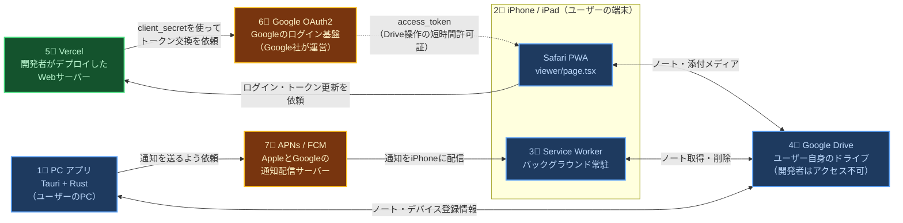
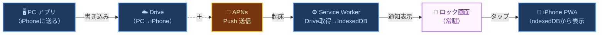
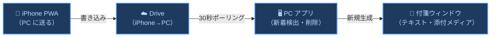

# 🌍 001 システム全体像 (Overview)

登場人物・技術スタック・データフロー・Vercelの役割

設計書 v1.2 / 2026-05-06

## 0 上位思想

このシステム全体像は、[000-I Intention Layer](./000_INTENTION_LAYER.md) を上位思想、[000 要求仕様](./000_REQUIREMENTS.md) を上位仕様として読む。

俺の付箋は、単なる付箋アプリではなく、AIエージェント時代の「意図の置き場」である。
PC、iPhone/PWA、Google Drive、Vercel、通知基盤は、すべて `Capture -> Land -> Persist -> Surface -> Act -> Resolve` の loop を支える構成要素として扱う。

## 1 登場人物

以下7つの登場人物でこのアプリは構成されています。

  凡例
  ユーザーのもの（PC・iPhone・Drive）
  開発者のもの（Vercel）
  外部サービス（APNs・Google OAuth2）

図 1-1　システム全体関係図

### 登場人物の役割一覧

表 1-1　登場人物の役割一覧

<table class="module-table">
  <tr><th>No</th><th>登場人物</th><th>一言で言うと</th><th>何のために使うか</th></tr>
  <tr><td>1</td><td><strong>1⃣ 🖥 PC アプリ</strong></td><td>デスクトップ付箋アプリ</td><td>付箋の表示・編集・保存。iPhone に通知付きで送信。iPhone から受け取った本文・画像・動画を付箋として開く</td></tr>
  <tr><td>2</td><td><strong>2⃣ 📱 iPhone PWA</strong></td><td>ホーム画面に追加した Web アプリ</td><td>PC からのノートを受け取り閲覧。メモを書き、画像・動画を添付して PC に送る</td></tr>
  <tr><td>3</td><td><strong>3⃣ ⚙️ Service Worker</strong></td><td>iPhone の常駐プログラム</td><td>アプリを閉じていても Push を受信してノートを保存・通知表示。IndexedDB がデータの唯一の保存場所</td></tr>
  <tr><td>4</td><td><strong>4⃣ ☁️ Google Drive</strong></td><td>PC と iPhone の中継所</td><td>ノートデータを一時的に置く場所。処理したら即削除。開発者はアクセス不可</td></tr>
</table>
<table class="module-table">
  <tr><th>No</th><th>登場人物</th><th>一言で言うと</th><th>何のために使うか</th></tr>
  <tr><td>5</td><td><strong>5⃣ 🌐 Vercel</strong></td><td>開発者が置いた Web サーバー</td><td>iPhone PWA を配信。開発者が守る <code>client_secret</code> を iPhone に入れず、Google OAuth のトークン交換・更新だけを行う</td></tr>
  <tr><td>6</td><td><strong>6⃣ 🔑 Google OAuth2</strong></td><td>Drive 操作の許可を受け取る仕組み</td><td>ユーザーが Google にログインし、「俺の付箋が Drive のアプリ用ファイルを扱ってよい」と許可する</td></tr>
  <tr><td>7</td><td><strong>7⃣ 📡 APNs / FCM</strong></td><td>通知配信サーバー</td><td>PC からの「通知してください」を受け取り iPhone に届ける。APNs は iPhone/Mac、FCM は Chrome/Android</td></tr>
</table>

---

## 2 技術スタック

PCアプリ・iPhone PWA・共有インフラの3層に分けて使用技術を整理します。

表 2-1　技術スタック一覧

  

    
🖥 PC アプリ

    <table class="module-table">
      <tr><th style="width:32px">No</th><th>領域</th><th>技術・役割</th></tr>
      <tr><td>1</td><td>フレームワーク</td><td>Tauri v2（WebView + Rust）</td></tr>
      <tr><td>2</td><td>UI</td><td>Next.js 14 / React 18 / TypeScript / Tailwind</td></tr>
      <tr><td>3</td><td>エディタ</td><td>CodeMirror 6（Markdown ハイライト・検索）</td></tr>
      <tr><td>4</td><td>バックエンド</td><td>Rust（AppState・ファイル I/O・Win32 API）</td></tr>
      <tr><td>5</td><td>データ保存</td><td>ファイルシステム（JSON / Markdown）</td></tr>
      <tr><td>6</td><td>テスト</td><td>Vitest（ユニット）/ Playwright（E2E）</td></tr>
    </table>
  

  

    
📱 iPhone PWA

    <table class="module-table">
      <tr><th style="width:32px">No</th><th>領域</th><th>技術・役割</th></tr>
      <tr><td>1</td><td>ページ</td><td>Next.js 14 App Router（app/viewer/page.tsx）</td></tr>
      <tr><td>2</td><td>配信</td><td>Vercel（API Routes も同居）</td></tr>
      <tr><td>3</td><td>バックグラウンド</td><td>Service Worker（worker/index.js）</td></tr>
      <tr><td>4</td><td>ローカル DB</td><td>IndexedDB（fusen-drafts）</td></tr>
      <tr><td>5</td><td>認証</td><td>Google OAuth2（Vercel API 経由）</td></tr>
      <tr><td>6</td><td>通知</td><td>Web Push / APNs / FCM</td></tr>
    </table>
  

  

    
🌐 共有インフラ

    <table class="module-table">
      <tr><th style="width:32px">No</th><th>領域</th><th>技術・役割</th></tr>
      <tr><td>1</td><td>ホスティング</td><td>Vercel（PWA 配信・OAuth2 API）</td></tr>
      <tr><td>2</td><td>データ中継</td><td>Google Drive API（ユーザー所有）</td></tr>
      <tr><td>3</td><td>通知基盤</td><td>APNs / FCM（Apple / Google 運営）</td></tr>
      <tr><td>4</td><td>CI / CD</td><td>GitHub Actions（ビルド・Winget 自動リリース）</td></tr>
    </table>
  

---

## 3 データフロー概要（2つのフロー）

PCアプリ・iPhone・Driveを結ぶ2つのデータの流れを概観します。

### 3.1 ➡️ フロー① PC → iPhone（メモを受け取る）

PCで書いたメモが、ロック画面の通知として iPhone に届くまでの全工程です。

図 3.1-1　PC → iPhone データフロー概要

<Note type="info">
<strong>フォールバック：</strong>電源オフ中に複数件送ると APNs は最新1件のみ保持。list 画面を開いたとき <code>notes_to_iphone.json</code> に残っているものを IndexedDB に補完してから Drive を削除する。
</Note>

### 3.2 ⬅️ フロー② iPhone → PC（メモを送る）

図 3.2-1　iPhone → PC データフロー概要

<Note type="success">
<strong>VideoDrop：</strong>iPhone PWA から送る画像・動画は、付箋本文を置き換えるものではなく添付メディアとして扱う。
PC 側は動画ファイルを <code>assets/video/</code> に保存し、付箋本文の末尾へ保存先パスを追記する。
ユーザーが入力した本文、元ファイル名、Drive 一時ファイル名、PC 保存パスは混同しない。
</Note>

<Note type="success">
<strong>Drive 設計原則：</strong>Drive にあるものは全て未処理キュー。受信処理が完了したら即削除。残っていたら削除 API 失敗の残骸。
</Note>

<Note type="info">
<strong>エラー対応方針：</strong>アプリ側で予見できる不整合・期限切れ・通信失敗は、ユーザー操作の前に可能な限り検出し、自動再取得・再同期・保護処理で回避する。
それでもエラーが発生した場合は、原因カテゴリとユーザーが次に取れる具体的な操作（例: Drive再接続、PWA再インストール、通信確認）を画面に表示する。
</Note>

---

## 4 なぜ Vercel が必要か

この節は、主に開発者・保守担当向けです。Google OAuth2 の <code>client_secret</code> を iPhone に入れず、Vercel で扱う理由を説明します。

**守っている対象：俺の付箋アプリ開発者が Google に登録した「俺の付箋アプリ」そのもの。** ユーザーに守ってもらう値ではありません。詳細な 3 者関係は <a href="./005_GLOSSARY.html#sec0">005_GLOSSARY 「0 登場人物と関係」</a> を参照。

ここでいう <code>client</code> は、ユーザーの iPhone や PC のことではなく、Google Cloud Console に登録した「俺の付箋アプリ」のこと。
<code>client_id</code> は Google がそのアプリを見分けるための公開ID、<code>client_secret</code> はそのアプリが本物であることを Google に示すための秘密値。

<code>client_secret</code> は俺の付箋アプリ開発者が Google Cloud Console で発行した「このアプリが本物であることを示す秘密値」。漏れると、悪意ある第三者が俺の付箋の OAuth 設定を悪用し、俺の付箋アプリ開発者のアプリ名義でトークン交換を試みるリスクがある。iPhone PWA のコードに埋め込むと、端末上で読めてしまう。

表 4-1　client_secret 保護方式の比較

| No | 手法 | `client_secret` の場所 | 問題点・利点 |
|:---|:---|:---|:---|
| 1 | ✕ iPhone 直接 | iPhone PWA のコードに埋め込む | 端末上で読めてしまうため、開発者のアプリ名義の OAuth 処理を悪用される恐れがある |
| 2 | ✔ Vercel 経由 | Vercel の環境変数に置く | iPhone には届かない。Vercel のサーバー内で、トークン交換・更新の瞬間だけ使う |

<Note type="warning">
iPhone は Vercel の <code>/api/auth/token</code>・<code>/api/auth/refresh</code> を呼ぶだけ。<code>client_secret</code> は iPhone に渡らない。Vercel は付箋本文、添付画像、添付動画、Drive 中継ファイル、Google Drive 用トークンを保存しない。
</Note>

---

## 5 改版履歴

表 5-1　改版履歴

| No | バージョン | 日付 | 変更内容 |
|:---|:---|:---|:---|
| 1 | 1.0 | 26-04-19 | 設計書を 001/002/003 に再編。本ファイル（001）は全体像を担当。旧 001_ARCHITECTURE_DESIGN・003_SYSTEM_OVERVIEW の該当部分を統合 |
| 2 | 1.1 | 26-04-24 | システム全体関係図を `graph LR`（横向き）に変更。スクロールなしで全体が見えるよう改善。 |
| 3 | 1.2 | 26-05-06 | 1 登場人物、2 技術スタック、4 なぜ Vercel が必要かを修正。技術スタック表に No を追加し、OAuth / Vercel の説明を開発者・保守担当向けとして明記。client_secret を誰が何のために守るのか分かる表現へ修正。 |
| 4 | 1.3 | 26-05-25 | iPhone → PC フローに VideoDrop を追加。画像・動画を添付メディアとして扱い、PC 側で動画を `assets/video/` に保存する全体像を追記。 |
| 5 | 1.4 | 26-05-31 | 4「なぜ Vercel が必要か」の表現を 3 者語彙に統一。「アプリ作者」を「俺の付箋アプリ開発者」、「第三者」を「悪意ある第三者」に修正し、005「0 登場人物と関係」への参照を追加。 |

