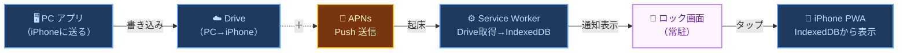
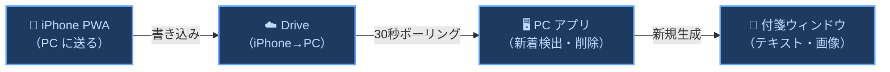

# 🌍 001 システム全体像 (Overview)

<p class="lead-text">
登場人物・技術スタック・データフロー・Vercelの役割
</p>

<p class="version-info">
設計書 v1.0 / 2026-04-19
</p>


## 1 登場人物

以下7つの登場人物でこのアプリは構成されています。

<div style="display:flex;gap:10px;flex-wrap:wrap;align-items:center;margin:16px 0 20px;padding:12px 16px;background:#f8fafc;border-radius:8px;border:1px solid #e2e8f0;">
  <span style="font-size:11px;font-weight:800;color:#475569;letter-spacing:0.05em;">凡例</span>
  <span style="background:#1e3a5f;color:#bfdbfe;border:2px solid #60a5fa;border-radius:6px;padding:3px 12px;font-size:12px;font-weight:600;">ユーザーのもの（PC・iPhone・Drive）</span>
  <span style="background:#14532d;color:#bbf7d0;border:2px solid #4ade80;border-radius:6px;padding:3px 12px;font-size:12px;font-weight:600;">開発者のもの（Vercel）</span>
  <span style="background:#78350f;color:#fef3c7;border:2px solid #fbbf24;border-radius:6px;padding:3px 12px;font-size:12px;font-weight:600;">外部サービス（APNs・Google OAuth2）</span>
</div>

```mermaid
graph LR
    classDef user fill:#1e3a5f,stroke:#60a5fa,color:#bfdbfe,stroke-width:2px
    classDef dev  fill:#14532d,stroke:#4ade80,color:#bbf7d0,stroke-width:2px
    classDef ext  fill:#78350f,stroke:#fbbf24,color:#fef3c7,stroke-width:2px

    PC["1⃣ PC アプリ<br>Tauri + Rust<br>（ユーザーのPC）"]:::user
    Drive["4⃣ Google Drive<br>ユーザー自身のドライブ<br>（開発者はアクセス不可）"]:::user
    Vercel["5⃣ Vercel<br>開発者がデプロイした<br>Webサーバー"]:::dev
    OAuth["6⃣ Google OAuth2<br>Googleのログイン基盤<br>（Google社が運営）"]:::ext
    Push["7⃣ APNs / FCM<br>AppleとGoogleの<br>通知配信サーバー"]:::ext

    subgraph iPhone ["2⃣ iPhone / iPad（ユーザーの端末）"]
        PWA["Safari PWA<br>viewer/page.tsx"]:::user
        SW["3⃣ Service Worker<br>バックグラウンド常駐"]:::user
    end

    PWA -->|"ログイン・トークン更新を依頼"| Vercel
    Vercel -->|"client_secretを使って<br>Googleに認証を依頼"| OAuth
    OAuth -.->|"access_token（Drive操作許可証）"| PWA

    PWA <-->|"ノート・画像ファイル"| Drive
    SW <-->|"ノート取得・削除"| Drive
    PC <-->|"ノート・デバイス登録情報"| Drive

    PC -->|"通知を送るよう依頼"| Push
    Push -->|"通知をiPhoneに配信"| SW
```
<p class="mermaid-caption">図 1-1　システム全体関係図</p>

### 登場人物の役割一覧

<div style="display:grid;grid-template-columns:1fr 1fr;gap:16px;margin:12px 0;">
<table class="module-table">
  <tr><th>No</th><th>登場人物</th><th>一言で言うと</th><th>何のために使うか</th></tr>
  <tr><td>1</td><td><strong>1⃣ 🖥 PC アプリ</strong></td><td>デスクトップ付箋アプリ</td><td>付箋の表示・編集・保存。iPhone に通知付きで送信。iPhone から受け取って付箋を開く</td></tr>
  <tr><td>2</td><td><strong>2⃣ 📱 iPhone PWA</strong></td><td>ホーム画面に追加した Web アプリ</td><td>PC からのノートを受け取り閲覧。メモを書いて PC に送る</td></tr>
  <tr><td>3</td><td><strong>3⃣ ⚙️ Service Worker</strong></td><td>iPhone の常駐プログラム</td><td>アプリを閉じていても Push を受信してノートを保存・通知表示。IndexedDB がデータの唯一の保存場所</td></tr>
  <tr><td>4</td><td><strong>4⃣ ☁️ Google Drive</strong></td><td>PC と iPhone の中継所</td><td>ノートデータを一時的に置く場所。処理したら即削除。開発者はアクセス不可</td></tr>
</table>
<table class="module-table">
  <tr><th>No</th><th>登場人物</th><th>一言で言うと</th><th>何のために使うか</th></tr>
  <tr><td>5</td><td><strong>5⃣ 🌐 Vercel</strong></td><td>開発者が置いた Web サーバー</td><td>iPhone PWA を配信。<code>client_secret</code> をブラウザに渡さず保護するための認証 API を置く</td></tr>
  <tr><td>6</td><td><strong>6⃣ 🔑 Google OAuth2</strong></td><td>Drive の鍵を発行する仕組み</td><td>ユーザーが自分の Drive を読み書きするための <code>access_token</code> を取得する</td></tr>
  <tr><td>7</td><td><strong>7⃣ 📡 APNs / FCM</strong></td><td>通知配信サーバー</td><td>PC からの「通知してください」を受け取り iPhone に届ける。APNs は iPhone/Mac、FCM は Chrome/Android</td></tr>
</table>
</div>

---

## 2 技術スタック

PCアプリ・iPhone PWA・共有インフラの3層に分けて使用技術を整理します。

<div style="display:grid;grid-template-columns:1fr 1fr 1fr;gap:16px;margin:16px 0;">

  <div>
    <div style="font-size:13px;font-weight:800;margin-bottom:8px;">🖥 PC アプリ</div>
    <table class="module-table">
      <tr><th>領域</th><th>技術・役割</th></tr>
      <tr><td>フレームワーク</td><td>Tauri v2（WebView + Rust）</td></tr>
      <tr><td>UI</td><td>Next.js 14 / React 18 / TypeScript / Tailwind</td></tr>
      <tr><td>エディタ</td><td>CodeMirror 6（Markdown ハイライト・検索）</td></tr>
      <tr><td>バックエンド</td><td>Rust（AppState・ファイル I/O・Win32 API）</td></tr>
      <tr><td>データ保存</td><td>ファイルシステム（JSON / Markdown）</td></tr>
      <tr><td>テスト</td><td>Vitest（ユニット）/ Playwright（E2E）</td></tr>
    </table>
  </div>

  <div>
    <div style="font-size:13px;font-weight:800;margin-bottom:8px;">📱 iPhone PWA</div>
    <table class="module-table">
      <tr><th>領域</th><th>技術・役割</th></tr>
      <tr><td>ページ</td><td>Next.js 14 App Router（app/viewer/page.tsx）</td></tr>
      <tr><td>配信</td><td>Vercel（API Routes も同居）</td></tr>
      <tr><td>バックグラウンド</td><td>Service Worker（worker/index.js）</td></tr>
      <tr><td>ローカル DB</td><td>IndexedDB（fusen-drafts）</td></tr>
      <tr><td>認証</td><td>Google OAuth2（Vercel API 経由）</td></tr>
      <tr><td>通知</td><td>Web Push / APNs / FCM</td></tr>
    </table>
  </div>

  <div>
    <div style="font-size:13px;font-weight:800;margin-bottom:8px;">🌐 共有インフラ</div>
    <table class="module-table">
      <tr><th>領域</th><th>技術・役割</th></tr>
      <tr><td>ホスティング</td><td>Vercel（PWA 配信・OAuth2 API）</td></tr>
      <tr><td>データ中継</td><td>Google Drive API（ユーザー所有）</td></tr>
      <tr><td>通知基盤</td><td>APNs / FCM（Apple / Google 運営）</td></tr>
      <tr><td>CI / CD</td><td>GitHub Actions（ビルド・Winget 自動リリース）</td></tr>
    </table>
  </div>

</div>

---

## 3 データフロー概要（2つのフロー）

PCアプリ・iPhone・Driveを結ぶ2つのデータの流れを概観します。

### 3.1 ➡️ フロー① PC → iPhone（メモを受け取る）

PCで書いたメモが、ロック画面の通知として iPhone に届くまでの全工程です。



<Note type="info">
<strong>フォールバック：</strong>電源オフ中に複数件送ると APNs は最新1件のみ保持。list 画面を開いたとき <code>notes_to_iphone.json</code> に残っているものを IndexedDB に補完してから Drive を削除する。
</Note>

### 3.2 ⬅️ フロー② iPhone → PC（メモを送る）



<Note type="success">
<strong>Drive 設計原則：</strong>Drive にあるものは全て未処理キュー。受信処理が完了したら即削除。残っていたら削除 API 失敗の残骸。
</Note>

---

## 4 なぜ Vercel が必要か

Google OAuth2 の <code>client_secret</code> を安全に保護するためにVercelが必要な理由を説明します。

**守っている対象：開発者（アプリ作者）のアプリ自体。** ユーザーの秘密情報ではない。

<code>client_secret</code> は開発者が Google Cloud Console で発行した「このアプリが本物であることを証明する鍵」。漏れると開発者のアプリが停止・悪用されるリスクがある。iPhone のコードに埋め込むと Safari DevTools で誰でも読めてしまう。

| No | 手法 | `client_secret` の場所 | 問題点・利点 |
|:---|:---|:---|:---|
| 1 | ✕ iPhone 直接 | iPhone のコードに埋め込む | Safari DevTools でユーザーが読める → 開発者のアプリが悪用される |
| 2 | ✔ Vercel 経由 | Vercel の環境変数に置く | iPhone（Safari）には届かない。Vercel のサーバー内だけで使われる |

<Note type="warning">
iPhone は Vercel の <code>/api/auth/token</code>・<code>/api/auth/refresh</code> を呼ぶだけ。<code>client_secret</code> は一切 iPhone に渡らない。
</Note>

---

## 5 改版履歴

| No | バージョン | 日付 | 変更内容 |
|:---|:---|:---|:---|
| 1 | 1.0 | 2026-04-19 | 設計書を 001/002/003 に再編。本ファイル（001）は全体像を担当。旧 001_ARCHITECTURE_DESIGN・003_SYSTEM_OVERVIEW の該当部分を統合 |
| 2 | 1.1 | 2026-04-24 | システム全体関係図を `graph LR`（横向き）に変更。スクロールなしで全体が見えるよう改善。 |
