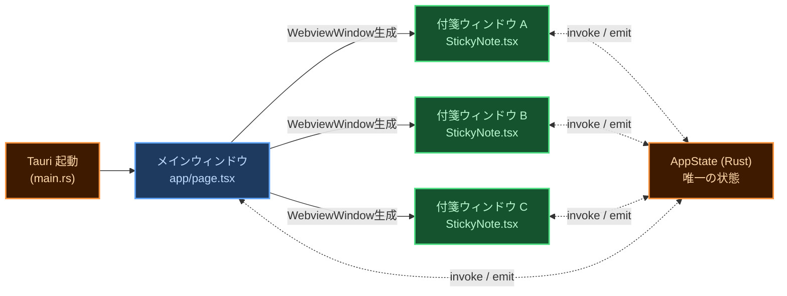
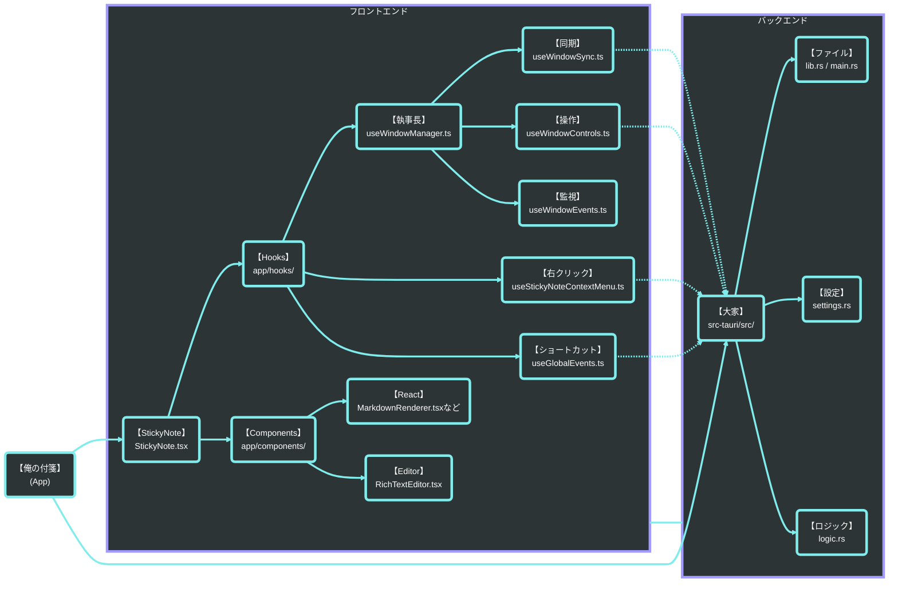
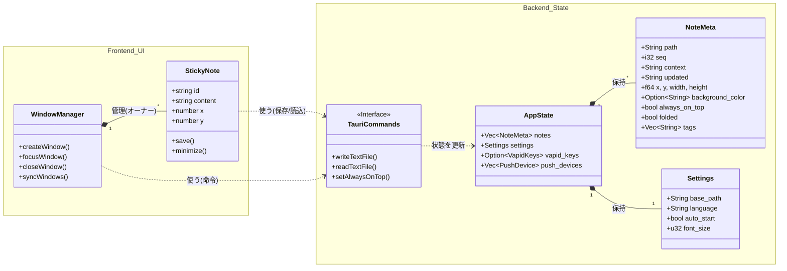
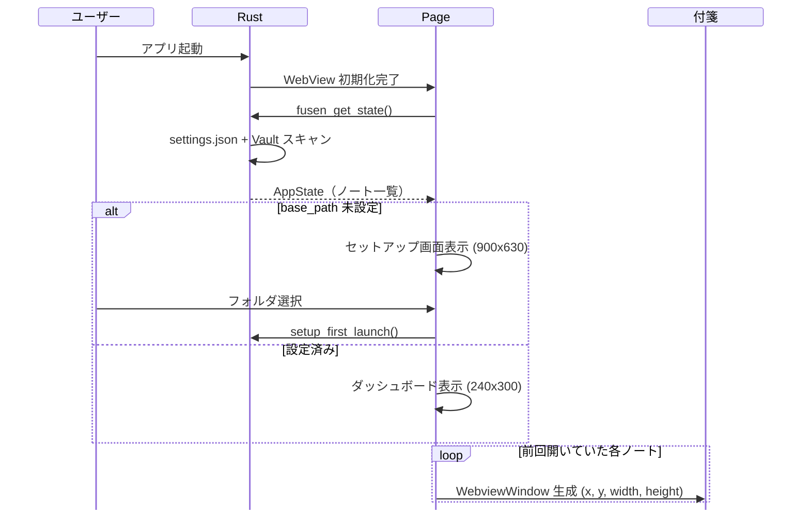
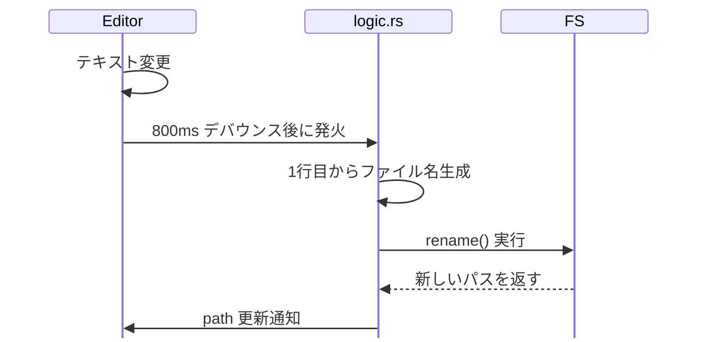
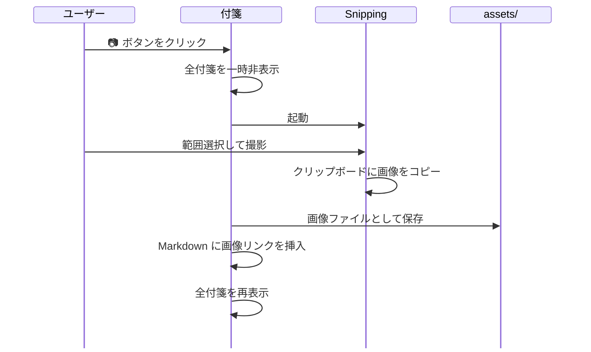
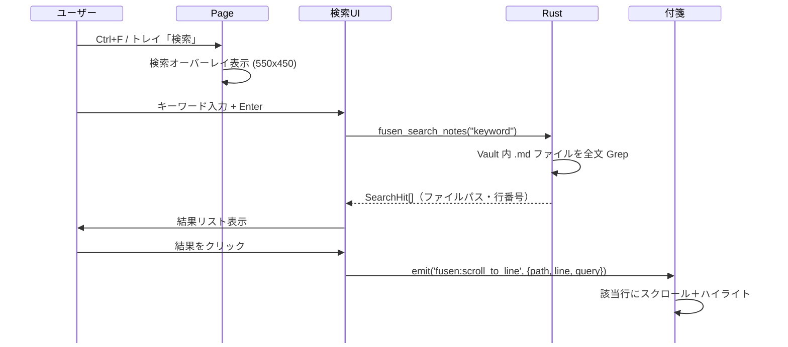
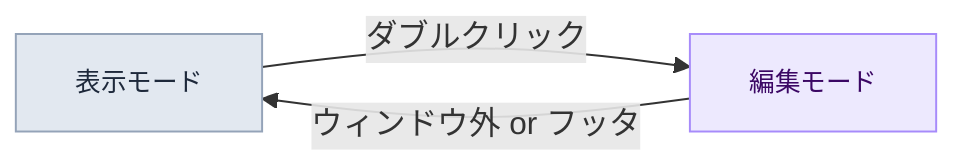

# 🖥 002 PCローカル・UI設計

画面構成・モジュール構造・データ構造・データフロー

設計書 v1.0 / 2026-04-19

---

## 1 画面構成

PCアプリはメインウィンドウ1枚＋付箋ウィンドウN枚のマルチウィンドウ構成です。

<Note type="info">
PC アプリは Tauri のマルチウィンドウ構造。メインウィンドウ1枚 ＋ 付箋ウィンドウ N 枚が独立して動く。ウィンドウ間の状態共有は Rust の <code>AppState</code> のみを通す。フロントエンドに状態を持たない。
</Note>

PC アプリのウィンドウ構成（メインウィンドウ 1 枚 ＋ 付箋ウィンドウ N 枚）

  <!-- ===== メインウィンドウ ===== -->
  

    

      

        ⚙️ 設定
        

          
−

          
□

          
✕

        

      

      

        
一般設定

        

        

        

        

        
通常はトレイに常駐

      

    

    
1.1 🏠 メインウィンドウ

    
app/page.tsx

  

  <dl class="screen-def" id="sec1-1">
    <dt>役割</dt>
    <dd>アプリの司令塔。ユーザーには見えないことが多い（トレイ常駐）</dd>
    <dt>機能</dt>
    <dd>
      起動時に付箋ウィンドウを生成・配置 
      設定画面・検索オーバーレイを表示 
      トレイアイコンのイベントを受け取る 
      iPhone からの受信（ポーリング）を担当
    </dd>
    <dt>ファイル</dt>
    <dd><code>app/page.tsx</code></dd>
  </dl>

  <!-- ===== 付箋ウィンドウ ===== -->
  

    

      

        買い物リスト
        

          📌
          ⊟
          ✕
        

      

      

        

          ☑ パンを買う 
          ☐ 牛乳 
          ☐ 卵×6
        

        

          BH1≡☑
        

      

    

    
1.2 📝 付箋ウィンドウ（N 枚）

    
StickyNote.tsx

  

  <dl class="screen-def" id="sec1-2">
    <dt>役割</dt>
    <dd>付箋 1 枚ごとに独立した <code>WebviewWindow</code></dd>
    <dt>機能</dt>
    <dd>
      テキスト編集（RichTextEditor） 
      ピン留め・たたむ・色変更 
      右クリックメニュー（iPhone 送信・アーカイブ等） 
      画像キャプチャ・リンク挿入
    </dd>
    <dt>ファイル</dt>
    <dd><code>app/components/StickyNote.tsx</code></dd>
  </dl>

### 1.3 ウィンドウ生成の仕組み

付箋1枚ごとに独立したTauriウィンドウが生成される仕組みを図示します。

図 2-1　ウィンドウ生成の仕組み

<Note type="warning">
<strong>状態管理の鉄則：</strong>ウィンドウ間で直接通信しない。付箋 A が何かを変えたいとき → Rust <code>AppState</code> を更新 → Tauri <code>emit()</code> で全ウィンドウに通知。フロントエンドは表示するだけ。
</Note>

---

## 2 モジュール構造

フロントエンド（TypeScript/React）とバックエンド（Rust）の2層構成です。

### 2.1 フロントエンド（TypeScript / React）

付箋ウィンドウを構成する主要コンポーネント・フック・ユーティリティの依存関係を示します。

図 2-2　フロントエンドモジュール構成

### 2.2 バックエンド（Rust）

TauriコマンドとAppStateを中心とするRust側モジュールの役割を一覧します。

表 2.2-1　バックエンドモジュール一覧

<table class="module-table">
  <tr><th>No</th><th>ファイル</th><th>役割</th><th>主な責務</th></tr>
  <tr><td>1</td><td><code>main.rs</code></td><td>エントリーポイント</td><td>Tauri アプリ起動・プラグイン登録・シングルインスタンス制御</td></tr>
  <tr><td>2</td><td><code>lib.rs</code></td><td>invoke ハンドラ定義</td><td>フロントエンドから呼ばれる全コマンドを宣言。処理は各モジュールに委譲</td></tr>
  <tr><td>3</td><td><code>state.rs</code></td><td>AppState（唯一の状態）</td><td>ノート一覧・設定・VAPID鍵・デバイス情報をメモリ上で保持。Mutex で排他制御</td></tr>
  <tr><td>4</td><td><code>settings.rs</code></td><td>設定管理</td><td>base_path・言語・フォントサイズ等を settings.json に読み書き</td></tr>
  <tr><td>5</td><td><code>logic.rs</code></td><td>付箋ビジネスロジック</td><td>ノート作成・保存・リネーム・アーカイブ・削除・タグ管理</td></tr>
  <tr><td>6</td><td><code>storage.rs</code></td><td>ファイル I/O</td><td>Markdown ファイルの読み書き・frontmatter パース</td></tr>
  <tr><td>7</td><td><code>tray.rs</code></td><td>トレイアイコン</td><td>トレイメニュー生成・全表示/全隠し・クリックイベント処理</td></tr>
</table>
<table class="module-table">
  <tr><th>No</th><th>ファイル</th><th>役割</th><th>主な責務</th></tr>
  <tr><td>8</td><td><code>webpush.rs</code></td><td>プッシュ通知送信</td><td>VAPID 鍵生成・APNs/FCM への Web Push 送信</td></tr>
  <tr><td>9</td><td><code>gdrive.rs</code></td><td>Google Drive 連携</td><td>Drive ファイルの読み書き・ポーリング（iPhone からの受信検出）</td></tr>
  <tr><td>10</td><td><code>capture.rs</code></td><td>画像キャプチャ</td><td>Snipping Tool 起動・クリップボード画像を assets/ に保存</td></tr>
  <tr><td>11</td><td><code>clipboard.rs</code></td><td>クリップボード</td><td>テキスト・画像のクリップボード読み書き</td></tr>
  <tr><td>12</td><td><code>sound.rs</code></td><td>効果音</td><td>保存音・通知音などの再生</td></tr>
  <tr><td>13</td><td><code>import.rs</code></td><td>ファイルインポート</td><td>外部 Markdown ファイルを Vault に取り込む</td></tr>
  <tr><td>14</td><td><code>logger.rs</code></td><td>ログ</td><td>デバッグログの出力管理</td></tr>
</table>

---

## 3 データ構造

付箋ファイル・設定ファイル・モジュール依存の3種類のデータ構造を定義します。

### 3.1 付箋データ（Markdown ファイル = frontmatter + 本文）

付箋1枚 = Markdown ファイル1枚。PC ローカルのファイルシステムが正。Drive は中継所に過ぎない。

表 3.1-1　付箋データフィールド一覧

<table class="module-table">
  <tr><th>No</th><th>フィールド</th><th>型</th><th>意味</th></tr>
  <tr><td>1</td><td><code>body</code></td><td>string</td><td>本文テキスト（Markdown）</td></tr>
  <tr><td>2</td><td><code>path</code></td><td>string</td><td>ファイルパス（実質的な主キー）</td></tr>
  <tr><td>3</td><td><code>context</code></td><td>string</td><td>コンテキスト名（本文1行目から自動生成）</td></tr>
  <tr><td>4</td><td><code>updated</code></td><td>string</td><td>最終更新日時</td></tr>
  <tr><td>5</td><td><code>x</code>, <code>y</code></td><td>number?</td><td>画面上の位置座標</td></tr>
  <tr><td>6</td><td><code>width</code>, <code>height</code></td><td>number?</td><td>ウィンドウサイズ</td></tr>
</table>
<table class="module-table">
  <tr><th>No</th><th>フィールド</th><th>型</th><th>意味</th></tr>
  <tr><td>7</td><td><code>background_color</code></td><td>string?</td><td>付箋の背景色</td></tr>
  <tr><td>8</td><td><code>always_on_top</code></td><td>bool?</td><td>最前面固定（ピン留め）</td></tr>
  <tr><td>9</td><td><code>folded</code></td><td>bool?</td><td>折りたたみ状態（最小化）</td></tr>
  <tr><td>10</td><td><code>seq</code></td><td>i32</td><td>重なり順（Z-index 相当）</td></tr>
  <tr><td>11</td><td><code>tags</code></td><td>string[]</td><td>タグ一覧</td></tr>
</table>

### 3.2 設定データ（`settings.json`）

`settings.json` で管理するアプリ全体の設定項目5点を定義します。

表 3.2-1　設定データフィールド一覧

<table class="module-table">
  <tr><th>No</th><th>フィールド</th><th>型</th><th>意味</th></tr>
  <tr><td>1</td><td><code>base_path</code></td><td>string?</td><td>Vault フォルダのパス（未設定なら初回セットアップ画面）</td></tr>
  <tr><td>2</td><td><code>language</code></td><td>string</td><td>表示言語</td></tr>
  <tr><td>3</td><td><code>auto_start</code></td><td>boolean</td><td>OS 起動時に自動起動するか</td></tr>
</table>
<table class="module-table">
  <tr><th>No</th><th>フィールド</th><th>型</th><th>意味</th></tr>
  <tr><td>4</td><td><code>font_size</code></td><td>number</td><td>基本フォントサイズ</td></tr>
  <tr><td>5</td><td><code>sound_enabled</code></td><td>boolean</td><td>効果音 ON/OFF</td></tr>
</table>

### 3.3 クラス図（依存関係）

主要モジュール間の依存関係をMermaidクラス図で示します。

図 2-3　クラス図（主要モジュール依存関係）

---

## 4 データフロー

アプリ起動から保存・画像・検索・iPhone連携まで6つのシーケンス図を示します。

### 4.1 アプリ起動

起動時にファイルシステムから付箋一覧を読み込むフローです。

図 2-4　アプリ起動シーケンス

### 4.2 付箋の保存・自動リネーム

本文の1行目をファイル名（context）として自動採用する。800ms のデバウンスで連続入力に追従。

図 2-5　付箋の保存・自動リネームシーケンス

### 4.3 画像キャプチャ

OS 内蔵の Snipping Tool を呼び出し、撮影された画像を Vault の <code>assets/</code> に自動保存する。

図 2-6　画像キャプチャシーケンス

### 4.4 全文検索

キーワードをリアルタイムで全付箋から検索するフローです。

図 2-7　全文検索シーケンス

---

## 5 UI インタラクション

付箋ウィンドウの操作領域・モード・マウス挙動を定義します。

<Note type="info">
付箋ウィンドウには <strong>表示モード（閲覧中）</strong> と <strong>編集モード（執筆中）</strong> の2状態がある。クリックした場所と現在のモードの組み合わせで動作が決まる。
</Note>

### 5.1 モード定義

表示・編集の2モードとその遷移条件を定義します。

表 5.1-1　モード定義

| No | モード | 状態 |
|:---|:---|:---|
| 1 | **表示モード（閲覧中）** | Markdown としてレンダリング済みの付箋を読んでいる状態 |
| 2 | **編集モード（執筆中）** | カーソルが点滅し文字を書き込める状態。背景が半透明の白になる |

図 2-8　モード遷移図

### 5.2 操作領域の定義

付箋ウィンドウをエディタ本文・余白(A)・フッタ(B)の3エリアに分けて操作を割り当てます。

  <svg width="420" height="310" viewBox="0 0 420 310" xmlns="http://www.w3.org/2000/svg" style="font-family:-apple-system,BlinkMacSystemFont,'Segoe UI',sans-serif;">
    <rect x="10" y="10" width="320" height="280" rx="10" ry="10" fill="white" stroke="#94a3b8" stroke-width="2"></rect>
    <rect x="10" y="10" width="320" height="40" rx="10" ry="10" fill="#e2e8f0" stroke="#94a3b8" stroke-width="2"></rect>
    <rect x="10" y="36" width="320" height="14" fill="#e2e8f0"></rect>
    <text x="170" y="35" text-anchor="middle" font-size="12" font-weight="700" fill="#475569">ヘッダー領域</text>
    <text x="170" y="48" text-anchor="middle" font-size="10" fill="#94a3b8">（ドラッグでウィンドウ移動）</text>
    <rect x="20" y="54" width="300" height="170" rx="4" fill="#fafafa" stroke="#cbd5e1" stroke-width="1.5"></rect>
    <rect x="20" y="54" width="180" height="170" rx="4" fill="#eff6ff" stroke="none"></rect>
    <rect x="20" y="54" width="180" height="170" fill="none" stroke="#93c5fd" stroke-width="1" stroke-dasharray="4,3"></rect>
    <rect x="28" y="70" width="120" height="8" rx="3" fill="#3b82f6" opacity="0.6"></rect>
    <rect x="28" y="86" width="155" height="8" rx="3" fill="#3b82f6" opacity="0.6"></rect>
    <rect x="28" y="102" width="90" height="8" rx="3" fill="#3b82f6" opacity="0.6"></rect>
    <line x1="122" y1="100" x2="122" y2="114" stroke="#1e40af" stroke-width="2"></line>
    <rect x="28" y="134" width="0" height="8" rx="3" fill="#3b82f6" opacity="0.3"></rect>
    <rect x="200" y="54" width="120" height="170" fill="#fef9c3" stroke="none"></rect>
    <rect x="200" y="54" width="120" height="170" fill="none" stroke="#fbbf24" stroke-width="1" stroke-dasharray="4,3"></rect>
    <text x="260" y="108" text-anchor="middle" font-size="13" font-weight="800" fill="#92400e">(A)</text>
    <text x="260" y="124" text-anchor="middle" font-size="11" fill="#92400e">エディタ余白</text>
    <text x="260" y="139" text-anchor="middle" font-size="10" fill="#b45309">（ドラッグ→ウィンドウ移動）</text>
    <text x="260" y="152" text-anchor="middle" font-size="10" fill="#b45309">（DBクリック→編集開始）</text>
    <text x="110" y="108" text-anchor="middle" font-size="12" font-weight="800" fill="#1e40af">エディタ本文</text>
    <text x="110" y="123" text-anchor="middle" font-size="10" fill="#3b82f6">（テキスト・リンク）</text>
    <rect x="20" y="224" width="300" height="56" rx="4" fill="#fdf4ff" stroke="#d8b4fe" stroke-width="1.5" stroke-dasharray="5,3"></rect>
    <text x="170" y="249" text-anchor="middle" font-size="13" font-weight="800" fill="#6b21a8">(B) フッタ領域</text>
    <text x="170" y="265" text-anchor="middle" font-size="10" fill="#7c3aed">文字が存在しない下部の空間（エディタ外）</text>
    <text x="170" y="278" text-anchor="middle" font-size="10" fill="#7c3aed">クリック→編集終了 / DBクリック→文末から編集開始</text>
    <rect x="345" y="54" width="14" height="14" rx="3" fill="#eff6ff" stroke="#93c5fd" stroke-width="1.5"></rect>
    <text x="364" y="65" font-size="11" fill="#1e40af">エディタ本文</text>
    <rect x="345" y="76" width="14" height="14" rx="3" fill="#fef9c3" stroke="#fbbf24" stroke-width="1.5"></rect>
    <text x="364" y="87" font-size="11" fill="#92400e">(A) 余白</text>
    <rect x="345" y="98" width="14" height="14" rx="3" fill="#fdf4ff" stroke="#d8b4fe" stroke-width="1.5"></rect>
    <text x="364" y="109" font-size="11" fill="#6b21a8">(B) フッタ</text>
  </svg>

図 2-9　付箋ウィンドウの操作領域

表 5.2-1　操作領域の定義

| No | 領域 | 場所 | ユーザーの意図 |
|:---|:---|:---|:---|
| 1 | **エディタ本文** | 文字・リンクが実際に存在する場所 | 「ここを直接操作・書き換えたい」 |
| 2 | **(A) エディタ余白** | 文字の右側・左側に広がる枠線内の空白 | 「この行の続きや近くから書き込みたい」 |
| 3 | **(B) フッタ領域** | 最後の行より下にある何もない空間（エディタ外） | 「一番下から追記したい」または「編集を終わらせたい」 |

### 5.3 インタラクション・マトリックス

エリア × 操作の組み合わせで起きる動作を一覧にまとめます。

#### 5.3.1 🖱 ワンクリック

表 5.3-1　ワンクリック操作一覧

| No | クリックした場所 | 表示モード | 編集モード |
|:---|:---|:---|:---|
| 1 | エディタ本文 | 何もしない（ドラッグ準備） | カーソル移動（その文字へ） |
| 2 | (A) エディタ余白 | 何もしない（ドラッグ準備） | カーソル移動（最近傍の文字へ） |
| 3 | (B) フッタ領域 | 何もしない（ドラッグ準備） | **編集終了** |
| 4 | リンク | **リンクを開く** | カーソル移動 |
| 5 | ウィンドウ外 | フォーカス解除 | **編集終了**（保存して表示モードへ） |

#### 5.3.2 🖱🖱 ダブルクリック

表 5.3-2　ダブルクリック操作一覧

| No | クリックした場所 | 表示モード | 編集モード |
|:---|:---|:---|:---|
| 1 | エディタ本文 | **編集開始**（クリックした文字から） | 単語選択 |
| 2 | (A) エディタ余白 | **編集開始**（最近傍の文字から） | — |
| 3 | (B) フッタ領域 | **編集開始**（文末から） | — |

#### 5.3.3 ✋ ドラッグ（押しっぱなしで移動）

表 5.3-3　ドラッグ操作一覧

| No | ドラッグした場所 | 表示モード | 編集モード |
|:---|:---|:---|:---|
| 1 | エディタ本文 | 🪟 ウィンドウ移動 | 📝 テキスト範囲選択 |
| 2 | (A) エディタ余白 | 🪟 ウィンドウ移動 | 🪟 ウィンドウ移動 |
| 3 | (B) フッタ領域 | 🪟 ウィンドウ移動 | 🪟 ウィンドウ移動 |

<Note type="warning">
<strong>右クリック：</strong>表示モードでは閲覧用メニュー（削除・色変更等）、編集モードでは編集用メニュー（コピー・貼り付け等）が開く。 
<strong>Ctrl + クリック：</strong>編集モード中でもリンクを強制的に開く。
</Note>

---

## 6 エラーハンドリング・リカバリ方針

<Note type="info">
各エラーケースの実施状況。⚠️ 未実施 は現時点での課題。
</Note>

### 6.1 ローカルファイルとリカバリ

#### 6.1.1 保存時のパス喪失保護（増殖バグ回避）
ユーザーが手動でファイルを移動・削除した場合や、リネーム処理が直前に行われた場合、古いパスに対する自動保存（ジオメトリ変更など）が発火すると古い名前でファイルが復活してしまう（増殖バグ）。
これを防ぐため、<code>logic.rs</code> の保存処理では**「上書き対象のファイルパスが物理的に存在するか（<code>!current_path_obj.exists()</code>）」をチェック**し、存在しない場合は保存処理をブロック（<code>Err</code> 返却）してトレースログを出力する保護機構を備えている（実施済み）。

#### 6.1.2 アトミック書き込みによるファイル破損防止
付箋内容の保存は、一時ファイルへの書き込み完了後に元のファイルへ <code>rename</code> するアトミック書き込みで行う。これにより、保存処理中の予期せぬ電源断やクラッシュによるデータ欠損・破損を完全に防ぐ（実施済み）。
ファイルシステムエラー（書き込み権限なし等）が発生した場合は、保存を中止し Tauri コマンドのエラーとして返却する。

#### 6.1.3 PC アプリ再起動時の状態復元
起動時に Vault フォルダを全スキャン（フロントマター解析）して付箋ウィンドウを再生成するため、アプリが異常終了した場合でも次回起動時にファイルの状態から自動復元される（実施済み）。
ただし、終了直前の「メモリ上にしか存在しない未保存の内容」は失われる（保存タイミングは blur 時またはデバウンス 800ms 経過後）。

---

## 7 環境変数・シークレット

PC版（Tauri アプリ）のビルド・リリースに必要な変数・シークレットの一覧です。

### 7.1 ローカルビルド用（`.env.local`）

`src-tauri/build.rs` がコンパイル時に読み取り、バイナリに直接埋め込む。`.env.local` は `.gitignore` 対象のため Git には含まない。

表 7.1-1　ローカルビルド用環境変数（.env.local）

| 変数名 | 取得元 | 用途 |
|:---|:---|:---|
| `GDRIVE_CLIENT_ID` | Google Cloud Console → 認証情報 → OAuth 2.0 クライアント（Tauri用） → クライアント ID | PC版 Drive 認証の OAuth Client ID。`gdrive.rs` 内で `env!()` マクロで参照。 |
| `GDRIVE_CLIENT_SECRET` | Google Cloud Console → 認証情報 → OAuth 2.0 クライアント（Tauri用） → クライアント シークレット | PC版 Drive 認証の OAuth Client Secret。`gdrive.rs` 内で `env!()` マクロで参照。 |

### 7.2 CI/CD用（GitHub Secrets）

GitHub Actions のリリースワークフロー（`release.yml` / `do-release.yml`）が参照するシークレット。

表 7.2-1　CI/CD用 GitHub Secrets

| シークレット名 | 用途 | 設定するワークフロー |
|:---|:---|:---|
| `GDRIVE_CLIENT_ID` | Tauri ビルド時の Drive Client ID（ローカルと同値） | `release.yml` |
| `GDRIVE_CLIENT_SECRET` | Tauri ビルド時の Drive Client Secret（ローカルと同値） | `release.yml` |
| `TAURI_SIGNING_PRIVATE_KEY` | Tauri アップデーター署名用秘密鍵 | `release.yml` |
| `TAURI_SIGNING_PRIVATE_KEY_PASSWORD` | 上記秘密鍵のパスフレーズ | `release.yml` |
| `WINGET_TOKEN` | winget-pkgs への PR 作成用 PAT（`public_repo` スコープ必要） | `release.yml` |
| `WINGET_APP_ID` | do-release.yml が main ブランチへ push するための GitHub App ID | `do-release.yml` |
| `WINGET_APP_PRIVATE_KEY` | 上記 GitHub App の秘密鍵 | `do-release.yml` |

<Note type="warning">
<code>WINGET_TOKEN</code> は PAT（Personal Access Token）。GitHub App トークンでは microsoft/winget-pkgs（外部 org）への PR が作れないため PAT が必要。 
<code>WINGET_APP_ID</code> / <code>WINGET_APP_PRIVATE_KEY</code> は同一 org 内の main ブランチへの push 用であり、winget とは別のトークン。
</Note>

---

## 8 改版履歴

表 8-1　改版履歴

| No | バージョン | 日付 | 変更内容 |
|:---|:---|:---|:---|
| 1 | 1.0 | 26-04-19 | 新規作成。旧 001_ARCHITECTURE_DESIGN.html のPC側内容（構造図・クラス図・シーケンス図・ER図）を統合・整理 |
| 2 | 1.1 | 26-04-24 | ウィンドウ構成図を `graph LR`（横向き）に変更。スクロールなしで全体が見えるよう改善。 |
| 3 | 1.2 | 26-04-26 | セクション7「環境変数・シークレット」を新規追加。ローカルビルド用とCI/CD用を分けて記載。 |

