<script setup>
import { withBase } from 'vitepress'
</script>

# 🖥 002 PCローカル・UI設計

<p class="lead-text">
画面構成・モジュール構造・データ構造・データフロー
</p>

<p class="version-info">
設計書 v2.91 / 2026-08-29
</p>

---

## 1 画面構成

PCアプリはメインウィンドウ1枚＋付箋ウィンドウN枚のマルチウィンドウ構成です。

<Note type="info">
PC アプリは Tauri のマルチウィンドウ構造。メインウィンドウ1枚 ＋ 付箋ウィンドウ N 枚が独立して動く。ウィンドウ間の状態共有は Rust の <code>AppState</code> のみを通す。フロントエンドに状態を持たない。
</Note>

<div class="group-label group-safari">PC アプリのウィンドウ構成（メインウィンドウ 1 枚 ＋ 付箋ウィンドウ N 枚）</div>
<div class="screens-grid">

  <!-- ===== メインウィンドウ ===== -->
  <div class="phone">
    <div style="width:155px;border-radius:4px;overflow:hidden;box-shadow:0 4px 20px rgba(0,0,0,0.3);">
      <div style="background:#f3f3f3;padding:3px 0 3px 6px;display:flex;align-items:center;justify-content:space-between;border-bottom:1px solid #d0d0d0;">
        <span style="font-size:6px;color:#1c1c1c;">⚙️ 設定</span>
        <div style="display:flex;">
          <div style="width:18px;height:16px;display:flex;align-items:center;justify-content:center;font-size:8px;color:#444;">−</div>
          <div style="width:18px;height:16px;display:flex;align-items:center;justify-content:center;font-size:7px;color:#444;">□</div>
          <div style="width:18px;height:16px;display:flex;align-items:center;justify-content:center;font-size:7px;background:#c42b1c;color:white;">✕</div>
        </div>
      </div>
      <div style="background:#f8fafc;padding:8px;min-height:110px;">
        <div style="font-size:6px;font-weight:700;color:#374151;margin-bottom:6px;">一般設定</div>
        <div style="background:#e2e8f0;border-radius:3px;height:5px;margin-bottom:4px;"></div>
        <div style="background:#e2e8f0;border-radius:3px;height:5px;margin-bottom:4px;width:75%;"></div>
        <div style="background:#e2e8f0;border-radius:3px;height:5px;margin-bottom:10px;width:60%;"></div>
        <div style="background:#e2e8f0;border-radius:3px;height:5px;margin-bottom:4px;"></div>
        <div style="font-size:5px;color:#94a3b8;margin-top:10px;text-align:center;">通常はトレイに常駐</div>
      </div>
    </div>
    <div class="screen-name">1.1 🏠 メインウィンドウ</div>
    <div class="screen-cond">app/page.tsx</div>
  </div>
  <dl class="screen-def" id="sec1-1">
    <dt>役割</dt>
    <dd>アプリの司令塔。ユーザーには見えないことが多い（トレイ常駐）</dd>
    <dt>機能</dt>
    <dd>
      起動時に付箋ウィンドウを生成・配置<br>
      設定画面・検索オーバーレイを表示<br>
      トレイアイコンのイベントを受け取る<br>
      iPhone からの受信（ポーリング）を担当
    </dd>
    <dt>ファイル</dt>
    <dd><code>app/page.tsx</code></dd>
  </dl>

  <!-- ===== 付箋ウィンドウ ===== -->
  <div class="phone">
    <div style="width:155px;border-radius:8px;overflow:hidden;box-shadow:0 6px 24px rgba(0,0,0,0.2);border:2px solid #fcd34d;">
      <div style="background:#fef3c7;padding:5px 8px;display:flex;align-items:center;justify-content:space-between;">
        <span style="font-size:6px;color:#92400e;font-weight:700;">買い物リスト</span>
        <div style="display:flex;gap:5px;align-items:center;">
          <span style="font-size:8px;color:#b45309;">📌</span>
          <span style="font-size:9px;color:#b45309;line-height:1;">⊟</span>
          <span style="font-size:8px;color:#b45309;">✕</span>
        </div>
      </div>
      <div style="background:#fefce8;padding:8px;min-height:110px;">
        <div style="font-size:7px;color:#374151;line-height:1.9;">
          ☑ パンを買う<br>
          ☐ 牛乳<br>
          ☐ 卵×6
        </div>
        <div style="margin-top:10px;background:#fef9c3;border-radius:3px;padding:3px 5px;font-size:5px;color:#78350f;display:flex;gap:4px;">
          <span>B</span><span>H1</span><span>≡</span><span>☑</span>
        </div>
      </div>
    </div>
    <div class="screen-name">1.2 📝 付箋ウィンドウ（N 枚）</div>
    <div class="screen-cond">StickyNote.tsx</div>
  </div>
  <dl class="screen-def" id="sec1-2">
    <dt>役割</dt>
    <dd>付箋 1 枚ごとに独立した <code>WebviewWindow</code></dd>
    <dt>機能</dt>
    <dd>
      テキスト編集（RichTextEditor）<br>
      ピン留め・たたむ・色変更<br>
      右クリックメニュー（iPhone 送信・アーカイブ等）<br>
      画像キャプチャ・リンク挿入
    </dd>
    <dt>ファイル</dt>
    <dd><code>app/components/StickyNote.tsx</code></dd>
  </dl>

</div>

### 1.3 メインウィンドウの画面一覧と画面遷移

メインウィンドウ（`app/page.tsx`）は単一の React コンポーネントで、状態に応じて表示する「画面」を切り替えます。各画面に画面 ID（英小文字）と画面名（日本語）を付けて一覧にします。画面 ID は `app/page.tsx` の表示判定（早期 return / `isXxx` フラグ）に対応します。

<p class="table-caption">表 1.3-1　メインウィンドウの状態・画面一覧</p>

| 画面 ID | 画面名 | 実体（コンポーネント） | 表示・遷移の起点 |
|---|---|---|---|
| `dashboard` | トレイ常駐 | （メインウィンドウを非表示にしトレイ常駐） | `isDashboard`（他のどの画面でもない待機状態） |
| `setup` | 初回セットアップ | `SettingsPage`（`defaultTab='general'`） | `setupRequired`（初回起動・要設定） |
| `settings` | 設定画面 | `SettingsPage` | トレイメニュー「設定」→ `fusen:open_settings` |
| `help` | 使い方 | `SettingsPage`（help タブ） | 付箋の「？」ボタン / 右クリック「使い方」→ `fusen:open_settings { tab:'help' }`。help タブ最下部から GitHub Wiki の完全版ユーザーガイドを開ける |
| `search` | 検索 | `SearchOverlay` | トレイメニュー「検索」または付箋ウィンドウ上の `Ctrl+F` → `fusen:open_search` |
| `update` | アップデート確認 | `ConfirmDialog` | 起動後の自動更新チェックで `showUpdateDialog` が true |
| `loading` | ローディング | `LoadingScreen` | `isCheckingSetup`（起動時のセットアップ確認中） |
| `note` | 付箋ウィンドウ | `StickyNote` | URL に `path` または `isPool=true`（独立ウィンドウ） |

<Note type="info">
「使い方」（<code>help</code>）は独立した画面ではなく、<strong>設定画面（<code>settings</code>）の中の 1 タブ</strong>です。付箋の左下「？」ボタンを押すと、設定画面を <code>help</code> タブで開きます。
</Note>

メインウィンドウ内の画面どうしの遷移を示します。線の重なりを避けるため、この図では「どこからどの画面を開くか」だけを示します。`settings` / `help` / `search` / `update` は閉じると `tray`（トレイ常駐）へ戻ります。`note`（付箋ウィンドウ）は独立した別ウィンドウのため、メイン画面そのものではありません。ただし、付箋の「？」ボタンと `Ctrl+F` はメインウィンドウの help / search を開く外部トリガーなので、点線ノードとして図に含めます。help タブから先に開く GitHub Wiki も、アプリ外の遷移先として点線で示します。

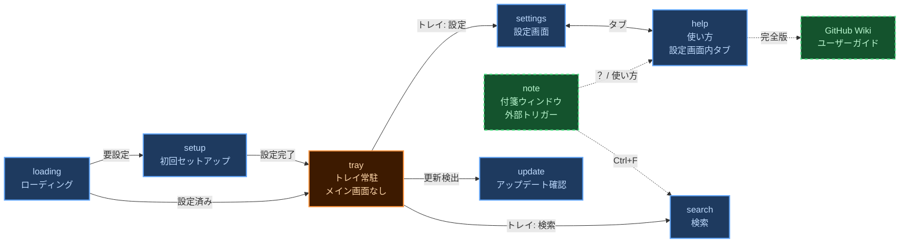
<p class="mermaid-caption">図 1.3-1　メインウィンドウの画面遷移図</p>

### 1.4 ウィンドウ生成の仕組み

付箋1枚ごとに独立したTauriウィンドウが生成される仕組みを図示します。

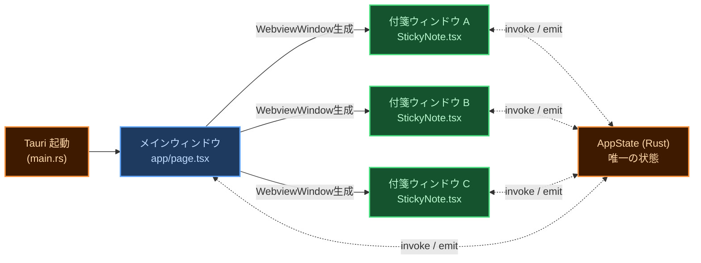
<p class="mermaid-caption">図 2-1　ウィンドウ生成の仕組み</p>

<Note type="warning">
<strong>状態管理の鉄則：</strong>ウィンドウ間で直接通信しない。付箋 A が何かを変えたいとき → Rust <code>AppState</code> を更新 → Tauri <code>emit()</code> で全ウィンドウに通知。フロントエンドは表示するだけ。
</Note>

---

## 2 モジュール構造

フロントエンド（TypeScript/React）とバックエンド（Rust）の2層構成です。

### 2.1 フロントエンド（TypeScript / React）

付箋ウィンドウを構成する主要コンポーネント・フック・ユーティリティの依存関係を示します。

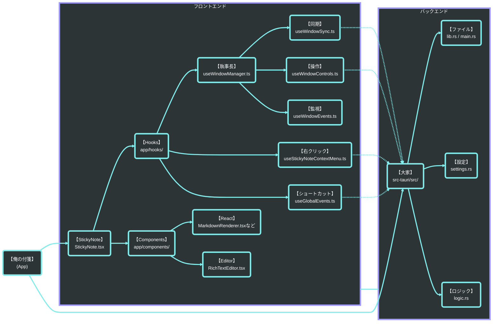
<p class="mermaid-caption">図 2-2　フロントエンドモジュール構成</p>

### 2.2 バックエンド（Rust）

TauriコマンドとAppStateを中心とするRust側モジュールの役割を一覧します。

<p class="table-caption">表 2.2-1　バックエンドモジュール一覧</p>
<div style="display:grid;grid-template-columns:1fr 1fr;gap:16px;margin:4px 0 12px 0;">
<table class="module-table">
  <tr><th>No</th><th>ファイル</th><th>役割</th><th>主な責務</th></tr>
  <tr><td>1</td><td><code>main.rs</code></td><td>エントリーポイント</td><td>Tauri アプリ起動・プラグイン登録・シングルインスタンス制御</td></tr>
  <tr><td>2</td><td><code>lib.rs</code></td><td>invoke ハンドラ定義</td><td>フロントエンドから呼ばれる全コマンドを宣言。処理は各モジュールに委譲</td></tr>
  <tr><td>3</td><td><code>state.rs</code></td><td>AppState（唯一の状態）</td><td>ノート一覧・設定・VAPID鍵・デバイス情報をメモリ上で保持。Mutex で排他制御</td></tr>
  <tr><td>4</td><td><code>settings.rs</code></td><td>設定管理</td><td>base_path・言語・フォントサイズ等を settings.json に読み書き</td></tr>
  <tr><td>5</td><td><code>logic.rs</code></td><td>付箋ビジネスロジック</td><td>ノート作成・保存・リネーム・アーカイブ・削除・タグ管理</td></tr>
  <tr><td>6</td><td><code>storage.rs</code></td><td>ファイル I/O</td><td>Markdown ファイルの読み書き・frontmatter パース</td></tr>
  <tr><td>7</td><td><code>tray.rs</code></td><td>トレイアイコン</td><td>トレイメニュー生成・全表示/全隠し・クリックイベント処理</td></tr>
</table>
<table class="module-table">
  <tr><th>No</th><th>ファイル</th><th>役割</th><th>主な責務</th></tr>
  <tr><td>8</td><td><code>webpush.rs</code></td><td>プッシュ通知送信</td><td>VAPID 鍵生成・APNs/FCM への Web Push 送信</td></tr>
  <tr><td>9</td><td><code>gdrive.rs</code></td><td>Google Drive 連携</td><td>Drive ファイルの読み書き・ポーリング（iPhone からの受信検出）</td></tr>
  <tr><td>10</td><td><code>capture.rs</code></td><td>画像キャプチャ</td><td>Snipping Tool 起動・クリップボード画像を assets/ に保存</td></tr>
  <tr><td>11</td><td><code>clipboard.rs</code></td><td>クリップボード</td><td>テキスト・画像のクリップボード読み書き</td></tr>
  <tr><td>12</td><td><code>sound.rs</code></td><td>効果音</td><td>保存音・通知音などの再生</td></tr>
  <tr><td>13</td><td><code>import.rs</code></td><td>ファイルインポート</td><td>外部 Markdown ファイルを Vault に取り込む</td></tr>
  <tr><td>14</td><td><code>logger.rs</code></td><td>ログ</td><td>デバッグログの出力管理</td></tr>
</table>
</div>

---

## 3 データ構造

付箋ファイル・設定ファイル・モジュール依存の3種類のデータ構造を定義します。

### 3.1 付箋データ（Markdown ファイル = frontmatter + 本文）

付箋1枚 = Markdown ファイル1枚。PC ローカルのファイルシステムが正。Drive は中継所に過ぎない。

<p class="table-caption">表 3.1-1　付箋データフィールド一覧</p>
<div style="display:grid;grid-template-columns:1fr 1fr;gap:16px;margin:4px 0 12px 0;">
<table class="module-table">
  <tr><th>No</th><th>フィールド</th><th>型</th><th>用途・内容</th></tr>
  <tr><td>1</td><td><code>body</code></td><td>string</td><td>本文テキスト（Markdown）</td></tr>
  <tr><td>2</td><td><code>path</code></td><td>string</td><td>ファイルパス（実質的な主キー）</td></tr>
  <tr><td>3</td><td><code>context</code></td><td>string</td><td>コンテキスト名（本文1行目から自動生成）</td></tr>
  <tr><td>4</td><td><code>updated</code></td><td>string</td><td>最終更新日時</td></tr>
  <tr><td>5</td><td><code>x</code>, <code>y</code></td><td>number?</td><td>画面上の位置座標</td></tr>
  <tr><td>6</td><td><code>width</code>, <code>height</code></td><td>number?</td><td>ウィンドウサイズ</td></tr>
</table>
<table class="module-table">
  <tr><th>No</th><th>フィールド</th><th>型</th><th>用途・内容</th></tr>
  <tr><td>7</td><td><code>background_color</code></td><td>string?</td><td>付箋の背景色</td></tr>
  <tr><td>8</td><td><code>always_on_top</code></td><td>bool?</td><td>最前面固定（ピン留め）</td></tr>
  <tr><td>9</td><td><code>folded</code></td><td>bool?</td><td>折りたたみ状態（最小化）</td></tr>
  <tr><td>10</td><td><code>seq</code></td><td>i32</td><td>重なり順（Z-index 相当）</td></tr>
  <tr><td>11</td><td><code>tags</code></td><td>string[]</td><td>タグ一覧</td></tr>
  <tr><td>12</td><td><code>outlineCollapsed</code></td><td>number[]?</td><td>本文アウトラインで閉じた親項目の0始まり行番号。平坦な単一行で保存する</td></tr>
</table>
</div>

<Note type="info">
<strong>型の <code>?</code> について：</strong><code>number?</code> や <code>string?</code> は「任意項目」を表す。値がない場合があるため、読み込み側は未設定として扱い、既定値や再計算で補う。
</Note>

### 3.2 設定データ（`settings.json`）

`settings.json` で管理するアプリ全体の設定項目を定義します。保存場所は `%APPDATA%\OreNoFusen\settings.json`（アンインストールしても残る領域）。

設定保存は `settings.json.tmp` への書き込みと再読込検証を完了してから本体を交換し、直前の正常な1世代を `settings.json.bak` に保持する。本体が読めない場合は正常な `.bak` を読み込むが、両方が読めない場合は既定値で上書きせずエラーとして停止する。壊れた本体から `.bak` を更新してはならない。

<p class="table-caption">表 3.2-1　設定データフィールド一覧</p>
<div style="display:grid;grid-template-columns:1fr 1fr;gap:16px;margin:4px 0 12px 0;">
<table class="module-table">
  <tr><th>No</th><th>フィールド</th><th>型</th><th>用途・内容</th></tr>
  <tr><td>1</td><td><code>base_path</code></td><td>string?</td><td>Vault フォルダのパス（未設定なら初回セットアップ画面）</td></tr>
  <tr><td>2</td><td><code>language</code></td><td>string</td><td>表示言語</td></tr>
  <tr><td>3</td><td><code>auto_start</code></td><td>boolean</td><td>OS 起動時に自動起動するか</td></tr>
  <tr><td>4</td><td><code>desktop_shortcut_prompted</code></td><td>boolean</td><td>MSIX版のデスクトップショートカット初回確認を表示済みか</td></tr>
</table>
<table class="module-table">
  <tr><th>No</th><th>フィールド</th><th>型</th><th>用途・内容</th></tr>
  <tr><td>5</td><td><code>font_size</code></td><td>number</td><td>基本フォントサイズ</td></tr>
  <tr><td>6</td><td><code>sound_enabled</code></td><td>boolean</td><td>効果音 ON/OFF</td></tr>
  <tr><td>7</td><td><code>pc_id</code></td><td>string?</td><td>この PC を一意に識別する UUID。Drive 上の <code>pc_devices.json</code> と紐づく。初回起動時に Rust が自動生成し、ユーザーには見せない</td></tr>
  <tr><td>8</td><td><code>analytics_consent</code></td><td>string?</td><td>匿名利用状況の送信同意。未選択、<code>granted</code>、<code>denied</code> のいずれか</td></tr>
</table>
</div>

::: tip pc_id を settings.json に置く理由
旧バージョンでは `pc_id` を別ファイル `%LOCALAPPDATA%\ore-no-fusen\pc_device.json` に保存していました。しかし `LOCALAPPDATA` 側はアンインストール時に削除されるため、再インストールするたびに新しい `pc_id` が生成され、Drive 上の `pc_devices.json` に古い登録がゴミとして残る問題がありました。`settings.json`（`%APPDATA%` 側＝アンインストールしても残る領域）に移すことで、再インストールしても同じ `pc_id` が継続して使われ、Drive 上にゴミが生まれなくなります。起動時に旧 `pc_device.json` が見つかれば自動で `settings.json` に移行し、旧ファイルは削除します。
:::

### 3.3 クラス図（依存関係）

主要モジュール間の依存関係をMermaidクラス図で示します。

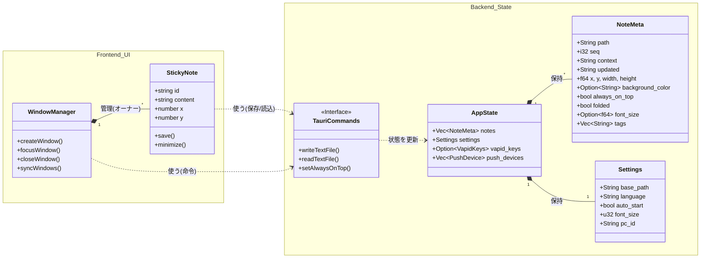
<p class="mermaid-caption">図 2-3　クラス図（主要モジュール依存関係）</p>

---

## 4 データフロー

アプリ起動から保存・画像・検索まで4つのシーケンス図を示します。

<Note type="info">
シーケンス図では、<strong>①②③</strong> はユーザーが実施する操作、<strong>❶❷❸</strong> はアプリ・OS・ファイルシステムが自動実行する処理を表します。
</Note>

### 4.1 アプリ起動

起動時にファイルシステムから付箋一覧を読み込むフローです。

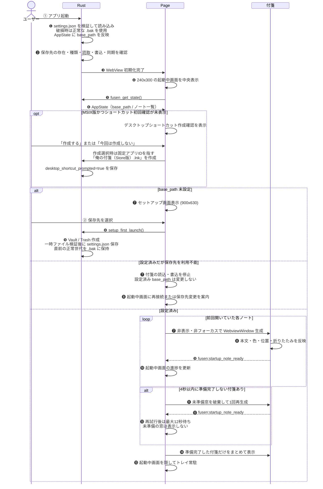
<p class="mermaid-caption">図 2-4　アプリ起動シーケンス</p>

起動中は中央のローディング画面を表示し続け、現在のアプリアイコンと同じFアイコン、バージョン、復元進捗を表示する。各付箋は裏で準備し、本文読込みと保存済みの折りたたみサイズ反映を完了してから2回の描画フレームを待って準備完了とし、全件完了後にまとめて表示する。WebView生成は同時2枚に制限して並行化し、直列生成による待ち時間を減らしながら生成集中によるクラッシュを避ける。準備完了通知は付箋単位で管理し、通知が欠けた付箋は4秒で最初の待機を打ち切り、未準備窓を破棄して1回だけ再生成する。再試行後はNext.js開発版の再コンパイルも考慮して最大12秒待つ。準備完了通知を受けた時点で直ちに待機を終えるため、正常起動は遅延させない。再試行後も準備できない窓は空のまま表示せず、準備完了した付箋だけを表示する。全件が未準備なら起動中画面を残して再起動を案内する。通常の新規付箋作成・iPhone受信・結晶表示にはこの非表示復元を適用しない。

### 4.2 付箋の保存・自動リネーム

本文の1行目をファイル名（context）として自動採用する。800ms のデバウンスで連続入力に追従。新規付箋の先頭へクリップボード画像を貼り付けた場合は、保存完了を待たずクリップボード由来の一時画像をエディタ内部だけへ表示し、PNGを高速圧縮設定で保存する。保存成功後に一時画像を正式な画像Markdownへ置換し、保存失敗時は一時画像を除去する。一時URLは本文へ追加せず、保存中に本文が変化した場合も挿入位置を追従する。画像Markdownの直後へ改行を自動挿入してカーソルを次行へ置く。この場合は先頭の画像行を除外し、次の空でないテキスト行をファイル名として採用する。Explorer等から画像ファイルを本文へドロップした場合は、PNG / JPEG / GIF / WebP / BMPだけを1件最大50MBまで受け付け、対象付箋の`assets/`へ一意名でコピーする。編集モードではドロップした文字位置、Explorerへフォーカスが移って表示モードへ戻った場合は本文末尾へ画像Markdownを挿入する。非対応ファイルを含む場合は理由を表示して全件を受け付けない。複数画像または本文保存の途中で失敗した場合は、今回作成した画像を削除して本文を変更しない。まだファイルを持たない空のPool付箋では、画像ドロップを最初の入力として付箋ファイルを遅延作成するため、事前の文字入力を要求しない。編集モードで画像本体をクリックした場合は編集を終了して保存・ファイル名確定を行う。画像右下のリサイズハンドル操作では編集を終了しない。編集・表示モード間で同じローカル画像を再生成する場合は、変換済みasset URLを最大256件のメモリキャッシュから再利用し、透明画像によるフラッシュを抑止する。追加のディスクI/Oは行わない。

<div class="seq-small">

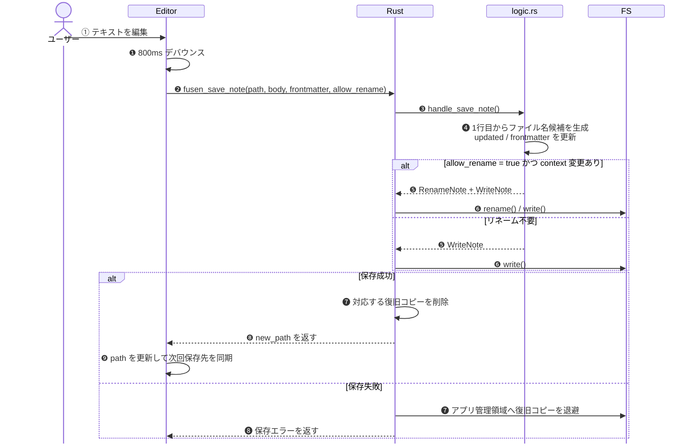
<p class="mermaid-caption">図 2-5　付箋の保存・自動リネームシーケンス</p>
</div>

#### 4.2.1 本文アウトライン

通常の非空行は、行頭の半角スペース2個を1階層として親子関係を導出する。箇条書き記号の入力は必須とせず、既存本文へ記号や識別子を追加しない。空行はアウトラインの区切りとし、Markdown表、画像だけの行、コードフェンスとその内部は階層対象外とする。階層情報のない既存本文は全行を最上位として扱う。

編集モードの `Tab` はカーソル位置へ半角スペース2個を入力するだけとし、親子関係の妥当性を編集時には判断しない。行頭の半角スペース2個を表示時の1階層、4個を2階層として解釈する。`Shift+Tab` は現在行の行頭スペースを最大2個戻す。行左端の狭い操作領域をドラッグすると、対象項目と全子孫を一体で移動する。新しいライブラリは使用せず、CodeMirrorの同一トランザクションで本文を更新する。

編集モードでは開閉UIを表示せず、閉じた親の子孫も含めて全行を表示する。入力した半角スペースをそのまま描画し、階層を示す追加インデントや装飾を行わない。行左端のドラッグ領域は通常時に隠し、行へホバーしたときだけ控えめに表示する。

表示モードでは、子を持つ項目だけに開閉UIを出す。閉じた親の右向き記号 `›` は常時表示し、開いている親の下向き記号 `⌄` は通常隠して行へのホバー時だけ表示する。フォーカス時はどちらも強調する。開閉記号は各項目の文字のすぐ左に16px・中太で表示し、深い項目では保存本文の行頭スペースと一緒に右へ移動する。配置幅は共通12px余白内で相殺し、記号だけのはみ出しを許可して本文位置を動かさない。編集モードも記号を出さず同じ本文開始位置を使う。階層部分は独自のピクセル幅へ置換せず、保存本文の行頭半角スペースを同じフォントと文字サイズでそのまま描画する。閉じた親は文末へ控えめな `…` を表示し、深さにかかわらず全子孫を隠す。親自身と後続の同階層項目は表示する。項目名変更、階層変更、並べ替え、保存、再起動によって開閉状態を勝手に変更しない。

開閉状態は既存の図2-5の保存シーケンスを使用し、frontmatterの `outlineCollapsed` に0始まり行番号の単一行配列として保存する。本文編集で行が増減した場合は同じ親行を本文から追跡して行番号を更新し、アプリ内ドラッグでは移動範囲と同時に行番号を移す。項目別の開閉情報がない既存ファイルは全項目を開いた状態で読み込み、本文・既存frontmatter・Rustの `Note` 構造を変換しない。付箋ウィンドウ全体の最小化に使う既存 `folded` とは独立して扱う。

### 4.3 画像キャプチャ

OS 内蔵の Snipping Tool を呼び出し、撮影された画像を Vault の <code>assets/</code> に自動保存する。

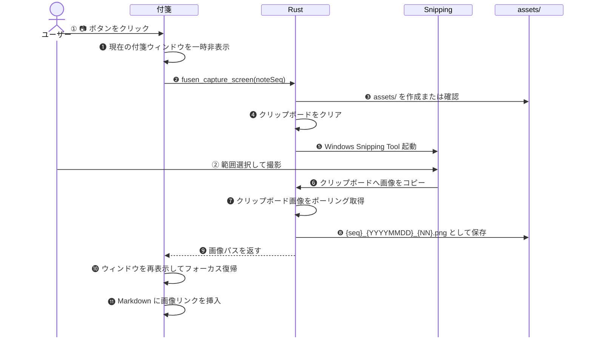
<p class="mermaid-caption">図 2-6　画像キャプチャシーケンス</p>

### 4.4 全文検索

キーワードをリアルタイムで全付箋から検索するフローです。

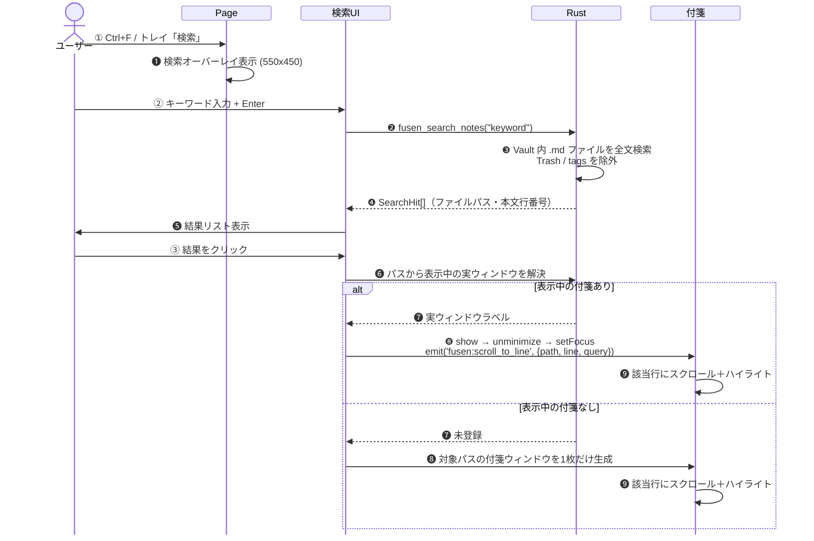
<p class="mermaid-caption">図 2-7　全文検索シーケンス</p>

---

## 5 UI インタラクション

付箋ウィンドウの操作領域・モード・マウス挙動を定義します。

<Note type="info">
付箋ウィンドウには <strong>表示モード（閲覧中）</strong> と <strong>編集モード（執筆中）</strong> の2状態がある。クリックした場所と現在のモードの組み合わせで動作が決まる。
</Note>

### 5.1 モード定義

表示・編集の2モードとその遷移条件を定義します。

<p class="table-caption">表 5.1-1　モード定義</p>

| No | モード | 状態 |
|:---|:---|:---|
| 1 | **表示モード（閲覧中）** | Markdown としてレンダリング済みの付箋を読んでいる状態 |
| 2 | **編集モード（執筆中）** | カーソルが点滅し文字を書き込める状態。背景が半透明の白になる |

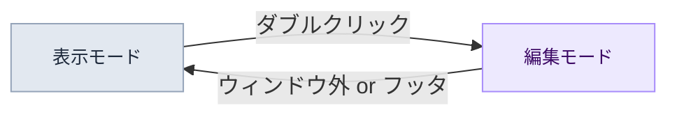
<p class="mermaid-caption">図 2-8　モード遷移図</p>

### 5.2 操作領域の定義

付箋ウィンドウをエディタ本文・余白(A)・フッタ(B)の3エリアに分けて操作を割り当てます。

<div style="display:flex; justify-content:center; margin:0 0 24px;">
  <svg width="420" height="310" viewBox="0 0 420 310" xmlns="http://www.w3.org/2000/svg" style="font-family:-apple-system,BlinkMacSystemFont,'Segoe UI',sans-serif;">
    <rect x="10" y="10" width="320" height="280" rx="10" ry="10" fill="white" stroke="#94a3b8" stroke-width="2"></rect>
    <rect x="10" y="10" width="320" height="40" rx="10" ry="10" fill="#e2e8f0" stroke="#94a3b8" stroke-width="2"></rect>
    <rect x="10" y="36" width="320" height="14" fill="#e2e8f0"></rect>
    <text x="170" y="35" text-anchor="middle" font-size="12" font-weight="700" fill="#475569">ヘッダー領域</text>
    <text x="170" y="48" text-anchor="middle" font-size="10" fill="#94a3b8">（ドラッグでウィンドウ移動）</text>
    <rect x="20" y="54" width="300" height="170" rx="4" fill="#fafafa" stroke="#cbd5e1" stroke-width="1.5"></rect>
    <rect x="20" y="54" width="180" height="170" rx="4" fill="#eff6ff" stroke="none"></rect>
    <rect x="20" y="54" width="180" height="170" fill="none" stroke="#93c5fd" stroke-width="1" stroke-dasharray="4,3"></rect>
    <rect x="28" y="70" width="120" height="8" rx="3" fill="#3b82f6" opacity="0.6"></rect>
    <rect x="28" y="86" width="155" height="8" rx="3" fill="#3b82f6" opacity="0.6"></rect>
    <rect x="28" y="102" width="90" height="8" rx="3" fill="#3b82f6" opacity="0.6"></rect>
    <line x1="122" y1="100" x2="122" y2="114" stroke="#1e40af" stroke-width="2"></line>
    <rect x="28" y="134" width="0" height="8" rx="3" fill="#3b82f6" opacity="0.3"></rect>
    <rect x="200" y="54" width="120" height="170" fill="#fef9c3" stroke="none"></rect>
    <rect x="200" y="54" width="120" height="170" fill="none" stroke="#fbbf24" stroke-width="1" stroke-dasharray="4,3"></rect>
    <text x="260" y="108" text-anchor="middle" font-size="13" font-weight="800" fill="#92400e">(A)</text>
    <text x="260" y="124" text-anchor="middle" font-size="11" fill="#92400e">エディタ余白</text>
    <text x="260" y="139" text-anchor="middle" font-size="10" fill="#b45309">（ドラッグ→ウィンドウ移動）</text>
    <text x="260" y="152" text-anchor="middle" font-size="10" fill="#b45309">（DBクリック→編集開始）</text>
    <text x="110" y="108" text-anchor="middle" font-size="12" font-weight="800" fill="#1e40af">エディタ本文</text>
    <text x="110" y="123" text-anchor="middle" font-size="10" fill="#3b82f6">（テキスト・リンク）</text>
    <rect x="20" y="224" width="300" height="56" rx="4" fill="#fdf4ff" stroke="#d8b4fe" stroke-width="1.5" stroke-dasharray="5,3"></rect>
    <text x="170" y="249" text-anchor="middle" font-size="13" font-weight="800" fill="#6b21a8">(B) フッタ領域</text>
    <text x="170" y="265" text-anchor="middle" font-size="10" fill="#7c3aed">文字が存在しない下部の空間（エディタ外）</text>
    <text x="170" y="278" text-anchor="middle" font-size="10" fill="#7c3aed">クリック→編集終了 / DBクリック→文末から編集開始</text>
    <rect x="345" y="54" width="14" height="14" rx="3" fill="#eff6ff" stroke="#93c5fd" stroke-width="1.5"></rect>
    <text x="364" y="65" font-size="11" fill="#1e40af">エディタ本文</text>
    <rect x="345" y="76" width="14" height="14" rx="3" fill="#fef9c3" stroke="#fbbf24" stroke-width="1.5"></rect>
    <text x="364" y="87" font-size="11" fill="#92400e">(A) 余白</text>
    <rect x="345" y="98" width="14" height="14" rx="3" fill="#fdf4ff" stroke="#d8b4fe" stroke-width="1.5"></rect>
    <text x="364" y="109" font-size="11" fill="#6b21a8">(B) フッタ</text>
  </svg>
</div>
<p class="mermaid-caption">図 2-9　付箋ウィンドウの操作領域</p>

<p class="table-caption">表 5.2-1　操作領域の定義</p>

| No | 領域 | 場所 | ユーザーの意図 |
|:---|:---|:---|:---|
| 1 | **エディタ本文** | 文字・リンクが実際に存在する場所 | 「ここを直接操作・書き換えたい」 |
| 2 | **(A) エディタ余白** | 文字の右側・左側に広がる枠線内の空白 | 「この行の続きや近くから書き込みたい」 |
| 3 | **(B) フッタ領域** | 最後の行より下にある何もない空間（エディタ外） | 「一番下から追記したい」または「編集を終わらせたい」 |

### 5.3 インタラクション・マトリックス

エリア × 操作の組み合わせで起きる動作を一覧にまとめます。

#### 5.3.1 🖱 ワンクリック

<p class="table-caption">表 5.3-1　ワンクリック操作一覧</p>

| No | クリックした場所 | 表示モード | 編集モード |
|:---|:---|:---|:---|
| 1 | エディタ本文 | 何もしない（ドラッグ準備） | カーソル移動（その文字へ） |
| 2 | (A) エディタ余白 | 何もしない（ドラッグ準備） | カーソル移動（最近傍の文字へ） |
| 3 | (B) フッタ領域 | 何もしない（ドラッグ準備） | **編集終了** |
| 4 | リンク | **リンクを開く** | カーソル移動 |
| 5 | ウィンドウ外 | フォーカス解除 | **編集終了**（保存して表示モードへ） |

Windows の絶対パスを Markdown リンク `[表示名](D:\\folder\\file.md)` として記述した場合は、引用符の有無にかかわらず対象を開く。リンク検出時に Markdown 構文の閉じ `)` がパス末尾へ混入し、元のパスが存在しない場合だけ `)` を1つ除いた実在パスへ補正する。実在するファイル名末尾の `)` は除去しない。

#### 5.3.2 🖱🖱 ダブルクリック

<p class="table-caption">表 5.3-2　ダブルクリック操作一覧</p>

| No | クリックした場所 | 表示モード | 編集モード |
|:---|:---|:---|:---|
| 1 | エディタ本文 | **編集開始**（クリックした文字から） | 単語選択 |
| 2 | (A) エディタ余白 | **編集開始**（最近傍の文字から） | — |
| 3 | (B) フッタ領域 | **編集開始**（文末から） | — |

#### 5.3.3 ✋ ドラッグ（押しっぱなしで移動）

<p class="table-caption">表 5.3-3　ドラッグ操作一覧</p>

| No | ドラッグした場所 | 表示モード | 編集モード |
|:---|:---|:---|:---|
| 1 | エディタ本文 | 🪟 ウィンドウ移動 | 📝 テキスト範囲選択 |
| 2 | (A) エディタ余白 | 🪟 ウィンドウ移動 | 🪟 ウィンドウ移動 |
| 3 | (B) フッタ領域 | 🪟 ウィンドウ移動 | 🪟 ウィンドウ移動 |
| 4 | Explorer等の画像ファイル→エディタ本文 | `assets/`へコピーし、本文末尾へ挿入 | `assets/`へコピーし、ドロップした文字位置へ挿入。複数画像は順番に挿入 |

#### 5.3.4 🖱️ 付箋の前面化

付箋はクリックまたはドラッグしたときに前面化する。マウスカーソルを置くだけでは前面化せず、意図しない重なり順の変更を防ぐ。ツールバーなどのホバー表示は従来どおり行う。

<Note type="warning">
<strong>右クリック：</strong>表示モードでは閲覧用メニュー（削除・色変更等）、編集モードでは編集用メニュー（コピー・貼り付け等）が開く。<br>
<strong>Ctrl + クリック：</strong>編集モード中でもリンクを強制的に開く。
</Note>

閲覧用の右クリックメニューは、表示時に必要な最新タグ・ショートカット情報を並列取得し、互いに依存しないネイティブメニュー項目も並列生成する。新規付箋・複製・アーカイブ・結晶返却では、データ作成・保存・移動の完了は従来どおり待つが、効果音の開始完了は主要操作を待たせず並行実行する。

---

## 6 機能一覧

システムトレイメニュー・付箋のツールバー・右クリックメニュー・設定画面の機能と、各機能の設計意図を記します。

### 6.1 システムトレイメニュー

タスクバーのトレイアイコンを左クリック（または右クリック）すると表示されるメニューです。`show_menu_on_left_click(true)` の設定により、左クリックでもメニューが開きます。

<p class="table-caption">表 6.1-1　システムトレイメニュー項目</p>

| No | 項目 | 機能 | 設計意図・工夫 |
|:---|:---|:---|:---|
| 1 | 新規メモ（設定中のショートカット） | 新しい付箋を作成する | **プールウィンドウ方式**（後述）で表示遅延ゼロを実現。トレイが発火すると `fusen:create_note_from_tray` をメインウィンドウに emit し、JS 側が昇格処理を担う。キー変更または2回押し方式の変更はトレイ表示へ即時反映する |
| 2 | 検索（Ctrl+F） | 全文検索オーバーレイを開く | Vault 内の全 .md を Rust 側で行単位に grep。ヒットした 1 件目は自動的に対象ウィンドウにジャンプし、Enter/Shift+Enter/F3 で前後の結果をナビゲートできる |
| 3 | タグで整列（設定中のショートカット） | 全付箋をタグ単位で整列する | 整列キーの変更はトレイ表示へ即時反映する |
| 4 | 整列を元に戻す | 直前のタグ整列前の位置へ戻す | 整列前に保持した位置を復元する。この操作のショートカット設定は持たない |
| 5 | 全部隠す（設定中のショートカット） | 全付箋を非表示にする | WebView2 の COM 層がネスト呼び出しでスタックオーバーフローを起こす問題を、JS 側が 1 窓ずつ 50ms 間隔でシリアルに処理することで回避。表示切替キーの変更はトレイ表示へ即時反映する |
| 6 | 全部戻す（設定中のショートカット） | 非表示の全付箋を再表示する | 同上。Rust 側の `LAST_VISIBILITY_MS`（AtomicU64）で前回操作から 3 秒以内の連打をブロック。JS の連打と Rust のガードで二重に守る |
| 7 | タグで絞り込む | タグ選択で表示付箋を絞り込む | メニューを開くたびに Vault を再スキャンして最新タグを取得。☑/☐ で選択状態を可視化。タグトグルは `std::thread::spawn` で非同期処理し、Win32 同期メッセージによるスタック消費を防ぐ |
| 8 | 設定 | 設定画面を開く | メインウィンドウは通常 hidden。`show()` → `unminimize()` → `set_focus()` の順で先に表示を確保してから `fusen:open_settings` を emit する。順序が逆だとウィンドウが invisible のままイベントを受け取れない |
| 9 | 終了 | アプリを終了する | `app.exit(0)` で全 WebView ウィンドウを即時破棄。`on_window_event` を経由せず直接 OS プロセスを終了させる |

<Note type="info">
<strong>新規メモのプールウィンドウ方式：</strong>
WebView のコールドスタートには数百 ms かかる。そこで、起動直後から <strong>非表示の初期化済みウィンドウ（pool-window）を 1 枚</strong> 裏に用意しておく（UUID ラベルで識別）。
新規作成の要求が来たら、このウィンドウを「昇格（promote）」させてノートデータを流し込み、即座に表示する。昇格後はすぐ次のプールウィンドウをバックグラウンドで補充するため、常に 1 枚待機した状態が保たれる。プールから昇格した窓はUUIDラベルを保つため、ファイルパスが確定した時点で Rust <code>AppState</code> の一時対応表 <code>open_note_windows</code>（正規化パス → 実ウィンドウラベル）へ登録する。全文検索・クイックランチャーはこの表を先に照会し、同じパスの表示中付箋があれば新規窓を作らず、その窓を前面表示する。パス変更時は旧登録を新パスへ置換し、窓の破棄時には登録を削除する。<br>
プールウィンドウの背景色はあえて透明にせず黄色で初期化する（`transparent: false`）。透明ウィンドウは OS レベルで表示切り替え時に白くフラッシュするため、それを防ぐ工夫。<br>
Ctrl+Nなどの新規付箋要求は最大4件のFIFO待ち行列で受け、WebView操作は1件ずつ実行する。受信から1.5秒を過ぎた要求は破棄し、操作から大きく遅れて付箋が現れることを防ぐ。待ち行列が満杯の場合も新しい要求を受け付けず、無制限に滞留させない。Pool補充はRust側500msガード（`LAST_POOL_CREATE_MS` AtomicU64）を維持する。
</Note>

### 6.2 付箋のツールバー

付箋にカーソルを乗せると右上にホバー表示されるツールバーです。閲覧モードと編集モードで表示が切り替わります。

<p class="table-caption">表 6.2-1　閲覧モードのツールバー項目</p>

| No | ボタン | 機能 | 設計意図・工夫 |
|:---|:---|:---|:---|
| 1 | ＋ | 新規付箋を作成する | プールウィンドウ方式で即時表示。ウェルカムノートでは `animate-bounce` ＋ オレンジ色になり「ここから始めよう」と誘導する |
| 2 | △/▽ | 付箋を折りたたむ／広げる | タイトルバーの高さへ縮小し、横幅は現在幅と 320 論理 px の小さい方にする。幅と高さは `logicalSize × scaleFactor` で物理ピクセル精度に変換し、高 DPI モニタでもズレない。展開時は折りたたみ前の幅と高さへ戻す。折りたたみ中にユーザーが手動でウィンドウを広げた場合（10 物理 px 以上）は自動展開し、そのサイズを新たな「展開サイズ」として記憶する。本文先頭が画像の場合は `[画像]` と画像後の最初の文字列を1行表示し、文字がなければ `[画像]` のみ表示する |
| 3 | ピン（📌） | 付箋を最前面に固定する | ピン状態によって SVG の形が変わる：ONは「縦に刺さったピン＋影」、OFFは「斜め45°に倒れたピン」。固定 ON 時は「ギュッ」音（120 Hz 三角波 → 60 Hz、80ms）、固定 OFF 時は「ポン」音（400 Hz → 800 Hz サイン波、100ms）を AudioContext で生成。音声ファイルをバンドルせず、コードだけで音を作る |

<Note type="info">
<strong>右下ホバー操作：</strong>
閲覧モードでは、タグバッジを付箋下部へホバー表示する。タグバッジをクリックすると、そのタグフォルダを開く。タグフォルダがまだ存在しない場合は、1階層上の `tags/` フォルダを開く。`tags/` フォルダ自体がまだ存在しない場合は、保存先フォルダを開く。新規追加・折りたたみ・ピン留めは右上で横一列を維持する。付箋が消える慎重操作である「📦 しまう」と「🗑️ 削除」は右下のリサイズ領域から外し、その下の縦並びへ配置する。ピン留めとの間に12pxの間隔を置いて別グループに見せるが、操作ごとの確認ダイアログは追加しない。しまう操作は現在の本文を保存してからタグ0個ならArchive、タグ1個ならそのタグのフォルダへ移動し、複数タグ付きの場合はボタンを押した後にしまう先のタグを選ぶ。結晶では「↩ 閉じる」を同じ慎重操作位置へ置く。右下隅はWindowsのリサイズ操作専用として、クリック可能な付箋操作を置かない。重複または短時間に集中した削除要求を安全装置が拒否した場合は、画面側の削除中状態を解除し、利用者が改めて削除を実行できる状態へ戻す。

表示モードのローカル画像に出す「✏️ 描き込む」は画像左上へ配置する。画像右上に置くと付箋全体の右側ツールバー、画像右下に置くと画像幅変更ハンドルと重なるため、左上を画像操作の固定位置とする。描き込み画面の初期値は蛍光ペン、緑（`#00FF00`）、太さ15、濃さ50%とし、他のツールから蛍光ペンを選び直した場合もこの値へ戻す。保存またはキャンセルまで、ペン・蛍光ペン・矢印・四角・吹き出しをまたいだ描画履歴を操作順に保持する。「元に戻す」（`Ctrl+Z`）と「やり直す」（`Ctrl+Y` / `Ctrl+Shift+Z`）で1操作ずつ移動し、元に戻した後に新しく描いた場合はやり直し履歴を破棄する。保存成功後は画像URLへ更新番号を付け、MSIX/WebViewのキャッシュを使わず上書き後の画像を再表示する。
</Note>

<p class="table-caption">表 6.2-2　編集モードのツールバー項目</p>

| No | ボタン | 機能 | 設計意図・工夫 |
|:---|:---|:---|:---|
| 1 | ⊞ | 選択テキストをMarkdownテーブルに変換 | CSV 風に入力したテキストをテーブル記法に一発変換 |
| 2 | 🔷 | Mermaidダイアグラムのテンプレートを挿入 | フローチャート・シーケンス図のひな形を即挿入 |
| 3 | カメラ | 画面キャプチャを付箋に貼り付ける | OS 内蔵の Snipping Tool を起動し、撮影した画像を `assets/` に保存して `` 記法で本文に挿入 |
| 4 | **フローティングフォーマットバー** | テキスト選択時に選択範囲の真上に浮き上がる B / H1 / ≡ / ☑ の 4 ボタン | ツールバーを探さなくていい。選んだ瞬間にフォーマット操作ができる。座標は CodeMirror の `coordsAtPos()` で計算し、ウィンドウ上端を超える場合は下に反転（flip）してウィンドウ内に収める |

<Note type="info">
<strong>折りたたみの状態保存と復元：</strong>
折りたたみ状態（`folded`）は frontmatter に書き込む。次回起動時にファイルを読み込んだ時点で折りたたんだ状態で復元される。
<code>toggleMinimize()</code> は <code>setSize()</code> を呼ぶ前に <code>isMinimizedRef.current</code> を同期更新する。これを怠ると resize イベントが「折りたたんだ高さ」を展開サイズとして保存してしまうバグが発生するため、ref の先行更新が不可欠。
</Note>

### 6.3 付箋右クリックメニュー（閲覧モード）

付箋を閲覧モードで右クリックしたときのメニューです。
新規・しまう・削除・使い方の記号、付箋色、文字サイズは付箋上の操作部品と共通定義を参照する。新規メモのキー表示は設定中のショートカットまたは2回押し方式をメニュー表示時に取得し、付箋上のツールチップと使い方のショートカット表にも同じ表示を使う。

<p class="table-caption">表 6.3-1　付箋右クリックメニュー（閲覧モード）項目</p>

| No | 項目 | 機能 | 設計意図・工夫 |
|:---|:---|:---|:---|
| 1 | 📄 ファイル名 | 現在の付箋ファイル名を表示（選択不可） | 付箋は似たような見た目が並ぶ。「いまどの付箋を操作しているか」をメニューの冒頭で示すことで誤操作を防ぐ |
| 2 | 📂 フォルダを開く | 保存済み付箋は付箋ファイルがあるフォルダを開き、未保存の空付箋は現在のベースフォルダを開く | 「脱出口」。空付箋でも無反応にしない。データは平文 .md。エクスプローラー・Obsidian・VS Code からいつでも直接触れる設計。データはユーザーが完全に所有する |
| 3 | ＋ 新規メモ（Ctrl+N） | 新しい付箋を作成する | `win.outerPosition()`（物理ピクセル）と `scaleFactor` を取得してメインプロセスに渡し、30 論理 px ずらした位置で出現。DPI 混在マルチモニタ環境でも正確にずれる |
| 4 | 📋 複製 | 現在の付箋を複製する | 同上のオフセット機構を使用。内容・フォーマット・タグ・参照画像をコピーし、隣に並べる |
| 5 | 🎨 色変更 | 付箋の背景色を変更する（青 / ピンク / 黄） | 3 色のみ。選択肢を絞ることで決断疲れを排除した設計。色は frontmatter の `background_color` に保存されアプリ再起動後も維持される |
| 6 | ◐ 透明度 | 付箋の透明度を変更する（不透明 / うすめ / かなり透ける） | 3 段階。値は frontmatter `opacity` に保存。`fusen_set_opacity` でウィンドウへ即座に反映してから書き込むため、見た目の遅延がない |
| 7 | 📏 文字サイズ | 付箋ごとに本文の文字サイズを変える（🔄 グローバルに戻す / 🐭 小 12 / 📄 中 16 / 📜 大 20 / 📰 特大 28） | 値は frontmatter `fontSize` に保存。プリセット 4 段階＋設定リセットで決断疲れを排除。グローバルに戻すと `fontSize` 行ごと削除し、本体の `font_size` 設定に追随する |
| 8 | 🏷️ タグ | タグの追加・トグル・削除モードのサブメニュー | メニューを開く瞬間に `fusen_get_all_tags` で最新タグ一覧を Rust から取得（React state の古い値を使わない）。削除モードへの切り替えは `shouldReopenMenu.current = true` でメニューを閉じた直後に同じ座標で再表示する。右下ホバーのタグバッジをクリックすると、そのタグフォルダを開く |
| 9 | ⏰ アラームを設定 | 付箋にアラームを設定する | 「5分後」〜「1週間後」のクイックボタン＋日時直接指定の 2 モード。時刻は JST (+09:00) でフロントマター `alarm_at` に保存。時刻になると付箋が点滅し、効果音が鳴る |
| 10 | 📱 iPhoneに送る | 付箋の内容を iPhone に送信する | メニュー項目は常に表示する。iPhone送信が未有効化、または送信前の `fusen_check_pro_setup` で Google Drive / Push 設定が未完了と分かった場合は、`{ tab: 'iphone' }` を添えて設定画面の iPhone 連携タブへ直行する |
| 11 | 📦 タグフォルダへしまう | 付箋をデスクトップから片付け、タグフォルダまたは Archive フォルダにしまう | **移動前**に一時的なウィンドウ状態（位置・サイズ・折りたたみ・最前面・透明度など）を `strip_sticky_fields` で除去してから書き込む。背景色 `backgroundColor` は分類に使う重要情報として保持する。同じフォルダに同名付箋がある場合は後からしまう本文・関連画像で上書きする。関連画像を先にコピーし、コピー成功後に元ファイルを削除するフォールセーフな順序。右側縦ツールバーの慎重操作グループから実行し、複数タグ付きならサブメニューでしまう先を選択 |
| 12 | ⚙️ アプリ操作 | 検索（Ctrl+F）・タグで整列（設定中のキー）・整列を元に戻す・設定を開くサブメニュー | 右クリック直下を増やさず、付箋単体の操作とアプリ全体の操作を分離する。全部隠す／全部戻す・新規メモ・終了・タグ絞り込みは重複や復帰不能を避けるため含めない |
| 13 | 📨 開発者とのやりとり | 設定画面の掲示板を開く | 右クリック時は通信しない。ローカルに保存済みの未読状態だけを見て、未読の開発者返信がある場合は `● 新着あり` を付ける |
| 14 | 🗑️ 削除（Ctrl+D） | 付箋をゴミ箱に移動する | `fusen_move_to_trash` で OS のゴミ箱へ。削除音を鳴らしてからウィンドウを `hide()` → `destroy()` する順序で、ユーザーに白紙フレームを見せない |

### 6.4 付箋右クリックメニュー（編集モード）

編集モード中に右クリックすると切り替わるメニューです。テキスト操作に特化しています。

<p class="table-caption">表 6.4-1　付箋右クリックメニュー（編集モード）項目</p>

| No | 項目 | 機能 | 設計意図・工夫 |
|:---|:---|:---|:---|
| 1 | Undo / Redo | 直前の操作を取り消す / やり直す | `PredefinedMenuItem` で OS ネイティブ操作にバインド。CodeMirror の編集履歴をそのまま使う |
| 2 | 切り取り / コピー / 貼り付け / 全選択 | 標準テキスト操作 | 同上。Web クリップボード API ではなく OS ネイティブのクリップボード連携 |
| 3 | 📅 今日の日付（曜日付き） | カーソル位置に `2026-04-27(日)` 形式で挿入 | メニュー項目名自体に**挿入後の実際の文字列**を表示する。「Insert date」ではなく「📅 2026-04-27(日)」と書くことで、押す前に何が入るか分かる。`Intl.DateTimeFormat` で言語設定に従い曜日を自動変換（ja: 日・月・火、en: Sun・Mon・Tue） |
| 4 | 🕒 現在時刻 | カーソル位置に `HH:MM` 形式で挿入 | 同上。議事録・タスクログに時刻を一瞬で打ち込める |
| 5 | 📅🕒 日付＋時刻 | カーソル位置に日付と時刻を両方挿入 | 上の 2 項目を 1 アクションに合わせたショートカット |

<Note type="info">
<strong>メニューのリスナー設計（showContextMenu の ref 化）：</strong>
右クリックイベントのリスナーは deps=[] で一度だけ登録される。しかし showContextMenu 関数は isEditing や currentTags といった state に依存するため、毎レンダリングで再生成される。
このズレを解消するため、showContextMenu を ref（<code>showContextMenuRef</code>）に同期し、リスナー内では ref 経由で呼び出す。deps=[] のまま「常に最新の関数を使う」ことができ、リスナーの無駄な再登録も発生しない。
</Note>

### 6.5 設定画面

システムトレイ → 設定 から開く設定画面のタブと設定項目です。

メインウィンドウは通常非表示で小さい起動サイズを保持している。設定を開くときは、先に `show()` と `unminimize()` で Windows の非表示・最小化状態を解除し、その後にモニタへ合わせた設定画面サイズを適用して中央へ配置する。非表示中に先に `setSize()` すると、表示時に Windows が以前の小さい `WINDOWPLACEMENT` を復元して拡大を打ち消すため、この順序を崩さない。状態変更前に開始した通常画面用の非同期縮小処理は、Effect の cleanup でキャンセルし、設定表示後に 240×300 へ戻さない。

設定画面・使い方・管理者ツールは、ページを開いた時点で項目数と全体像が分かる番号付きカードを共通形式として使う。カード表面は「番号・名称・短い目的・現在値」に限定し、変更操作、長い説明、パス、履歴、診断結果は「詳細」を開いた場合だけ表示する。一般は5項目、データ管理は4項目、iPhone連携は4項目、ホットキーは4項目、ひな形は3項目、使い方は3項目、管理者ツールは6項目で構成する。

英語設定では、設定画面の全タブと「詳細」を開いた内部、確認・エラー・診断結果も英語で表示する。ひな形の固定節は、保存済みラベルが日本語または英語の既定名と一致する場合だけ現在の表示言語へ双方向変換し、利用者が編集した独自の節名は上書きしない。🔒は名称変更可・節自体は削除不可を表し、「数える / Track」は返却時の変更検出と改善履歴への節名記録を表す。設定画面の「開発を支援する」と英語LPから奉納帳を開く場合は <code>?lang=en</code> を付け、奉納帳の固定UIを英語表示する。支援者名と本人コメントは原文を保持する。

選択言語は設定画面だけでなく、初回デスクトップショートカット、月次バックアップ、ホットキー競合、タグ選択、全文検索、Pool待機、予期しない画面エラーの各共通UIにも適用する。バックエンド由来の内部エラーが日本語の場合、英語UIでは内部文面をそのまま露出せず、利用者が取れる復旧操作を英語で案内し、詳細はログへ残す。

付箋上の画像ドロップ、タグ操作、結晶操作、リンク・ファイル操作、右クリック操作結果、お気に入り、iPhone送信結果、補助ウィンドウのタイトルも選択言語へ追従する。利用者が入力した本文・タグ名・ファイル名は原文を保持する。Windows・WebView2・Google・ファイルシステム等が生成した詳細文は翻訳対象とせず、英語設定では英語の復旧案内だけを画面へ表示して詳細をログへ残す。

日時直接指定は標準 <code>datetime-local</code> へ選択言語の <code>lang</code> を渡す。ただし、展開後のカレンダー内部は Windows / WebView2 の地域設定が優先される場合があり、完全な表示言語統制は保証しない。アプリが描画する日時文字列と操作ラベルは必ず選択言語へ追従する。

#### 6.5.1 英語設定の対象外・制限事項

英語設定は、アプリが管理して描画する固定UIを対象とする。次の内容は英語設定の対象外とし、原文またはOS側の表示を保持する。

<p class="table-caption">表 6.5.1-1　英語設定の対象外・制限事項</p>

| No | 対象外となる内容 | 表示・取扱い |
|:---|:---|:---|
| 1 | Windows / WebView2 が描画する標準日時ピッカーの展開部分 | `lang="en-US"` を渡すが、Windowsの地域設定が優先されて月名・曜日・和暦・操作文字が日本語になる場合がある。アプリ独自UIではないため、英語表示を保証しない |
| 2 | Windows、Google、ファイルシステム、外部ライブラリが生成するエラー原文 | 原文自体は翻訳しない。英語UIにはアプリ側の英語復旧案内だけを表示し、技術的な原文は調査用ログへ残す |
| 3 | 利用者が入力・作成した本文、タグ名、ファイル名、支援者名、コメント等 | 利用者データを自動翻訳・変更しない。英語設定でも入力時の原文をそのまま表示する |

上記以外のボタン、見出し、説明、確認メッセージ、アプリ生成の通知など、アプリが所有する固定UIは英語設定の対象とする。

<p class="table-caption">表 6.5-1　設定画面タブ一覧</p>

| No | タブ | 設定項目 | 設計意図・工夫 |
|:---|:---|:---|:---|
| 1 | 一般設定 | 言語（日本語 / English）・自動起動 ON/OFF・効果音 ON/OFF・フォントサイズ（10〜32px） | 項目が1つだけの「外観」タブは設けず、一般の「表示」グループへ統合する。言語・自動起動・効果音と文字サイズは従来どおり即時反映する |
| 2 | データ | Vault フォルダのパス変更・Markdownのインポート＆しまったタグのインポート | インポートは選択フォルダ直下の .md と `assets/` をデータ保存場所直下へコピーする。外部Markdownの移行に加え、`tags/タグ名/` を選んで「タグフォルダへしまう」で片付けた付箋をデスクトップへ戻せる。コピー元は削除しない。コピー時に `window`・`folded`・`alwaysOnTop`・`opacity`・`fontSize` を除去し、本文・タグ・背景色を保持する。成功後は保存場所を再走査して付箋を正式登録し、ウィンドウ生成完了後にタグ整列する。Vault フォルダ変更後は全付箋を再スキャンして再生成する |
| 3 | iPhone 連携 | Google Drive 連携の設定・認証 | Google OAuth + PKCE で、俺の付箋がユーザー自身の Drive にあるアプリ用ファイルを扱う許可を取る。認証開始時に生成した `state` とコールバックの `state` が一致する場合だけ認可コードを受け入れる。トークンは Windows DPAPI で現在のWindowsユーザーだけが復号できる形に暗号化し、PC ローカルにのみ保存する。旧版の平文トークンは初回読込時に暗号化形式へ自動移行する。Drive 接続が切れると本タブのアイコンに赤バッジが表示される。フィードバック Discord Webhook URL はバイナリに含めず Vercel 環境変数に持つ |
| 4 | ホットキー | 新規付箋・クイックランチャー・整列・全付箋表示切替 | 現在値と既定値を表面に表示し、変更操作は詳細に置く |
| 5 | ひな形 | レシピ・QA・用語 | 新しく作る内容の節名・役割・順序を種類別に設定する |
| 6 | このアプリについて | アプリバージョン・配布形態の表示 | `getVersion()` が Cargo.toml からランタイムに読む。5.0.0の非MSIXは「デスクトップ移行版」、5.1.0以降の非MSIX開発ビルドは「開発版」、Windowsのpackage identityを持つMSIXは「Microsoft Store 版」と表示する。移行案内は5.0.0の非MSIXだけに表示する |
| 7 | フィードバック | 開発者へのフィードバック送信・1対1掲示板 | 送信内容は Discord Webhook 経由で開発者に届く。Webhook URL は Vercel 環境変数に持ち、バイナリには含めない。設定画面内に匿名の `conversation_id` を持つ掲示板を表示し、開発者返信を 1 日 1 回程度確認する |

データ管理のバックアップは、成功した保存先を新しい順に2件だけ `settings.json` の `backup_history` へ記録する。各履歴は保存場所・実行日時・コピーしたファイル数を持ち、失敗したバックアップは履歴へ入れない。

「このバックアップから復旧」はバックアップ原本を直接保存先にしない。原本に Markdown が存在することを読み取り検査し、`Documents/OreNoFusen_Recovery/OreNoFusen_recovered_YYYYMMDD_HHMMSS/` へ全データをコピーする。バックアップ原本の場所や復旧前の保存先にかかわらず、問い合わせ時に案内できるこの固定位置を使う。コピー前後の Markdown 件数が一致した場合だけ復旧コピーを新しい保存先へ設定し、完了案内の後にアプリを正常終了する。ユーザーがもう一度起動することで復旧コピーから起動する。失敗時は設定を変更せず、不完全な復旧フォルダを削除する。

#### 6.5.2 リカバリ方針

リカバリは「事故を起こさない」「起きても調査・復旧できる」の二段構えとする。通常動作を重くする定期的な全データ自動スナップショットは行わない。

- 事故防止: 破壊イベントは対象ウィンドウへ `emit_to` で限定送信し、受信側でも対象パスと結晶タグを検証する。同一パスの処理中に届いた多重要求はRust側で拒否するが、異なる付箋の正当な連続削除は妨げない
- 保存保護: 通常保存は同一フォルダの一時ファイルと `.bak` を使う既存のアトミック保存を維持し、書き込み失敗時は元ファイルへ戻す
- 操作追跡: ゴミ箱移動成功時は `%APPDATA%/OreNoFusen/trash_operations.jsonl` へ日時・元パス・移動先・操作元を追記する。本文は記録しない。事故時は時間帯で絞り込み、移動対象一覧を作成できる
- バックアップ復旧: ユーザーが作成した成功済みバックアップの前回・前々回だけを表示する。復旧時は原本を変更せず検証済みコピーから再起動する
- 月次安全バックアップ: デフォルトで有効とし、起動後に実行確認する。提案間隔は30日をデフォルトとし、60日・90日も選択できる。承認後だけ `Documents/OreNoFusen_Backup/Monthly` へ1世代を作成する
- 完了表示: ブラウザ標準アラートは使わない。成功時は専用画面で完了を明示し、保存先・ファイル数・今回の実行日時・次回確認予定を表示する。失敗時は既存バックアップが保持されていることを明示する。結果画面はユーザーが「閉じる」を押すまで隠さない
- 段階的表示: 通常は定期安全バックアップの提案有無と、実行前に確認することだけを表示する。「詳細」の展開後だけ、保存先 `Documents/OreNoFusen_Backup/Monthly`、前回実行日時、次回確認予定、1世代保持、Trashの対象有無、提案間隔を表示する。手動バックアップと「Markdownのインポート＆しまったタグのインポート」も通常は閉じ、ユーザーが開いた場合だけ入力項目を表示する。インポート欄の表面には、しまった付箋を戻す場合は `tags/` 内の対象タグフォルダを選ぶこと、データ保存場所直下へコピーされ、元のタグフォルダにも残ることを明記する
- 利用順の4段階: データ管理は「1 保存場所」「2 インポート」「3 バックアップ（自動・手動）」「4 データ復旧」の実際の利用順で表示する。各段階に「いつ使うか」と「使うとどうなるか」を短く明記する。バックアップは自動と手動を同じ第3グループにまとめる。入力項目・フルパス・履歴・Trash設定は「詳細」を開いた場合だけ表示する
- データ保存先の強調: 付箋・画像・タグの実体を保存する最重要設定として、4項目より上に専用領域で表示する。「データ保存先（最重要）」の見出し、完全なパス、保存対象の説明、「保存場所を変更」を常時表示する
- 月次確認の見送り: 1回目は7日後に一度だけ再確認し、2回目も見送った場合は以後の提案を無効化する。設定画面から再度有効化できる
- 月次世代の交換: 一時フォルダへコピーし、Markdown件数の検証成功後に旧世代と入れ替える。失敗時は旧世代を保持する
- Trashの扱い: 月次・手動ともデフォルトで各 `Trash` フォルダの中身をコピーせず、バックアップ側に空フォルダだけ作る。設定の「Trashの中身もバックアップする」を有効にした場合だけ中身を含める。元データ側のTrashは変更しない
- 復旧候補: 月次安全バックアップをおすすめとして先頭表示し、手動の前回・前々回も選択可能とする

設定全体は「デフォルトのままで問題なく使える」ことを基本とし、必要なユーザーは変更できるものとする。複数ページの設定をまとめて変更する横断的なデフォルト復帰は設けない。デフォルト復帰が必要な複雑設定にだけ、対象の項目内に個別の復帰操作を置く。付箋、保存場所、バックアップ本体と履歴、PC識別子、認証・接続情報をデフォルト復帰で変更しない。
- 非目標: 常時または定期的なVault全体コピー、本文の操作ログ記録、複雑な世代管理は行わない

---

### 6.6 開発者とのやりとり掲示板

ユーザーが連絡先を入力しなくても、設定画面内で開発者と 1 対 1 の掲示板としてやりとりできる補助機能です。ユーザーの PC に匿名の `conversation_id` を保存し、フィードバック送信時にその ID を Vercel API 経由で Discord 通知へ添付します。開発者がその通知へ返信すると、PC アプリは JST 4:00 頃に 1 日 1 回だけ自分宛の未読返信を確認し、ローカルに新着状態を保存します。右クリックメニューは通信せず、そのローカル状態だけを使って新着表示します。ユーザーと開発者の会話 UI の詳細は <a href="./007_COMMUNICATION">007 コミュニケーション設計</a> を参照してください。

<Note type="info">
<strong>怖くない設計:</strong>
PC アプリは全会話一覧を取得しません。`conversation_id` とローカルに保存した確認用トークンで、自分の掲示板だけを問い合わせます。開発者サーバーにはユーザーの既存付箋本文、添付画像、添付動画、Google Drive 内の同期ファイル、Google Drive トークンを送信しません。
</Note>

<p class="table-caption">表 6.6-1　開発者とのやりとり掲示板の動作</p>

| No | タイミング | 動作 | 設計意図 |
|:---|:---|:---|:---|
| 1 | 初回フィードバック送信時 | PC ローカルに `conversation_id` と確認用トークンを生成・保存する | メールアドレスや Discord ID を必須にせず、アプリ個体だけを匿名で識別する |
| 2 | フィードバック送信成功時 | 設定画面の掲示板に自分の投稿として表示する | 送信が成功したことを会話ログとして残す |
| 3 | 開発者返信登録時 | Vercel 側に `conversation_id` 宛の返信本文を未読として保存する | Discord は開発者の作業場所、Vercel API は会話の受け渡し場所として分離する |
| 4 | JST 4:00 頃の日次確認時 | 同じ日に未実行の場合のみ掲示板 API を呼ぶ | Vercel Cron が JST 3:00 に取り込んだ返信を朝に拾う |
| 5 | 未読返信あり | ローカルの `has_unread_developer_reply` を true にする | 右クリックメニューで通信せず新着表示できるようにする |
| 6 | 右クリックメニュー表示時 | ローカルの未読状態だけを見て `開発者とのやりとり ● 新着あり` と表示する | メニュー表示を軽くし、通信失敗で右クリックが効かなくなる事故を防ぐ |
| 7 | 掲示板を開いた時 | 最新の会話ログを取得し、表示できた開発者返信を既読化する | ユーザーが自分の意思で見た時だけDB上も既読にする |
| 8 | 未読返信なし・通信失敗 | 何も割り込んで表示しない。失敗時は次回確認まで待つ | 失敗しても付箋データには影響しない |
| 9 | 開発者専用の手動未読チェック | 現在のPCの会話IDで `conversation/poll` を呼び、右クリックメニュー用の未読状態だけ更新する | 開発・検証時に JST 4:00 の日次確認を待たず、新着表示を確認できる。ここでは既読化しない |

<p class="table-caption">表 6.6-2　掲示板 API に送る情報・送らない情報</p>

| No | 分類 | 内容 |
|:---|:---|:---|
| 1 | 送る | `conversation_id`、確認用トークン、アプリバージョン、掲示板確認に必要な最小限の時刻 |
| 2 | 送らない | ユーザーの既存付箋本文、添付画像、添付動画、Vault フォルダのパス、Google Drive 内の同期ファイル、Google Drive トークン |

---

## 7 エラーハンドリング・リカバリ方針

<Note type="info">
各エラーケースの実施状況。<span style="color:#dc2626;font-weight:700">⚠️ 未実施</span> は現時点での課題。
</Note>

<Note type="success">
<strong>全体方針：</strong>
エラーは発生後にユーザーへ丸投げせず、アプリ側で予見できるものは事前に検出し、自動再取得・再同期・保護処理でできるだけ回避する。
回避できずにユーザー操作が必要な場合は、内部エラー文字列だけでなく、ユーザーが次に行う具体的な手順を表示する。
</Note>

### 7.1 ローカルファイルとリカバリ

#### 7.1.1 保存時のパス喪失保護（増殖バグ回避）
ユーザーが手動でファイルを移動・削除した場合や、リネーム処理が直前に行われた場合、古いパスに対する自動保存（ジオメトリ変更など）が発火すると古い名前でファイルが復活してしまう（増殖バグ）。
これを防ぐため、<code>logic.rs</code> の保存処理では「**上書き対象のファイルパスが物理的に存在するか**（<code>!current_path_obj.exists()</code>）」をチェックし、存在しない場合は保存処理をブロック（<code>Err</code> 返却）してトレースログを出力する保護機構を備えている（実施済み）。

#### 7.1.2 アトミック書き込みによるファイル破損防止
付箋内容の保存は、一時ファイルへの書き込み完了後に元のファイルへ <code>rename</code> するアトミック書き込みで行う。これにより、保存処理中の予期せぬ電源断やクラッシュによるデータ欠損・破損を完全に防ぐ（実施済み）。
ファイルシステムエラー（書き込み権限なし等）が発生した場合は、保存を中止し Tauri コマンドのエラーとして返却する。

#### 7.1.3 PC アプリ再起動時の状態復元
起動時に Vault フォルダを全スキャン（フロントマター解析）して付箋ウィンドウを再生成するため、アプリが異常終了した場合でも次回起動時にファイルの状態から自動復元される（実施済み）。
通常時は追加の退避書き込みを行わず、従来どおり blur 時またはデバウンス 800ms 経過後に保存する。通常保存が失敗した場合だけ、送信予定だった完全な付箋内容を `%APPDATA%\OreNoFusen\recovery-drafts` へ退避する。次回読込時は通常ファイルより新しい復旧コピーだけを表示し、通常保存が成功した時点で復旧コピーを削除する。したがって、正常時の追加I/Oは発生しない。正常保存前の800ms以内にアプリまたはOSが強制終了した場合、その区間の入力は保護対象外とする。障害時は「復旧コピー作成成功」「通常保存と復旧コピー作成の両方が失敗」「復旧コピー使用」のいずれかを既存ログへ記録する。付箋本文とフルパスは記録せず、対象はファイル名だけとする。

#### 7.1.4 設定本体・直前世代の二重破損からの継続利用

`settings.json` と `settings.json.bak` が両方存在するにもかかわらず、どちらも設定として読み込めない場合は、初回起動として扱わない。壊れた2ファイルを日時付きの退避名で残し、`Documents/OreNoFusen`、利用できない場合はアプリ管理領域の順に安全な保存先を決定する。既定設定へ決定した保存先を設定して原子的に保存し、再読込検証後にだけ通常起動へ進む。

自動復旧が成功した起動では、設定が初期値へ戻ったこと、付箋ファイルを削除していないこと、以前の付箋が見えない場合はデータ管理から取り込めることを黄色い案内付箋1枚で伝える。復旧後は正常な設定が永続化されるため、次回起動では同じ保存先を使い、案内付箋を追加しない。正常設定、正常な `.bak` からの復旧、本当の初回起動にはこの処理を適用しない。安全な保存先または正常設定を作れない場合は通常起動せず、既存の保存先異常導線へ止める。

<div class="seq-small">

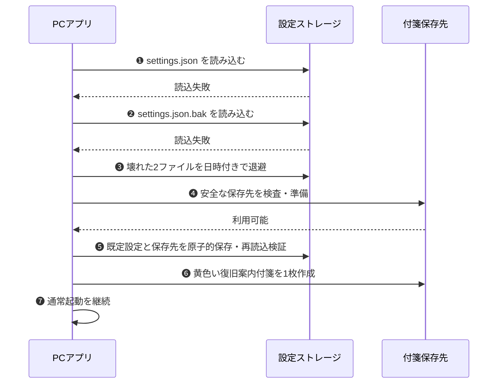

</div>

<p class="mermaid-caption">図 7-1　設定本体・直前世代の二重破損から通常利用へ復旧する流れ</p>

---

## 8 環境変数・シークレット

この節は開発者向けです。PC版（Tauri アプリ）のビルド・リリースに必要な変数・シークレットの一覧です。

### 8.1 ローカルビルド用（`.env.local`）

`src-tauri/build.rs` がコンパイル時に読み取り、バイナリに直接埋め込む。`.env.local` は `.gitignore` 対象のため Git には含まない。

<p class="table-caption">表 8.1-1　ローカルビルド用環境変数（.env.local）</p>

| No | 変数名 | 取得元 | 用途 |
|:---|:---|:---|:---|
| 1 | `GDRIVE_CLIENT_ID` | Google Cloud Console → 認証情報 → OAuth 2.0 クライアント（Tauri用） → クライアント ID | PC 版が Google OAuth を開始するときに使う公開ID。ここでいう client は Google に登録した「俺の付箋 PC アプリ」を指す。`gdrive.rs` 内で `env!()` マクロで参照。 |
| 2 | `GDRIVE_CLIENT_SECRET` | Google Cloud Console → 認証情報 → OAuth 2.0 クライアント（Tauri用） → クライアント シークレット | 開発者が守る値。PC 版が Google OAuth のトークン交換・更新を行うために使う。`.env.local` は Git に含めず、配布物や公開リポジトリへ出さない。 |

### 8.2 CI/CD用（GitHub Secrets）

GitHub Actions のリリースワークフロー（`release.yml` / `do-release.yml`）が参照するシークレット。

<p class="table-caption">表 8.2-1　CI/CD用 GitHub Secrets</p>

| No | シークレット名 | 用途 | 設定するワークフロー |
|:---|:---|:---|:---|
| 1 | `GDRIVE_CLIENT_ID` | Tauri ビルド時の Drive Client ID（ローカルと同値） | `release.yml` |
| 2 | `GDRIVE_CLIENT_SECRET` | Tauri ビルド時の Drive Client Secret（ローカルと同値）。開発者が守る値で、GitHub Secrets にのみ置く | `release.yml` |
| 3 | `TAURI_SIGNING_PRIVATE_KEY` | Tauri アップデーター署名用秘密鍵。正規リリースであることを検証するために使う | `release.yml` |
| 4 | `TAURI_SIGNING_PRIVATE_KEY_PASSWORD` | 上記秘密鍵のパスフレーズ | `release.yml` |
| 5 | `WINGET_TOKEN` | winget-pkgs への PR 作成用 PAT（`public_repo` スコープ必要） | `release.yml` |
| 6 | `WINGET_APP_ID` | do-release.yml が main ブランチへ push するための GitHub App ID | `do-release.yml` |
| 7 | `WINGET_APP_PRIVATE_KEY` | 上記 GitHub App の秘密鍵。リリース処理をアプリ名義で実行するために使う | `do-release.yml` |

<Note type="warning">
<code>WINGET_TOKEN</code> は PAT（Personal Access Token）。GitHub App トークンでは microsoft/winget-pkgs（外部 org）への PR が作れないため PAT が必要。<br>
<code>WINGET_APP_ID</code> / <code>WINGET_APP_PRIVATE_KEY</code> は同一 org 内の main ブランチへの push 用であり、winget とは別のトークン。
</Note>

---

## 9 付箋の整列（カンバン整列）

散らばった付箋を 1 操作で、主ディスプレイ 1 枚に **ユーザータグ × 色** で整列する機能。
カンバン本体は **ユーザータグごとに横レーン（行）** を作り、その中を **色（黄→赤→青）の 3 列**に分ける。
同じタグ・同じ色は右下に階段状に重ねて、左上（タイトル・書き出し）が見えるようにする。

`shortcut`・`recipe`・`qa`・`term`・`link` はアプリの状態を表すシステムタグであり、ユーザーによる分類ではないため、整列では除外する（§11.2）。
整列レーンには、frontmatter の記録順で最初のユーザータグを使う。システムタグしかない付箋はタグなしとして扱う。

**最重要の本質：タグの違いは付箋の「高さ（Y 位置）」だけで表す。**
本番画面にはレーンの線も「◆タグ名」見出しも無い。タグを見分ける手段は付箋の縦位置だけなので、
**別タグの付箋を同じ高さに置くと、ユーザーにはタグの区別がつかない（＝タグが混ざって見える）。**
ゆえに **タグごとに必ず高さ（縦位置）を変えること**が最優先で、別タグの付箋同士は 1px でも重ねない。

### 9.1 全体レイアウト

タグ＝横レーン（上から下へ）／色＝列（黄→赤→青の 3 列固定・空は詰める）／同色＝右下に階段重ね。
タグが増えても下へ伸びるだけで横は破綻しない。

カンバン本体に入るのは **ユーザータグありで、色が 黄・赤・青** の付箋だけ。
**ユーザータグなし・白・黒・5 色外の付箋は、色やシステムタグの有無を問わず「タグなし置き場」**（1 行目の右端のさらに右）に
右下階段でまとめる。


<p class="mermaid-caption">図 9-1　カンバン整列の基本セット（タグ=横レーン × 色=黄赤青の3列、同色は右下に階段重ね）</p>

### 9.2 同色の重ね方（左上が見える）

同じタグ・同じ色の付箋は、後の付箋ほど右下にずらして重ねる。前の付箋の左上が残るので、
上から順にタイトル・書き出しが読める。新しいものが手前（左上）。


<p class="mermaid-caption">図 9-2　上げ目の例（色が被らない行だけ上に詰め、タグの高さ差とタイトル可読性を両立する）</p>

### 9.3 縦の詰め方（高さでタグを分けつつ文字切れを防ぐ）

2 つの要求がトレードオフになる。①タグごとに高さを変えてタグを見分けられること（最優先）と、
②下のレーンほど縦に積もって付箋のタイトルが上に隠れる「文字切れ」を防ぐこと。
**高さの差を最優先で確保したうえで、その範囲内で詰める**。

- **レーン間の隙間（LANE_GAP=48px）**：通常は前レーンの最下端 + 48px に次レーンを置く。少し隙間を空けてタグの境目を見せる。
- **行の上げ目（文字切れ対策）**：2 行目以降で、その行の使う色集合が直前 1 行と 1 つも被らないとき、行ごと上に詰めてよい。
  食い込み量は「一つ上のレーンの黄色最下付箋の高さの半分」まで（上半分＝タイトルは隠さない）。**累積はしない**（比較は常に直前 1 行）。
- **行の単調性（必須）**：各レーンの最上端 top は直前レーンの最上端 top より必ず下。これで別タグが同じ高さに並ぶのを機械的に禁止する。
- **同色の縦ズレ（stepY）に最小値（≈50px）**：同色を重ねても下のタイトルが必ず見える。0 に潰すのは禁止。
- 不変条件：各付箋の上端は画面内。X位置は主ディスプレイの作業領域へ補正し、付箋幅が画面幅以下なら右端も画面内に収める。画面幅を超える巨大付箋は左端へ置いて操作可能にする。枚数が多すぎる場合は下のはみ出しを許容（付箋サイズは変えない）。折りたたみ付箋の横計算にはfrontmatterの展開幅ではなく、整列実行時の実ウィンドウ幅を使う。


<p class="mermaid-caption">図 9-3　タグなし置き場の例（タグなし・白・黒・5色外を1行目右端の右に集約する）</p>

### 9.4 並び順・出力先・起動

<p class="table-caption">表 9.4-1　整列の仕様</p>

| 項目 | 仕様 |
|:---|:---|
| タグ（レーン）の順 | 黄の枚数 → 同数なら赤の枚数 → 同数なら青の枚数 の辞書順で多い方が上（処理フロー：黄＝思いつき→赤＝TODO→青＝済み） |
| 色の列の順 | 黄 → 赤 → 青（カンバン本体は固定 3 列）。空の色列は詰める |
| レーンを決めるタグ | frontmatter の記録順で最初のユーザータグ。システムタグは除外する |
| カンバン本体に入る付箋 | ユーザータグあり かつ 色が 黄・赤・青 のものだけ |
| タグなし置き場 | ユーザータグなし（システムタグだけを含む）・白・黒・5 色外を、1 行目の右端の右に右下階段でまとめる |
| 開いている結晶 | レシピ・QA・用語はユーザータグの有無にかかわらずタグなし置き場へまとめる。閉じている結晶は開かない |
| 同色の縦の順 | 作成日（seq）順・新しいものが手前（左上）。並び順は1か所で変更可（将来は設定化） |
| 出力先 | 全付箋を主ディスプレイ 1 枚に集約 |
| 起動 | システムトレイメニュー「タグで整列」（実装途中は仮ショートカット Ctrl+Shift+L 併存） |
| 取り消し | 整列の直前位置を 1 段スナップショット（AppState・メモリのみ）して「整列前に戻す」。実装済み |
| レーンの題（◆タグ名） | 将来課題（付箋外の表示物のため別途設計） |

> 詳細な確定仕様・実装段階は計画書 `.planning/arrange-by-tag-plan.md`（§3.0 が最新の正・§7 undo）を参照。

---

## 10 グローバルホットキー

「押してみたら使えなかった」ではなく「設定時点で使える・使えないが分かる」体験にする（迷わせない）。あわせて、起動時の登録失敗を黙って握りつぶさない。

### 10.1 アクションと既定キー

<p class="table-caption">表 10.1-1　グローバルホットキーのアクション一覧</p>

| アクション ID | 画面表示名 | 既定 | 変更 | 備考 |
|:---|:---|:---|:---|:---|
| `new_note` | 新規付箋 | Ctrl+N | 可 | トリガー方式を 3 択から選べる（表 10.2-1） |
| `toggle_visibility` | 表示切替 | Ctrl+Shift+H | 可 | 全付箋の表示 / 非表示 |
| `arrange` | 整列 | Ctrl+Shift+L | 可 | タグで整列（§9） |
| `quick_launcher` | クイックランチャー | Ctrl+P | 可 | クイックランチャーの開閉（トグル、§11.5） |
| `bold` | 太字 | Ctrl+B | 可 | 付箋編集中の選択範囲を太字にする |
| `heading` | 見出し | Ctrl+H | 可 | 付箋編集中の選択行を見出しにする |
| `bullet_list` | 箇条書き | Ctrl+L | 可 | 付箋編集中の選択行を箇条書きにする |
| `checkbox` | チェックボックス | Ctrl+Shift+C | 可 | 付箋編集中の選択行をチェック項目にする |

設定画面では、既存のグローバル4項目に続けて、⑤太字、⑥見出し、⑦箇条書き、⑧チェックボックスを並べる。各項目は現在値と既定値だけを常時表示し、キー変更、トリガー方式、追加トリガーなどの編集操作は「詳細」を開いた場合だけ表示する。編集4項目は付箋の編集中だけ動作し、別のアプリ内ショートカットと同じキーは保存できない。

通常ホットキーはシステム全体でキーを占有する（例: 俺の付箋の起動中、他アプリの Ctrl+N は効かなくなる）。これを避けたい場合のために、新規付箋のみ「2回押し」方式を用意する。

### 10.2 新規付箋のトリガー 3 択と設定項目

<p class="table-caption">表 10.2-1　新規付箋トリガーと settings.json</p>

| 方式 | `new_note_trigger` | 特徴 |
|:---|:---|:---|
| カスタムキー（既定） | `shortcut` | 既定 Ctrl+N。競合チェック可。キーを占有する |
| Ctrl 2回押し | `double_ctrl` | キーを占有しない（他アプリと共存）。競合チェックの概念なし |
| Shift 2回押し | `double_shift` | 同上 |

settings.json の関連キー: `shortcut_new_note` / `new_note_trigger` / `shortcut_toggle_visibility` / `shortcut_arrange` / `shortcut_quick_launcher` / `shortcut_bold` / `shortcut_heading` / `shortcut_bullet_list` / `shortcut_checkbox` / `quick_launcher_triple_right_click`（すべて任意。未定義なら従来どおりの既定値で動く＝後方互換）。

Alt / Win の 2回押しは対象外（Alt はメニュー操作、Win はスタートメニューという OS 標準動作が 1 回押しで発動してしまうため）。

### 10.3 実装構成と競合チェックの流れ

処理は Rust の `hotkey_manager.rs`（HotKeyManager）に集約し、UI は Tauri コマンド経由でのみ操作する（UI から Windows API を直接呼ばない）。通常ホットキーは tauri-plugin-global-shortcut（内部で Win32 の RegisterHotKey / UnregisterHotKey）を使う。

<div class="seq-small">

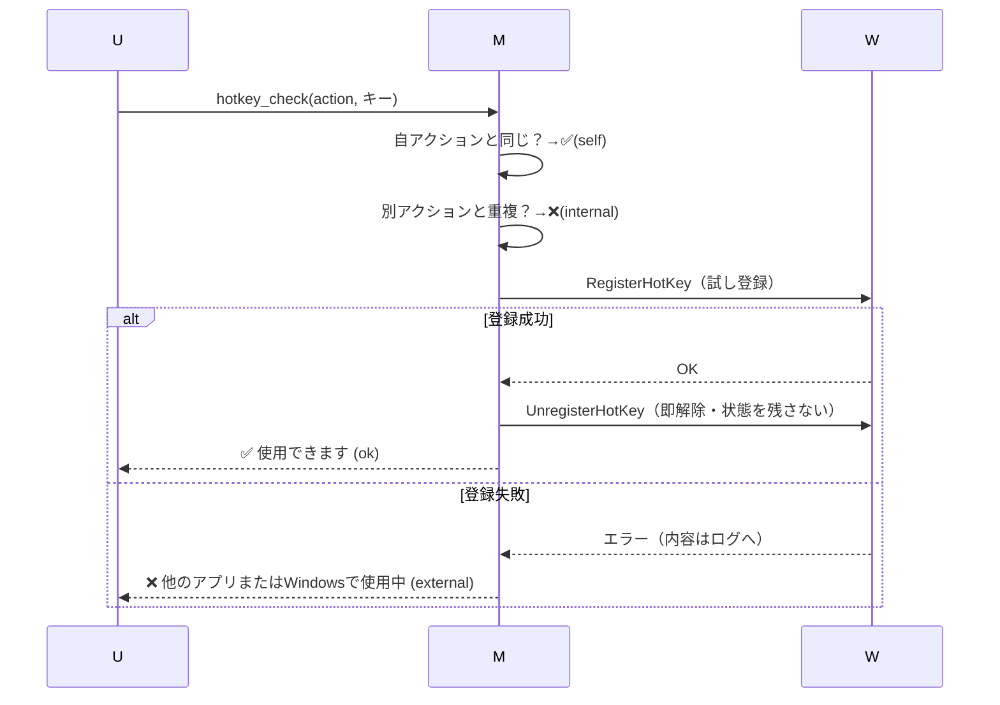

</div>

<p class="mermaid-caption">図 10.3-1　競合チェック（hotkey_check）の流れ。U=設定画面、M=HotKeyManager（Rust）、W=Windows。判定だけ行い登録状態を残さない</p>

正式な変更（hotkey_apply）は「旧キー解除 → 新キー登録 → settings.json 保存」の順。新キー登録や保存に失敗したら旧キー・フック状態を復旧する。旧キーの解除失敗は警告ログのみで続行する（起動時に登録できなかったキーは解除も失敗するため、ここで止めると競合から抜け出せなくなる）。

### 10.4 2回押し検出（DoubleTapDetector）

`double_tap.rs`。判定は OS 非依存の状態機械（単体テスト済み）と、Windows 低レベルキーボードフック（WH_KEYBOARD_LL・専用スレッド）に分離。

<p class="table-caption">表 10.4-1　2回押しの判定仕様</p>

| 項目 | 仕様 |
|:---|:---|
| タップの定義 | 対象キーの押下→解放で、その間に他キーの押下がないこと（Ctrl+C 等の通常利用を誤検知しない） |
| 成立条件 | 1回目のタップ解放から 350ms 以内に 2回目の押下。間に他キーがないこと。2回目の押下時点で発火（速度優先） |
| 誤発動対策 | キーリピート無視・発火後リセット（3連打で 2回発火しない） |
| キーの扱い | 左右キー（例: 左Ctrl / 右Ctrl）は区別しない。キーは奪わず素通し（CallNextHookEx） |
| プライバシー | 対象修飾キー以外は「押された事実」だけを判定に使い、キーコード・内容は記録・保持・ログ出力しない |
| 稼働条件 | 2回押し方式を選んだときだけフックを張る（既定のカスタムキー方式では常駐監視なし） |

#### マウス右ボタン3連打（クイックランチャーの追加トリガー）

`triple_right_click.rs`。設定「右クリック3連打でクイックランチャーを開く」（既定OFF・
`quick_launcher_triple_right_click`）を ON にすると、Ctrl+P と**併存**する追加トリガーとして
右ボタン3連打（直前の押下から 350ms 以内×3回）でランチャーが開く。
2回押し（表 10.4-1）と同じ設計: OS 非依存の状態機械（単体テスト済み）と
WH_MOUSE_LL フック（専用スレッド）を分離し、ON の時だけフックを張る。
他ボタンの押下・間隔超過でリセット、発火後もリセット（4連打で2回開かない）。
クリックは奪わず素通しし、座標・対象ウィンドウは記録・ログ出力しない。

### 10.5 起動時の登録失敗通知

起動時の登録失敗はキー単位で記録し、フロントが起動後に `hotkey_get_register_failures` で照会する（pull 方式＝listen 登録前の emit による取りこぼしが構造的に起きない）。失敗があればダイアログ「グローバルホットキーを登録できませんでした。…設定画面を開きますか？」を表示し、[はい] で設定画面を開く。該当キーの変更に成功したら失敗記録を消す。

### 10.6 既知の制約

| 制約 | 内容 |
|:---|:---|
| 使用中アプリ名は特定不可 | Windows API では競合相手を取得できないため「他のアプリまたはWindows」と表示 |
| 登録中の自キーは再キャプチャ不可 | 登録済みキーは OS が横取りするため、キー入力待ちで押すと本来の動作が発火する |
| 2回押しの共存 | 同じ 2回押しを使うアプリ（例: Listary）があると両方反応する。検出は原理的に不可（設定画面に注記）。また Windows の「Ctrl キーでポインター位置を表示」等の常駐機能が有効だと、キーイベントを先に取られて検出が不安定になることがある（実測 26-07-04） |
| 連続作成の上限 | 検出は毎回成功するが、付箋の供給は Pool（作り置き）方式のため 1 枚出した直後は補充に数秒かかり、連打では出ない回がある。1 枚目の 300ms を最優先する設計とのトレードオフとして許容（ユーザー合意 26-07-04） |

### 10.7 性能計測基盤

性能計測は通常機能を遅くしないことを最優先とする。`PERF_LOG` 環境変数を明示した計測実行時だけ有効とし、通常起動では時刻取得、文字列生成、IPC、ファイル I/O を行わない。

計測実行時も、ユーザー操作の処理中にファイルへ書き込まない。新規付箋とクイックランチャーの計測イベントは上限付きメモリキューへ非ブロッキングで渡し、専用ワーカーが後から `perf.jsonl` へまとめて追記する。キューが満杯の場合は付箋・ランチャーを待たせず計測イベントを破棄し、破棄件数を診断できるようにする。

新規付箋は要求開始からエディタへフォーカスを適用し終えるまでを操作単位で計測する。既存の `fusen_show_at_position` 応答へ計測有効フラグを同乗させるため、通常時に計測可否確認用の追加 IPC は発生しない。計測有効時だけ、エディタ準備完了後に1回の非同期通知を行う。

<p class="table-caption">表 10.7-1　性能計測の記録範囲</p>

| 対象 | 記録するもの | 記録しないもの |
|:---|:---|:---|
| 新規付箋 | 要求単位の識別子、計測点、経過時間、Pool / fallback の別、成功・拒否・失敗 | 本文、ファイルパス、入力キー |
| クイックランチャー | 表示状態確認、中央配置、表示、フォーカス、検索完了までの各経過時間、件数、成功・失敗 | 検索語、付箋名、タグ、ファイルパス |

集計は操作種別ごとの件数、成功・拒否・失敗件数、p50 / p95 / p99 を表示する。計測ログの書き込み遅延や欠落は通常機能の失敗として扱わない。

---

## 11 結晶化とレシピ機能

### 11.1 設計サマリー

この機能で実現したいのは、**一度できたことを残し、次に使い、使うたびに直すことで、いつの間にか自分の仕事が上手くなっている状態**である。

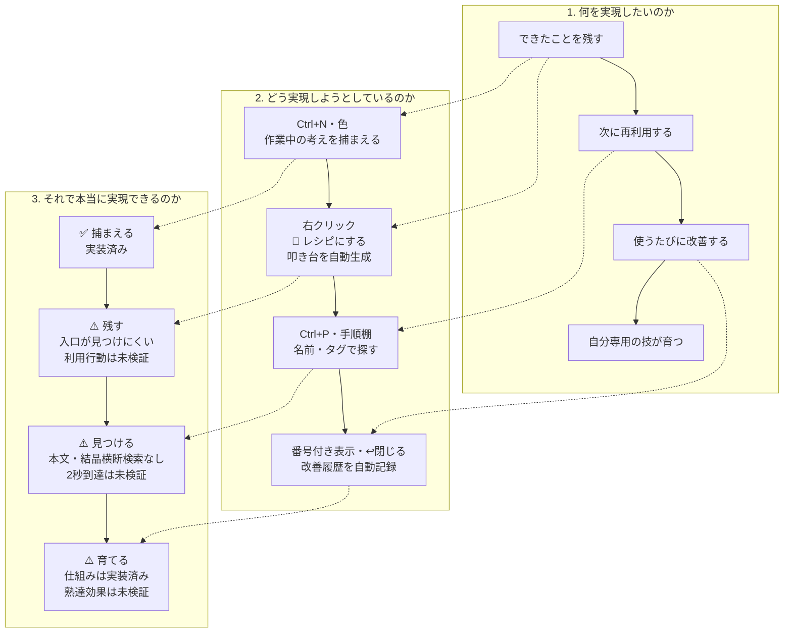

<p class="mermaid-caption">図 11.1-1　結晶機能の目的、実現手段、現時点の成立性評価。✅は実装・到達を確認済み、⚠️は仕組みがあっても利用行動または効果が未検証</p>

**現時点の結論:** 循環に必要な機能部品はある。しかし「ユーザーがレシピ化を思いつくか」「次回2秒で見つけられるか」「再利用と改善が実際に続くか」が未検証のため、本当に熟達へつながる設計かはまだ確定していない。

最初から完成したレシピを書かせない。たとえば「AIエージェントへの指示」を一度残し、次に使った時に「修正前に影響範囲も説明させる」と1手加える。この小さな再利用と改善が続くことを成功条件とする。

#### 3分類と判定原則

永久化の形式は次の 3 つ**だけ**とし、増やさない（4 つ目が欲しくなったら、3 つのどれかの「書き方の問題」と疑う）。

<p class="table-caption">表 11.1-1　結晶の3分類と判定原則</p>

| 結晶 | 知識の型 | 使う瞬間の問い（判定原則） | 予約語タグ | 置き場 | 状態 |
|:---|:---|:---|:---|:---|:---|
| レシピ | How（手続き知） | 「どうやるんだっけ」 | `recipe` | `Recipes/` | v0.1 実装済み（§11.2〜11.5） |
| QA | Why（理由知） | 「なんでだっけ」 | `qa` | `QA/` | v0.2 実装済み（§11.8） |
| 用語 | What（宣言知） | 「これ何だっけ」 | `term` | `Terms/` | v0.3 実装済み（§11.9） |

分類に迷ったら「**次に使う瞬間の自分の問い**」で決める。Why と How が混ざるトラブル対応（症状→原因→対処）は、対処を再実行したいならレシピ、原因を思い出したいなら QA。両方欲しければ 2 枚に割る（レシピの 7 手順制約と同じ思想）。

区別しておくべき概念:

- **棚 ≠ 結晶**。Ctrl+P の棚（クイックランチャー、§11.5）には、結晶と「生きた付箋への近道（お気に入り）」が同居する。棚=2秒で取り出す場所、結晶=永久化された知識。お気に入りは結晶ではない
- **リンク集は結晶ではない**。リンクは結晶の付属物（補足の `## 参考`）として生きる。`link` タグは予約のまま凍結し、リンク集の棚は作らない

レシピ機能は**アドバンス機能**である。使う人だけが使い、既存付箋（`recipe` タグなし）の見た目・動作は 1 ピクセルも変えない（§11.7）。

### 11.2 データ仕様

#### ユーザータグとシステムタグ

frontmatter の `tags` は既存ファイルとの互換性を保つため単一配列のままとする。ただしアプリ内では、読み取り直後に用途の異なる次の2種類へ論理的に分離する。

<p class="table-caption">表 11.2-1　タグの論理区分</p>

| 区分 | 定義 | 例 | 用途 |
|:---|:---|:---|:---|
| ユーザータグ | 予約語タグ以外の、ユーザーが付けるタグ | `仕事`、`調査`、`API知識` | 分類、表示、タグ検索、整列、タグフォルダへしまう |
| システムタグ | アプリが機能状態を記録する予約語タグ | `shortcut`、`recipe`、`qa`、`term`、`link` | お気に入り、結晶種別などの内部判定 |

分離は共通関数で行い、タグ名を trim・小文字化して予約語と比較する。元の表記と記録順は保存時に維持する。

- `user_tags = tags` からシステムタグを除いたもの
- `system_tags = tags` のうち予約語タグに一致するもの
- 付箋上のタグチップ、タグ一覧、タグ編集、タグ検索、整列レーン、「タグフォルダへしまう」の候補は `user_tags` だけを使う
- お気に入り・レシピ・QA・用語などの機能判定は `system_tags` だけを使う。システムタグは分類タグとして表示しない
- `user_tags` が空で `shortcut` だけを持つお気に入り付箋は、整列では「タグなし置き場」へ置く
- `user_tags` と `shortcut` の両方を持つ付箋は、お気に入り状態を維持したまま、先頭のユーザータグで整列・格納する
- 既存Markdownの移行や書き換えは行わない。保存上は同じ `tags` 配列を維持するため後方互換である
- システムタグの追加・削除操作が、ユーザータグの順番を変えてはならない

#### システムタグ（予約語5つ）

<p class="table-caption">表 11.2-2　システムタグ（予約語タグ）</p>

| タグ | 用途 | v0.1 での扱い |
|:---|:---|:---|
| `recipe` | 手順集（レシピ） | 使用 |
| `shortcut` | ランチャー登録付箋（お気に入り） | 使用 |
| `qa` | QA集 | 使用（v0.2・§11.8） |
| `term` | 用語集 | 使用（v0.3・§11.9） |
| `link` | リンク集 | 予約のみ（凍結） |

- この 5 つはタグ追加 UI（手入力経路）から付けられない。共通判定は Rust と `useTagManager` の双方から同じ予約語集合を参照し、手動経路を一括遮断する
- 付与・除去はアプリの操作（レシピ作成、お気に入り登録など）経由の専用 Rust コマンドでのみ行う
- 付箋上のタグチップ、タグ一覧サブメニュー、整列、タグフォルダ候補には表示しない（非表示。disabled ではない）
- ファイル直接編集で付けた場合の動作は保証しない（防がない）

#### レシピ付箋の frontmatter

結晶の実ファイル名は種類ごとに独立採番し、検索結果で判別できる接頭辞を付ける。レシピは `Reci0001_YYYY-MM-DD_名前.md`、QAは `QA0001_YYYY-MM-DD_名前.md`、用語は `Term0001_YYYY-MM-DD_名前.md` とする。通常付箋は従来の `0001_YYYY-MM-DD_名前.md` を維持する。旧形式の既存結晶は自動改名せず、検索結果では親フォルダから `[Reci]`・`[QA]`・`[Term]` を補って表示する。

```yaml
---
type: sticky
seq: 123
created: 2026-07-05T12:00:00+09:00
updated: 2026-07-05T12:00:00+09:00
title: AI機能追加の進め方
backgroundColor: "#cfd8dc"
tags: [OreNoFusen, iphone連携, recipe]
launches: 0
recipeImprovements: 0
recipeLastUsed:
window: { x: 100, y: 100, width: 400, height: 300 }
---
```

- `launches`: ランチャー経由で開いた回数（自動）。`shortcut` 登録付箋にも同じフィールドで記録する
- `recipeImprovements`: 「閉じる（返す）」時に本文が変わっていた回数（自動）
- `recipeLastUsed`: 最後に閉じた（返した）日時（ISO 8601、初期値は空）
- 既定色は黒 `#cfd8dc`（アプリ内呼称「黒」。実際の色味はグレー）。**色は提案であって識別子ではない。レシピ判定は必ず `recipe` タグで行い、色を変えても全機能が動く**
- 規約: frontmatter のフィールドは**平坦な単一行のみ**（パーサが正規表現ベースのため。複雑な値を将来も入れない）

#### 本文フォーマット

`---` 区切りは使わない（付箋としてコンパクトにするため）。

```md
# こんなとき

AI開発で新しい機能を作る時

# どうする

1. 要件を出す
2. ChatGPTやClaudeと相談して方針を決める
3. 相談内容を構造化する
4. GSDで実装を依頼する
5. テストする

# きっかけ
前回、設定変更後に再起動を忘れて反映されなかった

# 補足

## 参考

- https://example.com/...

# 改善履歴

- 26-07-05 初版
```

制約（叩き台生成時に守る。ユーザーの手編集は制限しない）:

- こんなとき: 青付箋の1行目（開いた瞬間の照合・検索用）
- どうする: 7 手順以内・番号付きリスト固定。**1 番 = 最初の一手**（この規約を崩さない）
- やらないこと・観点・リンク・画像は 補足 の `##` 小見出しへ
- 改善履歴の日付: `YY-MM-DD` 形式
- 作成画面ではひな形の全項目を表示する。作成時は内容が空の項目を見出しごと除外し、見出し・本文・次の見出しの間へ空行を挟まない

#### 置き場（Recipes/）

レシピの保存先は保存先フォルダ直下の `Recipes/` サブフォルダ（`Trash/`・`Archive/` と同じパターン）。通常付箋のスキャン対象外のため、**起動時に勝手に開かれない**。レシピは「必要な時にランチャーから出す」存在であり、起動時に画面へ並べない。
相対パス画像（`assets/…`）は付箋のフォルダ基準で解決し、失敗した場合のみメイン保存先基準で
再解決する（結晶がサブフォルダに居ても、棚から外してメインへ戻しても表示できる）。

#### 改善履歴の自動追記

「閉じる（返す）」時に本文が変わっていた場合のみ、改善履歴セクション末尾に 1 行追記する（例: `- 26-07-12 こんなとき・どうする`）。

- セクション名は こんなとき / どうする / きっかけ / 補足 の 4 種のみ。複数変わっていたら文書順に「・」区切りで全部列挙
- 改善履歴セクション自体の変化は「変わった」と数えない
- 変更判定の基準 = 窓を開いた時点の本文。`StickyNote` が読み込み時に `originalBody` として保持し、差分計算・履歴行生成は `recipeFormat.ts` の純関数で行う（Rust は保存とメタ更新のみ）

### 11.3 レシピを作る

起点は**青付箋**（結果記述）の右クリック →「💎 結晶にする ▸ 🍳 レシピにする」。
サブメニュー「💎 結晶にする」は全付箋に出るが、🍳 は青付箋のみ・❓ QAにする（§11.8）と 📖 用語にする（§11.9）は全色で表示する。
選ぶと専用ウィンドウ `/recipe-create` が開く（ランチャーと同じ思想の独立窓。元付箋の窓とは物理的に別で、作成中に元付箋を一切触らない）。元付箋が常に最前面でも作成画面が背面へ隠れないよう、作成画面は表示中の一時的な最前面ウィンドウとする。最前面化に失敗した場合も画面表示とレシピ作成は継続し、補助的な表示制御の失敗で主要操作を停止しない。

レシピ作成画面はアプリ起動後に非表示で1枚だけ作り置きする。「レシピにする」選択時は新しいWebViewを生成せず、対象パスを作り置き画面へ渡し、元付箋と材料候補から叩き台を作り終えてから表示する。同じ元付箋から連続して作成する場合も要求ごとに本文と材料候補を再読込し、前回の空状態や叩き台を流用しない。キャンセル時は破棄せず非表示へ戻し、次回も同じWebViewを再利用する。

レシピ・QA・用語の3種類は、保存済みひな形を共通処理で読み込む。叩き台の未編集な既定節名は作成時点の設定言語へ日本語・英語間で双方向変換し、利用者が独自変更した節名は保持する。画面の案内、読込中、エラー、キャンセル、作成ボタンおよびウィンドウタイトルも作成時点の設定言語に従う。

<div class="seq-small">

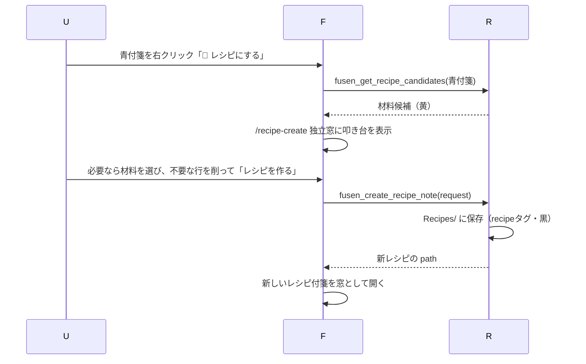

</div>

<p class="mermaid-caption">図 11.3-1　レシピ作成の流れ。U=ユーザー、F=フロントエンド、R=Rust バックエンド。叩き台の生成・編集はフロント、ファイル生成は Rust が担う</p>

材料候補の抽出:

- 対象: 青付箋と**共通のタグを 1 つ以上持つ**黄（0〜1 件選択・きっかけの材料）。作成画面にも、黄色を選ぶと「きっかけ」に入ることを明記する。桃色は材料候補に表示しない
- 検索範囲: メインの保存先フォルダ ＋ `tags/` フォルダ以下（再帰）。`Trash/`・`Archive/`・`Recipes/`・`QA/`・`Terms/` は対象外（整理済みの付箋も材料になる。結晶は材料にならない）
- 比較から除外するタグは予約語 5 つのみ
- 候補 0 件でも作成できる。その際は「同じタグの材料はありません」と短く表示する

叩き台の生成ルール（ひな形は見せるが、作成後の付箋から空項目を除く。「不要な行だけ削る」の形で渡す）:

- こんなとき ← 青付箋本文の1行目。検索時に「いつ使うか」を思い出す鍵にする
- どうする ← 青付箋本文の2行目以降を番号付きリスト化（7 手順以内）
- きっかけ ← 選択した黄の本文（先頭2行）。具体的に「あの時こうした」を思い出す材料にする
- 材料内の見出し行（`#`〜`######`）は除去して普通の文にする（見出し構造はテンプレートのみが作る）
- 材料内の URL 行・画像 Markdown 行は手順に入れず、補足の `## 参考` / `## 画像` へ
- 改善履歴 ← `- YY-MM-DD 初版`

作成画面に独立した名前入力は置かない。作成ボタン押下時の「こんなとき」先頭行を名前の原本とし、
先頭20文字（空なら元付箋本文1行目）を frontmatter `title` とファイル名へ共通利用する。
作成画面の外側はスクロールさせず、材料候補だけを上部の最大36%内でスクロール可能とする。叩き台は残りの高さを使い、下部の操作ボタンを常時表示する。

作成されるレシピ付箋: `Recipes/` 直下に保存。tags = 青付箋のタグ（予約語除く）＋ `recipe`、背景色 `#cfd8dc`、カウンタは 0。作成後すぐ窓として開き、ユーザーがその場で整える。

### 11.4 レシピ付箋の表示と「閉じる（返す）」

**表示（recipeMode）**: `recipe` タグ付き付箋の表示モードのみに適用する。判定はタグ（色では判定しない）。CodeMirror 編集モードは対象外。

- `#` 見出し（5 つ全部）: `#d9480f`（既存の太字・1.1em は維持）
- `##` 小見出し: `#d9480f`・1.0em
- 番号付きリスト `N.` の**番号部分のみ**: `#1971c2`（手順として目で追いやすくする）
- 本文・箇条書き・リンク・太字・チェックボックスは既存スタイルのまま一切変えない
- カード・枠線・背景色などの装飾は追加しない

**↩ レシピを閉じる**（レシピ付箋にだけ出るボタン。内部の概念・コマンド名は「返す」= `fusen_return_recipe`）:

1. 現在の内容を保存
2. 本文が変わっていれば `recipeImprovements` +1 ＋ 改善履歴に 1 行自動追記（§11.2）
3. `recipeLastUsed` を現在日時に更新
4. 保存音を鳴らして窓を閉じる（3結晶共通・失敗時は鳴らさない）

変更がない返却では本文ファイルの `updated` を汚さない（メタ更新のみ）。×ボタンでの閉じは従来通りで返却ではない。

「返す」は削除でも整理でもない。**レシピの世界（`Recipes/`）へ返す**＝画面から消えて眠り、次に必要な時はランチャーから 2 秒で出す。使うたびに磨かれ、改善履歴と回数が「育った証」として残る。

### 11.5 クイックランチャー

「必要な時に 2 秒で見つかる」を担う棚。お手本は CLaunch（コンパクトなパネル型ランチャー）。

**起動**: グローバルホットキー既定 `Ctrl+P`（§10 の基盤にアクション `quick_launcher` として登録。設定画面で変更可）。もう一度押すと閉じる（トグル）。画面中央に即表示・常に手前・表示したら検索ボックスに即フォーカス。

4つの種類タブの直下に、選択中タブの項目が持つユーザータグを区分として表示する。先頭は「すべて」、ユーザータグを持たない項目がある場合は「未分類」を表示する。`recipe`・`qa`・`term`・`shortcut` 等のシステムタグは区分へ出さない。タグ区分と文字検索は併用でき、タブごとに最後に選択した区分を `launcher_order.json` へ保存する。複数のユーザータグを持つ項目は各区分のいずれからも表示できる。

<p class="table-caption">表 11.5-1　タブ構成（4つ固定）</p>

| タブ | 対象 | スキャン範囲 |
|:---|:---|:---|
| お気に入り | `shortcut` タグ付き付箋 | メイン ＋ `tags/` 以下（再帰）。`Trash/`・`Archive/` 対象外 |
| QA | `QA/` 内の `qa` タグ付き付箋 | `QA/` フォルダ（行アイコン ❓・§11.8） |
| 用語集 | `Terms/` 内の `term` タグ付き付箋 | `Terms/` フォルダ（行アイコン 📖・§11.9） |
| 手順 | `Recipes/` 内の `recipe` タグ付き付箋 | `Recipes/` フォルダ |

- 開いた時は前回使っていたタブを表示（初回は 手順）。クリックまたは ← → キーで切替
- 検索は表示中のタブ内だけを名前とタグの部分一致で絞り込む（本文は対象外）
- 0 件時はタブごとの案内文を出す（手順:「青付箋を右クリック → 🍳 レシピにする で最初のレシピを作れます」等）

**一覧**: 行 = アイコン（レシピ=🍳 / 登録付箋=📌）＋ 名前（頭 20 文字。超過は…省略）＋ 右端に小さくリピート回数（`launches`）。

- 並び順は**完全手動**（CLaunch 式）。自動では並び替えず、リピート回数は表示するだけで並びには使わない
- 新しく棚に入った付箋は末尾に追加。上下移動で並び替え、再起動後も維持
- 手動順の永続化は Rust 側の `launcher_order.json`（settings.json と同じフォルダ）
- 行の右クリックメニュー: 「上へ移動」「下へ移動」「名前を変更」「棚から外す／ゴミ箱へ移動」
  - 名前を変更: `fusen_rename_quick_note` が frontmatter の `title` だけ更新する
  - ゴミ箱へ移動（レシピ）: `recipe` タグを保ったまま `Recipes/Trash/` へ退避し、開いているレシピ窓を閉じる。通常付箋エリアへは移動しない（ファイル名衝突時は連番で回避）
  - 棚から外す（お気に入り）: `shortcut` タグを外すだけ（ファイルは動かさない）
  - ゴミ箱へ移動（QA / 用語）: それぞれ `QA/Trash/` / `Terms/Trash/` へ退避し、開いている窓を閉じる。予約語タグは復元可能性のため保持する
  - 結晶行の×と結晶画面のゴミ箱は同じ操作であり、確認画面を挟まず、画面上の最新内容を保存してから本文と添付画像を各結晶側の `Trash/` へ退避する。画面とランチャーの一覧から消え、通常付箋側の `Trash/` には移動しない
  - Rust は `emit_to` で対象ウィンドウだけへパス付き要求を送り、受信側も自分のパスとの一致と結晶タグを検証する。同じパスへの重複要求は最初の1件だけを実行し、異なる複数パスへの要求が2秒以内に集中した場合は一斉破壊防止のため2件目以降を拒否する
  - ゴミ箱移動成功時は `%APPDATA%/OreNoFusen/trash_operations.jsonl` に日時・元パス・移動先・操作元だけを1行追記する。本文は記録せず、事故時間帯の移動一覧作成と復旧判断に使う

**操作**: ↑↓ 選択移動 / Enter・クリックで開いて閉じる / Esc で閉じる / フォーカス喪失で閉じる（ロック中を除く）/ 📍ロック ON の間は常に最前面のまま自動で閉じない（ピンの絵・音は付箋のピンと共通）。`blur` 検出後は 120ms 待って Tauri ウィンドウの実フォーカスを再確認し、タブクリック等による一時的なフォーカス揺れでは閉じない。

右クリック3連打フックからの起動イベントは、WebView の `show` / `hide` / `set_focus` を必ず Tauri のメインUIスレッドへ切り替えて実行する。トグル処理中に重複イベントを受信した場合は無視し、ウィンドウ操作の競合による未描画・応答停止を防ぐ。

**開いた時**: 対象付箋の窓が既に開いていれば新規に開かずフォーカスする。クイックランチャーは検索・閲覧の入口であるため、レシピ・QA・用語の結晶は初回・再表示とも表示モードで開き、本文エディタへフォーカスしない。選択後は1回だけ読んだファイル内容から背景色と起動回数更新内容を作り、付箋を開くイベントを起動回数の書込みより先に送る。背景色はfrontmatterの該当行だけを軽量解析し、通常付箋の完全メタデータ解析を行わない。`launches` を +1（ランチャー経由の時のみ。recipe / shortcut 共通）し、加算はファイル全文を書き戻してfrontmatterを保全する（本文だけ書き戻してfrontmatterを失うデータ破壊が過去にあったため、実ファイルI/Oテストで恒久ガード済み）。

**結晶の作り置き**: アプリ起動後にレシピ・QA・用語の本文をバックグラウンドでメモリキャッシュし、固定数の非表示付箋WebViewを初回表示用として準備する。初回選択時はキャッシュ済み内容を準備済みWebViewへ反映してから表示し、灰色の枠や空内容を先に見せない。使用した汎用枠はバックグラウンドで補充する。「返す」ときは最新内容を保存してウィンドウを非表示にするが、WebViewは破棄しない。2回目以降は同じ非表示ウィンドウを再表示してWebView・React・エディタの再生成を避ける。返した時点の本文を次回編集の比較基準へ更新し、改善履歴を重複追加しない。ゴミ箱へ移動した場合だけ非表示ウィンドウも破棄する。非表示ウィンドウはアプリ終了時に他の付箋とともに終了する。

**即時更新**: 棚の変化（レシピ作成・お気に入り登録/解除・棚から外す・並び替え・名前変更）は Rust がイベント `fusen:launcher_shelf_changed` を emit し、ランチャーはロック中でも一覧を即時更新する。

**お気に入り検索のキャッシュ**: メイン保存先と `tags/` 以下から作った未絞り込みのお気に入り一覧は Rust のメモリへ保持し、検索文字の変更時はディスクを再走査せずキャッシュ内だけを絞り込む。ランチャー窓の作り置き後にバックグラウンドで準備し、登録・解除・名前変更・削除・並び替えの既存棚変更イベントで破棄する。特に右クリックによる `shortcut` タグの付与・除去は、タグを書き込む Rust コマンド内でキャッシュ破棄と棚変更通知を一体で行い、フロントから同じ通知を重複送信しない。保存先が異なるキャッシュは共有しない。複数検索が重なった場合、フロントは最新世代の応答だけを表示し、古い応答による結果の巻き戻りを防ぐ。

**お気に入り登録**: 付箋の右クリック「📌 お気に入りに登録」で `shortcut` タグを付け、「📌 お気に入りを解除」で外す（ランチャーのタブ名「お気に入り」と用語を揃える）。

### 11.6 色の意味表示とプレースホルダー

経験を「意味つきで」ためるための入口。すべて**おすすめ**であり強制しない（色は提案、識別はタグ）。

<p class="table-caption">表 11.6-1　色の意味と空付箋プレースホルダー</p>

| 色 | 色変更メニューの表示 | 空付箋のプレースホルダー |
|:---|:---|:---|
| 黄 | 黄 - アイデア保存 | アイデア、違和感、こんなときをメモ |
| 桃 | 桃 - 課題羅列 | 課題、TODO、試したことをメモ |
| 青 | 青 - 結果記述 | 結果、決定事項、次回の作戦をメモ |
| 白 | 白 - 自由 | なし（現状のまま） |
| 黒 | 黒 - レシピ・手順 | なし（現状のまま） |

黄（アイデア）→ 桃（課題・試行）→ 青（結果）と経験が育ち、青からレシピが生まれる（§11.3）。プレースホルダーは本文が空の時だけ薄く表示する。

### 11.7 守るべき不変条件

| 不変条件 | 内容 |
|:---|:---|
| 既存付箋を変えない | `recipe` タグなし付箋の見た目・動作をいかなる形でも変えない。recipeMode=false のレンダリングが従来と完全一致することをスナップショットテストで担保（回帰防止の最重要テスト） |
| 判定はタグ | レシピ判定は必ず `recipe` タグ。色で判定しない |
| パレットは 5 色 | 黄・桃・青・白・黒 のまま増やさない |
| 本文への自動書き込み禁止 | 例外は改善履歴の 1 行追記（§11.2）のみ。`---` もテンプレートに入れない |
| AI は結晶を作らない | AI 生成・AI 整形はしない。叩き台はユーザー自身の付箋の文の再配置のみ |
| 結晶名は作成時に固定 | QA=問い、用語=用語、手順=こんなときの先頭行から20文字を title とファイル名へ使う。作成後の本文編集では自動リネームしない |
| frontmatter は平坦 | フィールドは平坦な単一行のみ（正規表現パーサの制約を将来も守る） |
| PC 専用 | `viewer/`・`worker/`（iPhone PWA）には手を入れない |

### 11.8 QA機能（v0.2）

**判断の理由と、その判断が必要になった状況を残す。「なんでだっけ」に答える結晶。**

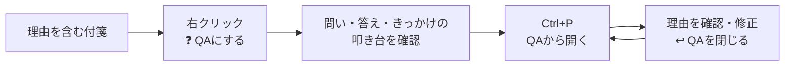

<p class="mermaid-caption">図 11.8-1　QAの利用循環。付箋1枚を理由知へ変え、必要な時に取り出して育てる</p>

<p class="table-caption">表 11.8-1　QAのUIと目的</p>

| UI | 目的 |
|:---|:---|
| ❓ QAにする | 付箋を「問いと答え」へ簡単に変える |
| 自動保存名＋叩き台 | 最初から書かず、不要な行の削除だけで作れるようにする |
| Ctrl+P「QA」 | 通常付箋へ混ぜず、理由を探す |
| ↩ QAを閉じる | 修正を保存し、改善履歴を残して棚へ返す |

<details>
<summary>QAの実装詳細</summary>

#### 本文フォーマット（5節）

QAも手順と同じ5節構成だが、**きっかけ**には問いが生まれた状況を残す。
判断の理由（Why）は時間が経つと状況ごと忘れるため、思い出しの起点を残す。

```md
# 問い

なぜレシピの色は黒にしたのか

# 答え

色は提案であって識別子ではないから（識別は recipe タグ）

# きっかけ

- 26-07-08 付箋『色決め』から作成

# 根拠・補足

## 参考

- https://example.com/...

# 改善履歴

- 26-07-08 初版
```

制約: 問い=2行以内（棚から引き出す鍵）、答え=結論を先頭の1行に、`---` 不使用、日付 `YY-MM-DD`。

#### QAを作る

どの色の付箋からでも 右クリック →「💎 結晶にする ▸ ❓ QAにする」→ 専用ウィンドウ `/qa-create`（レシピと同じ独立窓方式・元付箋を触らない）。**材料合成はない**（付箋1枚から叩き台。合成は使われてから検討）。独立した保存名入力は置かず、叩き台へフォーカスする。

叩き台の生成ルール:

- 問い ← 元付箋本文の1行目（空行・URLだけの行・画像だけの行は飛ばす。無ければ元付箋タイトル）
- 答え ← 問いに使った1行を除く元付箋本文（見出し行だけ平文化・字下げは維持。URL 行・画像行は 根拠・補足 の `## 参考` / `## 画像` へ退避）
- きっかけ ← 空欄。作成画面では項目を表示するが、ユーザーが何も残さなければ作成後は見出しごと除外する
- 改善履歴 ← `- YY-MM-DD 初版`
- 作成画面では5節を表示するが、作成時は内容が空の節を見出しごと除外し、無駄な空行を保存しない
- 作成ボタン押下時の「問い」先頭行から先頭20文字を取り、frontmatter `title` とファイル名へ共通利用する
- 作成画面は用途名の見出しと「叩き台」見出しを重ねて表示せず、説明1行・本文・下部操作だけの全高レイアウトとする。外側はスクロールさせず、長い内容は本文欄の中だけをスクロールする

作成されるQA付箋: `QA/` 直下、tags = 元付箋のタグ（予約語除く）＋ `qa`、黒。作成後すぐ窓として開く。

#### 表示・閉じる・棚

- 表示: `qa` タグでレシピと同じ結晶表示（見出しオレンジ・番号青）。判定はタグ（`recipe` と `qa` が両方付いた異常系は recipe 優先）
- **↩ QAを閉じる**: レシピの「↩ レシピを閉じる」と同位置・同機構。差分判定は QA の5節で行い、変わった節を改善履歴へ文書順に自動追記
- ランチャー QA タブ: `QA/` 内の `qa` タグ付き付箋（行アイコン ❓）。削除時は最新内容を保存し、`qa` タグを保ったまま `QA/Trash/` へ移動する
- 専用ウィンドウ `qa-create` は「閉じてもアプリを終了しない窓」の例外リスト（§11 の quick_launcher / recipe-create と同じ）に登録済み

</details>

### 11.9 用語機能（v0.3）— 3結晶の完成

**言葉の意味・使い方・関連語を残す。「これ何だっけ」に答える結晶。**

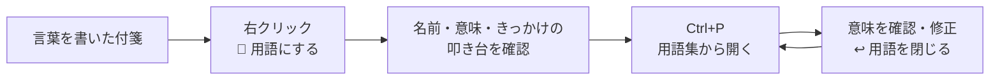

<p class="mermaid-caption">図 11.9-1　用語の利用循環。付箋の1行目を用語名として取り込み、使いながら意味を育てる</p>

<p class="table-caption">表 11.9-1　用語のUIと目的</p>

| UI | 目的 |
|:---|:---|
| 📖 用語にする | 付箋を自分専用の用語集へ簡単に移す |
| 1行目を名前にする | 同じ内容を入力し直さない |
| Ctrl+P「用語集」 | 意味を調べたい時に取り出す |
| ↩ 用語を閉じる | 修正を保存し、改善履歴を残して棚へ返す |

<details>
<summary>用語の実装詳細</summary>

#### 本文フォーマット（8節）

用語は**対比・セットで覚える**知識のため、訳（略語の正式スペル・原語）と
関連ワード（対比で覚える語）を持つ。開いた瞬間に用語そのものが最上部に見える。

```md
# 用語

トルク

# 一言でいうと

回す力のこと

# 原語・訳

torque

# 意味

回転軸まわりの力のモーメント。単位は Nm

# 関連ワード

- 出力（kW）⇔ トルク（回す力そのもの）

# きっかけ

- 26-07-09 付箋『モーター選定』から作成

# 補足

# 改善履歴

- 26-07-09 初版
```

#### 用語を作る

どの色の付箋からでも 右クリック →「💎 結晶にする ▸ 📖 用語にする」→ 専用ウィンドウ `/term-create`（材料合成なし・close 例外登録済み）。

- **用語名は本文の1行目を自動取得**（無ければ元付箋タイトル）。
  「1行目に用語・続きに説明」という付箋の書き方にそのまま対応する
- 叩き台: 用語 ← 元付箋の1行目 / 一言でいうと ← 2行目 / 意味 ← 3行目以降 /
  原語・訳・関連ワード・きっかけ ← 空欄（ユーザーが磨く）/
  補足 ← URL・画像の退避 / 改善履歴 ← 初版行
- 作成画面ではひな形の全項目を表示するが、作成時は空項目を見出しごと除外し、無駄な空行を保存しない
- 独立した名前入力は置かない。作成ボタン押下時の「用語」先頭行から先頭20文字を取り、frontmatter `title`、クイックランチャー表示名、ファイル名へ共通利用する。必要な場合のみユーザーが変更できる
- 作成画面はQAと同じ全高レイアウトとし、用途名の見出しを省略して本文欄へ高さを配分する。操作ボタンは常に下部へ表示する
- 保存先 `Terms/` 直下、tags = 元付箋のタグ（予約語除く）＋ `term`、黒 `#cfd8dc`

#### 表示・閉じる・棚

- `term` タグで結晶表示（タグ判定の優先順は recipe > qa > term）
- **↩ 用語を閉じる**: レシピ・QA と同機構（8節で差分判定→改善履歴へ自動追記）
- ランチャー用語集タブ = `Terms/` 内の `term` タグ付き付箋（行アイコン 📖）。
  削除時は最新内容を保存し、`term` タグを保ったまま `Terms/Trash/` へ移動する

</details>

3結晶は同じ操作で作成・再利用・改善できる。ただし、2秒で見つかることと、利用が熟達へつながることは未検証（§11.1）。

### 11.10 結晶のひな形の編集（v0.4）

**自分の仕事に合わせて、レシピ・QA・用語の書き方を育てる設定。**

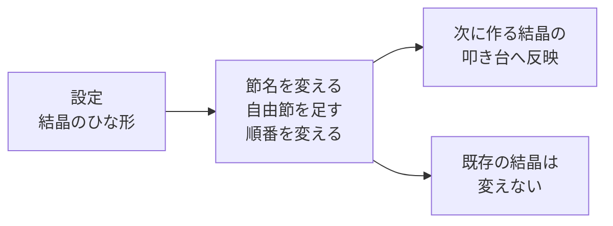

<p class="mermaid-caption">図 11.10-1　ひな形編集の影響範囲。変更は次に作る結晶へ適用し、既存の知識は書き換えない</p>

<p class="table-caption">表 11.10-1　ひな形UIの目的</p>

| UI | 目的 |
|:---|:---|
| 節名の変更 | ユーザーの言葉に合わせる |
| 自由節の追加・削除 | 仕事固有の観点を残す |
| 手順の「事前条件」候補 | 必要な場合だけ1クリックで空の節を追加する |
| 並べ替え | 実行時に見たい順へ整える |
| 🔒 固定項目 | 名称は変更できるが、挙動を担う項目自体は削除できないことを示す |
| 数える / Track | 返却時に節の変更を検出し、改善履歴へ節名を記録する。オフでも内容は保存する |
| 既定値へのフォールバック | 壊れた設定で結晶機能を止めない |

<details>
<summary>ひな形編集の実装詳細</summary>

- 節 = **表示ラベル（編集可）＋スロット（挙動・固定）＋数える（改善履歴の変更判定に含むか）**。
  ラベルを改名しても叩き台の埋まり方・判定は壊れない（スロットが挙動を持つ）
- 自由節（叩き台では空欄）の追加・削除・並べ替えができる。鍵は先頭・改善履歴は末尾に固定
- 追加候補は手順の「事前条件」だけとし、同名の節は重複追加しない。QA・用語には追加候補を置かず、必要な項目は自由節で追加する
- 保存先は設定フォルダ直下 `crystal_formats.json`（無ければ既定値=本章の各フォーマット。
  壊れていてもタイプ単位で既定値に落ち、クラッシュしない）
- 効くのは**新規作成の叩き台と閉じる時の判定だけ**。既存の結晶の本文は変わらない。
  変更は次に開く窓から反映（保存時に `fusen:crystal_formats_updated` を emit・ライブ反映は将来）

</details>

---

## 12 改版履歴

<div class="history-table">
<p class="table-caption">表 12-1　改版履歴</p>

| No | バージョン | 日付 | 変更内容 |
|:---|:---|:---|:---|
| 1 | 1.0 | 26-04-19 | 新規作成。旧 001_ARCHITECTURE_DESIGN.html のPC側内容（構造図・クラス図・シーケンス図・ER図）を統合・整理 |
| 2 | 1.1 | 26-04-24 | ウィンドウ構成図を `graph LR`（横向き）に変更。スクロールなしで全体が見えるよう改善。 |
| 3 | 1.2 | 26-04-26 | セクション7「環境変数・シークレット」を新規追加。ローカルビルド用とCI/CD用を分けて記載。 |
| 4 | 1.3 | 26-04-27 | セクション6「機能一覧」を新規追加（システムトレイ・ツールバー・右クリックメニュー・設定画面）。各機能に設計意図・工夫を追記。旧6→7、旧7→8、旧8→9に繰り下げ。 |
| 5 | 1.4 | 26-05-06 | 3.1 付箋データ、6.1〜6.5 機能一覧、8.1〜8.2 環境変数・シークレットを修正。型の `?` は任意項目であることを注記し、6.1-1 以降の表へ No を追加。環境変数・シークレットの対象を開発者向けとして明記し、Google OAuth の client_id / client_secret とリリース用秘密鍵の用途を説明。 |
| 6 | 1.5 | 26-06-01 | 6.5〜6.6 にフィードバック返信付箋を追加。匿名 `feedback_thread_id`、送信後ありがとう付箋、1 日 1 回の返信確認、返信 API に送る情報・送らない情報を定義。 |
| 7 | 1.6 | 26-06-01 | 6.5〜6.6 を返信付箋方式から設定画面内の 1 対 1 掲示板方式へ変更。匿名 `conversation_id`、掲示板API、送る情報・送らない情報を定義。 |
| 8 | 1.7 | 26-06-04 | 開発者とのやりとりの新着表示を右クリックメニューに追加する方針を定義。PCアプリは JST 4:00 頃に1日1回だけ確認し、右クリック時は通信せずローカル未読状態を使う仕様を追加。開発者専用の手動未読チェックも追加。 |
| 9 | 1.8 | 26-06-05 | エラー対応の全体方針を追加。予見可能なエラーはアプリ側で自動回避し、ユーザー対応が必要な場合は具体的な復旧手順を表示する方針を明記。 |
| 10 | 1.9 | 26-06-21 | 付箋の整列（カンバン整列）を新章 §9 として追加。タグ=横レーン × 色=列 × 同色=右下に階段重ね（左上が見える）、重なり量は動的計算で全付箋の上端を画面内に収める方針を図示（図 9-1〜9-3・表 9.4-1）。 |
| 11 | 2.0 | 26-06-25 | §9 を実装（新ルール 3.0）に合わせて全面更新。①本質「タグの違いは付箋の高さ（Y）だけ＝別タグは1pxも重ねない」を本文明記。②カンバン本体を黄→赤→青の3列固定に変更（白黒は列にしない）。③タグなし・白・黒・5色外は「タグなし置き場」（1行目の右端の右）に集約。④レーン順を「黄→赤→青の枚数の辞書順で多い方が上」（処理フロー基準）に変更。⑤§9.3 を上げ目（直前行と色が被らない行のみ・累積なし・行の単調性必須）と stepY 最小値の方針に書き換え。⑥取り消し（undo・1段スナップショット）を実装済みに更新。図 9-1・9-3 と表 9.4-1 を更新。 |
| 12 | 2.1 | 26-06-25 | 6.2〜6.3 に付箋右下ホバー操作を追記。タグが0個または1個の付箋ではごみ箱横に「📦 タグフォルダへ移動」ボタンを表示し、複数タグ時は右クリックメニューで移動先を選ぶ仕様を明記。 |
| 13 | 2.2 | 26-06-26 | §6.3 付箋右クリックメニュー表に 🌫 透明度（不透明 / うすめ / かなり透ける）と 📏 文字サイズ（小 12 / 中 16 / 大 20 / 特大 28 / グローバルに戻す）を追記。No 番号を 6 以降1つずつ繰り下げ。 |
| 14 | 2.3 | 26-06-26 | §1.3「メインウィンドウの画面一覧と画面遷移」を新規追加。メインウィンドウ内の状態に画面 ID（dashboard / setup / settings / help / search / update / loading / note）と画面名を付けて状態・画面一覧化（表 1.3-1）し、画面遷移図（図 1.3-1）を追加。`dashboard` は付箋ではなく、メインウィンドウ非表示のトレイ常駐状態である旨を明記。付箋の「？」と `Ctrl+F` は付箋ウィンドウ起点の外部トリガーとして図示。旧 §1.3「ウィンドウ生成の仕組み」を §1.4 へ繰り下げ。 |
| 15 | 2.4 | 26-06-28 | タグ操作の文言を「タグフォルダへ移動」に統一。付箋右下のタグバッジをクリックするとタグフォルダを開き、対象タグフォルダが未作成の場合は親の `tags/` フォルダ、`tags/` 自体が未作成の場合は保存先フォルダを開く仕様を追加。 |
| 16 | 2.5 | 26-07-04 | タグフォルダ・Archive への移動時、位置・サイズなどの一時的なウィンドウ状態は除去しつつ、分類情報として背景色 `backgroundColor` を保持する仕様に変更。 |
| 17 | 2.6 | 26-07-04 | §10「グローバルホットキー」を新規追加。3アクションのキー変更・リアルタイム競合チェック（hotkey_check、図 10.3-1）・新規付箋の 2回押しトリガー（Ctrl×2 / Shift×2、表 10.4-1）・起動時登録失敗の pull 通知・既知の制約を定義。旧 §10 改版履歴は §11 へ繰り下げ。 |
| 18 | 2.7 | 26-07-04 | §10.6 に実機 UAT の結果を反映: 常駐機能（Ctrl キーでポインター位置表示等）によるキーイベント横取りで 2回押し検出が不安定になる事例と、連続作成は Pool 補充待ちで出ない回がある制約（1枚目 300ms 優先とのトレードオフ・ユーザー合意）を追記。基本編集キー（Ctrl+C 等）の割り当て拒否とキー表記正規化は実装済み（bed7072）。 |
| 19 | 2.8 | 26-07-08 | §11「結晶化とレシピ機能」を新規追加（レシピ機能 v0.1 の設計反映）。思想（使命・3分類 How/Why/What・判定原則・棚≠結晶、図 11.1-1・表 11.1-1）、データ仕様（予約語タグ 5 つ・frontmatter・本文フォーマット・Recipes/・改善履歴自動追記）、レシピ作成（独立窓 /recipe-create・材料候補・叩き台、図 11.3-1）、表示と「閉じる（返す）」、クイックランチャー（Ctrl+P・タブ 4 つ・完全手動並び・棚変更イベント、表 11.5-1）、色の意味表示（表 11.6-1）、不変条件（§11.7）を定義。表 10.1-1 に `quick_launcher`（Ctrl+P）を追加し、§10.2 の settings.json キーに `shortcut_quick_launcher` を追記。旧 §11 改版履歴は §12 へ繰り下げ。 |
| 20 | 2.9 | 26-07-08 | §11.8「QA機能（v0.2）」を新規追加（5節フォーマット=問い/答え/きっかけ/根拠・補足/改善履歴、叩き台生成ルール、❓QAにする 導線と /qa-create 独立窓、↩ QAを閉じる、ランチャーQAタブ=QA/ スキャン・棚から外す）。表 11.1-1・表 11.2-1 の qa を実装済みに更新、💎 結晶にする サブメニューの表示条件（全付箋・🍳は青のみ）と材料除外への QA/ 追加、表 11.5-1 の QAタブを QA/ フォルダスキャンに更新。 |
| 21 | 2.10 | 26-07-09 | §11.9「用語機能（v0.3）— 3結晶の完成」を新規追加（9節フォーマット=用語/一言でいうと/訳/意味/例・使い方/関連ワード/きっかけ/補足/改善履歴、用語名の本文1行目自動取得、📖用語にする 導線と /term-create 独立窓、↩ 用語を閉じる、ランチャー用語集タブ=Terms/ スキャン、完成宣言）。表 11.1-1・11.2-1・11.5-1 の term を実装済みに更新、材料除外へ Terms/ 追加、💎サブメニューの説明に 📖 を追記。 |
| 22 | 2.11 | 26-07-10 | §11.10「結晶フォーマットの編集（v0.4）」を新規追加。節=ラベル（編集可）＋スロット（挙動固定）＋数える、自由節の増減・並べ替え、crystal_formats.json（無し/壊れは既定値へフォールバック）、新規作成と閉じる判定にのみ有効・既存結晶不変を定義。§11.9 完成宣言の「予定」を §11.10 参照へ更新。 |
| 23 | 2.12 | 26-07-10 | UAT反映とバグ修正の設計同期: ①§10 にマウス右3連打トリガー（quick_launcher_triple_right_click・350ms状態機械＋WH_MOUSE_LL・素通し・座標非記録）を追加 ②結晶を閉じる時に保存音（§11.4） ③短い名前の初期値=本文1行目を3結晶共通に（§11.3/11.8） ④相対パス画像は付箋基準で失敗時のみメイン保存先基準で再解決（§11.2・サブフォルダ内の結晶で画像が出ないバグの恒久対策） |
| 24 | 2.13 | 26-07-10 | §5.3.4 に付箋のホバー前面化を追加。滞在時間を 600ms とし、クイックランチャー表示中は付箋がフォーカスを奪わない仕様を§11.5にも反映。 |
| 25 | 2.14 | 26-07-10 | §5.3.1 に Windows 絶対パスの Markdown リンク仕様を追記。引用符なしリンクで閉じ `)` がパスへ混入して開けない不具合を、実在パス確認付きの末尾補正で修正。 |
| 26 | 2.15 | 26-07-11 | §11.5 のクイックランチャー安定性を改善。右クリック3連打由来のウィンドウ操作をメインUIスレッドへ限定し多重トグルを抑止。タブ操作中の一時的な `blur` では閉じず、120ms後の実フォーカスで判定する仕様を追加。 |
| 27 | 2.16 | 26-07-11 | §11.5 の結晶削除を変更。ランチャーの×と結晶画面のゴミ箱を同じ「ゴミ箱へ移動」操作とし、最新内容を保存してから本文・添付画像を各結晶フォルダ内の `Trash/` へ退避して画面と一覧から消す。通常付箋側へは移動せず、お気に入りは従来どおり登録解除のみ。同一パスの多重要求はRust側で1件だけ実行する。 |
| 28 | 2.17 | 26-07-11 | §6.5 のバックアップを復旧導線へ拡張。成功した前回・前々回の保存場所を表示し、原本を変更せず新しい復旧コピーを検証後に保存先へ設定して再起動する仕様を追加。 |
| 29 | 2.18 | 26-07-12 | §11.1 に結晶機能の中心目的を追加。今回できたことを簡単に残し、次回2秒で見つけ、再利用しながら改善することで、いつの間にか熟達する循環を図示。熟達の各段階と現在の支援機能、AIエージェントへの指示レシピ例、結晶横断検索を将来改善とする現状を明記。 |
| 30 | 2.19 | 26-07-12 | §11.1 を目的・実現手段・成立性評価が1枚で分かる設計サマリーへ変更。§11.8〜11.10 はQA・用語・ひな形編集の目的、利用循環、UIの目的を図表で整理し、詳細仕様を折りたたみ化。QA・用語の削除先を各 `Trash/` へ訂正し、2秒到達と熟達効果は未検証と明記。 |
| 31 | 2.20 | 26-07-13 | §3.2 と図2-4へ settings.json の安全保存を追加。一時ファイルの再読込検証、直前の正常な1世代保持、本体破損時の .bak 読み込み、両世代破損時の上書き停止を定義。 |
| 32 | 2.21 | 26-07-13 | 図2-4へ保存先ヘルスチェックを追加。存在・ディレクトリ種別・読取・試し書き・ディスク同期・後始末を確認し、設定済み保存先が利用不能な場合はbase_pathを自動変更せず付箋の読込・書込を停止する仕様を定義。 |
| 33 | 2.22 | 26-07-13 | 図2-5と§7.1.3へ軽量な未保存データ保護を追加。正常時は追加I/Oを行わず、通常保存失敗時だけアプリ管理領域へ復旧コピーを退避し、通常ファイルより新しい場合だけ次回読込に使用する仕様を定義。 |
| 34 | 2.23 | 26-07-13 | §10.1〜10.2へ付箋編集ショートカット4件（太字・見出し・箇条書き・チェックボックス）の変更設定と重複禁止を追加。 |
| 35 | 2.24 | 26-07-14 | §7.1.3へ保存失敗時の最小診断ログを追加。復旧コピー作成成否と使用を記録し、付箋本文・フルパスは記録しない方針を定義。 |
| 36 | 2.25 | 26-07-14 | §4.2へ画像貼り付け後の入力仕様を追加。画像Markdown直後に改行して次行へカーソルを置き、先頭画像を除外した次のテキスト行をファイル名に採用する。 |
| 37 | 2.26 | 26-07-14 | §4.2へ画像本体クリックによる編集終了を追加。保存とファイル名確定を行い、リサイズハンドル操作は従来どおり編集を継続する。 |
| 38 | 2.27 | 26-07-14 | §4.2へローカル画像URLの再利用を追加。編集終了時の画像再生成では最大256件のメモリキャッシュを使い、透明画像によるフラッシュを抑止する。 |
| 39 | 2.28 | 26-07-14 | §7.1.4と図7-1へ設定本体・直前世代の二重破損時の最小自動復旧を追加。壊れた設定を退避し、安全な既定保存先と正常設定を再作成して、黄色い案内付箋1枚で異常を伝えた後も通常利用を継続する。 |
| 40 | 2.29 | 26-07-14 | §6.2 の折りたたみ幅を最大 320 論理 px とし、横長の付箋もコンパクトに収納して展開時は元の幅と高さへ戻す仕様を追加。 |
| 41 | 2.30 | 26-07-14 | §10.7へ通常時完全無効・計測時も非ブロッキングキューを使う性能計測基盤を追加。新規付箋は既存応答へ計測有効フラグを同乗させ、計測時だけエディタ準備完了を1回通知する。クイックランチャーも対象とし、本文・検索語・パスは記録しない。 |
| 42 | 2.31 | 26-07-15 | 結晶作成を「自動提案から不要な行を削る」操作へ統一。QAの問いを本文1行目、答えを2行目以降へ変更。作成画面ではひな形を表示し、保存時は空項目と無駄な空行を除外する仕様を追加。 |
| 43 | 2.32 | 26-07-15 | 3結晶の名前決定を統一。独立した保存名入力を廃止し、QA=問い、用語=用語、手順=こんなときの先頭行から20文字をクイックランチャー名とファイル名へ共通利用する。ランチャー表示上限を20文字へ変更し、作成後の結晶本文編集による自動ファイル名変更を禁止。 |
| 44 | 2.33 | 26-07-15 | 手順の材料配置を変更。青付箋1行目を「こんなとき」、2行目以降を「どうする」、黄色付箋先頭2行を具体的な出来事を思い出す「きっかけ」、桃色付箋を追加手順とする5節構成へ変更。既存手順は変更しない。 |
| 45 | 2.34 | 26-07-15 | QA・用語の「きっかけ」から、作成日と元付箋タイトルによる意味の薄い自動文を削除。作成画面では空欄の項目として表示し、未入力なら作成後の付箋から見出しごと除外する。 |
| 46 | 2.35 | 26-07-16 | 用語の叩き台を1行目=用語、2行目=一言でいうと、3行目以降=意味へ整理。デフォルトを8節（用語/一言でいうと/原語・訳/意味/関連ワード/きっかけ/補足/改善履歴）とし、例・使い方を削除。手順の追加候補は「事前条件」だけとし、自由節追加は3結晶で維持する。 |
| 47 | 2.36 | 26-07-16 | 起動時復元を変更。中央に240x300の起動中画面と進捗を表示し、付箋は非表示・非フォーカスで本文描画まで準備してから一括表示する。描画待ちは10秒で打ち切り、通常の新規作成等には適用しない。 |
| 48 | 2.37 | 26-07-16 | 3結晶の作成画面をコンパクト化。用途名と「叩き台」の重複見出しを削除し、外側スクロールを廃止して本文欄へ残り高さを割り当て、操作ボタンを下部に常時表示する。手順の材料候補だけは上部領域内でスクロール可能とする。 |
| 49 | 2.38 | 26-07-16 | 中央の起動中画面に表示していたオレンジ色のメモ絵文字を、タスクバー等と共通のFアプリアイコンへ変更。跳ねる動きと復元進捗表示は維持する。 |
| 50 | 2.39 | 26-07-16 | 手順作成の材料候補から桃色付箋を削除。黄色付箋だけを0〜1件選択でき、選択内容が「きっかけ」に入ることを作成画面へ明記した。「どうする」は青付箋2行目以降から生成する。 |
| 51 | 2.40 | 26-07-17 | タグ別フォルダまたは Archive へ移してデスクトップから片付ける操作の表示を「タグフォルダへ移動」から「しまう」へ変更。タグ0個は「アーカイブへしまう」、1個は「「タグ名」へしまう」、共通メニューは「タグへしまう」とする。 |
| 52 | 2.41 | 26-07-17 | データ管理の「Markdownインポート」を「Markdownのインポート＆しまったタグのインポート」へ変更。`tags/` 内の対象タグフォルダを選ぶと付箋がデータ保存場所直下へコピーされてデスクトップへ戻り、コピー元にも残ることを画面へ明記した。 |
| 53 | 2.42 | 26-07-17 | インポート結果へコピー成功した付箋パスを追加し、完了後に各付箋へ `fusen:open_note` を送ってデスクトップへ即時表示する。再起動しないと取り込んだ付箋が見えない問題を解消。 |
| 54 | 2.43 | 26-07-17 | タグ整列で折りたたみ付箋の展開幅を使わず、整列実行時の実ウィンドウ幅をDPI換算して使用するよう変更。最終X位置を主ディスプレイ内へ補正し、巨大付箋に押された列が画面外へ出る問題も防止。 |
| 55 | 2.44 | 26-07-17 | インポート時に古い表示設定（window・folded・alwaysOnTop・opacity・fontSize）を除去して全体文字サイズへ統一。コピー後にRustの付箋一覧を再走査し、取り込んだウィンドウの生成完了後にタグ整列を実行する。本文・タグ・背景色とコピー元は保持する。 |
| 56 | 2.45 | 26-07-17 | 取り出した付箋を同じタグフォルダまたは Archive へ再度しまう場合、連番の複製を作らず、同名の本文と関連画像を後からしまった内容で上書きする。 |
| 57 | 2.46 | 26-07-17 | 複数タグ付き付箋にも「しまう」ボタンを表示し、押した後にしまう先のタグを選ぶ方式へ変更。タグ0個・1個は従来どおり直接しまう。 |
| 58 | 2.47 | 26-07-17 | インポート時に表示設定を除去した付箋もタグ整列できるよう、保存済みの幅・高さがない場合は表示中ウィンドウの実サイズをDPI換算して使用する。 |
| 59 | 2.48 | 26-07-17 | 複数タグ付箋の「しまう先を選ぶ」で、クリック位置と対象付箋ウィンドウを明示してネイティブ選択メニューを表示する。 |
| 60 | 2.49 | 26-07-17 | 起動直後に「開発者とのやりとり」などの設定項目を開く場合、設定本文を描画する前にメインウィンドウをモニタに合わせて拡大し、小さい初期画面で文字が切れる状態を見せない。 |
| 61 | 2.50 | 26-07-17 | 起動画面の240×300表示タイマーをアンマウント時に解除し、設定表示へ移った後で小サイズへ戻る競合を防止。設定開始時の状態更新も拡大完了後にまとめ、通常画面用の縮小処理を途中で発火させない。 |
| 62 | 2.50 | 26-07-17 | 起動時の既存付箋復元を同時2枚の並行準備へ変更。準備完了通知は付箋単位で管理し、欠落した付箋だけを4秒で打ち切って他の付箋を待たせない。 |
| 63 | 2.51 | 26-07-17 | 新規付箋要求を最大4件・有効期限1.5秒のFIFO待ち行列で順次処理する。処理中の要求を即時破棄せず、古すぎる要求が後から実行されることも防ぐ。 |
| 64 | 2.52 | 26-07-17 | 起動復元の準備完了通知を、本文描画だけでなく保存済み折りたたみサイズの適用完了後に送る。高速な一括表示で折りたたみ前の展開状態が見えるデグレを防ぐ。 |
| 65 | 2.53 | 26-07-17 | 設定画面はメインウィンドウを表示・最小化解除してから拡大し、Windows が以前の小サイズを復元する競合を防ぐ。状態変更前に開始した通常画面用の非同期縮小処理も cleanup でキャンセルする。 |
| 66 | 2.54 | 26-07-17 | 右クリックの共通文言を「タグフォルダへしまう」に変更。アプリ内「使い方」を現行メニューへ合わせ、常時表示のiPhone送信、透明度、文字サイズ、結晶化、しまった付箋の取り出し、開発者とのやりとりを追記。 |
| 67 | 2.55 | 26-07-18 | クイックランチャーを検索・閲覧の入口とし、レシピ・QA・用語の結晶を初回・再表示とも表示モードで開く仕様を追加。新規付箋のPool昇格は従来どおり編集モードを維持する。 |
| 68 | 2.56 | 26-07-18 | タグをユーザー分類用の「ユーザータグ」と機能状態用の「システムタグ」に論理分離。保存形式は単一配列のまま維持し、予約語5種をタグ表示・タグ検索・整列・タグフォルダ候補から除外する。システムタグだけの付箋は整列上タグなしとして扱う。 |
| 69 | 2.57 | 26-07-18 | 表示中のレシピ・QA・用語を、ユーザータグの有無にかかわらずタグ整列の「タグなし置き場」へ含める。閉じている結晶は整列で開かない。 |
| 70 | 2.58 | 26-07-18 | §6.1の新規メモ・タグ整列・全部隠す・全部戻すへ現在のショートカットを表示し、設定でキーまたは2回押し方式を変更した直後にトレイ表示へ反映する仕様を追加。 |
| 71 | 2.59 | 26-07-18 | 付箋へカーソルを600ms置くと自動で前面化する挙動を廃止。クリックまたはドラッグした付箋だけを前面化し、ツールバー等のホバー表示は維持する。 |
| 72 | 2.60 | 26-07-18 | 新規結晶のファイル名を種類別の独立通番（Reci・QA・Term接頭辞）へ変更。既存結晶はパス参照を壊さないよう自動改名せず、全文検索では親フォルダから種類表示を補う。 |
| 73 | 2.61 | 26-07-18 | §6.1の検索へ固定ショートカット Ctrl+F を表示。トレイの設定中キーはTauri内部表記ではなく、Ctrl+Shift+Lのような利用者向け表記へ正規化する。 |
| 74 | 2.62 | 26-07-18 | クイックランチャーの4種類タブ内をユーザータグで絞り込む区分を追加。「すべて」「未分類」を含み、システムタグは除外し、タブごとの選択を保存する。 |
| 75 | 2.63 | 26-07-18 | §6.3の閲覧モード右クリックへ「⚙️ アプリ操作」サブメニューを追加し、検索・タグ整列・整列取消・設定を集約。透明度へ ◐ アイコンを追加した。 |
| 76 | 2.64 | 26-07-18 | 折りたたんだ付箋の先頭が画像の場合、`[画像]` に続けて画像後の最初の文字列を表示し、画像付箋を識別しやすくした。 |
| 77 | 2.65 | 26-07-18 | 付箋上と右クリックの新規・しまう・削除アイコンを共通定数化し、＋・📦・🗑️へ統一。片方だけの変更で再び不一致にならない構成へ変更した。 |
| 78 | 2.66 | 26-07-18 | UI共通化監査を反映。付箋色・文字サイズ・操作ボタン寸法・使い方記号を共通定義へ集約し、新規メモの設定中操作を右クリック・ツールチップ・使い方へ連動。右クリックの英語混在を解消し、3種類の結晶作成画面の外枠と操作ボタンを共通部品化した。 |
| 79 | 2.67 | 26-07-19 | MSIX版の初回起動時にデスクトップショートカット作成を確認し、固定アプリIDを指す「俺の付箋（Store版）」を作成する処理と設定画面からの作成・作り直し・削除を追加。 |
| 80 | 2.68 | 26-07-19 | 画像の「描き込む」を左上へ移動。付箋を消す「しまう／結晶を閉じる」と「削除」を右下から右側縦ツールバーへ移し、ピンとの間を12px空けた慎重操作グループとする。右下はリサイズ専用にした。 |
| 81 | 2.69 | 26-07-19 | 新規追加・折りたたみ・ピン留めは右上の横一列へ戻し、慎重操作だけをその下で縦配置。画像描き込みの初期値を緑の蛍光ペン、太さ15、濃さ50%へ変更した。 |
| 82 | 2.70 | 26-07-19 | 画像描き込みへ保存前の操作履歴を追加。ツールを切り替えても「元に戻す／やり直す」とキーボードショートカットで1操作ずつ履歴移動できるようにした。 |
| 83 | 2.71 | 26-07-19 | 英語設定のホットキー・ひな形を英語化し、未変更の既定ひな形だけ英語節名へ変換する。英語UIから奉納帳へ言語を引き継ぎ、固定文言を英語表示する。 |
| 84 | 2.72 | 26-07-19 | 設定画面全10セクションと展開内部の英語表示を総点検。管理者ツール、iPhone設定、診断結果の日本語残りを解消し、ひな形の既定節名を日本語・英語間で双方向変換する。🔒と「数える / Track」の意味を画面へ明記した。 |
| 85 | **2.73** | 26-07-19 | レシピ作成の叩き台にも現在言語の既定節名を適用し、独自節名は保持する。常に最前面の元付箋より背面へ隠れないよう、レシピ作成画面を表示中の一時的な最前面ウィンドウとした。 |
| 86 | **2.74** | 26-07-22 | レシピ作成画面の最前面変更権限を追加。最前面化が拒否・失敗しても画面表示と作成処理を継続し、補助処理の失敗でレシピ作成不能にならないようにした。 |
| 87 | **2.75** | 26-07-22 | レシピ・QA・用語の作成画面で保存済み既定ひな形と固定表示を現在言語へ統一。独自節名は保持する。同じ付箋からレシピ作成を繰り返した場合も要求単位で再読込し、読込中のまま停止しないようにした。 |
| 88 | **2.76** | 26-07-22 | 重複・集中した削除要求が安全装置で拒否された場合、削除中フラグを解除して再試行可能にする。拒否後にその付箋の削除ボタンが恒久的に反応しなくなる問題を修正。 |
| 89 | **2.77** | 26-07-22 | 非同期ガードを全体監査。Pool昇格、iPhone通知権限待ち、折りたたみ失敗時に状態を必ず復帰する。同一パスの多重削除防止は維持し、異なる付箋を2秒以内に削除できない制限は廃止。 |
| 88 | **2.76** | 26-07-22 | §4.2のクリップボード画像貼り付けを高速化。保存中は本文へ一時URLを残さない即時プレビューを表示し、入力による位置変更へ追従して保存成功後だけ正式Markdownへ置換する。PNGは画質を維持した高速圧縮設定で保存する。 |
| 89 | **2.77** | 26-07-22 | 閲覧用右クリックメニューの最新情報取得と独立項目生成を並列化。新規付箋・複製・アーカイブ・結晶返却では効果音を待たず、主要操作を先に進める。 |
| 90 | **2.78** | 26-07-22 | 初回ショートカット、月次バックアップ、ホットキー競合、タグ選択、全文検索、Pool待機、画面エラーを選択言語へ追従。英語UIでは日本語の内部エラーを直接表示せず、英語の復旧案内を表示する。 |
| 91 | **2.79** | 26-07-26 | §4.4・§6.1へ、全文検索とクイックランチャーが開いている同一パスの付箋を新規生成せず前面表示する仕様を追加。Pool昇格後の実ウィンドウラベルをRustの一時対応表で管理し、二重表示による同一ファイルの誤削除を防止する。 |
| 92 | 2.80 | 26-07-27 | §4.2・§5.3.3へ、Explorer等から画像ファイルを付箋本文へドロップし、`assets/`へ安全にコピーして画像Markdownを挿入する操作を追加。 |
| 93 | **2.81** | 26-07-27 | 起動復元で4秒以内に準備できない付箋を1回再生成し、再試行後も未準備の窓は空のまま表示しない安全策を追加。全件未準備なら起動中画面に再起動案内を表示する。 |
| 94 | **2.82** | 26-07-27 | Explorerから画像をドラッグ中に付箋が表示モードへ戻ってもドロップを受け付け、本文末尾へ画像を追加する。WindowsではTauri独自ドロップを無効化してWebView標準ドロップを使い、画像データをRustへ渡して`assets/`へ保存する。 |
| 95 | **2.83** | 26-07-28 | 空の新規Pool付箋への画像ドロップを最初の入力として扱い、付箋ファイルを自動作成して画像を保存する。事前の1文字入力を不要にする。 |
| 96 | **2.84** | 26-07-28 | 画像ドロップの形式・50MB上限・挿入位置を明記。非対応ファイルを通知し、複数画像または本文保存失敗時は今回作成した画像を削除して本文を変更しない。 |
| 97 | **2.85** | 26-07-30 | Windows版の英語表示を再監査。画像ドロップ、タグ・結晶・リンク・右クリック操作、お気に入り、iPhone送信結果、補助画面タイトルを選択言語へ統一する。英語UIではバックエンドの日本語詳細を露出せず、標準日時入力へ言語指定を渡す。 |
| 98 | **2.86** | 26-07-30 | §6.5.1へ英語設定の対象外・制限事項を追加。Windows/WebView2標準UI、外部システムのエラー原文、利用者が作成したデータは自動翻訳の対象外であることを明記。 |
| 99 | **2.87** | 26-07-31 | 起動復元の初回待機4秒は維持し、未準備窓の再生成後だけ最大12秒へ延長。正常時は準備完了通知で即時終了し、Next.js開発版の再コンパイル中に誤って復元失敗と判定する問題を防止。 |
| 100 | **2.88** | 26-08-01 | §6.2へ、ツールバー表示のCSS制御（`group-hover`）を追加。JavaScriptのホバー状態（`isHover`）のイベント取りこぼしや遅延を解消し、カーソルが乗った瞬間に削除・操作ボタンが即時表示されるよう改善。 |
| 101 | **2.89** | 26-08-02 | §6.5の配布形態表示を5.1.0以降のStore一本化に同期。5.0.0非MSIXだけを「デスクトップ移行版」とし、5.1.0以降の非MSIXを「開発版」、MSIXを「Microsoft Store 版」と表示する。 |
| 102 | **2.90** | 26-08-03 | §6.2・表6.3-1を更新。画像描き込み保存後にMSIX/WebViewのキャッシュを更新し、付箋複製時は関連画像をコピーして元付箋の隣へ表示する。 |
| 103 | **2.91** | 26-08-29 | §3.1・§4.2.1を更新。通常行を行頭2スペースで自然に階層化し、子を持つ項目だけを静かなUIで開閉する本文アウトラインを追加。Tab / Shift+Tab、親子一体のドラッグ移動、名前変更・並べ替え・再起動後の開閉状態維持、既存Markdownの無変換互換を定義した。 |

</div>
