# 🖥 002 PCローカル・UI設計

画面構成・モジュール構造・データ構造・データフロー

設計書 v1.4 / 2026-05-06

---

## 1 画面構成

PCアプリはメインウィンドウ1枚＋付箋ウィンドウN枚のマルチウィンドウ構成です。

<Note type="info">
PC アプリは Tauri のマルチウィンドウ構造。メインウィンドウ1枚 ＋ 付箋ウィンドウ N 枚が独立して動く。ウィンドウ間の状態共有は Rust の <code>AppState</code> のみを通す。フロントエンドに状態を持たない。
</Note>

PC アプリのウィンドウ構成（メインウィンドウ 1 枚 ＋ 付箋ウィンドウ N 枚）

  <!-- ===== メインウィンドウ ===== -->
  

    

      

        ⚙️ 設定
        

          
−

          
□

          
✕

        

      

      

        
一般設定

        

        

        

        

        
通常はトレイに常駐

      

    

    
1.1 🏠 メインウィンドウ

    
app/page.tsx

  

  <dl class="screen-def" id="sec1-1">
    <dt>役割</dt>
    <dd>アプリの司令塔。ユーザーには見えないことが多い（トレイ常駐）</dd>
    <dt>機能</dt>
    <dd>
      起動時に付箋ウィンドウを生成・配置 
      設定画面・検索オーバーレイを表示 
      トレイアイコンのイベントを受け取る 
      iPhone からの受信（ポーリング）を担当
    </dd>
    <dt>ファイル</dt>
    <dd><code>app/page.tsx</code></dd>
  </dl>

  <!-- ===== 付箋ウィンドウ ===== -->
  

    

      

        買い物リスト
        

          📌
          ⊟
          ✕
        

      

      

        

          ☑ パンを買う 
          ☐ 牛乳 
          ☐ 卵×6
        

        

          BH1≡☑
        

      

    

    
1.2 📝 付箋ウィンドウ（N 枚）

    
StickyNote.tsx

  

  <dl class="screen-def" id="sec1-2">
    <dt>役割</dt>
    <dd>付箋 1 枚ごとに独立した <code>WebviewWindow</code></dd>
    <dt>機能</dt>
    <dd>
      テキスト編集（RichTextEditor） 
      ピン留め・たたむ・色変更 
      右クリックメニュー（iPhone 送信・アーカイブ等） 
      画像キャプチャ・リンク挿入
    </dd>
    <dt>ファイル</dt>
    <dd><code>app/components/StickyNote.tsx</code></dd>
  </dl>

### 1.3 ウィンドウ生成の仕組み

付箋1枚ごとに独立したTauriウィンドウが生成される仕組みを図示します。

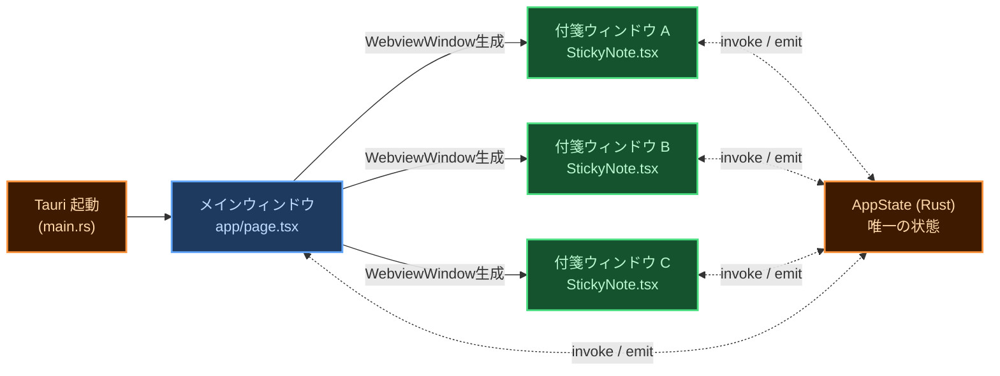

図 2-1　ウィンドウ生成の仕組み

<Note type="warning">
<strong>状態管理の鉄則：</strong>ウィンドウ間で直接通信しない。付箋 A が何かを変えたいとき → Rust <code>AppState</code> を更新 → Tauri <code>emit()</code> で全ウィンドウに通知。フロントエンドは表示するだけ。
</Note>

---

## 2 モジュール構造

フロントエンド（TypeScript/React）とバックエンド（Rust）の2層構成です。

### 2.1 フロントエンド（TypeScript / React）

付箋ウィンドウを構成する主要コンポーネント・フック・ユーティリティの依存関係を示します。

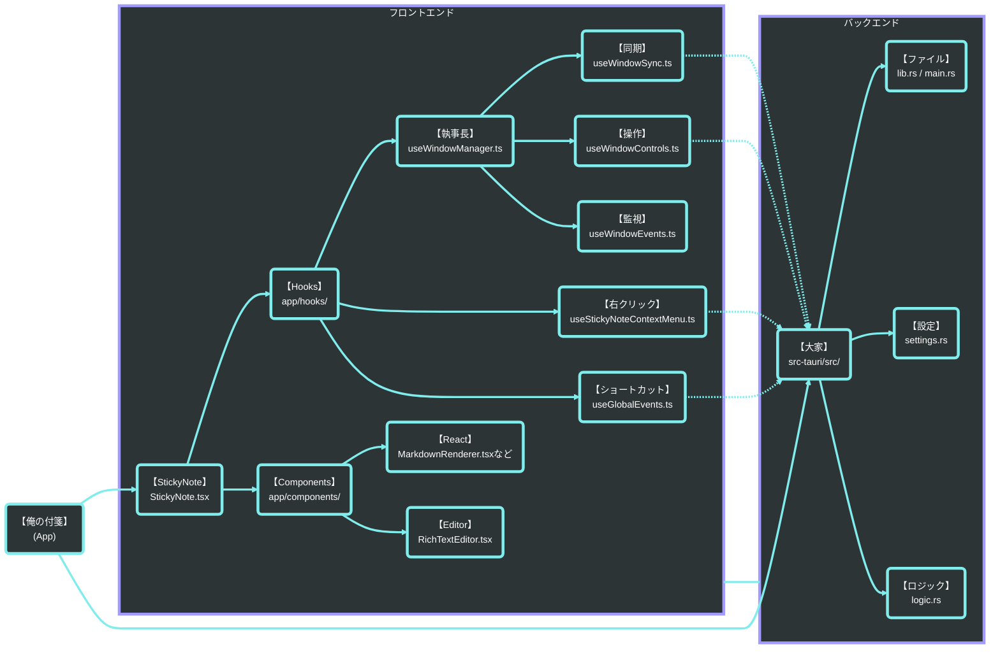

図 2-2　フロントエンドモジュール構成

### 2.2 バックエンド（Rust）

TauriコマンドとAppStateを中心とするRust側モジュールの役割を一覧します。

表 2.2-1　バックエンドモジュール一覧

<table class="module-table">
  <tr><th>No</th><th>ファイル</th><th>役割</th><th>主な責務</th></tr>
  <tr><td>1</td><td><code>main.rs</code></td><td>エントリーポイント</td><td>Tauri アプリ起動・プラグイン登録・シングルインスタンス制御</td></tr>
  <tr><td>2</td><td><code>lib.rs</code></td><td>invoke ハンドラ定義</td><td>フロントエンドから呼ばれる全コマンドを宣言。処理は各モジュールに委譲</td></tr>
  <tr><td>3</td><td><code>state.rs</code></td><td>AppState（唯一の状態）</td><td>ノート一覧・設定・VAPID鍵・デバイス情報をメモリ上で保持。Mutex で排他制御</td></tr>
  <tr><td>4</td><td><code>settings.rs</code></td><td>設定管理</td><td>base_path・言語・フォントサイズ等を settings.json に読み書き</td></tr>
  <tr><td>5</td><td><code>logic.rs</code></td><td>付箋ビジネスロジック</td><td>ノート作成・保存・リネーム・アーカイブ・削除・タグ管理</td></tr>
  <tr><td>6</td><td><code>storage.rs</code></td><td>ファイル I/O</td><td>Markdown ファイルの読み書き・frontmatter パース</td></tr>
  <tr><td>7</td><td><code>tray.rs</code></td><td>トレイアイコン</td><td>トレイメニュー生成・全表示/全隠し・クリックイベント処理</td></tr>
</table>
<table class="module-table">
  <tr><th>No</th><th>ファイル</th><th>役割</th><th>主な責務</th></tr>
  <tr><td>8</td><td><code>webpush.rs</code></td><td>プッシュ通知送信</td><td>VAPID 鍵生成・APNs/FCM への Web Push 送信</td></tr>
  <tr><td>9</td><td><code>gdrive.rs</code></td><td>Google Drive 連携</td><td>Drive ファイルの読み書き・ポーリング（iPhone からの受信検出）</td></tr>
  <tr><td>10</td><td><code>capture.rs</code></td><td>画像キャプチャ</td><td>Snipping Tool 起動・クリップボード画像を assets/ に保存</td></tr>
  <tr><td>11</td><td><code>clipboard.rs</code></td><td>クリップボード</td><td>テキスト・画像のクリップボード読み書き</td></tr>
  <tr><td>12</td><td><code>sound.rs</code></td><td>効果音</td><td>保存音・通知音などの再生</td></tr>
  <tr><td>13</td><td><code>import.rs</code></td><td>ファイルインポート</td><td>外部 Markdown ファイルを Vault に取り込む</td></tr>
  <tr><td>14</td><td><code>logger.rs</code></td><td>ログ</td><td>デバッグログの出力管理</td></tr>
</table>

---

## 3 データ構造

付箋ファイル・設定ファイル・モジュール依存の3種類のデータ構造を定義します。

### 3.1 付箋データ（Markdown ファイル = frontmatter + 本文）

付箋1枚 = Markdown ファイル1枚。PC ローカルのファイルシステムが正。Drive は中継所に過ぎない。

表 3.1-1　付箋データフィールド一覧

<table class="module-table">
  <tr><th>No</th><th>フィールド</th><th>型</th><th>用途・内容</th></tr>
  <tr><td>1</td><td><code>body</code></td><td>string</td><td>本文テキスト（Markdown）</td></tr>
  <tr><td>2</td><td><code>path</code></td><td>string</td><td>ファイルパス（実質的な主キー）</td></tr>
  <tr><td>3</td><td><code>context</code></td><td>string</td><td>コンテキスト名（本文1行目から自動生成）</td></tr>
  <tr><td>4</td><td><code>updated</code></td><td>string</td><td>最終更新日時</td></tr>
  <tr><td>5</td><td><code>x</code>, <code>y</code></td><td>number?</td><td>画面上の位置座標</td></tr>
  <tr><td>6</td><td><code>width</code>, <code>height</code></td><td>number?</td><td>ウィンドウサイズ</td></tr>
</table>
<table class="module-table">
  <tr><th>No</th><th>フィールド</th><th>型</th><th>用途・内容</th></tr>
  <tr><td>7</td><td><code>background_color</code></td><td>string?</td><td>付箋の背景色</td></tr>
  <tr><td>8</td><td><code>always_on_top</code></td><td>bool?</td><td>最前面固定（ピン留め）</td></tr>
  <tr><td>9</td><td><code>folded</code></td><td>bool?</td><td>折りたたみ状態（最小化）</td></tr>
  <tr><td>10</td><td><code>seq</code></td><td>i32</td><td>重なり順（Z-index 相当）</td></tr>
  <tr><td>11</td><td><code>tags</code></td><td>string[]</td><td>タグ一覧</td></tr>
</table>

<Note type="info">
<strong>型の <code>?</code> について：</strong><code>number?</code> や <code>string?</code> は「任意項目」を表す。値がない場合があるため、読み込み側は未設定として扱い、既定値や再計算で補う。
</Note>

### 3.2 設定データ（`settings.json`）

`settings.json` で管理するアプリ全体の設定項目を定義します。保存場所は `%APPDATA%\OreNoFusen\settings.json`（アンインストールしても残る領域）。

表 3.2-1　設定データフィールド一覧

<table class="module-table">
  <tr><th>No</th><th>フィールド</th><th>型</th><th>用途・内容</th></tr>
  <tr><td>1</td><td><code>base_path</code></td><td>string?</td><td>Vault フォルダのパス（未設定なら初回セットアップ画面）</td></tr>
  <tr><td>2</td><td><code>language</code></td><td>string</td><td>表示言語</td></tr>
  <tr><td>3</td><td><code>auto_start</code></td><td>boolean</td><td>OS 起動時に自動起動するか</td></tr>
</table>
<table class="module-table">
  <tr><th>No</th><th>フィールド</th><th>型</th><th>用途・内容</th></tr>
  <tr><td>4</td><td><code>font_size</code></td><td>number</td><td>基本フォントサイズ</td></tr>
  <tr><td>5</td><td><code>sound_enabled</code></td><td>boolean</td><td>効果音 ON/OFF</td></tr>
  <tr><td>6</td><td><code>pc_id</code></td><td>string?</td><td>この PC を一意に識別する UUID。Drive 上の <code>pc_devices.json</code> と紐づく。初回起動時に Rust が自動生成し、ユーザーには見せない</td></tr>
</table>

::: tip pc_id を settings.json に置く理由
旧バージョンでは `pc_id` を別ファイル `%LOCALAPPDATA%\ore-no-fusen\pc_device.json` に保存していました。しかし `LOCALAPPDATA` 側はアンインストール時に削除されるため、再インストールするたびに新しい `pc_id` が生成され、Drive 上の `pc_devices.json` に古い登録がゴミとして残る問題がありました。`settings.json`（`%APPDATA%` 側＝アンインストールしても残る領域）に移すことで、再インストールしても同じ `pc_id` が継続して使われ、Drive 上にゴミが生まれなくなります。起動時に旧 `pc_device.json` が見つかれば自動で `settings.json` に移行し、旧ファイルは削除します。
:::

### 3.3 クラス図（依存関係）

主要モジュール間の依存関係をMermaidクラス図で示します。

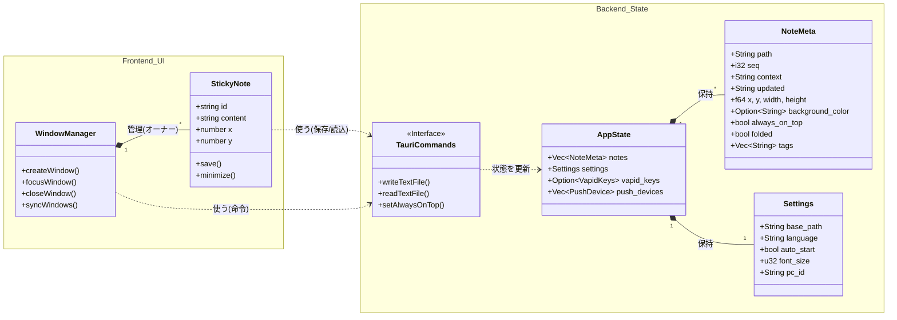

図 2-3　クラス図（主要モジュール依存関係）

---

## 4 データフロー

アプリ起動から保存・画像・検索まで4つのシーケンス図を示します。

<Note type="info">
シーケンス図では、<strong>①②③</strong> はユーザーが実施する操作、<strong>❶❷❸</strong> はアプリ・OS・ファイルシステムが自動実行する処理を表します。
</Note>

### 4.1 アプリ起動

起動時にファイルシステムから付箋一覧を読み込むフローです。

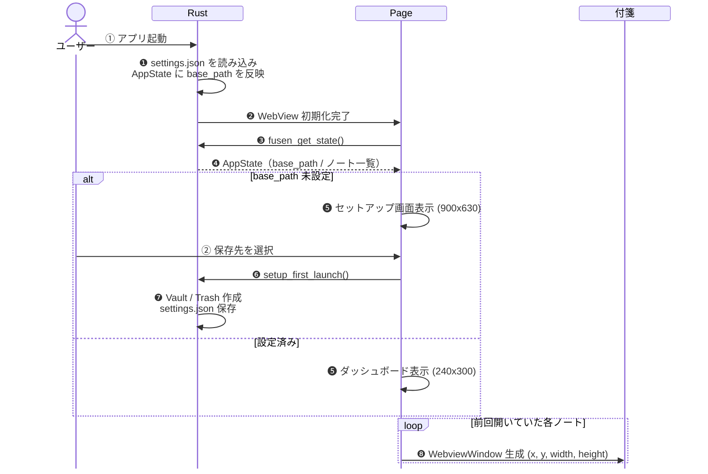

図 2-4　アプリ起動シーケンス

### 4.2 付箋の保存・自動リネーム

本文の1行目をファイル名（context）として自動採用する。800ms のデバウンスで連続入力に追従。

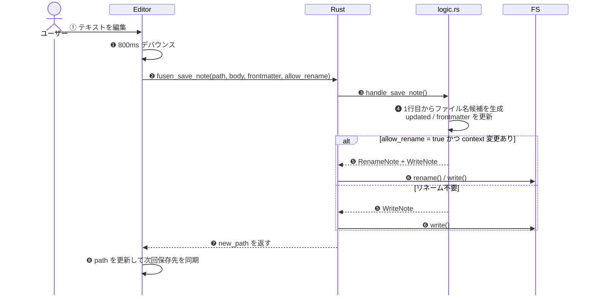

図 2-5　付箋の保存・自動リネームシーケンス

### 4.3 画像キャプチャ

OS 内蔵の Snipping Tool を呼び出し、撮影された画像を Vault の <code>assets/</code> に自動保存する。

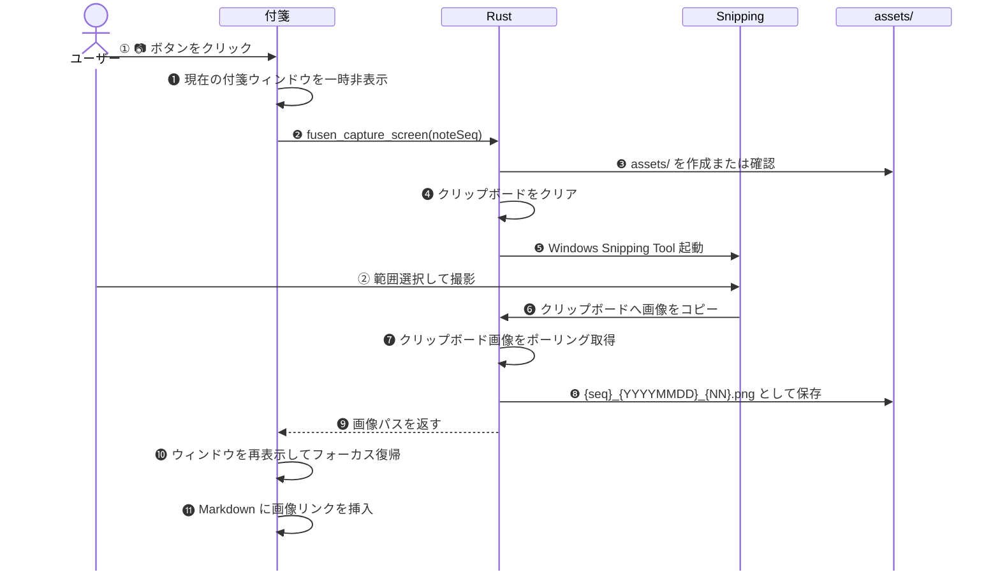

図 2-6　画像キャプチャシーケンス

### 4.4 全文検索

キーワードをリアルタイムで全付箋から検索するフローです。

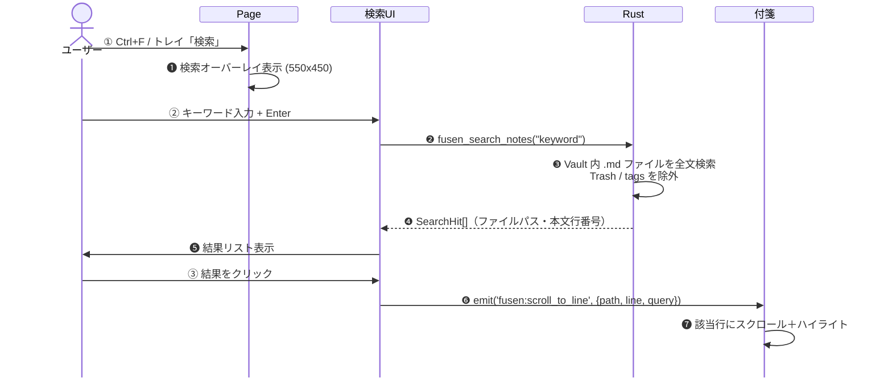

図 2-7　全文検索シーケンス

---

## 5 UI インタラクション

付箋ウィンドウの操作領域・モード・マウス挙動を定義します。

<Note type="info">
付箋ウィンドウには <strong>表示モード（閲覧中）</strong> と <strong>編集モード（執筆中）</strong> の2状態がある。クリックした場所と現在のモードの組み合わせで動作が決まる。
</Note>

### 5.1 モード定義

表示・編集の2モードとその遷移条件を定義します。

表 5.1-1　モード定義

| No | モード | 状態 |
|:---|:---|:---|
| 1 | **表示モード（閲覧中）** | Markdown としてレンダリング済みの付箋を読んでいる状態 |
| 2 | **編集モード（執筆中）** | カーソルが点滅し文字を書き込める状態。背景が半透明の白になる |

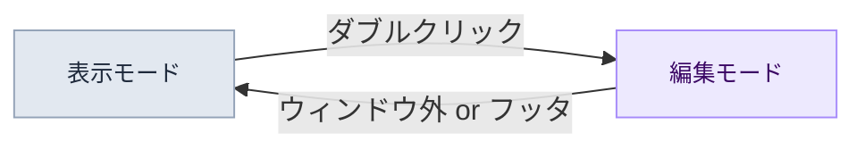

図 2-8　モード遷移図

### 5.2 操作領域の定義

付箋ウィンドウをエディタ本文・余白(A)・フッタ(B)の3エリアに分けて操作を割り当てます。

  <svg width="420" height="310" viewBox="0 0 420 310" xmlns="http://www.w3.org/2000/svg" style="font-family:-apple-system,BlinkMacSystemFont,'Segoe UI',sans-serif;">
    <rect x="10" y="10" width="320" height="280" rx="10" ry="10" fill="white" stroke="#94a3b8" stroke-width="2"></rect>
    <rect x="10" y="10" width="320" height="40" rx="10" ry="10" fill="#e2e8f0" stroke="#94a3b8" stroke-width="2"></rect>
    <rect x="10" y="36" width="320" height="14" fill="#e2e8f0"></rect>
    <text x="170" y="35" text-anchor="middle" font-size="12" font-weight="700" fill="#475569">ヘッダー領域</text>
    <text x="170" y="48" text-anchor="middle" font-size="10" fill="#94a3b8">（ドラッグでウィンドウ移動）</text>
    <rect x="20" y="54" width="300" height="170" rx="4" fill="#fafafa" stroke="#cbd5e1" stroke-width="1.5"></rect>
    <rect x="20" y="54" width="180" height="170" rx="4" fill="#eff6ff" stroke="none"></rect>
    <rect x="20" y="54" width="180" height="170" fill="none" stroke="#93c5fd" stroke-width="1" stroke-dasharray="4,3"></rect>
    <rect x="28" y="70" width="120" height="8" rx="3" fill="#3b82f6" opacity="0.6"></rect>
    <rect x="28" y="86" width="155" height="8" rx="3" fill="#3b82f6" opacity="0.6"></rect>
    <rect x="28" y="102" width="90" height="8" rx="3" fill="#3b82f6" opacity="0.6"></rect>
    <line x1="122" y1="100" x2="122" y2="114" stroke="#1e40af" stroke-width="2"></line>
    <rect x="28" y="134" width="0" height="8" rx="3" fill="#3b82f6" opacity="0.3"></rect>
    <rect x="200" y="54" width="120" height="170" fill="#fef9c3" stroke="none"></rect>
    <rect x="200" y="54" width="120" height="170" fill="none" stroke="#fbbf24" stroke-width="1" stroke-dasharray="4,3"></rect>
    <text x="260" y="108" text-anchor="middle" font-size="13" font-weight="800" fill="#92400e">(A)</text>
    <text x="260" y="124" text-anchor="middle" font-size="11" fill="#92400e">エディタ余白</text>
    <text x="260" y="139" text-anchor="middle" font-size="10" fill="#b45309">（ドラッグ→ウィンドウ移動）</text>
    <text x="260" y="152" text-anchor="middle" font-size="10" fill="#b45309">（DBクリック→編集開始）</text>
    <text x="110" y="108" text-anchor="middle" font-size="12" font-weight="800" fill="#1e40af">エディタ本文</text>
    <text x="110" y="123" text-anchor="middle" font-size="10" fill="#3b82f6">（テキスト・リンク）</text>
    <rect x="20" y="224" width="300" height="56" rx="4" fill="#fdf4ff" stroke="#d8b4fe" stroke-width="1.5" stroke-dasharray="5,3"></rect>
    <text x="170" y="249" text-anchor="middle" font-size="13" font-weight="800" fill="#6b21a8">(B) フッタ領域</text>
    <text x="170" y="265" text-anchor="middle" font-size="10" fill="#7c3aed">文字が存在しない下部の空間（エディタ外）</text>
    <text x="170" y="278" text-anchor="middle" font-size="10" fill="#7c3aed">クリック→編集終了 / DBクリック→文末から編集開始</text>
    <rect x="345" y="54" width="14" height="14" rx="3" fill="#eff6ff" stroke="#93c5fd" stroke-width="1.5"></rect>
    <text x="364" y="65" font-size="11" fill="#1e40af">エディタ本文</text>
    <rect x="345" y="76" width="14" height="14" rx="3" fill="#fef9c3" stroke="#fbbf24" stroke-width="1.5"></rect>
    <text x="364" y="87" font-size="11" fill="#92400e">(A) 余白</text>
    <rect x="345" y="98" width="14" height="14" rx="3" fill="#fdf4ff" stroke="#d8b4fe" stroke-width="1.5"></rect>
    <text x="364" y="109" font-size="11" fill="#6b21a8">(B) フッタ</text>
  </svg>

図 2-9　付箋ウィンドウの操作領域

表 5.2-1　操作領域の定義

| No | 領域 | 場所 | ユーザーの意図 |
|:---|:---|:---|:---|
| 1 | **エディタ本文** | 文字・リンクが実際に存在する場所 | 「ここを直接操作・書き換えたい」 |
| 2 | **(A) エディタ余白** | 文字の右側・左側に広がる枠線内の空白 | 「この行の続きや近くから書き込みたい」 |
| 3 | **(B) フッタ領域** | 最後の行より下にある何もない空間（エディタ外） | 「一番下から追記したい」または「編集を終わらせたい」 |

### 5.3 インタラクション・マトリックス

エリア × 操作の組み合わせで起きる動作を一覧にまとめます。

#### 5.3.1 🖱 ワンクリック

表 5.3-1　ワンクリック操作一覧

| No | クリックした場所 | 表示モード | 編集モード |
|:---|:---|:---|:---|
| 1 | エディタ本文 | 何もしない（ドラッグ準備） | カーソル移動（その文字へ） |
| 2 | (A) エディタ余白 | 何もしない（ドラッグ準備） | カーソル移動（最近傍の文字へ） |
| 3 | (B) フッタ領域 | 何もしない（ドラッグ準備） | **編集終了** |
| 4 | リンク | **リンクを開く** | カーソル移動 |
| 5 | ウィンドウ外 | フォーカス解除 | **編集終了**（保存して表示モードへ） |

#### 5.3.2 🖱🖱 ダブルクリック

表 5.3-2　ダブルクリック操作一覧

| No | クリックした場所 | 表示モード | 編集モード |
|:---|:---|:---|:---|
| 1 | エディタ本文 | **編集開始**（クリックした文字から） | 単語選択 |
| 2 | (A) エディタ余白 | **編集開始**（最近傍の文字から） | — |
| 3 | (B) フッタ領域 | **編集開始**（文末から） | — |

#### 5.3.3 ✋ ドラッグ（押しっぱなしで移動）

表 5.3-3　ドラッグ操作一覧

| No | ドラッグした場所 | 表示モード | 編集モード |
|:---|:---|:---|:---|
| 1 | エディタ本文 | 🪟 ウィンドウ移動 | 📝 テキスト範囲選択 |
| 2 | (A) エディタ余白 | 🪟 ウィンドウ移動 | 🪟 ウィンドウ移動 |
| 3 | (B) フッタ領域 | 🪟 ウィンドウ移動 | 🪟 ウィンドウ移動 |

<Note type="warning">
<strong>右クリック：</strong>表示モードでは閲覧用メニュー（削除・色変更等）、編集モードでは編集用メニュー（コピー・貼り付け等）が開く。 
<strong>Ctrl + クリック：</strong>編集モード中でもリンクを強制的に開く。
</Note>

---

## 6 機能一覧

システムトレイメニュー・付箋のツールバー・右クリックメニュー・設定画面の機能と、各機能の設計意図を記します。

### 6.1 システムトレイメニュー

タスクバーのトレイアイコンを左クリック（または右クリック）すると表示されるメニューです。`show_menu_on_left_click(true)` の設定により、左クリックでもメニューが開きます。

表 6.1-1　システムトレイメニュー項目

| No | 項目 | 機能 | 設計意図・工夫 |
|:---|:---|:---|:---|
| 1 | 新規メモ | 新しい付箋を作成する | **プールウィンドウ方式**（後述）で表示遅延ゼロを実現。トレイが発火すると `fusen:create_note_from_tray` をメインウィンドウに emit し、JS 側が昇格処理を担う |
| 2 | 検索 | 全文検索オーバーレイを開く | Vault 内の全 .md を Rust 側で行単位に grep。ヒットした 1 件目は自動的に対象ウィンドウにジャンプし、Enter/Shift+Enter/F3 で前後の結果をナビゲートできる |
| 3 | 全部隠す（Ctrl+Shift+H） | 全付箋を非表示にする | WebView2 の COM 層がネスト呼び出しでスタックオーバーフローを起こす問題を、JS 側が 1 窓ずつ 50ms 間隔でシリアルに処理することで回避 |
| 4 | 全部戻す | 非表示の全付箋を再表示する | 同上。Rust 側の `LAST_VISIBILITY_MS`（AtomicU64）で前回操作から 3 秒以内の連打をブロック。JS の連打と Rust のガードで二重に守る |
| 5 | タグで絞り込む | タグ選択で表示付箋を絞り込む | メニューを開くたびに Vault を再スキャンして最新タグを取得。☑/☐ で選択状態を可視化。タグトグルは `std::thread::spawn` で非同期処理し、Win32 同期メッセージによるスタック消費を防ぐ |
| 6 | 設定 | 設定画面を開く | メインウィンドウは通常 hidden。`show()` → `unminimize()` → `set_focus()` の順で先に表示を確保してから `fusen:open_settings` を emit する。順序が逆だとウィンドウが invisible のままイベントを受け取れない |
| 7 | 終了 | アプリを終了する | `app.exit(0)` で全 WebView ウィンドウを即時破棄。`on_window_event` を経由せず直接 OS プロセスを終了させる |

<Note type="info">
<strong>新規メモのプールウィンドウ方式：</strong>
WebView のコールドスタートには数百 ms かかる。そこで、起動直後から <strong>非表示の初期化済みウィンドウ（pool-window）を 1 枚</strong> 裏に用意しておく（UUID ラベルで識別）。
新規作成の要求が来たら、このウィンドウを「昇格（promote）」させてノートデータを流し込み、即座に表示する。昇格後はすぐ次のプールウィンドウをバックグラウンドで補充するため、常に 1 枚待機した状態が保たれる。 
プールウィンドウの背景色はあえて透明にせず黄色で初期化する（`transparent: false`）。透明ウィンドウは OS レベルで表示切り替え時に白くフラッシュするため、それを防ぐ工夫。 
Ctrl+N 連打によるクラッシュ防止は JS 側 1.2 秒スロットル ＋ Rust 側 500 ms ガード（`LAST_POOL_CREATE_MS` AtomicU64）のダブルガードで守る。
</Note>

### 6.2 付箋のツールバー

付箋にカーソルを乗せると右上にホバー表示されるツールバーです。閲覧モードと編集モードで表示が切り替わります。

表 6.2-1　閲覧モードのツールバー項目

| No | ボタン | 機能 | 設計意図・工夫 |
|:---|:---|:---|:---|
| 1 | ＋ | 新規付箋を作成する | プールウィンドウ方式で即時表示。ウェルカムノートでは `animate-bounce` ＋ オレンジ色になり「ここから始めよう」と誘導する |
| 2 | △/▽ | 付箋を折りたたむ／広げる | タイトルバーの高さだけに縮小する。高さは `logicalHeight × scaleFactor` で物理ピクセル精度に変換し、高 DPI モニタでもズレない。折りたたみ中にユーザーが手動でウィンドウを広げた場合（10 物理 px 以上）は自動展開し、そのサイズを新たな「展開サイズ」として記憶する |
| 3 | ピン（📌） | 付箋を最前面に固定する | ピン状態によって SVG の形が変わる：ONは「縦に刺さったピン＋影」、OFFは「斜め45°に倒れたピン」。固定 ON 時は「ギュッ」音（120 Hz 三角波 → 60 Hz、80ms）、固定 OFF 時は「ポン」音（400 Hz → 800 Hz サイン波、100ms）を AudioContext で生成。音声ファイルをバンドルせず、コードだけで音を作る |

表 6.2-2　編集モードのツールバー項目

| No | ボタン | 機能 | 設計意図・工夫 |
|:---|:---|:---|:---|
| 1 | ⊞ | 選択テキストをMarkdownテーブルに変換 | CSV 風に入力したテキストをテーブル記法に一発変換 |
| 2 | 🔷 | Mermaidダイアグラムのテンプレートを挿入 | フローチャート・シーケンス図のひな形を即挿入 |
| 3 | カメラ | 画面キャプチャを付箋に貼り付ける | OS 内蔵の Snipping Tool を起動し、撮影した画像を `assets/` に保存して `` 記法で本文に挿入 |
| 4 | **フローティングフォーマットバー** | テキスト選択時に選択範囲の真上に浮き上がる B / H1 / ≡ / ☑ の 4 ボタン | ツールバーを探さなくていい。選んだ瞬間にフォーマット操作ができる。座標は CodeMirror の `coordsAtPos()` で計算し、ウィンドウ上端を超える場合は下に反転（flip）してウィンドウ内に収める |

<Note type="info">
<strong>折りたたみの状態保存と復元：</strong>
折りたたみ状態（`folded`）は frontmatter に書き込む。次回起動時にファイルを読み込んだ時点で折りたたんだ状態で復元される。
<code>toggleMinimize()</code> は <code>setSize()</code> を呼ぶ前に <code>isMinimizedRef.current</code> を同期更新する。これを怠ると resize イベントが「折りたたんだ高さ」を展開サイズとして保存してしまうバグが発生するため、ref の先行更新が不可欠。
</Note>

### 6.3 付箋右クリックメニュー（閲覧モード）

付箋を閲覧モードで右クリックしたときのメニューです。

表 6.3-1　付箋右クリックメニュー（閲覧モード）項目

| No | 項目 | 機能 | 設計意図・工夫 |
|:---|:---|:---|:---|
| 1 | 📄 ファイル名 | 現在の付箋ファイル名を表示（選択不可） | 付箋は似たような見た目が並ぶ。「いまどの付箋を操作しているか」をメニューの冒頭で示すことで誤操作を防ぐ |
| 2 | 📂 フォルダを開く | 付箋ファイルが保存されているフォルダをエクスプローラーで開く | 「脱出口」。データは平文 .md。エクスプローラー・Obsidian・VS Code からいつでも直接触れる設計。データはユーザーが完全に所有する |
| 3 | ✨ 新規メモ（Ctrl+N） | 新しい付箋を作成する | `win.outerPosition()`（物理ピクセル）と `scaleFactor` を取得してメインプロセスに渡し、30 論理 px ずらした位置で出現。DPI 混在マルチモニタ環境でも正確にずれる |
| 4 | 📋 複製 | 現在の付箋を複製する | 同上のオフセット機構を使用。内容・フォーマット・タグを含めてそのままコピーし、隣に並べる |
| 5 | 🎨 色変更 | 付箋の背景色を変更する（青 / ピンク / 黄） | 3 色のみ。選択肢を絞ることで決断疲れを排除した設計。色は frontmatter の `background_color` に保存されアプリ再起動後も維持される |
| 6 | 🏷️ タグ | タグの追加・トグル・削除モードのサブメニュー | メニューを開く瞬間に `fusen_get_all_tags` で最新タグ一覧を Rust から取得（React state の古い値を使わない）。削除モードへの切り替えは `shouldReopenMenu.current = true` でメニューを閉じた直後に同じ座標で再表示する |
| 7 | ⏰ アラームを設定 | 付箋にアラームを設定する | 「5分後」〜「1週間後」のクイックボタン＋日時直接指定の 2 モード。時刻は JST (+09:00) でフロントマター `alarm_at` に保存。時刻になると付箋が点滅し、効果音が鳴る |
| 8 | 📱 iPhoneに送る | 付箋の内容を iPhone に送信する | メニュー項目は常に表示する。iPhone送信が未有効化、または送信前の `fusen_check_pro_setup` で Google Drive / Push 設定が未完了と分かった場合は、`{ tab: 'iphone' }` を添えて設定画面の iPhone 連携タブへ直行する |
| 9 | 📦 アーカイブ | 付箋をタグフォルダ or Archive フォルダに移動する | **移動前**にアプリ固有 frontmatter（background_color・geometry 等）を `strip_sticky_fields` で除去してから書き込む。関連画像を先にコピーし、コピー成功後に元ファイルを削除するフォールセーフな順序。複数タグ付きならサブメニューで移動先を選択 |
| 10 | 📨 開発者とのやりとり | 設定画面の掲示板を開く | 右クリック時は通信しない。ローカルに保存済みの未読状態だけを見て、未読の開発者返信がある場合は `● 新着あり` を付ける |
| 11 | 🗑️ 削除（Ctrl+D） | 付箋をゴミ箱に移動する | `fusen_move_to_trash` で OS のゴミ箱へ。削除音を鳴らしてからウィンドウを `hide()` → `destroy()` する順序で、ユーザーに白紙フレームを見せない |

### 6.4 付箋右クリックメニュー（編集モード）

編集モード中に右クリックすると切り替わるメニューです。テキスト操作に特化しています。

表 6.4-1　付箋右クリックメニュー（編集モード）項目

| No | 項目 | 機能 | 設計意図・工夫 |
|:---|:---|:---|:---|
| 1 | Undo / Redo | 直前の操作を取り消す / やり直す | `PredefinedMenuItem` で OS ネイティブ操作にバインド。CodeMirror の編集履歴をそのまま使う |
| 2 | 切り取り / コピー / 貼り付け / 全選択 | 標準テキスト操作 | 同上。Web クリップボード API ではなく OS ネイティブのクリップボード連携 |
| 3 | 📅 今日の日付（曜日付き） | カーソル位置に `2026-04-27(日)` 形式で挿入 | メニュー項目名自体に**挿入後の実際の文字列**を表示する。「Insert date」ではなく「📅 2026-04-27(日)」と書くことで、押す前に何が入るか分かる。`Intl.DateTimeFormat` で言語設定に従い曜日を自動変換（ja: 日・月・火、en: Sun・Mon・Tue） |
| 4 | 🕒 現在時刻 | カーソル位置に `HH:MM` 形式で挿入 | 同上。議事録・タスクログに時刻を一瞬で打ち込める |
| 5 | 📅🕒 日付＋時刻 | カーソル位置に日付と時刻を両方挿入 | 上の 2 項目を 1 アクションに合わせたショートカット |

<Note type="info">
<strong>メニューのリスナー設計（showContextMenu の ref 化）：</strong>
右クリックイベントのリスナーは deps=[] で一度だけ登録される。しかし showContextMenu 関数は isEditing や currentTags といった state に依存するため、毎レンダリングで再生成される。
このズレを解消するため、showContextMenu を ref（<code>showContextMenuRef</code>）に同期し、リスナー内では ref 経由で呼び出す。deps=[] のまま「常に最新の関数を使う」ことができ、リスナーの無駄な再登録も発生しない。
</Note>

### 6.5 設定画面

システムトレイ → 設定 から開く設定画面のタブと設定項目です。

表 6.5-1　設定画面タブ一覧

| No | タブ | 設定項目 | 設計意図・工夫 |
|:---|:---|:---|:---|
| 1 | 一般設定 | 言語（日本語 / English）・自動起動 ON/OFF・効果音 ON/OFF | 言語切り替えは全付箋ウィンドウの UI に即時反映。自動起動は `tauri-plugin-autostart` で Windows の HKCU\SOFTWARE\Microsoft\Windows\CurrentVersion\Run に登録。トグル操作が完了した瞬間に有効になる |
| 2 | 外観 | フォントサイズ（10〜32px、スライダーで変更） | スライダーをドラッグしながらリアルタイムにプレビューが更新される。決定した値は CSS 変数として全ウィンドウに伝播する |
| 3 | データ | Vault フォルダのパス変更・他フォルダからの Markdown インポート | インポートは .md ファイルと関連画像（`fusen_img_*`）を一括取り込む。Obsidian・Notion エクスポート・手書き md からの移行を想定。Vault フォルダ変更後は全付箋を再スキャンして再生成する |
| 4 | iPhone 連携 | Google Drive 連携の設定・認証 | Google OAuth + PKCE で、俺の付箋がユーザー自身の Drive にあるアプリ用ファイルを扱う許可を取る。トークンは PC ローカルにのみ保存する。Drive 接続が切れると本タブのアイコンに赤バッジが表示される。フィードバック Discord Webhook URL はバイナリに含めず Vercel 環境変数に持つ |
| 5 | このアプリについて | アプリバージョンの表示 | `getVersion()` が Cargo.toml からランタイムに読む。バージョン文字列はフロントエンドにハードコードされていない |
| 6 | フィードバック | 開発者へのフィードバック送信・1対1掲示板 | 送信内容は Discord Webhook 経由で開発者に届く。Webhook URL は Vercel 環境変数に持ち、バイナリには含めない。設定画面内に匿名の `conversation_id` を持つ掲示板を表示し、開発者返信を 1 日 1 回程度確認する |

---

### 6.6 開発者とのやりとり掲示板

ユーザーが連絡先を入力しなくても、設定画面内で開発者と 1 対 1 の掲示板としてやりとりできる補助機能です。ユーザーの PC に匿名の `conversation_id` を保存し、フィードバック送信時にその ID を Vercel API 経由で Discord 通知へ添付します。開発者がその通知へ返信すると、PC アプリは JST 4:00 頃に 1 日 1 回だけ自分宛の未読返信を確認し、ローカルに新着状態を保存します。右クリックメニューは通信せず、そのローカル状態だけを使って新着表示します。ユーザーと開発者の会話 UI の詳細は <a href="./007_COMMUNICATION">007 コミュニケーション設計</a> を参照してください。

<Note type="info">
<strong>怖くない設計:</strong>
PC アプリは全会話一覧を取得しません。`conversation_id` とローカルに保存した確認用トークンで、自分の掲示板だけを問い合わせます。開発者サーバーにはユーザーの既存付箋本文、添付画像、添付動画、Google Drive 内の同期ファイル、Google Drive トークンを送信しません。
</Note>

表 6.6-1　開発者とのやりとり掲示板の動作

| No | タイミング | 動作 | 設計意図 |
|:---|:---|:---|:---|
| 1 | 初回フィードバック送信時 | PC ローカルに `conversation_id` と確認用トークンを生成・保存する | メールアドレスや Discord ID を必須にせず、アプリ個体だけを匿名で識別する |
| 2 | フィードバック送信成功時 | 設定画面の掲示板に自分の投稿として表示する | 送信が成功したことを会話ログとして残す |
| 3 | 開発者返信登録時 | Vercel 側に `conversation_id` 宛の返信本文を未読として保存する | Discord は開発者の作業場所、Vercel API は会話の受け渡し場所として分離する |
| 4 | JST 4:00 頃の日次確認時 | 同じ日に未実行の場合のみ掲示板 API を呼ぶ | Vercel Cron が JST 3:00 に取り込んだ返信を朝に拾う |
| 5 | 未読返信あり | ローカルの `has_unread_developer_reply` を true にする | 右クリックメニューで通信せず新着表示できるようにする |
| 6 | 右クリックメニュー表示時 | ローカルの未読状態だけを見て `開発者とのやりとり ● 新着あり` と表示する | メニュー表示を軽くし、通信失敗で右クリックが効かなくなる事故を防ぐ |
| 7 | 掲示板を開いた時 | 最新の会話ログを取得し、表示できた開発者返信を既読化する | ユーザーが自分の意思で見た時だけDB上も既読にする |
| 8 | 未読返信なし・通信失敗 | 何も割り込んで表示しない。失敗時は次回確認まで待つ | 失敗しても付箋データには影響しない |
| 9 | 開発者専用の手動未読チェック | 現在のPCの会話IDで `conversation/poll` を呼び、右クリックメニュー用の未読状態だけ更新する | 開発・検証時に JST 4:00 の日次確認を待たず、新着表示を確認できる。ここでは既読化しない |

表 6.6-2　掲示板 API に送る情報・送らない情報

| No | 分類 | 内容 |
|:---|:---|:---|
| 1 | 送る | `conversation_id`、確認用トークン、アプリバージョン、掲示板確認に必要な最小限の時刻 |
| 2 | 送らない | ユーザーの既存付箋本文、添付画像、添付動画、Vault フォルダのパス、Google Drive 内の同期ファイル、Google Drive トークン |

---

## 7 エラーハンドリング・リカバリ方針

<Note type="info">
各エラーケースの実施状況。⚠️ 未実施 は現時点での課題。
</Note>

<Note type="success">
<strong>全体方針：</strong>
エラーは発生後にユーザーへ丸投げせず、アプリ側で予見できるものは事前に検出し、自動再取得・再同期・保護処理でできるだけ回避する。
回避できずにユーザー操作が必要な場合は、内部エラー文字列だけでなく、ユーザーが次に行う具体的な手順を表示する。
</Note>

### 7.1 ローカルファイルとリカバリ

#### 7.1.1 保存時のパス喪失保護（増殖バグ回避）
ユーザーが手動でファイルを移動・削除した場合や、リネーム処理が直前に行われた場合、古いパスに対する自動保存（ジオメトリ変更など）が発火すると古い名前でファイルが復活してしまう（増殖バグ）。
これを防ぐため、<code>logic.rs</code> の保存処理では**「上書き対象のファイルパスが物理的に存在するか（<code>!current_path_obj.exists()</code>）」をチェック**し、存在しない場合は保存処理をブロック（<code>Err</code> 返却）してトレースログを出力する保護機構を備えている（実施済み）。

#### 7.1.2 アトミック書き込みによるファイル破損防止
付箋内容の保存は、一時ファイルへの書き込み完了後に元のファイルへ <code>rename</code> するアトミック書き込みで行う。これにより、保存処理中の予期せぬ電源断やクラッシュによるデータ欠損・破損を完全に防ぐ（実施済み）。
ファイルシステムエラー（書き込み権限なし等）が発生した場合は、保存を中止し Tauri コマンドのエラーとして返却する。

#### 7.1.3 PC アプリ再起動時の状態復元
起動時に Vault フォルダを全スキャン（フロントマター解析）して付箋ウィンドウを再生成するため、アプリが異常終了した場合でも次回起動時にファイルの状態から自動復元される（実施済み）。
ただし、終了直前の「メモリ上にしか存在しない未保存の内容」は失われる（保存タイミングは blur 時またはデバウンス 800ms 経過後）。

---

## 8 環境変数・シークレット

この節は開発者向けです。PC版（Tauri アプリ）のビルド・リリースに必要な変数・シークレットの一覧です。

### 8.1 ローカルビルド用（`.env.local`）

`src-tauri/build.rs` がコンパイル時に読み取り、バイナリに直接埋め込む。`.env.local` は `.gitignore` 対象のため Git には含まない。

表 8.1-1　ローカルビルド用環境変数（.env.local）

| No | 変数名 | 取得元 | 用途 |
|:---|:---|:---|:---|
| 1 | `GDRIVE_CLIENT_ID` | Google Cloud Console → 認証情報 → OAuth 2.0 クライアント（Tauri用） → クライアント ID | PC 版が Google OAuth を開始するときに使う公開ID。ここでいう client は Google に登録した「俺の付箋 PC アプリ」を指す。`gdrive.rs` 内で `env!()` マクロで参照。 |
| 2 | `GDRIVE_CLIENT_SECRET` | Google Cloud Console → 認証情報 → OAuth 2.0 クライアント（Tauri用） → クライアント シークレット | 開発者が守る値。PC 版が Google OAuth のトークン交換・更新を行うために使う。`.env.local` は Git に含めず、配布物や公開リポジトリへ出さない。 |

### 8.2 CI/CD用（GitHub Secrets）

GitHub Actions のリリースワークフロー（`release.yml` / `do-release.yml`）が参照するシークレット。

表 8.2-1　CI/CD用 GitHub Secrets

| No | シークレット名 | 用途 | 設定するワークフロー |
|:---|:---|:---|:---|
| 1 | `GDRIVE_CLIENT_ID` | Tauri ビルド時の Drive Client ID（ローカルと同値） | `release.yml` |
| 2 | `GDRIVE_CLIENT_SECRET` | Tauri ビルド時の Drive Client Secret（ローカルと同値）。開発者が守る値で、GitHub Secrets にのみ置く | `release.yml` |
| 3 | `TAURI_SIGNING_PRIVATE_KEY` | Tauri アップデーター署名用秘密鍵。正規リリースであることを検証するために使う | `release.yml` |
| 4 | `TAURI_SIGNING_PRIVATE_KEY_PASSWORD` | 上記秘密鍵のパスフレーズ | `release.yml` |
| 5 | `WINGET_TOKEN` | winget-pkgs への PR 作成用 PAT（`public_repo` スコープ必要） | `release.yml` |
| 6 | `WINGET_APP_ID` | do-release.yml が main ブランチへ push するための GitHub App ID | `do-release.yml` |
| 7 | `WINGET_APP_PRIVATE_KEY` | 上記 GitHub App の秘密鍵。リリース処理をアプリ名義で実行するために使う | `do-release.yml` |

<Note type="warning">
<code>WINGET_TOKEN</code> は PAT（Personal Access Token）。GitHub App トークンでは microsoft/winget-pkgs（外部 org）への PR が作れないため PAT が必要。 
<code>WINGET_APP_ID</code> / <code>WINGET_APP_PRIVATE_KEY</code> は同一 org 内の main ブランチへの push 用であり、winget とは別のトークン。
</Note>

---

## 9 付箋の整列（カンバン整列）

散らばった付箋を 1 操作で、主ディスプレイ 1 枚に **タグ × 色** で整列する機能。
タグを横レーン（行）として縦に積み、各レーンの中を色の列に分け、同じ色は右下に階段状に重ねて
左上（タイトル・書き出し）が見えるようにする。全付箋の上端は必ず画面内に収める。

### 9.1 全体レイアウト

タグ＝横レーン（上から下へ）／色＝列（黄→赤→青→白→黒・空は詰める）／同色＝右下に階段重ね。
タグが増えても下へ伸びるだけで横は破綻しない。

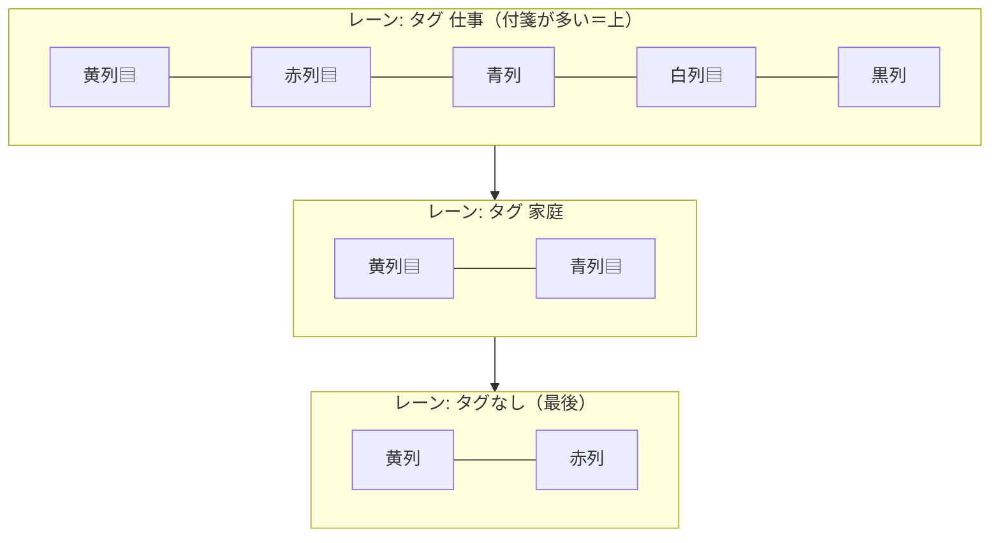

図 9-1　カンバン整列の全体レイアウト（タグ=横レーン × 色=列、▤=同色が右下に重なる列）

### 9.2 同色の重ね方（左上が見える）

同じタグ・同じ色の付箋は、後の付箋ほど右下にずらして重ねる。前の付箋の左上が残るので、
上から順にタイトル・書き出しが読める。新しいものが手前（左上）。

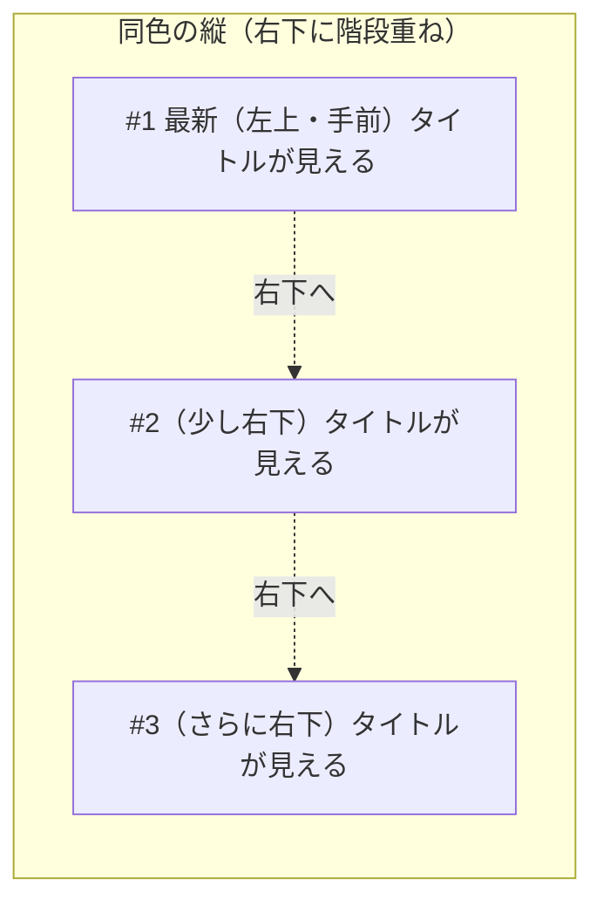

図 9-2　同色の重ね方（右下に階段状・左上のタイトルが見える・新しいものが手前）

### 9.3 重なり量の動的計算（必ず画面内）

重なり量は固定せず、全付箋の上端が主ディスプレイの作業領域に収まるよう逆算する。
タグ・枚数が多いほど自動的に深く重なる。レーンが縦に入りきらない場合はレーン同士も重ねる。

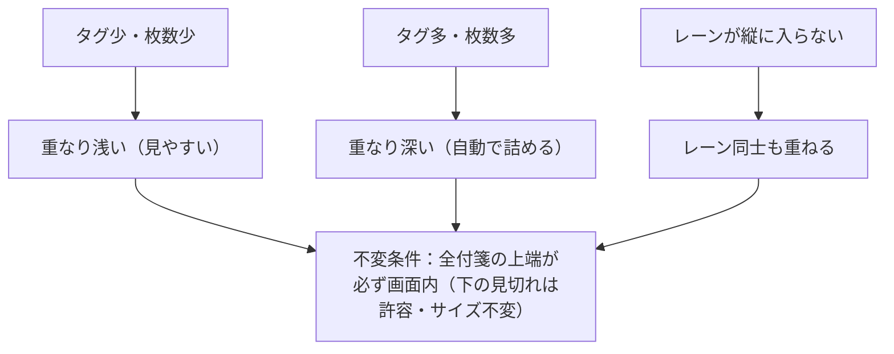

図 9-3　重なり量の動的計算（タグ/枚数に応じて自動調整し、全付箋の上端を画面内に収める）

### 9.4 並び順・出力先・起動

表 9.4-1　整列の仕様

| 項目 | 仕様 |
|:---|:---|
| タグ（レーン）の順 | 付箋が多いタグが上。タグなしは最後のレーン |
| 色の列の順 | 黄 → 赤 → 青 → 白 → 黒（固定）。空の色列は詰める |
| 同色の縦の順 | 作成日（seq）順・新しいものが手前（左上）。並び順は1か所で変更可（将来は設定化） |
| 出力先 | 全付箋を主ディスプレイ 1 枚に集約 |
| 起動 | システムトレイメニュー（実装途中は仮ショートカット Ctrl+Shift+L） |
| 取り消し | 整列前の位置を1段スナップショットして「整列前に戻す」（予定） |
| レーンの題（◆タグ名） | 将来課題（付箋外の表示物のため別途設計） |

> 詳細な確定仕様・実装段階は計画書 `.planning/arrange-by-tag-plan.md`（§3.1 / §3.2.1 / §4 / §5.2.2）を参照。

---

## 10 改版履歴

表 10-1　改版履歴

| No | バージョン | 日付 | 変更内容 |
|:---|:---|:---|:---|
| 1 | 1.0 | 26-04-19 | 新規作成。旧 001_ARCHITECTURE_DESIGN.html のPC側内容（構造図・クラス図・シーケンス図・ER図）を統合・整理 |
| 2 | 1.1 | 26-04-24 | ウィンドウ構成図を `graph LR`（横向き）に変更。スクロールなしで全体が見えるよう改善。 |
| 3 | 1.2 | 26-04-26 | セクション7「環境変数・シークレット」を新規追加。ローカルビルド用とCI/CD用を分けて記載。 |
| 4 | 1.3 | 26-04-27 | セクション6「機能一覧」を新規追加（システムトレイ・ツールバー・右クリックメニュー・設定画面）。各機能に設計意図・工夫を追記。旧6→7、旧7→8、旧8→9に繰り下げ。 |
| 5 | 1.4 | 26-05-06 | 3.1 付箋データ、6.1〜6.5 機能一覧、8.1〜8.2 環境変数・シークレットを修正。型の `?` は任意項目であることを注記し、6.1-1 以降の表へ No を追加。環境変数・シークレットの対象を開発者向けとして明記し、Google OAuth の client_id / client_secret とリリース用秘密鍵の用途を説明。 |
| 6 | 1.5 | 26-06-01 | 6.5〜6.6 にフィードバック返信付箋を追加。匿名 `feedback_thread_id`、送信後ありがとう付箋、1 日 1 回の返信確認、返信 API に送る情報・送らない情報を定義。 |
| 7 | 1.6 | 26-06-01 | 6.5〜6.6 を返信付箋方式から設定画面内の 1 対 1 掲示板方式へ変更。匿名 `conversation_id`、掲示板API、送る情報・送らない情報を定義。 |
| 8 | 1.7 | 26-06-04 | 開発者とのやりとりの新着表示を右クリックメニューに追加する方針を定義。PCアプリは JST 4:00 頃に1日1回だけ確認し、右クリック時は通信せずローカル未読状態を使う仕様を追加。開発者専用の手動未読チェックも追加。 |
| 9 | 1.8 | 26-06-05 | エラー対応の全体方針を追加。予見可能なエラーはアプリ側で自動回避し、ユーザー対応が必要な場合は具体的な復旧手順を表示する方針を明記。 |
| 10 | 1.9 | 26-06-21 | 付箋の整列（カンバン整列）を新章 §9 として追加。タグ=横レーン × 色=列 × 同色=右下に階段重ね（左上が見える）、重なり量は動的計算で全付箋の上端を画面内に収める方針を図示（図 9-1〜9-3・表 9.4-1）。 |

