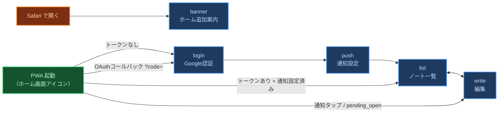
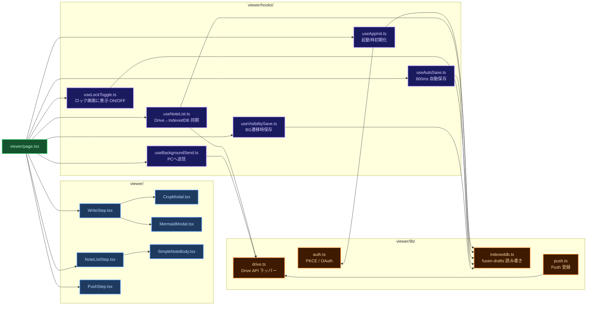
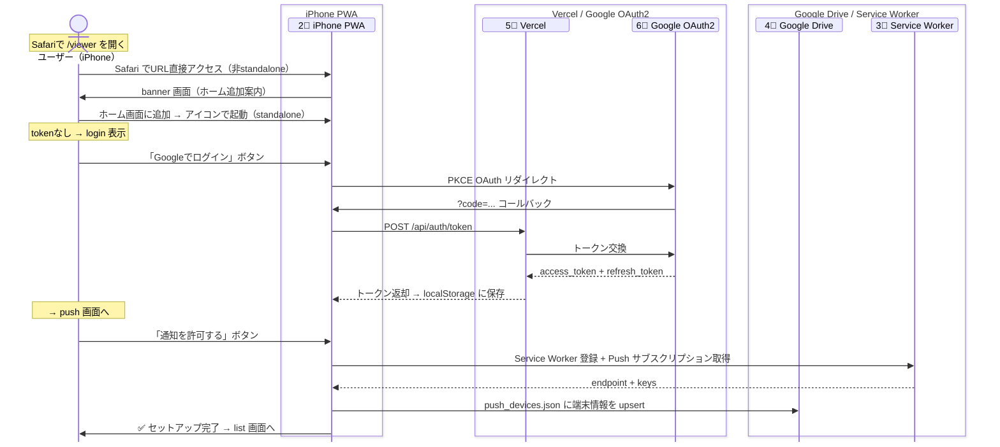
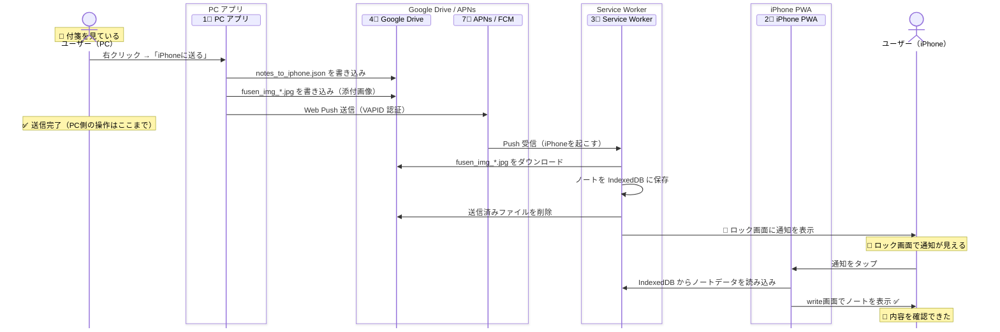
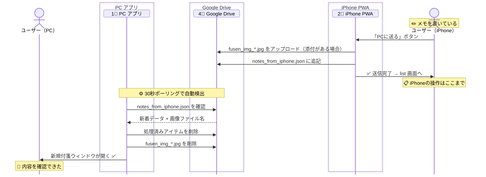
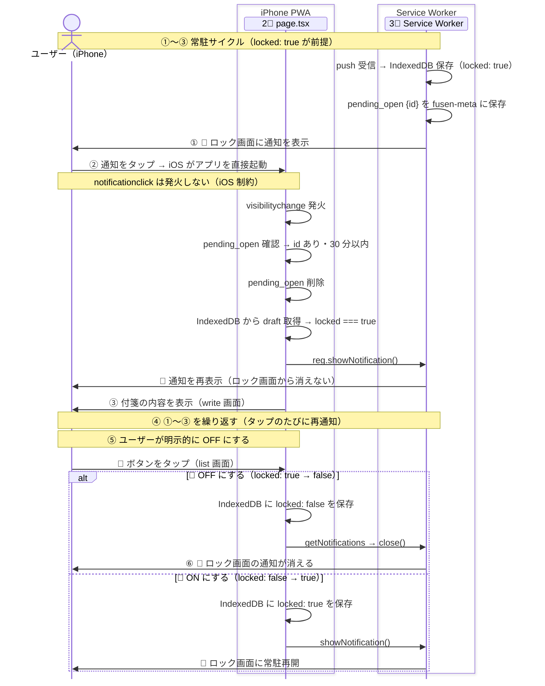
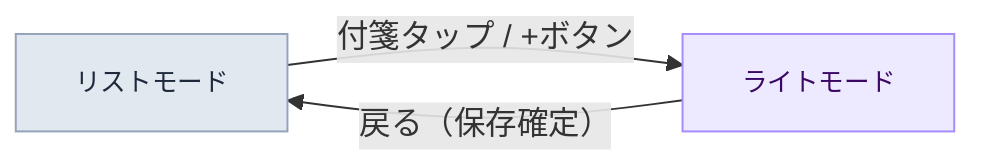

# 📱 003 クラウド同期・iPhone設計

画面構成・Service Worker・データ構造・データフロー

設計書 v1.0 / 2026-04-19

---

## 1 画面構成

iPhone PWA は <code>step</code> state で切り替わる5画面の単一ページアプリです。

<Note type="success">
iPhone PWA は <code>page.tsx</code> 内の <code>step</code> state で表示画面を切り替える単一ページアプリ。
<strong>step の値は5種類：banner / login / push / list / write</strong>。
URLバーなしのネイティブアプリ風で動作する（PWA起動時）。
</Note>

### 1.1 各画面の役割

banner・login・push・list・write の5画面それぞれの表示条件と役割を説明します。

<!-- インストール案内 -->

インストール案内画面 — Safariで /viewer を開いたとき（PWAではない）

  <!-- banner -->
  

    

      

      

        
ホーム画面に 追加してください

        
STEP 1 — 共有をタップ

        

        
STEP 2 — ホーム画面に追加

        

        
STEP 3 — 追加をタップ

        

        
app 2.9.x

      

    

    
banner

    
step: banner

  

  <dl class="screen-def">
    <dt>表示条件</dt>
    <dd>SafariでURLを直接開いた（PWAではない）</dd>
    <dt>目的</dt>
    <dd>ホーム画面への追加手順を案内する。初回インストール時のみ使う。</dd>
    <dt>バージョン表示</dt>
    <dd><code>app x.x.x</code> のみ。ServiceWorkerは表示しない。</dd>
    <dt>備考</dt>
    <dd>skipWaiting導入済みのため、バージョンアップ目的で開く必要はない。</dd>
  </dl>

<!-- PWA画面 -->

PWA画面 — ホーム画面アイコンから起動（URLバーなし・アプリとして動作）

  <!-- login -->
  

    

      

      

        
俺の付箋

        
Googleでログイン してください

        
Googleでログイン

        
app 2.9.x / ServiceWorker 2.9.x

      

    

    
ログイン

    
step: login

  

  <dl class="screen-def">
    <dt>表示条件</dt>
    <dd>アクセストークンがない（初回 or 有効期限切れ）</dd>
    <dt>操作</dt>
    <dd>「Googleでログイン」ボタン → Google OAuth（PKCE）→ トークン取得後 push へ遷移</dd>
    <dt>バージョン表示</dt>
    <dd><code>app x.x.x / ServiceWorker x.x.x</code>（右下固定）</dd>
  </dl>
  <!-- push -->
  

    

      

      

        
セットアップ

        
プッシュ通知を 有効にしてください

        
通知を許可する

        
app 2.9.x / ServiceWorker 2.9.x

      

    

    
通知設定

    
step: push

  

  <dl class="screen-def">
    <dt>表示条件</dt>
    <dd>トークンあり + <code>viewer_push_done</code> が未設定</dd>
    <dt>操作</dt>
    <dd>「通知を許可する」→ OS権限ダイアログ → 許可後 list へ遷移。<code>viewer_push_done=true</code> を localStorage に保存。</dd>
    <dt>バージョン表示</dt>
    <dd><code>app x.x.x / ServiceWorker x.x.x</code>（右下固定）</dd>
  </dl>
  <!-- list -->
  

    

      

      

        

          メモ
          ＋
        

        

大事なメモ🔔

        

買い物リスト🔕

        

アイデアメモ🔕

        
app 2.9.x / ServiceWorker 2.9.x

      

    

    
メモ一覧

    
step: list

  

  <dl class="screen-def">
    <dt>表示条件</dt>
    <dd>トークンあり + <code>viewer_push_done=true</code>（通常の起動時）</dd>
    <dt>操作</dt>
    <dd>＋ → write（新規） メモタップ → write（編集） 🔔 → ロック画面に表示 ON/OFF 🗑️ → メモ削除</dd>
    <dt>バージョン表示</dt>
    <dd><code>app x.x.x / ServiceWorker x.x.x</code>（右下固定）</dd>
  </dl>
  <!-- write -->
  

    

      

      

        

          ← 戻る
          PCへ送る
        

        
大事なメモ...

        

        

          
iPhoneに置く

          
📷

        

        

          
B

          
H1

          
≡

        

        
app 2.9.x / ServiceWorker 2.9.x

      

    

    
編集

    
step: write

  

  <dl class="screen-def">
    <dt>表示条件</dt>
    <dd>① list からメモ選択・新規作成 ② 通知タップ（notificationclick または pending_open）</dd>
    <dt>操作</dt>
    <dd>「PCへ送る」→ Drive経由でPC送信 → list へ 「iPhoneに置く」→ IndexedDBに下書き保存 → list へ 「← 戻る」→ list へ（保存なし）</dd>
    <dt>バージョン表示</dt>
    <dd><code>app x.x.x / ServiceWorker x.x.x</code>（右下固定）</dd>
  </dl>

### 1.2 起動時の遷移ルール

PWA起動時にどの画面から始まるかを決める4つのルールを定義します。

図 3-1　起動時の画面遷移ルール

表 1.2-1　起動時画面遷移ルール

| No | 起動時の状態 | 遷移先 |
|:---|:---|:---|
| 1 | 非 standalone（Safariで開いた） | banner |
| 2 | URL に `?code=`（OAuthコールバック） | Vercel でトークン取得 → push |
| 3 | URL に `?note=`（通知タップで起動） | IndexedDB からノート読み込み → write |
| 4 | token あり・pending_open あり（30分以内） | IndexedDB からノート読み込み → write |
| 5 | token あり・`viewer_push_done=true` | list（通常起動） |
| 6 | token あり・push 未設定 | push（通知セットアップ） |
| 7 | token なし | login |

<Note type="warning">
<strong>pending_open とは：</strong>iOS では通知タップ時に <code>notificationclick</code> が発火しないケースがある。
その補完として SW は Push 受信時に <code>fusen-meta</code>（IndexedDB）へノート ID を記録する。
次回 PWA 起動時に <code>useAppInit</code> がこれを読んで、対象ノートを write で自動表示する。
</Note>

---

## 2 モジュール構造

フロントエンド・Service Worker・Vercel API の3層構成です。

### 2.1 フロントエンド（TypeScript / React）

画面を構成するコンポーネント・フックの依存関係を示します。
また、図には現れない共通ユーティリティファイルも以下の表に一覧します。

表 2.1-1　共通ユーティリティ（viewer/ 配下）

<table class="module-table" style="font-size:12px; margin-bottom: 16px;">
  <thead>
    <tr><th style="width:40px;text-align:center">No</th><th style="width:160px">ファイル名</th><th>役割</th></tr>
  </thead>
  <tbody>
    <tr><td style="text-align:center;color:#94a3b8;font-weight:700">1</td><td><code>types.ts</code></td><td>フロントエンド全体で共有する型定義（<code>DraftRecord</code> 等）</td></tr>
    <tr><td style="text-align:center;color:#94a3b8;font-weight:700">2</td><td><code>utils.ts</code></td><td>依存を持たない汎用的なユーティリティ関数群</td></tr>
    <tr><td style="text-align:center;color:#94a3b8;font-weight:700">3</td><td><code>editor-helpers.ts</code></td><td>テキストエリア操作やタグ管理（localStorageとの連携）を担うヘルパー</td></tr>
  </tbody>
</table>

図 3-2　フロントエンドモジュール構成

### 2.2 Service Worker（worker/index.js）

push受信・notificationclick等を処理するSWのイベントハンドラ5点を一覧します。

表 2.2-1　SW イベントハンドラ一覧

| No | イベント | 処理内容 |
|:---|:---|:---|
| 1 | `install` | `skipWaiting()` 呼び出し。新バージョンを即時有効化。 |
| 2 | `activate` | `clients.claim()` でページの制御を取得。SW バージョンをログに記録。 |
| 3 | `push` | ① Push ペイロード（title / body_rich / id）を取得 ② `fusen-meta` からアクセストークンを取得 ③ Drive から画像をダウンロード ④ `fusen-drafts` にノートを保存 ⑤ Drive から画像ファイルを削除 ⑥ `notes_to_iphone.json` から当該 ID を削除 ⑦ `pending_open` を `fusen-meta` に記録 ⑧ 既存の同 ID 通知を閉じてから新規通知を表示 |
| 4 | `notificationclick` | 通知をタップ → `locked` 確認 → true なら再通知・アプリを前面に出す。 <strong style="color:#f59e0b">⚠️ iOS では発火しない（既知の制約）。</strong>タップ後の再通知は `page.tsx` の `pending_open` フローが代替。 |
| 5 | `message` | アプリからの通信を受信。`CLOSE_NOTIFICATION` で通知を閉じる、`GET_VERSION` で SW のバージョンを返す等の処理。 |

<Note type="warning">
<strong>ログ：</strong>SW の動作は全て <code>fusen-logs</code>（IndexedDB）に記録される。
PC の Chrome で PWA を開き、DevTools → Application → IndexedDB → fusen-logs で確認できる。
</Note>

### 2.3 サーバーサイド（Vercel API Routes）

Google OAuth2 の client_secret を保護するVercel APIエンドポイント2点を説明します。

<Note type="info">
Google OAuth の <code>client_secret</code>（秘密鍵）をブラウザ（iPhone）に渡さないため、
トークン交換・更新の処理だけ Vercel のサーバーサイドに置く。iPhone は Vercel 経由でのみトークンを取得できる。
</Note>

表 2.3-1　Vercel API Routes 一覧

| No | ファイル | 役割 |
|:---|:---|:---|
| 1 | `app/api/auth/token/route.ts` | OAuth 認証コード → アクセストークン＋リフレッシュトークン交換。初回ログイン時のみ呼ばれる。 |
| 2 | `app/api/auth/refresh/route.ts` | リフレッシュトークン → 新しいアクセストークン取得。Drive API 呼び出し時にトークン期限切れを検出したら自動呼び出し。 |

#### 環境変数（Vercel）

Vercel の Environment Variables に設定する変数の一覧です。`.env` ファイルやコードにハードコードしないこと。

表 2.3-2　Vercel 環境変数一覧

| 変数名 | 公開範囲 | 取得元 | 用途 |
|:---|:---|:---|:---|
| `GOOGLE_CLIENT_SECRET_PWA` | サーバー専用 | Google Cloud Console → 認証情報 → OAuth 2.0 クライアント（PWA用） → クライアント シークレット | トークン交換・リフレッシュ時に Google へ提示する秘密鍵。ブラウザに渡してはいけない。 |
| `NEXT_PUBLIC_GDRIVE_CLIENT_ID` | 公開可 | Google Cloud Console → 認証情報 → OAuth 2.0 クライアント（PWA用） → クライアント ID | iPhone PWA の OAuth フロー開始時に使う。公開しても問題ない。 |
| `NEXT_PUBLIC_VAPID_PUBLIC_KEY` | 公開可 | Web Push 鍵ペア生成時の公開鍵（`web-push generate-vapid-keys` 等で生成） | iPhone の Web Push 購読登録（`pushManager.subscribe`）時に使う。 |
| `DISCORD_WEBHOOK_URL` | サーバー専用 | Discord サーバー → チャンネル設定 → 連携サービス → Webhook → URL をコピー | PC 設定画面のフィードバック送信ボタンから Discord へ通知を転送する。 |

<Note type="info">
<code>NEXT_PUBLIC_APP_VERSION</code> は Vercel への手動設定不要。<code>next.config.ts</code> がビルド時に <code>package.json</code> の <code>version</code> フィールドから自動設定する。
</Note>

<Note type="warning">
<code>GOOGLE_CLIENT_SECRET_PWA</code> は Vercel が「Needs Attention」と表示する場合がある。Google Cloud Console（APIとサービス → 認証情報 → 該当クライアント）でステータスが「有効」であれば実害なし。値が一致していれば無視してよい。
</Note>

---

## 3 データ構造

IndexedDB・localStorage・Google Drive の3か所にデータを分散して保存します。

<Note type="success">
<strong>データの正：</strong>表示データの唯一の真実（SSOT）は <strong>IndexedDB（fusen-drafts）</strong>。
Drive は中継所（未処理キュー）に過ぎない。Drive に残っているものは「まだ処理していない」を意味する。処理済みは即削除。
</Note>

### 3.1 IndexedDB

PWA端末内に保存されるfusen-drafts・fusen-meta・fusen-logsの3ストアを定義します。

  <h4 id="sec3-0-1">3.1.1 🗄 fusen-drafts（ノートデータ）</h4>
  
表 3-4　fusen-drafts スキーマ

  <table class="module-table" style="font-size:11px">
    <thead><tr><th style="width:36px;text-align:center;white-space:nowrap">No</th><th style="width:120px">フィールド</th><th style="width:80px">型</th><th>意味</th></tr></thead>
    <tbody>
      <tr><td style="text-align:center;color:#94a3b8;font-weight:700">1</td><td><code>id</code></td><td>string</td><td>主キー（UUID）</td></tr>
      <tr><td style="text-align:center;color:#94a3b8;font-weight:700">2</td><td><code>title</code></td><td>string</td><td>ノートタイトル</td></tr>
      <tr><td style="text-align:center;color:#94a3b8;font-weight:700">3</td><td><code>body</code></td><td>string</td><td>本文（Markdown）</td></tr>
      <tr><td style="text-align:center;color:#94a3b8;font-weight:700">4</td><td><code>images</code></td><td>Object[]</td><td>添付画像（<code>{ fileName: string, blob: Blob }[]</code>）</td></tr>
      <tr><td style="text-align:center;color:#94a3b8;font-weight:700">5</td><td><code>tags</code></td><td>string[]</td><td>付与されたタグの配列</td></tr>
      <tr><td style="text-align:center;color:#94a3b8;font-weight:700">6</td><td><code>locked</code></td><td>boolean</td><td>ロック画面に表示が ON なら true</td></tr>
      <tr><td style="text-align:center;color:#94a3b8;font-weight:700">7</td><td><code>created_at</code></td><td>string</td><td>作成日時（JST ISO 8601）</td></tr>
      <tr><td style="text-align:center;color:#94a3b8;font-weight:700">8</td><td><code>sent_at</code></td><td>string</td><td>送信日時（未送信時は undefined）</td></tr>
      <tr><td style="text-align:center;color:#94a3b8;font-weight:700">9</td><td><code>received_pc</code></td><td>boolean</td><td>PC 側が受信済みかどうか</td></tr>
    </tbody>
  </table>

  

    <h4 id="sec3-0-2">3.1.2 🗄 fusen-meta（メタ情報）</h4>
    
表 3-5　fusen-meta スキーマ

    <table class="module-table" style="font-size:11px">
      <thead><tr><th style="width:36px;text-align:center">No</th><th style="width:130px">キー</th><th>意味</th></tr></thead>
      <tbody>
        <tr><td style="text-align:center;color:#94a3b8;font-weight:700">1</td><td><code>access_token</code></td><td>Google Drive アクセストークン（SW が参照）</td></tr>
        <tr><td style="text-align:center;color:#94a3b8;font-weight:700">2</td><td><code>pending_open</code></td><td>次回起動時に開くノートの情報。<code>{ id: string, t: number }</code></td></tr>
      </tbody>
    </table>
  

  

    <h4 id="sec3-0-3">3.1.3 🗄 fusen-logs（デバッグログ）</h4>
    
表 3-6　fusen-logs スキーマ

    <table class="module-table" style="font-size:11px">
      <thead><tr><th style="width:36px;text-align:center">No</th><th style="width:80px">フィールド</th><th>意味</th></tr></thead>
      <tbody>
        <tr><td style="text-align:center;color:#94a3b8;font-weight:700">1</td><td><code>t</code></td><td>タイムスタンプ（JST）</td></tr>
        <tr><td style="text-align:center;color:#94a3b8;font-weight:700">2</td><td><code>msg</code></td><td>ログメッセージ</td></tr>
      </tbody>
    </table>
  

### 3.2 localStorage

セッション管理に使うlocalStorageのキーと値の一覧です。

  <h4 id="sec3-0-4">3.2.1 🔑 認証・設定フラグ</h4>
  
表 3-7　localStorage キー一覧

  <table class="module-table" style="font-size:11px">
    <thead><tr><th style="width:44px;text-align:center">No</th><th>キー</th><th>意味</th></tr></thead>
    <tbody>
      <tr><td style="text-align:center;color:#94a3b8;font-weight:700">1</td><td><code>viewer_access_token</code></td><td>Google API アクセストークン</td></tr>
      <tr><td style="text-align:center;color:#94a3b8;font-weight:700">2</td><td><code>viewer_refresh_token</code></td><td>リフレッシュトークン（Vercel API 経由で更新）</td></tr>
      <tr><td style="text-align:center;color:#94a3b8;font-weight:700">3</td><td><code>viewer_expires_at</code></td><td>アクセストークンの有効期限（ms）</td></tr>
      <tr><td style="text-align:center;color:#94a3b8;font-weight:700">4</td><td><code>viewer_push_done</code></td><td><code>"true"</code> なら通知設定済み → list へ直行</td></tr>
      <tr><td style="text-align:center;color:#94a3b8;font-weight:700">5</td><td><code>pkce_verifier</code></td><td>OAuth PKCE の code_verifier（認証中のみ存在）</td></tr>
      <tr><td style="text-align:center;color:#94a3b8;font-weight:700">6</td><td><code>pending_note</code></td><td>PKCE 認証後に自動で開くノート ID</td></tr>
      <tr><td style="text-align:center;color:#94a3b8;font-weight:700">7</td><td><code>viewer_device_id</code></td><td>Web Push 用のクライアント識別子</td></tr>
      <tr><td style="text-align:center;color:#94a3b8;font-weight:700">8</td><td><code>fusen_known_tags</code></td><td>過去に入力したタグの履歴（サジェスト用）</td></tr>
    </tbody>
  </table>

### 3.3 Google Drive ファイル

PCとiPhone間の中継に使うDriveファイルの種類と書き込み/削除責務を説明します。

<Note type="success">
<strong>Drive 設計原則：Drive にあるものは全て未処理キュー。処理済みは即削除。</strong>
状態フィールド（received_at 等）は不要。残っていたら削除 API 失敗の残骸。
</Note>

表 3.3-1　Google Drive ファイル一覧

<table class="module-table" style="font-size:12px; table-layout: fixed;">
  <thead>
    <tr>
      <th style="width:40px;text-align:center">No</th>
      <th style="width:180px">ファイル名</th>
      <th style="width:140px">書き込み</th>
      <th style="width:140px">読み取り・削除</th>
      <th>意味</th>
    </tr>
  </thead>
  <tbody>
    <tr>
      <td style="text-align:center;color:#94a3b8;font-weight:700">1</td>
      <td><code>notes_to_iphone.json</code></td>
      <td>PC（gdrive.rs）</td>
      <td>iPhone SW （push受信時）</td>
      <td>PC → iPhone 未処理キュー。SW が受信して IndexedDB に保存後、当該 ID を除いて書き戻す（または全削除）。</td>
    </tr>
    <tr>
      <td style="text-align:center;color:#94a3b8;font-weight:700">2</td>
      <td><code>notes_from_iphone.json</code></td>
      <td>iPhone （useBackgroundSend）</td>
      <td>PC（gdrive.rs 30秒ポーリング）</td>
      <td>iPhone → PC 未処理キュー。PC 受信後は処理済みアイテムを除いた残りのみ書き戻す。</td>
    </tr>
    <tr>
      <td style="text-align:center;color:#94a3b8;font-weight:700">3</td>
      <td><code>fusen_img_*.jpg</code></td>
      <td>iPhone または PC</td>
      <td>受信側が処理後に削除</td>
      <td>添付画像ファイル。 規則: <code>fusen_img_YY..._N.jpg</code></td>
    </tr>
    <tr>
      <td style="text-align:center;color:#94a3b8;font-weight:700">4</td>
      <td><code>push_devices.json</code></td>
      <td>iPhone（lib/push.ts） が upsert</td>
      <td>PC（webpush.rs）が 全端末へ Push 送信</td>
      <td>Web Push 宛先一覧。端末ごとの <code>device_id</code> / <code>endpoint</code> 等を保持。複数端末対応。</td>
    </tr>
  </tbody>
</table>

---

## 4 データフロー

起動・PC→iPhone受信・iPhone→PC送信・通知ON/OFFの4つのシーケンス図を示します。

### 4.1 アプリ起動（初回：Safari でインストール → Google ログイン → 通知許可）

初回起動（Safari→インストール→ログイン→通知許可）の全ステップを示します。

図 3-3　アプリ起動シーケンス（初回：インストール → 認証 → 通知許可）

### 4.2 PC → iPhone 受信（ユーザー体験 + 内部処理）

PCで「iPhoneに送る」を押した瞬間から、iPhoneのロック画面に通知が出て、ユーザーがタップして内容を確認するまでの全体フロー。

図 3-4　PC → iPhone 受信シーケンス

<Note type="info">
<strong>body_rich：</strong>Markdown 本文（画像タグ含む）は Push ペイロードに直接含まれる。
Drive へのフェッチは画像バイナリのダウンロードのみ。JSON の再取得は不要。
</Note>

<Note type="warning">
<strong>ユーザー体験の全体像（<a href="./000_REQUIREMENTS#sec9-4-iphoneロック画面常駐体験">REQ_IP_05</a>）：</strong>
このフローは ① の送信〜初回表示のみ。通知をタップした後も再通知されロック画面から消えない体験（②③）、および OFF 操作（④）は 4.4 を参照。
</Note>

### 4.3 iPhone → PC 送信（ユーザー体験 + 内部処理）

iPhoneのwrite画面で「PCに送る」を押した瞬間から、PCに新しい付箋が開くまでの全体フロー。

図 3-5　iPhone → PC 送信シーケンス

<Note type="success">
<strong>「iPhoneに置いておく」との違い：</strong>Drive を使わない。テキスト＋画像を IndexedDB のみに保存。PC への送信は発生しない。
</Note>

### 4.4 ロック画面に表示 ON/OFF と再通知サイクル（<a href="./000_REQUIREMENTS#sec9-4-iphoneロック画面常駐体験">REQ_IP_05</a>）

「消す意思がないかぎりロック画面から消えない」体験を実現する ON/OFF 操作と、タップ後の再通知サイクル。
ユーザー体験の手順は ①〜⑥ で示す（REQ_IP_05 の①〜④に対応）。

<Note type="warning">
<strong>iOS の制約：</strong><code>notificationclick</code> イベントは iOS では発火しない（既知の仕様制約）。
そのため「タップ → 再通知」を SW で直接処理できない。
代わりに push 受信時に <code>pending_open</code> を記録しておき、
アプリ復帰時に <code>page.tsx</code> が <code>locked: true</code> を確認して再通知する。
</Note>

図 3-6　ロック画面常駐サイクル（ON/OFF と再通知の実装フロー）

<Note type="info">
<strong>pending_open の役割：</strong>SW は push 受信時に通知を表示する直前に
<code>fusen-meta</code> へ <code>{id, t}</code> を保存する。
これが「直近の通知 ID の痕跡」となり、アプリ復帰時に
<code>page.tsx</code> が「通知からの起動である」と判断できる唯一の根拠になる。
30 分で失効。読んだら即削除。
</Note>

<Note type="success">
<strong>locked の初期値：</strong>push 受信時の IndexedDB 保存で <code>locked: true</code> を設定する（SW の <code>saveToIndexedDB</code>）。
ユーザーが 🔔 ボタンを押す前から ①〜③ のサイクルが自動で有効になる。
</Note>

<Note type="warning">
<strong>通知を消せるのは SW だけ：</strong>表示済みの通知を非表示にするには
<code>registration.getNotifications()</code> で取得して <code>n.close()</code> を呼ぶ必要がある。
<code>useLockToggle</code> は SW へのメッセージ送信でこれを実現する。
</Note>

---

## 5 UI インタラクション

<Note type="info">
iPhone PWA は「リストモード」と「ライトモード」の 2 画面構成をベースに、タップ・アイコン操作で全機能にアクセスできる。
</Note>

### 5.1 画面モード定義

リスト・ライトの 2 モードとその遷移条件を定義します。

表 5.1-1　画面モード定義

| No | モード | 状態 | 遷移トリガー |
|:---|:---|:---|:---|
| 1 | **リストモード** | Drive から同期した付箋を一覧表示している状態 | アプリ起動後の初期画面 |
| 2 | **ライトモード** | 1 枚の付箋を全画面で編集している状態（800ms 自動保存） | 付箋タップ or ＋ボタン |

図 3-7　画面モード遷移図

### 5.2 各モードの操作一覧

表 3-10　リストモードの操作

| No | 操作 | 対象 | 結果 |
|:---|:---|:---|:---|
| 1 | タップ | 付箋アイテム | ライトモードへ遷移 |
| 2 | 🔔 タップ | ロック画面に表示ボタン | `locked` フラグの ON/OFF 切り替え |
| 3 | 🗑️ タップ | 削除ボタン | 確認ダイアログ → Drive から削除 |
| 4 | ＋ タップ | 新規ボタン | 空のライトモードへ遷移 |

表 3-11　ライトモードの操作

| No | 操作 | 対象 | 結果 |
|:---|:---|:---|:---|
| 1 | 文字入力 | エディタ | 800ms debounce で自動保存 |
| 2 | 画像貼り付け | エディタ | IndexedDB に保存・プレビュー表示 |
| 3 | ← タップ | 戻るボタン | リストモードへ遷移（保存確定） |

### 5.3 インタラクション・マトリックス

表 5.3-1　インタラクション・マトリックス

| No | 操作 | リストモード | ライトモード |
|:---|:---|:---|:---|
| 1 | タップ | ライトモードへ | - |
| 2 | 🔔 | locked ON/OFF | - |
| 3 | 🗑️ | 削除確認ダイアログ | - |
| 4 | 文字入力 | - | 自動保存 |
| 5 | ← 戻る | - | リストモードへ |

---

## 6 エラーハンドリング・リカバリ方針

<Note type="info">
各エラーケースの実施状況。⚠️ 未実施 は現時点での課題。
</Note>

### 6.1 通信・認証エラー

#### 6.1.1 Drive API エラーとトークン自動更新
Drive API 呼び出し（ダウンロードやアップロード）が失敗した場合、<code>drive.ts</code> 内の <code>downloadWithAutoRefresh</code> 等によりトークンの自動リフレッシュが試行される（実施済み）。
リフレッシュにも失敗した場合は例外がスローされ、呼び出し元の React コンポーネント側でキャッチされる。
**UI上のエラーフィードバック（トースト表示等）は ⚠️ 未実施。**

#### 6.1.2 認証切れ時のフォールバック
トークンリフレッシュ（Vercel API <code>/api/auth/refresh</code>）が 4xx 等で失敗し、リフレッシュトークン自体が失効していると判定された場合、<code>localStorage</code> からトークン情報を破棄し <code>null</code> を返す。
これによりアプリは未認証状態とみなされ、自動的にログイン画面（<code>login</code> ステップ）へフォールバックする（実施済み）。

#### 6.1.3 PCアプリ側での Drive API 失敗（gdrive.rs）
PC アプリ（Rust）が Drive API 呼び出しに失敗した場合、<code>Err(String)</code> を返して Tauri コマンド経由でPCフロントエンドにエラーを通知する。
PC側のアクセストークンは期限到来の 60 秒前に自動リフレッシュされ、失敗時は「Googleの認証が切れました」と返す。
**PCフロントエンドでのエラーダイアログ表示（トースト等）は ⚠️ 未実施。**

#### 6.1.4 PCからの Web Push 送信失敗
PC アプリから APNs / FCM へのプッシュ送信が失敗した場合（201 以外の HTTP ステータス）、エラーコードを含む <code>Err</code> を返す。
**PC側での送信失敗時の自動リトライ機構は ⚠️ 未実施。**送信失敗時は iPhone に通知が届かないまま終了する。

### 6.2 バックグラウンド処理・リカバリ

#### 6.2.1 Push 受信時のフォールバック（画像DL失敗時）
Service Worker (<code>worker/index.js</code>) 内での Push 受信処理では、画像（<code>fusen_img_*</code>）の Drive ダウンロードがネットワークエラー等で失敗した場合でも**処理を中断しない**フェイルセーフ機構がある。
画像取得に失敗した場合でも、テキスト本文のみを IndexedDB（<code>fusen-drafts</code>）に保存し、ユーザーへの OS 通知を確実に表示する（実施済み）。

#### 6.2.2 デバッグログの運用方針（fusen-logs）
UIを持たない Service Worker 内で発生した処理結果やエラー（トークン取得失敗、画像保存失敗など）は、IndexedDB の <code>fusen-logs</code> ストアに対して <code>fire-and-forget</code> で記録される（実施済み）。
後から Chrome DevTools 等で内部状態や Push 受信時のエラー原因を追跡できるようになっている。

#### 6.2.3 iOS特有の制約とリカバリサイクル
iOS の PWA 環境では、バックグラウンドでの通知タップ時（<code>notificationclick</code> イベント）が正常に発火しない・あるいは Web API へのアクセスが制限されるケースがある。
この制限に対するリカバリとして、通知受信時に次回開くべきノート ID を IndexedDB に保存（<code>pending_open</code>）し、次にユーザーがアプリを開いた際（<code>page.tsx</code> マウント時）に自動的にそのノートを表示するサイクルを構築している（実施済み）。

#### 6.2.4 Service Worker の更新
<code>skipWaiting()</code> + <code>clients.claim()</code> で新しい SW が即時有効化される。バグ修正版をリリースした際に古い SW が動き続けることはない。

---

## 7 改版履歴

表 7-1　改版履歴

| No | バージョン | 日付 | 変更内容 |
|:---|:---|:---|:---|
| 1 | 1.0 | 26-04-19 | 新規作成。005_VIEWER_SCREENS.html / 007_VIEWER_CODE_STRUCTURE.html / 004_PWA_DATA_FLOW.html の内容を統合・整理 |
| 2 | 1.1 | 26-04-20 | 4.4 にロック画面常駐体験（REQ_IP_05）の再通知サイクル（①②③④）を追加。4.2 に REQ_IP_05 への参照を追加 |
| 3 | 1.2 | 26-04-20 | 4.4 の再通知フローを実態に合わせて修正。iOS では notificationclick が発火しないため pending_open + page.tsx が再通知を担う仕組みを図入りで明記。2.2 の notificationclick 説明に iOS 制約を追記 |
| 4 | 1.3 | 26-04-24 | モジュール構造図を `graph LR`（横向き）に変更。スクロールなしで全体が見えるよう改善。 |

