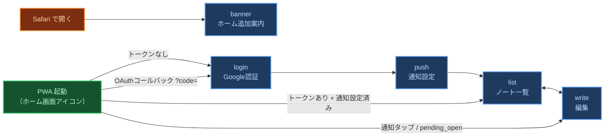
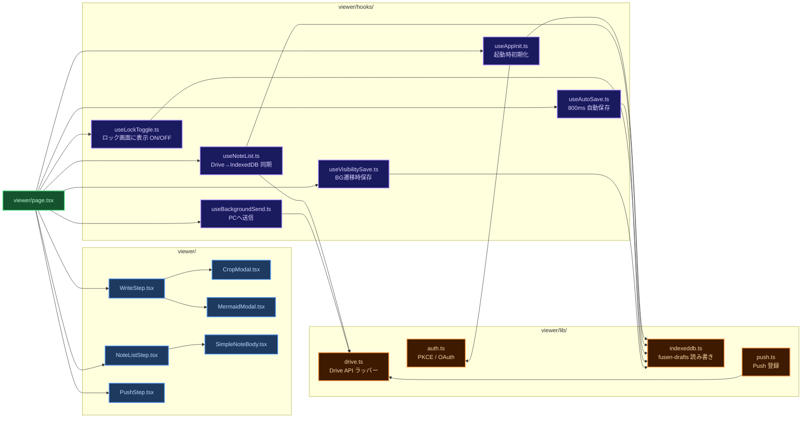
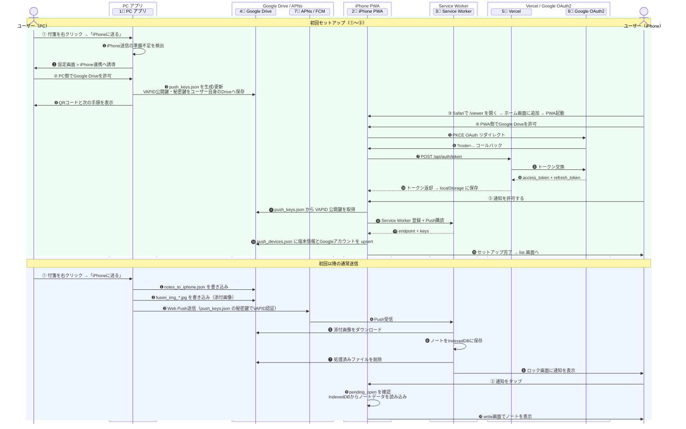
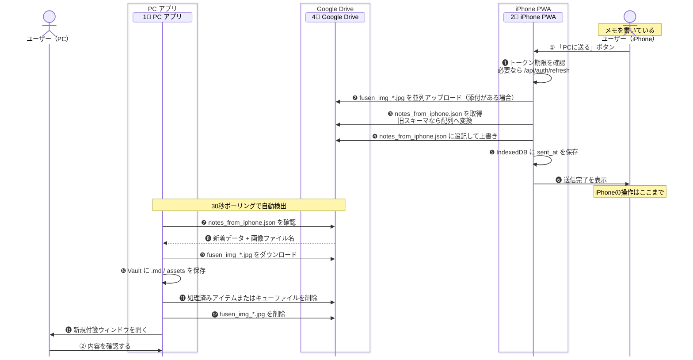
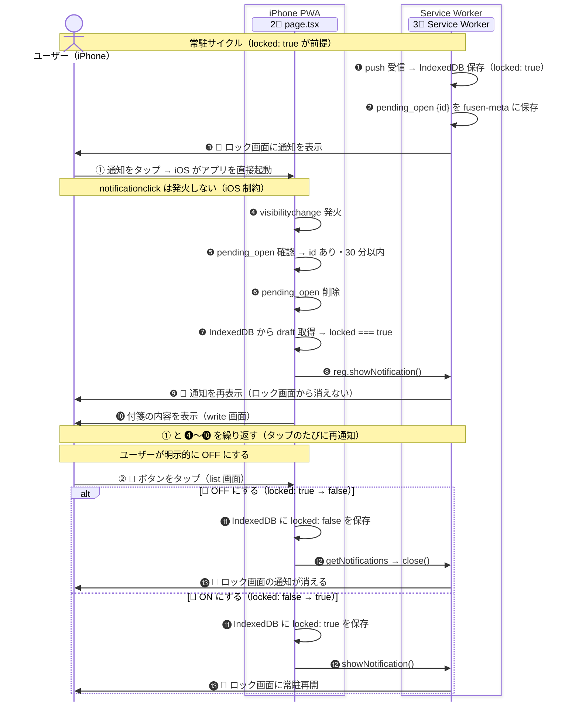
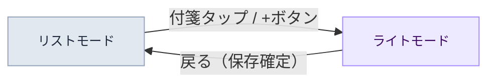

# 📱 003 クラウド同期・iPhone設計

<p class="lead-text">
画面構成・Service Worker・データ構造・データフロー
</p>

<p class="version-info">
設計書 v1.5 / 2026-05-06
</p>

---

## 1 画面構成

iPhone PWA は <code>step</code> state で切り替わる5画面の単一ページアプリです。

<Note type="success">
iPhone PWA は <code>page.tsx</code> 内の <code>step</code> state で表示画面を切り替える単一ページアプリ。
<strong>step の値は5種類：banner / login / push / list / write</strong>。
URLバーなしのネイティブアプリ風で動作する（PWA起動時）。
</Note>

### 1.1 各画面の役割

banner・login・push・list・write の5画面それぞれの表示条件と役割を説明します。

<!-- インストール案内 -->
<div class="group-label group-safari">インストール案内画面 — Safariで /viewer を開いたとき（PWAではない）</div>
<div class="screens-grid">
  <!-- banner -->
  <div class="phone">
    <div class="phone-frame">
      <div class="phone-notch"></div>
      <div class="phone-screen" style="background:#F2F2F7; display:flex; flex-direction:column; padding:8px; gap:5px; overflow-y:auto;">
        <div style="font-size:8px; font-weight:700; color:#111827;">ホーム画面に<br>追加してください</div>
        <div class="mock-step-card">STEP 1 — 共有をタップ</div>
        <div style="background:#e5e7eb; border-radius:4px; height:28px;"></div>
        <div class="mock-step-card">STEP 2 — ホーム画面に追加</div>
        <div style="background:#e5e7eb; border-radius:4px; height:28px;"></div>
        <div class="mock-step-card">STEP 3 — 追加をタップ</div>
        <div style="background:#e5e7eb; border-radius:4px; height:28px;"></div>
        <div style="font-size:6px; color:#d1d5db; text-align:center; margin-top:2px;">app 2.9.x</div>
      </div>
    </div>
    <div class="screen-name">banner</div>
    <div class="screen-cond">step: banner</div>
  </div>
  <dl class="screen-def">
    <dt>表示条件</dt>
    <dd>SafariでURLを直接開いた（PWAではない）</dd>
    <dt>目的</dt>
    <dd>ホーム画面への追加手順を案内する。初回インストール時のみ使う。</dd>
    <dt>バージョン表示</dt>
    <dd><code>app x.x.x</code> のみ。ServiceWorkerは表示しない。</dd>
    <dt>備考</dt>
    <dd>skipWaiting導入済みのため、バージョンアップ目的で開く必要はない。</dd>
  </dl>
</div>

<!-- PWA画面 -->
<div class="group-label group-pwa">PWA画面 — ホーム画面アイコンから起動（URLバーなし・アプリとして動作）</div>
<div class="screens-grid">
  <!-- login -->
  <div class="phone">
    <div class="phone-frame">
      <div class="phone-notch"></div>
      <div class="phone-screen" style="display:flex; flex-direction:column; align-items:center; justify-content:center; gap:6px; padding:8px;">
        <div class="mock-title" style="font-size:7px;">俺の付箋</div>
        <div class="mock-text">Googleでログイン<br>してください</div>
        <div class="mock-btn">Googleでログイン</div>
        <div class="phone-ver">app 2.9.x / ServiceWorker 2.9.x</div>
      </div>
    </div>
    <div class="screen-name">ログイン</div>
    <div class="screen-cond">step: login</div>
  </div>
  <dl class="screen-def">
    <dt>表示条件</dt>
    <dd>アクセストークンがない（初回 or 有効期限切れ）</dd>
    <dt>操作</dt>
    <dd>「Googleでログイン」ボタン → Google OAuth（PKCE）→ トークン取得後 push へ遷移</dd>
    <dt>バージョン表示</dt>
    <dd><code>app x.x.x / ServiceWorker x.x.x</code>（右下固定）</dd>
  </dl>
  <!-- push -->
  <div class="phone">
    <div class="phone-frame">
      <div class="phone-notch"></div>
      <div class="phone-screen" style="display:flex; flex-direction:column; align-items:center; justify-content:center; gap:6px; padding:8px;">
        <div class="step-badge">セットアップ</div>
        <div class="mock-text">プッシュ通知を<br>有効にしてください</div>
        <div class="mock-btn">通知を許可する</div>
        <div class="phone-ver">app 2.9.x / ServiceWorker 2.9.x</div>
      </div>
    </div>
    <div class="screen-name">通知設定</div>
    <div class="screen-cond">step: push</div>
  </div>
  <dl class="screen-def">
    <dt>表示条件</dt>
    <dd>トークンあり + <code>viewer_push_done</code> が未設定</dd>
    <dt>操作</dt>
    <dd>「通知を許可する」→ OS権限ダイアログ → 許可後 list へ遷移。<code>viewer_push_done=true</code> を localStorage に保存。</dd>
    <dt>バージョン表示</dt>
    <dd><code>app x.x.x / ServiceWorker x.x.x</code>（右下固定）</dd>
  </dl>
  <!-- list -->
  <div class="phone">
    <div class="phone-frame">
      <div class="phone-notch"></div>
      <div class="phone-screen" style="background:#F2F2F7; display:flex; flex-direction:column; padding:6px; gap:4px;">
        <div class="mock-header">
          <span style="font-size:9px; font-weight:700; color:#111827;">メモ</span>
          <span style="font-size:9px; color:#111827;">＋</span>
        </div>
        <div class="mock-card"><div class="mock-dot mock-dot-blue"></div><span style="font-size:6px;">大事なメモ</span><span style="font-size:8px; margin-left:auto;">🔔</span></div>
        <div class="mock-card"><div class="mock-dot"></div><span style="font-size:6px;">買い物リスト</span><span style="font-size:8px; margin-left:auto;">🔕</span></div>
        <div class="mock-card"><div class="mock-dot"></div><span style="font-size:6px;">アイデアメモ</span><span style="font-size:8px; margin-left:auto;">🔕</span></div>
        <div class="phone-ver">app 2.9.x / ServiceWorker 2.9.x</div>
      </div>
    </div>
    <div class="screen-name">メモ一覧</div>
    <div class="screen-cond">step: list</div>
  </div>
  <dl class="screen-def">
    <dt>表示条件</dt>
    <dd>トークンあり + <code>viewer_push_done=true</code>（通常の起動時）</dd>
    <dt>操作</dt>
    <dd>＋ → write（新規）<br>メモタップ → write（編集）<br>🔔 → ロック画面に表示 ON/OFF<br>🗑️ → メモ削除</dd>
    <dt>バージョン表示</dt>
    <dd><code>app x.x.x / ServiceWorker x.x.x</code>（右下固定）</dd>
  </dl>
  <!-- write -->
  <div class="phone">
    <div class="phone-frame">
      <div class="phone-notch"></div>
      <div class="phone-screen" style="display:flex; flex-direction:column; padding:6px; gap:4px;">
        <div class="mock-header">
          <span style="font-size:7px; color:#3b82f6;">← 戻る</span>
          <span style="font-size:6px; color:#3b82f6;">PCへ送る</span>
        </div>
        <div class="mock-input">大事なメモ...</div>
        <div style="flex:1; background:#f9fafb; border-radius:4px;"></div>
        <div style="display:flex; gap:3px; padding:3px 2px;">
          <div class="mock-sub-btn">iPhoneに置く</div>
          <div class="mock-tool-btn">📷</div>
        </div>
        <div class="mock-toolbar">
          <div class="mock-tool-btn">B</div>
          <div class="mock-tool-btn">H1</div>
          <div class="mock-tool-btn">≡</div>
        </div>
        <div class="phone-ver">app 2.9.x / ServiceWorker 2.9.x</div>
      </div>
    </div>
    <div class="screen-name">編集</div>
    <div class="screen-cond">step: write</div>
  </div>
  <dl class="screen-def">
    <dt>表示条件</dt>
    <dd>① list からメモ選択・新規作成<br>② 通知タップ（notificationclick または pending_open）</dd>
    <dt>操作</dt>
    <dd>「PCへ送る」→ Drive経由でPC送信 → list へ<br>「iPhoneに置く」→ IndexedDBに下書き保存 → list へ<br>「← 戻る」→ list へ（保存なし）</dd>
    <dt>バージョン表示</dt>
    <dd><code>app x.x.x / ServiceWorker x.x.x</code>（右下固定）</dd>
  </dl>
</div>

### 1.2 起動時の遷移ルール

PWA起動時にどの画面から始まるかを決める4つのルールを定義します。


<p class="mermaid-caption">図 3-1　起動時の画面遷移ルール</p>

<p class="table-caption">表 1.2-1　起動時画面遷移ルール</p>

| No | 起動時の状態 | 遷移先 |
|:---|:---|:---|
| 1 | 非 standalone（Safariで開いた） | banner |
| 2 | URL に `?code=`（OAuthコールバック） | Vercel でトークン取得 → push |
| 3 | URL に `?note=`（通知タップで起動） | IndexedDB からノート読み込み → write |
| 4 | token あり・pending_open あり（30分以内） | IndexedDB からノート読み込み → write |
| 5 | token あり・`viewer_push_done=true` | list（通常起動） |
| 6 | token あり・push 未設定 | push（通知セットアップ） |
| 7 | token なし | login |

<Note type="warning">
<strong>pending_open とは：</strong>iOS では通知タップ時に <code>notificationclick</code> が発火しないケースがある。
その補完として SW は Push 受信時に <code>fusen-meta</code>（IndexedDB）へノート ID を記録する。
次回 PWA 起動時に <code>useAppInit</code> がこれを読んで、対象ノートを write で自動表示する。
</Note>

---

## 2 モジュール構造

フロントエンド・Service Worker・Vercel API の3層構成です。

### 2.1 フロントエンド（TypeScript / React）

画面を構成するコンポーネント・フックの依存関係を示します。
また、図には現れない共通ユーティリティファイルも以下の表に一覧します。

<p class="table-caption">表 2.1-1　共通ユーティリティ（viewer/ 配下）</p>
<table class="module-table" style="font-size:12px; margin-bottom: 16px;">
  <thead>
    <tr><th style="width:40px;text-align:center">No</th><th style="width:160px">ファイル名</th><th>役割</th></tr>
  </thead>
  <tbody>
    <tr><td style="text-align:center;color:#94a3b8;font-weight:700">1</td><td><code>types.ts</code></td><td>フロントエンド全体で共有する型定義（<code>DraftRecord</code> 等）</td></tr>
    <tr><td style="text-align:center;color:#94a3b8;font-weight:700">2</td><td><code>utils.ts</code></td><td>依存を持たない汎用的なユーティリティ関数群</td></tr>
    <tr><td style="text-align:center;color:#94a3b8;font-weight:700">3</td><td><code>editor-helpers.ts</code></td><td>テキストエリア操作やタグ管理（localStorageとの連携）を担うヘルパー</td></tr>
  </tbody>
</table>


<p class="mermaid-caption">図 3-2　フロントエンドモジュール構成</p>

### 2.2 Service Worker（worker/index.js）

push受信・notificationclick等を処理するSWのイベントハンドラ5点を一覧します。

<p class="table-caption">表 2.2-1　SW イベントハンドラ一覧</p>

| No | イベント | 処理内容 |
|:---|:---|:---|
| 1 | `install` | `skipWaiting()` 呼び出し。新バージョンを即時有効化。 |
| 2 | `activate` | `clients.claim()` でページの制御を取得。SW バージョンをログに記録。 |
| 3 | `push` | ① Push ペイロード（title / body_rich / id）を取得<br>② `fusen-meta` からアクセストークンを取得<br>③ Drive から画像をダウンロード<br>④ `fusen-drafts` にノートを保存<br>⑤ Drive から画像ファイルを削除<br>⑥ `notes_to_iphone.json` から当該 ID を削除<br>⑦ `pending_open` を `fusen-meta` に記録<br>⑧ 既存の同 ID 通知を閉じてから新規通知を表示 |
| 4 | `notificationclick` | 通知をタップ → `locked` 確認 → true なら再通知・アプリを前面に出す。<br><strong style="color:#f59e0b">⚠️ iOS では発火しない（既知の制約）。</strong>タップ後の再通知は `page.tsx` の `pending_open` フローが代替。 |
| 5 | `message` | アプリからの通信を受信。`CLOSE_NOTIFICATION` で通知を閉じる、`GET_VERSION` で SW のバージョンを返す等の処理。 |

<Note type="warning">
<strong>ログ：</strong>SW の動作は全て <code>fusen-logs</code>（IndexedDB）に記録される。
PC の Chrome で PWA を開き、DevTools → Application → IndexedDB → fusen-logs で確認できる。
</Note>

### 2.3 サーバーサイド（Vercel API Routes）

この節は、主に開発者・保守担当向けです。iPhone PWA が Google Drive 用トークンを取得・更新するときに使う Vercel API エンドポイント2点を説明します。

<Note type="info">
<code>client_secret</code> は、開発者が Google Cloud Console で発行する「俺の付箋アプリが本物であることを Google に示すための秘密値」。
ユーザーに守ってもらうものではなく、開発者が守る。
iPhone PWA へ入れると端末上で読めてしまうため、Vercel のサーバー側だけに置く。
iPhone は Vercel 経由でトークン交換・更新を依頼し、Vercel はトークンを保存しない。
</Note>

<p class="table-caption">表 2.3-1　Vercel API Routes 一覧</p>

| No | ファイル | 役割 |
|:---|:---|:---|
| 1 | `app/api/auth/token/route.ts` | OAuth 認証コード → アクセストークン＋リフレッシュトークン交換。初回ログイン時のみ呼ばれる。 |
| 2 | `app/api/auth/refresh/route.ts` | リフレッシュトークン → 新しいアクセストークン取得。Drive API 呼び出し時にトークン期限切れを検出したら自動呼び出し。 |

#### 環境変数（Vercel）

Vercel の Environment Variables に設定する変数の一覧です。`.env` ファイルやコードにハードコードしないこと。

<p class="table-caption">表 2.3-2　Vercel 環境変数一覧</p>

| No | 変数名 | 公開範囲 | 取得元 | 用途 |
|:---|:---|:---|:---|:---|
| 1 | `GOOGLE_CLIENT_SECRET_PWA` | サーバー専用 | Google Cloud Console → 認証情報 → OAuth 2.0 クライアント（PWA用） → クライアント シークレット | 開発者が守る値。iPhone PWA が Google Drive 用トークンを取得・更新できるように、Vercel サーバーから Google へ提示する。iPhone PWA には入れない。端末上で読める場所に置くと、第三者が俺の付箋のアプリ名義で OAuth 処理を悪用する恐れがあるため。 |
| 2 | `NEXT_PUBLIC_GDRIVE_CLIENT_ID` | 公開可 | Google Cloud Console → 認証情報 → OAuth 2.0 クライアント（PWA用） → クライアント ID | iPhone PWA が Google OAuth フローを開始するために使う公開ID。ここでいう client はユーザー端末ではなく Google に登録した「俺の付箋アプリ」を指す。公開前提なので iPhone PWA に含めてよい。 |
| 3 | `DISCORD_WEBHOOK_URL` | サーバー専用 | Discord サーバー → チャンネル設定 → 連携サービス → Webhook → URL をコピー | PC 設定画面のフィードバック送信を Discord へ転送するために、Vercel サーバー側で使う。 |

<Note type="info">
<code>NEXT_PUBLIC_APP_VERSION</code> は Vercel への手動設定不要。<code>next.config.ts</code> がビルド時に <code>package.json</code> の <code>version</code> フィールドから自動設定する。
</Note>

<Note type="warning">
<code>GOOGLE_CLIENT_SECRET_PWA</code> は Vercel が「Needs Attention」と表示する場合がある。Google Cloud Console（APIとサービス → 認証情報 → 該当クライアント）でステータスが「有効」であれば実害なし。値が一致していれば無視してよい。
</Note>

---

## 3 データ構造

この節は、主に開発者・保守担当向けです。IndexedDB・localStorage・Google Drive の3か所に保存するデータと、障害時に確認する場所を定義します。

<Note type="success">
<strong>データの正：</strong>iPhone 画面に表示する付箋の唯一の保存先は <strong>IndexedDB（fusen-drafts）</strong>。
Drive は中継所（未処理キュー）に過ぎない。Drive に残っているものは「まだ処理していない」を意味する。処理済みは即削除。
</Note>

### 3.1 IndexedDB

PWA端末内に保存されるfusen-drafts・fusen-meta・fusen-logsの3ストアを定義します。

<div class="store-card store-idb" style="margin-bottom:16px">
  <h4 id="sec3-0-1">3.1.1 🗄 fusen-drafts（ノートデータ）</h4>
  <p class="table-caption">表 3-4　fusen-drafts スキーマ</p>
  <table class="module-table" style="font-size:11px">
    <thead><tr><th style="width:36px;text-align:center;white-space:nowrap">No</th><th style="width:120px">フィールド</th><th style="width:80px">型</th><th>用途・内容</th></tr></thead>
    <tbody>
      <tr><td style="text-align:center;color:#94a3b8;font-weight:700">1</td><td><code>id</code></td><td>string</td><td>主キー（UUID）</td></tr>
      <tr><td style="text-align:center;color:#94a3b8;font-weight:700">2</td><td><code>title</code></td><td>string</td><td>ノートタイトル</td></tr>
      <tr><td style="text-align:center;color:#94a3b8;font-weight:700">3</td><td><code>body</code></td><td>string</td><td>本文（Markdown）</td></tr>
      <tr><td style="text-align:center;color:#94a3b8;font-weight:700">4</td><td><code>images</code></td><td>Object[]</td><td>添付画像（<code>{ fileName: string, blob: Blob }[]</code>）</td></tr>
      <tr><td style="text-align:center;color:#94a3b8;font-weight:700">5</td><td><code>tags</code></td><td>string[]</td><td>付与されたタグの配列</td></tr>
      <tr><td style="text-align:center;color:#94a3b8;font-weight:700">6</td><td><code>locked</code></td><td>boolean</td><td>ロック画面に表示が ON なら true</td></tr>
      <tr><td style="text-align:center;color:#94a3b8;font-weight:700">7</td><td><code>created_at</code></td><td>string</td><td>作成日時（JST ISO 8601）</td></tr>
      <tr><td style="text-align:center;color:#94a3b8;font-weight:700">8</td><td><code>sent_at</code></td><td>string</td><td>送信日時（未送信時は undefined）</td></tr>
      <tr><td style="text-align:center;color:#94a3b8;font-weight:700">9</td><td><code>received_pc</code></td><td>boolean</td><td>PC 側が受信済みかどうか</td></tr>
    </tbody>
  </table>
</div>
<div class="store-grid">
  <div class="store-card store-idb">
    <h4 id="sec3-0-2">3.1.2 🗄 fusen-meta（メタ情報）</h4>
    <p class="table-caption">表 3-5　fusen-meta スキーマ</p>
    <table class="module-table" style="font-size:11px">
      <thead><tr><th style="width:36px;text-align:center">No</th><th style="width:130px">キー</th><th>用途・内容</th></tr></thead>
      <tbody>
        <tr><td style="text-align:center;color:#94a3b8;font-weight:700">1</td><td><code>access_token</code></td><td>Google Drive アクセストークン（SW が参照）</td></tr>
        <tr><td style="text-align:center;color:#94a3b8;font-weight:700">2</td><td><code>pending_open</code></td><td>次回起動時に開くノートの情報。<code>{ id: string, t: number }</code></td></tr>
      </tbody>
    </table>
  </div>
  <div class="store-card store-idb">
    <h4 id="sec3-0-3">3.1.3 🗄 fusen-logs（デバッグログ）</h4>
    <p class="table-caption">表 3-6　fusen-logs スキーマ</p>
    <table class="module-table" style="font-size:11px">
      <thead><tr><th style="width:36px;text-align:center">No</th><th style="width:80px">フィールド</th><th>用途・内容</th></tr></thead>
      <tbody>
        <tr><td style="text-align:center;color:#94a3b8;font-weight:700">1</td><td><code>t</code></td><td>タイムスタンプ（JST）</td></tr>
        <tr><td style="text-align:center;color:#94a3b8;font-weight:700">2</td><td><code>msg</code></td><td>ログメッセージ</td></tr>
      </tbody>
    </table>
  </div>
</div>

### 3.2 localStorage

セッション管理に使うlocalStorageのキーと値の一覧です。

<div class="store-card store-ls" style="max-width:600px">
  <h4 id="sec3-0-4">3.2.1 🔑 認証・設定フラグ</h4>
  <p class="table-caption">表 3-7　localStorage キー一覧</p>
  <table class="module-table" style="font-size:11px">
    <thead><tr><th style="width:44px;text-align:center">No</th><th>キー</th><th>用途・内容</th></tr></thead>
    <tbody>
      <tr><td style="text-align:center;color:#94a3b8;font-weight:700">1</td><td><code>viewer_access_token</code></td><td>Google API アクセストークン</td></tr>
      <tr><td style="text-align:center;color:#94a3b8;font-weight:700">2</td><td><code>viewer_refresh_token</code></td><td>リフレッシュトークン（Vercel API 経由で更新）</td></tr>
      <tr><td style="text-align:center;color:#94a3b8;font-weight:700">3</td><td><code>viewer_expires_at</code></td><td>アクセストークンの有効期限（ms）</td></tr>
      <tr><td style="text-align:center;color:#94a3b8;font-weight:700">4</td><td><code>viewer_push_done</code></td><td><code>"true"</code> なら通知設定済み → list へ直行</td></tr>
      <tr><td style="text-align:center;color:#94a3b8;font-weight:700">5</td><td><code>pkce_verifier</code></td><td>OAuth PKCE の code_verifier（認証中のみ存在）</td></tr>
      <tr><td style="text-align:center;color:#94a3b8;font-weight:700">6</td><td><code>pending_note</code></td><td>PKCE 認証後に自動で開くノート ID</td></tr>
      <tr><td style="text-align:center;color:#94a3b8;font-weight:700">7</td><td><code>viewer_device_id</code></td><td>Web Push 用のクライアント識別子</td></tr>
      <tr><td style="text-align:center;color:#94a3b8;font-weight:700">8</td><td><code>fusen_known_tags</code></td><td>過去に入力したタグの履歴（サジェスト用）</td></tr>
    </tbody>
  </table>
</div>

### 3.3 Google Drive ファイル

PCとiPhone間の中継、および Web Push 設定に使う Drive ファイルの種類と書き込み/削除責務を説明します。

<Note type="success">
<strong>Drive 設計原則：</strong>
<code>notes_to_iphone.json</code>、<code>notes_from_iphone.json</code>、<code>fusen_img_*</code> は未処理キュー。処理済みは即削除。
<code>push_keys.json</code> と <code>push_devices.json</code> は Web Push 用の設定ファイルなので、セットアップ後も残す。
</Note>

<p class="table-caption">表 3.3-1　Google Drive ファイル一覧</p>
<table class="module-table" style="font-size:12px; table-layout: fixed;">
  <thead>
    <tr>
      <th style="width:40px;text-align:center">No</th>
      <th style="width:180px">ファイル名</th>
      <th style="width:140px">書き込み</th>
      <th style="width:140px">読み取り・削除</th>
      <th>用途</th>
    </tr>
  </thead>
  <tbody>
    <tr>
      <td style="text-align:center;color:#94a3b8;font-weight:700">1</td>
      <td><code>notes_to_iphone.json</code></td>
      <td>PC（gdrive.rs）</td>
      <td>iPhone SW<br>（push受信時）</td>
      <td>PC から iPhone へメモ本文と添付画像名を渡すために、未処理ノートを一時保存する。SW が受信して IndexedDB に保存後、当該 ID を除いて書き戻す（または全削除）する。</td>
    </tr>
    <tr>
      <td style="text-align:center;color:#94a3b8;font-weight:700">2</td>
      <td><code>notes_from_iphone.json</code></td>
      <td>iPhone<br>（useBackgroundSend）</td>
      <td>PC（gdrive.rs<br>30秒ポーリング）</td>
      <td>iPhone から PC へメモ本文と添付画像名を渡すために、未処理ノートを一時保存する。PC 受信後は処理済みアイテムを除いた残りのみ書き戻す。</td>
    </tr>
    <tr>
      <td style="text-align:center;color:#94a3b8;font-weight:700">3</td>
      <td><code>fusen_img_*.jpg</code></td>
      <td>iPhone<br>または PC</td>
      <td>受信側が処理後に削除</td>
      <td>Push ペイロードや JSON に大きな画像バイナリを直接入れないために、添付画像だけを一時ファイルとして保存する。受信側が IndexedDB または PC の <code>assets/</code> に保存後、削除する。</td>
    </tr>
    <tr>
      <td style="text-align:center;color:#94a3b8;font-weight:700">4</td>
      <td><code>push_keys.json</code></td>
      <td>PC（webpush.rs）</td>
      <td>iPhone（lib/push.ts）が<br>公開鍵を読む<br>PC（webpush.rs）が<br>秘密鍵を読む</td>
      <td>PC が「このユーザーの通知送信者である」と Push Service に示すために、VAPID 鍵ペアを保存する。公開鍵は iPhone の Push 購読に使い、秘密鍵は PC が Web Push 送信時の VAPID JWT に署名するために使う。秘密鍵がないと APNs / Push Service が送信者を検証できず、通知送信できない。</td>
    </tr>
    <tr>
      <td style="text-align:center;color:#94a3b8;font-weight:700">5</td>
      <td><code>push_devices.json</code></td>
      <td>iPhone（lib/push.ts）<br>が upsert</td>
      <td>PC（webpush.rs）が<br>全端末へ Push 送信</td>
      <td>PC が登録済み iPhone へ Push を送るために、端末ごとの <code>device_id</code> / <code>endpoint</code> / 暗号化鍵を保存する。複数端末へ送るために、端末一覧として保持する。</td>
    </tr>
  </tbody>
</table>

### 3.3.1 Drive JSON データ構成

表 3.3-1 に記載した各 JSON ファイルの構造は、この節に示す。
Drive 上の JSON は、以下の構成を基本とする。
実装上の参照元は、PC 側が `src-tauri/src/lib.rs` / `src-tauri/src/webpush.rs` / `src-tauri/src/gdrive.rs`、iPhone 側が `app/viewer/lib/push.ts` / `app/viewer/hooks/useBackgroundSend.ts` / `worker/index.js`。

<p class="table-caption">表 3.3-2　notes_to_iphone.json（PC → iPhone 未処理キュー）</p>

| No | フィールド | 型 | 必須 | 用途・内容 |
|:---|:---|:---|:---:|:---|
| 1 | `items` | `Object[]` | ○ | 未処理ノートの配列。最大20件を保持 |
| 2 | `items[].id` | `string` | ○ | ノートID（UUID） |
| 3 | `items[].title` | `string` | ○ | 通知・表示タイトル |
| 4 | `items[].body` | `string` | ○ | Markdown本文。画像は `fusen_img_*` 参照 |
| 5 | `items[].tags` | `string[]` | ○ | タグ一覧 |
| 6 | `items[].sent_at` | `string` | ○ | PC送信時刻 |
| 7 | `items[].received_at` | `null` | △ | 現行ソースが互換目的で出力している残項目。処理判定には使わない |

```json
{
  "items": [
    {
      "id": "uuid",
      "title": "買い物",
      "body": "牛乳\n",
      "tags": ["shopping"],
      "sent_at": "2026-05-05T12:00:00Z",
      "received_at": null
    }
  ]
}
```

<p class="table-caption">表 3.3-3　notes_from_iphone.json（iPhone → PC 未処理キュー）</p>

| No | フィールド | 型 | 必須 | 用途・内容 |
|:---|:---|:---|:---:|:---|
| 1 | `items` | `Object[]` | ○ | 未処理ノートの配列 |
| 2 | `items[].id` | `string` | ○ | ノートID（UUID） |
| 3 | `items[].title` | `string` | ○ | ノートタイトル |
| 4 | `items[].body` | `string` | ○ | Markdown本文。画像は `fusen_img_*` 参照 |
| 5 | `items[].sent_at` | `string` | ○ | iPhone送信時刻 |
| 6 | `items[].tags` | `string[]` | ○ | タグ一覧 |

```json
{
  "items": [
    {
      "id": "uuid",
      "title": "外出先メモ",
      "body": "帰ったら確認\n",
      "sent_at": "2026-05-05T12:00:00+09:00",
      "tags": []
    }
  ]
}
```

<p class="table-caption">表 3.3-4　push_keys.json（VAPID 鍵）</p>

| No | フィールド | 型 | 必須 | 用途 |
|:---|:---|:---|:---:|:---|
| 1 | `public_key_b64url` | `string` | ○ | iPhone が Push Service に「この送信者の通知を受け取る端末」として登録するために、`pushManager.subscribe()` の `applicationServerKey` に渡す |
| 2 | `private_key_b64url` | `string` | ○ | PC が Web Push 送信者であることを証明するために、VAPID JWT に署名する。署名結果は `Authorization: vapid t=...,k=...` として APNs / Push Service に送る |
| 3 | `subject` | `string` | ○ | Push Service が送信者の連絡先を把握するために、VAPID JWT の `sub` に入れる。現行値は `mailto:ore-no-fusen@example.com` |

```json
{
  "public_key_b64url": "BASE64URL_PUBLIC_KEY",
  "private_key_b64url": "BASE64URL_PRIVATE_KEY",
  "subject": "mailto:ore-no-fusen@example.com"
}
```

<Note type="warning">
<code>push_keys.json</code> には秘密鍵が含まれるため、共有・公開してはいけない。
</Note>

<Note type="info">
<strong>秘密鍵を使う理由：</strong>
PC は Web Push を送るとき、通知先端末の <code>endpoint</code> 宛てに暗号化済みペイロードを POST する。
このとき <code>private_key_b64url</code> で VAPID JWT に署名し、対応する <code>public_key_b64url</code> と一緒に <code>Authorization</code> ヘッダーへ入れる。
APNs / Push Service はこの署名を検証し、iPhone が購読時に登録した公開鍵と一致する送信者からの通知として扱う。
</Note>

<Note type="warning">
<strong>秘密鍵がない場合：</strong>
PC は正しい VAPID 署名を作れない。
その結果、Push Service が送信者を検証できず、PC は iPhone へ Web Push を送れない。
<code>notes_to_iphone.json</code> だけ Drive に残っても、iPhone の Service Worker を起こす通知トリガーが届かないため、受信は list 画面を開いたときの Drive 同期などフォールバック頼みになる。
</Note>

<Note type="info">
<strong>Drive に置く理由：</strong>
このアプリはユーザー自身の Google Drive を PC と iPhone の共有領域として使う。
<code>push_keys.json</code> を Drive に置くことで、PC が生成した公開鍵を iPhone が取得して購読登録でき、別PCでも同じユーザーの鍵を取得して同じ iPhone 宛てに送信できる。
保存先はアプリが作成・利用する Drive ファイルであり、OAuth スコープは <code>drive.file</code> に限定する。
つまりアプリが作ったファイルをユーザー本人の Drive 内で共有する設計であり、外部サーバーや他ユーザーに秘密鍵を預ける設計ではない。
</Note>

<p class="table-caption">表 3.3-5　push_devices.json（Web Push 宛先一覧）</p>

| No | フィールド | 型 | 必須 | 用途・内容 |
|:---|:---|:---|:---:|:---|
| 1 | `devices` | `Object[]` | ○ | 登録済み端末の配列 |
| 2 | `devices[].device_id` | `string` | ○ | 端末ID。iPhone PWA が `localStorage` に保持 |
| 3 | `devices[].endpoint` | `string` | ○ | APNs / Push Service の送信先URL |
| 4 | `devices[].keys.p256dh` | `string` | ○ | Push 暗号化用の公開鍵 |
| 5 | `devices[].keys.auth` | `string` | ○ | Push 暗号化用の認証シークレット |
| 6 | `devices[].registered_at` | `string` | ○ | 登録時刻 |
| 7 | `devices[].device_name` | `string` | △ | 表示用端末名 |
| 8 | `devices[].google_account_email` | `string` | △ | Drive接続アカウントのメール |
| 9 | `devices[].google_account_name` | `string` | △ | Drive接続アカウント名 |
| 10 | `devices[].google_account_photo` | `string` | △ | Drive接続アカウントの画像URL |

```json
{
  "devices": [
    {
      "device_id": "uuid",
      "endpoint": "https://web.push.apple.com/...",
      "keys": {
        "p256dh": "BASE64URL_P256DH",
        "auth": "BASE64URL_AUTH"
      },
      "registered_at": "2026-05-05T12:00:00+09:00",
      "device_name": "iPhone",
      "google_account_email": "user@example.com"
    }
  ]
}
```

<Note type="info">
<code>push_devices.json</code> は旧スキーマ <code>{ endpoint, keys, created_at }</code> が残っていても、iPhone 側と PC 側で新スキーマへ読み替える。
</Note>

---

## 4 データフロー

PC→iPhone の初回セットアップ、初回以降の通常送信、iPhone→PC送信、通知ON/OFFのシーケンス図を示します。

### 4.1 PC → iPhone 初回セットアップと通常送信

初回は、ユーザーがPCで「iPhoneに送る」を押したことをきっかけに設定画面へ誘導し、PC側でGoogle Drive接続と `push_keys.json` の準備を行ってから、iPhone PWAをセットアップします。
初回以降は、PCの「iPhoneに送る」操作だけで通知が届きます。

<Note type="info">
シーケンス図では、<strong>①②③</strong> はユーザーが実施する操作、<strong>❶❷❸</strong> はアプリ・Drive・Service Worker が自動実行する処理を表します。
</Note>


<p class="mermaid-caption">図 3-3　PC → iPhone 初回セットアップと通常送信シーケンス</p>

### 4.2 PC → iPhone 受信の補足

図 3-3 の初回セットアップで `push_keys.json` と `push_devices.json` が準備済みであれば、以降はPC側の「iPhoneに送る」操作だけで送信できます。

- `push_keys.json`：PC側が作成するVAPID鍵。iPhoneは公開鍵を使ってPush購読し、PCは秘密鍵を使ってWeb Pushを送信する。
- `push_devices.json`：iPhone側が作成・更新する通知先デバイス一覧。PCはこの一覧を見て送信先を決める。
- `notes_to_iphone.json`：PCからiPhoneへ渡す未処理キュー。Service Workerが受信後に処理済みファイルを削除する。

<Note type="info">
<strong>body_rich：</strong>Markdown 本文（画像タグ含む）は Push ペイロードに直接含まれる。
Drive へのフェッチは画像バイナリのダウンロードのみ。JSON の再取得は不要。
</Note>

<Note type="warning">
<strong>ユーザー体験の全体像（<a href="./000_REQUIREMENTS#sec9-4-iphoneロック画面常駐体験">REQ_IP_05</a>）：</strong>
図 3-3 の通常送信は、送信〜初回表示までを示す。通知をタップした後も再通知されロック画面から消えない体験、および OFF 操作は 4.4 を参照。
</Note>

### 4.3 iPhone → PC 送信（ユーザー体験 + 内部処理）

iPhoneのwrite画面で「PCに送る」を押した瞬間から、PCに新しい付箋が開くまでの全体フロー。


<p class="mermaid-caption">図 3-4　iPhone → PC 送信シーケンス</p>

<Note type="success">
<strong>「iPhoneに置いておく」との違い：</strong>Drive を使わない。テキスト＋画像を IndexedDB のみに保存。PC への送信は発生しない。
</Note>

### 4.4 ロック画面に表示 ON/OFF と再通知サイクル（<a href="./000_REQUIREMENTS#sec9-4-iphoneロック画面常駐体験">REQ_IP_05</a>）

「消す意思がないかぎりロック画面から消えない」体験を実現する ON/OFF 操作と、タップ後の再通知サイクル。
シーケンス図では、<strong>①②③</strong> はユーザーが実施する操作、<strong>❶❷❸</strong> は PWA・Service Worker・IndexedDB が自動実行する処理を表します。

<Note type="warning">
<strong>iOS の制約：</strong><code>notificationclick</code> イベントは iOS では発火しない（既知の仕様制約）。
そのため「タップ → 再通知」を SW で直接処理できない。
代わりに push 受信時に <code>pending_open</code> を記録しておき、
アプリ復帰時に <code>page.tsx</code> が <code>locked: true</code> を確認して再通知する。
</Note>

<div class="seq-small">


<p class="mermaid-caption">図 3-5　ロック画面常駐サイクル（ON/OFF と再通知の実装フロー）</p>
</div>

<Note type="info">
<strong>pending_open の役割：</strong>SW は push 受信時に通知を表示する直前に
<code>fusen-meta</code> へ <code>{id, t}</code> を保存する。
これが「直近の通知 ID の痕跡」となり、アプリ復帰時に
<code>page.tsx</code> が「通知からの起動である」と判断できる唯一の根拠になる。
30 分で失効。読んだら即削除。
</Note>

<Note type="success">
<strong>locked の初期値：</strong>push 受信時の IndexedDB 保存で <code>locked: true</code> を設定する（SW の <code>saveToIndexedDB</code>）。
ユーザーが 🔔 ボタンを押す前から ①〜③ のサイクルが自動で有効になる。
</Note>

<Note type="warning">
<strong>通知を消せるのは SW だけ：</strong>表示済みの通知を非表示にするには
<code>registration.getNotifications()</code> で取得して <code>n.close()</code> を呼ぶ必要がある。
<code>useLockToggle</code> は SW へのメッセージ送信でこれを実現する。
</Note>

---

## 5 UI インタラクション

<Note type="info">
iPhone PWA は「リストモード」と「ライトモード」の 2 画面構成をベースに、タップ・アイコン操作で全機能にアクセスできる。
</Note>

### 5.1 画面モード定義

リスト・ライトの 2 モードとその遷移条件を定義します。

<p class="table-caption">表 5.1-1　画面モード定義</p>

| No | モード | 状態 | 遷移トリガー |
|:---|:---|:---|:---|
| 1 | **リストモード** | Drive から同期した付箋を一覧表示している状態 | アプリ起動後の初期画面 |
| 2 | **ライトモード** | 1 枚の付箋を全画面で編集している状態（800ms 自動保存） | 付箋タップ or ＋ボタン |


<p class="mermaid-caption">図 3-6　画面モード遷移図</p>

### 5.2 各モードの操作一覧

<p class="table-caption">表 3-10　リストモードの操作</p>

| No | 操作 | 対象 | 結果 |
|:---|:---|:---|:---|
| 1 | タップ | 付箋アイテム | ライトモードへ遷移 |
| 2 | 🔔 タップ | ロック画面に表示ボタン | `locked` フラグの ON/OFF 切り替え |
| 3 | 🗑️ タップ | 削除ボタン | 確認ダイアログ → Drive から削除 |
| 4 | ＋ タップ | 新規ボタン | 空のライトモードへ遷移 |

<p class="table-caption">表 3-11　ライトモードの操作</p>

| No | 操作 | 対象 | 結果 |
|:---|:---|:---|:---|
| 1 | 文字入力 | エディタ | 800ms debounce で自動保存 |
| 2 | 画像貼り付け | エディタ | IndexedDB に保存・プレビュー表示 |
| 3 | ← タップ | 戻るボタン | リストモードへ遷移（保存確定） |

### 5.3 インタラクション・マトリックス

<p class="table-caption">表 5.3-1　インタラクション・マトリックス</p>

| No | 操作 | リストモード | ライトモード |
|:---|:---|:---|:---|
| 1 | タップ | ライトモードへ | - |
| 2 | 🔔 | locked ON/OFF | - |
| 3 | 🗑️ | 削除確認ダイアログ | - |
| 4 | 文字入力 | - | 自動保存 |
| 5 | ← 戻る | - | リストモードへ |

---

## 6 機能一覧

画面ごとの機能と、各機能の設計意図を記します。

### 6.1 メモ一覧画面（list）

<p class="table-caption">表 6.1-1　メモ一覧画面の機能</p>

| No | 機能 | 設計意図・工夫 |
|:---|:---|:---|
| 1 | Drive → IndexedDB 同期 | 一覧を開くたびに `notes_to_iphone.json` を Drive から取得し、ローカルにない新着ノートを IndexedDB に取り込む。取り込み後は Drive ファイルを削除（Drive = 未処理キュー）。Drive 失敗時は IndexedDB だけで一覧表示を続ける（フォールセーフ） |
| 2 | 画像サムネイル | 添付画像がある場合、IndexedDB の Blob から `URL.createObjectURL()` で URL を生成してサムネイルを表示。アンマウント時に `URL.revokeObjectURL()` で解放する |
| 3 | ステータスバッジ | draft（下書き）/ sent（PC送信済み）/ PC受信 の3状態を `sent_at` フィールドの有無と `received_pc` フラグで判定して色分け表示する |
| 4 | 相対時間表示 | `created_at` から「3分前」「1時間前」「昨日」の形式に変換（`formatRelativeTime()`）。 数字と絶対時刻を並べるより一目で新鮮度がわかる |
| 5 | 🔔/🔕 ロック画面常駐 | 後述（6.2）|
| 6 | 🗑️ 削除 | IndexedDB から削除後、Drive 上の同 ID ファイルも削除する |
| 7 | ＋ 新規作成 | 新しい下書き ID を `crypto.randomUUID()` で生成し write 画面へ遷移 |
| 8 | 🔔 デバイス再登録（フッター） | `silentReRegisterIfNeeded()` を呼び出し、`push_devices.json` に自デバイスが存在しない場合のみ静かに再登録する。既存デバイスがいれば何もしない |

### 6.2 ロック画面常駐（🔔）

このアプリの核心機能。「消す意思がないかぎり、ロック画面から消えない」体験を実現する。

<p class="table-caption">表 6.2-1　ロック画面常駐の仕組みと設計意図</p>

| No | 観点 | 設計意図・工夫 |
|:---|:---|:---|
| 1 | 通知表示の方式 | iOS ではメインスレッドの `new Notification()` が動かない。`navigator.serviceWorker.ready` → `reg.showNotification()` を使う。これが iOS で通知を出せる唯一の方法 |
| 2 | 重複防止 | `reg.getNotifications()` で既存通知を取得し、同じ `data.id` を持つものをすべて `n.close()` してから新規通知を表示する |
| 3 | タイトル・本文の生成 | `# タイトル` 行があれば it を通知タイトルに。なければ本文冒頭20文字をタイトルに使う。本文から画像タグ `` を正規表現で除去してから40〜60文字を表示する |
| 4 | 楽観的更新 | ボタンを押した瞬間に UI の 🔔/🔕 を切り替える。SW 操作や IndexedDB 書き込みに失敗した場合のみロールバックする。ユーザーに「レスポンスが遅い」と感じさせない |
| 5 | 通知権限の動的確認 | `Notification.permission === 'default'` なら許可ダイアログを表示。`denied` なら UI を元に戻してエラーを表示する |
| 6 | 通知を消す権限 | ロック解除時に `reg.active?.postMessage({ type: 'CLOSE_NOTIFICATION', tag })` で SW に通知クローズを依頼する。メインスレッドは通知を直接閉じられない |
| 7 | locked フラグの永続化 | `locked: true/false` を IndexedDB に書き込む。次回 Push 受信時に SW がこの値を参照して再通知を行うかどうかを決める |
| 8 | 効果音 | ON 時は `bell_on.wav`、OFF 時は `bell_off.wav` を `Audio` API で再生。操作の結果をユーザーが音で確認できる |

### 6.3 メモ編集画面（write）

<p class="table-caption">表 6.3-1　メモ編集画面の機能</p>

| No | 機能 | 設計意図・工夫 |
|:---|:---|:---|
| 1 | contenteditable エディタ | `contentEditable="true"` の `div` で実装。React の `value/onChange` モデルを使わず DOM を直接操作。`serializeEditor()` が HTML → Markdown 形式に変換する |
| 2 | 3秒自動保存 | 入力のたびにタイマーをリセット。3秒間入力がなければ IndexedDB に保存（`useAutoSave`）。Drive は使わない。ネットワーク不要・オフライン動作 |
| 3 | バックグラウンド遷移時の強制保存 | `visibilitychange` で非表示になった瞬間にも保存（`useVisibilitySave`）。アプリを閉じてもデータが消えない |
| 4 | 📷 画像添付 | ファイル選択 → `CropModal` でトリミング → IndexedDB に Blob 保存 → `buildImageFileName()` でファイル名生成 → カーソル位置に `` を挿入。PCへ送るときに Drive に実際にアップロードされる |
| 5 | 🔷 Mermaid | `MermaidModal` でフローチャートのコードを書いて確定するとエディタに挿入される |
| 6 | ☑ チェックボックス | カーソルのある行を `data-checkbox-line` 属性を持つ `<span>` に変換（再押しで解除）。行頭が IMG ノードの場合は次の兄弟ノードに処理を移す特殊ケース対応あり |
| 7 | 🏷️ タグ | タグバーを展開。Enter または Space で確定。過去に入力したタグを `localStorage（fusen_known_tags）` から自動サジェスト。送信時に `mergeKnownTags()` で履歴に追加 |
| 8 | ← 一覧に戻る | 内容がある場合は IndexedDB に下書き保存してから list 画面へ遷移。保存はサイレントに行われ、確認ダイアログは不要 |
| 9 | 「iPhoneに置いておく」 | Drive を一切使わず IndexedDB のみに保存。ネットワーク不要。削除するまで端末に残り続ける |
| 10 | 「PCへ送る」 | 後述（6.4）|
| 11 | 🎬 VideoDrop | `mp4` / `mov` を選択し、Drive 経由でPCへ送る。PWA側は動画管理をせず、PC側で `assets/video/` に保存されたパスを付箋本文に記録する |

### 6.4 「PCへ送る」

<p class="table-caption">表 6.4-1　PCへ送る の処理ステップ</p>

| No | ステップ | 設計意図・工夫 |
|:---|:---|:---|
| 1 | ① トークン有効期限確認 | `viewer_expires_at` と `Date.now()` を比較。**期限5分前**を切っていたら送信前に Vercel `/api/auth/refresh` を呼んでトークンを更新する。送信中に突然期限切れにならないための先読み更新 |
| 2 | ② セッション切れ処理 | リフレッシュが失敗した場合は localStorage のトークンを削除し、login 画面へ遷移。エラーメッセージを5秒表示して消す |
| 3 | ③ 画像アップロード | 添付画像を `Promise.all()` で並列アップロード。直列より速い |
| 4 | ④ キューへの追記 | `notes_from_iphone.json` を Drive から読み取り、既存アイテムの末尾に新しいアイテムを追加して上書き（read-modify-write）。旧スキーマのファイルが残っていても自動変換して引き継ぐ後方互換処理あり |
| 5 | ⑤ IndexedDB に sent を記録 | 送信後、同 ID のレコードに `sent_at` をセットして IndexedDB を更新。一覧画面に「送信済み」バッジが表示される |
| 6 | ⑥ 成功フィードバック | 3秒間 `backgroundSendSuccess = true` にして UI に成功インジケータを表示。その後自動で消える |
| 7 | ⑦ VideoDrop | 🎬で選ばれた動画は `fusen_video_*.mp4/mov` として Drive へアップロードし、キューには `type: "video"`、`videoFileName`、`originalFileName` を入れる。PC側は受信時に `assets/video/` へ保存し、ack後にDrive上の一時動画を削除する |

### 6.5 通知許可・デバイス登録（push 画面）

<p class="table-caption">表 6.5-1　プッシュ通知登録の処理ステップ</p>

| No | ステップ | 設計意図・工夫 |
|:---|:---|:---|
| 1 | ① 通知権限取得 | `Notification.requestPermission()` で OS レベルの許可ダイアログを表示。拒否された場合はエラーを表示して処理を停止 |
| 2 | ② 購読の再生成 | 既存の Push 購読があれば一度 `unsubscribe()` してから再登録する。クリーンな状態を保つためのリセット処理 |
| 3 | ③ VAPID 鍵での購読 | Drive の `push_keys.json` から `public_key_b64url` を取得し、その公開鍵を使って `pushManager.subscribe()` を実行。この公開鍵は PC 側の WebPush 送信時に使う `private_key_b64url` と対になる。`push_keys.json` が未作成の場合は、PC 側で Drive 接続後に iPhone 送信準備を行うよう案内する |
| 4 | ④ デバイス ID の永続化 | `crypto.randomUUID()` で端末固有の `device_id` を生成。localStorage に保存し以降の再登録でも同一 ID を使う |
| 5 | ⑤ push_devices.json への upsert | Drive から `push_devices.json` を取得し、同 `device_id` のエントリを更新（または新規追加）して上書き保存。旧スキーマ（`endpoint` 直下方式）は自動的に新スキーマに移行する |

---

## 7 エラーハンドリング・リカバリ方針

<Note type="info">
各エラーケースの実施状況。<span style="color:#dc2626;font-weight:700">⚠️ 未実施</span> は現時点での課題。
</Note>

### 7.1 通信・認証エラー

#### 7.1.1 Drive API エラーとトークン自動更新
Drive API 呼び出し（ダウンロードやアップロード）が失敗した場合、<code>drive.ts</code> 内の <code>downloadWithAutoRefresh</code> 等によりトークンの自動リフレッシュが試行される（実施済み）。
リフレッシュにも失敗した場合は例外がスローされ、呼び出し元の React コンポーネント側でキャッチされる。
**UI上のエラーフィードバック（トースト表示等）は <span style="color:#dc2626;font-weight:700">⚠️ 未実施</span>。**

#### 7.1.2 認証切れ時のフォールバック
トークンリフレッシュ（Vercel API <code>/api/auth/refresh</code>）が 4xx 等で失敗し、リフレッシュトークン自体が失効していると判定された場合、<code>localStorage</code> からトークン情報を破棄し <code>null</code> を返す。
これによりアプリは未認証状態とみなされ、自動的にログイン画面（<code>login</code> ステップ）へフォールバックする（実施済み）。

#### 7.1.3 PCアプリ側での Drive API 失敗（gdrive.rs）
PC アプリ（Rust）が Drive API 呼び出しに失敗した場合、<code>Err(String)</code> を返して Tauri コマンド経由でPCフロントエンドにエラーを通知する。
PC側のアクセストークンは期限到来の 60 秒前に自動リフレッシュされ、失敗時は「Googleの認証が切れました」と返す。
**PCフロントエンドでのエラーダイアログ表示（トースト等）は <span style="color:#dc2626;font-weight:700">⚠️ 未実施</span>。**

#### 7.1.4 PCからの Web Push 送信失敗
PC アプリから APNs / FCM へのプッシュ送信が失敗した場合（201 以外の HTTP ステータス）、エラーコードを含む <code>Err</code> を返す。
**PC側での送信失敗時の自動リトライ機構は <span style="color:#dc2626;font-weight:700">⚠️ 未実施</span>。**送信失敗時は iPhone に通知が届かないまま終了する。

### 7.2 バックグラウンド処理・リカバリ

#### 7.2.1 Push 受信時のフォールバック（画像DL失敗時）
Service Worker (<code>worker/index.js</code>) 内での Push 受信処理では、画像（<code>fusen_img_*</code>）の Drive ダウンロードがネットワークエラー等で失敗した場合でも**処理を中断しない**フェイルセーフ機構がある。
画像取得に失敗した場合でも、テキスト本文のみを IndexedDB（<code>fusen-drafts</code>）に保存し、ユーザーへの OS 通知を確実に表示する（実施済み）。

#### 7.2.2 デバッグログの運用方針（fusen-logs）
UIを持たない Service Worker 内で発生した処理結果やエラー（トークン取得失敗、画像保存失敗など）は、IndexedDB の <code>fusen-logs</code> ストアに対して <code>fire-and-forget</code> で記録される（実施済み）。
後から Chrome DevTools 等で内部状態や Push 受信時のエラー原因を追跡できるようになっている。

#### 7.2.3 iOS特有の制約とリカバリサイクル
iOS の PWA 環境では、バックグラウンドでの通知タップ時（<code>notificationclick</code> イベント）が正常に発火しない・あるいは Web API へのアクセスが制限されるケースがある。
この制限に対するリカバリとして、通知受信時に次回開くべきノート ID を IndexedDB に保存（<code>pending_open</code>）し、次にユーザーがアプリを開いた際（<code>page.tsx</code> マウント時）に自動的にそのノートを表示するサイクルを構築している（実施済み）。

#### 7.2.4 Service Worker の更新
<code>skipWaiting()</code> + <code>clients.claim()</code> で新しい SW が即時有効化される。バグ修正版をリリースした際に古い SW が動き続けることはない。

---

## 8 改版履歴

<div class="history-table">
<p class="table-caption">表 8-1　改版履歴</p>

| No | バージョン | 日付 | 変更内容 |
|:---|:---|:---|:---|
| 1 | 1.0 | 26-04-19 | 新規作成。005_VIEWER_SCREENS.html / 007_VIEWER_CODE_STRUCTURE.html / 004_PWA_DATA_FLOW.html の内容を統合・整理 |
| 2 | 1.1 | 26-04-20 | 4.4 にロック画面常駐体験（REQ_IP_05）の再通知サイクル（①②③④）を追加。4.2 に REQ_IP_05 への参照を追加 |
| 3 | 1.2 | 26-04-20 | 4.4 の再通知フローを実態に合わせて修正。iOS では notificationclick が発火しないため pending_open + page.tsx が再通知を担う仕組みを図入りで明記。2.2 の notificationclick 説明に iOS 制約を追記 |
| 4 | 1.3 | 26-04-24 | モジュール構造図を `graph LR`（横向き）に変更。スクロールなしで全体が見えるよう改善。 |
| 5 | 1.4 | 26-04-27 | セクション6「機能一覧」を新規追加。メモ一覧・ロック画面常駐・メモ編集・PCへ送る・プッシュ登録の設計意図を記載。旧6→7、旧7→8に繰り下げ。 |
| 6 | 1.5 | 26-05-06 | 2.3 Vercel / OAuth、3 データ構造、6.1〜6.5 機能一覧を修正。説明対象を開発者・保守担当向けとして明記し、client_secret は開発者が守る値であること、Vercel がトークンを保存しないことを追記。表の「意味」を「用途・内容」に変更し、6.1-1 以降の表へ No を追加。 |
| 7 | 1.6 | 26-05-24 | 6.3 / 6.4 に VideoDrop を追加。PWAから `mp4` / `mov` をDrive経由でPCへ送り、PC側で `assets/video/` に保存して付箋本文へパスを記録する仕様を追記。 |

</div>
