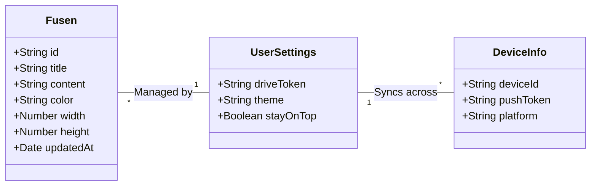
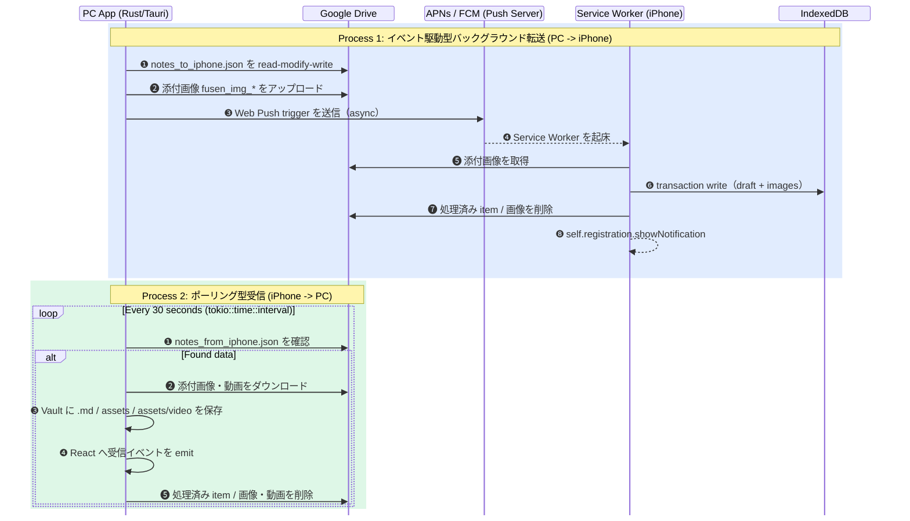
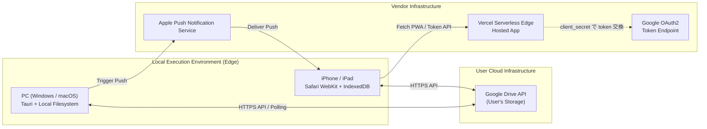

# 📐 006 4+1 Viewアーキテクチャ

4+1 View Model・システム全体俯瞰図

設計書 v1.2 / 2026-05-06

---

## 1 4+1 View Model について

このドキュメントは、俺の付箋を「ユーザーが見る機能」「裏で動く処理」「開発者が保守するコード」「実際に置かれる場所」「代表的な使い方」の5つの視点で整理します。
一般的なアーキテクチャ用語を説明することよりも、PC / iPhone / Google Drive / Vercel / Push がどこで関わるかを確認することを目的にします。

<Note type="info">
本ドキュメントは「俺の付箋」のすべての詳細設計ドキュメント（001〜005）を束ねる**メタアーキテクチャ仕様書**です。各ビューから該当する詳細ドキュメントへとリンクします。
</Note>

---

## 2 論理ビュー

対象: ユーザー / 保守担当。システムが提供する機能要素とドメインモデルを定義します。

### 2.1 コアドメインモデル：付箋（Fusen）

本システムの最も重要な論理エンティティは「付箋（Fusen）」です。PCではMarkdownファイルとして、iPhoneではIndexedDBオブジェクトとして存在しますが、論理的には同一のエンティティとして扱われます。

図 6-1　論理ドメインモデル関係図

### 2.2 フロントエンドの状態分離

- **ViewingMode（閲覧モード）:** HTML/CSSで高速レンダリングされた状態。
- **EditingMode（編集モード）:** CodeMirrorインスタンスが立ち上がった状態。

<Note type="warning">
<strong>詳細リンク:</strong> PCアプリのUIクラス構造やモードの詳細は <a href="./002_PC#sec3-3-クラス図依存関係">002_PC のクラス図</a> 参照。
</Note>

---

## 3 プロセスビュー

対象: 開発者 / 保守担当。並行処理、同期、IPC（プロセス間通信）、バックグラウンド非同期処理の実行モデルを定義します。

### 3.1 非同期メッセージングとイベント駆動処理

本システムは「ポーリング」と「イベント駆動（Push）」を適材適所で組み合わせて並行処理を実現します。
PC（Tauri）はバックグラウンドスレッドでイベントを監視（`tauri::async_runtime`）し、iPhone（PWA）は Service Worker を通じてブラウザのメインスレッドとは独立したプロセスでデータを受け取ります。

<Note type="info">
シーケンス図では、<strong>①②③</strong> はユーザーが実施する操作、<strong>❶❷❸</strong> はアプリ・Drive・Push基盤・Service Worker が自動実行する処理を表します。
</Note>

図 6-2　通信およびバックグラウンドプロセスのタイムライン

<Note type="info">
<strong>詳細リンク:</strong> プロセス間通信（IPC）やService Workerの詳細な動作シーケンスは <a href="./001_OVERVIEW#sec3-システムデータフロー">001_OVERVIEW の データフロー</a> および <a href="./003_IPHONE#sec4-データフロー">003_IPHONE の シーケンス</a> 参照。
</Note>

<Note type="warning">
<strong>添付メディアの境界：</strong>iPhone → PC 方向の画像・動画は、付箋本文と同じ意味に統合しない。
ユーザー本文は <code>body</code>、添付動画は <code>videos[]</code>、Drive 一時ファイル名は <code>fusen_video_*</code>、PC 保存先は <code>assets/video/</code> のパスとして別々に扱う。
</Note>

---

## 4 開発ビュー

対象: 開発者。ソフトウェアモジュールの階層構造、ディレクトリ構成、ライブラリスタックを定義します。

### 4.1 モノレポアーキテクチャ

本プロジェクトは単一のリポジトリ（モノレポ）で「PC（Tauri）」「iPhone（PWA）」「Vercel（API）」のすべてのコードを管理しています。フロントエンドを Next.js（React） で統一することで、UIコンポーネントや型定義（TypeScript）を共通化しています。

表 4.1-1　モノレポアーキテクチャ概要

<table class="module-table">
  <tr><th style="width:32px">No</th><th>ディレクトリ</th><th>責任範囲</th><th>技術スタック</th></tr>
  <tr><td>1</td><td><code>src-tauri/</code></td><td>PCアプリのコアロジック、OSネイティブAPI（ウィンドウ操作、トレイ）、ローカルファイルI/O</td><td>Rust (tokio, tauri, reqwest)</td></tr>
  <tr><td>2</td><td><code>app/viewer/</code></td><td>iPhone PWA および Vercel API Routes のエントリーポイント</td><td>Next.js (App Router), React, Google APIs</td></tr>
  <tr><td>3</td><td><code>app/page.tsx</code> 等</td><td>PCアプリ用のフロントエンド・UIコンポーネント群</td><td>Next.js, Tailwind CSS, CodeMirror</td></tr>
</table>
<table class="module-table">
  <tr><th style="width:32px">No</th><th>ディレクトリ</th><th>責任範囲</th><th>技術スタック</th></tr>
  <tr><td>4</td><td><code>public/worker/</code></td><td>iPhone バックグラウンド同期と通知処理</td><td>Vanilla JS (Service Worker API), IndexedDB</td></tr>
  <tr><td>5</td><td><code>docs-v2/</code></td><td>設計書、用語集、プライバシーポリシー、利用規約</td><td>VitePress, Markdown</td></tr>
  <tr><td>6</td><td><code>wiki-temp/</code></td><td>GitHub Wiki 用の一時ドキュメント置き場。公開前の Wiki 原稿やリンク確認に使う</td><td>Markdown, GitHub Wiki</td></tr>
  <tr><td>7</td><td><code>.github/workflows/</code></td><td>CI/CD パイプライン（自動ビルド、Winget自動リリース）</td><td>GitHub Actions</td></tr>
</table>

<Note type="warning">
<strong>データ指向設計 (DOD):</strong> Rust側は状態管理（`AppState`）を Single Source of Truth とし、副作用（Side-Effect）を分離する Effect Pattern を採用。
</Note>

---

## 5 物理ビュー

対象: 開発者 / 保守担当。システムがデプロイされる場所、ネットワーク、実行コンテキストを定義します。

### 5.1 ランタイム環境とネットワーク・トポロジー

俺の付箋は、中央のアプリ用データベースを持たない。付箋本文はユーザーの PC、iPhone 連携中の一時ファイルはユーザー自身の Google Drive に置く。
Vercel は iPhone PWA の配信と、開発者が守る `client_secret` を iPhone に入れず Google OAuth のトークン交換・更新を行うためだけに使う。

図 6-3　物理デプロイトポロジー

<Note type="success">
<strong>セキュリティ原則:</strong> 開発者が管理するサーバー（Vercel）にはユーザーのメモ本文、添付画像、添付動画、Drive 中継ファイル、Google Drive 用トークンを保存しない。Vercel が扱うのは、iPhone PWA の配信と OAuth トークン交換・更新の一時処理だけ。
</Note>

---

## 6 ユースケース（Scenarios）

対象: ユーザー / 開発者 / 保守担当。4つのビューを実証する代表的なユースケースのシナリオです。

### 6.1 中心シナリオ: 「出先での確認と返信」

本アーキテクチャの存在意義と4つのビューの連携をもっとも色濃く反映している一連のシナリオ（ユースケース）です。

表 6.1-1　中心シナリオ展開

| No | ステップ | ユーザー視点のシナリオ展開 | アーキテクチャの関与ビュー |
|:---|:---|:---|:---|
| 1 | **PCで入力** | ユーザーがPC上で「買い物リスト」を書き、「iPhoneに送る」ボタンを押す。 | **[Logical]** Fusen オブジェクトの生成 **[Development]** RustモジュールによるファイルI/O |
| 2 | **クラウド中継** | 数秒以内にノートがクラウドにアップロードされ、通知発火のトリガーが引かれる。 | **[Physical]** Local PC → Google Drive 通信 **[Process]** APNs への非同期 Push API 呼び出し |
| 3 | **iPhoneで受信** | ユーザーが外出先でiPhoneを見ると、ポケットの中で既に通知（新着ノート）が届いている。 | **[Process]** Service Workerのバックグラウンド起床とDrive取得 **[Physical]** Safariサンドボックス内でのIndexedDB保管 |
| 4 | **返信して削除** | iPhoneから「牛乳買ったよ」と追記してPCに送り返し、手元のノートを消す。画像や動画を添付した場合も、本文はそのまま保持される。 | **[Logical]** Viewing/Editing Mode の遷移（PWA） **[Process]** PCの30秒ポーリングによる即時回収と自動削除 |

<Note type="info">
このシナリオをプログラムで自動検証する E2E テストの仕様と結果については、<a href="./004_TEST">004 テスト設計</a> を参照してください。
</Note>

---

## 7 改版履歴

表 7-1　改版履歴

| No | バージョン | 日付 | 変更内容 |
|:---|:---|:---|:---|
| 1 | 1.0 | 26-04-21 | 新規作成。4+1 View Model（論理・プロセス・開発・物理・シナリオ）全ビューを整理。 |
| 2 | 1.1 | 26-04-24 | classDiagram・物理ビュー flowchart を `LR`（横向き）に変更。スクロールなしで全体が見えるよう改善。 |
| 3 | 1.2 | 26-05-06 | 1 4+1 View Model、4.1 モノレポアーキテクチャ、5.1 物理ビュー、6.1 中心シナリオを修正。各ビューの対象者を明記し、4.1 に `docs-v2/` と `wiki-temp/` を追加。6.1 の表に No を追加。Vercel / Google OAuth の物理トポロジーを修正し、client_secret は Drive ではなく Google OAuth のトークン交換に使うことを明確化。 |
| 4 | 1.3 | 26-05-25 | iPhone → PC のポーリング型受信に VideoDrop を追加。動画を `assets/video/` に保存し、本文・添付・一時ファイル名・保存パスを分離する境界を明記。 |

  © 2026 Ore No Fusen Project. 4+1 View Architecture Design.

