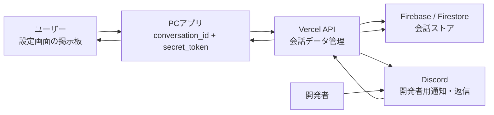
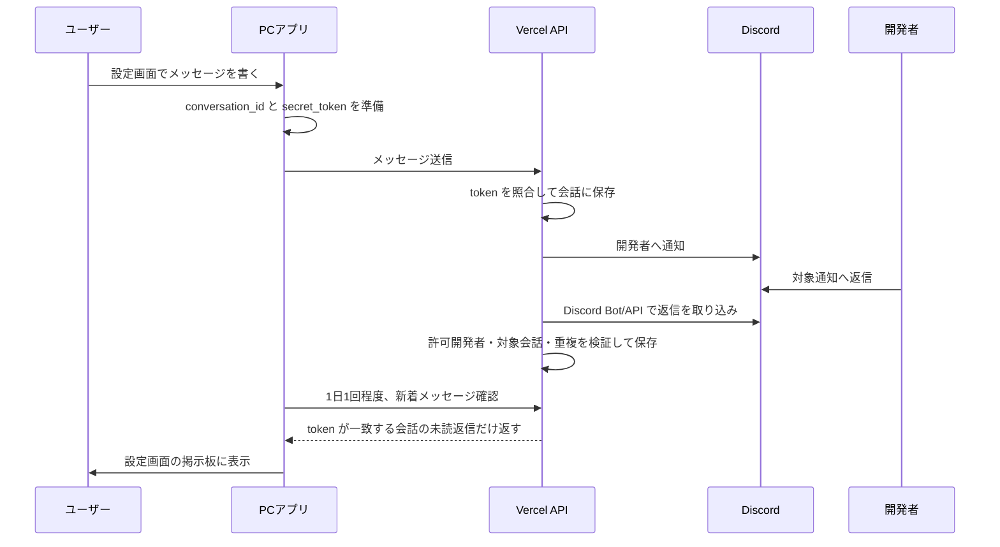
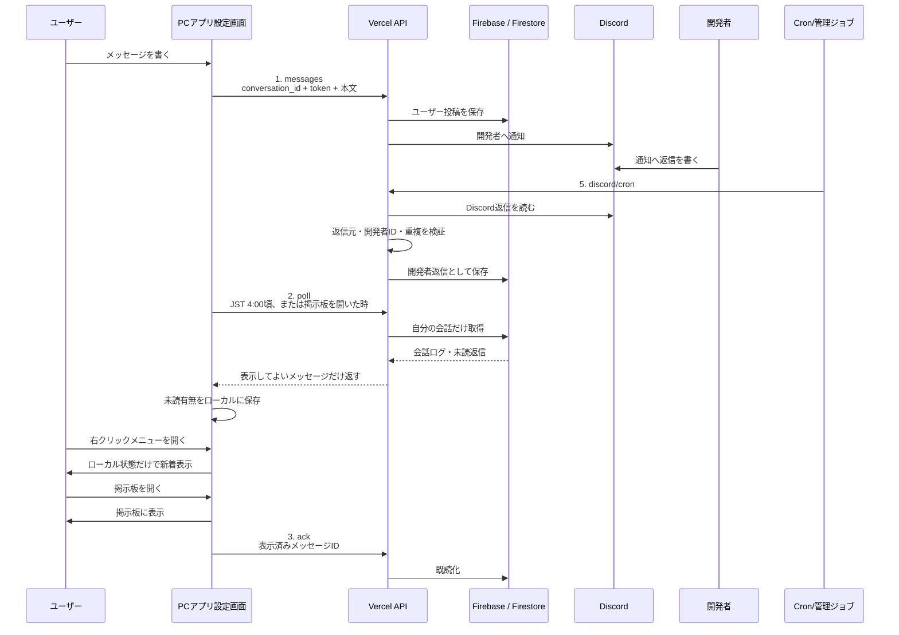

# 007 コミュニケーション設計

<p class="lead-text">
ユーザーと開発者が、連絡先を交換せずに 1 対 1 の掲示板としてやりとりするための UI とデータフローを定義します。
</p>

<p class="version-info">
コミュニケーション設計 v2.6 / 2026-06-02
</p>

---

## 1 目的

これまでのフィードバック機能は、ユーザーから開発者へ一方向に届く仕組みでした。  
前案では、開発者からの返信を付箋としてユーザーの画面に出す案を検討しましたが、これは体験として強すぎます。ユーザーの作業空間に開発者の返信が突然現れるため、誤配信時の心理的な負担も大きくなります。

本章では、返信を付箋として出すのではなく、設定画面内に「開発者とのやりとり」掲示板を作ります。ユーザーは必要なときだけ設定画面を開いて会話を確認します。

<Note type="info">
この仕組みは、ユーザーの既存付箋、添付画像、添付動画、Google Drive 内の同期ファイル、Google Drive トークンを Vercel API へ送るものではありません。ユーザーが自分で入力した掲示板メッセージと、開発者からの返信だけを扱います。
</Note>

### 1.1 登場人物と用語

本章では「サーバー」という曖昧な言葉を使わず、次の名前で役割を区別します。

<p class="table-caption">表 1.1-1　登場人物と責務</p>

| No | 名前 | 役割 | 保持してよい情報 |
|:---|:---|:---|:---|
| 1 | PCアプリ | ユーザーが投稿し、自分の会話ログを表示する | `conversation_id`、生の `secret_token`、最終確認時刻 |
| 2 | Vercel API | PCアプリ、Firestore、DiscordをつなぐAPI処理 | Firebase Admin SDK認証情報、Discord Bot Token、ingest secret |
| 3 | Firebase / Firestore | 会話データの正本を保存するDB | `secret_token_hash`、会話本文、開発者返信、Discord通知ID |
| 4 | Discordサーバー | 開発者が通知を見て返信する場所 | Discord通知メッセージ、開発者返信 |
| 5 | Discord Webhook | Vercel APIからDiscordサーバーへ通知を投稿する入口 | Webhook URL |
| 6 | Discord Bot | Discordサーバー上の返信をVercel APIへ取り込むために読む主体 | Bot Token |

---

## 2 方針

<p class="table-caption">表 2-1　方式の決定</p>

| No | 案 | 採否 | 理由 |
|:---|:---|:---|:---|
| 1 | 開発者返信を付箋として出す | 不採用 | ユーザーの作業空間に突然表示され、体験として踏み込みすぎる |
| 2 | Discord チャンネルをユーザー数分作る | 不採用 | チャンネル数、権限、API制限、削除、運用管理が重すぎる |
| 3 | 設定画面内に 1 対 1 掲示板を作る | 採用 | ユーザーが見に行く形なので自然で、誤表示時の影響範囲も設定画面内に閉じる |
| 4 | ユーザーごとに会話ファイルを作って自前同期する | 将来候補 | 考え方は近いが、初期実装では Vercel API + Firebase / Firestore で会話データを管理する方が単純 |

---

## 3 ユーザー体験

設定画面に「開発者とのやりとり」を追加します。見た目は、シンプルな掲示板またはチャットログです。

<p class="table-caption">表 3-1　ユーザー側 UI</p>

| No | 画面・状態 | 表示 | 操作 |
|:---|:---|:---|:---|
| 1 | 設定画面 | 「開発者とのやりとり」メニュー | ユーザーが開く |
| 2 | 初回表示 | まだやりとりがない旨、入力欄、送信ボタン | メッセージを書く |
| 3 | 送信後 | 自分の投稿が会話ログに追加される | 必要なら続けて投稿する |
| 4 | 返信あり | 「アプリ開発者」名義の返信が会話ログに表示される | 読む、必要なら返信する |
| 5 | 未読返信あり | 右クリックメニューの「開発者とのやりとり」に `● 新着あり` を付ける | 開いて確認する |
| 6 | 返信なし | 何も割り込んで表示しない | 通常利用を続ける |
| 7 | 通信失敗 | 設定画面内に控えめな再試行表示 | 付箋や通常操作には影響しない |

<p class="table-caption">表 3-2　会話ログの表示例</p>

| 発言者 | 表示例 |
|:---|:---|
| ユーザー | こんにちは |
| アプリ開発者 | こんにちは |
| ユーザー | 付箋の色を増やしてほしいです。 |
| アプリ開発者 | ありがとうございます。検討します。 |

---

## 4 全体構成

ユーザー側は設定画面だけを使います。開発者側は Discord を返信入力 UI として使います。Discord はユーザーに直接見せません。



<p class="mermaid-caption">図 4-1　1 対 1 掲示板方式の全体構成</p>

<p class="table-caption">表 4-1　責務</p>

| 領域 | 責務 |
|:---|:---|
| PCアプリ | 匿名会話IDの保持、掲示板UI表示、投稿、1日1回程度の新着確認 |
| Vercel API | secret token 照合、Firestore保存、Discord通知、Discord返信取り込み |
| Firebase / Firestore | 会話本文、開発者返信、既読状態、Discord通知との対応を永続保存 |
| Discord | 開発者が確認・返信するための裏側 UI |
| 開発者 | Discord上で対象投稿に返信する |

---

## 5 データモデル

ユーザーをメールアドレスや Discord ID で識別しません。アプリがローカルに保持する匿名の `conversation_id` と、本人確認用の `secret_token` で会話を守ります。

<p class="table-caption">表 5-1　ローカルに保存する情報</p>

| No | 情報 | 保存場所 | 用途 |
|:---|:---|:---|:---|
| 1 | `conversation_id` | PCローカル設定 | このアプリの掲示板を識別する |
| 2 | `secret_token` | PCローカル設定 | 他人が会話を読めないようにする |
| 3 | `last_message_check_at` | PCローカル設定 | 1日1回程度の新着確認に制限する |
| 4 | `has_unread_developer_reply` | PCローカル設定 | 右クリックメニューの新着表示に使う |
| 5 | `last_unread_check_date` | PCローカル設定 | JST 4:00 頃の自動確認を同じ日に重複実行しない |

<p class="table-caption">表 5-2　Firebase / Firestore に保存する情報</p>

| No | 情報 | 用途 |
|:---|:---|:---|
| 1 | `conversation_id` | 会話スレッドの識別 |
| 2 | `secret_token_hash` | PCアプリからの読取・送信権限確認 |
| 3 | `messages[]` | ユーザー投稿と開発者返信の本文 |
| 4 | `discord_message_id` | Discord通知と会話の紐付け |
| 5 | `author_type` | `user` または `developer` |
| 6 | `read_by_user` | 開発者返信をユーザーが見たかどうか |
| 7 | `status` | shadow accepted、ignored など |

<Note type="warning">
`secret_token` の生値は Firebase / Firestore に保存しません。Vercel API は、PCアプリから受け取った `secret_token` をハッシュ化し、Firestore に保存済みの `secret_token_hash` と照合します。
</Note>

<p class="table-caption">表 5-3　`secret_token` の発行と更新</p>

| No | 項目 | 仕様 |
|:---|:---|:---|
| 1 | 発行タイミング | PCアプリが開発者とのやりとりを初めて使い、ローカルに `secret_token` がないときに発行する |
| 2 | 更新タイミング | 通常は自動更新しない。ローカル保存が消えた、別環境を使った、または値が欠けた場合に新しく発行する |
| 3 | 長さ | 32バイトの乱数を base64url 文字列にするため、通常は43文字になる |
| 4 | 生成方法 | 暗号用途の乱数生成器で32バイトを作り、URLに含められる base64url 形式へ変換する |
| 5 | Firestore保存 | 生の `secret_token` は保存せず、`secret_token_hash` だけを Firestore に保存する |

<p class="table-caption">表 5-4　会話データの分離ルール</p>

| No | ルール | 理由 |
|:---|:---|:---|
| 1 | Firestore の会話正本は `feedback_conversations/{conversation_id}` 単位で分離する | ユーザーごとの掲示板をDB上でも別スレッドとして扱う |
| 2 | `conversation_id` だけで本人確認しない | IDが見えたり推測された場合でも、会話を読ませない |
| 3 | 読み取り、投稿、既読更新は `secret_token_hash` が一致した場合だけ許可する | 別ユーザーの会話ログが返る事故を防ぐ |
| 4 | Discord返信は元の通知メッセージまたは通知内の会話IDから対象会話を確定できた場合だけ保存する | Discord内の無関係な投稿がユーザーの掲示板に混入しないようにする |
| 5 | 対象会話を確定できない、token が一致しない、または重複している場合は保存せず拒否する | 判断できないものは表示しない fail closed にする |
| 6 | 右クリックメニュー表示時は Firestore へ問い合わせない | メニュー表示を遅くせず、通信失敗で右クリックが効かなくなる事故を防ぐ |
| 7 | 掲示板を開いて表示できた開発者返信だけを既読化する | 見ていない返信を既読にしない |

Firestore は Vercel の中にある保存領域ではなく、Firebase が提供する外部の永続データベースです。Vercel API は、Vercelの環境変数に設定した Firebase Admin SDK 認証情報を使って Firestore を読み書きします。PC アプリや iPhone PWA に Firebase の管理用認証情報を配布しません。

```txt
feedback_conversations/{conversation_id}
  secret_token_hash
  created_at
  updated_at
  discord_message_id
  delivery_enabled

feedback_conversations/{conversation_id}/messages/{message_id}
  author_type: user | developer
  body
  created_at
  discord_message_id
  read_by_user
  shadow_only
```

---

## 6 シーケンス



<p class="mermaid-caption">図 6-1　掲示板メッセージ送受信シーケンス</p>

---

## 7 Discord連携

Discordは、開発者の作業場所としてだけ使います。ユーザーごとのDiscordチャンネルは作りません。
開発者は、1つの開発者用チャンネルに届く通知を見て、対象通知の返信スレッドで返事を書きます。
会話の正本は Firestore に保存し、Discord は「通知を見る場所」と「開発者が返信を書く場所」として扱います。

<p class="table-caption">表 7-1　Discordをユーザー数分作らない理由</p>

| No | 理由 | 内容 |
|:---|:---|:---|
| 1 | 運用負荷 | ユーザー数分のチャンネル、権限、削除、検索を管理できない |
| 2 | API制限 | 大量チャンネル作成・更新はDiscord側の制限を受けやすい |
| 3 | 誤操作リスク | 開発者がチャンネルを間違えると、別ユーザーの会話に返信しやすい |
| 4 | プライバシー | Discord側の構造にユーザー数や会話単位が露出しやすい |

<p class="table-caption">表 7-2　開発者側の確認方法</p>

| No | 項目 | 内容 |
|:---|:---|:---|
| 1 | 確認場所 | Discord の開発者用フィードバックチャンネル |
| 2 | 会話単位 | ユーザーごとのチャンネルではなく、通知メッセージまたは通知スレッドを会話単位にする |
| 3 | 返信方法 | 開発者は対象通知への返信として本文を書く |
| 4 | 正本 | Firestore の `conversation_id` 単位の会話データ |
| 5 | Discordの役割 | 開発者が見つけやすく返信しやすい作業UI。ユーザーに直接見せる画面ではない |
| 6 | 過去ログ | Discord通知に直近5件のやりとりを添える。久しぶりの相手にも最低限の文脈を持って返せる |
| 7 | 100人規模 | チャンネルは増やさず、通知とスレッドで扱う。未対応・対応済み・重要などの管理が必要になったら Firestore を読む管理画面を追加する |

<p class="table-caption">表 7-3　開発者返信の取り込み条件</p>

| No | 条件 | 対策 |
|:---|:---|:---|
| 1 | 元の会話通知に紐付いている | `discord_message_id -> conversation_id` の対応表で確認する |
| 2 | 開発者として許可されている | `ALLOWED_DISCORD_USER_IDS` に含まれる `author_id` だけを受け付ける |
| 3 | Bot自身ではない | Bot投稿は取り込まない |
| 4 | 空本文ではない | 空文字、空白だけの返信は取り込まない |
| 5 | 未取り込みである | 同じDiscord返信IDは一度だけ保存する |
| 6 | shadow mode を通過している | 初期運用では保存してもユーザーには返さない |

<Note type="info">
100人のユーザーがいても、Discordチャンネルを100個作る設計にはしません。初期実装では1つの開発者用チャンネルに通知を集め、会話単位は `conversation_id` と Discord の通知メッセージIDまたはスレッドIDで結びます。Discord上の見通しが悪くなった場合は、Firestoreを読む開発者用管理画面を追加します。
</Note>

### 7.1 過去ログの確認

開発者が返信するときは、直近の投稿だけでなく、その `conversation_id` の直近5件のやりとりを確認できるようにします。  
これにより、以前やりとりした相手に「お久しぶりです」と自然に返せます。

<p class="table-caption">表 7.1-1　過去ログ確認の方針</p>

| No | 項目 | 内容 |
|:---|:---|:---|
| 1 | 保存先 | Firestore の `feedback_conversations/{conversation_id}/messages` |
| 2 | 並び順 | `created_at` 昇順でユーザー投稿と開発者返信を表示する |
| 3 | 開発者の確認方法 | Discord通知に直近5件の会話ログを含める |
| 4 | Discord上の限界 | Discordの過去表示だけを正本にしない。削除・流れ・検索性の問題があるため Firestore を正本にする |
| 5 | ユーザー側 | 設定画面の掲示板で、自分の会話履歴を確認できる |
| 6 | 全履歴 | 初期実装では開発者向けに全履歴UIは作らない。必要になったら管理画面で追加する |

---

## 8 安全要求と距離感

この機能で特に守る安全要求は4つです。加えて、ユーザーと開発者の距離感を守ります。  
開発者から返信できることは便利ですが、ユーザーの作業空間へ突然入り込む体験にはしません。ユーザーが必要なときに設定画面を開き、自分の意思で確認できる関係にします。

<p class="table-caption">表 8-1　安全要求と対策</p>

| No | 要求 | 失敗した場合 | 対策 |
|:---|:---|:---|:---|
| 1 | 返信は元のユーザーだけに届く | 別ユーザーの掲示板に返信が表示される。これはセキュリティ事故として扱う | `conversation_id + secret_token` が一致した場合だけ返す。`conversation_id` だけでは返さない |
| 2 | 開発者の返信だけが届く | Discord内の無関係な投稿が表示される | 許可済みDiscordユーザーID、返信元メッセージID、重複状態をすべて検証する |
| 3 | DB上で他人の会話と混ざらない | Firestoreから別ユーザーの `messages` を取得または保存する | `feedback_conversations/{conversation_id}` 単位で保存し、読み書きのたびに `secret_token_hash` を照合する |
| 4 | 判断できない返信は表示しない | 対象会話が不明なDiscord投稿がユーザーの掲示板に出る | 会話IDを確定できない返信は保存せず、`ignored` または `rejected` として扱う |

<p class="table-caption">表 8-2　ユーザーとの距離感を守る制約</p>

| No | 制約 | 理由 |
|:---|:---|:---|
| 1 | 付箋として自動表示しない | 開発者の返信がユーザーの作業中の画面へ割り込まない |
| 2 | 設定画面を開いたときに見る | ユーザーが自分の意思で確認する関係にする |
| 3 | JST 4:00 頃に1日1回確認する | Vercel Cron が JST 3:00 に Discord 返信を取り込んだ後、朝に新着を拾えるようにする |
| 4 | 返信がない日は何も出さない | 通常利用の流れを邪魔しない |
| 5 | kill switch を持つ | 問題があれば Vercel API 側で即停止できる |
| 6 | shadow mode から始める | 実配信前にDiscord返信分類を確認できる |

---

## 9 API設計

<p class="table-caption">表 9-1　API一覧</p>

| No | API | 用途 |
|:---|:---|:---|
| 1 | `POST /api/feedback/conversation/messages` | ユーザー投稿を保存し、Discordへ通知する |
| 2 | `POST /api/feedback/conversation/poll` | 設定画面が会話ログ・未読返信を取得する |
| 3 | `POST /api/feedback/conversation/ack` | ユーザーが見た返信を既読にする |
| 4 | `POST /api/feedback/discord/ingest` | 開発者の管理操作でDiscord返信を取り込む |
| 5 | `GET /api/feedback/discord/cron` | Vercel CronでDiscord返信を取り込む |

2 の `conversation/poll` は、PC アプリが「自分の掲示板を見せる」ために呼びます。右クリックメニュー表示時には呼びません。  
PC アプリは JST 4:00 頃に1日1回だけ `conversation/poll` を呼び、未読の開発者返信があればローカルの `has_unread_developer_reply` を true にします。  
ユーザーが「開発者とのやりとり」を開いた場合は、その時点で最新の `conversation/poll` を呼び、表示できた開発者返信だけ `conversation/ack` で既読化します。
4 の `discord/ingest` は、開発者の管理操作が「Discord に書かれた開発者返信を会話データへ入れる」ために呼びます。  
5 の `discord/cron` は、Vercel Cron が同じ取り込み処理を本番環境で JST 3:00 に1日1回実行するために呼びます。`CRON_SECRET` による `Authorization` ヘッダー認証を必須にします。

管理者ツールの手動 `discord/ingest` では、開発者PCの `localStorage` に `FEEDBACK_CONVERSATION_INGEST_SECRET` を保存できます。これは開発者PCでの入力補助だけに使い、Vercel や Firestore へ secret の生値を保存しません。`CRON_SECRET` は通常PCアプリで入力しないため、保存対象にしません。



<p class="mermaid-caption">図 9-1　APIごとの役割と実行タイミング</p>

<p class="table-caption">表 9-2　環境変数</p>

| No | 環境変数 | 用途 |
|:---|:---|:---|
| 1 | `FEEDBACK_CONVERSATION_ENABLED` | 掲示板機能の有効・無効 |
| 2 | `FEEDBACK_CONVERSATION_SHADOW_MODE` | 返信を保存するがユーザーへ返さない運用 |
| 3 | `FEEDBACK_CONVERSATION_INGEST_SECRET` | Discord取り込みAPIの認証 |
| 4 | `DISCORD_BOT_TOKEN` | Discord返信の読み取り |
| 5 | `DISCORD_FEEDBACK_CHANNEL_ID` | 監視対象チャンネル |
| 6 | `ALLOWED_DISCORD_USER_IDS` | 返信を許可する開発者ID |
| 7 | `FIREBASE_PROJECT_ID` | Firestore のプロジェクト識別子 |
| 8 | `FIREBASE_CLIENT_EMAIL` | Vercel API が使う Firebase サービスアカウント |
| 9 | `FIREBASE_PRIVATE_KEY` | Firestore 読み書き用の秘密鍵 |
| 10 | `FIREBASE_DATABASE_ID` | Firestore のデータベースID。通常は `(default)` |

<Note type="warning">
Firebase のサービスアカウント情報は Vercel の環境変数にだけ置きます。PC アプリ、iPhone PWA、公開リポジトリには入れません。
</Note>

---

## 10 実装境界

<p class="table-caption">表 10-1　今回実装するもの・しないもの</p>

| 区分 | 内容 |
|:---|:---|
| 実装する | 設定画面内の掲示板、匿名会話ID、secret token、Firestore保存、Discord通知、Discord返信取り込み、新着確認 |
| 実装しない | 返信付箋、ユーザー数分のDiscordチャンネル、自動プッシュ通知、Google Drive内の会話ファイル同期 |
| 将来検討 | 通知バッジ、ユーザーによる会話削除、添付画像、既読表示、サポート対応ステータス |

---

## 11 リリース手順

<p class="table-caption">表 11-1　リリース手順</p>

| No | 手順 | 確認 |
|:---|:---|:---|
| 1 | `FEEDBACK_CONVERSATION_ENABLED=false` でデプロイ | 既存フィードバック送信が壊れない |
| 2 | Discord通知だけ有効化 | 開発者に投稿が届く |
| 3 | shadow mode で返信分類 | 誤分類がない |
| 4 | 自分のテスト会話だけで取得確認 | 正しい会話にだけ返信が出る |
| 5 | public delivery 有効化 | 設定画面内に返信が表示される |
| 6 | 監視 | rejected理由、重複、誤配信ゼロを確認する |

---

## 12 改版履歴

<div class="history-table">
<p class="table-caption">表 12-1　改版履歴</p>

| No | バージョン | 日付 | 変更内容 |
|:---|:---|:---|:---|
| 1 | 1.0 | 26-06-01 | ユーザーと開発者の 1 対 1 会話、ありがとう付箋、開発者返信付箋、日次確認、安全制約を定義 |
| 2 | 1.1 | 26-06-01 | 返信が元ユーザーだけに届くこと、開発者返信だけが届くことの安全要求を追加 |
| 3 | 2.0 | 26-06-01 | 返信付箋方式を廃止し、設定画面内の 1 対 1 掲示板方式へ変更 |
| 4 | 2.1 | 26-06-01 | 会話ストアを Firebase / Firestore 前提に変更し、API図と環境変数を更新 |
| 5 | 2.2 | 26-06-01 | 「怖くないための制約」を「ユーザーとの距離感を守る制約」に変更し、開発者が作業空間へ割り込まない意図を明確化 |
| 6 | 2.3 | 26-06-01 | 開発者がDiscordで会話を確認する方法、100人規模でもチャンネルを増やさない運用、管理画面追加の判断基準を追加 |
| 7 | 2.4 | 26-06-01 | 開発者が直近5件の過去ログを確認して返信できる方針を追加し、Firestoreを会話履歴の正本と明記 |
| 8 | 2.5 | 26-06-02 | `secret_token` の発行仕様と、Firestore上で他人の会話を混在させない分離ルールを追加 |
| 9 | 2.6 | 26-06-02 | 登場人物の用語を定義し、曖昧な「サーバー」表現を Vercel API、Firebase / Firestore、Discordサーバーに分解 |
| 10 | 2.7 | 26-06-04 | Vercel Cron は JST 3:00、PCアプリは JST 4:00 頃に1日1回確認する運用を追加。右クリックメニューは通信せずローカル未読状態だけで新着表示し、掲示板表示時に既読化する仕様を追加 |
| 11 | 2.8 | 26-06-05 | 管理者ツールの手動 ingest 用に、開発者PCの localStorage へ `FEEDBACK_CONVERSATION_INGEST_SECRET` を保存できる仕様を追加。`CRON_SECRET` は保存対象外と明記。 |

</div>
