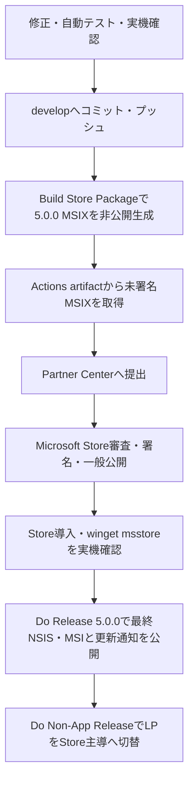
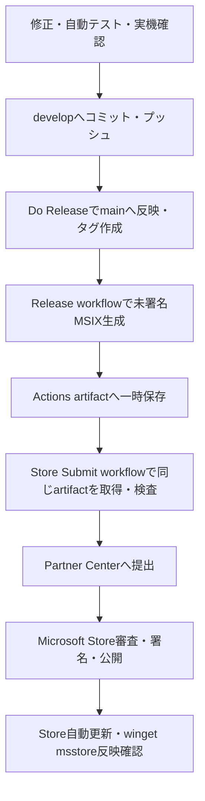

# 008 配布設計（Microsoft Store MSIX）

<p class="lead-text">
Microsoft Store向けMSIXを唯一の正式配布形式とし、既存MSI・NSIS利用者を安全に移行する方式を定義します。
</p>

<p class="version-info">
配布設計 v2.1 / 2026-07-19
</p>

---

## 1 目的

本章では、Microsoft Store向けMSIXへの一本化、既存利用者の移行、更新、自動起動、winget、署名、データ保持を定義します。

<Note type="info">
5.0.0は移行開始版としてNSIS・MSI・Store MSIXの3形式を最後に提供します。5.1.0以降はStore MSIXだけを正式配布します。
</Note>

---

## 2 リリース段階

<p class="table-caption">表 2-1 配布形式の移行</p>

| No | 段階 | NSIS | MSI | Store MSIX | 更新経路 |
|:---|:---|:---|:---|:---|:---|
| 1 | 4.4.x以前 | 正式配布 | 正式配布 | 先行提供 | Tauri updater / Store |
| 2 | 5.0.0 | 最終移行版 | 最終移行版 | 正式な移行先 | 旧版はTauri updater、MSIXはStore |
| 3 | 5.1.0以降 | 新規公開しない | 新規公開しない | 唯一の正式版 | Microsoft Store |

5.0.0の旧形式は、既存利用者へStore移行案内を届けるための一度限りのブリッジです。新規利用者にはStore版を案内します。

---

## 3 配布・公開経路

5.1.0以降、アプリの入手と更新はMicrosoft Storeへ統一します。GitHub Releaseは変更履歴とソースコード公開に使い、未署名MSIXや一般向けインストーラーを置きません。

wingetはcommunity repositoryではなく、Microsoft Storeカタログの`msstore`ソースを使います。

```powershell
winget install --id 9N4MW0V2MVVG --source msstore
```

<p class="table-caption">表 3-1 公開先の役割</p>

| No | 公開先 | 役割 |
|:---|:---|:---|
| 1 | Microsoft Store | MSIXの一般配布、署名、自動更新 |
| 2 | winget `msstore` | Store版をコマンドから導入・更新する補助経路 |
| 3 | GitHub Release | 変更履歴、移行案内、ソースアーカイブ |
| 4 | GitHub Actions artifact | Partner Centerへ渡す未署名MSIXの一時保管。一般配布しない |

---

## 4 署名とStore提出

CIはStore提出用の未署名MSIXを生成します。提出前にIdentity Name、Publisher、Version、Architecture、未署名状態を検査します。

Microsoft Storeは審査後に配布用MSIXへ正式署名します。開発時に実機へサイドロードする場合だけ、開発用自己署名証明書を使います。

<p class="table-caption">表 4-1 署名の役割</p>

| No | 対象 | 署名者 | 用途 |
|:---|:---|:---|:---|
| 1 | Store提出用MSIX | 署名しない | Partner Centerへの提出 |
| 2 | Store配布用MSIX | Microsoft Store | 一般ユーザーへの正式配布 |
| 3 | 開発確認用MSIX | 開発用自己署名 | 証明書を信頼登録したテストPCだけで使用 |
| 4 | 5.0.0旧版updater成果物 | Tauri updater秘密鍵 | 最終移行版の改ざん検知 |

Store Identityは次を正とします。

- Identity Name: `ONFStudios.FUSEN`
- Publisher: `CN=4820A467-BFE8-46A3-A142-42A0E840F3A5`
- Store Product ID: `9N4MW0V2MVVG`
- Architecture: `x64`
- Version: アプリ`X.Y.Z`に対しMSIX`X.Y.Z.0`

---

## 5 データ移行

設定（`%APPDATA%`）と付箋保存フォルダは、旧版とMSIX版で同じ場所を使います。移行時はStore版を先に導入し、データを確認してから旧版をアンインストールします。

<Note type="warning">
旧版を先にアンインストールしません。アプリはStore版を自動インストールしたり、旧版を自動アンインストールしたりしません。
</Note>

移行手順は次のとおりです。

1. 5.0.0の移行案内からMicrosoft Storeを開く。
2. Store版をインストールし、Store画面の［開く］を押して初回起動する。
3. 初回確認で［作成する］を選び、デスクトップに「俺の付箋（Store版）」が作成されたことを確認する。［今回は作成しない］を選んだ場合は設定画面から後で作成できる。
4. 付箋、画像、タグ、設定、保存先、ショートカット、Drive設定を確認する。
5. Store版を終了する。
6. 旧NSIS・MSI版をアンインストールする。
7. Store版を再起動し、データが残っていることを確認する。

旧版とMSIX版はsingle-instanceにより同時起動できません。確認時は片方を終了してからもう一方を起動します。

---

## 6 自動起動

MSIXはmanifestのStartupTaskを使い、設定画面からON/OFFします。Windowsの「スタートアップ アプリ」でユーザーが無効化した場合、アプリから強制的に再有効化できないため、Windows設定を開く案内を表示します。

5.0.0の旧版だけはレジストリRunキー方式を維持します。5.1.0以降の正式版ではStartupTaskだけを使用します。

<p class="table-caption">表 6-1 自動起動方式</p>

| No | 対象 | 方式 | 補足 |
|:---|:---|:---|:---|
| 1 | Store MSIX | StartupTask | 正式方式。Windows側で無効化された場合は設定画面へ案内する |
| 2 | 5.0.0旧版 | レジストリRunキー | 移行期間だけ維持する |
| 3 | 非パッケージ開発実行 | 開発用fallback | Store正式版には使用しない |

### 6.1 初回起動とデスクトップショートカット

Storeはインストール完了だけではアプリの初回処理を実行しない。LP、Store説明、移行マニュアルでは「インストール後にStore画面の［開く］を押す」までを一続きの導入手順として案内する。アプリが無断でインストール直後に起動することを前提にしない。

MSIX版を初めて起動した時、次の確認を1回だけ表示する。

> デスクトップにショートカットを作成しますか？
> 毎日使う場合は作成をおすすめします。
> 後から設定画面でも作成できます。
>
> ［作成する］ ［今回は作成しない］

MSIX版のショートカット名は「俺の付箋（Store版）」とし、5.0.0移行期間に旧NSIS・MSI版のショートカットを上書きしない。起動先にはバージョンごとに変化するWindowsApps配下の実行ファイルを直接保存せず、MSIXのPackage Family NameとApplication Idから構成した固定Application User Model IDを使う。設定画面では作成、作り直し、削除ができ、［今回は作成しない］を選んだ利用者も後から作成できる。

---

## 7 更新

Store MSIXの更新はMicrosoft Storeが管理します。Store版ではTauri updaterの確認・ダウンロード・インストールを行いません。

Tauri updaterは5.0.0を既存NSIS利用者へ届けるためだけに維持し、5.1.0で新規成果物の生成を終了します。

<p class="table-caption">表 7-1 更新方式</p>

| No | 対象 | 更新方式 |
|:---|:---|:---|
| 1 | Store MSIX | Microsoft Storeの自動更新 |
| 2 | 5.0.0 NSIS移行版 | Tauri updaterで最終案内版を配信 |
| 3 | 5.1.0以降 | `latest.json`・`.sig`・Tauri updater秘密鍵のCI利用を終了 |

---

## 8 リリースフロー

5.0.0では、既存版へ更新通知を送る前にStore版を利用可能にします。



<p class="mermaid-caption">図 8-1 5.0.0のStore先行公開フロー</p>

`Build Store Package`は入力版をActions runner内だけへ一時反映し、タグ、GitHub Release、NSIS、MSI、updater metadata、LP、リポジトリの版番号を変更しません。



<p class="mermaid-caption">図 8-2 5.1.0以降のリリースフロー</p>

Do Releaseは一般公開の完了ではなく、Store提出用MSIXを作る起点です。Microsoft Storeで公開された時点を一般公開完了とします。

---

## 9 制約と検証

- WindowsApps配下・exe配下などの危険パスを保存先にしない。
- シンボリックリンクは配布形式に関係なく作成しない。
- 未署名MSIXを一般ユーザーへ配布しない。
- Store公開前にLPの旧導線を消さない。
- 5.0.0から5.1.0へのStore自動更新を実機確認してから一本化完了とする。
- NSIS、MSI、旧community wingetの各経路からデータ移行を確認する。
- Partner Centerの取得数・インストール数をGitHub asset download数と混同しない。

---

## 10 改版履歴

<div class="history-table">
<p class="table-caption">表 10-1 改版履歴</p>

| No | バージョン | 日付 | 変更内容 |
|:---|:---|:---|:---|
| 1 | v1.0 | 26-06-15 | MSIXお試し版とMSI/NSIS本気版の二系統設計を初版として作成 |
| 2 | v2.0 | 26-07-19 | 5.0.0を移行開始版、5.1.0以降をMicrosoft Store MSIX単一配布とする設計へ全面改版 |
| 3 | v2.1 | 26-07-19 | Storeの［開く］を初回起動導線とし、旧版と区別した「俺の付箋（Store版）」ショートカットの初回確認・設定画面からの再作成・固定アプリID利用を追加 |

</div>
