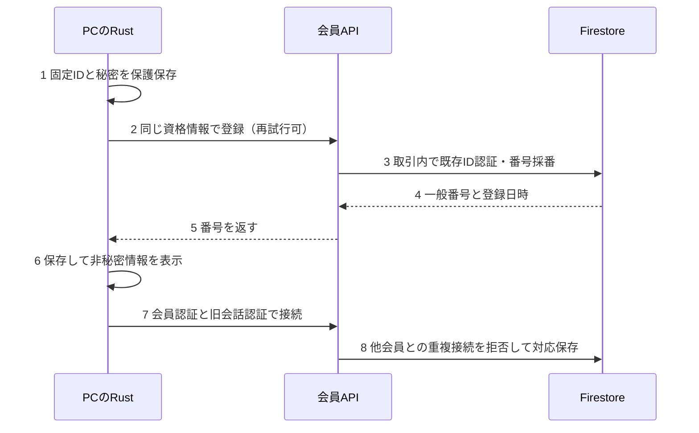
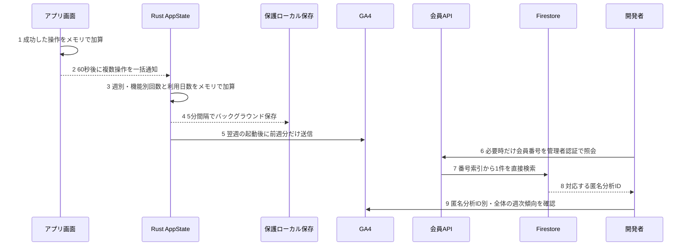

# 009 会員番号と機能利用分析

承認日: 26-09-04。実装中。配信前に本書の実機確認を完了する。

## 1 識別と保存

固定IDをRustで一度だけ生成し、一般番号はサーバーが10000から採番する。有料番号は別枠で将来1から採番し、両方を同じ固定IDに対応付ける。今回は決済接続を行わず、未接続を未購入とは扱わない。番号は認証秘密ではない。再インストール・別PCの同一人物性を番号だけで証明しない。

会員台帳の正本はFirestore、PC側の唯一の実行時状態はRust AppStateとする。資格情報をWindowsで保護し、画面取得・全窓イベント・ログ・分析には秘密を含めない。本番と開発の資格情報、API、採番を分離する。DB未設定時のメモリ代替は禁止。

同一実行ファイルを使う開発署名MSIXとStore用MSIXは実行時のパッケージ名ONFStudios.FUSEN.Dev/ONFStudios.FUSENで環境を分離する。MSIXであるかどうかだけでは判定しない。

通常の同一配布環境でのバージョン更新ではID・資格情報を移行/保持し、番号を再発行しない。保存パスにアプリバージョンを含めない。アンインストール時のデータ保持は未検証で、残存した資格情報を復号できれば同じ番号を取得する。資格情報も消えた場合は新規登録となる。Storeアンインストール/再インストール、Windowsのアプリリセットを別々の実機確認項目とする。試験はユーザーの本番データを使わず隔離環境で行う。会員番号だけでは復元認証を成立させない。

## 2 初回登録と会話接続

図 2-1　初回登録と既存会話の接続

既存投稿APIは履歴取得やDiscord送信より先に会話を認証する。新会話の確保は競合時に上書きせず、既存の秘密ハッシュ・初回日時を保持する。Discordメッセージの索引と返信経路を維持する。

## 3 機能利用分析

会員番号の発行と分析同意を分離する。既存GA4同意と会員別分析同意の両方が有効な場合だけ集計する。同意を断っても全機能が利用できる。会員番号はGA4へ送らず、Firestoreに保存するランダムな分析IDをGA4 User-IDとして使用する。

図 3-1　基本機能を待たせない週次集計

固定機能名、週間使用回数、使用日数、最終使用日、アプリ版、計測版だけを扱う。週はUTCの月曜日から日曜日までとし、ISO週番号 `YYYY-Www` で識別する。本文・検索語・タグ名・添付内容・パスを送らない。生の操作列は保存しない。FirestoreとVercelには利用履歴を保存しない。同意撤回時はPC内の未送信集計を削除し、以後送信しない。

通常操作ではメモリ上の整数を増やすだけとし、ディスク・GA4・Vercelへアクセスしない。文字入力はキー単位で数えず、保存に成功した編集を1回とする。他の機能も成功時だけ数える。UIからRustへの通知は60秒単位、保護ローカル保存は5分単位、GA4送信は翌週の起動から60秒経過後とする。集計の失敗や異常終了直前の欠損を許容し、付箋の表示・入力・保存を失敗または待機させない。

計測未同意、旧版、未起動、送信失敗を利用ゼロと扱わない。週次完了イベントを受信した分析IDだけを分母にする。GA4では個別分析IDの回数と、全体の利用者率・中央値・分布を確認する。会員番号との照合が必要な場合だけ、管理者専用APIをBearer認証して番号索引から1件を直接検索する。APIは一般番号、匿名分析ID、登録日時、有料番号だけを返し、会員ID・認証秘密・利用履歴は返さない。ユーザー向け利用状況画面は追加しない。

## 4 合格条件

2個体の異なる操作が別の分析IDに対応し、全体集計とも一致することを確認する。通常操作でネットワーク通信とディスク書込みが発生しないこと、操作経路の追加処理が10ミリ秒未満であること、集計失敗時も付箋操作が成功することを計測する。同時登録・複数窓・更新・同意撤回・保存失敗・無権限取得も検証する。本番DBの番号保持とGA4週次受信を実際に確認するまでリリースしない。

## 5 改版履歴

| No. | 日付 | 内容 |
|---|---|---|
| 1 | 26-09-04 | 承認済み会員番号・機能集計・開発者レポートの仕様を追加。実装中。 |
| 2 | 26-09-05 | 利用履歴のVercel・Firestore日次送信を廃止。低負荷のローカル月次集計とGA4送信へ変更。 |
| 3 | 26-09-05 | 分析周期を月次から月曜始まりの週次へ変更。ユーザー向け利用状況画面は追加しない。 |
| 4 | 26-09-05 | 会員番号から匿名分析IDを1件だけ取得する管理者認証付き照会を追加。通常ユーザーの通信は増やさない。 |

