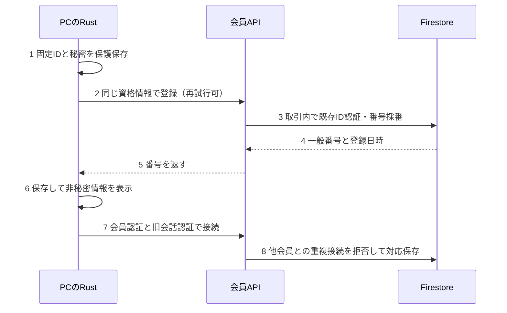
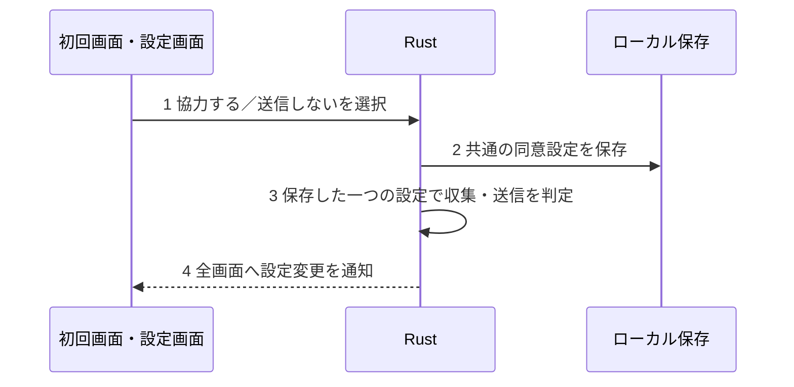
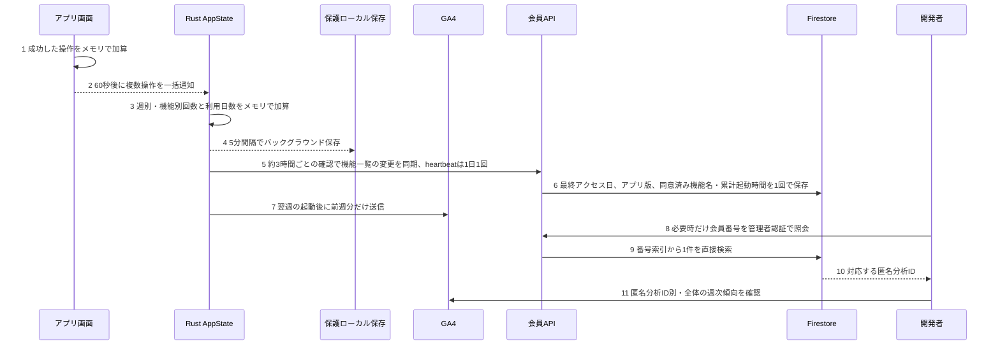
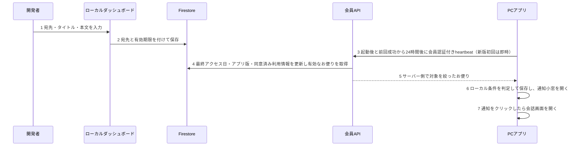

# 009 会員番号と機能利用分析

承認日: 26-09-04。実装中。配信前に本書の実機確認を完了する。

本書は、会員番号、利用情報の収集、お便りの配信、開発者ダッシュボードを定義する。

**ダッシュボードの目的・見方・使用／未使用の判断は「5 開発者ダッシュボード」を参照する。** 利用情報を送る仕組みは「3 機能利用分析」、お便りを配信する仕組みは「4 開発者ホットライン」に記載する。

## 1 識別と保存

固定IDをRustで一度だけ生成し、一般番号はサーバーが10000から採番する。有料番号は別枠で将来1から採番し、両方を同じ固定IDに対応付ける。今回は決済接続を行わず、未接続を未購入とは扱わない。番号は認証秘密ではない。再インストール・別PCの同一人物性を番号だけで証明しない。

会員台帳の正本はFirestore、PC側の唯一の実行時状態はRust AppStateとする。資格情報をWindowsで保護し、画面取得・全窓イベント・ログ・分析には秘密を含めない。本番と開発の資格情報、API、採番を分離する。DB未設定時のメモリ代替は禁止。

同一実行ファイルを使う開発署名MSIXとStore用MSIXは実行時のパッケージ名ONFStudios.FUSEN.Dev/ONFStudios.FUSENで環境を分離する。MSIXであるかどうかだけでは判定しない。

通常の同一配布環境でのバージョン更新ではID・資格情報を移行/保持し、番号を再発行しない。保存パスにアプリバージョンを含めない。アンインストール時のデータ保持は未検証で、残存した資格情報を復号できれば同じ番号を取得する。資格情報も消えた場合は新規登録となる。Storeアンインストール/再インストール、Windowsのアプリリセットを別々の実機確認項目とする。試験はユーザーの本番データを使わず隔離環境で行う。会員番号だけでは復元認証を成立させない。

## 2 初回登録と会話接続

```mermaid
sequenceDiagram
    participant PC as PCのRust
    participant API as 会員API
    participant DB as Firestore
    PC->>PC: 1 固定IDと秘密を保護保存
    PC->>API: 2 同じ資格情報で登録（再試行可）
    API->>DB: 3 取引内で既存ID認証・番号採番
    DB-->>API: 4 一般番号と登録日時
    API-->>PC: 5 番号を返す
    PC->>PC: 6 保存して非秘密情報を表示
    PC->>API: 7 会員認証と旧会話認証で接続
    API->>DB: 8 他会員との重複接続を拒否して対応保存
```

図 2-1　初回登録と既存会話の接続

既存投稿APIは履歴取得やDiscord送信より先に会話を認証する。新会話の確保は競合時に上書きせず、既存の秘密ハッシュ・初回日時を保持する。Discordメッセージの索引と返信経路を維持する。

問い合わせ画面と開発者とのやりとり画面には、PC内で取得した一般会員番号を読み取り専用で表示し、問い合わせへ自動付与されることを明示する。投稿時は本文への手入力値を信用せず、認証済み会話IDと会員台帳のサーバー側対応から会員番号を通知へ付与する。会員番号は登録順と登録時期の目安に使用できるが、利用頻度や習熟度そのものとは扱わない。内部の固定IDと分析IDは問い合わせ画面・本文・通知へ表示しない。

## 3 機能利用分析

### 3.1 同意と個人情報の扱い

初回の同意画面は640×520論理ピクセルで表示する。設定読込み中は通常画面への縮小を行わず、同意画面表示中は他のリサイズポリシーで上書きしない。小さいウィンドウでは画面内のスクロールで説明・詳細・両方の選択ボタンへ到達できるようにする。

会員番号の発行と分析同意を分離する。「改善のための利用情報の送信」という一つの設定で、すべての利用情報の収集・送信を判定する。同意を断っても全機能が利用できる。会員番号はGA4へ送らず、Firestoreに保存するランダムな分析IDをGA4 User-IDとして使用する。

**表 3.1-1　同意の選択と変更**

| タイミング | 動作 |
|---|---|
| 初期設定完了後、まだ選択していない | 「改善に協力しますか？」を表示し、会員別分析を含む送信内容を説明する。 |
| 「協力する」を選ぶ | 利用情報の収集・送信を有効にする。 |
| 「送信しない」を選ぶ | 利用情報の収集・送信を停止する。未送信の集計と累計起動時間を削除する。 |
| 後から変更する | 「設定 → 開発者とのやりとり」の「改善のための利用情報の送信」で変更する。 |
| 既存ユーザーで会員別分析が未選択 | 保存済みの初回の選択に合わせる。初回も未選択なら同意画面を表示する。 |
| 既存ユーザーで会員別分析を明示的に拒否済み | 移行時は送信停止を維持する。初回で協力を選んでいても、自動で再開しない。 |

同意はアプリ設定の `analytics_consent` だけに保存する。会員データに別の同意設定は持たせない。旧データの同意項目は移行時だけ読み、以後は保存しない。操作中の収集判定に使うメモリ上の値も、この設定から読み取る。設定の保存に成功してから全ウィンドウへ反映する。変更時は利用情報の同期を試し、通信失敗は再試行する。移行前に集計されなかった過去の操作は復元しない。

```mermaid
sequenceDiagram
    participant UI as 初回画面・設定画面
    participant Rust as Rust
    participant Store as ローカル保存
    UI->>Rust: 1 協力する／送信しないを選択
    Rust->>Store: 2 共通の同意設定を保存
    Rust->>Rust: 3 保存した一つの設定で収集・送信を判定
    Rust-->>UI: 4 全画面へ設定変更を通知
```

図 3.1-1　初回と設定画面で一つの設定を変更

### 3.2 操作の記録から送信まで

```mermaid
sequenceDiagram
    participant UI as アプリ画面
    participant Rust as Rust AppState
    participant Local as 保護ローカル保存
    participant GA as GA4
    participant API as 会員API
    participant DB as Firestore
    participant Owner as 開発者
    UI->>UI: 1 成功した操作をメモリで加算
    UI-->>Rust: 2 60秒後に複数操作を一括通知
    Rust->>Rust: 3 週別・機能別回数と利用日数をメモリで加算
    Rust-->>Local: 4 5分間隔でバックグラウンド保存
    Rust->>API: 5 約3時間ごとの確認で機能一覧の変更を同期、heartbeatは1日1回
    API->>DB: 6 最終アクセス日、アプリ版、同意済み機能名・累計起動時間を1回で保存
    Rust->>GA: 7 翌週の起動後に前週分だけ送信
    Owner->>API: 8 必要時だけ会員番号を管理者認証で照会
    API->>DB: 9 番号索引から1件を直接検索
    DB-->>Owner: 10 対応する匿名分析ID
    Owner->>GA: 11 匿名分析ID別・全体の週次傾向を確認
```

図 3-1　基本機能を待たせない週次集計

### 3.3 保存する情報

週はUTCの月曜日から日曜日までとし、ISO週番号 `YYYY-Www` で識別する。

**表 3.3-1　利用分析で扱う情報**

| 項目 | 内容 |
|---|---|
| 集計情報 | 固定機能名、週間使用回数、使用日数、最終使用日、アプリ版、計測版。 |
| 会員台帳に保存する利用情報 | 利用分析に同意した会員の、今週使った機能の一覧と累計起動時間。対象機能は5.3に定義する。 |
| 保存・送信しない内容 | 付箋本文、検索語、タグ名、添付内容、画像、パス、生の操作列。 |
| 同意撤回時 | PC内の未送信集計を削除し、Firestore側の利用情報も消す。 |

### 3.4 集計と送信のタイミング

通常操作ではメモリ上の整数を増やすだけとし、ディスク・GA4・Vercelへアクセスしない。文字入力はキー単位で数えず、保存に成功した編集を1回とする。他の機能も成功時だけ数える。UIからRustへの通知は60秒単位、保護ローカル保存と起動時間の加算は5分単位とする。起動60秒後と常駐中の約3時間ごとの確認で、UIの保留中の操作をRustへ渡してから利用情報を同期する。同意、対象週、今週使った機能の一覧が前回成功時から変わった場合に送信する。変更がなければ再送せず、起動時間だけの増加も追加送信の理由にしない。既存データに前回送信した機能一覧がない場合は、保持している利用記録を再送する。送信成功時だけ週・機能一覧を保存し、失敗時は次の確認で再試行する。heartbeatは引き続き本番で前回成功から24時間後、GA4送信は翌週の起動から60秒経過後とする。同意変更時は次のheartbeatを待たずに同期し、同意撤回をFirestoreへ反映する。集計の失敗や異常終了直前の欠損を許容し、付箋の表示・入力・保存を失敗または待機させない。

計測未同意、旧版、未起動、送信失敗を利用ゼロと扱わない。週次完了イベントを受信した分析IDだけを分母にする。GA4では個別分析IDの回数と、全体の利用者率・中央値・分布を確認する。会員番号との照合が必要な場合だけ、管理者専用APIをBearer認証して番号索引から1件を直接検索する。APIは一般番号、匿名分析ID、登録日時、有料番号だけを返し、会員ID・認証秘密・利用履歴は返さない。ユーザー向け利用状況画面は追加しない。

## 4 開発者ホットライン

PCのメイン画面は起動後の静穏期間が終わると、分析同意の有無にかかわらず会員認証付きheartbeatを送る。常駐中は約5分ごとに送信要否を確認し、本番環境では前回成功から24時間経過するまで再送しない。ただし新版へ更新後の最初の起動では前回通信から24時間未満でも新版を報告する。開発環境ではお便りの投稿後に約5分以内で確認できる。保存済みのお便りでは会話画面を再度自動で開かない。APIは会員台帳の`lastSeenAt`をUTC日付で更新し、報告されたアプリ版を同じ会員レコードに保存する。版番号を送らない旧版からの通信では版を未報告に戻す。

開発者はローカルダッシュボードからタイトルとMarkdown本文を投稿する。宛先は全会員、古参会員（会員番号10000〜10049）、新規会員（10100以降）、今週の機能利用あり、今週の機能利用なし（利用分析に同意済み）、または登録済みの会員番号1件を選べる。投稿は30日間有効とする。未登録番号・不明な宛先は保存しない。ダッシュボードでは過去に送信したお便りを期限切れも含めて新しい順に読み出し、日時・宛先・タイトル・本文・配信状態を確認できる。配信中のお便りは確認操作を経て配信停止できる。停止後も履歴と既にPCへ届いたお便りは残し、次回以降の配信対象から外す。個別宛てと会員番号で判定できる区分はAPIでも対象外会員へ本文を返さない。機能利用による区分はPC内にしか判定材料がないため、APIから配信された後にRustで対象判定する。機能利用区分には機密の本文を使わない。

受信したお便りはPC内の保護された会員データに保存し、設定画面の「開発者とのやりとり」に表示する。新着時は通知の小窓だけを出し、通知ボタンを押したときに会話画面へ移動する。通知のボタンまたは閉じるボタンで小窓を閉じてもアプリは終了しない。会話画面には受信件数を明示する。返信先IDが一致するユーザーの返信は、お便りカード内に古い順でまとめる。スレッドは最後の返信時刻で並べ、最近のものを下へ置く。返信先が分からない通常の発言と開発者の発言は独立表示し、推測でスレッドに結び付けない。開いた直後は最新の位置を表示する。お便りカードの直下で返信を入力でき、送信内容にはお便りのタイトルとIDを付けて会話として送信する。会話APIの取得に失敗しても、保存済みのお便り本文は表示する。付箋には追加しない。

```mermaid
sequenceDiagram
    participant Dev as 開発者
    participant Dash as ローカルダッシュボード
    participant DB as Firestore
    participant API as 会員API
    participant PC as PCアプリ
    Dev->>Dash: 1 宛先・タイトル・本文を入力
    Dash->>DB: 2 宛先と有効期限を付けて保存
    PC->>API: 3 起動後と前回成功から24時間後に会員認証付きheartbeat（新版初回は即時）
    API->>DB: 4 最終アクセス日・アプリ版・同意済み利用情報を更新し有効なお便りを取得
    API-->>PC: 5 サーバー側で対象を絞ったお便り
    PC->>PC: 6 ローカル条件を判定して保存し、通知小窓を開く
    PC->>PC: 7 通知をクリックしたら会話画面を開く
```

図 4-1　お便りの宛先指定と常駐中の配信

今週の機能別宛先は、対象の機能を選んで使用・未使用を指定できる。iPhone連携未使用は、今週のiPhone送信と受信がともに記録されていない、利用分析への同意済み会員を対象とする。機能の利用判定はPC内で行い、同意していない会員を未使用と断定しない。

## 5 開発者ダッシュボード

### 5.1 目的

**ユーザーがどの機能を使っているかを把握し、周知や機能改善の判断に使う。** 会員が増えても、全体の傾向と確認が必要な会員をすぐに見つけられる画面にする。

本番用と検証用は同じ表示ルールを使い、データを混ぜない。画面上部に対象環境と集計日時を表示する。

### 5.2 画面の構成

**表 5.2-1　四つの表示と確認できること**

| 表示 | 確認できること |
|---|---|
| 概要 | 総会員数、新規登録、最近の通信状況、アプリ版別人数、更新状況、会員数の推移。 |
| 会員一覧 | 会員番号、アプリ版、最終通信日、累計起動時間、利用情報の状態。検索・絞り込み・並べ替えを行い、25件ずつ表示する。 |
| 機能利用 | 今週の利用情報が届いた人数、対象機能ごとの利用人数と割合、GA4のイベント受信件数。 |
| お便り | 宛先を指定した投稿、送信済み履歴、配信状態、配信停止。配信条件は4章に定義する。 |

概要の版別人数、機能利用の状態別人数を押すと、該当する会員に絞った会員一覧へ移動する。

### 5.3 利用を確認する対象機能

対象は次の11機能である。**機能名はあらかじめ決まっている。使用記録がない場合も、機能名を消さず「未使用」と表示する。**

**表 5.3-1　対象機能**

| No. | 機能 |
|---|---|
| 1 | 付箋の作成 |
| 2 | 付箋の編集 |
| 3 | タグの追加 |
| 4 | アラームの設定 |
| 5 | iPhoneへ送信 |
| 6 | iPhoneから受信 |
| 7 | 検索画面を開く |
| 8 | 付箋の複製 |
| 9 | 付箋をしまう |
| 10 | 付箋の折りたたみ |
| 11 | 画像の添付 |

### 5.4 データの意味と使用・未使用の判定

ここでいう「利用情報」は、アプリが自動で送る利用記録である。ユーザーが報告文を書く操作ではない。

利用情報には、その週に使った対象機能の一覧が入る。ダッシュボードは、届いた今週の情報をもとに各機能を判定する。

**表 5.4-1　会員ごとの判定ルール**

| データの状態 | 各機能の表示 |
|---|---|
| 今週の利用情報が届き、その機能の使用記録がある | 使用 |
| 今週の利用情報が届き、その機能の使用記録がない | 未使用 |
| 今週の利用情報が届き、使用した機能の一覧が空 | 対象の11機能すべてを未使用とする。 |
| 今週の利用情報が届いていない、送信がオフ、または判定に必要な情報が不足 | 不明。未使用には数えない。 |

**「利用情報が届いているが使用記録はない」と「利用情報自体が届いていない」を区別する。** 前者は未使用、後者は不明である。「機能名なし」「機能名が空」という表現は使わない。

#### 具体例

「付箋の作成」だけを使った情報が届いた会員は、次のように表示する。

**表 5.4-2　表示例**

| 機能 | 状態 |
|---|---|
| 付箋の作成 | 使用 |
| 付箋の編集 | 未使用 |
| iPhoneへ送信 | 未使用 |
| その他の対象機能 | 未使用 |

### 5.5 利用情報の到着状況

最初に、送信の設定と情報の到着を別々に表示する。

**表 5.5-1　送信設定と到着人数**

| 表示 | 意味 |
|---|---|
| 送信を許可（確認済み） | 最後に届いた設定が許可。今週の情報が届いていない人も含む。 |
| 送信を停止（確認済み） | 最後に届いた設定が停止。 |
| 送信の設定が未確認 | 設定が届いていない、または有効な許可・停止の値がない。どちらにも数えない。 |
| 今週の情報が届いた | 今週の利用情報が届いた人数。許可人数の内訳として表示する。 |

許可・停止・未確認の合計は全会員数と一致する。到着人数はこれらへ加算しない。旧版が送った設定は旧来の会員別分析の選択であり、初回に協力を選んだ人数とは限らない。更新後の共通設定が届くまで将来の到着人数は確定しない。

機能利用の画面では、全会員を次の五つに分けて人数を表示する。各会員は一つの状態だけに属し、合計は全会員数と一致する。

**表 5.5-2　状態別人数の意味**

| 表示 | 意味 |
|---|---|
| 対象機能の利用あり | 今週の情報が届き、11機能のいずれかを使用している。各機能の使用・未使用を判定できる。 |
| 対象機能の利用なし | 今週の情報が届き、11機能すべてが未使用。情報が届いていない状態とは区別する。 |
| 今週分はまだ届いていない | 以前の情報はあるが、今週分がない。今週の各機能は不明。 |
| 利用情報の送信がオフ | 最後に届いた情報で送信がオフ。各機能は不明。 |
| 情報がなく、まだ分からない | 利用情報がない、または判定に必要な情報が不足。各機能は不明。 |

送信がオフかどうかは、最後に届いた設定で判定する。情報がない理由を、未起動・旧版・通信失敗などと推測して表示しない。

### 5.6 機能別人数と割合

同じ会員が何回使っても、機能ごとの利用人数は1人として数える。対象期間はUTCの月曜日から日曜日までの今週である。

**表 5.6-1　集計値の読み方**

| 項目 | 計算・表示ルール |
|---|---|
| 今週の情報が届いた人数 | 今週の利用情報が届いた、利用分析に同意済みの会員数。対象機能すべて未使用の会員も含む。 |
| 機能ごとの利用人数 | 今週の情報が届いた会員のうち、その機能を使用した人数。 |
| 機能ごとの未使用人数 | 今週の情報が届いた会員のうち、その機能を使用していない人数。不明な会員は含めない。 |
| 全会員比 | 確認できた利用人数 ÷ 全会員数。情報が届いていない会員も分母に含むため、全会員の実際の使用率を確定する値ではない。 |
| 今週の情報が届いた会員内の使用率 | 利用人数 ÷ 今週の情報が届いた人数。画面の「今週の報告者内比」はこの値を指す。 |
| 情報が届いた会員がいて、利用人数が0人 | 利用人数は0人、使用率は0%。届いた会員について、その機能が未使用であることを示す。 |
| 今週の情報が届いた会員が0人 | 今週の機能利用は不明。人数・割合は「不明」または「—」とし、未使用0人・使用率0%と表示しない。 |

たとえば全会員100人のうち、今週の情報が届いた人が10人、iPhone送信を使った人が2人なら、利用2人・未使用8人・不明90人となる。全会員比は2%、情報が届いた会員内の使用率は20%である。

周知や機能改善の判断では、割合だけでなく、対象期間・全会員数・情報が届いた人数を一緒に見る。上の例の2%だけを見て「98人が未使用」と判断しない。

### 5.7 アプリ版と通信状況

**表 5.7-1　会員情報の見方**

| 項目 | 意味・表示ルール |
|---|---|
| アプリ版 | 最後に報告された版。版番号が届いていない場合は「版番号未報告」とし、旧版とは断定しない。 |
| 更新状況 | 最大報告版の人数と割合を、全会員・過去7日の通信会員の両方について表示する。最大報告版は配布中の最新版を保証しない。 |
| 最終通信日 | 会員台帳のUTC日付。今日・過去7日・日付未確認で集計する。日付だけのため厳密な直近24時間は算出しない。 |
| 累計起動時間 | 利用分析に同意済みの会員から届いた値。0分は0分、情報がなければ「未集計」とする。 |
| 一覧の操作 | 会員番号で検索。アプリ版・通信日・利用情報の状態で絞り込み。会員番号順・通信が新しい順・起動時間順で並べ替え、25件ずつ表示する。 |

### 5.8 GA4のグラフと更新失敗

**表 5.8-1　別の集計との区別と更新時の表示**

| 項目 | 表示ルール |
|---|---|
| GA4のグラフ | 2026-09-08以降のイベント受信件数。期間と単位「件」を明記する。週次レポートも含むため、実際の操作回数とは呼ばない。 |
| 今週の機能別利用者との違い | 会員台帳の表は今週の人数、GA4は別期間の受信件数。GA4の棒があることと、今週の表の利用人数が0人であることは両立する。 |
| 正常に更新できた場合 | 最新データで再集計し、集計日時・人数・会員一覧を更新する。 |
| 取得・更新に失敗した場合 | 前回の表示を保持し、取得失敗と前回集計であることを明示する。失敗を0人や未使用に置き換えない。 |

### 5.9 仕様を確認する具体例

表示とテストは、次の意味を満たすことを確認する。期待する表示は、実装中の文字列ではなく、この仕様から決める。

**表 5.9-1　表示の確認例**

| 入力・状況 | 期待する結果 |
|---|---|
| 今週の情報に「付箋の作成」だけがある | 作成は使用、残り10機能は未使用。 |
| 今週の情報の使用機能一覧が空 | 対象11機能すべて未使用。「対象機能の利用なし」に1人を数える。 |
| 今週の利用情報がない | 各機能は不明。未使用人数へ加えない。 |
| 今週の情報が届いた1人が全機能未使用 | 各機能の利用人数0人・未使用人数1人・会員内使用率0%。 |
| データの取得に失敗 | 前回の人数を保持して失敗を表示。未使用へ分類し直さない。 |

**実装との差分：** 26-10-07の現行画面には「届いたが、機能名なし」「届いた情報に記録なし」という誤った表現が残っている。本節が正しい判断基準であり、画面とテストの修正は別途必要である。

## 6 合格条件

2個体の異なる操作が別の分析IDに対応し、全体集計とも一致することを確認する。通常操作でネットワーク通信とディスク書込みが発生しないこと、操作経路の追加処理が10ミリ秒未満であること、集計失敗時も付箋操作が成功することを計測する。同時登録・複数窓・更新・同意撤回・保存失敗・無権限取得も検証する。本番DBの番号保持とGA4週次受信を実際に確認するまでリリースしない。

## 7 改版履歴

| No. | 日付 | 内容 |
|---|---|---|
| 1 | 26-09-04 | 承認済み会員番号・機能集計・開発者レポートの仕様を追加。実装中。 |
| 2 | 26-09-05 | 利用履歴のVercel・Firestore日次送信を廃止。低負荷のローカル月次集計とGA4送信へ変更。 |
| 3 | 26-09-05 | 分析周期を月次から月曜始まりの週次へ変更。ユーザー向け利用状況画面は追加しない。 |
| 4 | 26-09-05 | 会員番号から匿名分析IDを1件だけ取得する管理者認証付き照会を追加。通常ユーザーの通信は増やさない。 |
| 5 | 26-09-06 | 問い合わせ画面に一般会員番号と自動付与を表示。通知の番号は認証済みのサーバー側対応から取得する。 |
| 6 | 26-09-24 | 開発者ホットラインの生存確認、宛先区分、会員番号への個別配信と対象外会員への本文返却防止を追加。 |
| 7 | 26-09-25 | 開発環境では起動ごとにheartbeatを再確認し、本番の1日1回は維持。お便りは開発者とのやりとりに保存・表示し、返信を同じ画面から送る。 |
| 8 | 26-09-26 | 新着お便りの通知小窓と受信件数を追加し、返信入力欄をお便りカードの直下へ移す。 |
| 9 | 26-09-26 | お便りと会話を時刻順で表示し、最新を下に配置。返信に元のお便りを表示する。 |
| 10 | 26-09-26 | お便りへの返信を対応するカード内にまとめ、スレッドの最終更新時刻で表示順を決める。 |
| 11 | 26-09-26 | 通知小窓の終了でアプリを終了させず、会話画面は通知ボタンを押したときだけ開く。 |
| 12 | 26-09-27 | 機能別のお便り宛先、iPhone送受信未使用宛先、機能別利用人数と全会員比のダッシュボード表示を追加。 |
| 13 | 26-09-27 | 会員APIへの利用情報送信を累計起動8時間ごとに抑え、会員別の累計起動時間を追加。同意変更は即時反映する。 |
| 14 | 26-09-27 | 常駐利用を前提に利用情報の送信周期を累計起動24時間ごとへ変更。 |
| 15 | 26-09-27 | 常駐中も毎日お便りを確認。利用情報をheartbeatに同梱し、通常のAPI呼び出しを1日1回に統合。 |
| 16 | 26-09-27 | heartbeatの本番送信間隔をUTC日付境界から前回成功後24時間へ変更。 |
| 17 | 26-09-27 | ダッシュボードに送信済みお便りの履歴と配信停止を追加。 |
| 18 | 26-09-30 | 会員認証付きheartbeatへアプリ版を同梱し、分析同意にかかわらず会員台帳と開発者ダッシュボードで版・確認日を表示。旧版は未報告とする。 |
| 19 | 26-10-06 | 本番・開発ダッシュボードの表示分割、版別集計、会員一覧の検索・25件分割、報告者内比を追加。 |
| 20 | 26-10-07 | 利用情報の状態別表示、取得失敗の表示、GA4の期間と単位を追加。使用記録が空の意味と表現は改版21で訂正。 |
| 21 | 26-10-07 | ダッシュボードを独立した節へ整理。目的、11対象機能、使用・未使用・不明の判定、人数と割合、具体例を表で明示。「機能名なし」という誤った解釈を訂正。 |
| 22 | 26-10-07 | 表と表題をMarkdown形式へ変更し、HTMLを表示しない文書ビューでも表として読めるように修正。 |
| 23 | 26-10-08 | 初回の改善協力と会員別分析を一つの同意へ連動。後からの変更、既存ユーザー移行、明示的な拒否の保持を定義。 |
| 24 | 26-10-08 | 同意の保存先・変更処理・判定を一つに統一。会員データの同意設定と一般設定の重複スイッチを削除。 |
| 25 | 26-10-08 | 本番・検証のダッシュボードで送信許可・停止・未確認と今週の到着人数を区別。旧版の設定から初回の協力人数を断定しない。 |
| 26 | 26-10-08 | PCに記録があっても24時間待ちで台帳が空になる問題へ対応。約5分ごとに機能一覧の変更を同期し、旧データの再送と失敗時の再試行を定義。 |
| 27 | 26-10-09 | 利用情報の変更確認を3時間周期へ変更。PC内保存とお便り確認は5分周期、同意の変更は即時反映を維持。 |

