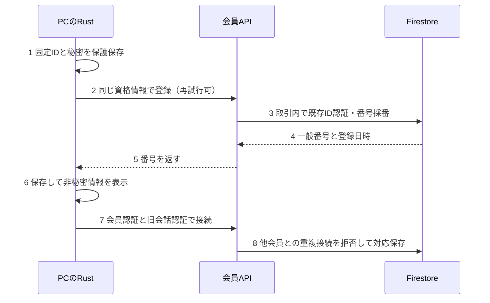
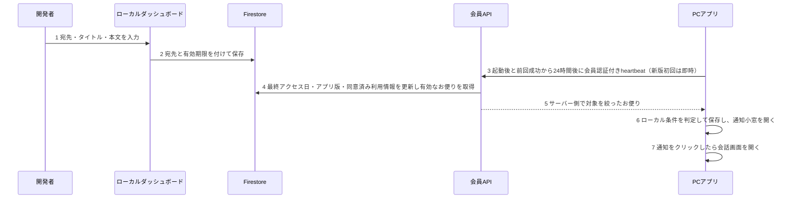

# 009 会員番号と機能利用分析

承認日: 26-09-04。実装中。配信前に本書の実機確認を完了する。

## 1 識別と保存

固定IDをRustで一度だけ生成し、一般番号はサーバーが10000から採番する。有料番号は別枠で将来1から採番し、両方を同じ固定IDに対応付ける。今回は決済接続を行わず、未接続を未購入とは扱わない。番号は認証秘密ではない。再インストール・別PCの同一人物性を番号だけで証明しない。

会員台帳の正本はFirestore、PC側の唯一の実行時状態はRust AppStateとする。資格情報をWindowsで保護し、画面取得・全窓イベント・ログ・分析には秘密を含めない。本番と開発の資格情報、API、採番を分離する。DB未設定時のメモリ代替は禁止。

同一実行ファイルを使う開発署名MSIXとStore用MSIXは実行時のパッケージ名ONFStudios.FUSEN.Dev/ONFStudios.FUSENで環境を分離する。MSIXであるかどうかだけでは判定しない。

通常の同一配布環境でのバージョン更新ではID・資格情報を移行/保持し、番号を再発行しない。保存パスにアプリバージョンを含めない。アンインストール時のデータ保持は未検証で、残存した資格情報を復号できれば同じ番号を取得する。資格情報も消えた場合は新規登録となる。Storeアンインストール/再インストール、Windowsのアプリリセットを別々の実機確認項目とする。試験はユーザーの本番データを使わず隔離環境で行う。会員番号だけでは復元認証を成立させない。

## 2 初回登録と会話接続

```mermaid
sequenceDiagram
    participant PC as PCのRust
    participant API as 会員API
    participant DB as Firestore
    PC->>PC: 1 固定IDと秘密を保護保存
    PC->>API: 2 同じ資格情報で登録（再試行可）
    API->>DB: 3 取引内で既存ID認証・番号採番
    DB-->>API: 4 一般番号と登録日時
    API-->>PC: 5 番号を返す
    PC->>PC: 6 保存して非秘密情報を表示
    PC->>API: 7 会員認証と旧会話認証で接続
    API->>DB: 8 他会員との重複接続を拒否して対応保存
```

図 2-1　初回登録と既存会話の接続

既存投稿APIは履歴取得やDiscord送信より先に会話を認証する。新会話の確保は競合時に上書きせず、既存の秘密ハッシュ・初回日時を保持する。Discordメッセージの索引と返信経路を維持する。

問い合わせ画面と開発者とのやりとり画面には、PC内で取得した一般会員番号を読み取り専用で表示し、問い合わせへ自動付与されることを明示する。投稿時は本文への手入力値を信用せず、認証済み会話IDと会員台帳のサーバー側対応から会員番号を通知へ付与する。会員番号は登録順と登録時期の目安に使用できるが、利用頻度や習熟度そのものとは扱わない。内部の固定IDと分析IDは問い合わせ画面・本文・通知へ表示しない。

## 3 機能利用分析

会員番号の発行と分析同意を分離する。既存GA4同意と会員別分析同意の両方が有効な場合だけ集計する。同意を断っても全機能が利用できる。会員番号はGA4へ送らず、Firestoreに保存するランダムな分析IDをGA4 User-IDとして使用する。

```mermaid
sequenceDiagram
    participant UI as アプリ画面
    participant Rust as Rust AppState
    participant Local as 保護ローカル保存
    participant GA as GA4
    participant API as 会員API
    participant DB as Firestore
    participant Owner as 開発者
    UI->>UI: 1 成功した操作をメモリで加算
    UI-->>Rust: 2 60秒後に複数操作を一括通知
    Rust->>Rust: 3 週別・機能別回数と利用日数をメモリで加算
    Rust-->>Local: 4 5分間隔でバックグラウンド保存
    Rust->>API: 5 常駐中も1日1回のheartbeatにアプリ版と同意済み機能名を同梱
    API->>DB: 6 最終アクセス日、アプリ版、同意済み機能名・累計起動時間を1回で保存
    Rust->>GA: 7 翌週の起動後に前週分だけ送信
    Owner->>API: 8 必要時だけ会員番号を管理者認証で照会
    API->>DB: 9 番号索引から1件を直接検索
    DB-->>Owner: 10 対応する匿名分析ID
    Owner->>GA: 11 匿名分析ID別・全体の週次傾向を確認
```

図 3-1　基本機能を待たせない週次集計

固定機能名、週間使用回数、使用日数、最終使用日、アプリ版、計測版を扱う。週はUTCの月曜日から日曜日までとし、ISO週番号 `YYYY-Www` で識別する。本文・検索語・タグ名・添付内容・パスを送らない。生の操作列は保存しない。Firestoreの会員データには、利用分析に同意した会員について今週使った機能名と累計起動時間を保存する。付箋の本文・検索語・タグ名・画像は保存しない。同意撤回時はPC内の未送信集計を削除し、Firestore側の利用情報も消す。

通常操作ではメモリ上の整数を増やすだけとし、ディスク・GA4・Vercelへアクセスしない。文字入力はキー単位で数えず、保存に成功した編集を1回とする。他の機能も成功時だけ数える。UIからRustへの通知は60秒単位、保護ローカル保存と起動時間の加算は5分単位、会員APIへの同期は常駐中も前回成功から24時間後のheartbeatに同梱し、GA4送信は翌週の起動から60秒経過後とする。同意変更時は次のheartbeatを待たずに利用情報を同期し、同意撤回をFirestoreへ反映する。同期に失敗した場合は次の5分間隔の確認で再試行する。集計の失敗や異常終了直前の欠損を許容し、付箋の表示・入力・保存を失敗または待機させない。

計測未同意、旧版、未起動、送信失敗を利用ゼロと扱わない。週次完了イベントを受信した分析IDだけを分母にする。GA4では個別分析IDの回数と、全体の利用者率・中央値・分布を確認する。会員番号との照合が必要な場合だけ、管理者専用APIをBearer認証して番号索引から1件を直接検索する。APIは一般番号、匿名分析ID、登録日時、有料番号だけを返し、会員ID・認証秘密・利用履歴は返さない。ユーザー向け利用状況画面は追加しない。

## 4 開発者ホットライン

PCのメイン画面は起動後の静穏期間が終わると、分析同意の有無にかかわらず会員認証付きheartbeatを送る。常駐中は約5分ごとに送信要否を確認し、本番環境では前回成功から24時間経過するまで再送しない。ただし新版へ更新後の最初の起動では前回通信から24時間未満でも新版を報告する。開発環境ではお便りの投稿後に約5分以内で確認できる。保存済みのお便りでは会話画面を再度自動で開かない。APIは会員台帳の`lastSeenAt`をUTC日付で更新し、報告されたアプリ版を同じ会員レコードに保存する。版番号を送らない旧版からの通信では版を未報告に戻す。開発者ダッシュボードは今日・過去7日・日付未確認の会員数と、会員番号別の報告版・最終確認日を表示する。ダッシュボードは本番・開発環境とも概要、会員一覧、機能利用、お便りに表示を分ける。概要には版別人数と最大報告版への更新率を全会員・過去7日の通信会員の両方の分母で表示する。会員一覧は報告版・最終通信日・同意済みの累計起動時間を統合し、会員番号検索、版・通信日での絞り込み、並べ替えと25件単位のページ表示を備える。版番号未報告は旧版と断定せず、起動時間の未集計も利用ゼロと扱わない。日付だけを保存するため、厳密な直近24時間は算出しない。更新前のPCや通信していないPCの現行版は確定できない。

開発者はローカルダッシュボードからタイトルとMarkdown本文を投稿する。宛先は全会員、古参会員（会員番号10000〜10049）、新規会員（10100以降）、今週の機能利用あり、今週の機能利用なし（利用分析に同意済み）、または登録済みの会員番号1件を選べる。投稿は30日間有効とする。未登録番号・不明な宛先は保存しない。ダッシュボードでは過去に送信したお便りを期限切れも含めて新しい順に読み出し、日時・宛先・タイトル・本文・配信状態を確認できる。配信中のお便りは確認操作を経て配信停止できる。停止後も履歴と既にPCへ届いたお便りは残し、次回以降の配信対象から外す。個別宛てと会員番号で判定できる区分はAPIでも対象外会員へ本文を返さない。機能利用による区分はPC内にしか判定材料がないため、APIから配信された後にRustで対象判定する。機能利用区分には機密の本文を使わない。

受信したお便りはPC内の保護された会員データに保存し、設定画面の「開発者とのやりとり」に表示する。新着時は通知の小窓だけを出し、通知ボタンを押したときに会話画面へ移動する。通知のボタンまたは閉じるボタンで小窓を閉じてもアプリは終了しない。会話画面には受信件数を明示する。返信先IDが一致するユーザーの返信は、お便りカード内に古い順でまとめる。スレッドは最後の返信時刻で並べ、最近のものを下へ置く。返信先が分からない通常の発言と開発者の発言は独立表示し、推測でスレッドに結び付けない。開いた直後は最新の位置を表示する。お便りカードの直下で返信を入力でき、送信内容にはお便りのタイトルとIDを付けて会話として送信する。会話APIの取得に失敗しても、保存済みのお便り本文は表示する。付箋には追加しない。

```mermaid
sequenceDiagram
    participant Dev as 開発者
    participant Dash as ローカルダッシュボード
    participant DB as Firestore
    participant API as 会員API
    participant PC as PCアプリ
    Dev->>Dash: 1 宛先・タイトル・本文を入力
    Dash->>DB: 2 宛先と有効期限を付けて保存
    PC->>API: 3 起動後と前回成功から24時間後に会員認証付きheartbeat（新版初回は即時）
    API->>DB: 4 最終アクセス日・アプリ版・同意済み利用情報を更新し有効なお便りを取得
    API-->>PC: 5 サーバー側で対象を絞ったお便り
    PC->>PC: 6 ローカル条件を判定して保存し、通知小窓を開く
    PC->>PC: 7 通知をクリックしたら会話画面を開く
```

図 4-1　お便りの宛先指定と常駐中の配信

今週の機能別宛先は、対象の機能を選んで使用・未使用を指定できる。iPhone連携未使用は、今週のiPhone送信と受信がともに記録されていない、利用分析への同意済み会員を対象とする。機能の利用判定はPC内で行い、同意していない会員を未使用と断定しない。

ダッシュボードはFirestoreの会員データにある今週の機能名一覧から、機能ごとの利用人数と全会員比を表示する。全会員比に加えて今週の報告者内比（今週の利用情報が届いた同意済み会員を分母）を表示する。報告者が全利用者を代表するとは限らない。集計情報が届いた会員数と、会員番号別の累計起動時間を併記する。PCは起動時と約5分ごとにheartbeatの要否を確認し、本番環境では前回成功から24時間以上経過したとき、お便り確認・生存確認・同意済みの利用情報を1回のAPI呼び出しで扱う。同意変更時だけ利用情報を別途同期する。同期後に初めて使った機能は次のheartbeatで反映する。

本番・開発とも、利用情報を「使った機能が分かる」「届いたが、機能名なし」「今週分はまだ届いていない」「利用情報の送信がオフ」「情報がなく、まだ分からない」の五つに分ける。状態別人数から会員一覧へ移動し、状態で絞り込める。設定は最後に届いた情報で判定し、現在の設定や未送信理由を断定しない。機能記録がない欄は「届いた情報に記録なし」とし、全会員の未使用を示す0人・0%と混同させない。取得失敗時は前回の集計を保持して失敗を明示する。GA4のグラフは2026-09-08以降のイベント受信件数であり、今週の利用人数や操作回数とは区別する。

## 5 合格条件

2個体の異なる操作が別の分析IDに対応し、全体集計とも一致することを確認する。通常操作でネットワーク通信とディスク書込みが発生しないこと、操作経路の追加処理が10ミリ秒未満であること、集計失敗時も付箋操作が成功することを計測する。同時登録・複数窓・更新・同意撤回・保存失敗・無権限取得も検証する。本番DBの番号保持とGA4週次受信を実際に確認するまでリリースしない。

## 6 改版履歴

| No. | 日付 | 内容 |
|---|---|---|
| 1 | 26-09-04 | 承認済み会員番号・機能集計・開発者レポートの仕様を追加。実装中。 |
| 2 | 26-09-05 | 利用履歴のVercel・Firestore日次送信を廃止。低負荷のローカル月次集計とGA4送信へ変更。 |
| 3 | 26-09-05 | 分析周期を月次から月曜始まりの週次へ変更。ユーザー向け利用状況画面は追加しない。 |
| 4 | 26-09-05 | 会員番号から匿名分析IDを1件だけ取得する管理者認証付き照会を追加。通常ユーザーの通信は増やさない。 |
| 5 | 26-09-06 | 問い合わせ画面に一般会員番号と自動付与を表示。通知の番号は認証済みのサーバー側対応から取得する。 |
| 6 | 26-09-24 | 開発者ホットラインの生存確認、宛先区分、会員番号への個別配信と対象外会員への本文返却防止を追加。 |
| 7 | 26-09-25 | 開発環境では起動ごとにheartbeatを再確認し、本番の1日1回は維持。お便りは開発者とのやりとりに保存・表示し、返信を同じ画面から送る。 |
| 8 | 26-09-26 | 新着お便りの通知小窓と受信件数を追加し、返信入力欄をお便りカードの直下へ移す。 |
| 9 | 26-09-26 | お便りと会話を時刻順で表示し、最新を下に配置。返信に元のお便りを表示する。 |
| 10 | 26-09-26 | お便りへの返信を対応するカード内にまとめ、スレッドの最終更新時刻で表示順を決める。 |
| 11 | 26-09-26 | 通知小窓の終了でアプリを終了させず、会話画面は通知ボタンを押したときだけ開く。 |
| 12 | 26-09-27 | 機能別のお便り宛先、iPhone送受信未使用宛先、機能別利用人数と全会員比のダッシュボード表示を追加。 |
| 13 | 26-09-27 | 会員APIへの利用情報送信を累計起動8時間ごとに抑え、会員別の累計起動時間を追加。同意変更は即時反映する。 |
| 14 | 26-09-27 | 常駐利用を前提に利用情報の送信周期を累計起動24時間ごとへ変更。 |
| 15 | 26-09-27 | 常駐中も毎日お便りを確認。利用情報をheartbeatに同梱し、通常のAPI呼び出しを1日1回に統合。 |
| 16 | 26-09-27 | heartbeatの本番送信間隔をUTC日付境界から前回成功後24時間へ変更。 |
| 17 | 26-09-27 | ダッシュボードに送信済みお便りの履歴と配信停止を追加。 |
| 18 | 26-09-30 | 会員認証付きheartbeatへアプリ版を同梱し、分析同意にかかわらず会員台帳と開発者ダッシュボードで版・確認日を表示。旧版は未報告とする。 |
| 19 | 26-10-06 | 本番・開発ダッシュボードの表示分割、版別集計、会員一覧の検索・25件分割、報告者内比を追加。 |
| 20 | 26-10-07 | 利用情報の五つの状態、状態別会員一覧、記録なし・取得失敗の表示、GA4の期間と単位を明示。 |

