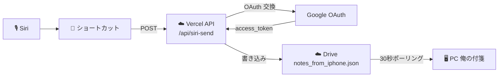

# 📣 200 Siri から PC に付箋を送る

<p class="lead-text">
iPhone の Siri に話しかけるだけで、PC の俺の付箋に新しい付箋を立ち上げる手順です。実験的な先行機能のため、ご利用は自己責任でお願いします。
</p>

<p class="version-info">
ガイド v1.0 / 2026-05-23
</p>

---

## 1 これでできること

「Hey Siri、〇〇」と話しかけて続けてメモ内容を喋ると、約 30 秒以内に PC の画面に付箋がポンッと立ち上がります。

iPhone を取り出して操作する手間がなく、運転中・料理中・買い物中など手が離せないときに「忘れる前に PC に貼る」用途で使えます。

---

## 2 制約と割り切り（先にお読みください）

この機能は **実験的・先行公開** です。次の制約があります。

<p class="table-caption">表 2-1　主な制約</p>

| No | 制約 | 内容 |
|:---:|:---|:---|
| 1 | PWA 履歴に残らない | Siri 経由で送ったメモは iPhone PWA のメモ一覧には表示されません。PC にだけ届きます |
| 2 | iPhone での編集・削除不可 | 上記の理由から、iPhone 側で後から編集・削除できません |
| 3 | 用途は 1 行メモ向き | 「忘れる前に PC に貼る」用途に特化しています。長文・編集中のメモには向きません |
| 4 | iPhone のみ対応 | Android 端末は未対応です |

ログイン・編集を伴うメモは、PWA を普通に開いて書く方を推奨します。

---

## 3 仕組み（ひとことで）



<p class="mermaid-caption">図 3-1　Siri 経由の付箋送信フロー</p>

PWA は経由しません。ショートカットが Vercel API を直接叩き、Vercel が Google Drive の中継ファイルを更新します。PC は普段通り 30 秒ごとに Drive を見ているので、そこに付箋が現れます。

---

## 4 事前準備

<p class="table-caption">表 4-1　準備するもの</p>

| No | 項目 | 確認方法 |
|:---:|:---|:---|
| 1 | iPhone の標準「ショートカット」App | 標準搭載。削除した場合は App Store から再インストール（無料） |
| 2 | iPhone PWA（俺の付箋）がホーム画面に追加済み | 既に普通に使えていれば OK |
| 3 | PWA が Google Drive に接続済み | PWA でログインしていて、過去に PC への送信が成功した経験があれば OK |

---

## 5 セットアップ手順

### 5.1 Siri 用トークン（refresh_token）を取得する

ショートカットに貼り付けるための「トークン」を PWA からコピーします。1 回だけの作業です。

#### 手順

1. iPhone のホーム画面の **俺の付箋 PWA** を起動
2. メモ一覧画面の右上にある **「DBG」** ボタンをタップ
3. 黒い画面（デバッグログビュー）が表示される
4. 画面上部の **「Siri 用トークンをコピー」** をタップ
5. 「コピーしました」と表示されればクリップボードに入っている

<Note type="info">
このトークンは Google Drive へのアクセス許可を表す文字列です。第三者と共有しないでください。トークンが漏れると、第三者があなたの Drive の <code>ore-no-fusen</code> フォルダにアクセスできるようになります。
</Note>

### 5.2 ショートカットの全体構成

iPhone のショートカット App で新規ショートカットを作成し、以下のアクションを順に追加します。

<p class="table-caption">表 5.2-1　ショートカットの構成（全 9 ブロック）</p>

| # | アクション | 役割 |
|:---:|:---|:---|
| 1 | テキストを読み上げ（「メモを送ります」） | 起動時に音声で合図 |
| 2 | テキストを音声入力 | マイクで送信内容を受け取る |
| 3 | URL | API のエンドポイント URL |
| 4 | URL の内容を取得 | POST + JSON ボディで API を呼ぶ |
| 5 | If（`URL の内容 が次を含む :true の場合`） | 成功判定 |
| 6 | テキストを読み上げ（「送れました」） | If の内側 |
| 7 | その他の場合 | 失敗側の分岐 |
| 8 | テキストを読み上げ（「送れませんでした」） | その他の場合の内側 |
| 9 | If 文の終了 | 分岐の終わり |

If・その他の場合・If 文の終了は、「If」を 1 つ追加すると 3 つまとめて挿入されます。

### 5.3 各アクションの具体的な設定

#### ステップ 1：起動時の音声

1. アクション検索で「**テキストを読み上げ**」を追加
2. テキスト欄に `メモを送ります` と入力
3. アクション設定の「**音声**」が **オン** になっていることを確認（オフだと無音）

#### ステップ 2：音声入力

1. アクション検索で「**テキストを音声入力**」を追加
2. 設定はデフォルトのまま（言語が日本語であることを確認）

#### ステップ 3：URL

1. アクション検索で「**URL**」を追加
2. URL 欄に以下を貼り付け：

```
https://ore-no-fusen.vercel.app/api/siri-send
```

#### ステップ 4：URL の内容を取得（POST + JSON）

1. アクション検索で「**URL の内容を取得**」を追加（URL 入力はステップ 3 の変数が自動で参照されます）
2. **「方法」** を **POST** に変更
3. **「本文を要求」** を **JSON** に変更
4. **「新規フィールドを追加」→ テキスト** で 2 つのフィールドを順に追加：

<p class="table-caption">表 5.3-1　JSON ボディに含めるフィールド</p>

| キー | 値 |
|:---|:---|
| `text` | 変数 **「音声入力されたテキスト」** を選ぶ |
| `refresh_token` | 5.1 でコピーした **長い英数字の文字列** をペースト |

<Note type="warning">
<code>text</code> の値には URL エンコード処理を挟まないでください。挟むと PC に届く付箋が <code>%E3%81%AF...</code> のように文字化けします。
</Note>

#### ステップ 5：If 分岐の条件

1. アクション検索で「**If**」を追加（「その他の場合」「If 文の終了」も自動で挿入される）
2. If の条件部分の左辺「**何か**」をタップ → **変数を選択** → **「URL の内容」** を選ぶ
3. 「URL の内容」の右に小さい型選択（ファイル / ファイルサイズ / ファイルパス…）が出るので、**「テキスト」** に変更する
4. 比較演算子を **「が次を含む」** に変更
5. 右辺に `:true` と入力（コロン付き）

これで「API のレスポンス JSON に `:true` が含まれていれば成功」と判定できます。失敗時のレスポンスは `"ok":false` なので `:true` を含まず、その他の場合に分岐します。

#### ステップ 6：成功時の音声（If の内側）

1. **「If 〜含む :true の場合」と「その他の場合」のあいだ**にアクションを追加
2. 「**テキストを読み上げ**」を追加し、テキスト欄に `送れました` と入力
3. 音声設定が **オン** であることを確認

#### ステップ 7：失敗時の音声（その他の場合の内側）

1. **「その他の場合」と「If 文の終了」のあいだ**にアクションを追加
2. 「**テキストを読み上げ**」を追加し、テキスト欄に `送れませんでした` と入力
3. 音声設定が **オン** であることを確認

### 5.4 ショートカットの名前と Siri 起動フレーズ

ショートカット名がそのまま Siri の起動フレーズになります。

<Note type="warning">
意味のある日本語（「付箋」「メモ」「送信」など）を含む名前は、Siri が辞書検索・他アプリの命令と誤認することがあります。「<strong>あいうえお</strong>」「<strong>はひふへほ</strong>」のような<strong>意味のない造語</strong>のほうが認識精度が高いことを実機検証で確認しています。
</Note>

おすすめの名前：
- `はひふへほ`
- `あいうえお`
- `オレフセン`（造語）

ショートカット App でショートカット名を上記のような造語に変更してください。

---

## 6 使い方

1. iPhone に向かって「**Hey Siri、はひふへほ**」のように起動フレーズを言う
2. Siri：「メモを送ります」と読み上げてマイク待機
3. 送りたい内容を喋る（例：「ぎゅうにゅうかう」）
4. ショートカットが API を呼び出す
5. 約 30 秒以内に PC の画面に付箋が立ち上がる
6. Siri：「送れました」または「送れませんでした」と読み上げ

---

## 7 トラブルシュート

<p class="table-caption">表 7-1　よくあるトラブルと対処</p>

| No | 症状 | 原因 | 対処 |
|:---:|:---|:---|:---|
| 1 | Siri が「わたしには理解できません」と返す | ショートカット名が一般語で Siri が認識できない | 造語にする（例：「はひふへほ」） |
| 2 | Siri が地図検索や Web 検索を返す | 同上 | 同上 |
| 3 | 送れませんでしたと読み上げられる | refresh_token が無効・期限切れ | 5.1 を再実行してトークンを取り直す |
| 4 | PC に付箋が来ない（音声は成功） | PC アプリが停止している、Drive 接続が切れている | PC アプリを起動、Drive 再接続 |
| 5 | 文字化けして付箋が立つ（`%E3%81...` のような表示） | `text` フィールドに URL エンコード済みのテキストを入れている | ステップ 4 を見直し、`text` の値を「**音声入力されたテキスト**」直接にする |
| 6 | 「ネットワーク接続が切れました」エラー | iPhone のネット切れ、または JSON ボディの設定不備 | Wi-Fi/モバイル通信を確認、JSON ボディの値を見直す |
| 7 | 音声が無音 | テキストを読み上げの「音声」設定が OFF | アクション設定で音声 ON に切り替え |
| 8 | 失敗時も「送れました」と読み上げる | If の条件が `true` のみで `:true` になっていない | ステップ 5 を見直し、右辺を `:true`（コロン付き）にする |

---

## 8 プライバシー

Siri 経由で送ったメモ本文は、Vercel のサーバーを **POST リクエストのボディ** として通過しますが、Vercel のアクセスログには記録されません。Vercel のリクエストボディは標準ではログ保存されない仕様です。

ログに残るのは「リクエストの時刻」「ステータスコード」「実行時間」のみで、本文・トークンの中身は残りません。

詳細は [100 プライバシーポリシー](/100_PRIVACY) を参照してください。

---

## 9 改版履歴

<div class="history-table">
<p class="table-caption">表 9-1　改版履歴</p>

| No | バージョン | 日付 | 変更内容 |
|:---|:---|:---|:---|
| 1 | 1.0 | 26-05-23 | 初版作成。実験的な先行機能として公開。 |

</div>
