# 俺の付箋 - アーキテクチャ・設計仕様 (Architecture & Design Specifications)

本ドキュメントは、アプリケーションの主要な動作フローやシステム間連携のブロック図・シーケンス図をまとめた設計資料です。
各機能の詳細な要求仕様については `007_REQUIREMENTS_v2.0.md` を参照してください。

---

## 目次

- [改版履歴](#改版履歴)
- [0. 技術スタック](#0-技術スタック-technology-stack)
- [1. 構造図](#1-構造図-architecture-diagram)
- [2. クラス図](#2-クラス図-class-diagram)
- [3. シーケンス図](#3-シーケンス図-sequence-diagrams)
  - [3.1 アプリケーション起動シーケンス](#31-アプリケーション起動シーケンス)
  - [3.2 自動リネームフロー](#32-自動リネームフロー)
  - [3.3 画像キャプチャフロー](#33-画像キャプチャフロー)
  - [3.4 全文検索フロー](#34-全文検索フロー)
- [4. ER図](#4-er図-entity-relationship-diagram)
- [5. Google Drive ファイル仕様](#5-google-drive-ファイル仕様)
  - [5.1 ライフサイクル一覧](#51-ライフサイクル一覧)
  - [5.2 データ構造](#52-データ構造)
  - [5.3 VAPID 鍵設計について](#53-vapid-鍵設計について)
- [6. iPhone連携フロー](#6-iphone連携フロー)
  - [6.1 PC→iPhone 送信フロー（v2.0）](#61-pciphone-送信フローv20)
    - [A. 初回セットアップ](#a-初回セットアップsafariで1回だけ)
    - [B. PC側の準備](#b-pc側の準備tauriアプリ起動時)
    - [C. 付箋を送る（日常利用）](#c-付箋を送る日常利用)
  - [6.2 iPhone→PC 送信フロー（v3.0）](#62-iphonepc-送信フローv30)
  - [6.3 viewer 画面遷移](#63-viewer-画面遷移)

---

## 改版履歴

| バージョン | 日付 | 変更内容 |
|---|---|---|
| 1.0 | 2026-04-08 | 初版。Google Drive ファイル仕様・ライフサイクル表・VAPID鍵設計意図を含む。以降はこのファイルを唯一の設計書として更新する |
| 1.1 | 2026-04-08 | セクション6追加。iPhone連携フロー（PC→iPhone v2.0 / iPhone→PC v3.0 / viewer画面遷移）を iphone_01〜04 HTML設計書よりマージ |
| 1.2 | 2026-04-08 | 6.2・6.3 を実装に合わせて更新。「iPhoneに置いておく」→「新規付箋」ボタン名変更。バッジ色を保存済み（グレー）・PC受信（薄藍）・送信済み（薄青）に変更 |
| 1.3 | 2026-04-10 | 1.1「画面とソースファイルの対応」追加（PC マルチウィンドウ構造・iPhone PWA 構成）。4.1「iPhone側データ構造」追加（DraftRecord / IphoneNote / FusenNoteItem）。notes_to_iphone.json に tags フィールド追記 |
| 1.4 | 2026-04-15 | 6.1C を現在の実装に合わせて更新。Service Worker が push 受信後に Drive から body_rich を取得・IndexedDB 保存するフローを追加。通知タップ時は IndexedDB から読む設計に変更 |
| 1.5 | 2026-04-15 | 実装メモ（Phase 6/7）・③責務変化図・6.2全体フロー図を削除。セクション0を表に変換。タイムスタンプをUTC→JST（+09:00）に変更 |
| 1.6 | 2026-04-15 | 6.1C push受信フローを更新。SW が body_rich 取得後に fusen_img_* 画像 Blob もダウンロードして IndexedDB に保存。通知タップ時は Drive アクセスなしで表示完結 |

---

## 0. 技術スタック (Technology Stack)

| カテゴリ | 技術 | 用途 |
|---|---|---|
| アプリ基盤 | Tauri v2 | クロスプラットフォームGUI。WebviewとRustバックエンドの連携 |
| フロントエンド | React 18 / Next.js 14 (App Router) | UI構築・ルーティング |
| フロントエンド | TypeScript | 型安全な開発 |
| フロントエンド | Tailwind CSS | スタイリング |
| フロントエンド | Radix UI | Headless UIコンポーネント |
| フロントエンド | CodeMirror 6 | Markdownエディタ（ハイライト・検索） |
| バックエンド | Rust (Edition 2021) | コアロジック |
| バックエンド | arboard | クリップボード連携（画像取得） |
| バックエンド | rodio | UIサウンド・通知音 |
| バックエンド | windows / tauri-plugin-os | Win32 API・OSネイティブ操作 |
| バックエンド | std::fs + serde | ファイルシステム永続化（JSON/Markdown） |
| テスト | Vitest | フロントエンド・ロジックテスト |
| テスト | Playwright | E2E（UI結合）テスト |

---

## 1. 構造図 (Architecture Diagram)
全体像としてのフロントエンドとバックエンドの関連図です。

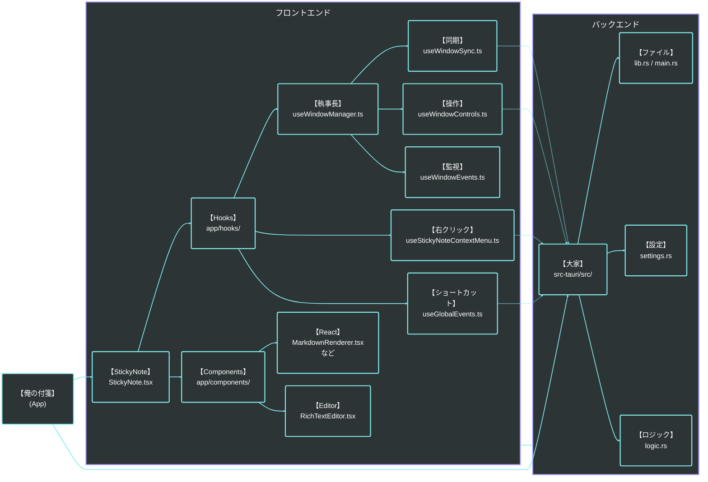

---

## 1.1 画面とソースファイルの対応

本アプリは Next.js App Router を使っており、URL パスごとに `page.tsx` が分かれている。

| 画面 | URL | ソースファイル | 実行環境 |
|------|-----|---------------|---------|
| メインウィンドウ（トレイ・設定・検索） | `/` | `app/page.tsx` | PC（Tauri WebView） |
| 付箋ウィンドウ 1枚ごと | `/` と同じ URL（別 WebView ウィンドウ） | `app/components/StickyNote.tsx` | PC（Tauri マルチウィンドウ） |
| iPhone PWA | `/viewer` | `app/viewer/page.tsx` | iPhone Safari（PWA） |

### PC のマルチウィンドウの仕組み

```
Tauri 起動
  └── メインウィンドウ (app/page.tsx)
        ├── 付箋A用 WebviewWindow → StickyNote.tsx を読み込む
        ├── 付箋B用 WebviewWindow → StickyNote.tsx を読み込む
        └── 付箋C用 WebviewWindow → StickyNote.tsx を読み込む
```

- Tauri が付箋1枚ごとに `WebviewWindow` を生成する
- 各ウィンドウは独立したプロセスで `StickyNote.tsx` を表示する
- ウィンドウ間の状態同期は Rust `AppState` と Tauri イベント経由で行う（フロントエンドに状態を持たない）

### iPhone PWA の構成

```
/viewer (app/viewer/page.tsx)  ← 約2000行・全画面を1ファイルで管理
  ├── SimpleNoteBody.tsx        ← 一覧カードの本文表示（Mermaid図含む）
  ├── editor-helpers.ts         ← 編集画面のヘルパー関数
  └── utils.ts                  ← 共通ユーティリティ
```

---

## 2. クラス図 (Class Diagram)
コアとなる付箋データと各管理マネージャーの依存関係・操作フローです。

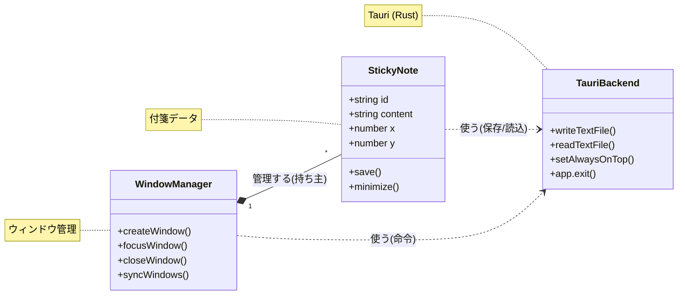

---

## 3. シーケンス図 (Sequence Diagrams)

### 3.1 アプリケーション起動シーケンス
アプリ起動から、Vaultスキャン、トレイ常駐、および前回開いていた付箋ウィンドウの復元までの流れを示します。

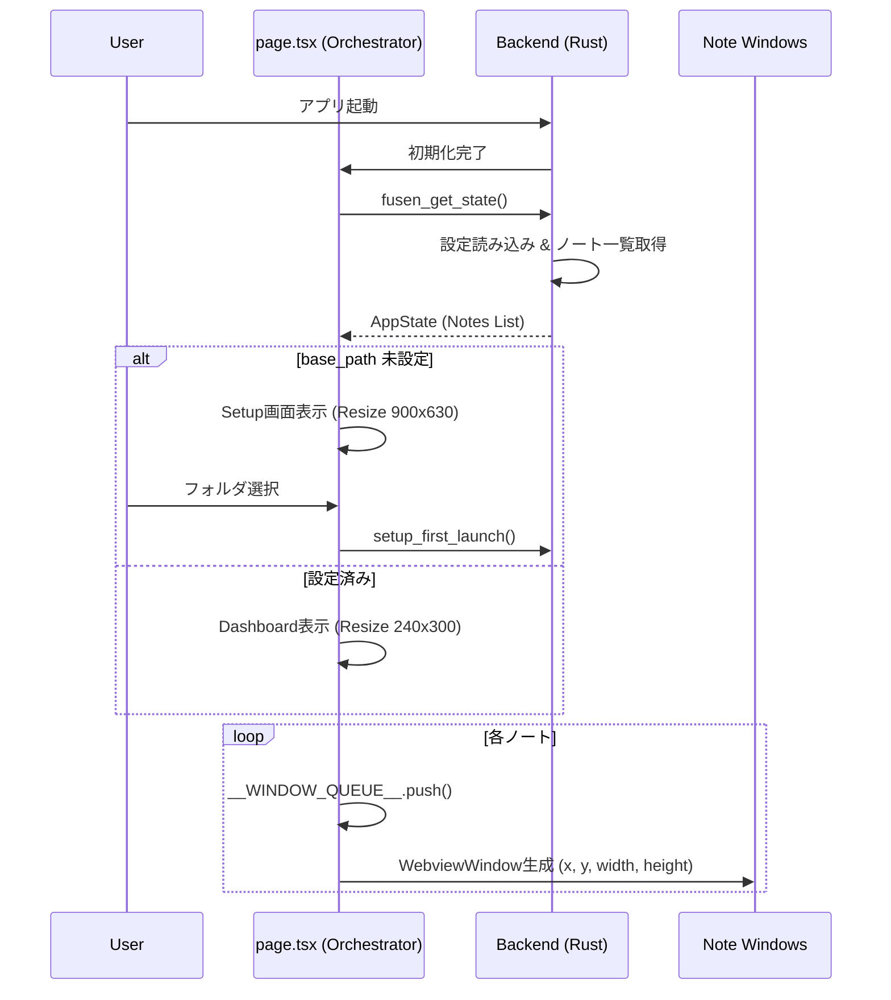

---

### 3.2 自動リネームフロー
本文の1行目を「コンテキストファイル名」として採用し、ユーザーのファイル管理の手間を省くための非同期リネーム処理の流れです。

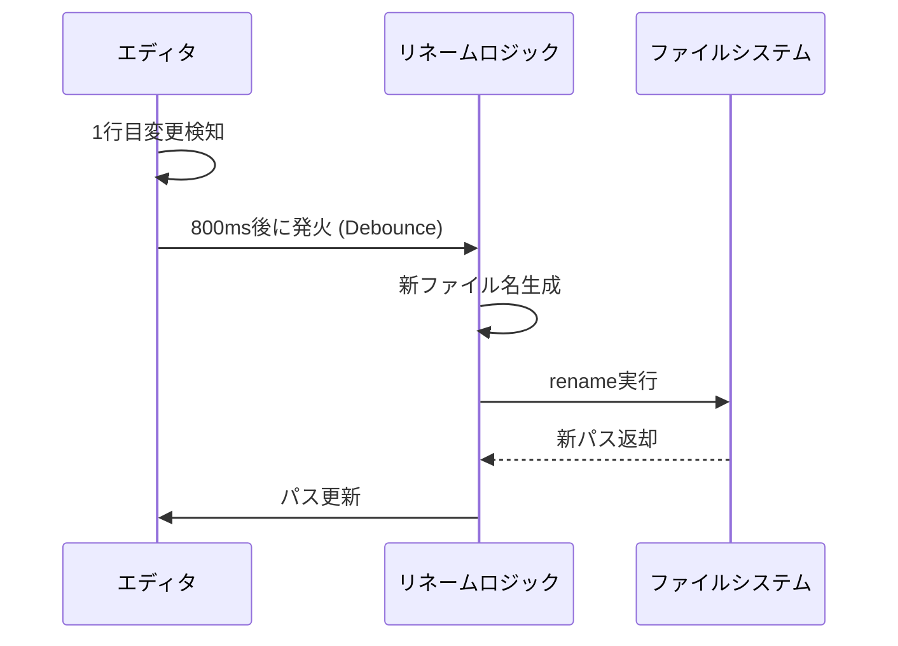

---

### 3.3 画像キャプチャフロー
OS内蔵のスクリーンショットツール（Snipping Tool等）を呼び出し、撮影された画像を自動でVault内の `assets/` フォルダへ格納する流れです。

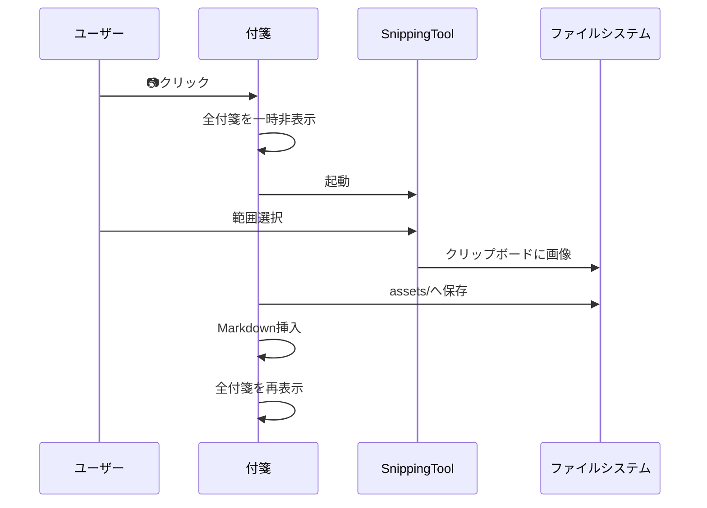

---

### 3.4 全文検索フロー
Grep同等の高速検索を行い、結果リストから対象付箋へのフォーカスとハイライトを行うまでのプロセスです。

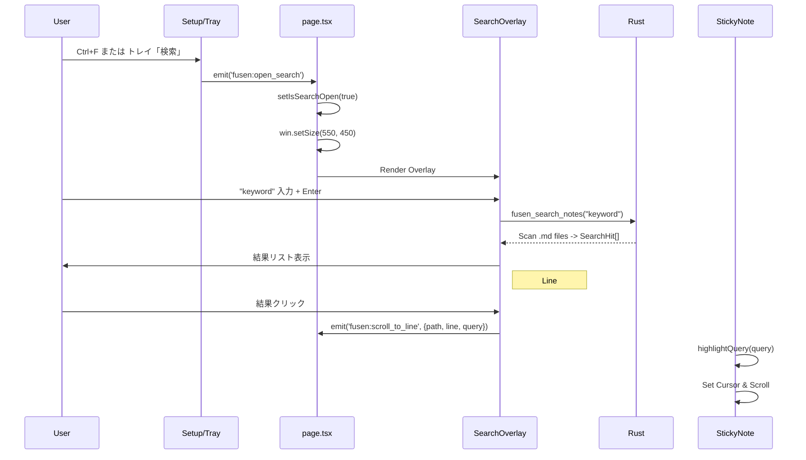

---

## 4. ER図 (Entity-Relationship Diagram)
フロントエンドへ渡されるデータ（`NoteMeta` / `Note`）、およびバックエンド設定（`Settings`）の構造的な関係性です。（現状の実装に基づいて最適化しています）

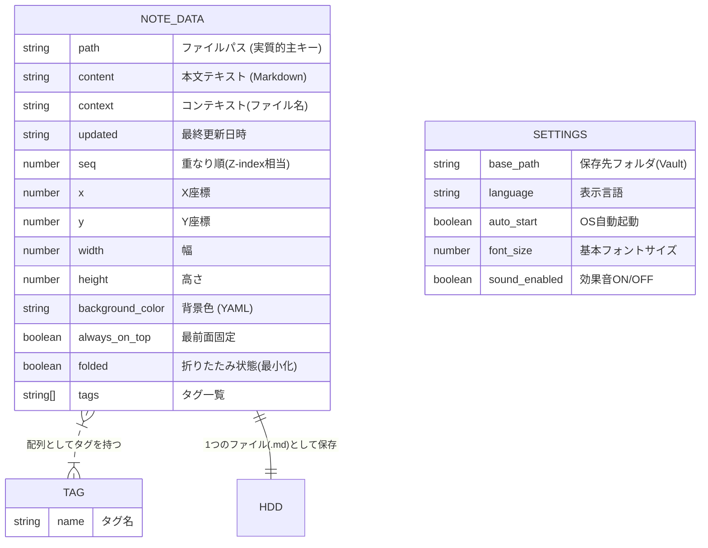

---

## 4.1 iPhone側データ構造

iPhone PWA（`app/viewer/page.tsx`）で扱うデータ型の一覧。

### DraftRecord — iPhone ローカル保存データ（IndexedDB）

iPhone 内の IndexedDB（`fusen-drafts` ストア）に保存される。Drive は使わない。

```ts
type DraftRecord = {
  id: string;            // ノートID（UUID）
  title: string;         // タイトル（例: "# 買い物リスト"）
  body: string;          // 本文（Markdown）
  created_at: string;    // 作成日時（ISO 8601 例: "2026-04-10T14:30:00.000+09:00"）
  images: {
    fileName: string;    // 例: "fusen_img_20260410_143000_メモ_1.jpg"
    blob: Blob;          // 画像の生データ（iPhoneローカルのみ。Driveには送信時にアップロード）
  }[];
  tags?: string[];       // タグ（例: ["仕事", "メモ"]）
  received_pc?: true;    // PCから受信したメモに付くフラグ
  sent_at?: string;      // PCに送信した日時（ISO 8601）
  locked?: true;         // 🔔ロック画面に表示中（Phase 13）
};
```

**ISO 8601** とは日時の国際標準フォーマット。末尾の `Z` は UTC（世界標準時）、`+09:00` は JST（日本標準時）を表す。現在は `nowJST()`（`app/viewer/utils.ts`）で JST 固定。**世界対応時は `nowJST()` をタイムゾーン対応の関数に差し替えるだけでよい。**

### IphoneNote — 一覧画面の表示用データ

`DraftRecord`（IndexedDB）と Drive の送信済みデータをマージして画面に表示するための型。保存はしない。

```ts
type IphoneNote = {
  id: string;
  status: 'sent'        // PCに送信済み
        | 'draft'       // 下書き（未送信）
        | 'received_pc' // PCから受信
  title: string;
  body: string;
  created_at: string;   // ISO 8601
  sent_at?: string;     // ISO 8601
  tags?: string[];
};
```

### FusenNoteItem — Google Drive 経由で PC→iPhone に届くデータ

`notes_to_iphone.json` の各アイテム。PC が送信し、iPhone が受け取る。

```ts
type FusenNoteItem = {
  id: string;
  title: string;
  body: string;
  tags: string[];            // PC付箋のタグ（frontmatterから取得）
  sent_at: string;           // PCが送った日時（ISO 8601）
  received_at: string | null; // iPhoneが受け取った日時（null = 未受信）
};
```

---

## 5. Google Drive ファイル仕様

Drive の `ore-no-fusen` フォルダ内に置かれる JSON ファイルの仕様。

**Drive はすべて中継所。** 大本データは PC ローカル（Markdown ファイル）または iPhone ローカル（IndexedDB）にある。Drive にしか存在しないデータはない。全ファイルを削除しても本体データは失われない。

---

### 5.1 ライフサイクル一覧

| ファイル名 | 何のデータか | いつ作られるか | どこで作られるか | いつ消されるか | 消えた場合の影響 |
|---|---|---|---|---|---|
| `notes_to_iphone.json` | PC→iPhone 送信キュー（最新20件） | PC から「iPhoneに送る」を実行したとき | PC アプリ | iPhone viewer でアイテムを削除したとき（アイテム単位） | 次の「iPhoneに送る」実行時に再作成。未受信データは消える |
| `notes_from_iphone.json` | iPhone→PC 送信キュー | iPhone viewer で「PCに送る」を実行したとき | iPhone viewer | （自動削除なし・アイテムに received_at が付くのみ） | 次の「PCに送る」実行時に再作成。未受信データは消える |
| `push_devices.json` | iPhone のプッシュ通知デバイス登録情報 | iPhone viewer で初回セットアップを完了したとき | iPhone viewer | （自動削除なし） | PC からプッシュ通知が届かなくなる。iPhone で再セットアップすれば復元 |
| `push_keys.json` | VAPID 鍵ペア（プッシュ通知の送信元認証鍵） | PC アプリが Google 連携を設定したとき（初回のみ） | PC アプリ | （自動削除なし） | PC ローカルにも同じ鍵があるため通常は復元される。**鍵が変わることは、ほぼ、実運用上はない**（OS再インストール後にDriveも誤削除した場合のみ）。万一変わった場合は push_devices.json が無効になるため iPhone で再セットアップが必要 |

---

### 5.2 データ構造

#### notes_to_iphone.json

```json
{
  "items": [
    {
      "id": "uuid-v4",
      "title": "付箋のタイトル（frontmatter の title）",
      "body": "本文（ローカル画像は base64 data URI に変換済み）",
      "tags": ["タグ1", "タグ2"],
      "sent_at": "2026-04-08T10:00:00Z",
      "received_at": "2026-04-08T10:01:00Z"
    }
  ]
}
```

- `received_at` は iPhone viewer が受信した時刻。未受信アイテムは `received_at` なし
- `tags` は PC 付箋の frontmatter から取得（Phase 13 で追加）
- ローカル画像は iPhone で表示できるよう base64 data URI に埋め込み済み
- 件数制限: 最新 20 件のみ保持（PC アプリが送信時に超過分を削除）

#### notes_from_iphone.json

```json
{
  "items": [
    {
      "id": "uuid-v4",
      "title": "タイトル",
      "body": "本文（画像参照は fusen_img_*.jpg 形式）",
      "sent_at": "2026-04-08T10:00:00Z",
      "received_at": "2026-04-08T10:01:00Z",
      "tags": ["タグ1", "タグ2"]
    }
  ]
}
```

- `received_at` は PC アプリが受信した時刻。未受信アイテムは `received_at` なし
- 画像は Drive に別途アップロードされた `fusen_img_*.jpg` を参照。PC 受信後にローカル保存し Drive から削除
- 旧スキーマ互換: `{ "id": "...", "title": "...", "body": "..." }` の単一オブジェクト形式も読める

#### push_devices.json

```json
{
  "devices": [
    {
      "endpoint": "https://api.push.apple.com/3/device/...",
      "keys": {
        "p256dh": "base64url...",
        "auth": "base64url..."
      },
      "created_at": "2026-04-08T10:00:00Z"
    }
  ]
}
```

- デバイスを追加するたびに upsert（件数制限なし）
- 旧スキーマ互換: `{ "endpoint": "...", "keys": {...} }` の単一デバイス形式も読める

#### push_keys.json

```json
{
  "public_key_b64url": "base64url...",
  "private_key_b64url": "base64url...",
  "subject": "mailto:ore-no-fusen@example.com"
}
```

- PC ローカル（`%LOCALAPPDATA%/ore-no-fusen/push_keys.json`）にも同じ内容を保存
- Drive は別 PC への引き継ぎ用バックアップ。ローカルに鍵がない PC は Drive からダウンロードする

---

### 5.3 VAPID 鍵設計について（重要: ユーザーごとに異なる・開発者の鍵ではない）

一般的な Web サービスでは VAPID 鍵は開発者が1サービスに1セット持つ。**俺の付箋はこの設計を採用していない。**

| | 一般的な Web サービス | 俺の付箋 |
|---|---|---|
| 誰が生成 | 開発者（1サービスに1セット） | ユーザーの PC（初回起動時に自動生成） |
| 誰が保持 | 開発者のサーバー | ユーザーの PC ローカル＋自分の Drive |
| 誰が使う | 全ユーザーへ通知を送るサーバー | 自分の iPhone にだけ送る自分の PC |

この設計の理由は MVP の土台である**プライバシー**と**独立性**に基づく：
- 中央サーバーが存在しないため、開発者はユーザーの通知内容を知ることができない
- ユーザーのデータはユーザー自身の Google Drive のみを経由する
- 開発者のサーバー障害や運用停止がユーザーの通知機能に影響しない

---

## 6. iPhone連携フロー

### 6.1 PC→iPhone 送信フロー（v2.0）

PC 側から付箋を送り、iPhone のロック画面に通知として届けるまでの全体シーケンス。

#### A. 初回セットアップ（Safari で1回だけ）

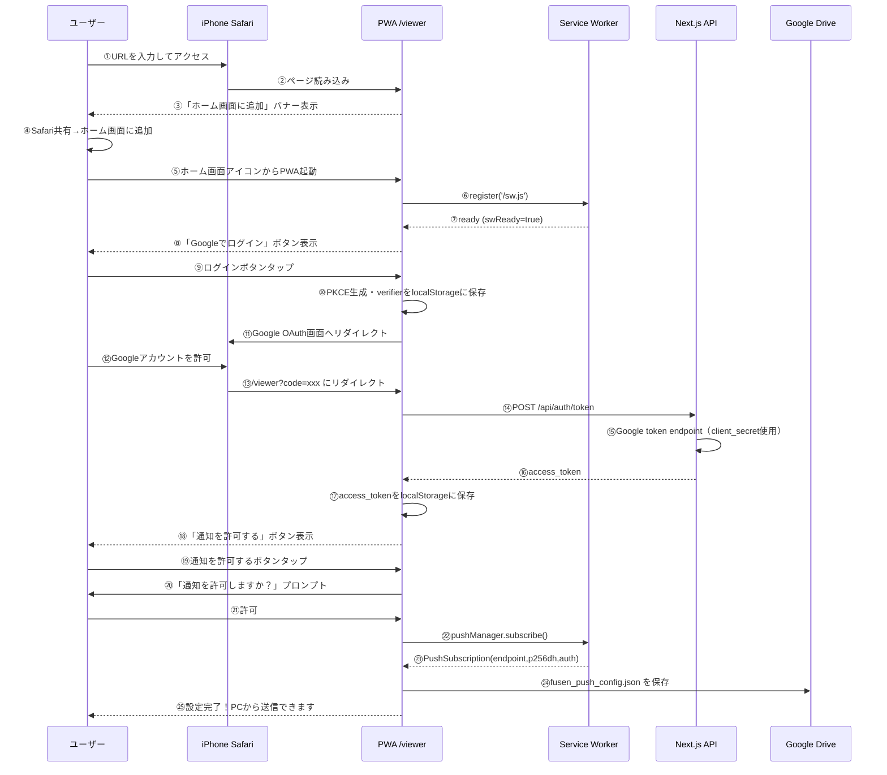

#### B. PC側の準備（Tauriアプリ起動時）

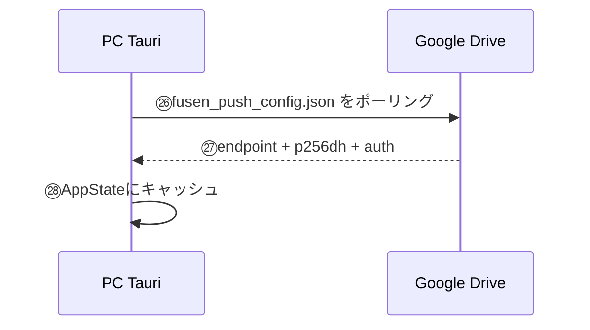

#### C. 付箋を送る（日常利用）

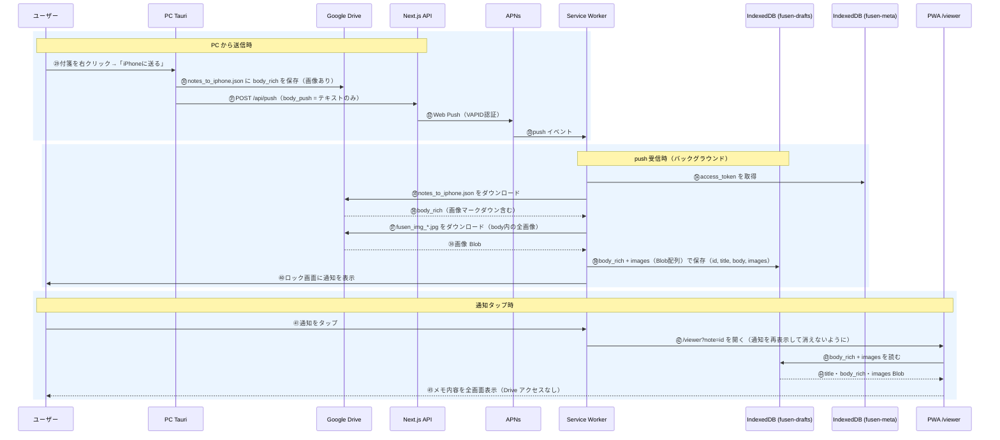

---

### 6.2 iPhone→PC 送信フロー（v3.0）

iPhone viewer で書いた内容を Google Drive 経由で PC に送り、自動的に新規付箋として開くまでのフロー。全要件10件・Phase 6〜7 完了済み（2026-03-31）。

#### 要件一覧

| ID | カテゴリ | 要件 | Phase |
|---|---|---|---|
| SEND-01 | 送信 | iPhoneでテキストを入力して「PCに送る」で付箋をDriveに送信できる | 6 |
| SEND-02 | 送信 | 「新規付箋」で現在の内容を保存し、白紙エディタで継続入力できる（PCには送らない） | 6 |
| SEND-03 | 送信 | 画像追加ボタンでカメラ/ライブラリから写真を付箋に添付できる（Driveアップロード・カーソル位置に挿入） | 6 |
| SEND-04 | 送信 | Mermaidボタンでコード入力欄+プレビューを開き、本文に ` ```mermaid ` ブロックとして挿入できる | 6 |
| HIST-01 | 履歴 | 送信後に送信済み+下書きの履歴リストを表示できる（最新10件、sent/draft 区別） | 6 |
| HIST-02 | 履歴 | 履歴から下書きを選んで編集・送信できる | 6 |
| REND-01 | 描画 | viewer内で ` ```mermaid ` コードブロックを図（SVG）として描画できる | 6 |
| POLL-01 | PC受信 | PCがDriveを30秒間隔でポーリングして新着iPhoneノートを検出できる | 7 |
| POLL-02 | PC受信 | 新着ノートをPC側で自動的に新規付箋ウィンドウとして開ける | 7 |
| POLL-03 | PC受信 | 重複受信防止（received_atマーク＋last_seen_idによるスキップ） | 7 |

#### Phase 6 詳細 — iPhone送信UI

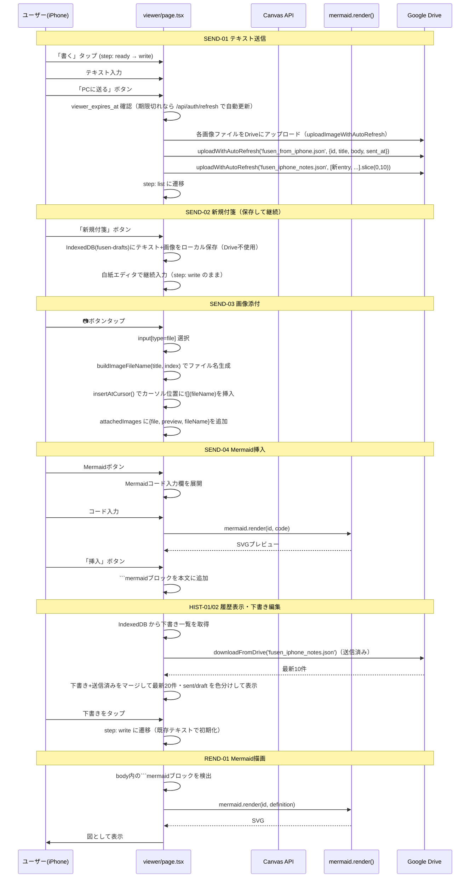

#### Phase 7 詳細 — PC受信（Rust polling）

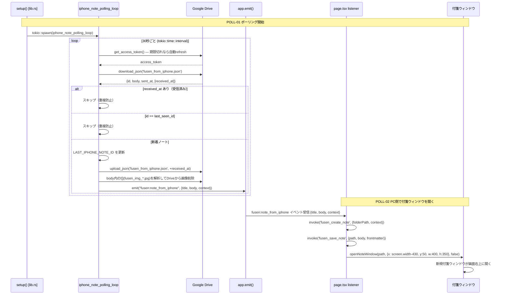

---

### 6.3 viewer 画面遷移

iPhone viewer（`app/viewer/page.tsx`）の画面状態遷移図（フェーズ24以降の最新版）。

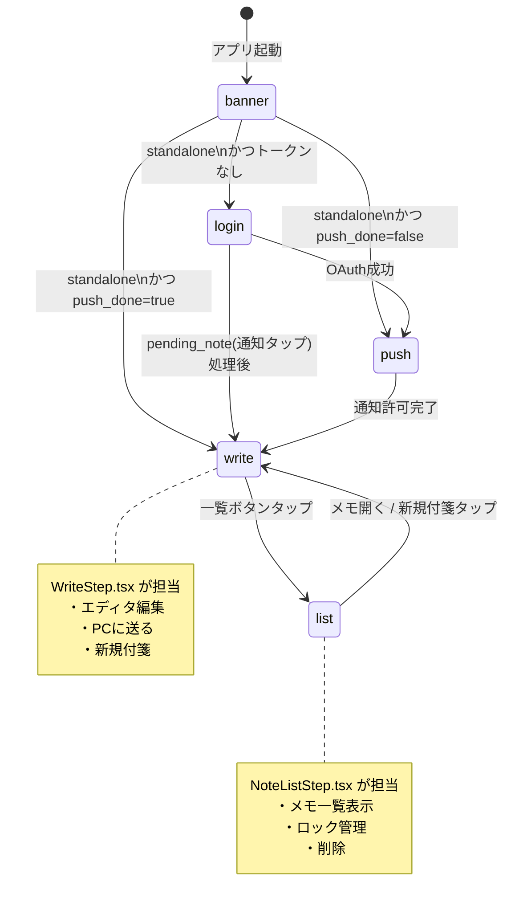

| 画面 | 担当コンポーネント | 説明 |
|---|---|---|
| `login` | `page.tsx` (内包) | 初回のみ。Google OAuth でログイン |
| `push` | `PushStep.tsx` | 初回のみ。プッシュ通知の許可を取得 |
| `write` | `WriteStep.tsx` | **ホーム画面**。テキスト・画像・Mermaid 入力。ログイン済みなら常にここから始まる |
| `list` | `NoteListStep.tsx` | 履歴一覧。PC受信（薄藍）/ 保存済み（グレー）/ 送信済み（薄青）をバッジで区別。ロック切り替え |

---

### 6.4 iPhone Viewer アプリケーションアーキテクチャ

`app/viewer/page.tsx` の肥大化を防ぐため、状態管理（オーケストレーター）、ビジネスロジック（hooks）、UI（Step/Modal コンポーネント）、外部連携（lib）へ分離する「バケツリレー型アーキテクチャ」を採用しています。

#### ① コンポーネント依存関係（全体像）

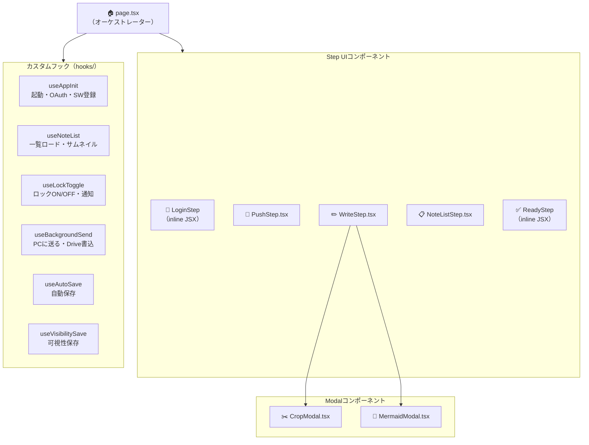

#### ② フック → 外部連携モジュール (lib/) のデータフロー

`app/viewer/lib/indexeddb.ts` を「ローカルアプリケーションの真実の情報源 (SSOT)」として扱い、Drive通信も最終的にはIndexedDBの更新に帰結する設計です。これにより、オフラインでの即時起動と表示（0.5秒起動）を実現しています。

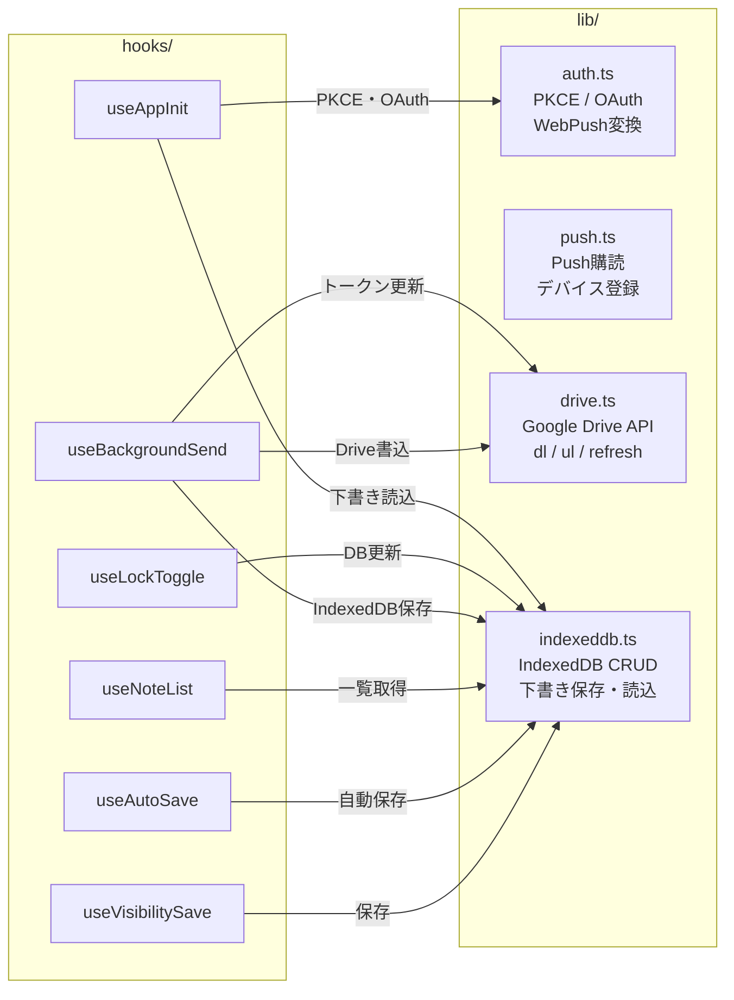

