# 俺の付箋 - アーキテクチャ・設計仕様 (Architecture & Design Specifications)

本ドキュメントは、アプリケーションの主要な動作フローやシステム間連携のブロック図・シーケンス図をまとめた設計資料です。
各機能の詳細な要求仕様については `007_REQUIREMENTS_v2.0.md` を参照してください。

---

## 目次

- [改版履歴](#改版履歴)
- [0. 技術スタック](#0-技術スタック-technology-stack)
- [1. 構造図](#1-構造図-architecture-diagram)
- [2. クラス図](#2-クラス図-class-diagram)
- [3. シーケンス図](#3-シーケンス図-sequence-diagrams)
  - [3.1 アプリケーション起動シーケンス](#31-アプリケーション起動シーケンス)
  - [3.2 自動リネームフロー](#32-自動リネームフロー)
  - [3.3 画像キャプチャフロー](#33-画像キャプチャフロー)
  - [3.4 全文検索フロー](#34-全文検索フロー)
- [4. ER図](#4-er図-entity-relationship-diagram)
- [5. Google Drive ファイル仕様](#5-google-drive-ファイル仕様)
  - [5.1 ライフサイクル一覧](#51-ライフサイクル一覧)
  - [5.2 データ構造](#52-データ構造)
  - [5.3 VAPID 鍵設計について](#53-vapid-鍵設計について)
- [6. iPhone連携フロー](#6-iphone連携フロー)
  - [6.1 PC→iPhone 送信フロー（v2.0）](#61-pciphone-送信フローv20)
  - [6.2 iPhone→PC 送信フロー（v3.0）](#62-iphonepc-送信フローv30)
  - [6.3 viewer 画面遷移](#63-viewer-画面遷移)

---

## 改版履歴

| バージョン | 日付 | 変更内容 |
|---|---|---|
| 1.0 | 2026-04-08 | 初版。Google Drive ファイル仕様・ライフサイクル表・VAPID鍵設計意図を含む。以降はこのファイルを唯一の設計書として更新する |
| 1.1 | 2026-04-08 | セクション6追加。iPhone連携フロー（PC→iPhone v2.0 / iPhone→PC v3.0 / viewer画面遷移）を iphone_01〜04 HTML設計書よりマージ |
| 1.2 | 2026-04-08 | 6.2・6.3 を実装に合わせて更新。「iPhoneに置いておく」→「新規付箋」ボタン名変更。バッジ色を保存済み（グレー）・PC受信（薄藍）・送信済み（薄青）に変更 |

---

## 0. 技術スタック (Technology Stack)

本アプリケーションは、パフォーマンスとクロスプラットフォーム対応（主にWindows最適化）を両立させるため、以下の技術を選定・活用しています。

### 0.1 アプリケーション基盤
- **フレームワーク**: Tauri v2
  - クロスプラットフォームGUI構築フレームワーク。WebviewとRustバックエンドの連携を担当。

### 0.2 フロントエンド (UI / UX)
- **コア**: React 18 / Next.js 14 (App Router)
- **言語**: TypeScript
- **スタイリング**: Tailwind CSS
- **UIコンポーネント**: Radix UI (Headless UIによるアクセシビリティ確保)
- **アイコン**: Lucide React
- **エディタ実装**: CodeMirror 6 (マークダウンハイライト、検索等の高度なテキスト操作)

### 0.3 バックエンド (Core Logic)
- **言語**: Rust (Edition 2021)
- **クリップボード連携**: `arboard` (画像等データの取得)
- **音声再生**: `rodio` (UIサウンド、通知音の提供)
- **OSネイティブ操作**: `windows` (Win32 API連携)、`tauri-plugin-os`, `tauri-plugin-global-shortcut`
- **データ永続化**: ファイルシステム (`std::fs`, `serde` によるJSON/Markdown直書き)

### 0.4 テスト・品質保証
- **フロントエンド・ロジックテスト**: Vitest (V8 Coverage)
- **E2E（UI結合）テスト**: Playwright

---

## 1. 構造図 (Architecture Diagram)
全体像としてのフロントエンドとバックエンドの関連図です。

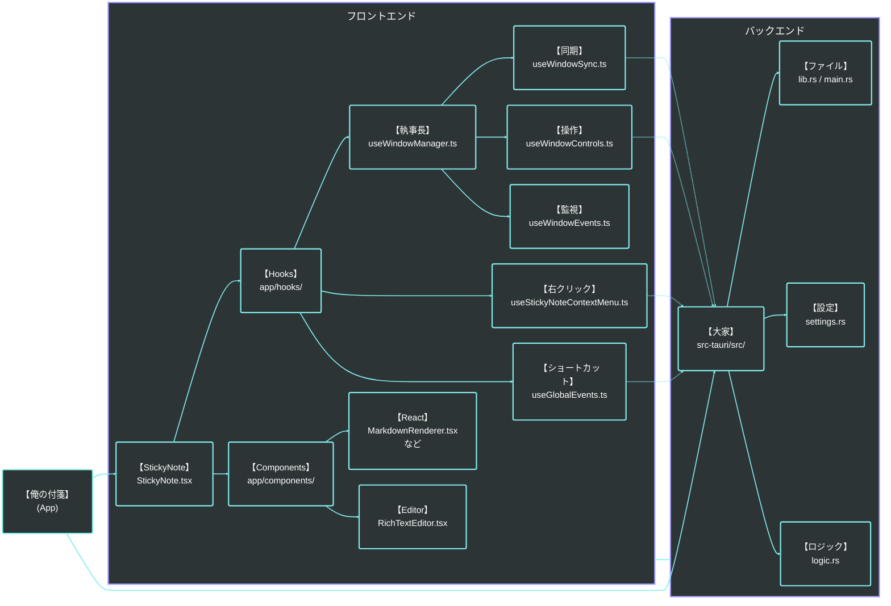

---

## 2. クラス図 (Class Diagram)
コアとなる付箋データと各管理マネージャーの依存関係・操作フローです。

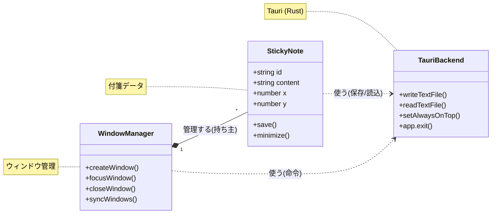

---

## 3. シーケンス図 (Sequence Diagrams)

### 3.1 アプリケーション起動シーケンス
アプリ起動から、Vaultスキャン、トレイ常駐、および前回開いていた付箋ウィンドウの復元までの流れを示します。

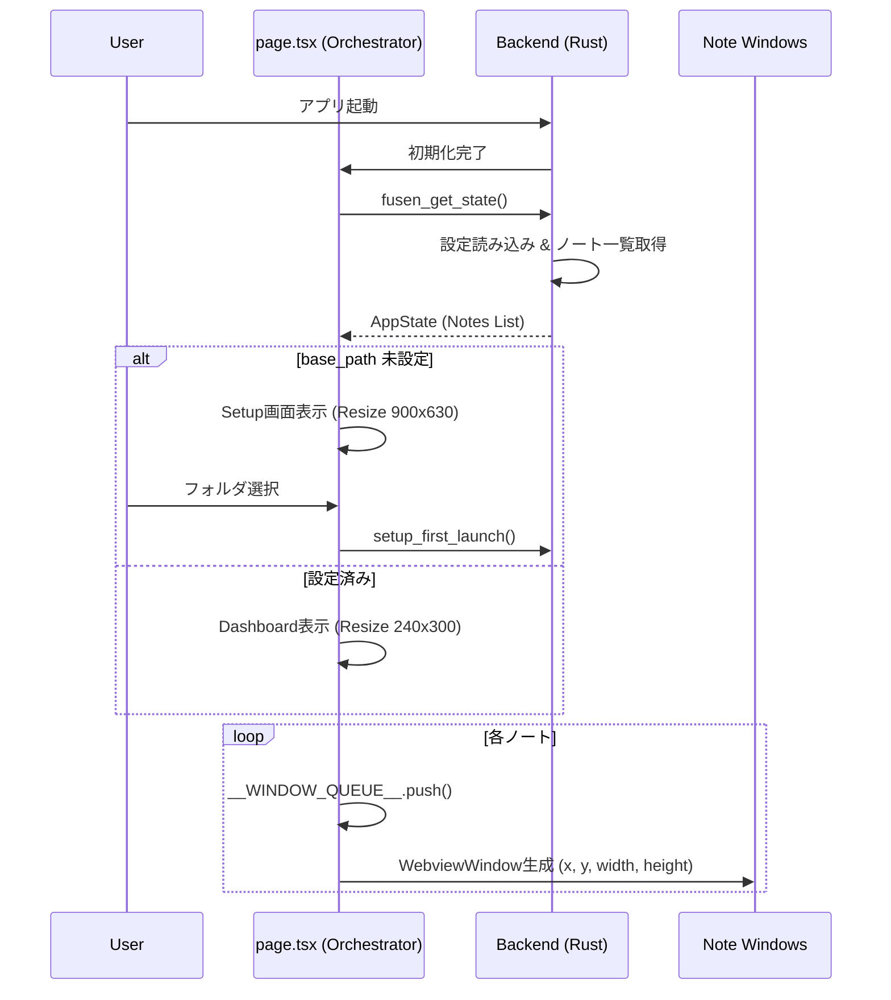

---

### 3.2 自動リネームフロー
本文の1行目を「コンテキストファイル名」として採用し、ユーザーのファイル管理の手間を省くための非同期リネーム処理の流れです。

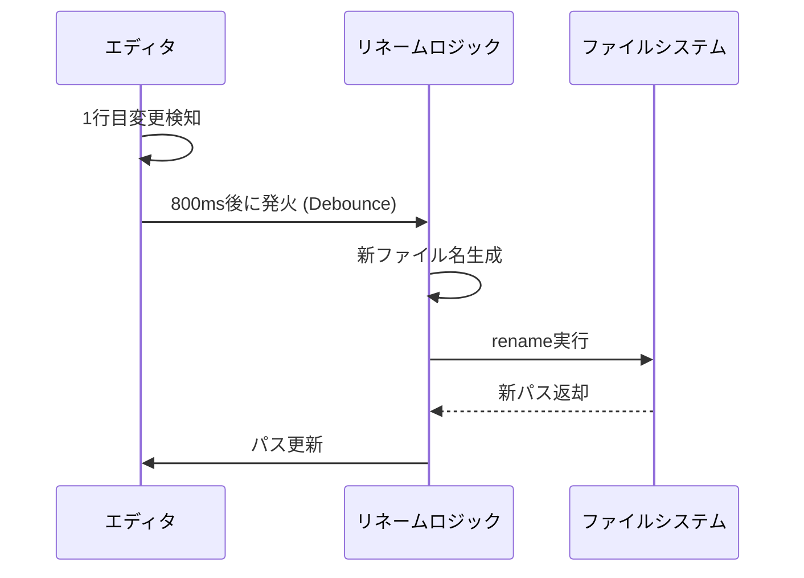

---

### 3.3 画像キャプチャフロー
OS内蔵のスクリーンショットツール（Snipping Tool等）を呼び出し、撮影された画像を自動でVault内の `assets/` フォルダへ格納する流れです。

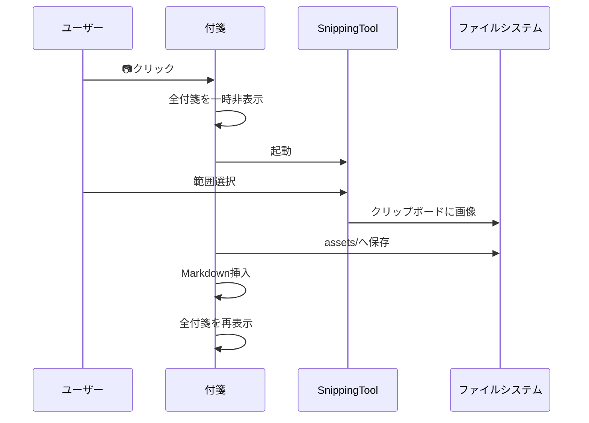

---

### 3.4 全文検索フロー
Grep同等の高速検索を行い、結果リストから対象付箋へのフォーカスとハイライトを行うまでのプロセスです。

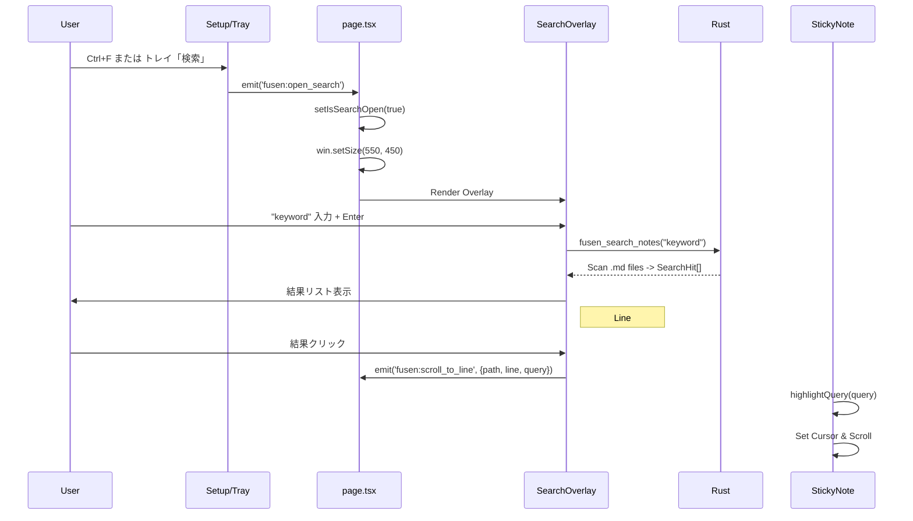

---

## 4. ER図 (Entity-Relationship Diagram)
フロントエンドへ渡されるデータ（`NoteMeta` / `Note`）、およびバックエンド設定（`Settings`）の構造的な関係性です。（現状の実装に基づいて最適化しています）

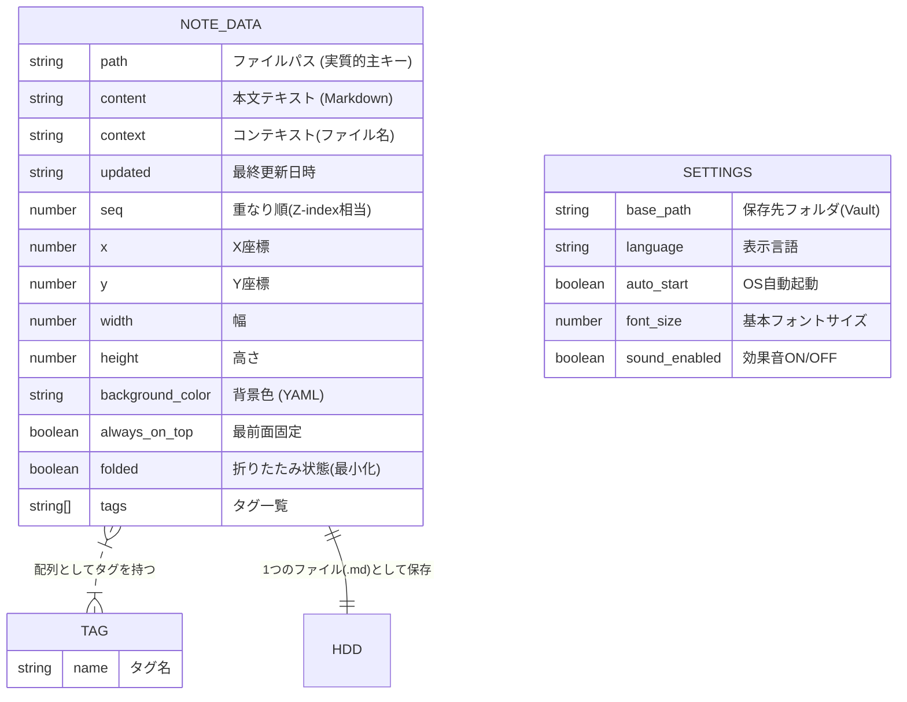

---

## 5. Google Drive ファイル仕様

Drive の `ore-no-fusen` フォルダ内に置かれる JSON ファイルの仕様。

**Drive はすべて中継所。** 大本データは PC ローカル（Markdown ファイル）または iPhone ローカル（IndexedDB）にある。Drive にしか存在しないデータはない。全ファイルを削除しても本体データは失われない。

---

### 5.1 ライフサイクル一覧

| ファイル名 | 何のデータか | いつ作られるか | どこで作られるか | いつ消されるか | 消えた場合の影響 |
|---|---|---|---|---|---|
| `notes_to_iphone.json` | PC→iPhone 送信キュー（最新20件） | PC から「iPhoneに送る」を実行したとき | PC アプリ | iPhone viewer でアイテムを削除したとき（アイテム単位） | 次の「iPhoneに送る」実行時に再作成。未受信データは消える |
| `notes_from_iphone.json` | iPhone→PC 送信キュー | iPhone viewer で「PCに送る」を実行したとき | iPhone viewer | （自動削除なし・アイテムに received_at が付くのみ） | 次の「PCに送る」実行時に再作成。未受信データは消える |
| `push_devices.json` | iPhone のプッシュ通知デバイス登録情報 | iPhone viewer で初回セットアップを完了したとき | iPhone viewer | （自動削除なし） | PC からプッシュ通知が届かなくなる。iPhone で再セットアップすれば復元 |
| `push_keys.json` | VAPID 鍵ペア（プッシュ通知の送信元認証鍵） | PC アプリが Google 連携を設定したとき（初回のみ） | PC アプリ | （自動削除なし） | PC ローカルにも同じ鍵があるため通常は復元される。**鍵が変わることは、ほぼ、実運用上はない**（OS再インストール後にDriveも誤削除した場合のみ）。万一変わった場合は push_devices.json が無効になるため iPhone で再セットアップが必要 |

---

### 5.2 データ構造

#### notes_to_iphone.json

```json
{
  "items": [
    {
      "id": "uuid-v4",
      "title": "付箋のタイトル（frontmatter の title）",
      "body": "本文（ローカル画像は base64 data URI に変換済み）",
      "sent_at": "2026-04-08T10:00:00Z",
      "received_at": "2026-04-08T10:01:00Z"
    }
  ]
}
```

- `received_at` は iPhone viewer が受信した時刻。未受信アイテムは `received_at` なし
- ローカル画像は iPhone で表示できるよう base64 data URI に埋め込み済み
- 件数制限: 最新 20 件のみ保持（PC アプリが送信時に超過分を削除）

#### notes_from_iphone.json

```json
{
  "items": [
    {
      "id": "uuid-v4",
      "title": "タイトル",
      "body": "本文（画像参照は fusen_img_*.jpg 形式）",
      "sent_at": "2026-04-08T10:00:00Z",
      "received_at": "2026-04-08T10:01:00Z",
      "tags": ["タグ1", "タグ2"]
    }
  ]
}
```

- `received_at` は PC アプリが受信した時刻。未受信アイテムは `received_at` なし
- 画像は Drive に別途アップロードされた `fusen_img_*.jpg` を参照。PC 受信後にローカル保存し Drive から削除
- 旧スキーマ互換: `{ "id": "...", "title": "...", "body": "..." }` の単一オブジェクト形式も読める

#### push_devices.json

```json
{
  "devices": [
    {
      "endpoint": "https://api.push.apple.com/3/device/...",
      "keys": {
        "p256dh": "base64url...",
        "auth": "base64url..."
      },
      "created_at": "2026-04-08T10:00:00Z"
    }
  ]
}
```

- デバイスを追加するたびに upsert（件数制限なし）
- 旧スキーマ互換: `{ "endpoint": "...", "keys": {...} }` の単一デバイス形式も読める

#### push_keys.json

```json
{
  "public_key_b64url": "base64url...",
  "private_key_b64url": "base64url...",
  "subject": "mailto:ore-no-fusen@example.com"
}
```

- PC ローカル（`%LOCALAPPDATA%/ore-no-fusen/push_keys.json`）にも同じ内容を保存
- Drive は別 PC への引き継ぎ用バックアップ。ローカルに鍵がない PC は Drive からダウンロードする

---

### 5.3 VAPID 鍵設計について（重要: ユーザーごとに異なる・開発者の鍵ではない）

一般的な Web サービスでは VAPID 鍵は開発者が1サービスに1セット持つ。**俺の付箋はこの設計を採用していない。**

| | 一般的な Web サービス | 俺の付箋 |
|---|---|---|
| 誰が生成 | 開発者（1サービスに1セット） | ユーザーの PC（初回起動時に自動生成） |
| 誰が保持 | 開発者のサーバー | ユーザーの PC ローカル＋自分の Drive |
| 誰が使う | 全ユーザーへ通知を送るサーバー | 自分の iPhone にだけ送る自分の PC |

この設計の理由は MVP の土台である**プライバシー**と**独立性**に基づく：
- 中央サーバーが存在しないため、開発者はユーザーの通知内容を知ることができない
- ユーザーのデータはユーザー自身の Google Drive のみを経由する
- 開発者のサーバー障害や運用停止がユーザーの通知機能に影響しない

---

## 6. iPhone連携フロー

### 6.1 PC→iPhone 送信フロー（v2.0）

PC 側から付箋を送り、iPhone のロック画面に通知として届けるまでの全体シーケンス。

#### A. 初回セットアップ（Safari で1回だけ）

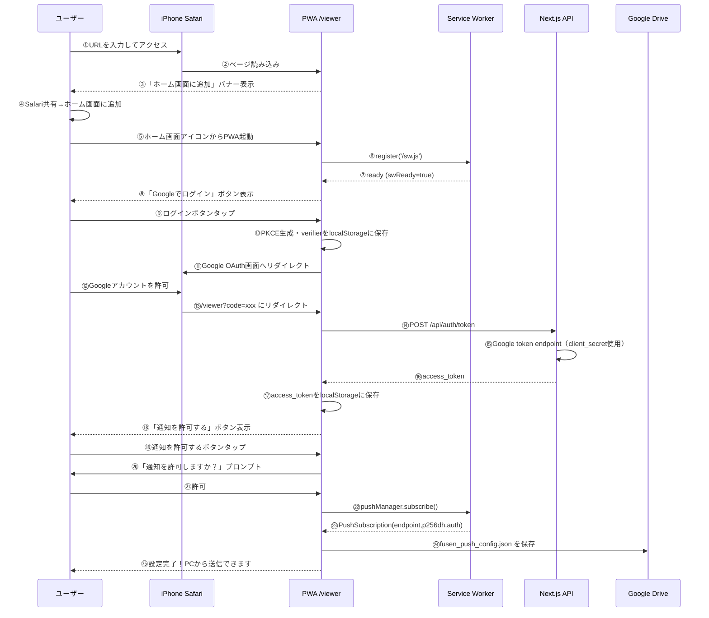

#### B. PC側の準備（Tauriアプリ起動時）

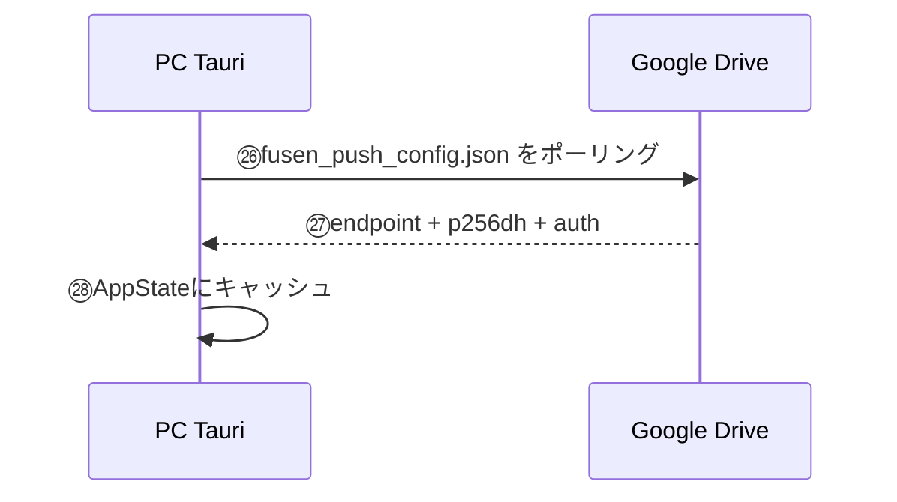

#### C. 付箋を送る（日常利用）

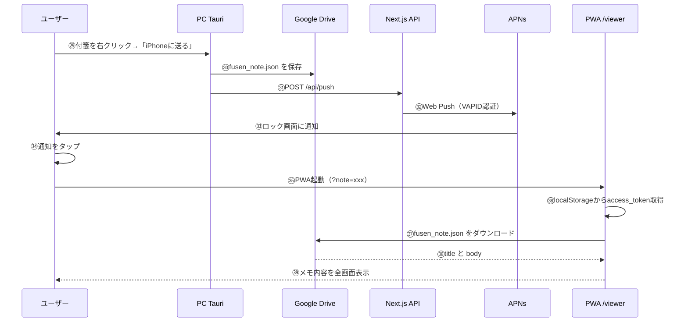

---

### 6.2 iPhone→PC 送信フロー（v3.0）

iPhone viewer で書いた内容を Google Drive 経由で PC に送り、自動的に新規付箋として開くまでのフロー。全要件10件・Phase 6〜7 完了済み（2026-03-31）。

#### 要件一覧

| ID | カテゴリ | 要件 | Phase |
|---|---|---|---|
| SEND-01 | 送信 | iPhoneでテキストを入力して「PCに送る」で付箋をDriveに送信できる | 6 |
| SEND-02 | 送信 | 「新規付箋」で現在の内容を保存し、白紙エディタで継続入力できる（PCには送らない） | 6 |
| SEND-03 | 送信 | 画像追加ボタンでカメラ/ライブラリから写真を付箋に添付できる（Driveアップロード・カーソル位置に挿入） | 6 |
| SEND-04 | 送信 | Mermaidボタンでコード入力欄+プレビューを開き、本文に ` ```mermaid ` ブロックとして挿入できる | 6 |
| HIST-01 | 履歴 | 送信後に送信済み+下書きの履歴リストを表示できる（最新10件、sent/draft 区別） | 6 |
| HIST-02 | 履歴 | 履歴から下書きを選んで編集・送信できる | 6 |
| REND-01 | 描画 | viewer内で ` ```mermaid ` コードブロックを図（SVG）として描画できる | 6 |
| POLL-01 | PC受信 | PCがDriveを30秒間隔でポーリングして新着iPhoneノートを検出できる | 7 |
| POLL-02 | PC受信 | 新着ノートをPC側で自動的に新規付箋ウィンドウとして開ける | 7 |
| POLL-03 | PC受信 | 重複受信防止（received_atマーク＋last_seen_idによるスキップ） | 7 |

#### 全体フロー（iPhone → Drive → PC）

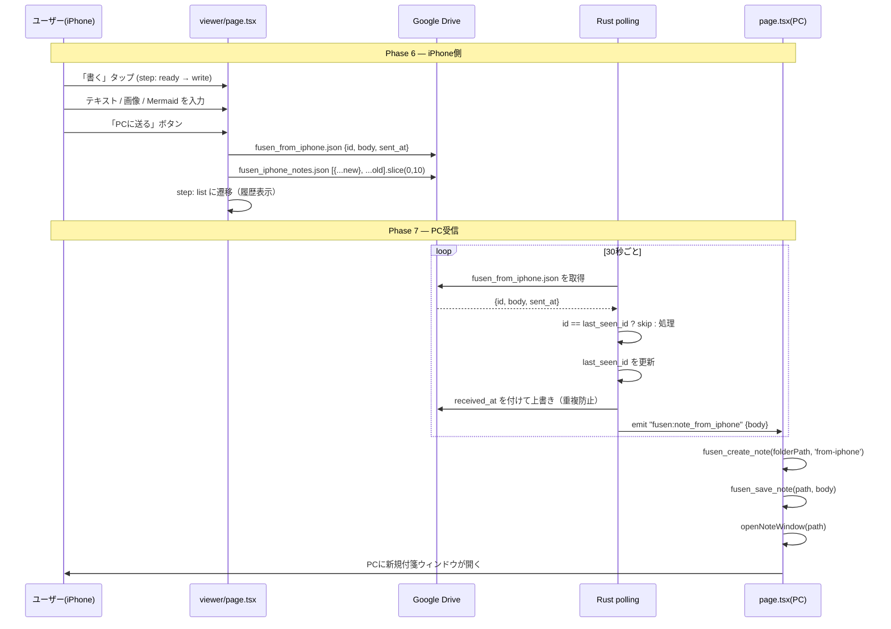

#### Phase 6 詳細 — iPhone送信UI

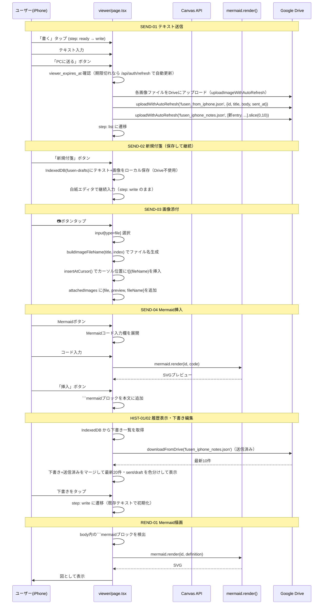

**実装メモ（Phase 6）**:
- 変更ファイル: `app/viewer/page.tsx`（step型に 'write'/'list'/'note' 追加）
- 新規ファイル: `app/viewer/SimpleNoteBody.tsx`（Mermaid図描画コンポーネント）
- 下書き保存: IndexedDB（`fusen-drafts`）にテキスト+画像BlobをiPhoneローカルに保存。Drive不使用
- 画像ファイル名: `fusen_img_YYYYMMDD_HHMMSS_コンテキスト_N.jpg`（buildImageFileName()）
- トークン自動更新: 送信前に `viewer_expires_at` 確認 → 期限切れなら `/api/auth/refresh` で更新

#### Phase 7 詳細 — PC受信（Rust polling）

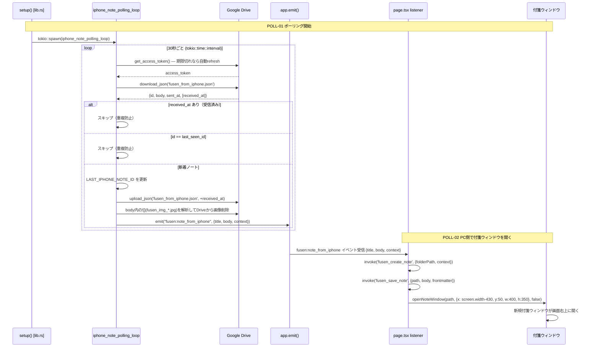

**実装メモ（Phase 7）**:
- 変更ファイル: `src-tauri/src/lib.rs`（poll_iphone_note() + LAST_IPHONE_NOTE_ID + setup()内spawn）
- 変更ファイル: `src-tauri/src/gdrive.rs`（delete_file_by_name() 追加）
- 変更ファイル: `app/page.tsx`（fusen:note_from_iphone / fusen:drive_disconnected / drive_connected リスナー）
- Cargo.toml: `tokio features = ["rt", "time"]` + `tauri-plugin-notification = "2"`
- POLL-03: received_atフィルタ + LAST_IPHONE_NOTE_ID static Mutex で二重受信防止

---

### 6.3 viewer 画面遷移

iPhone viewer（`app/viewer/page.tsx`）の画面状態遷移図。

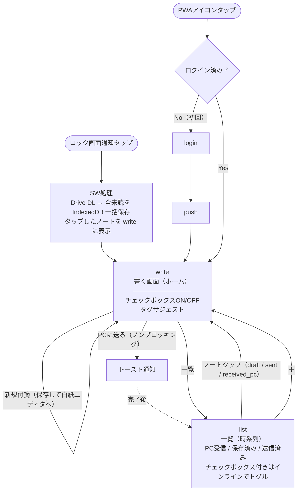

**画面状態の説明**:

| 画面 | 説明 |
|---|---|
| `login` | 初回のみ。Google OAuth でログイン |
| `push` | 初回のみ。プッシュ通知の許可を取得 |
| `write` | **ホーム画面**。テキスト・画像・Mermaid 入力。ログイン済みなら常にここから始まる |
| `list` | 履歴一覧。PC受信（薄藍）/ 保存済み（グレー）/ 送信済み（薄青）をバッジで区別。チェックボックスはインラインでトグル可能 |
