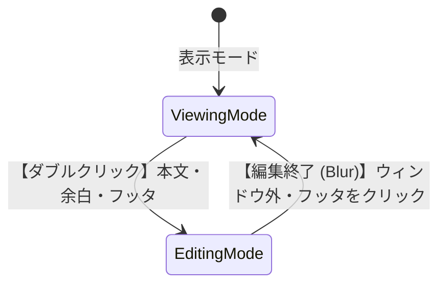

# UI インタラクション仕様書

付箋アプリにおける「クリック・ドラッグ・ダブルクリック」等の操作仕様を定義します。

---

## 1. モード定義

このアプリケーションには大きく分けて2つの状態が存在します。

> [!NOTE] 
> - **表示モード (閲覧中)**: 付箋の内容を読んでいる状態。Markdownとして綺麗にレンダリングされています。
> - **編集モード (執筆中)**: 実際に文字を書き込んでいる状態。カーソルが点滅し、背景が半透明の白になります。

---

## 2. 操作領域の定義

ウィンドウ内の「どこを」クリックするかによって、システムはユーザーの意図を判断します。

```text
┌──────────────────────────────────────────┐
│ [ ヘッダ領域 ]                           │
├──────────────────────────────────────────┤
│ ┌──────────────────────────────────────┐ │
│ │ [ テキスト ]      (A) [ エディタ余白 ] │ │
│ │ [ 長いテキスト ]  (A) [ エディタ余白 ] │ │
│ │                 (A) [ エディタ余白 ] │ │ <- 改行のみの行
│ └──────────────────────────────────────┘ │
├──────────────────────────────────────────┤
│ (B) [ フッタ領域 ]                       │
│ (※文字は絶対に存在しない下部の空間)      │
└──────────────────────────────────────────┘
```

| 領域 | 定義とユーザーの意図 |
|:---|:---|
| **[エディタ本文]** | 実際に文字が存在する場所。リンクなども含みます。<br>▶ *「ここを直接操作したい/書き換えたい」* |
| **(A) [エディタ余白]** | 文字・行の「右側」や「左側」に広がる、枠線内の空白。<br>▶ *「この行の続きや、近くから書き込みたい」* |
| **(B) [フッタ領域]** | 一番最後の行より「下」にある、完全に何もない空間。**ここはエディタ外の扱いです。**<br>▶ *「一番下から新しく追記したい」または「編集を終わらせたい」* |

---

## 3. インタラクション・マトリックス

各操作と結果の対応表です。見たい操作の表を確認してください。

### 🖱️ ワンクリック

> [!TIP]
> 表示モードでは、文字以外をクリックしても何も起きません（ドラッグ移動の誤爆を防ぐためです）。

| クリックした場所 | 表示モード (閲覧中) | 編集モード (執筆中) |
|:---|:---|:---|
| **[エディタ本文]** | (何もしない) ※ドラッグ準備 | **カーソル移動** (その文字へ移動) |
| **(A) [エディタ余白]** | (何もしない) ※ドラッグ準備 | **カーソル移動** (一番近い文字へ移動) |
| **(B) [フッタ領域]** | (何もしない) ※ドラッグ準備 | **編集終了** (モードを抜ける) |
| **[リンク]** | **リンクを開く** (ブラウザ等) | **カーソル移動** (リンクの文字へ移動) |
| **[ウィンドウ外]** | **フォーカス解除** | **編集終了** (保存して表示モードへ) |

### 🖱️🖱️ ダブルクリック

> [!IMPORTANT]
> ダブルクリックは「編集を開始する」ための最も基本となる操作です。

| ダブルクリックした場所 | 表示モード (閲覧中) | 編集モード (執筆中) |
|:---|:---|:---|
| **[エディタ本文]** | **[ 編集開始 ]**<br>クリックした文字から編集を始める | **単語選択** |
| **(A) [エディタ余白]** | **[ 編集開始 ]**<br>一番近い文字から編集を始める | - |
| **(B) [フッタ領域]** | **[ 編集開始 ]**<br>全体の**一番下（文末）**から編集を始める | - |

### ✋ ドラッグ（押しっぱなしで移動）

| ドラッグした場所 | 表示モード (閲覧中) | 編集モード (執筆中) |
|:---|:---|:---|
| **[エディタ本文]** | 🪟 **ウィンドウ移動** | 📝 **テキスト範囲選択** |
| **(A) [エディタ余白]** | 🪟 **ウィンドウ移動** | 🪟 **ウィンドウ移動** |
| **(B) [フッタ領域]** | 🪟 **ウィンドウ移動** | 🪟 **ウィンドウ移動** |

---

## 4. 特殊な操作と状態遷移

### 右クリック (Context Menu)
- **表示モード**: 閲覧用メニュー（削除、色変更など）が開きます
- **編集モード**: 編集用メニュー（コピー、貼り付けなど）が開きます（※編集モードは継続したままです）

### 修飾キー操作
- `Ctrl` + `クリック`: 編集モード中でも、リンクを強制的に開くことができます。

### モード切り替え全体の流れ


