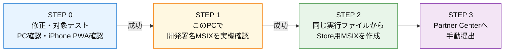
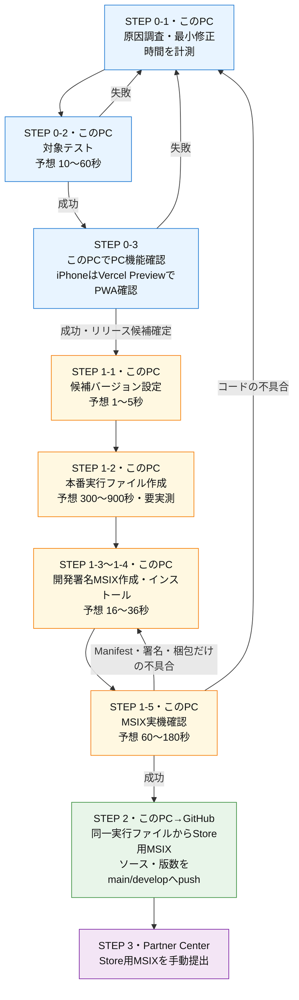

# リリース手順

## 作業開始ゲート（毎回必須）

リリースに関する操作を始める前に、作業者は必ずこの手順書を最初から確認する。

1. 現在のSTEP番号、実施場所、入力ファイル、出力先を確認する。
2. ユーザーへの進捗報告は、この手順書のSTEP番号で統一する。
3. 手順にない保存場所、URL、ビルド方法、テスト方法をその場で作らない。
4. 新しい決定が必要になった場合は、実行前にこの手順書へ保存場所と具体的手順を追記する。
5. 同じ成果物が既に存在する場合は、実行中プロセス、保存先、完了状態を確認し、未完了の場合だけ再実行する。

通常のアプリ開発とMicrosoft Store公開は、次の4ステップで運用する。**通常公開の前に、このPCで開発署名したMSIXを実機確認する。**

GitHub Release、Gitタグ、Winget公開、GitHub ActionsからのMicrosoft Store自動提出は行わない。旧利用者の移行のため、GitHub Release `v5.0.0` の資産だけは保持する。

### 実施場所の定義

| 表記 | 実施場所・役割 |
|---|---|
| このPC | ソース修正、対象テスト、Tauri本番実行ファイル作成、開発署名MSIXの作成・インストール・確認を行う。Store提出物は`Documents\俺の付箋-Store提出\<バージョン>\`へ保存する |
| GitHub develop | 確認対象ソースを保管し、Vercel Previewへのデプロイ元になる。アプリを実行する場所ではない |
| Vercel Preview | GitHub developの内容を公開するiPhone PWAの確認環境 |
| iPhone | Vercel PreviewからインストールしたPWA、通知、PCとの送受信を実機確認する |
| GitHub main | Storeへ提出する版のソースとバージョンを保管する |
| Partner Center | 完成したStore用MSIXをアップロードしてMicrosoft Storeへ申請する |

### 概要図



### 詳細図（失敗時の戻り先）



## STEP 0：原因調査・修正

1. **STEP 0-1**：`develop`、または`develop`から作った作業ブランチで原因を特定し、最小範囲だけ修正する。調査開始から修正完了までを計測する。
2. **STEP 0-2**：対象テストだけを実行する。予想は10〜60秒。失敗したらSTEP 0-1へ戻り、新しい試行として時間を記録する。
3. **STEP 0-3**：PC機能はこのPCの開発環境、iPhone PWAはGitHub developからデプロイされたVercel PreviewをiPhoneで開いて確認する。予想は30〜120秒。失敗したらSTEP 0-1へ戻る。
4. 設計仕様（`docs-v2/`）と必要な手順書を更新する。

修正途中ではMSIXを作らない。対象テストと開発環境の確認が成功した場合だけSTEP 1へ進む。

## STEP 1：このPCでMSIXを作成・実機確認

1. **STEP 1-1**：リリース候補バージョンを先に設定する。予想は1〜5秒。
2. **STEP 1-2**：このPCで本番実行ファイルを1回作成する。現時点の予想は300〜900秒であり、実測値を必ず記録する。
3. **STEP 1-3**：STEP 1-2の実行ファイルから開発署名MSIXを作成する。梱包・署名の実測目安は約6秒。
4. **STEP 1-4**：MSIXをインストールして起動する。予想は10〜30秒。
5. **STEP 1-5**：不具合の再現手順と影響範囲を実機確認する。予想は60〜180秒。

MSIX固有の修正は、アプリを終了してからこのPCで次を実行し、開発署名MSIXを作成・インストール・起動する。

```powershell
.\packaging\msix\test-msix.ps1
```

Store版とはパッケージIDと署名が異なるが、同じTauri実行コードとMSIX環境で、起動、保存、画像、同期をStore提出前に確認できる。Google Drive連携を確認する場合は、本番と同じ`GDRIVE_CLIENT_ID`と`GDRIVE_CLIENT_SECRET`をビルド時に使用する。

STEP 1-5で失敗した場合は、原因により戻り先を分ける。

- コードの不具合：STEP 0-1へ戻る。コード変更後はSTEP 1-2で新しい実行ファイルを作る。
- Manifest・署名・梱包だけの不具合：STEP 1-3へ戻り、合格済みの実行ファイルを再利用する。
- 再試行では、成功・失敗にかかわらず別の試行として時間を記録する。

リリースしない通常作業は、STEP 0で完了である。

### 工程別の予想時間

| 工程 | 実施場所 | 内容 | 予想時間 | 根拠 |
|---|---|---|---:|---|
| STEP 0-1 | このPC | 原因調査・最小修正 | 不具合による | 毎回実測して蓄積する |
| STEP 0-2 | このPC | 対象テスト | 10〜60秒 | 次回以降に実測更新する |
| STEP 0-3 | このPC | PC機能を開発環境で確認 | 30〜120秒 | 操作時間を含む |
| STEP 0-3 | Vercel Preview＋iPhone | iPhone PWA、通知、PCとの送受信を確認 | 操作による | GitHub developのデプロイ完了後に行う |
| STEP 1-1 | このPC | 候補バージョン設定 | 1〜5秒 | 次回以降に実測更新する |
| STEP 1-2 | このPC | 本番実行ファイル作成 | 300〜900秒 | 未計測。最優先で実測する |
| STEP 1-3 | このPC | 開発署名MSIX作成 | 約6秒 | MSIX梱包の実測値 |
| STEP 1-4 | このPC | インストール・起動 | 10〜30秒 | 次回以降に実測更新する |
| STEP 1-5 | このPC | MSIX実機確認 | 60〜180秒 | 操作時間を含む |
| STEP 2-1 | このPC | Store用MSIX作成 | 約6秒 | 同じ実行ファイルを再利用する |
| STEP 2-2 | このPC | Store用形式確認 | 約2秒 | 5項目の形式確認 |
| STEP 2-3 | このPC→GitHub main/develop | 同じソースと版数をpush | 約28秒 | 5.1.3での実測値 |
| STEP 3 | Partner Center | Store用MSIXをアップロード・申請 | 通信・審査による | Microsoft側の処理時間を含む |

### 実測時間の記録

各試行の開始前にストップウォッチを開始し、工程終了直後に秒数を記入する。失敗した試行も削除せず、次回の予想時間と改善判断に使う。

| 日付 | バージョン | 試行 | 結果・失敗工程 | 0-1 | 0-2 | 0-3 | 1-1 | 1-2 | 1-3 | 1-4 | 1-5 | 2-1 | 2-2 | 2-3 | 合計秒 | 改善メモ |
|---|---|---:|---|---:|---:|---:|---:|---:|---:|---:|---:|---:|---:|---:|---:|---|
| 記入例 | X.Y.Z | 1 | 0-2失敗 |  |  | - | - | - | - | - | - | - | - | - |  | 失敗原因と次に省く工程を書く |

記録が3件以上たまった工程は、直近3件の中央値を次回の予想時間にする。最長工程から改善し、同じ検証を別STEPで繰り返さない。

### 通常作業の確認

| 確認項目 | 実施条件 |
|---|---|
| 対象テスト・型検査 | 常に実施する |
| `cargo check --locked` | Rustを確認する場合。通常修正で依存を更新しない |
| PC実機確認 | Tauri、付箋、保存、同期、ショートカットなどを変更した場合。MSIX固有の変更は開発署名MSIXで確認する |
| iPhone実機確認 | PWA、Service Worker、iPhone同期を変更した場合 |
| SW_VERSION更新 | PWA / Service Workerを変更した場合 |

`Cargo.toml` / `Cargo.lock` は通常の機能修正では変更しない。依存ライブラリを更新する場合は、機能修正と混ぜず、理由・対象・影響範囲を分けて確認する。

### アプリ本体に影響しない変更

LP、README、`docs/`だけの変更も、まず`develop`で確認する。確認後は **Do Non-App Release** で`main`へ反映する。StoreリリースのSTEP 1〜3は不要である。

## STEP 2：合格した実行ファイルからStore提出用MSIXを作る

STEP 1-5で合格した実行ファイルを、そのままStore提出用MSIXへ梱包する。GitHub上で同じ実行ファイルを再コンパイルしない。

1. **STEP 2-1**：STEP 1-2の実行ファイルから、Store用ID・未署名のMSIXを作る。予想は約6秒。
2. **STEP 2-2**：名前、発行者、バージョン、x64、未署名の5項目を確認する。予想は約2秒。
3. **STEP 2-3**：実機確認した実行ファイルに対応する同じソースと版数を`main`と`develop`へ反映する。予想は約28秒。

STEP 2の自動化は、次の条件をすべて満たすこと。

- STEP 1-5で合格した実行ファイルとStore提出物の実行ファイルが同一である。
- STEP 2ではNext.js・Rust・Tauri実行ファイルを再ビルドしない。
- STEP 0とSTEP 1で済んだテストを繰り返さない。
- 各工程の開始・終了・秒数を実測時間表へ記録する。

版番号は次の5ファイルへ自動反映される。手で変更しない。

| ファイル | 版番号 |
|---|---|
| `package.json` / `package-lock.json` | `X.Y.Z` |
| `src-tauri/Cargo.toml` / `src-tauri/Cargo.lock` | `X.Y.Z` |
| `packaging/msix/AppxManifest.xml` | `X.Y.Z.0` |

## STEP 3：Microsoft Storeで手動リリース

1. **STEP 3-1（このPC）**：STEP 2で作成した`ore-no-fusen.msix`を、`D:\Users\uck\Documents\俺の付箋-Store提出\<バージョン>\ore-no-fusen.msix`へ準備する。一時フォルダやリポジトリ内には置かない。
2. **STEP 3-2（Partner Center）**：`ore-no-fusen.msix`を通常の製品申請へアップロードする。
3. **STEP 3-3（Partner Center）**：説明、画像、プライバシー、年齢区分、公開設定を確認して認定へ提出する。
4. **STEP 3-4（Microsoft Store＋このPC）**：認定・公開後、Storeからインストールまたは更新し、バージョンと起動を確認する。

Partner Centerでの画面操作と確認項目は、[store-submission.md](./store-submission.md)を参照する。

## 補足

### バージョン番号

`MAJOR.MINOR.PATCH`形式を使う。

| 種別 | 用途 | 例 |
|---|---|---|
| PATCH | バグ修正 | `5.0.0` → `5.0.1` |
| MINOR | 後方互換のある機能追加 | `5.0.0` → `5.1.0` |
| MAJOR | 互換性のない大きな変更 | `5.0.0` → `6.0.0` |

### PWA / Service Worker

PWAまたはService Workerを変更した場合だけ、`worker/index.js`の`SW_VERSION`を`本体バージョン-pwa.N`形式で更新する。画面右下の`SW`表示で反映を確認する。

### 5.0.0からStore版への移行

GitHub Release `v5.0.0` の`latest.json`、MSI、NSIS、署名ファイルは、旧版利用者が5.0.0へ更新するために残す。5.1.0以降はGitHub Releaseを新規作成せず、Microsoft Store版だけを正式配布する。

## 更新履歴

| No. | 日付 | 内容 |
|---:|---|---|
| 16 | 26-07-27 | Store手動提出へ切替。タグ・GitHub Release・Winget・自動Store提出を廃止し、5.0.0の移行用資産だけを保持した。 |
| 17 | 26-07-28 | 事前検証・版確定・MSIX作成を、版番号を一度だけ入力する単一ワークフローへ統合した。 |
| 18 | 26-07-28 | 開発・Store公開の運用をSTEP 1〜3へ整理し、旧手順と未実装案を削除した。 |
| 19 | 26-08-03 | 通常公開前の必須ゲートとしてパッケージフライトを追加。Store署名済みMSIXで画像保存・画像付き複製・既存データ・更新を最終確認してから公開する4ステップ運用へ変更した。 |
| 20 | 26-08-03 | Store MSIX作成の通常目標を10分以内とし、Node系検証とRust releaseテストの並列化、同一run内でのRust成果物再利用を明記した。5.1.1の緊急例外も記録した。 |
| 21 | 26-08-10 | パッケージフライトを必須手順から外し、開発署名MSIXをこのPCで作成・実機確認してからStoreへ通常申請する3ステップ運用へ変更した。 |
| 22 | 26-08-10 | STEP 0〜3の失敗時フローと工程別時間記録を追加し、実機確認済み実行ファイルをStore用MSIXへ再利用して重複ビルドしない手順へ変更した。 |
