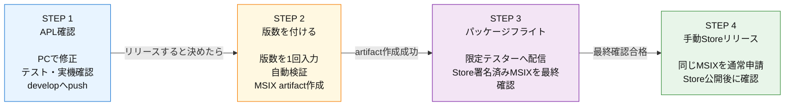

# リリース手順

通常のアプリ開発とMicrosoft Store公開は、次の4ステップだけで運用する。**通常公開の前に、パッケージフライトでStore署名済みMSIXを最終確認する。**

GitHub Release、Gitタグ、Winget公開、GitHub ActionsからのMicrosoft Store自動提出は行わない。旧利用者の移行のため、GitHub Release `v5.0.0` の資産だけは保持する。

## STEP 1：アプリ確認

1. `develop`、または`develop`から作った作業ブランチで修正する。
2. 対象テスト、型検査、必要なビルドを実行する。
3. 設計仕様（`docs-v2/`）と必要な手順書を更新する。
4. `develop`へpushする。
5. CIが成功したことを確認し、影響範囲に応じてPCのTauriアプリ、iPhoneのPreviewを実機確認する。

問題があれば、このSTEPへ戻って修正する。リリースしない通常作業は、ここで完了である。

### 通常作業の確認

| 確認項目 | 実施条件 |
|---|---|
| 対象テスト・型検査 | 常に実施する |
| `cargo check --locked` | Rustを確認する場合。通常修正で依存を更新しない |
| PC実機確認 | Tauri、付箋、保存、同期、ショートカットなどを変更した場合 |
| iPhone実機確認 | PWA、Service Worker、iPhone同期を変更した場合 |
| SW_VERSION更新 | PWA / Service Workerを変更した場合 |

`Cargo.toml` / `Cargo.lock` は通常の機能修正では変更しない。依存ライブラリを更新する場合は、機能修正と混ぜず、理由・対象・影響範囲を分けて確認する。

### アプリ本体に影響しない変更

LP、README、`docs/`だけの変更も、まず`develop`で確認する。確認後は **Do Non-App Release** で`main`へ反映する。StoreリリースのSTEP 2〜4は不要である。

## STEP 2：版数を付けてStore提出用ファイルを作る

STEP 1の確認が終わり、正式リリースすると決めた時だけ、GitHub Actionsの **Prepare and Build Store Package** を実行する。

1. 次の版番号を一度だけ入力する。例：`5.1.0`
2. 実行結果が成功するまで待つ。
3. `store-msix` artifactが作成されたことを確認する。

ワークフローは自動で次を行う。

1. `develop`に対して、指定版を一時適用した`Cargo.lock`差分検証と`cargo check --locked`を実行する。
2. 成功した場合だけ、`develop`を`main`へ反映し、アプリ版を更新する。
3. 更新した`main`を`develop`へ戻す。
4. 確定した`main`コミットから未署名MSIXを作成・検査し、`store-msix` artifactとして30日間保存する。

最初の検証で失敗した場合、版番号コミットもMSIX作成も行われない。MSIX作成だけが失敗した場合、版番号コミットは残るが、公開やStore提出は行われない。原因を修正して、同じ版番号で再実行する。

版番号は次の5ファイルへ自動反映される。手で変更しない。

| ファイル | 版番号 |
|---|---|
| `package.json` / `package-lock.json` | `X.Y.Z` |
| `src-tauri/Cargo.toml` / `src-tauri/Cargo.lock` | `X.Y.Z` |
| `packaging/msix/AppxManifest.xml` | `X.Y.Z.0` |

## STEP 3：パッケージフライトで最終確認

1. STEP 2のrunから`store-msix` artifactをダウンロードする。
2. Partner Centerで事前登録したテスターグループを対象に、パッケージフライトを作成する。
3. `ore-no-fusen.msix`をフライトへアップロードし、認定へ提出する。
4. フライトが利用可能になったら、登録済みMicrosoftアカウントでMicrosoft Storeへサインインする。
5. Storeからフライト版をインストールまたは更新し、実際のStore署名済みMSIXを確認する。
6. 起動、既存付箋・設定、画像描き込み保存、画像付き付箋の複製、更新を実機確認する。

1項目でも失敗した場合は通常公開しない。STEP 1へ戻って修正し、新しい版番号でSTEP 2からやり直す。

## STEP 4：Microsoft Storeで手動リリース

1. STEP 3で合格したものと同じ版・同じ`ore-no-fusen.msix`を通常の製品申請へアップロードする。
2. 説明、画像、プライバシー、年齢区分、公開設定を確認して認定へ提出する。
3. 認定後、公開を開始する。
4. Store公開後、Storeからインストールまたは更新し、バージョンと起動を確認する。

Partner Centerでの画面操作と確認項目は、[store-submission.md](./store-submission.md)を参照する。

## 補足

### バージョン番号

`MAJOR.MINOR.PATCH`形式を使う。

| 種別 | 用途 | 例 |
|---|---|---|
| PATCH | バグ修正 | `5.0.0` → `5.0.1` |
| MINOR | 後方互換のある機能追加 | `5.0.0` → `5.1.0` |
| MAJOR | 互換性のない大きな変更 | `5.0.0` → `6.0.0` |

### PWA / Service Worker

PWAまたはService Workerを変更した場合だけ、`worker/index.js`の`SW_VERSION`を`本体バージョン-pwa.N`形式で更新する。画面右下の`SW`表示で反映を確認する。

### 5.0.0からStore版への移行

GitHub Release `v5.0.0` の`latest.json`、MSI、NSIS、署名ファイルは、旧版利用者が5.0.0へ更新するために残す。5.1.0以降はGitHub Releaseを新規作成せず、Microsoft Store版だけを正式配布する。

## 更新履歴

| No. | 日付 | 内容 |
|---:|---|---|
| 16 | 26-07-27 | Store手動提出へ切替。タグ・GitHub Release・Winget・自動Store提出を廃止し、5.0.0の移行用資産だけを保持した。 |
| 17 | 26-07-28 | 事前検証・版確定・MSIX作成を、版番号を一度だけ入力する単一ワークフローへ統合した。 |
| 18 | 26-07-28 | 開発・Store公開の運用をSTEP 1〜3へ整理し、旧手順と未実装案を削除した。 |
| 19 | 26-08-03 | 通常公開前の必須ゲートとしてパッケージフライトを追加。Store署名済みMSIXで画像保存・画像付き複製・既存データ・更新を最終確認してから公開する4ステップ運用へ変更した。 |
