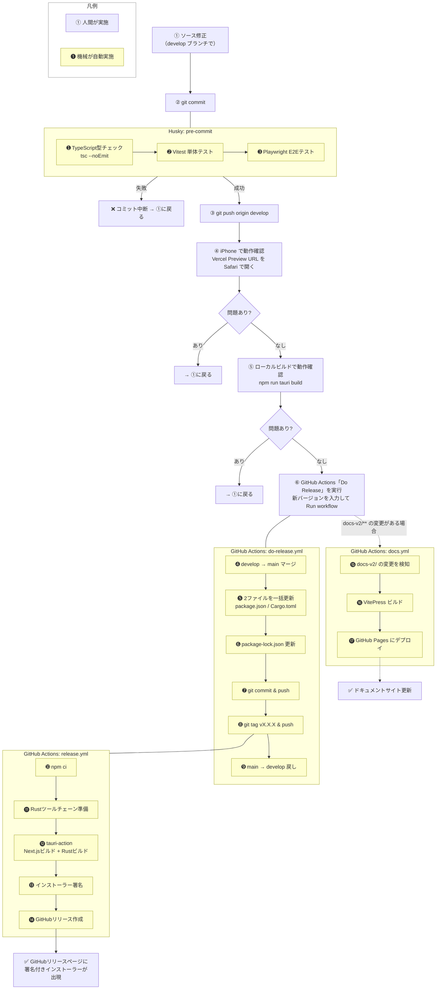

# リリース手順

## バージョンの仕組み

### 更新が必要なファイル（2つだけ）

| ファイル | ビルドシステム | 役割 |
|---------|--------------|------|
| `package.json` | npm（Node.js） | JS/React側のパッケージ定義 |
| `src-tauri/Cargo.toml` | Cargo（Rust） | Rust側のパッケージ定義 |

2つのビルドシステム（Node.jsとRust）が共存するTauriアプリの構造上、それぞれに1つずつ必要。これ以上減らすことはできない。

### 自動追従するもの（更新不要）

| ファイル | 仕組み |
|---------|-------|
| `src-tauri/tauri.conf.json` | `version` フィールドなし。Tauriがビルド时に `Cargo.toml` から自動取得 |
| `package-lock.json` | `npm install --package-lock-only` で `package.json` に追従 |
| ランディングページ | `next.config.mjs` がビルド時に `package.json` を読み `NEXT_PUBLIC_APP_VERSION` にセット |

---

## バージョン番号の規則

セマンティックバージョニング（SemVer）を使用する。

```
MAJOR.MINOR.PATCH
```

| 種別 | 基準 | 例 |
|------|------|----|
| PATCH | バグ修正 | 2.8.0 → 2.8.1 |
| MINOR | 後方互換のある機能追加 | 2.8.0 → 2.9.0 |
| MAJOR | 互換性のない大きな変更 | 2.8.0 → 3.0.0 |

---

## 開発からリリースまでの流れ



---

## ローカルビルド（動作確認用・署名なし）

```bash
npm run tauri build
```

> Windowsが「発行元不明」と警告を出すが動作確認には使える。配布には使わない。

---

## ⚠️ 注意事項

### タグは Actions が単体でプッシュする（手動でやらない）

```bash
# ❌ NG: 絶対にやってはいけない
git push origin main --tags
```

**なぜダメか（実際に起きた事故）:**
- `--tags` はローカルに溜まっている**未プッシュのタグを全部まとめて**送る
- 過去タグが残っていると複数タグが同時にプッシュされる
- GitHub Actions がタグの数だけ起動し、それぞれ異なるコミットでビルドが走る
- 結果: 1つのリリースに複数バージョンのインストーラーが混在し、リリースが壊れる
- → **v1.1.6 でこれが発生。リリースを削除して v1.1.7 を作り直すことになった**

### リリースは手動で作らない

`gh release create` や GitHub Web UI でリリースを手動作成しないこと。
`tauri-action` がビルド完了後に自動でリリースとインストーラーを作成する。
手動作成すると競合して CD が失敗する。
