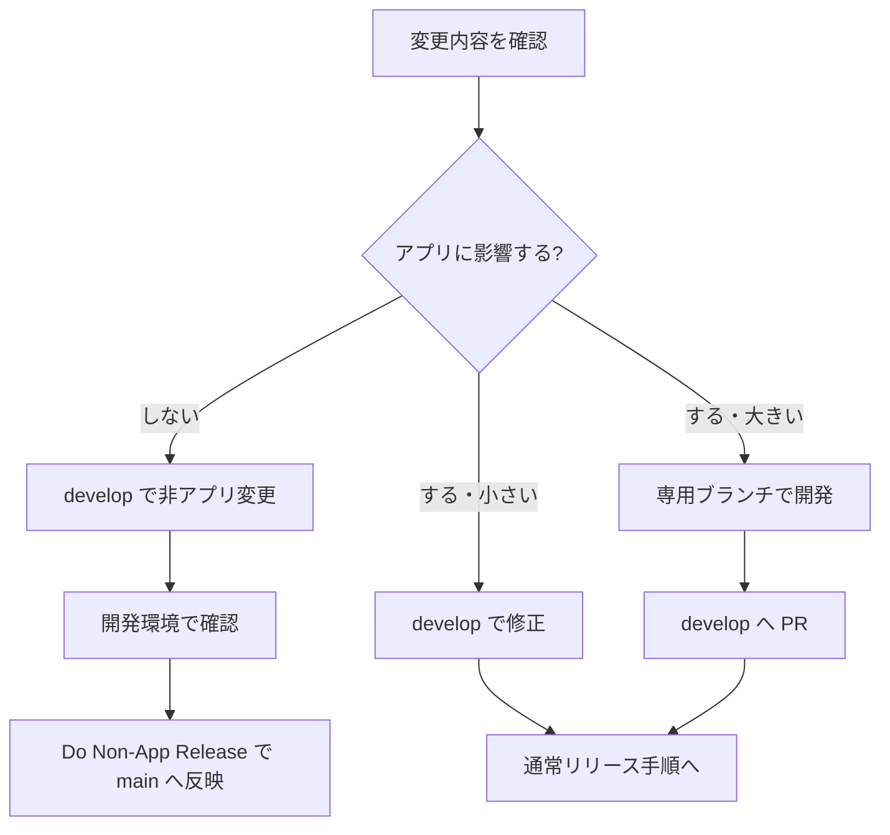
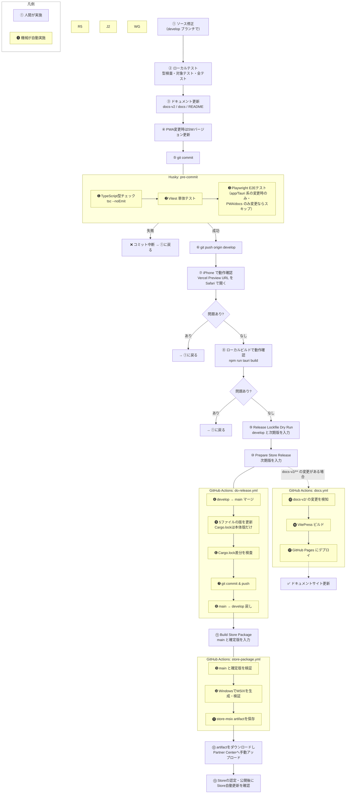

# リリース手順

## 1. ブランチ運用の判断

変更内容を見て、アプリに影響するかどうかでリリース経路を分ける。
普段の作業開始地点は常に `develop` とする。LP のようにアプリ本体へ影響しない変更も、まず `develop` に入れて開発環境で確認し、確認後に `Do Non-App Release` で `main` へ反映する。



**図 1-1　ブランチ運用の判断フロー**

**表 1-1　変更種別とブランチ運用の対応**

| 変更種別 | 作業ブランチ | PR先 | 例 |
|---------|-------------|------|----|
| アプリに影響しない変更 | `develop`、または `develop` から小さい作業ブランチを作成 | `develop` | LP、README、READMEバッジ、`docs/`、GitHub表示文言 |
| アプリに影響する小さい変更 | `develop` で修正、または `develop` から小さい作業ブランチを作成 | `develop` | 軽微なバグ修正、UI文言、設定の小変更 |
| アプリに影響する大きい変更 | 専用ブランチを作成 | `develop` | 新機能、同期処理、保存処理、Tauri/Rust側の変更 |

アプリに影響しない変更も、作業ブランチを `develop` から作り、PR 先は `develop` にする。
`main` だけで変更を作らない。非影響変更は `develop` に入れて確認してから、手動ワークフロー `Do Non-App Release` で許可されたファイルだけを `main` に載せる。
`main` に入った時点で本番 LP や GitHub README などの表示を更新できる。
アプリに影響する変更は `develop` に集め、通常リリース手順で `main` へ反映する。

#### 補足（運用上の注意・v4.0.0 で確定）

- **CI / ビルド設定（`test.yml`・`do-release.yml`・`store-package.yml` 等）は「アプリに影響する側」** として扱う＝ `develop` で変更する（`main` 直接にしない）。
- **普段の作業ブランチは `develop`。`main` に居座らない**（誤って `main` でアプリコードを触る事故を防ぐ）。
- **`main` と `develop` をズレたまま放置しない。** `main` だけで変更を作らない。Do Release の「`main` → `develop` 戻し」は、リリース処理中に `main` 側で作られるバージョン更新などを `develop` に戻すためのもの。ズレを放置すると Do Release のマージで衝突する（v4.0.0 で `.gitignore` の衝突が実際に発生した）。
- **LP の本番反映は `Do Non-App Release` を使う。** `Prepare Store Release` はアプリ版の確定用であり、LPだけの更新では使わない。
- **版確定後は `main` を `develop` へ戻す。** Store版確定で生じた版番号のずれを残さない。

### 非アプリ変更（LP）の本番反映

LP だけを本番更新する場合は、アプリリリース用の `Do Release` ではなく、手動ワークフロー `Do Non-App Release` を使う。
この経路は `develop` で確認済みの LP 関連ファイルだけを `main` にコピーし、バージョン更新、タグ作成、GitHub Release 作成、Tauri ビルド、Rust / Next.js のリリースビルドを行わない。

**表 1-2　Do Non-App Release の対象ファイル**

| 対象 | 反映されるパス |
|------|----------------|
| `landing` | `app/landing/**`、`app/sitemap.ts`、`app/robots.ts`、`public/screenshots/**` |

手順:

1. LP 変更を `develop` に入れる。
2. `develop` に push する。
3. 開発環境または Preview 環境で LP を確認する。
4. GitHub Actions の **Do Non-App Release** を開く。
5. **Run workflow** を押し、`target` は `landing` のまま実行する。
6. 必要なら `message` に本番反映用のコミットメッセージを入れる。
7. `main` に LP 関連ファイルだけが反映されたことを確認する。

`Do Non-App Release` はタグを作らないため、アプリリリース用の `release.yml` は起動しない。`test.yml` も bot push をスキップする設定になっているため、Tauri の重い再ビルドを避けつつ、本番 LP のデプロイだけを進められる。

---

## 2. バージョンの仕組み

### 更新が必要なファイル（2つだけ）

**表 2-1　バージョン更新が必要なファイル**

| ファイル | 役割 |
|---------|------|
| `package.json` / `package-lock.json` | JS/React側のアプリ版と固定依存 |
| `src-tauri/Cargo.toml` / `src-tauri/Cargo.lock` | Rust側のアプリ版と固定依存 |
| `packaging/msix/AppxManifest.xml` | Storeが要求する4桁のMSIX版（`X.Y.Z.0`） |

`Prepare Store Release` がこの5ファイルの版を同時に更新してコミットする。`Cargo.lock` は本体 `ore-no-fusen` の版だけを更新し、間接依存は変更しない。`src-tauri/tauri.conf.json` とランディングページの表示版は、ビルド時にこれらの版へ追従する。

---

## 3. バージョン番号の規則

セマンティックバージョニング（SemVer）を使用する。

```
MAJOR.MINOR.PATCH
```

**表 3-1　セマンティックバージョニングの種別**

| 種別 | 基準 | 例 |
|------|------|----|
| PATCH | バグ修正 | 2.8.0 → 2.8.1 |
| MINOR | 後方互換のある機能追加 | 2.8.0 → 2.9.0 |
| MAJOR | 互換性のない大きな変更 | 2.8.0 → 3.0.0 |

---

## 4. SW_VERSION（PWA / Service Worker）の採番

PWA（`app/viewer/`）と Service Worker（`worker/index.js`）は、本体（Tauri アプリ）とは
別タイミングで更新されるため、専用の連番を持つ。

形式: `本体バージョン-pwa.N`（例: `4.0.2-pwa.1`）

**表 4-1　SW_VERSION の採番ルール**

| いつ | どうする | 例 |
|------|---------|----|
| PWA / SW だけ直した | `N` を 1 つ上げる | `4.0.2-pwa.1` → `4.0.2-pwa.2` |
| 本体バージョンが上がった | 先頭を新バージョンにし `N` を 1 に戻す | `4.0.2-pwa.3` → `4.0.3-pwa.1` |

- 場所: `worker/index.js` の `SW_VERSION`
- 反映確認: 画面右下の `SW` 表示で確認できる
- videodrop など機能名の枝番は使わない（過去の `3.4.2-videodrop.N` は廃止）

---

## 5. 開発からリリースまでの流れ

この章は、アプリに影響する変更を `develop` に集めて正式リリースする通常手順を示す。

### リリース前の必須ゲート

ソース修正、テスト、ドキュメント更新、リリース確認は1セットで実施する。
特に PWA / Service Worker / iPhone 連携を変更した場合は、SW バージョンを必ず上げる。

**表 5-1　リリース前の必須ゲート**

| No | ゲート | 内容 |
|----|--------|------|
| 1 | ソース修正 | 実装は最小単位で行う |
| 2 | テスト | `npx tsc --noEmit --pretty false`、対象テスト、`npm test`、`cargo check --locked`、`npm run build` を実行する |
| 3 | ドキュメント更新 | `docs-v2/` の設計仕様、`docs/` の手順書・マニュアル（開発者向け手順＝`010_RELEASE` 等／付箋アプリ利用者向け＝`100_USER_GUIDE`・`101_FAQ`）、必要なら `README.md` を更新する |
| 4 | 変更履歴 | 更新した設計書・マニュアルの変更履歴へ日付 `YY-MM-DD` で追記する |
| 5 | PWA バージョン確認 | PWA / SW を触った場合、画面右下の `SW` バージョンで反映を確認できるようにする |
| 6 | リリース | develop に push し、Preview / ローカル Tauri で確認してから正式リリースへ進む |

### 5.1 依存関係・ロックファイルの管理

Rust の依存宣言は `src-tauri/Cargo.toml`、実際にビルドする依存の組合せは `src-tauri/Cargo.lock` で管理する。`Cargo.lock` は全ての間接依存を含むため、意図しない更新でも大量の差分と再ビルドを引き起こす。機能修正と依存更新を同じ変更に混ぜない。

| 作業種別 | `Cargo.toml` / `Cargo.lock` | 実施すること | 確認 |
|---|---|---|---|
| 通常の機能・不具合修正 | 変更しない | Rustの確認は `cargo check --locked` を使う | 作業前後で `git diff -- src-tauri/Cargo.toml src-tauri/Cargo.lock` が空であること |
| 依存ライブラリの追加・更新・削除 | 意図して両方変更する | 更新理由・対象ライブラリ・版・影響範囲を独立して記録する | `Cargo.lock` の差分、Rustビルド、対象機能、必要な実機確認を行う |
| アプリ版のRelease | `Cargo.toml` と `Cargo.lock` の本体パッケージ版だけを整合させる | Do Release が処理する | 本体版・`Cargo.lock` 内の `ore-no-fusen` 版・MSIX版が一致すること |

通常の修正中に `Cargo.lock` が変わった場合は、そのままコミットしない。依存更新を意図したか、依存解決を再実行するコマンドを使ったかを確認してから、通常修正から分離する。`Cargo.lock` を削除して再生成すること、通常修正で `cargo update` または `cargo generate-lockfile` を実行することは禁止する。

#### Release Lockfile Dry Run（公開なしの事前検証）

GitHub Actionsの **Release Lockfile Dry Run** は、通常のリリース前にロックファイルだけを検証する手動ワークフローである。入力するのは、確認対象のコード（通常は `develop`）と、確認したい次の版番号である。

1. 指定したコードをGitHub Actionsの使い捨て環境へ取得する。
2. その環境内だけで `Cargo.toml` と `Cargo.lock` の本体パッケージ版を指定版へそろえる。
3. `scripts/verify-cargo-lock-release.mjs` で、本体 `ore-no-fusen` の版以外に差分がないことを確認する。
4. `cargo check --locked` で、固定された依存グラフのままビルド可能か確認する。

このワークフローは読み取り専用権限で動作する。commit、push、タグ、GitHub Release、winget更新、MSIXのアップロード、Microsoft Storeへの提出・公開は行わない。

#### Store手動提出の実リリース

通常のリリースは、次の3つの独立した操作に分ける。GitHub Release、winget、タグ、Microsoft Partner Centerへの自動提出は行わない。

1. **Release Lockfile Dry Run** を `main` から実行し、対象を `develop`、版を次期版にして、ロック差分と `cargo check --locked` を確認する。
2. **Prepare Store Release** を実行する。`develop` を `main` へ反映し、5つの版を更新する。`scripts/verify-cargo-lock-release.mjs` が本体版以外のCargo.lock差分を拒否した場合は、commitしない。完了後、`main` を `develop` へ戻す。
3. **Build Store Package** を `main` と確定済みの同じ版で実行する。未署名MSIX artifactをダウンロードし、Microsoft Partner Centerへ手動アップロードして審査・公開する。

`Build Store Package` はリポジトリへ版を仮適用しない。入力版と `main` にコミット済みの `package.json`、`Cargo.toml`、`Cargo.lock`、MSIX版が一致しない場合は失敗する。



**図 5-1　開発からリリースまでの全体フロー**

> **補足（5.0.0移行版）:** 旧版の自動更新先として、公開済みのGitHub Release `v5.0.0` の `latest.json`・MSI・NSIS・署名ファイルを残す。5.1.0以降はGitHub Releaseを作らず、Store版だけを更新する。

---

## 6. ローカルビルド（動作確認用・署名なし）

```bash
npm run tauri build
```

> Windowsが「発行元不明」と警告を出すが動作確認には使える。配布には使わない。

---

## 7. Microsoft Store MSIXの扱い

- **5.0.0は移行開始版**として、公開済みGitHub Releaseの `latest.json`・NSIS・MSIを残す。5.0.0未満の旧版はこの版へ自動更新し、利用者は案内に従ってStore版を手動インストールする。
- **5.1.0以降はStore版だけ**を正式配布する。MSI・NSIS、`latest.json`、`.sig`、GitHub Release、community winget PRは新規生成しない。
- Store提出用MSIXは未署名で生成し、`validate-msix.ps1`でIdentity、Publisher、Version、x64、未署名状態を確認する。
- 未署名MSIXはGitHub Release Assetsへ置かず、`Build Store Package`の`store-msix` artifactとして30日保存する。
- `Build Store Package`後は、artifactをダウンロードしてMicrosoft Partner Centerへ手動アップロードする。`Microsoft Store Submit` workflowは使用しない。
- Microsoft Storeが認定後の配布用MSIXへ正式署名し、自動更新を提供する。
- `AppxManifest.xml`のVersionはDo Releaseが本体`X.Y.Z`に合わせて`X.Y.Z.0`へ更新する。
- Store公開後、`winget install --id 9N4MW0V2MVVG --source msstore`とStore自動更新を実機確認する。

---

## 8. ⚠️ 注意事項

### 5.0.0移行資産を保持する

GitHub Release `v5.0.0` の `latest.json`、MSI、NSIS、署名ファイルは、旧版利用者が5.0.0へ更新するために残す。削除・置換・新しいGitHub Releaseの作成をしない。新しいタグを作ると旧版の更新先が5.0.0から変わるため、5.1.0以降のタグは作成しない。

### Storeの提出と公開は手動で行う

`store-msix` artifactをMicrosoft Partner Centerへ手動アップロードする。GitHub ActionsからのPartner Center提出、GitHub Release作成、winget更新は行わない。

---

## 9. 更新履歴

**表 9-1　更新履歴**

| No | 日付 | 更新箇所 | 変更内容 |
|----|------|---------|----------|
| 1 | 26-05-25 | 5. 開発からリリースまでの流れ | ソース修正→テスト→ドキュメント更新→SWバージョン確認→リリースの必須ゲートを追加。 |
| 2 | 26-06-14 | 1. ブランチ運用の判断 | アプリ非影響変更は `main` 向け、アプリ影響変更は `develop` 向けに分けるブランチ運用を追加。 |
| 3 | 26-06-16 | 7. MSIX（ストアお試し版）の扱い | MSIX（ストアお試し版）の扱いを追記（毎回CI生成・署名なし・ローカルテストしない・MSI でテスト・MSIX固有部分は実機確認済み・ストア提出時は Microsoft が署名）。 |
| 4 | 26-06-16 | 1. ブランチ運用の判断 | アプリ非影響変更も `develop` 起点で作業し、PR 先だけ `main` にする運用を明記。 |
| 5 | 26-06-16 | 1. ブランチ運用の判断 | `main` だけで変更を作らない方針と、Do Release の `main` → `develop` 戻しの役割を明確化。 |
| 6 | 26-06-17 | 4. SW_VERSION の採番 | SW_VERSION の採番ルール（`本体バージョン-pwa.N` 形式）を追加。videodrop 枝番は廃止。 |
| 7 | 26-06-19 | 2. バージョンの仕組み / 7. MSIX の扱い | Do Release が `AppxManifest.xml`（MSIX）の Version も本体バージョンに合わせ自動更新するようにした（4桁・第4桁0固定）。手動更新が不要に。 |
| 8 | 26-06-19 | 全章（見出し）/ 5. フロー図 | 各章に項番（1〜9）を付与。リリースフロー図の最後に「適宜 Store 登録を手動で実施する」を追加。 |
| 9 | 26-06-19 | 9. 更新履歴 | 更新履歴の表に「更新箇所」列を追加し、既存行を対応させた。 |
| 10 | 26-06-19 | 1. ブランチ運用 / 5. 開発からリリースまでの流れ | 実ソースとの差分を修正：test.yml のスキップ条件（bot push は develop/main 両方・bot 2種・リリース並走回避）、pre-commit の E2E が条件付き実行である点、`release.yml` の自動処理（リリースノート生成・署名なし MSIX 生成・winget 自動公開）を追記。Mermaid に Cargo.lock 更新も明記。 |
| 11 | 26-06-19 | 5. 開発からリリースまでの流れ | 必須ゲート表などの「ユーザー」表現を、開発者か付箋アプリ利用者か明確化（`docs/` は開発者向け手順と利用者向けガイドの両方を含む旨を明記）。 |
| 12 | 26-06-19 | 全章（表・図） | すべての表に表番号・表名（表 N-M）、すべての図に図番号・図名（図 N-M）を付与。表名は表の上、図名は図の下に配置。 |
| 13 | 26-06-19 | 5. 開発からリリースまでの流れ | リリース手順に不適だった「データロスト禁止」注記を削除（実装原則であり、内容は `docs-v2/` の「データロスト防止ゲート」等に既出）。ゲート No.1 を「実装は最小単位で行う」に簡潔化。 |
| 14 | 26-07-04 | 1. ブランチ運用の判断 | LP などの非アプリ変更も `develop` で確認してから `Do Non-App Release` で `main` へ反映する運用に変更。`Do Release` と非アプリ反映ルートを分離。 |
| 15 | 26-07-26 | 5. 開発からリリースまでの流れ | Rust依存と `Cargo.lock` の管理を追加。通常修正ではロック更新を禁止し `cargo check --locked` を使用する。依存更新を独立作業に分け、Do Releaseの全依存再解決を見直す提案を明記。 |
| 16 | 26-07-27 | 2. / 5. / 7. / 8. | Store手動提出へ切替。タグ・GitHub Release・winget・自動Store提出を廃止し、5.0.0の旧版移行用資産だけを保持する。 |
