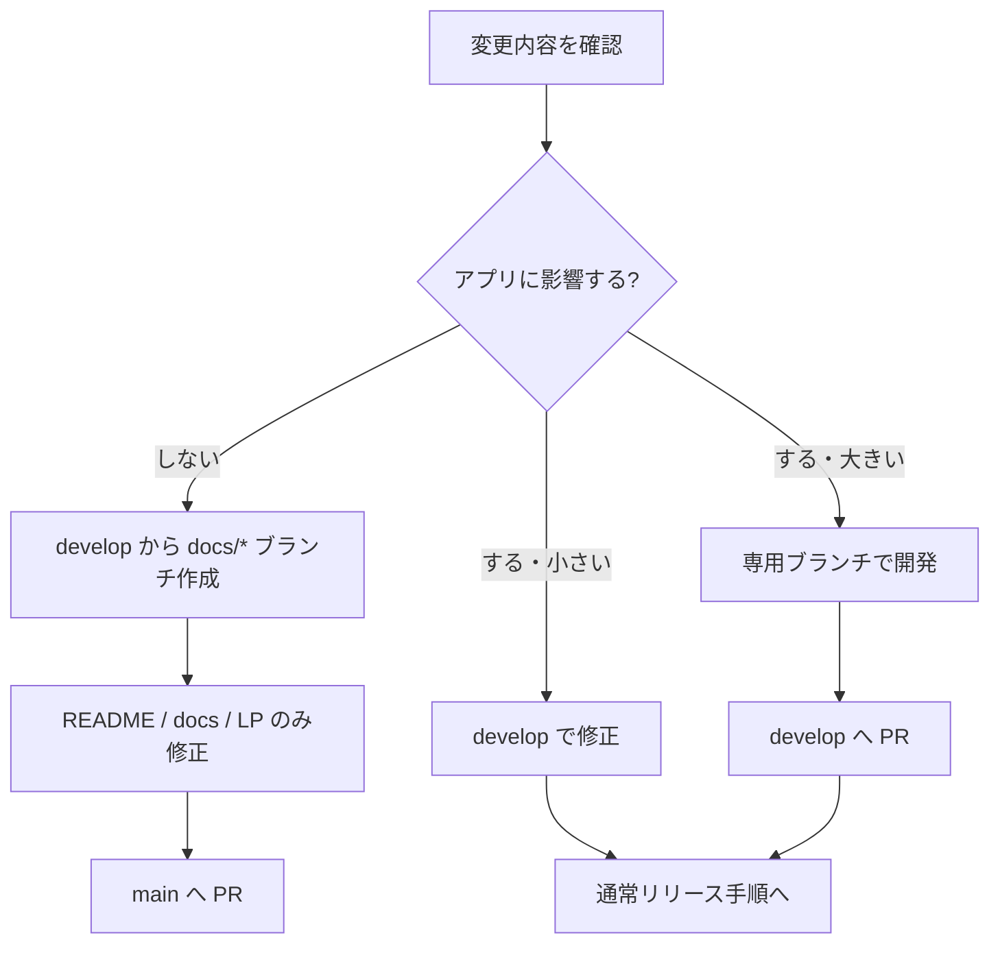
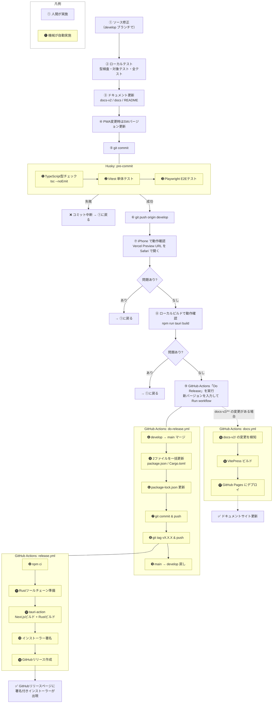

# リリース手順

## ブランチ運用の判断

変更内容を見て、アプリに影響するかどうかでリリース経路を分ける。
普段の作業開始地点は `develop` とし、README バッジのようにアプリへ影響しない変更だけ `main` 向け PR にする。



| 変更種別 | 作業ブランチ | PR先 | 例 |
|---------|-------------|------|----|
| アプリに影響しない変更 | `develop` から `docs/*` ブランチを作成 | `main` | `README.md`、READMEバッジ、`docs/`、LP、GitHub表示文言 |
| アプリに影響する小さい変更 | `develop` で修正、または `develop` から小さい作業ブランチを作成 | `develop` | 軽微なバグ修正、UI文言、設定の小変更 |
| アプリに影響する大きい変更 | 専用ブランチを作成 | `develop` | 新機能、同期処理、保存処理、Tauri/Rust側の変更 |

アプリに影響しない変更は、作業ブランチを `develop` から作り、PR 先だけ `main` にする。
`main` だけで変更を作らない。非影響変更の `main` 向け PR は、`develop` 起点で作った変更を `main` に載せるためのもの。
`main` に入った時点で GitHub README や公開ドキュメントの表示を更新できる。
アプリに影響する変更は `develop` に集め、通常リリース手順で `main` へ反映する。

#### 補足（運用上の注意・v4.0.0 で確定）

- **CI / ビルド設定（`test.yml`・`release.yml` 等）は「アプリに影響する側」** として扱う＝ `develop` で変更する（`main` 直接にしない）。
- **普段の作業ブランチは `develop`。`main` に居座らない**（誤って `main` でアプリコードを触る事故を防ぐ）。
- **`main` と `develop` をズレたまま放置しない。** `main` だけで変更を作らない。Do Release の「`main` → `develop` 戻し」は、リリース処理中に `main` 側で作られるバージョン更新などを `develop` に戻すためのもの。ズレを放置すると Do Release のマージで衝突する（v4.0.0 で `.gitignore` の衝突が実際に発生した）。
- **Do Release の二重テストの扱い:** `test.yml` は `develop`/`main` への push でテストするが、「`main` → `develop` 戻し」（bot による `develop` への push）は `main` 行きで既にテスト済みのコードを戻すだけなので、`rust` ジョブの `if: !(develop かつ bot)` で再テストをスキップする（無駄を排除）。

---

## バージョンの仕組み

### 更新が必要なファイル（2つだけ）

| ファイル | ビルドシステム | 役割 |
|---------|--------------|------|
| `package.json` | npm（Node.js） | JS/React側のパッケージ定義 |
| `src-tauri/Cargo.toml` | Cargo（Rust） | Rust側のパッケージ定義 |

2つのビルドシステム（Node.jsとRust）が共存するTauriアプリの構造上、それぞれに1つずつ必要。これ以上減らすことはできない。

### 自動追従するもの（更新不要）

| ファイル | 仕組み |
|---------|-------|
| `src-tauri/tauri.conf.json` | `version` フィールドなし。Tauriがビルド时に `Cargo.toml` から自動取得 |
| `package-lock.json` | `npm install --package-lock-only` で `package.json` に追従 |
| ランディングページ | `next.config.mjs` がビルド時に `package.json` を読み `NEXT_PUBLIC_APP_VERSION` にセット |

---

## バージョン番号の規則

セマンティックバージョニング（SemVer）を使用する。

```
MAJOR.MINOR.PATCH
```

| 種別 | 基準 | 例 |
|------|------|----|
| PATCH | バグ修正 | 2.8.0 → 2.8.1 |
| MINOR | 後方互換のある機能追加 | 2.8.0 → 2.9.0 |
| MAJOR | 互換性のない大きな変更 | 2.8.0 → 3.0.0 |

---

## 開発からリリースまでの流れ

この章は、アプリに影響する変更を `develop` に集めて正式リリースする通常手順を示す。

### リリース前の必須ゲート

ソース修正、テスト、ドキュメント更新、リリース確認は1セットで実施する。
特に PWA / Service Worker / iPhone 連携を変更した場合は、SW バージョンを必ず上げる。

| No | ゲート | 内容 |
|----|--------|------|
| 1 | ソース修正 | 実装は最小単位で行い、ユーザー本文・添付・保存パスなど異なる意味のデータを混ぜない |
| 2 | テスト | `npx tsc --noEmit --pretty false`、対象テスト、`npm test`、`cargo check`、`npm run build` を実行する |
| 3 | ドキュメント更新 | `docs-v2/` の仕様、`docs/` のユーザー向け手順、必要なら `README.md` を更新する |
| 4 | 変更履歴 | 更新した設計書・マニュアルの変更履歴へ日付 `YY-MM-DD` で追記する |
| 5 | PWA バージョン確認 | PWA / SW を触った場合、画面右下の `SW` バージョンで反映を確認できるようにする |
| 6 | リリース | develop に push し、Preview / ローカル Tauri で確認してから正式リリースへ進む |

> **データロスト禁止:** ユーザーが入力した本文・1行目・タグを、添付ファイル名や保存パスで上書きしてはならない。
> 添付画像・動画・音声・ファイルは、付箋本文とは別の部品として扱う。



---

## ローカルビルド（動作確認用・署名なし）

```bash
npm run tauri build
```

> Windowsが「発行元不明」と警告を出すが動作確認には使える。配布には使わない。

---

## MSIX（ストアお試し版）の扱い

- **MSIX は毎回 CI（`release.yml`）で生成する**が、**署名はしない**。署名はストア提出時に Microsoft が代行するため、ローカルで自己署名する必要はない。
- **署名なし MSIX はローカルではテストしない。** アプリ機能の動作確認は MSI 版で行う（普段のテストも MSI でやる）。
- **MSIX 固有部分（自動起動 StartupTask / 自動更新の Store 委譲分岐）は v4.0.0 前に自己署名ビルドで一度実機確認済み**。以降は MSIX 固有コードを変えない限り再確認は不要。
- ストア提出は**メジャーアップデートのときだけ手動で行う**（`packaging\msix\build-msix.ps1` で署名なし MSIX を作り、Partner Center に手動アップロード）。詳細手順は `.planning/msix-plan.md` §8。

---

## ⚠️ 注意事項

### タグは Actions が単体でプッシュする（手動でやらない）

```bash
# ❌ NG: 絶対にやってはいけない
git push origin main --tags
```

**なぜダメか（実際に起きた事故）:**
- `--tags` はローカルに溜まっている**未プッシュのタグを全部まとめて**送る
- 過去タグが残っていると複数タグが同時にプッシュされる
- GitHub Actions がタグの数だけ起動し、それぞれ異なるコミットでビルドが走る
- 結果: 1つのリリースに複数バージョンのインストーラーが混在し、リリースが壊れる
- → **v1.1.6 でこれが発生。リリースを削除して v1.1.7 を作り直すことになった**

### リリースは手動で作らない

`gh release create` や GitHub Web UI でリリースを手動作成しないこと。
`tauri-action` がビルド完了後に自動でリリースとインストーラーを作成する。
手動作成すると競合して CD が失敗する。

---

## 更新履歴

| No | 日付 | 変更内容 |
|----|------|----------|
| 1 | 26-05-25 | ソース修正→テスト→ドキュメント更新→SWバージョン確認→リリースの必須ゲートを追加。 |
| 2 | 26-06-14 | アプリ非影響変更は `main` 向け、アプリ影響変更は `develop` 向けに分けるブランチ運用を追加。 |
| 3 | 26-06-16 | MSIX（ストアお試し版）の扱いを追記（毎回CI生成・署名なし・ローカルテストしない・MSI でテスト・MSIX固有部分は実機確認済み・ストア提出時は Microsoft が署名）。 |
| 4 | 26-06-16 | アプリ非影響変更も `develop` 起点で作業し、PR 先だけ `main` にする運用を明記。 |
| 5 | 26-06-16 | `main` だけで変更を作らない方針と、Do Release の `main` → `develop` 戻しの役割を明確化。 |
