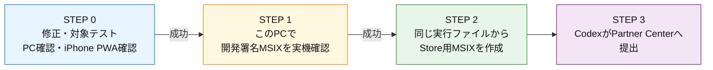
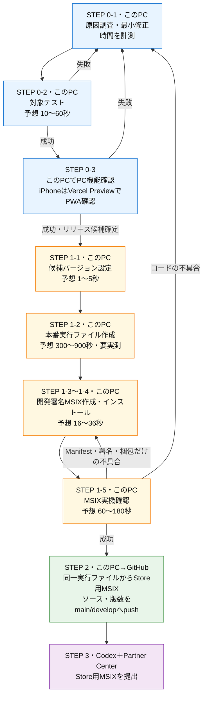

# リリース手順

## 作業開始ゲート（毎回必須）

リリースに関する操作を始める前に、作業者は必ずこの手順書を最初から確認する。

1. 現在のSTEP番号、実施場所、入力ファイル、出力先を確認する。
2. ユーザーへの進捗報告は、この手順書のSTEP番号で統一する。
3. 手順にない保存場所、URL、ビルド方法、テスト方法をその場で作らない。
4. 新しい決定が必要になった場合は、実行前にこの手順書へ保存場所と具体的手順を追記する。
5. 同じ成果物が既に存在する場合は、実行中プロセス、保存先、完了状態を確認し、未完了の場合だけ再実行する。

通常のアプリ開発とMicrosoft Store公開は、次の4ステップで運用する。**通常公開の前に、このPCで開発署名したMSIXを実機確認する。**

GitHub Release、Gitタグ、Winget公開、GitHub ActionsからのMicrosoft Store自動提出は行わない。旧利用者の移行のため、GitHub Release `v5.0.0` の資産だけは保持する。

## 通常開発のブランチ運用（すべての開発で必須）

機能追加、不具合修正、文書変更は、次の手順で`develop`へ統合する。通常開発の統合とMicrosoft Storeへの正式リリースは別工程として扱う。

### 方針と理由

- 現在の開発はこのPCを中心に1つの作業環境で行うため、実装のたびにリモート機能ブランチ、Pull Request、重複CIを作ると、待ち時間と管理作業だけが増える。通常開発はローカルで完結させる。
- ローカルでもGitの作業ブランチとコミットを使い、`develop`から変更を分離する。失敗時は作業ブランチ内で戻せるため、速度のために履歴や復旧性を捨てない。
- `develop`へ入れる前に、このPCで対象テスト、型検査、必要な実機確認を済ませる。未検証の変更を共有ブランチへ入れない。
- GitHubは開発環境ではなく、確認済みソースの共有・保管、統合後CI、Vercel Previewの起点としてだけ使う。そのためGitHubへの通常の送信は、ローカル統合後の`develop` 1回に限定する。
- Pull Requestは、複数人レビュー、並行開発、またはユーザーが明示的に必要とした場合の仕組みとする。1人・1PC中心の通常開発では既定手順にしない。
- Markdownなど文書だけの軽微な修正は、分離による利点よりブランチ管理の手間が大きいため、ローカル`develop`で直接修正してよい。アプリのテストは行わず、差分検査と、必要な場合だけ文書ビルド・Mermaid表示を確認する。
- MSIXの作成・確認は正式リリースのSTEP 1〜2で行う。機能実装中のSTEP 0では、変更と無関係なMSIX CIを調査・修正しない。
- `main`はMicrosoft Storeへ提出する正式版だけを保持し、通常開発の途中では変更しない。

```mermaid
flowchart LR
    subgraph LOCAL["このPC・通常開発"]
        A["ローカル developを最新化"]
        Q{"文書だけの<br/>軽微な変更か"}
        B["ローカル作業ブランチを作成"]
        C["実装・最小修正"]
        D["対象テスト・型検査"]
        E["開発版・必要な実機確認"]
        F["ローカル developへ統合"]
        K["ローカル developで<br/>文書だけ修正"]
        L["差分検査<br/>必要時だけ文書表示確認"]
        N["原則<br/>機能ブランチはpushしない<br/>PRは明示依頼時だけ"]

        A --> Q
        Q -->|いいえ| B --> C --> D --> E
        Q -->|はい| K --> L
        D -->|失敗| C
        E -->|失敗| C
        E -->|合格| F
        B -. 方針 .-> N
    end

    subgraph REMOTE["GitHub・統合後だけ"]
        G["developだけを1回push"]
        H["変更対象に必要なCI"]
        I["Web API・PWA変更時だけ<br/>Vercel Preview確認"]
        J["通常開発完了"]

        G --> H
        H -->|PC機能のみ| J
        H -->|Web API・PWAあり| I --> J
    end

    F --> G
    L --> G

    style A fill:#e8f4ff,stroke:#1976d2,color:#111
    style Q fill:#fff8e1,stroke:#f57c00,color:#111
    style B fill:#e8f4ff,stroke:#1976d2,color:#111
    style C fill:#e8f4ff,stroke:#1976d2,color:#111
    style D fill:#e8f4ff,stroke:#1976d2,color:#111
    style E fill:#e8f4ff,stroke:#1976d2,color:#111
    style F fill:#e8f4ff,stroke:#1976d2,color:#111
    style K fill:#e8f4ff,stroke:#1976d2,color:#111
    style L fill:#e8f4ff,stroke:#1976d2,color:#111
    style N fill:#fff8e1,stroke:#f57c00,color:#111
    style G fill:#e8f5e9,stroke:#388e3c,color:#111
    style H fill:#e8f5e9,stroke:#388e3c,color:#111
    style I fill:#e8f5e9,stroke:#388e3c,color:#111
    style J fill:#e8f5e9,stroke:#388e3c,color:#111
```



*通常開発はこのPC内で完結させ、確認済みの`develop`だけをGitHubへ反映する。文書だけの軽微な修正はブランチとアプリテストを省略する。*

文書だけの軽微な修正では、次の1〜8に代えて、ローカル`develop`で修正、`git diff --check`、必要な文書表示確認、`develop`のpushだけを行う。アプリのユニットテスト、型検査、実機確認、リモート機能ブランチ、Pull Requestは不要とする。文書変更がコード変更に付随する場合や、実行コマンド・CI・配布設定そのものを変更する場合は軽微な文書修正に含めず、次の通常手順を使う。

1. 作業開始時にこのPCの`develop`を`origin/develop`へ合わせ、そのローカル`develop`から`codex/<作業名>`の作業ブランチを作る。
2. 機能追加・不具合修正・実行コードや設定の変更は、このPCの作業ブランチだけで行う。作業中の機能ブランチはGitHubへpushせず、Pull Requestも作らない。
3. 作業ブランチで対象テスト、型検査、必要なローカル実機確認をこのPCで完了する。確認が終わるまでGitHub ActionsやVercel Previewを開発環境として使わない。
4. 確認済みの作業ブランチを、このPC上で`develop`へマージする。`develop`へ未検証の変更を直接コミットしない。
5. ローカル統合後、GitHubへは`develop`だけを1回pushする。リモート機能ブランチとPull Requestは、ユーザーが明示的に依頼した場合だけ使用する。
6. push後は変更対象に必要な`develop`のCIだけを確認する。Web API・PWA・公開ページを変更した場合は、`develop`からデプロイされたVercel Previewでも最終確認する。STEP 0ではMSIX CIの失敗を調査・修正しない。
7. 統合後に問題が見つかった場合は、このPCの最新`develop`から新しいローカル修正ブランチを作る。修正確認後にローカル`develop`へ統合し、必要な`develop`更新だけをpushする。
8. 統合と確認が完了したローカル作業ブランチは削除する。

`main`はStoreへ提出する正式版専用とし、作業ブランチを直接マージしない。正式リリース時だけSTEP 1〜3へ進み、STEP 2で合格済みソースと版番号を`main`へ反映する。リリース用GitHub Actionsが`main`と`develop`を同期する処理は、この直接操作禁止の例外とする。

### 実施場所の定義

| 表記 | 実施場所・役割 |
|---|---|
| このPC | ローカル`develop`で通常開発し、正式リリース時は確認済みの同じコミットをローカル`main`へ反映する。ローカル`main`からTauri本番実行ファイルとMSIXを作成・確認し、Store提出物を`Documents\俺の付箋-Store提出\<バージョン>\`へ保存する |
| GitHub develop | 確認対象ソースを保管し、Vercel Previewへのデプロイ元になる。アプリを実行する場所ではない |
| Vercel Preview | GitHub developの内容を公開するiPhone PWAの確認環境 |
| iPhone | Vercel PreviewからインストールしたPWA、通知、PCとの送受信を実機確認する |
| GitHub main | `origin/main`。このPCでMSIX確認に合格したローカル`main`と同じコミットを保管する。GitHub上ではMSIXを再ビルドしない |
| Partner Center | 完成したStore用MSIXをアップロードしてMicrosoft Storeへ申請する |

### ローカルとGitHubの位置関係

```mermaid
flowchart LR
    subgraph PC["このPC<br/>D:\\Users\\uck\\Documents\\curry-project\\ore-no-fusen"]
        LD["ローカル develop<br/>STEP 0の開発・確認"]
        VC["候補バージョンを設定<br/>確認済みコミット"]
        LM["ローカル main<br/>正式リリース候補"]
        EXE["本番exeを1回作成"]
        DEV["開発署名MSIX<br/>インストール・実機確認"]
        STORE["Store用MSIX<br/>同じexeを再利用"]
        FILE["固定保存先<br/>Documents\\俺の付箋-Store提出\\&lt;版&gt;"]
        OK["STEP 2合格<br/>ソースとMSIXを確定"]

        LD --> VC
        VC -->|同じコミットを反映| LM
        LM --> EXE --> DEV
        DEV -->|合格| STORE --> FILE --> OK
        DEV -->|コード不具合| LD
    end

    subgraph GH["GitHub<br/>ore-no-fusen/ore-no-fusen"]
        OD["origin/develop<br/>開発済みソース・Preview起点"]
        OM["origin/main<br/>正式版ソースの保管"]
        NO["MSIXは作らない<br/>再ビルドしない"]
    end

    subgraph MS["Microsoft"]
        PARTNER["Partner Center<br/>Store用MSIXをアップロード"]
        PUBLIC["Microsoft Store<br/>審査・公開"]
    end

    LD -->|通常開発完了時にpush| OD
    OK -->|ローカルmainの<br/>同じコミットをpush| OM
    OK -->|正式版コミットを反映| OD
    OM -. 保管だけ .-> NO
    OK --> PARTNER --> PUBLIC

    style LD fill:#e8f4ff,stroke:#1976d2,color:#111
    style VC fill:#e8f4ff,stroke:#1976d2,color:#111
    style LM fill:#fff8e1,stroke:#f57c00,color:#111
    style EXE fill:#fff8e1,stroke:#f57c00,color:#111
    style DEV fill:#fff8e1,stroke:#f57c00,color:#111
    style STORE fill:#e8f5e9,stroke:#388e3c,color:#111
    style FILE fill:#e8f5e9,stroke:#388e3c,color:#111
    style OK fill:#e8f5e9,stroke:#388e3c,color:#111
    style OD fill:#f3e5f5,stroke:#7b1fa2,color:#111
    style OM fill:#f3e5f5,stroke:#7b1fa2,color:#111
    style NO fill:#ffebee,stroke:#c62828,color:#111
    style PARTNER fill:#f3e5f5,stroke:#7b1fa2,color:#111
    style PUBLIC fill:#f3e5f5,stroke:#7b1fa2,color:#111
```



*MSIXを作る場所はこのPCのローカル`main`。GitHubの`origin/main`は、合格した同じコミットを保管する場所であり、MSIXの作成場所ではない。*

### Codexの役割分担

| Codex | 担当範囲 | 主な作業 |
|---|---|---|
| VS Code版Codex | STEP 0〜2 | ソース修正、対象テスト、実機確認用ビルド、開発署名MSIX確認、Store用MSIX作成、`main`・`develop`反映 |
| Windows版Codex | STEP 3 | サインイン済みブラウザでPartner Centerを操作し、MSIXアップロード、日本語・英語のリリースノート更新、申請内容確認、認定提出、公開状態確認 |

通常はVS Code版CodexがSTEP 0〜2を完了し、固定保存先のStore用MSIXと実施結果をWindows版Codexへ引き継ぐ。Partner Centerの画面操作が必要なSTEP 3はWindows版Codexで行う。Windows版CodexだけでSTEP 0から一貫して作業できる場合は、同じ手順書と同じSTEP番号に従って全工程を実施してよい。

VS Code版CodexからWindows版Codexへの引き継ぎでは、少なくとも次を伝える。

- 対象バージョン
- Store用MSIXの絶対パス
- STEP 0〜2の完了状況
- 日本語・英語のリリースノートに記載する実際の変更内容

### 概要図



### 詳細図（失敗時の戻り先）



## STEP 0：原因調査・修正

1. **STEP 0-1**：このPCの最新`develop`からローカル作業ブランチを作り、そのブランチで原因を特定して最小範囲だけ修正する。作業ブランチはGitHubへpushせず、調査開始から修正完了までを計測する。
2. **STEP 0-2**：対象テストだけを実行する。予想は10〜60秒。失敗したらSTEP 0-1へ戻り、新しい試行として時間を記録する。
3. **STEP 0-3**：PC機能はこのPCの開発環境で確認する。確認後、このPCで作業ブランチを`develop`へ統合し、`develop`だけをGitHubへpushする。iPhone PWAは、その`develop`からデプロイされたVercel PreviewをiPhoneで開いて確認する。予想は30〜120秒。失敗したらこのPCの最新`develop`から新しいローカル修正ブランチを作り、STEP 0-1へ戻る。
4. 設計仕様（`docs-v2/`）と必要な手順書を更新する。

修正途中ではMSIXを作らない。通常開発はこのPCの作業ブランチをローカル`develop`へ統合し、`develop`だけをpushした後、変更対象に必要なCIとPreview確認が成功した時点で完了する。リモート機能ブランチとPull Requestは明示依頼時だけ使用し、STEP 0ではMSIX CIを調査・修正しない。正式リリースを行う場合だけSTEP 1へ進む。

## STEP 1：このPCのローカルmainでMSIXを作成・実機確認

STEP 0で確認済みのローカル`develop`へ候補バージョンを設定し、その同じコミットをこのPCのローカル`main`へ反映して`main`をチェックアウトする。GitHubの`origin/main`はまだ更新しない。以降の本番実行ファイルとMSIXは、このローカル`main`から作る。

1. **STEP 1-1**：リリース候補バージョンを先に設定する。予想は1〜5秒。
2. **STEP 1-2**：このPCで本番実行ファイルを1回作成する。現時点の予想は300〜900秒であり、実測値を必ず記録する。
3. **STEP 1-3**：STEP 1-2の実行ファイルから開発署名MSIXを作成する。梱包・署名の実測目安は約6秒。
4. **STEP 1-4**：MSIXをインストールして起動する。予想は10〜30秒。
5. **STEP 1-5**：不具合の再現手順と影響範囲を実機確認する。予想は60〜180秒。

MSIX固有の修正は、アプリを終了してからこのPCで次を実行し、開発署名MSIXを作成・インストール・起動する。

```powershell
.\packaging\msix\test-msix.ps1
```

STEP 1-1の版番号設定は、このPCで次を実行する。5ファイルを一括更新し、現在以下の版番号や不正な形式を拒否する。

```powershell
node scripts/set-release-version.mjs <X.Y.Z>
```

Store版とはパッケージIDと署名が異なるが、同じTauri実行コードとMSIX環境で、起動、保存、画像、同期をStore提出前に確認できる。Google Drive連携を確認する場合は、本番と同じ`GDRIVE_CLIENT_ID`と`GDRIVE_CLIENT_SECRET`をビルド時に使用する。

STEP 1-5で失敗した場合は、原因により戻り先を分ける。

- コードの不具合：STEP 0-1へ戻る。コード変更後はSTEP 1-2で新しい実行ファイルを作る。
- Manifest・署名・梱包だけの不具合：STEP 1-3へ戻り、合格済みの実行ファイルを再利用する。
- 再試行では、成功・失敗にかかわらず別の試行として時間を記録する。

リリースしない通常作業は、STEP 0で完了である。

### 工程別の予想時間

| 工程 | 実施場所 | 内容 | 予想時間 | 根拠 |
|---|---|---|---:|---|
| STEP 0-1 | このPC | 原因調査・最小修正 | 不具合による | 毎回実測して蓄積する |
| STEP 0-2 | このPC | 対象テスト | 10〜60秒 | 次回以降に実測更新する |
| STEP 0-3 | このPC | PC機能を開発環境で確認 | 30〜120秒 | 操作時間を含む |
| STEP 0-3 | Vercel Preview＋iPhone | iPhone PWA、通知、PCとの送受信を確認 | 操作による | GitHub developのデプロイ完了後に行う |
| STEP 1-1 | このPC | 候補バージョン設定 | 1〜5秒 | 次回以降に実測更新する |
| STEP 1-2 | このPC | 本番実行ファイル作成 | 300〜900秒 | 未計測。最優先で実測する |
| STEP 1-3 | このPC | 開発署名MSIX作成 | 約6秒 | MSIX梱包の実測値 |
| STEP 1-4 | このPC | インストール・起動 | 10〜30秒 | 次回以降に実測更新する |
| STEP 1-5 | このPC | MSIX実機確認 | 60〜180秒 | 操作時間を含む |
| STEP 2-1 | このPC | Store用MSIX作成 | 約6秒 | 同じ実行ファイルを再利用する |
| STEP 2-2 | このPC | Store用形式確認 | 約2秒 | 5項目の形式確認 |
| STEP 2-3 | このPC→GitHub main/develop | 同じソースと版数をpush | 約28秒 | 5.1.3での実測値 |
| STEP 3 | Partner Center | Store用MSIXをアップロード・申請 | 通信・審査による | Microsoft側の処理時間を含む |

### 実測時間の記録

公開バージョンごとに1行を追加し、直前バージョンとの差分を確認する。時間は不具合修正・PWA実機確認・Microsoft審査を除く、版設定からGitHub反映までのMSIXリリース工程を集計する。

| 日付 | バージョン | 結果 | リリース工程 | 前回比 | 内訳（秒） | 備考 |
|---|---|---|---:|---:|---|---|
| 26-08-11 | 5.1.4 | 申請完了 | 320秒（5分20秒）＋実機操作 | 約30分→5分20秒（約82%短縮） | 版設定1、exe作成273、Dev MSIX 7、導入7、Store MSIX 6、検証1、GitHub反映25 | 合格済みexeを再利用。前回値は約30分の概算 |
| 26-08-16 | 5.1.5 | 認定申請完了 | 546秒（9分6秒）＋実機操作 | 5.1.4比226秒増加 | exe・Dev MSIX・導入253、Store MSIX 6、検証2、pre-commit 275、develop push 5.3、main push 4.8 | 旧自動起動の再登録防止。合格済みexeをStore用MSIXへ再利用。Submission 14をCodexが申請し、認定中を確認。全テストhookが増加要因 |
| 26-08-30 | 5.2.0 | 公開完了 | 1,138秒（18分58秒）＋実機・申請操作 | 5.1.5比592秒増加 | 版設定3、誤ったフロント単体ビルド301、exe作成337、Dev MSIX・導入16、Store MSIX 7、検証3、pre-commit・統合455、GitHub反映16 | 折りたたみ機能と匿名利用状況集計。合格exeをStore用MSIXへ再利用し、Submission 16を送信。26-08-31にPartner Centerで製品更新・Store入手可能を確認 |
| 26-09-02 | 5.2.1 | STEP 2完了 | 727秒（12分7秒）＋実機操作 | 5.2.0比411秒短縮 | pre-commit・コミット331、exe・Dev MSIX・導入387、Store MSIX・検証・固定保存8 | 折りたたみ・アラームを含む完全複製を実機確認。Store申請とmain反映は未実施 |
| 26-09-06 | 5.2.2 | STEP 2完了 | 計測済み489秒＋版設定・実機・GitHub反映 | 5.2.1の合計とは計測範囲が異なるため比較なし | exe・Dev MSIX・導入481、Store MSIX・検証8 | しまった付箋の選択復元、位置・大きさ保持、一覧即時更新を実機確認。5.2.2.0、x64、未署名、合格exe一致。版設定スクリプト新設時間とGitHub反映時間は未計測 |

各試行の詳細は「補足」の「詳細試行ログ」に残す。記録が3件以上たまった工程は、直近3件の中央値を次回の予想時間にする。

### 通常作業の確認

| 確認項目 | 実施条件 |
|---|---|
| 対象テスト・型検査 | 常に実施する |
| `cargo check --locked` | Rustを確認する場合。通常修正で依存を更新しない |
| PC実機確認 | Tauri、付箋、保存、同期、ショートカットなどを変更した場合。MSIX固有の変更は開発署名MSIXで確認する |
| iPhone実機確認 | PWA、Service Worker、iPhone同期を変更した場合 |
| SW_VERSION更新 | PWA / Service Workerを変更した場合 |

`Cargo.toml` / `Cargo.lock` は通常の機能修正では変更しない。依存ライブラリを更新する場合は、機能修正と混ぜず、理由・対象・影響範囲を分けて確認する。

### アプリ本体に影響しない変更

LP、README、`docs/`だけの変更も、まず`develop`で確認する。確認後は **Do Non-App Release** で`main`へ反映する。StoreリリースのSTEP 1〜3は不要である。

## STEP 2：合格した実行ファイルからStore提出用MSIXを作る

STEP 1-5で合格した実行ファイルを、そのままStore提出用MSIXへ梱包する。GitHub上で同じ実行ファイルを再コンパイルしない。

1. **STEP 2-1**：STEP 1-2の実行ファイルから、Store用ID・未署名のMSIXを作る。予想は約6秒。
2. **STEP 2-2**：名前、発行者、バージョン、x64、未署名の5項目を確認する。予想は約2秒。
3. **STEP 2-3**：実機確認した実行ファイルに対応する同じソースと版数を`main`と`develop`へ反映する。予想は約28秒。

STEP 2の自動化は、次の条件をすべて満たすこと。

- STEP 1-5で合格した実行ファイルとStore提出物の実行ファイルが同一である。
- STEP 2ではNext.js・Rust・Tauri実行ファイルを再ビルドしない。
- STEP 0とSTEP 1で済んだテストを繰り返さない。
- 各工程の開始・終了・秒数を実測時間表へ記録する。

版番号は次の5ファイルへ自動反映される。手で変更しない。

| ファイル | 版番号 |
|---|---|
| `package.json` / `package-lock.json` | `X.Y.Z` |
| `src-tauri/Cargo.toml` / `src-tauri/Cargo.lock` | `X.Y.Z` |
| `packaging/msix/AppxManifest.xml` | `X.Y.Z.0` |

## STEP 3：CodexがMicrosoft Storeへ申請

1. **STEP 3-1（このPC）**：STEP 2で作成した`ore-no-fusen.msix`を、`D:\Users\uck\Documents\俺の付箋-Store提出\<バージョン>\ore-no-fusen.msix`へ準備する。一時フォルダやリポジトリ内には置かない。
2. **STEP 3-2（Codex＋Partner Center）**：ユーザーがCodexへStore申請を依頼する。Codexはこの手順書と`store-submission.md`を全文確認し、サインイン済みのブラウザで「俺の付箋」の新しい更新申請を作成して、固定保存先の`ore-no-fusen.msix`をアップロードする。アップロード後にファイル名、Version、Architecture、検証成功を画面で確認して保存する。
3. **STEP 3-3（Codex＋Partner Center）**：Codexは日本語・英語の「このバージョンの最新情報」を今回の版番号と実際の変更内容に更新する。あわせて既存の説明、画像、プライバシー、年齢区分、Capabilityの説明、公開設定が「変更なし」または意図した内容であることを確認する。外部公開申請を開始する直前にユーザーの明示承認を受けてから「送信して認定を受ける」を実行し、申請番号と「認定中」を確認して報告する。
4. **STEP 3-4（Microsoft Store＋このPC）**：認定・公開後、Storeからインストールまたは更新し、バージョンと起動を確認する。

CodexがPartner Centerを操作できない場合だけ、ユーザーが同じ手順を手動で行う。サインイン、MFA、CAPTCHAなど本人操作が必要な画面ではCodexは操作を止め、該当画面を開いたままユーザーへ引き継ぎ、完了後に再開する。

Partner Centerでの画面操作と確認項目は、[store-submission.md](./store-submission.md)を参照する。

## 補足

### バージョン番号

`MAJOR.MINOR.PATCH`形式を使う。

| 種別 | 用途 | 例 |
|---|---|---|
| PATCH | バグ修正 | `5.0.0` → `5.0.1` |
| MINOR | 後方互換のある機能追加 | `5.0.0` → `5.1.0` |
| MAJOR | 互換性のない大きな変更 | `5.0.0` → `6.0.0` |

### PWA / Service Worker

PWAまたはService Workerを変更した場合だけ、`worker/index.js`の`SW_VERSION`を`本体バージョン-pwa.N`形式で更新する。画面右下の`SW`表示で反映を確認する。

### 5.0.0からStore版への移行

GitHub Release `v5.0.0` の`latest.json`、MSI、NSIS、署名ファイルは、旧版利用者が5.0.0へ更新するために残す。5.1.0以降はGitHub Releaseを新規作成せず、Microsoft Store版だけを正式配布する。

### 詳細試行ログ

失敗した試行も削除せず、次回の予想時間と改善判断に使う。

| 日付 | バージョン | 試行 | 結果・失敗工程 | 0-1 | 0-2 | 0-3 | 1-1 | 1-2 | 1-3 | 1-4 | 1-5 | 2-1 | 2-2 | 2-3 | 合計秒 | 改善メモ |
|---|---|---:|---|---:|---:|---:|---:|---:|---:|---:|---:|---:|---:|---:|---:|---|
| 26-08-11 | 5.1.4-pwa.1 | 1 | 0-3失敗 |  |  | 506 | - | - | - | - | - | - | - | - | 506 | 同一通知が3件表示。復帰イベント3種の同時実行を特定 |
| 26-08-11 | 5.1.4-pwa.1 | 2 | 0-3成功 |  |  | 604 | - | - | - | - | - | - | - | - | 604 | Vercel完了12:51:10から実機確認完了まで。通知1件、SW版数も確認 |
| 26-08-11 | 5.1.4-pwa.6 | 3 | 0-3失敗・MSIX優先へ切替 |  |  |  | - | - | - | - | - | - | - | - |  | iPhoneでtouchendとlocation.assign開始を記録したが遷移なし。PWAリンク修正を保留し、ユーザー判断でMSIX作成を優先 |
| 26-08-11 | 5.1.4 | 1 | 1-5失敗 |  |  | - | 1 | 273 | 9 | 8 |  | - | - | - | 291 | 開発MSIX作成時にStartupTask拡張を削除しており、設定画面で確認不能。本番exeは合格として再利用 |
| 26-08-11 | 5.1.4 | 2 | 1-5失敗 | - | - | - | - | - | 7 | 7 |  | - | - | - | 14 | StartupTaskは登録できたがStore版とDev版が同名表示となり識別不能 |
| 26-08-11 | 5.1.4 | 3 | STEP 1成功 | - | - | - | - | - | 7 | 7 | 成功 | - | - | - | 14+操作 | Dev表示名をOre No Fusen Devへ固定。ボタンでWindows設定を開き、旧debug・Store版を無効化後の再起動でDev版の自動起動に成功 |
| 26-08-11 | 5.1.4 | 4 | STEP 2成功 | - | - | - | - | - | - | - | - | 6 | 1 | 25 | 32 | 合格済みexeを再ビルドせずStore用MSIXへ梱包。5項目とexeのSHA-256一致を確認し、同じソースをdevelop/mainへ反映 |
| 26-08-16 | 5.1.5 | 1 | 1-5失敗 |  |  |  |  | 603（1-3〜1-4込み） | - | - | 失敗 | - | - | - | 603 | MSIXレジストリ仮想化により実HKCU Runを削除できないことを実機で特定 |
| 26-08-16 | 5.1.5 | 2 | STEP 1・2成功 | - | 69 | - | - | 253（1-3〜1-4込み） | - | - | 成功 | 6 | 2 | 285 | 615+操作 | 共有`auto_start`をfalseへ移行。Dev実機・Store形式5項目・exe SHA-256一致、pre-commit全検証38件成功・5件skip、develop/main反映を確認 |
| 26-08-30 | 5.2.0 | 1 | STEP 1・2成功 | - | 547件・E2E 38件成功 | ユーザー確認成功 | 3 | 638（誤ったフロント単体301を含む） | 7 | 9 | 成功 | 7 | 3 | 471（pre-commit455を含む） | 1,138+操作 | 5.2.0.0、x64、未署名、Store用MSIX内exeのSHA-256一致。`main`・`develop`とも`9232742` |
| 26-09-02 | 5.2.1 | 1 | STEP 1・2成功 | - | 554件・E2E 38件成功 | ユーザー確認成功 | - | 387（1-3〜1-4込み） | - | - | 成功 | 8 | 同時実施 | 未実施 | 727+操作 | pre-commit・コミット331秒。5.2.1.0、x64、未署名、Store用MSIX staging exeのSHA-256一致。固定提出先へ保存 |
| 26-09-06 | 5.2.2 | 1 | 1-1失敗・安全停止 | - | - | - | 未計測 | - | - | - | - | - | - | - | 未計測 | package-lockの正規表現一致数判定を誤り、書込み前に停止。5ファイルは未変更 |
| 26-09-06 | 5.2.2 | 2 | 1-1失敗・安全停止 | - | - | - | 未計測 | - | - | - | - | - | - | - | 未計測 | Cargo.lockの対象パターン不一致で書込み前に停止。5ファイルは未変更 |
| 26-09-06 | 5.2.2 | 3 | STEP 1・2成功 | - | 対象7件・TypeScript・直前全581件成功 | ユーザー確認成功 | 未計測 | 481（1-3〜1-4込み） | - | - | 成功 | 8 | 同時実施 | 未計測 | 489+操作 | 5.2.2.0、x64、未署名、Store MSIXと合格exe一致。固定提出先へ保存。main/develop `04b1c8d` |

## 更新履歴

| No. | 日付 | 内容 |
|---:|---|---|
| 16 | 26-07-27 | Store手動提出へ切替。タグ・GitHub Release・Winget・自動Store提出を廃止し、5.0.0の移行用資産だけを保持した。 |
| 17 | 26-07-28 | 事前検証・版確定・MSIX作成を、版番号を一度だけ入力する単一ワークフローへ統合した。 |
| 18 | 26-07-28 | 開発・Store公開の運用をSTEP 1〜3へ整理し、旧手順と未実装案を削除した。 |
| 19 | 26-08-03 | 通常公開前の必須ゲートとしてパッケージフライトを追加。Store署名済みMSIXで画像保存・画像付き複製・既存データ・更新を最終確認してから公開する4ステップ運用へ変更した。 |
| 20 | 26-08-03 | Store MSIX作成の通常目標を10分以内とし、Node系検証とRust releaseテストの並列化、同一run内でのRust成果物再利用を明記した。5.1.1の緊急例外も記録した。 |
| 21 | 26-08-10 | パッケージフライトを必須手順から外し、開発署名MSIXをこのPCで作成・実機確認してからStoreへ通常申請する3ステップ運用へ変更した。 |
| 22 | 26-08-10 | STEP 0〜3の失敗時フローと工程別時間記録を追加し、実機確認済み実行ファイルをStore用MSIXへ再利用して重複ビルドしない手順へ変更した。 |
| 23 | 26-08-11 | リリース時間をバージョンごとに1行で比較する集計表を追加し、試行ごとの記録を詳細試行ログへ移動した。 |
| 24 | 26-08-16 | STEP 3をCodexによるPartner Center申請へ変更し、アップロード確認、日本語・英語のリリースノート更新、ユーザー承認、認定中の確認、本人操作が必要な場合の引き継ぎを明記した。 |
| 25 | 26-08-16 | VS Code版CodexをSTEP 0〜2、Windows版CodexをSTEP 3の担当とし、Store申請時の引き継ぎ項目を明記した。 |
| 26 | 26-09-06 | STEP 1-1でこのPCから5つの版番号ファイルだけを安全に一括更新する固定コマンドを追加した。 |
| 27 | 26-09-21 | 通常開発をこのPCのローカル作業ブランチで行い、ローカル確認後に`develop`へ統合して`develop`だけをpushする固定運用を追加した。リモート機能ブランチ・Pull Requestは明示依頼時だけとし、STEP 0でのMSIX CI調査を禁止した。`main`は正式リリース専用とした。 |
