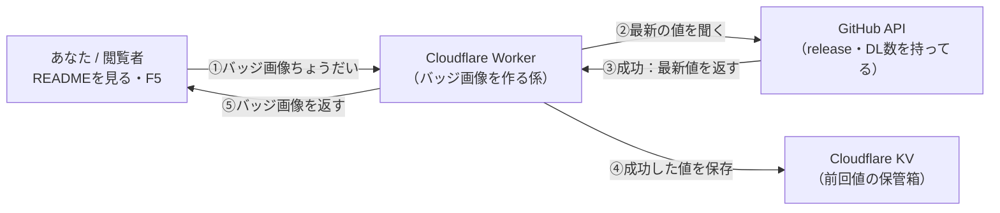
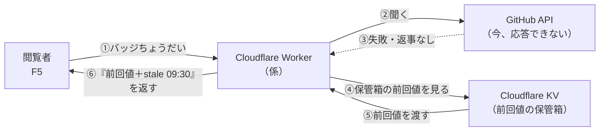
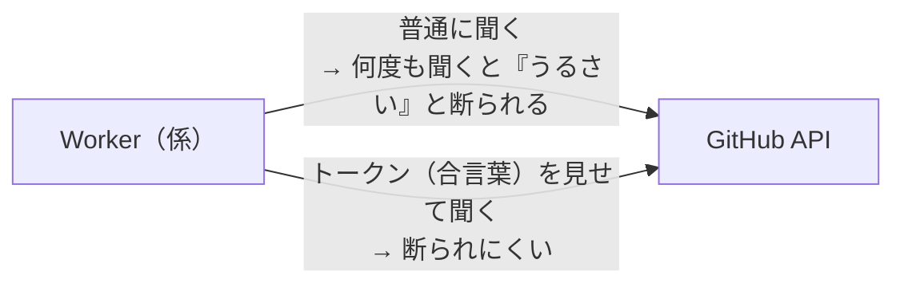

# READMEバッジ Worker セットアップガイド

> **注意**: 通常の開発・リリース作業ではこのファイルは不要。
> READMEバッジの Cloudflare Worker を**再デプロイ・再設定する時だけ**参照すること。
> このバッジ機能はアプリ本体とは無関係。止まってもアプリには一切影響しない。

---

## このWorkerが担っているもの

README 上部の`release`バッジ用SVG画像を返す。GitHub配布時代の`downloads total` / `downloads latest`はStore移行に伴いREADMEから削除した。

以前は shields.io 経由で取得していたが、shields.io 側の GitHub token pool 障害時に
READMEへエラー文言が表示される問題があったため、バッジ専用の Cloudflare Worker に切り替えた。

- 成功時: GitHub API から最新値を取得してSVGを返す（見た目は従来どおり）
- 失敗時: 前回成功値を `stale HH:mm`（JST）付きで返す
- 前回値も無い時: `unknown`（グレー）を返す

設計の経緯と動作仕様は [.planning/quick/readme-badge-worker-plan.md](../.planning/quick/readme-badge-worker-plan.md) を参照。

---

## なぜ Cloudflare なのか

「README表示時だけアクセスされる小さなAPI」を、アプリ本体（Vercel / Firebase）から
切り離して動かすため。Cloudflare Workers を使っている。

- アプリ本体と混ざらない（障害が波及しない）
- この規模なら Cloudflare の無料枠で収まる見込み（小さいJSONを数キー保存するだけ）

無料枠の条件は変わりうるので、再設定時は Cloudflare の料金ページで確認すること。

---

## 動作の流れ

### ① 成功時

GitHub に最新値を聞くのは Worker（係）。閲覧者が直接聞くわけではない。



### ② 失敗時（GitHubが答えないとき）

保管箱(KV)の前回値を `stale HH:mm` 付きで返す。READMEにエラー文言は出さない。



### ③ トークンの位置づけ

トークンは「Worker が GitHub に断られにくくするための合言葉」。
現在は**なし**で運用しているので、下図の上の経路（普通に聞く）で動いている。



---

## 構成

| 要素 | 内容 |
|------|------|
| ソース | [workers/badges/](../workers/badges/)（`src/index.js` / `wrangler.toml`） |
| Worker名 | `ore-no-fusen-badges` |
| 公開URL | `https://ore-no-fusen-badges.ore-no-fusen-g8.workers.dev` |
| KV (保管箱) | binding `BADGE_CACHE`。前回成功値の保存だけに使う |
| Cloudflareアカウント | 本プロジェクト管理者の Cloudflare アカウント（`wrangler login` でログインする） |

提供エンドポイント:

```text
/badges/release.svg
/badges/downloads-total.svg
/badges/downloads-latest.svg
```

---

## 再デプロイ手順

`wrangler`（Cloudflare公式CLI）を使う。

```bash
npm install -g wrangler        # 未インストールなら
cd workers/badges
wrangler login                 # ブラウザでCloudflareを承認
wrangler deploy
```

KV namespace を作り直す場合のみ、先に以下を実行し、出力された id を
`wrangler.toml` の `[[kv_namespaces]]` に反映してから deploy する。

```bash
wrangler kv namespace create ORE_NO_FUSEN_BADGE_CACHE            # id → wrangler.toml の id
wrangler kv namespace create ORE_NO_FUSEN_BADGE_CACHE --preview  # id → wrangler.toml の preview_id
```

---

## GitHubトークン（必要になったら設定する）

現在は**トークンなし**で運用している。public リポジトリなので、トークンが無くても
GitHub API は叩ける。コード側も `env.GITHUB_TOKEN` が無ければ付けずに動く作りになっている
（[workers/badges/src/index.js](../workers/badges/src/index.js) の `githubJson`）。

ただし無認証アクセスは GitHub の rate limit（時間あたり回数制限）が厳しい。
バッジ取得が頻繁に失敗する（＝`stale` 表示が増える）ようになったら、
read-only トークンを設定して制限を緩和する。

設定手順:

1. GitHub で fine-grained personal access token を作る（権限は public リポジトリの read のみ）
2. Worker に secret として登録する

```bash
cd workers/badges
wrangler secret put GITHUB_TOKEN
# プロンプトにトークン文字列を貼り付ける
```

secret はコードや `wrangler.toml` には書かない。Cloudflare 側に保存される。

---

## 動作確認

デプロイ後、3つのURLがSVG画像を返すか確認する（反映に数分かかることがある）。

```text
https://ore-no-fusen-badges.ore-no-fusen-g8.workers.dev/badges/release.svg
https://ore-no-fusen-badges.ore-no-fusen-g8.workers.dev/badges/downloads-total.svg
https://ore-no-fusen-badges.ore-no-fusen-g8.workers.dev/badges/downloads-latest.svg
```

ブラウザでバッジ画像が表示されればOK。

---

## ロールバック

不具合時は README のバッジURLを shields.io に戻すだけでよい。アプリ本体には影響しない。
