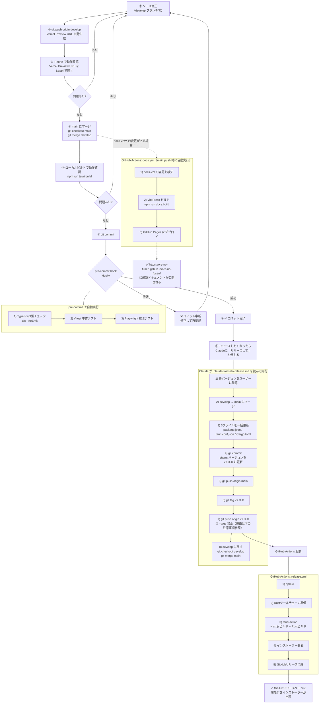

# リリース手順

## 開発からリリースまでの流れ



## develop ブランチと Vercel Preview

開発は `develop` ブランチで行い、iPhone での動作確認は Vercel Preview URL を使う。

```bash
# develop ブランチで作業
git checkout develop

# 修正後、push するだけで Vercel Preview URL が自動生成される
git push origin develop
```

Vercel のダッシュボード（vercel.com）または push 後のコメントに以下のような URL が表示される：
```
https://ore-no-fusen-git-develop-xxx.vercel.app/viewer
```

iPhone の Safari でこの URL を開いて動作確認する。

確認が取れたら main にマージしてリリースへ進む：
```bash
git checkout main
git merge develop
```

## ローカルビルド（動作確認用・署名なし）

```bash
npm run tauri build
```

> Windowsが「発行元不明」と警告を出すが動作確認には使える。配布には使わない。

## 正式リリース（署名付き）

Claude に「リリースして」と伝えるだけ。

Claude が `.claude/skills/do-release.md` を読んで以下を自動実行する：
1. 新バージョンをユーザーに確認
2. 3ファイルのバージョンを一括更新
3. バージョン更新コミット
4. タグ作成・push

GitHub Actionsが自動でビルド・署名・リリースを行う（所要時間：15〜25分）。

## ⚠️ 注意事項

### タグは必ず単体でプッシュする（do-release.md の手順が自動で守る）

```bash
# ❌ NG: 絶対にやってはいけない
git push origin main --tags
```

**なぜダメか（実際に起きた事故）:**
- `--tags` はローカルに溜まっている**未プッシュのタグを全部まとめて**送る
- 過去タグが残っていると複数タグが同時にプッシュされる
- GitHub Actions がタグの数だけ起動し、それぞれ異なるコミットでビルドが走る
- 結果: 1つのリリースに複数バージョンのインストーラーが混在し、リリースが壊れる
- → **v1.1.6 でこれが発生。リリースを削除して v1.1.7 を作り直すことになった**

```bash
# ✅ OK: タグは1個ずつ個別にプッシュする
git push origin main       # コミット履歴を送る（Actionsは動かない）
git push origin vX.X.X     # タグを送る（これがトリガーになりActionsが1回だけ起動）
```

### リリースは手動で作らない

`gh release create` や GitHub Web UI でリリースを手動作成しないこと。
`tauri-action` がビルド完了後に自動でリリースとインストーラーを作成する。
手動作成すると競合して CD が失敗する。

---

## このドキュメントの設計思想

**機械はバグる。だから人間が判断できる情報を残す。**

具体的には以下の考えに基づいて書いている。

**1. 人と機械の作業を明確に分ける**
何を人間がやり、何を機械がやるかを明示する。
さらに「なぜそこで分けたか」も書く。理由がないと、次に問題が起きたとき境界線を変えていいのか判断できない。

**2. 絵で示す**
文章だけでは流れが頭に入りにくい。フローチャートにすることで、自分が今どのステップにいるか・何が起きているかを視覚的に把握できる。

**3. 禁止事項とその理由をセットで書く**
「〜してはいけない」だけでは、状況が変わったとき守るべきかどうか判断できない。理由があれば応用が利く。

**4. 具体的な痛みを書く**
抽象的な注意書きは忘れる。「v1.1.6でこれが発生して作り直した」という事実が書いてあると、記憶に残り、次に同じミスをしにくくなる。
