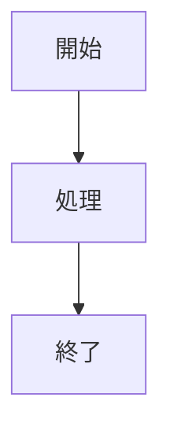

# 俺の付箋 ユーザーガイド

ore-no-fusenの詳しい使い方を説明します。

## 📖 目次

1. [はじめに](#はじめに)
2. [インストール](#インストール)
3. [基本的な使い方](#基本的な使い方)
4. [高度な使い方](#高度な使い方)
5. [iPhone連携](#iphone連携)
6. [トラブルシューティング](#トラブルシューティング)

---

## はじめに

### ore-no-fusenとは

ore-no-fusenは、Markdownで書けるデスクトップ付箋アプリです。
「大事なことは貼っておけばいいと思うよ」というコンセプトで、書くまでの速度と、デスクトップに残り続ける存在感を最優先に設計しています。

### 主な特徴

- **すぐ書ける**: 起動・編集まで最速。クリックした場所からすぐ入力開始
- **Markdownサポート**: 見出し、リスト、コードブロックなど
- **フォーマットバー**: テキスト選択→ワンボタンで太字・見出し・箇条書き・チェック
- **タグ・アーカイブ**: 付箋を整理して管理
- **高速検索**: 全文検索で瞬時に目的の付箋を発見
- **ピン留め**: 常に最前面に表示
- **アラーム**: 付箋に時刻を設定して通知
- **iPhone連携**: iPhoneで書いた内容をPCに送信（Google Drive経由）
- **VideoDrop**: iPhone/iPad から動画を PC に送信（Windows ユーザー向け AirDrop 的な使い方）
- **システムトレイ統合**: 常駐して、いつでもアクセス可能
- **自動起動**: システム起動時に自動で立ち上がる

---

## インストール

### システム要件

- **OS**: Windows 10/11 (64-bit)
- **容量**: 約 100MB
- **メモリ**: 4GB以上推奨

### インストール手順

1. **ダウンロード**
   - [Releases ページ](https://github.com/ore-no-fusen/ore-no-fusen/releases)を開く
   - 最新版の `ore-no-fusen_x.x.x_x64-setup.exe` をダウンロード

2. **インストール**
   - ダウンロードしたファイルをダブルクリック
   - インストーラーの指示に従う
   - 「インストール」ボタンをクリック

3. **初回起動**
   - インストール完了後、スタートメニューから「俺の付箋」を起動
   - システムトレイにアイコンが表示されます

### 初回起動時の設定

初回起動時に、以下の設定を確認できます:

- **自動起動**: システム起動時に自動で立ち上げるか
- **効果音**: 付箋の作成・保存・削除時に音を鳴らすか
- **データ保存場所**: デフォルトは `C:\Users\[ユーザー名]\AppData\Roaming\ore-no-fusen`

---

## 基本的な使い方

### 付箋の作成

1. **新規作成**
   - システムトレイのアイコンを右クリック
   - 「新しい付箋」を選択
   - または、ショートカットキー `Ctrl+N` を使用

2. **タイトルと内容を入力**
   - 1行目がタイトルになります
   - 2行目以降が本文です

3. **保存**
   - 自動保存されます

### 付箋の編集

1. **編集モードに入る**
   - 付箋をダブルクリック（クリックした場所からすぐ入力開始）

2. **内容を編集**
   - Markdownで記述できます
   - テキストを選択すると、選択範囲の上に**フォーマットバー**が表示されます
     - **B**: 太字
     - **H1**: 見出し1
     - **≡**: 箇条書き
     - **☑**: チェックボックス

3. **編集を終了**
   - 付箋の外側をクリック
   - または、`Esc` キーを押す

### 付箋の削除

1. 付箋を右クリック
2. 「削除」を選択
3. 確認ダイアログで「はい」をクリック

> **注意**: 削除した付箋は復元できません。

### Markdownの基本

```markdown
# 見出し1
## 見出し2

**太字**
*斜体*

- リスト項目1
- リスト項目2
  - ネストされた項目

1. 番号付きリスト
2. 項目2

[リンク](https://example.com)

`インラインコード`
```

### タグの使い方

1. 付箋の内容に `#タグ名` を記述（例: `#仕事 #重要`）
2. 検索ウィンドウでタグをクリックして絞り込み

### 検索機能

1. システムトレイを右クリック → 「検索」を選択
2. または `Ctrl+F`
3. キーワードを入力するとリアルタイムで結果が表示されます

### アーカイブ機能

- 付箋を右クリック → 「アーカイブ」で `archive/` フォルダに移動
- データ保存場所の `archive/` フォルダからファイルを戻すことで復元できます

---

## 高度な使い方

### テーブル（表）

編集モードで複数行を選択し、ツールバーの **⊞** ボタンをクリックで自動変換。または直接入力:

```markdown
| 列1 | 列2 | 列3 |
|-----|-----|-----|
| A   | B   | C   |
```

### Mermaid図

ツールバーの **🔷** ボタンで変換、または直接入力:

~~~markdown

~~~

### チェックリスト

```markdown
- [ ] 未完了タスク
- [x] 完了タスク
```

### 画像の貼り付け

- 編集モードのツールバー **📷** → Windows Snipping Toolと連携して撮影・貼り付け
- または `` で指定

### アラーム機能

付箋に時刻を設定し、時刻になると付箋が点滅・音で通知します。

1. 付箋を右クリック → **⏰ アラームを設定**
2. 「相対時間」または「日時指定」で時刻を設定
3. 時刻になると付箋が点滅し、音が鳴ります
4. 付箋をクリックするとアラームが解除されます

### ピン留め（最前面固定）

付箋ヘッダの 📌 ボタンで他のウィンドウの手前に常に表示されます。

### 全部隠す / 全部戻す

- `Ctrl+Shift+H` で全付箋を一括で隠す / 表示する
- システムトレイの右クリックメニューからも操作できます

### ショートカットキー一覧

| ショートカット | 機能 |
|--------------|------|
| `Ctrl+N` | 新しい付箋を作成 |
| `Ctrl+F` | 検索ウィンドウを開く |
| `Ctrl+B` | 太字トグル |
| `Ctrl+H` | 見出し1トグル |
| `Ctrl+L` | 箇条書きトグル |
| `Ctrl+Shift+C` | チェックボックストグル |
| `Ctrl+Shift+H` | 全付箋を隠す / 表示する |
| `Tab` | 選択行を字下げ（インデント）|
| `Shift+Tab` | 選択行を逆字下げ（アウトデント）|
| `Esc` | 編集モードを終了 |

### 設定のカスタマイズ

システムトレイのアイコンを右クリック → 「設定」から変更できます:

- **自動起動**: システム起動時に自動で立ち上げる
- **効果音**: 付箋の作成・保存・削除時に音を鳴らす
- **データ保存場所**: 付箋データの保存先を変更

### データのバックアップ

データ保存場所のフォルダをコピーして外部ドライブやクラウドストレージに保存してください。

- デフォルト: `C:\Users\[ユーザー名]\AppData\Roaming\ore-no-fusen`

復元する場合は ore-no-fusen を終了し、バックアップフォルダを元の場所に上書きしてから再起動します。

---

## iPhone連携

iPhoneで書いたメモをPCの付箋として受け取れます。
データはユーザー自身のGoogle Driveを経由するため、サービス側に付箋の内容が保存されることはありません。

> **必要なもの**: インターネット接続 + Google アカウント（基本的な付箋機能はオフラインで動作します）

### 初回セットアップ

1. PC側の設定ウィンドウを開く
2. 「iPhone連携」タブ → **Google連携を開始** をクリック
3. ブラウザが開くので、Google アカウントでログイン・許可
4. 認証完了後、iPhoneからアクセスするためのURLが表示されます

### iPhoneから付箋を送る

1. セットアップで表示されたURLをiPhoneのブラウザで開く
2. 同じ Google アカウントでログイン
3. テキスト・画像・動画を入力または添付して **「PCに送る」** をタップ
4. PCで自動的に新規付箋として開きます（約30秒以内）

### 下書き保存

**「iPhoneに置いておく」** をタップすると、送信せずにiPhone側に下書き保存されます。
下書きは履歴から再編集・送信できます。

### 画像の添付

iPhoneの 📷 ボタンからカメラロールの画像を選択できます。
画像は送信時にGoogle Driveにアップロードされ、PC側で受信後に自動削除されます。

### 動画の添付（VideoDrop）

iPhone / iPad の 🎬 ボタンから `mp4` / `mov` 動画を選択できます。
動画は選択しただけでは送信されず、現在の付箋に添付されます。
本文を書いたあと **「PCに送る」** をタップすると、本文・画像・動画がまとめてPCへ送信されます。

PC側では動画ファイルが以下に保存され、付箋本文には保存先パスが追記されます。

```txt
[データ保存場所]\assets\video\
```

動画は付箋本文を置き換えません。1行目や本文はユーザーが書いた内容のまま残り、動画は添付ファイルとして扱われます。

---

## トラブルシューティング

### 付箋が表示されない

1. システムトレイにアイコンがあるか確認
2. データ保存場所に `.md` ファイルが存在するか確認
3. ファイルが破損していないか、テキストエディタで開いて確認

### 検索が動作しない

ore-no-fusenを再起動してください。

### アラームが鳴らない

1. 設定ウィンドウで「効果音」がオンになっているか確認
2. Windowsのボリューム設定を確認

### アプリが起動しない

1. タスクマネージャーで ore-no-fusen のプロセスが残っていないか確認し、残っている場合は終了
2. ore-no-fusenを再起動
3. それでも解決しない場合は再インストール

### データが消えた

設定ウィンドウでデータ保存場所を確認し、該当フォルダに `.md` ファイルが存在するか確認してください。

### iPhone連携の認証が切れた

PC側の設定 → 「iPhone連携」タブ → 再認証ボタンでログインし直してください。

### iPhone PWA のボタンや表示が古い

PWA更新後は、画面右下の `SW` バージョンを確認してください。
修正版が反映されない場合は、PWAをいったん終了して開き直すか、Safari/Chrome側で再読み込みしてください。
開発環境では `npm run tauri dev` の再起動が必要な場合があります。

### アンインストール方法

1. システムトレイを右クリック → 「終了」
2. 「設定」→「アプリ」→「インストールされているアプリ」→「ore-no-fusen」→「アンインストール」
3. データも削除する場合は `C:\Users\[ユーザー名]\AppData\Roaming\ore-no-fusen` を手動で削除

---

## サポート

問題や機能リクエストは GitHub Issues へ:

- **GitHub Issues**: https://github.com/ore-no-fusen/ore-no-fusen/issues

---

## 更新履歴

| No | 日付 | 変更内容 |
|----|------|----------|
| 1 | 26-05-25 | VideoDrop の使い方、動画の保存場所、PWA 更新時の確認方法を追加。 |

ore-no-fusenをお使いいただき、ありがとうございます!
