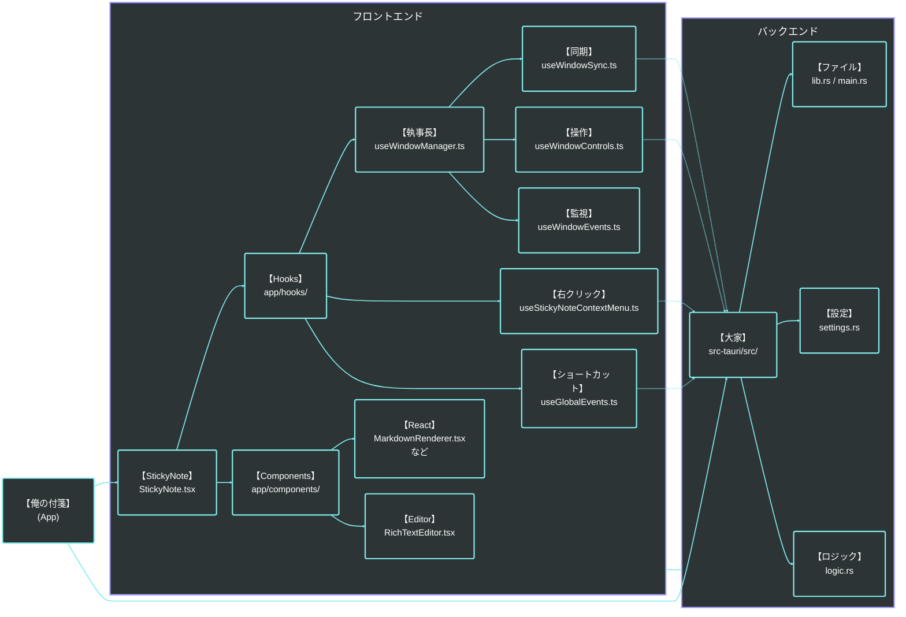
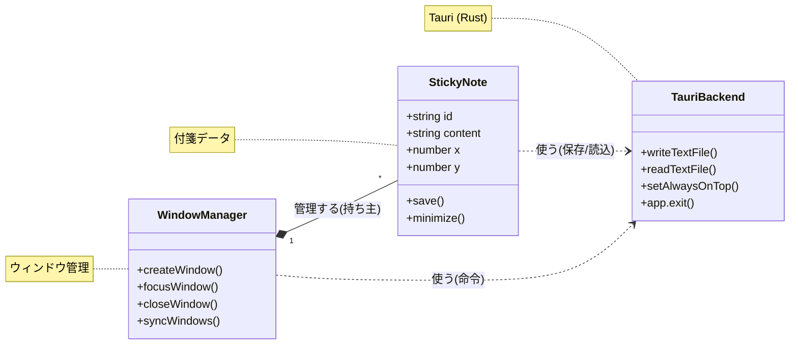
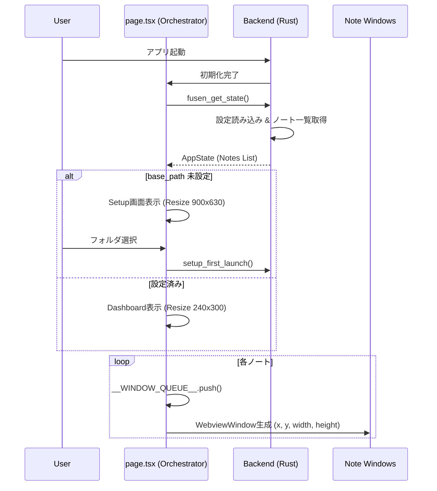
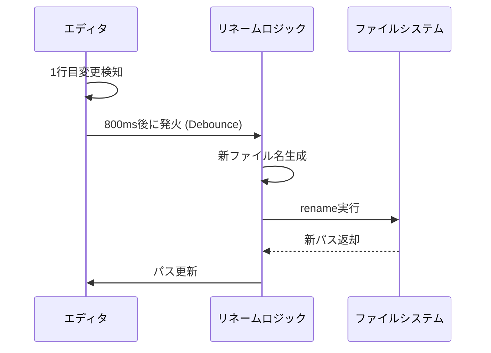
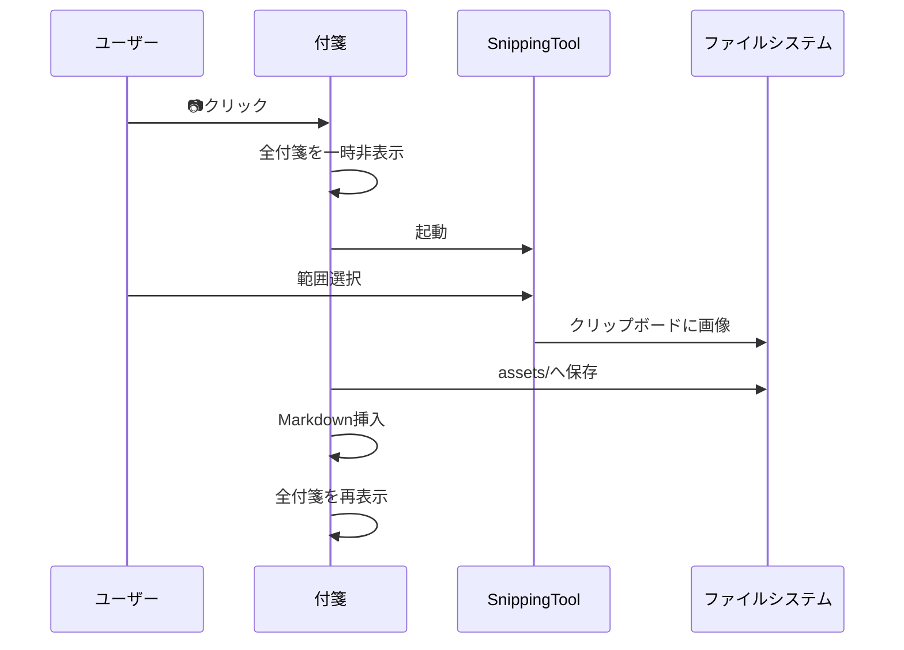
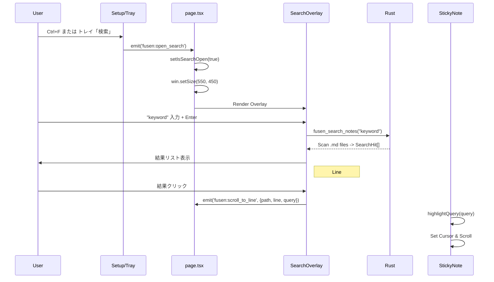
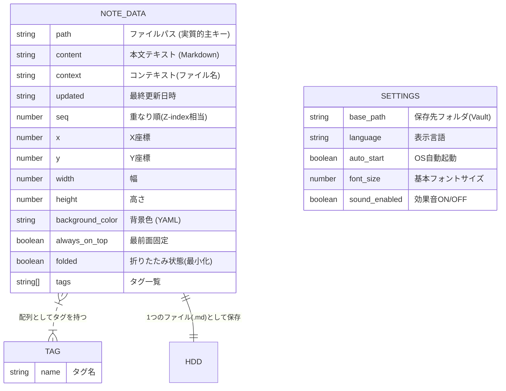

# 俺の付箋 - アーキテクチャ・設計仕様 (Architecture & Design Specifications)

本ドキュメントは、アプリケーションの主要な動作フローやシステム間連携のブロック図・シーケンス図をまとめた設計資料です。
各機能の詳細な要求仕様については `俺の付箋_要求仕様_v2.0.md` を参照してください。

---

## 0. 技術スタック (Technology Stack)

本アプリケーションは、パフォーマンスとクロスプラットフォーム対応（主にWindows最適化）を両立させるため、以下の技術を選定・活用しています。

### 0.1 アプリケーション基盤
- **フレームワーク**: Tauri v2
  - クロスプラットフォームGUI構築フレームワーク。WebviewとRustバックエンドの連携を担当。

### 0.2 フロントエンド (UI / UX)
- **コア**: React 18 / Next.js 14 (App Router)
- **言語**: TypeScript
- **スタイリング**: Tailwind CSS
- **UIコンポーネント**: Radix UI (Headless UIによるアクセシビリティ確保)
- **アイコン**: Lucide React
- **エディタ実装**: CodeMirror 6 (マークダウンハイライト、検索等の高度なテキスト操作)

### 0.3 バックエンド (Core Logic)
- **言語**: Rust (Edition 2021)
- **クリップボード連携**: `arboard` (画像等データの取得)
- **音声再生**: `rodio` (UIサウンド、通知音の提供)
- **OSネイティブ操作**: `windows` (Win32 API連携)、`tauri-plugin-os`, `tauri-plugin-global-shortcut`
- **データ永続化**: ファイルシステム (`std::fs`, `serde` によるJSON/Markdown直書き)

### 0.4 テスト・品質保証
- **フロントエンド・ロジックテスト**: Vitest (V8 Coverage)
- **E2E（UI結合）テスト**: Playwright

---

## 1. 構造図 (Architecture Diagram)
全体像としてのフロントエンドとバックエンドの関連図です。



---

## 2. クラス図 (Class Diagram)
コアとなる付箋データと各管理マネージャーの依存関係・操作フローです。



---

## 3. シーケンス図 (Sequence Diagrams)

### 3.1 アプリケーション起動シーケンス
アプリ起動から、Vaultスキャン、トレイ常駐、および前回開いていた付箋ウィンドウの復元までの流れを示します。



---

### 3.2 自動リネームフロー
本文の1行目を「コンテキストファイル名」として採用し、ユーザーのファイル管理の手間を省くための非同期リネーム処理の流れです。



---

### 3.3 画像キャプチャフロー
OS内蔵のスクリーンショットツール（Snipping Tool等）を呼び出し、撮影された画像を自動でVault内の `assets/` フォルダへ格納する流れです。



---

### 3.4 全文検索フロー
Grep同等の高速検索を行い、結果リストから対象付箋へのフォーカスとハイライトを行うまでのプロセスです。



---

## 4. ER図 (Entity-Relationship Diagram)
フロントエンドへ渡されるデータ（`NoteMeta` / `Note`）、およびバックエンド設定（`Settings`）の構造的な関係性です。（現状の実装に基づいて最適化しています）



---

## Google Drive ファイル仕様

Drive の `ore-no-fusen` フォルダ内に置かれる JSON ファイルの仕様。
**Drive はすべて中継所**であり、大本データは PC ローカル（Markdown ファイル）または iPhone ローカル（IndexedDB）にある。Drive にしか存在しないデータはない。

### ファイル一覧

| ファイル名 | 役割 | 書き込み側 | 読み込み側 |
|---|---|---|---|
| `notes_to_iphone.json` | PC→iPhone 送信キュー | PC アプリ | iPhone viewer |
| `notes_from_iphone.json` | iPhone→PC 送信キュー | iPhone viewer | PC アプリ（30秒ポーリング） |
| `push_devices.json` | iPhone のプッシュ通知デバイス登録情報 | iPhone viewer（初回セットアップ時） | PC アプリ |
| `push_keys.json` | Web Push 用 VAPID 鍵ペア | PC アプリ（初回起動時に生成） | PC アプリ（別PCへの引き継ぎ用） |

---

### notes_to_iphone.json

PC から iPhone に送った付箋データのキュー。

```json
{
  "items": [
    {
      "id": "uuid-v4",
      "title": "付箋のタイトル（frontmatter の title）",
      "body": "本文（ローカル画像は base64 data URI に変換済み）",
      "sent_at": "2026-04-08T10:00:00Z",
      "received_at": "2026-04-08T10:01:00Z"
    }
  ]
}
```

- `received_at`: iPhone viewer が受信した時刻。未受信アイテムは `received_at` なし
- ローカル画像: iPhone で表示できるよう base64 data URI に埋め込み済み
- **件数制限**: 最新 20 件のみ保持。超えた場合は古い順に削除（PC アプリ側で制御）
- **削除タイミング**: iPhone viewer でアイテムを「削除」すると Drive からも削除される

---

### notes_from_iphone.json

iPhone から PC に送った付箋データのキュー。

```json
{
  "items": [
    {
      "id": "uuid-v4",
      "title": "タイトル",
      "body": "本文（画像参照は fusen_img_*.jpg 形式）",
      "sent_at": "2026-04-08T10:00:00Z",
      "received_at": "2026-04-08T10:01:00Z",
      "tags": ["タグ1", "タグ2"]
    }
  ]
}
```

- `received_at`: PC アプリが受信した時刻。未受信アイテムは `received_at` なし
- 画像: Drive に別途アップロードされた `fusen_img_*.jpg` を参照。PC 受信後にローカル保存し Drive から削除される
- **件数制限**: なし（iPhone viewer 側で管理）
- **旧スキーマ互換**: `{ "id": "...", "title": "...", "body": "..." }` の単一オブジェクト形式も読める

---

### push_devices.json

iPhone の Web Push サブスクリプション情報。複数デバイス対応。

```json
{
  "devices": [
    {
      "endpoint": "https://api.push.apple.com/3/device/...",
      "keys": {
        "p256dh": "base64url...",
        "auth": "base64url..."
      },
      "created_at": "2026-04-08T10:00:00Z"
    }
  ]
}
```

- **件数制限**: なし（デバイスを追加するたびに upsert）
- **旧スキーマ互換**: `{ "endpoint": "...", "keys": {...} }` の単一デバイス形式も読める

---

### push_keys.json

VAPID（Voluntary Application Server Identification）鍵ペア。Web Push の送信元認証に使用。

```json
{
  "public_key_b64url": "base64url...",
  "private_key_b64url": "base64url...",
  "subject": "mailto:ore-no-fusen@example.com"
}
```

- PC ローカル（`%LOCALAPPDATA%/ore-no-fusen/push_keys.json`）にも同じ内容を保存
- Drive は別 PC への引き継ぎ用バックアップとして機能
- **再生成**: ローカルに鍵がない PC は Drive からダウンロード。Drive にもなければ新規生成して Drive にアップ
- 鍵が変わると iPhone の `push_devices.json` が無効になるため、基本的に再生成しない
