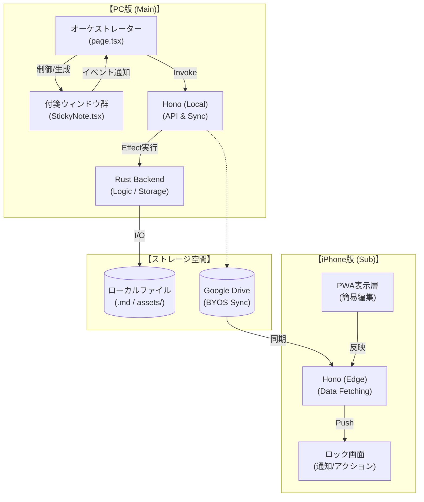
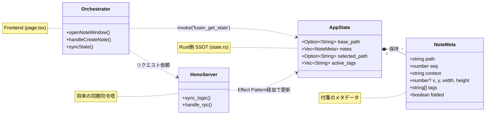
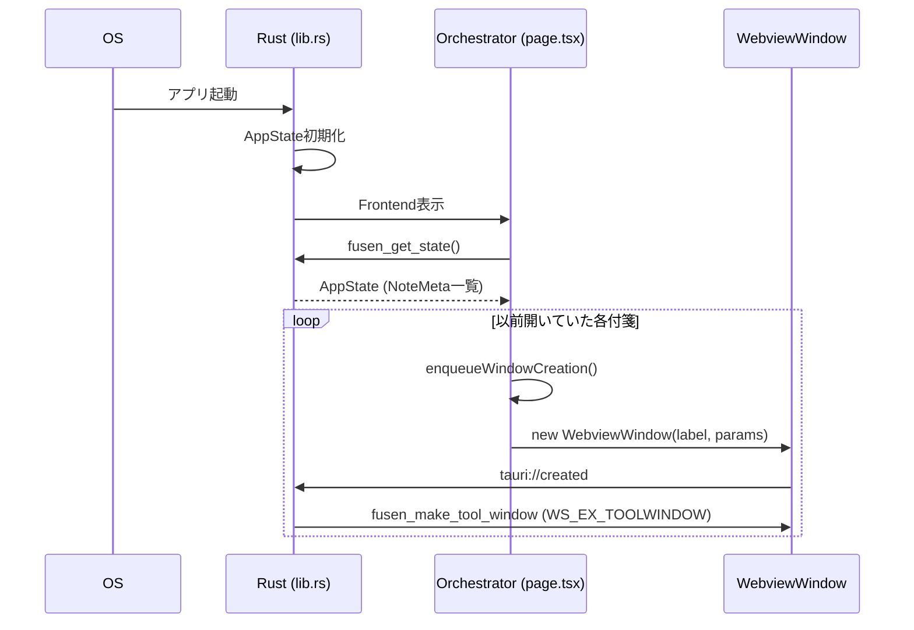
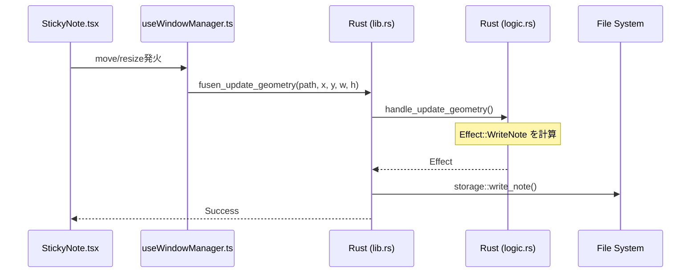
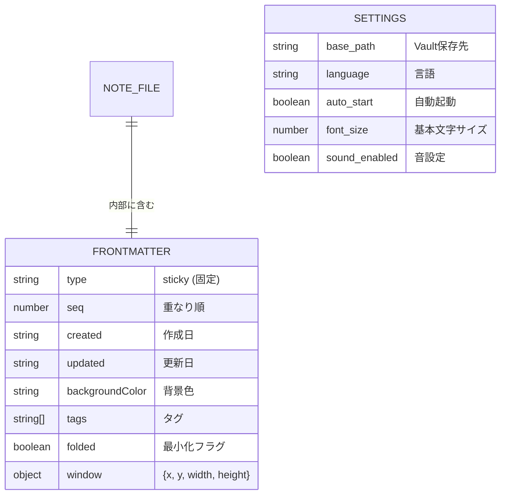

# 俺の付箋 - アーキテクチャ・設計仕様 (Architecture & Design Specifications) v1.1

本ドキュメントは、アプリケーションの主要な動作フローやシステム間連携のブロック図・シーケンス図をまとめた設計資料です。
v1.1 では、現状のソースコードに基づいた「オーケストレーター・パターン」の明文化と、将来的な iPhone 連携（PWA + Google Drive Sync）を見据えた Hono API 層の追加を反映しています。

---

## 変更履歴 (Change History)

| バージョン | 日付 | 内容 |
| :--- | :--- | :--- |
| v1.0 | 2026-02-20 | 初版作成 (Tauri + Next.js + Rust 構成) |
| v1.1 | 2026-02-24 | Hono API層、Google Drive同期 (BYOS)、iPhone PWA ロック画面通知フローの追加。現状のオーケストレーター設計の詳細反映。 |

---

## 0. 技術スタック (Technology Stack)

### 0.1 アプリケーション基盤
- **コアエンジン**: Tauri v2
  - Rust によるネイティブ機能制御と、Webview (Frontend) のブリッジ。
- **API層 / 同期司令塔**: Hono (Planned)
  - Next.js との間で型安全な通話を実現し、将来的に PC/iPhone 間での同期ロジックを共有。

### 0.2 フロントエンド (UI / UX)
- **フレームワーク**: Next.js 14 (App Router / 'use client' 多用による SPA モード)
- **状態管理**: `AppState` (Single Source of Truth)
- **PWA**: `next-pwa` (Planned for iPhone: 背景同期、ロック画面通知)

### 0.3 バックエンド (Core Logic)
- **言語**: Rust (Edition 2021)
- **設計パターン**: DOD (Data-Oriented Design) + Effect Pattern
  - ロジック層 (`logic.rs`) は純粋関数で `Effect` を返し、コマンド層 (`lib.rs`) が I/O を担当。
- **外部ストレージ**: Google Drive API (BYOS: ユーザー所有のストレージを将来的に利用)

---

## 1. 構造図 (Architecture Diagram)

PC版の「オーケストレーター」中心の設計と、Google Drive を中継点として PWA と連携する全体像です。

---

## 2. クラス図 (Class Diagram)

現状の Rust バックエンドの型定義 (`state.rs`) と、将来の Hono 統合を含めた概念図です。

---

## 3. シーケンス図 (Sequence Diagrams)

### 3.1 起動およびウィンドウ復元フロー
オーケストレーターが Rust から状態を読み込み、順次ウィンドウを復元する流れです。

### 3.2 ジオメトリ保存フロー (Effect Pattern)
付箋の移動やリサイズがどのように永続化されるかを示します。

---

## 4. ER図 (Entity-Relationship Diagram)

データの永続化構造です。`NoteMeta` の全フィールドを網羅しています。

---

## 5. iPhone 連携の詳細
- **コンセプト**: iPhone を「第二の脳（サブ機）」として、ロック画面通知で付箋を「攻め」の通知に変える。
- **データ中継**: Google Drive API を使用。Hono が PC 側で同期対象フラグが立ったノートのみを抽出してアップロード。
- **PWA 背景同期**: Service Worker を活用し、定期的に Drive をチェック、変更があれば Web Notification を発行。

---

## 6. アーキテクチャ原則
1. **SSOT (Single Source of Truth)**: Rust 側の `AppState` が常に正。
2. **純粋ロジックの分離**: ファイル名生成やパースは `logic.rs` で完結し、テスト容易性を確保。
3. **BYOS (Bring Your Own Storage)**: ユーザープライバシー重視。サーバーサイドで個人データは一切保持しない。
