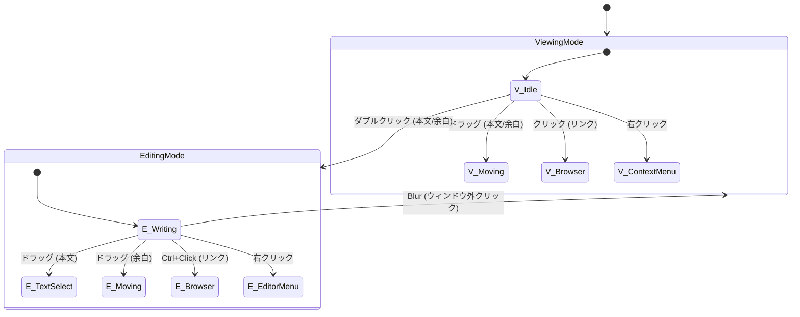

# UI インタラクション仕様書 (クリック・ドラッグ・ダブルクリック)

## 1. モード定義
このアプリケーションには大きく分けて2つのモードが存在する。

- **表示モード (Viewing)**: 付箋の内容を閲覧している状態。Markdown としてレンダリングされる。
- **編集モード (Editing)**: 付箋の内容を書き込んでいる状態。エディタが表示され、背景が半透明の白になる。

## 2. 操作場所の定義
ウィンドウ内および外部の領域を以下のように分類する。

| 場所名 | 定義 |
|:---|:---|
| **[エディタ本文]** | 文字が存在する領域。表示モードではMarkdown要素、編集モードではCodeMirrorのエディタ行。 |
| **[フッタ / 余白]** | ウィンドウ内の、文字が存在しない下部の余白領域。現在はエディタの一部として扱われる。 |
| **[リンク]** | URL (http/https) またはファイルパス (C:\...) として認識されたテキスト。 |
| **[ボタン / 入力]** | ツールバーのボタン、チェックボックス、入力フォームなどの操作可能な要素。 |
| **[ウィンドウ外]** | デスクトップ、タスクバー、他のアプリケーションウィンドウなど。 |

## 3. インタラクション・マトリックス

### 3.1 クリック (Single Click / Mouse Down)

| 場所 | 表示モード (閲覧中) | 編集モード (執筆中) |
|:---|:---|:---|
| **[エディタ本文]** | **ウィンドウ移動** (ドラッグ開始の準備) | **カーソル移動** (指定位置にカーソルを配置) |
| **[フッタ / 余白]** | **ウィンドウ移動** (ドラッグ開始の準備) | **カーソル移動** (文章の末尾にカーソルを配置) ※編集は継続される |
| **[リンク]** | **リンクを開く** (ブラウザまたはファイラー起動) | **カーソル移動** (リンクテキスト内にカーソルを配置) |
| **[ボタン / 入力]** | **ボタン操作** (ウィンドウ移動はしない) | **ボタン操作** (ウィンドウ移動はしない) |
| **[ウィンドウ外]** | **フォーカス解除** | **編集終了** (確定して表示モードへ戻る) ※`blur`イベントによる |

### 3.2 ドラッグ (Drag)

| 場所 | 表示モード (閲覧中) | 編集モード (執筆中) |
|:---|:---|:---|
| **[エディタ本文]** | **ウィンドウ移動** | **テキスト範囲選択** (文字を選択する) |
| **[フッタ / 余白]** | **ウィンドウ移動** | **ウィンドウ移動** (文字がないため選択不可、移動になる) |
| **[ボタン / 入力]** | - | - |

### 3.3 ダブルクリック (Double Click)

| 場所 | 表示モード (閲覧中) | 編集モード (執筆中) |
|:---|:---|:---|
| **[エディタ本文]** | **編集開始** (クリック位置で編集モードへ移行) | **単語選択** (エディタ標準の単語選択動作) |
| **[フッタ / 余白]** | **編集開始** (文章の末尾から編集モードへ移行) | **単語選択** (対象がないため実質無効) |

### 3.4 右クリック (Context Menu)

| 場所 | 表示モード (閲覧中) | 編集モード (執筆中) |
|:---|:---|:---|
| **[エディタ本文]** | **閲覧用メニュー** (新規作成、削除、色変更など) | **編集用メニュー** (Undo/Redo, コピー, 貼り付け, 日時挿入など) ※編集は継続される |
| **[フッタ / 余白]** | **閲覧用メニュー** | **編集用メニュー** ※編集は継続される |

### 3.5 修飾キー操作 (Modified Click)

| 操作 | 場所 | 動作 (モード共通 / 特記あり) |
|:---|:---|:---|
| **Ctrl + Click** | **[リンク] (編集モードのみ)** | **リンクを開く** (編集モード中でもリンクを開けるようにするための機能) |

## 4. 状態遷移図 (Overview)

## 5. 実装のポイントと例外処理

### A. ドラッグ判定の優先順位
`StickyNote.tsx` の `handleDragStart` において、以下のロジックで判定を行っている。

1. **インタラクティブ要素の確認**: クリックされた場所がボタン、入力欄、またはエディタ本文 (`.cm-content`) かどうかを確認。
2. **編集モード中の例外**: 
   - 「編集モード」かつ「インタラクティブ要素（エディタ本文含む）」の場合 → **ドラッグイベントをスルー**し、ブラウザ標準のテキスト選択などを優先させる。
3. **それ以外**:
   - `startDragging` を呼び出し、ウィンドウ移動を開始する。

### B. 編集終了のトリガー (Blur)
編集モードの終了確実性を高めるため、以下の2箇所のイベントを監視している。

1. **ウィンドウ全体の `blur`**: `StickyNote.tsx` で監視。ウィンドウ自体がアクティブでなくなった場合に発火。※`RichTextEditor`にフォーカスがある場合でも発火する。
2. **エディタの `blur`**: `RichTextEditor.tsx` で監視。エディタ内のテキストエリアからフォーカスが外れた場合に `handleEditBlur` を呼び出す。

この多重監視により、「ウィンドウ外をクリックした」「Alt+Tabで別アプリに移った」などの操作で確実に編集モードが終了するようになっている。
