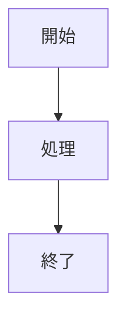

# 俺の付箋 ユーザーガイド

ore-no-fusenの詳しい使い方を説明します。

## 📖 目次

1. [はじめに](#はじめに)
2. [インストール](#インストール)
3. [基本的な使い方](#基本的な使い方)
4. [高度な使い方](#高度な使い方)
5. [トラブルシューティング](#トラブルシューティング)

---

## はじめに

### ore-no-fusenとは

ore-no-fusenは、Markdownで書けるデスクトップ付箋アプリです。
シンプルで美しいUIと、強力な機能で、あなたの思考整理をサポートします。

### 主な特徴

- **Markdownサポート**: 見出し、リスト、コードブロックなど、豊富な記法
- **タグ・アーカイブ**: 付箋を整理して管理
- **高速検索**: 全文検索で瞬時に目的の付箋を発見
- **システムトレイ統合**: 常駐して、いつでもアクセス可能
- **自動起動**: システム起動時に自動で立ち上がる
- **効果音**: 心地よいフィードバック

---

## インストール

### システム要件

- **OS**: Windows 10/11 (64-bit)
- **容量**: 約 100MB
- **メモリ**: 4GB以上推奨

### インストール手順

1. **ダウンロード**
   - [Releases ページ](https://github.com/ore-no-fusen/ore-no-fusen/releases)を開く
   - 最新版の `ore-no-fusen_x.x.x_x64-setup.exe` をダウンロード

2. **インストール**
   - ダウンロードしたファイルをダブルクリック
   - インストーラーの指示に従う
   - 「インストール」ボタンをクリック

3. **初回起動**
   - インストール完了後、スタートメニューから「俺の付箋」を起動
   - システムトレイにアイコンが表示されます

### 初回起動時の設定

初回起動時に、以下の設定を確認できます:

- **自動起動**: システム起動時に自動で立ち上げるか
- **効果音**: 付箋の作成・保存・削除時に音を鳴らすか
- **データ保存場所**: デフォルトは `C:\Users\[ユーザー名]\AppData\Roaming\ore-no-fusen`

---

## 基本的な使い方

### 付箋の作成

1. **新規作成**
   - システムトレイのアイコンを右クリック
   - 「新しい付箋」を選択
   - または、ショートカットキー `Ctrl+N` を使用

2. **タイトルと内容を入力**
   - 1行目がタイトルになります
   - 2行目以降が本文です

3. **保存**
   - 自動保存されます
   - または、`Ctrl+S` で手動保存

### 付箋の編集

1. **編集モードに入る**
   - 付箋をクリック（クリックした場所からすぐ入力開始）
   - または、付箋を右クリックして「編集」を選択

2. **内容を編集**
   - Markdownで記述できます
   - リアルタイムでプレビューが更新されます
   - テキストを選択すると、選択範囲の上に**フォーマットバー**が表示されます
     - **B**: 太字
     - **H1**: 見出し1
     - **≡**: 箇条書き
     - **☑**: チェックボックス

3. **編集を終了**
   - 付箋の外側をクリック
   - または、`Esc` キーを押す

### 付箋の削除

1. **削除する**
   - 付箋を右クリック
   - 「削除」を選択
   - 確認ダイアログで「はい」をクリック

> **注意**: 削除した付箋は復元できません。重要な内容は事前にバックアップしてください。

### Markdownの基本

ore-no-fusenでは、以下のMarkdown記法が使えます:

```markdown
# 見出し1
## 見出し2
### 見出し3

**太字**
*斜体*

- リスト項目1
- リスト項目2
  - ネストされた項目

1. 番号付きリスト
2. 項目2

[リンク](https://example.com)

`インラインコード`

\`\`\`
コードブロック
\`\`\`
```

### タグの使い方

1. **タグを追加**
   - 付箋の内容に `#タグ名` を記述
   - 例: `#仕事 #重要`

2. **タグで絞り込み**
   - 検索ウィンドウでタグをクリック
   - そのタグが付いた付箋のみが表示されます

3. **タグの管理**
   - タグは自動的にフォルダ構造で整理されます
   - データ保存場所の `tags/` フォルダで確認できます

### 検索機能

1. **検索ウィンドウを開く**
   - システムトレイのアイコンを右クリック
   - 「検索」を選択
   - または、ショートカットキー `Ctrl+F` を使用

2. **検索する**
   - 検索ボックスにキーワードを入力
   - リアルタイムで結果が表示されます

3. **検索結果から開く**
   - 検索結果をクリック
   - 該当する付箋が開きます

### アーカイブ機能

1. **付箋をアーカイブ**
   - 付箋を右クリック
   - 「アーカイブ」を選択
   - 付箋が `archive/` フォルダに移動します

2. **アーカイブを表示**
   - データ保存場所の `archive/` フォルダを開く
   - アーカイブされた付箋を確認できます

3. **アーカイブから復元**
   - アーカイブフォルダから付箋ファイルを移動
   - 元のフォルダに戻すと、再び表示されます

---

## 高度な使い方

### Markdownの高度な活用

#### テーブル（表）

2つの方法で表を作成できます：

**1. ボタンから変換**
編集モードで複数行を選択し、ツールバーの **⊞** ボタンをクリック。選択したテキスト行が自動で表に変換されます。

**2. 直接入力**
```markdown
| 列1 | 列2 | 列3 |
|-----|-----|-----|
| A   | B   | C   |
| D   | E   | F   |
```

#### Mermaid図（フローチャートなど）

2つの方法で図を作成できます：

**1. ボタンから変換**
編集モードで選択し、ツールバーの **🔷** ボタンをクリック。選択テキストがMermaid図に変換されます。

**2. 直接入力**
~~~markdown

~~~

#### チェックリスト

```markdown
- [ ] 未完了タスク
- [x] 完了タスク
```

#### 引用

```markdown
> これは引用です
> 複数行にわたって書けます
```

#### 画像の貼り付け

2つの方法で画像を挿入できます：

**1. スクリーンショット**
編集モードのツールバーから **📷** ボタンをクリック。Windows Snipping Toolと連携して画像を撮影・貼り付けできます。

**2. Markdown記法**
```markdown

```

### ショートカットキー一覧

| ショートカット | 機能 |
|--------------|------|
| `Ctrl+N` | 新しい付箋を作成 |
| `Ctrl+S` | 付箋を保存 |
| `Ctrl+F` | 検索ウィンドウを開く |
| `Ctrl+B` | 太字トグル |
| `Ctrl+H` | 見出し1トグル |
| `Ctrl+L` | 箇条書きトグル |
| `Ctrl+Shift+C` | チェックボックストグル |
| `Tab` | 選択行を字下げ（インデント）|
| `Shift+Tab` | 選択行を逆字下げ（アウトデント）|
| `Esc` | 編集モードを終了 |
| `クリック` | クリックした場所から編集開始 |

### 設定のカスタマイズ

1. **設定ウィンドウを開く**
   - システムトレイのアイコンを右クリック
   - 「設定」を選択

2. **カスタマイズ可能な項目**
   - **自動起動**: システム起動時に自動で立ち上げる
   - **効果音**: 付箋の作成・保存・削除時に音を鳴らす
   - **データ保存場所**: 付箋データの保存先を変更

### データのバックアップ

1. **バックアップ方法**
   - データ保存場所のフォルダをコピー
   - デフォルト: `C:\Users\[ユーザー名]\AppData\Roaming\ore-no-fusen`
   - 外部ドライブやクラウドストレージに保存

2. **復元方法**
   - ore-no-fusenを終了
   - バックアップしたフォルダを元の場所に上書き
   - ore-no-fusenを再起動

---

## トラブルシューティング

### 付箋が表示されない

**原因**: データファイルが破損している可能性があります

**解決方法**:
1. ore-no-fusenを終了
2. データ保存場所を確認
3. `.md` ファイルが存在するか確認
4. ファイルが破損していないか、テキストエディタで開いて確認

### 検索が動作しない

**原因**: インデックスが更新されていない可能性があります

**解決方法**:
1. ore-no-fusenを再起動
2. それでも解決しない場合は、データ保存場所の `search-index/` フォルダを削除
3. ore-no-fusenを再起動すると、インデックスが再構築されます

### 効果音が鳴らない

**原因**: 設定で効果音がオフになっている可能性があります

**解決方法**:
1. 設定ウィンドウを開く
2. 「効果音」がオンになっているか確認
3. Windowsのボリューム設定も確認

### アプリが起動しない

**原因**: システムリソース不足、または競合するアプリがある可能性があります

**解決方法**:
1. タスクマネージャーで ore-no-fusen のプロセスが残っていないか確認
2. 残っている場合は、プロセスを終了
3. ore-no-fusenを再起動
4. それでも解決しない場合は、アプリを再インストール

### データが消えた

**原因**: データ保存場所が変更された、またはファイルが移動された可能性があります

**解決方法**:
1. 設定ウィンドウでデータ保存場所を確認
2. エクスプローラーで該当フォルダを開く
3. `.md` ファイルが存在するか確認
4. バックアップがある場合は、復元を試みる

### アンインストール方法

1. **ore-no-fusenを終了**
   - システムトレイのアイコンを右クリック
   - 「終了」を選択

2. **Windowsの設定から削除**
   - 「設定」→「アプリ」→「インストールされているアプリ」
   - 「ore-no-fusen」を選択
   - 「アンインストール」をクリック

3. **データを削除（オプション）**
   - データ保存場所のフォルダを削除
   - デフォルト: `C:\Users\[ユーザー名]\AppData\Roaming\ore-no-fusen`

---

## サポート

### フィードバック・バグ報告

問題が発生した場合や、機能のリクエストがある場合は、以下の方法でお知らせください:

- **GitHub Issues**: https://github.com/ore-no-fusen/ore-no-fusen/issues
- **ディスカッション**: https://github.com/ore-no-fusen/ore-no-fusen/discussions

### コントリビューション

ore-no-fusenはオープンソースプロジェクトです。
コントリビューションを歓迎します!

- **GitHub**: https://github.com/ore-no-fusen/ore-no-fusen
- **ライセンス**: MIT License

---

ore-no-fusenをお使いいただき、ありがとうございます!🎉
