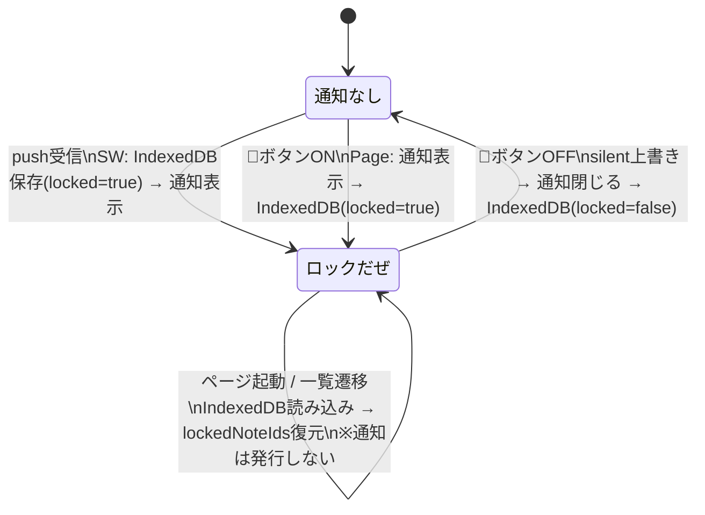

# ロックだぜ — 通知状態遷移設計書

iPhoneロック画面に付箋を固定する機能（通称「ロックだぜ」）の状態と遷移。

## 状態遷移図

## 通知発行タイミング（3箇所のみ）

| タイミング | 発行者 | 場所 |
|---|---|---|
| push受信 | SW | `worker/index.js` |
| 通知タップ後の再表示 | SW | `worker/index.js` notificationclick |
| 🔔ボタンON | Page | `useLockToggle.ts` |

## IndexedDB（fusen-drafts）の locked フラグ

| 値 | 意味 |
|---|---|
| `true` | ロックだぜ状態。通知タップ時に再表示する |
| `false` | 明示的にOFFにした状態 |
| `undefined` | Drive マージ等、lockedを知らないコードパスから保存。saveDraftが locked=true を保護する |

## 注意

- `locked=undefined` での上書きは `indexeddb.ts` の `saveDraft` が `locked=true` を保護する
- 意図的なOFF（🔔ボタンOFF）は `locked=false` を明示することで保護をバイパスする
