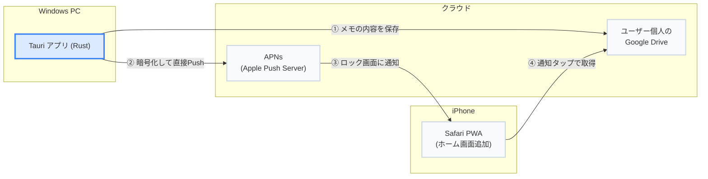
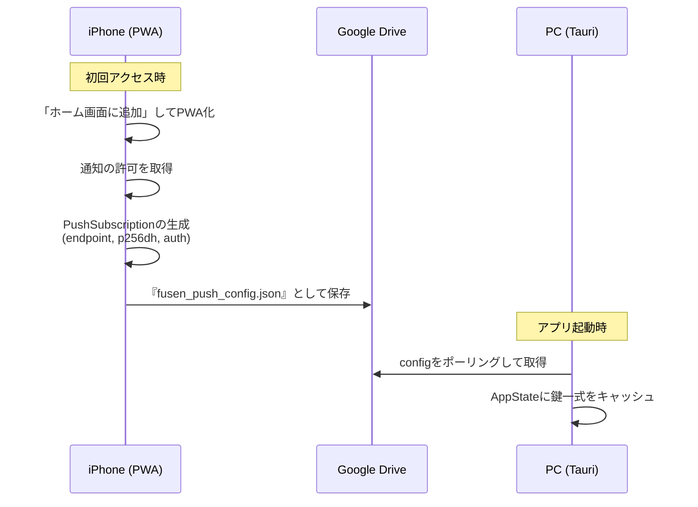
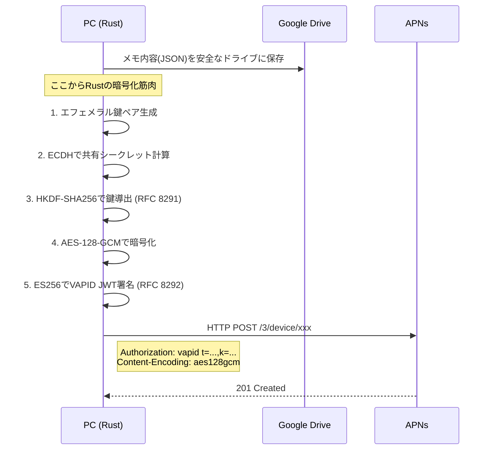
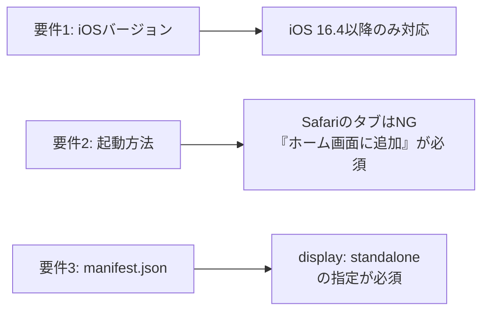

# WindowsアプリからiPhoneのロック画面に通知を飛ばすまでの全工程（中間サーバーなし）

## 概要

Windowsのデスクトップアプリ（Tauri / Rust）から、iPhoneのロック画面にプッシュ通知を送る仕組みを実装した。

一般的なWeb Pushの実装では、中継サーバー（Node.jsなど）を用意して `web-push` ライブラリを使うのが定石だが、今回は**中間サーバーを一切用意せず、Rustから直接AppleのAPNs（Apple Push Notification service）へ暗号化ペイロードを投げつける**構成にした。

- 運用コスト：**維持費 ¥0**
- 自前サーバー：**なし**（データの保存先はユーザー個人のGoogleドライブのみ）
- 速度：PCから送信して**1秒以内**にiPhoneのロックが光る

---

## 解決したかった問題

Windowsユーザーは、Appleの美しいエコシステムから締め出されている。
PCで書いたメモを、外出時にちょっとiPhoneで見たいだけなのに、その「橋」が存在しない。

「じゃあ同期アプリを作ろうか」と考えたが、同期は難しい。
そこで**「一方通行の通知」**と割り切った。PCから送って、iPhoneのロック画面に出すだけ。

---

## 全体アーキテクチャ：サーバーレスというより「中間サーバーなし」



**一番の特徴は、構成図に「自分のサーバー（API）」が存在しないこと。**
中継のデータ置き場にはユーザー自身のGoogleドライブを利用し、Push通知のトリガーはPCのアプリ（Tauri）が直接引く。ユーザーのデータが私（開発者）の管理下を一切通らない。

---

## なぜこの変態構成にしたのか？

通常、Web Pushを送るには以下の処理が必要になる。

1. **VAPID鍵によるJWT署名**（RFC 8292）
2. **AES-128-GCMによるペイロード暗号化**（RFC 8291）

これらを自前で実装するのはかなり面倒なので、BaaS（Firebaseなど）を使ったり、Node.jsサーバーを立てて `web-push` ライブラリに丸投げするのが普通だ。

しかし、個人開発のデスクトップアプリにおいて「通知のためだけにずっと維持費のかかるサーバーを運用する」のは避けたかった。
そこで、**TauriのバックエンドであるRust側にすべての暗号化仕様（RFC 8291 / 8292）を実装し、PCから直接APNsを叩く**という力技を採用した。

---

## 処理のシーケンス

### 1. 初回セットアップ（接続の確立）

iPhone側で通知を受け取る準備（サブスクリプション）を行い、その鍵情報をPCに渡すフロー。ここでも中継にはGoogle Driveを使う。



### 2. 通知の送信（たった1秒の魔法）

PCで付箋を書き「iPhoneに送る」を実行した時の内部処理。



RustからAPNsのURIへPOSTが飛んだ瞬間に、机の上のiPhoneが光る。

---

## ハマったポイント

### 1. iOSのPWAプッシュ通知の制限

iPhoneでPWAベースのプッシュ通知を受け取るには、いくつかApple特有の壁があった。



これらを満たさないと、そもそもPushManagerのSubscribeでエラー弾きされる。

### 2. Rustでの ECDSA JWT 署名の沼

VAPIDの認証には ES256 (P-256 ECDSA) でのJWT署名が必要だが、Rustの `jsonwebtoken` クレートに鍵を渡す形式で苦戦した。署名鍵の `SigningKey` から、SEC1 DERフォーマット（`to_pkcs8_der`）経由でエンコーディング鍵を生成する変換フローに辿り着くのに時間がかかった。

### 3. RFC 8291 ヘッダーの構築

暗号化後のデータをAPNsに送る際、単に暗号化するだけでなく、決まったフォーマットでバイナリを結合する必要がある。

- `salt (16バイト)`
- `record_size (4バイト)`
- `key_id_len (1バイト)`
- `key_id (65バイト)`
- `ciphertext (残り全部)`

これをRustでガリガリと `Vec<u8>` に詰め込んでいく作業は、低レイヤーを直接触っている感覚があって最高に楽しかった（と同時に、ヘッダーに1バイトの `0x02` を入れ忘れてAPNsから `400 Bad Request` を延々と食らったりもした）。

---

## おわりに

**「維持費ゼロで、ユーザーのデータを預からずに、PCから直接iPhoneを光らせる」**

このワガママな要件を通すために、Rustで RFC 8291 / 8292 の暗号化仕様を直接実装するという過激なアプローチをとった。結果として、中間サーバーの死活監視も、サーバー代の支払いにも怯えなくて済む、最強に身軽な連絡手段が完成した。

Tauri + Rust の組み合わせは、やろうと思えばこういう「本来ならサーバーサイドでやるべき重い処理」をクライアントのPCに全振りできるのが本当に面白い。

---

現在、この通信機能を持った付箋アプリはWindows向けにwingetで無料公開しています：

```
winget install ore-no-fusen
```

詳細はこちら：https://ore-no-fusen.vercel.app

*#Tauri #Rust #PWA #WebPush #APNs #個人開発 #iPhone通知*
